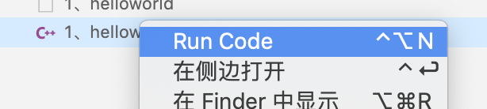
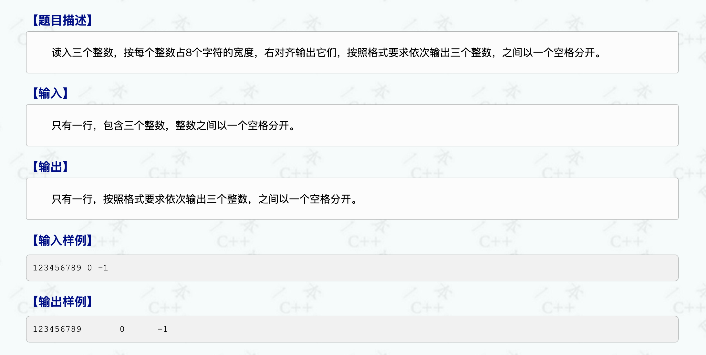
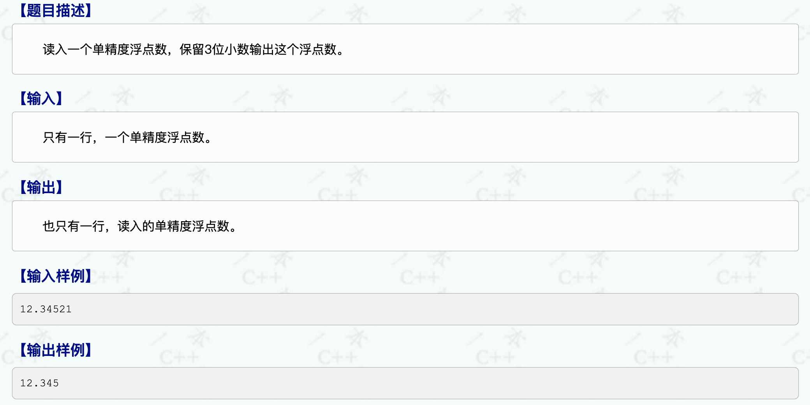
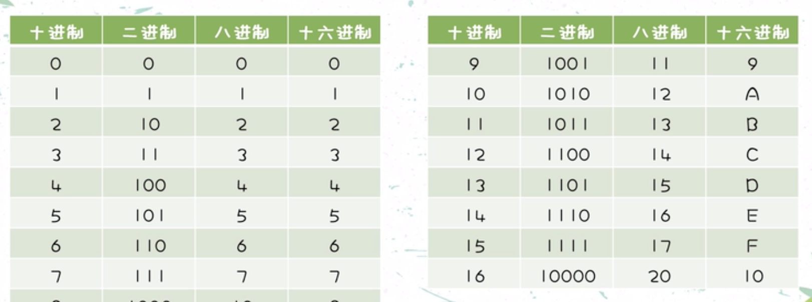

# C++基础入门

## 1、HelloWorld

使用vscode,实现 C/Cpp 代码自动补全，函数跳转。

　　打开VScode后，按下组合键“⇧⌘X”，打开扩展，输入“C/C++”，安装“C/C++”、“C/C++ Clang Command Adapter”，安装完成后，重启VScode让插件生效。之后创建文件输入main 生成模板

安装 Code Runner  这个插件，不用进行任何配置就能直接编译并运行，默认情况下使用的是GCC和G++。



- 创建项目
- 创建文件(.cpp)
- 编写代码
- 运行程序

```c++
#include <iostream>
int main(int argc,char* argv[]){
    std::cout << "helloworld" << std::endl;
    return 0;
}
```

## 2、注释

```c
//单行注释
/**/多行注释
```

## 3、变量

数据类型 变量名=数据值

```c
#include <iostream>
int main(int argc, char *argv[])
{
    int num = 100;
    std::cout << "num=" << num << std::endl;
    return 0;
}
```

## 4、常量

不可更改的数据

- `#`define 常量名 常量值 通常在文件上方定义
- const 修饰变量

```c
#include <iostream>
// 宏常量  一周7天 
#define Day 7
int main(int argc, char *argv[])
{
    // Day = 14;
    std::cout << "一周几天？" << Day << "天" << std::endl;
    const int month = 12;
    // month = 24;
    std::cout << "一年几个月？" << month << "个" << std::endl;
    return 0;
}
```

## 5、数据类型

short（短整型 -32768~32767 2字节）、int（整型 4字节）、long（长整型 window 4字节 linux32位4字节 64位8字节）、long long（长长整型 8字节）

```c
#include <iostream>
int main(int argc, char *argv[])
{
    int a = 0;
    int b = 0;
    std::cin >> a >> b;
    std::cout << "a=" << a << "b==" << b << std::endl;
    return 0;
}
```

## 6、省略命名空间

```c
#include <iostream>
// 省略命名空间 std::
using namespace std;
int main(int argc, char *argv[])
{
    int a = 0;
    int b = 0;
    cin >> a >> b;
    cout << "a=" << a << "b==" << b << endl;
    return 0;
}
```

http://ybt.ssoier.cn:8088/index.php

http://www.noi.cn/

https://www.luogu.com.cn/



```c
#include <iostream>
// 省略命名空间 std::
using namespace std;
int main(int argc, char *argv[])
{
    int a = 0;
    int b = 0;
    int c = 0;
    cin >> a >> b >> c;
    cout.width(8);
    cout << a << " ";
    cout.width(8);
    cout << b << " ";
    cout.width(8);
    cout << c << endl;
    return 0;
}
```



```c
#include <iostream>
#include <cstdio>
using namespace std;
int main(int argc, char *argv[])
{
    float number = 0;
    cin >> number;
    printf("%.3f\n",number);
    return 0;
}
```

## 常量指针

```c
const int * p = &a
指针的指向可以改变，指针指向的值不能改变
```

## 指针常量

```c
 int * const p = &a
指针的指向不可以改变，指针指向的值能改变
```

## const修饰指针和常量

```c
const int * const p = &a
指针的指向和值都不能更改
```


