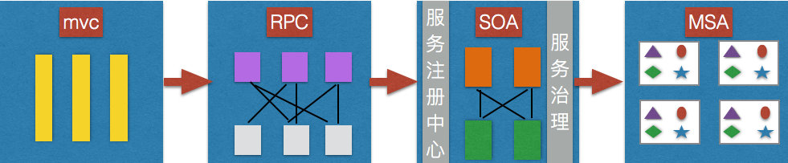

## 一、传统架构

传统的架构MVC分层，单体应用的缺点：

- 复杂的应用开发维护成本变高，部署效率逐渐降低，一个功能出现问题，整个系统就得重新打包
- 团队协作效率变差，公共功能重复开发，代码重复率太高
- 系统可靠性变差、流量、负载均衡、数据库压力变大，因为在一个进程中，如果出现内存溢出等故障，将导致整个节点崩溃，然后集群中的其他节点也会如此
- 维护和定制困难，无法随时拆分，修改一处，牵一发动全身
- 新功能上线周期变长，因为公共功能的变更导致测试工作量激增，因为重复代码多，一个地方修改需要同时修改多个地方，然后修改后继续测试
- 新功能无法独立打包测试，需要和整个系统进行一起打包，出现bug会导致整个系统重新部署，强耦合导致效率低下

## 二、RPC架构

远程过程调用协议

- 他是一种通过网路从远程计算机程序上请求服务，而不需要了解底层网路技术的协议
- RPC协议嘉定某些传输协议的存在，如TCP或UDP，为通信程序之间携带信息数据，在OSI网路通信模型中，RPC跨越了传输层和应用层。他使得开发包括网络分布式多程序在内的应用程序更加容易
- RPC采用客户机/服务器模式，请求程序就是一个客户机，而服务提供程序就是一个服务器
- 首先客户机调用进程发送一个有进程参数的调用信息到服务进程，然后等待应答信息，在服务器端，进程保持睡眠状态直到调用信息到达为止
- 当一个调用信息到达，服务器获得进程参数，计算结果，发送答复信息，然后等待下一个调用信息，最后，客户端调用进程接收答复信息，获得进程结束，然后调用执行继续进行

### 1、RPC架构分为三个部分

- 服务提供者，运行在服务器端，提供服务接口定义与服务实现类
- 服务中心，运行在服务器端，负责将本地服务发布成远程服务，管理远程服务，提供给服务消费者使用
- 服务消费者，运行在客户端，通过远程代理对象调用远程服务

### 2、RPC框架的核心技术点

- 远程服务提供者需要以某种形式提供服务的调用相关信息，包括但是不限于服务接口定义，数据结构，或者中间态的服务定义文件，服务调用者需要通过一定的途径获取远程服务的调用相关信息，例如接口的定义jar包等
- 远程代理对象：服务调用者调用的服务实际是远程服务的本地代理，对于java而言，他的实现就是jdk动态代理，通过动态代理拦截机制，将本地调用封装成远程服务调用
- 通信：RPC框架与具体的协议无关只要双方遵从约定好的即可，比如可以使http、invoke，可以是rmiinvoke，也可以是其他任意的二进制压缩协议
- 序列化：远程通信，需要将对象转成二进制数据进行网络传输，不同的是需要将数据序列化，不同的序列化框架支持的数据类型，数据包大小，异常类型或者性能都不同
- 不同的RPC框架针对的场景不同，因此技术选择也各不相同，一些框架支持多种序列化框架，甚至支持用户自定义序列化框架

### 3、RPC框架的问题

- 在大规模服务化之前，应用肯值通过RPC框架，简单的暴露和引用远程服务，通过配置的url地址进行远程调用，路由通过硬件进行简单的负载均衡
- 在服务越来越多，服务的url越来越多，管理越来越困难，负载均衡单点压力变大，此时需要一个服务的注册中心，动态的注册和发现服务，是服务位置透明，消费者在本地缓存服务提供者列表，实现软负载均衡，可以降低硬件负载的依赖，降低硬件成本
- 随着业务的发展，服务间的依赖关系变得错综复杂，甚至分不清哪个应用需要在哪个应用之前启动，需要一个分布式消息跟踪系统可视化服务调用链，用于分析，业务调用路径梳理，防止服务架构腐化
- 服务的调用量越来越大，服务的容量问题就出现了，某个服务需要多少个机器支撑，什么时候该加机器，服务上线容易下线难，上线的审批，下线的通知，需要统一的服务生命周期管理流程进行管控，不同的服务安全权限不同，如何保证敏感数据服务不被误用，服务的访问安全策略如何定制
- 服务化后随之而来的就是服务治理问题，纯粹的RPC框架服务治理能力都不强悍，需要通过服务框架+服务治理来完成

## 三、SOA服务化架构

在原来的RPC基础上加上了服务治理中心

### 微服务MSA

- 原子服务，细粒度
- 独立部署，只要是容器

### MSA与SOA的对比：

- 服务拆分粒度：
  - soa首要解决的是异构系统的服务化，微服务专注服务的拆分
- 服务依赖
  - soa只要处理已有系统，重用已有的资产，存在大量服务间依赖
  - 微服务强调服务自治，原子性，避免依赖耦合的产生
- 服务规模
  - soa服务粒度大，大多数将多个服务合并打包，因此服务实例数有限
  - 微服务强调自治，服务独立部署，导致规模膨胀，服务治理有挑战
- 架构差异
  - 微服务通常是去中心化的，soa通常是基于ESB的
- 服务治理
  - 微服务的动态治理，实施管控
  - soa通常是静态配置治理
- 交付
  - 微服务的小团队作战，再有了docker后，微服务这个概念突然火了起来，总结就是微服务+容器+DevOps

#### 架构演进历史：

