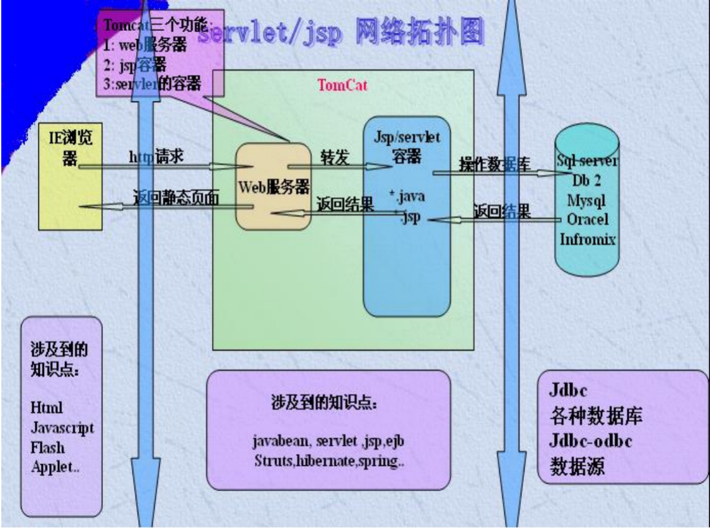

# Servlet第一课

## 一、动态网页技术的发展

|- HTML：控制网页上可以显示的内容 1993

|- CSS：样式表,设置网页的显示效果  1995

- 静态网页，不是动态数据，数据是单向的，后来出现cgi

|- Cgi:  早期技术，效率低，可以用不同的语言编写 

|- Php:Wamp + Lamp 缺乏企业级支持 

- 中小型web项目，开发速度快，java体积庞大，重
- wamp:window+apache+mysql+php
- Lamp:Linux+apache+mysql+php

|- Asp: html+asp代码+js，微软 

- 依赖数据库sqlserver

|- Servlet：早于jsp 

- sun早期开发web项目的技术
- 与jsp必须学好，之后学框架
- 8天+小项目Demo

|- Jsp： html+java片段+jsp语法+js，复杂性高于asp ，jvm class文件常驻内存 

- 底层是servlet，简单

|- Strut1: 2000年采用了MVC的设计模式开发

|- SSh2：strut2+spring+hibernate

- 出现bug

|- SSM:spring+springMVC+mybatis

- 后期路线
  - springboot
  - springcloud
  - Docker
  - 大数据
  - 前端
  - Linux

## 二、Web开发模式

### 1、C/S、B/S程序介绍

1. C/S结构，即Client/Server(客户机/服务器)结构,安全性高，效率高，需下载安装，后期维护困难 

   > 客户端----服务器结构。C/S结构在技术上很成熟，它的主要特点是交互性强、具有安全的存取模式、网络通信量低、响应速度快、利于处理大量数据。因为客户端要负责绝大多数的业务逻辑和UI展示，又称为胖客户端。它充分利用两端硬件，将任务分配到Client 和Server两端，降低了系统的通讯开销。C/S结构的软件需要针对不同的操作系统系统开发不同版本的软件，加之产品的更新换代十分快，已经很难适应百台电脑以上局域网用户同时使用。

   > C/S 架构是一种典型的两层架构，其客户端包含一个或多个在用户的电脑上运行的程序，而服务器端有两种，一种是数据库服务器端，客户端通过数据库连接访问服务器端的数据；另一种是Socket服务器端，服务器端的程序通过[**Socket**](http://blog.csdn.net/fightfaith/article/details/50055581)与客户端的程序通信。

2. B/S结构，即Browser/Server(浏览器/服务器)结构，是随着Internet技术的兴起，对C/S结构的一种变化或者改进的结构。在这种结构下，用户界面完全通过浏览器实现。

   >浏览器----服务器结构，是目前应用系统的发展方向。BS是伴随着Internet技术的兴起，对C/S架构的改进，为了区别于传统的C/S 模式，特意称为B/S模式。在这种结构下，通过W3浏览器来进入工作界面，极少部分事务逻辑在前端（Browser）实现，主要事务逻辑在服务器端（Server）实现，形成[**三层（3-tier）结构**](http://blog.csdn.net/fightfaith/article/details/49529957)。这样使得客户端电脑负荷大大简化（因此被称为瘦客户端），减轻了系统维护、升级的支出成本，降低了用户的总体成本（TCO）。

   > 　　BS的主要特点是分布性强、维护方便、开发简单且共享性强、总体拥有成本低。但数据安全性问题、对服务器要求过高、数据传输速度慢、软件的个性化特点明显降低，难以实现传统模式下的特殊功能要求。它是瘦客户端，对大量的数据输入以及报表的应答等都需要通过浏览器与服务器进行交互，通信开销大，而且对于实现复杂的应用构造有较大的困难。

   


### 2. CS、BS 对硬件环境的要求

（1）C/S 用户固定，一般只应用于局域网中，要求拥有相同的操作系统，如果对于不同操作系统还要相应开发不同的版本，并且对于计算机电脑配置要求也较高。
（2）B/S 要求有操作系统和浏览器就行，与操作系统平台无关（可以实现跨平台），对客户端的计算机电脑配置要求较低。

### 3.优缺点

- CS的优缺点

  **（1）优点：**

  　　●能充分发挥客户端PC的处理能力，很多工作可以在客户端处理后再提交给服务器，所以CS客户端响应速度快。

  　　●操作界面漂亮、形式多样，可以充分满足客户自身的个性化要求。  

  　　●C/S结构的管理信息系统具有较强的事务处理能力，能实现复杂的业务流程。

  　　●安全性能可以很容易保证，C/S一般面向相对固定的用户群，程序更加注重流程，它可以对权限进行多层次校验，提供了更安全的存取模式，对信息安全的控制能力很强。一般高度机密的信息系统采用C/S结构适宜。

  **（2）缺点：**

  　　●需要专门的客户端安装程序，分布功能弱，针对点多面广且不具备网络条件的用户群体，不能够实现快速部署安装和配置。

  　　●兼容性差，对于不同的开发工具，具有较大的局限性。若采用不同工具，需要重新改写程序。  

  　　●开发、维护成本较高，需要具有一定专业水准的技术人员才能完成，发生一次升级，则所有客户端的程序都需要改变。。

  　　●用户群固定。由于程序需要安装才可使用，因此不适合面向一些不可知的用户，所以适用面窄，通常用于局域网中。

- BS的优缺点

  **（1）优点：**

  　　●分布性强，客户端零维护。只要有网络、浏览器，可以随时随地进行查询、浏览等业务处理。 

  　　●业务扩展简单方便，通过增加网页即可增加服务器功能。  

  　　●维护简单方便，只需要改变网页，即可实现所有用户的同步更新。 

  　　●开发简单，共享性强。

  **（2）缺点：**

  　　●个性化特点明显降低，无法实现具有个性化的功能要求。 

  　　●在跨浏览器上，BS架构不尽如人意。

  　　●客户端服务器端的交互是请求-响应模式，通常动态刷新页面，响应速度明显降低（Ajax可以一定程度上解决这个问题）。无法实现分页显示，给数据库访问造成较大的压力。 

  　　●在速度和安全性上需要花费巨大的设计成本。

  　　●功能弱化，难以实现传统模式下的特殊功能要求。

 

## 三、Tomcat

安装tomcat

- 项目存储在硬盘上，class文件，别人怎么访问，提供客户一个访问方式，http协议，端口，IP地址，还需要tomcat，把本机的项目发布到外网上。

### 1、tomcat介绍

Tomcat是Apache 软件基金会（Apache Software Foundation）的Jakarta 项目中的一个核心项目，由[Apache](https://baike.baidu.com/item/Apache/6265)、Sun 和其他一些公司及个人共同开发而成。Tomcat 服务器是一个免费的开放源代码的Web 应用服务器，属于轻量级应用[服务器](https://baike.baidu.com/item/%E6%9C%8D%E5%8A%A1%E5%99%A8)，在中小型系统和并发访问用户不是很多的场合下被普遍使用，是开发和调试JSP 程序的首选。

### 2、tomcat在网络中的位置


- 客户提出请求到tomcat服务器，他帮你去访问你本机里的jsp.servlet，简单说就是程序，他会把结果返回给客户端，如果没有服务器，怎么直接访问
- tomcat的三个功能  免费
  - Web服务器
  - jsp容器
  - servlet的容器
- 服务器就这一种吗？商业版收费
  - iis微软
  - jboss
  - weblogic
- 最佳套餐
  - tomcat+mysql+java都免费
    - iis+sqlserver+.net+#c收费，都是微软的，集成非常好，没有第三方jar包，有啥用啥，没有就没办法了

### 3、Servlet/jsp网络拓扑图



## 四、Servlet

### 1、介绍

servlet（Server Applet）是Java Servlet的简称，是运行在 Web 服务器中的小型 Java 程序（即：服务器端的小应用程序）。servlet 通常通过 HTTP（超文本传输协议）接收和响应来自 Web 客户端的请求。

开发流程

- 安装tomcat

- 配置eclipse加载tomcat（看文档）

- 将tomcat与eclipse关联

- 测试安装是否成功

- 更改文件夹

- 保存更改

- 新建web项目

- 下一步，创建xml(全局配置文件)

- 启动项目，看控制台

- 查看tomcat目录webapps文件夹里有你新建的项目，这样你的项目才能让别人访问

- web.xml全局配置文件，基于xml开发，还有一种叫注解开发，2.2以后支持注解

- 文件夹目录

  1. java文件放到 java resources下src下

- 建包，介绍建包规则

  1. 为什么建包，封装继承多态，实现了封装，分层管理
  2. 访问权限修饰符
  3. 如果不建包会出错

- 新建一个class  Demo1

  - 编写servlet程序
  - servlet实现方式
    - 有三种，先讲第一种实现servlet


### 2、编写第一个servlet程序

- 写一个java类实现servlet接口

- 需要每个方法都掌握吗？不用，只要init、destroy，service

  ```java
  package com.aishang.day01;
  
  import java.io.IOException;
  
  import javax.servlet.Servlet;
  import javax.servlet.ServletConfig;
  import javax.servlet.ServletException;
  import javax.servlet.ServletRequest;
  import javax.servlet.ServletResponse;
  
  public class Demo1 implements Servlet{
  	@Override
  	public void init(ServletConfig arg0) throws ServletException {
  		// TODO Auto-generated method stub
  		System.out.println("初始化");
  	}
  
  	@Override
  	public void service(ServletRequest arg0, ServletResponse arg1) throws ServletException, IOException {
  		// TODO Auto-generated method stub
  		System.out.println("service方法");
  	}
  
  	@Override
  	public void destroy() {
  		// TODO Auto-generated method stub
  		System.out.println("销毁");
  	}
  
  	@Override
  	public ServletConfig getServletConfig() {
  		// TODO Auto-generated method stub
  		return null;
  	}
  
  	@Override
  	public String getServletInfo() {
  		// TODO Auto-generated method stub
  		return null;
  	}
  
  	
  
  }
  
  ```

  

- 修改web.xml文件，给servlet提供一个可访问的URI地址

  ```xml
  <?xml version="1.0" encoding="UTF-8"?>
  <web-app xmlns:xsi="http://www.w3.org/2001/XMLSchema-instance"
  	xmlns="http://java.sun.com/xml/ns/javaee"
  	xsi:schemaLocation="http://java.sun.com/xml/ns/javaee http://java.sun.com/xml/ns/javaee/web-app_3_0.xsd"
  	id="WebApp_ID" version="3.0">
  
  	<servlet>
  		<servlet-name>Demo</servlet-name>
  		<servlet-class>com.aishang.servlet.Demo</servlet-class>
  	</servlet>
  	<servlet-mapping>
  		<servlet-name>Demo</servlet-name>
  		<url-pattern>/demo</url-pattern>
  	</servlet-mapping>
  </web-app>
  
  ```

  

  注意：/必须写，代表应用（项目名），tomcat服务器给我们new的这个servlet

- 部署应用到tomcat服务器

- 测试：http://locahost:8080/day08_servlet/demo1

### 3、执行过程

Servlet中的Service方法是服务器调用的

### 4、生命周期

#### 实例化-->初始化-->服务->销毁

出生：（实例化-->初始化）第一次访问Servlet就出生（默认情况下）

活着：（服务）应用活着，servlet就活着

死亡：（销毁）应用卸载了servlet就销毁。

```java
//默认第一次请求时，创建Servlet实例。应用存在实例就存在，当应用被卸载了，实例就销毁了。单实例
public class ServletDemo1 implements Servlet{
	//生命周期的方法:实例化对象
	//第一次访问时调用
	public void ServletDemo1(){
		System.out.println("*********ServletDemo1被调用*********");
	}
	//生命周期的方法:实例化对象
	//第一次访问时调用
	@Override
	public void init(ServletConfig config) throws ServletException {
		System.out.println("*********init被调用*********");
	}
	//生命周期的方法：服务方法
	//接收用户请求，并作出响应
	//每次请求都被调用
	@Override
	public void service(ServletRequest req, ServletResponse res)
			throws ServletException, IOException {
		System.out.println("*********service被调用*********");		
	}
	//生命周期方法：销毁
    //当应有卸载时调用
	@Override
	public void destroy() {
		System.out.println("*********destroy被调用*********");
		
	}
}
```

- 1. 此时控制台输出init、和service方法
     1. init客户第一次访问的时候，会自动调用该方法，且该方法只调用一次
     2. service客户每次访问都会调用该方法
     3. 所以业务逻辑都写在service方法中
  2. servlet的生命周期
     1. 每一个类都有自己的构造方法
     2. 现在我没创建对象，这个init方法怎么出来的
     3. 肯定是通过创建对象，调用默认构造方法才调用init
     4. 测试，写出构造方法，里面输出一句话，我是构造方法，执行顺序是 构造方法-init-service
     5. 证明了创建了对象，谁创建的？tomcat帮你创建的
     6. 什么时间创建的？启动的时候还是访问的时候？
        1. servlet是第一个客户访问的时候创建的
        2. 第二个客户访问的时候，是否再次创建了这个对象？测试，重启服务器，第一次访问，在第二次访问，没有，如果又创建了对象，那么init肯定会输出
     7. 所以servlet是单列的，同时还是多线程（多个人访问）
     8. 什么时候死的呢？
        1. 对象销毁的时候会自动调用destroy
        2. 程序已修改就会自动加载，调用destroy


### 5、小知识点

如何让servlet在服务器启动时就创建。

 数值越小，越先加载

### 6、响应客户端

简单介绍，request、response

- 向浏览器响应h1标题

### 作业：

- 安装tomcat
- 关联eclipse
- 自己输出form表单，登录页面，跳转其他页面成功,并且显示姓名

```xml
  <role rolename="tomcat"/>
  <role rolename="role1"/>
  <role rolename="manager-gui"/>
  <user username="tomcat" password="tomcat" roles="tomcat,manager-gui"/>
  <user username="both" password="tomcat" roles="tomcat,role1"/>
  <user username="role1" password="tomcat" roles="role1"/>
```


## Talk is cheap. Show me the code 不要多BB，放码过来吧