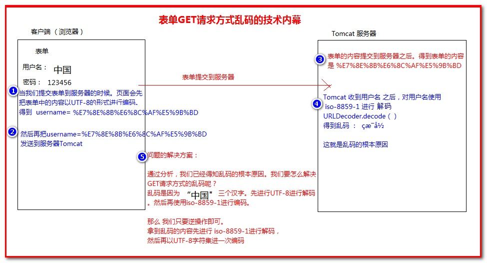

# Servlet第二课

### 一、实际开发中创建Servlet的方式

- 我们在实际开发中采取继承HttpServlet抽象类的方式创建Servlet。HttpServlet主要是应用于HTTP协议的请求和响应，为了快速开发HTTP协议的serlvet，sun提供了一个继承自GenericServlet的抽象类HttpServlet，它用于创建适合Web站点的HTTP Servlet。
- 重点关注HttpServlet中的一个私有方法service而它实现Servlet接口的service方法，是将ServletResponse对象和ServletRequest对象转化成httpServletResponse对象和HttpservletRequest对象，然后再调用私有方法service。它根据request获取Http method(get、post等)的名称，根据http method调用不同的方法执行操作。
- doGet()方法：接收客户端get方法提交的信息
- doPost()方法：接收客户端post方法提交的信息

### 案例1:继承**HttpServlet**抽象类，通过doGet()、doPost()方法，实现业务逻辑

```java
@WebServlet("/do")
public class Demo extends HttpServlet{

	@Override
	protected void doGet(HttpServletRequest req, HttpServletResponse resp) throws ServletException, IOException {
		System.out.println("doget方法");
	}

	@Override
	protected void doPost(HttpServletRequest req, HttpServletResponse resp) throws ServletException, IOException {
		System.out.println("dopost方法");
	}

}
```

- 访问：输出结果是get方法，因为地址栏访问是get方式，例如：？a=b
- 那问，如果客户请求我得写两遍啊，一个get，一个post，那怎么办？servlet里是判断了，客户怎么判断？

### 二、HttpServletRequest、HttpServletResponse接口

HttpServletRequest、HttpServletResponse接口分别实现了ServletRequest、ServletResponse接口，通过HttpServletRequest、HttpServletResponse声明了request、response对象。

\> request对象用于接收客户的请求

\> response对象用于响应客户的请求

### 三、HTTP协议概述

\> HTTP是HyperText Transfer Protocol(超文本传输协议)的简写，传输HTML文件。

\> 用于定义WEB浏览器与WEB服务器之间**交换数据**的过程及数据本身的**格式。**

- 请求部分


**1)** **请求消息行**

GET  /day08_02/1.html  HTTP/1.1

请求方式：Get（默认）  POST  DELETE  HEAD等

**GET**：明文传输 不安全，数据量有限，不超过1kb

GET /day08_02/1.html?uName=tom&pwd=123 HTTP/1.1

**POST:** 暗文传输，安全。数据量没有限制。 

**URI**：统一资源标识符。去协议和IP地址。

**2)** **请求消息头**

从第2行到空行处，都叫消息头

Accept:浏览器可接受的MIME类型 

告诉服务器客户端能接收什么样类型的文件。

Accept-Charset: 浏览器通过这个头告诉服务器，它支持哪种字符集

Accept-Encoding:浏览器能够进行解码的数据编码方式，比如gzip 

Accept-Language:浏览器所希望的语言种类，当服务器能够提供一种以上的语言版本时要用到。 可以在浏览器中进行设置。

Host:初始URL中的主机和端口 

Referrer:包含一个URL，用户从该URL代表的页面出发访问当前请求的页面 

Content-Type:内容类型

告诉服务器浏览器传输数据的MIME类型，文件传输的类型

​			application/x-www-form-urlencoded

If-Modified-Since: Wed, 02 Feb 2011 12:04:56 GMT利用这个头与服务器的文件进行比对，如果一致，则从缓存中直接读取文件。

User-Agent:浏览器类型.

Content-Length:表示请求消息正文的长度 

Connection:表示是否需要持久连接。如果服务器看到这里的值为“Keep -Alive”，或者看到请求使用的是HTTP 1.1（HTTP 1.1默认进行持久连接 

Cookie:这是最重要的请求头信息之一 (在讲会话时解析)

Date：Date: Mon, 22 Aug 2011 01:55:39 GMT请求时间GMT

**3)** **消息正文**当请求方式是POST方式时，才能看见消息正文

uName=tom&pwd=123

#### 响应部分

**1**） **响应消息行**

第一行：

HTTP/1.1   200   OK

协议/版本   响应状态码  对响应码的描述（一切正常）

响应状态码：

常用的就40多个。

200(正常)  一切正常

302/307(临时重定向)

304(未修改)

表示客户机缓存的版本是最新的，客户机可以继续使用它，无需到服务器请求。

404(找不到)  服务器上不存在客户机所请求的资源。

500(服务器内部错误)

**2**）**响应消息头**

Location: <http://www.it315.org/index.jsp指示新的资源的位置>

 		通常和302/307一起使用，完成请求重定向

Server:apache tomcat指示服务器的类型

Content-Encoding: gzip服务器发送的数据采用的编码类型

Content-Length: 80 告诉浏览器正文的长度

Content-Language: zh-cn服务发送的文本的语言

Content-Type: text/html; charset=GB2312服务器发送的内容的MIME类型

Last-Modified: Tue, 11 Jul 2000 18:23:51 GMT文件的最后修改时间

Refresh: 1;url=http://www.it315.org指示客户端刷新频率。单位是秒

Content-Disposition: attachment; filename=aaa.zip指示客户端下载文件

Set-Cookie:SS=Q0=5Lb_nQ; path=/search服务器端发送的Cookie

Expires: -1

Cache-Control: no-cache (1.1)  

Pragma: no-cache   (1.0)  表示告诉客户端不要使用缓存

Connection: close/Keep-Alive   

Date: Tue, 11 Jul 2000 18:23:51 GMT

**3**）**响应正文**

和网页右键“查看源码”看到的内容一样。

最后服务器将response返回到客户端

### 【编写示例二】通过继承**HttpServlet**抽象类，编写简单的登陆功能

```java
会发现乱码，引出中文乱码，之后再演示get的乱码
package com.aishang.day02;

import java.io.IOException;
import java.io.PrintWriter;

import javax.servlet.ServletException;
import javax.servlet.annotation.WebServlet;
import javax.servlet.http.HttpServlet;
import javax.servlet.http.HttpServletRequest;
import javax.servlet.http.HttpServletResponse;
@WebServlet("/login")
public class Login extends HttpServlet{

	@Override
	protected void doGet(HttpServletRequest req, HttpServletResponse resp) throws ServletException, IOException {
		// TODO Auto-generated method stub
		//tomcat默认是iso-8859-1的编码
		resp.setContentType("text/html;charset=utf-8");
		PrintWriter out = resp.getWriter();
		out.println("<html>");
		out.println("<head>");
		out.println("<title>");
		out.println("登录");
		out.println("</title>");
		out.println("</head>");
		out.println("<body>");
		out.println("<form action='loginOK' method='post'>");
		out.println("<input type='text' name='username'>用户名<br/>");
		out.println("<input type='password' name='password'>密码");
		out.println("<input type='submit' value='登录'>");
		out.println("</form>");
		out.println("</body>");
		out.println("</html>");
	}

	@Override
	protected void doPost(HttpServletRequest req, HttpServletResponse resp) throws ServletException, IOException {
		// TODO Auto-generated method stub
		doGet(req, resp);
	}

}

```

改造连接数据库

通过get、post解释两种区别，get明文提交。post隐式

|                  | GET                                                          | POST                                                         |
| ---------------- | ------------------------------------------------------------ | ------------------------------------------------------------ |
| 后退按钮/刷新    | 无害                                                         | 数据会被重新提交（浏览器应该告知用户数据会被重新提交）。     |
| 书签             | 可收藏为书签                                                 | 不可收藏为书签                                               |
| 缓存             | 能被缓存                                                     | 不能缓存                                                     |
| 编码类型         | application/x-www-form-urlencoded                            | application/x-www-form-urlencoded 或 multipart/form-data。为二进制数据使用多重编码。 |
| 历史             | 参数保留在浏览器历史中。                                     | 参数不会保存在浏览器历史中。                                 |
| 对数据长度的限制 | 是的。当发送数据时，GET 方法向 URL 添加数据；URL 的长度是受限制的（URL 的最大长度是 2048 个字符）。 | 无限制。                                                     |
| 对数据类型的限制 | 只允许 ASCII 字符。                                          | 没有限制。也允许二进制数据。                                 |
| 安全性           | 与 POST 相比，GET 的安全性较差，因为所发送的数据是 URL 的一部分。在发送密码或其他敏感信息时绝不要使用 GET ！ | POST 比 GET 更安全，因为参数不会被保存在浏览器历史或 web 服务器日志中。 |
| 可见性           | 数据在 URL 中对所有人都是可见的。                            | 数据不会显示在 URL 中。                                      |

### 四、编码转码

##### 编码：

- iso-8859-1不支持中文
- gbk系统默认编码，中文
- utf-8全世界通用的编码

默认情况下tomcat是iso-8859-1编码，不支持中文编码，需要手动设置编码格式


request转码：request.setCharacterEncoding("UTF-8")

response转码：response.setContentType("text/html;charset=UTF-8");

以上转码方式，只适用于post提交方式，如get提交需要字节码转码，或修改tomcat的配置文件。

post:

```java
		request.setCharacterEncoding("UTF-8");  //request转码
		response.setContentType("text/html;charset=utf-8");	 //response转码
		// 1.接收参数-->username,password
		String username = request.getParameter("username");
		String password = request.getParameter("password");
```


get:

- 修改tomcat配置文件

  /conf/server.xml

  ```xml
   <Connector port="8009" protocol="AJP/1.3" redirectPort="8443" URIEncoding="UTF-8"/>
  ```

  但是不让用，你给客户项目的时候，你能逼客户还要用tomcat吗？

```java
// 1.接收参数-->username,password
		String username = request.getParameter("username");
		String password = request.getParameter("password");	
		username = new String(username.getBytes("iso-8859-1"),"UTF-8");
```

- 错误信息回显

  - 如果登录失败，跳转至登录页面

    ```java
    else {
    			// 登录失败
    		  response.sendRedirect("/java1806/login?msg=1");
    		}
    ```

  - 在login中接收msg，判断其状态

    ```java
    if(request.getParameter("msg") != null){
    			out.print("<tr><td colspan='2'>用户名或密码错误!</td></tr>");
    		}
    ```

- 能否直接传递提示的错误信息？

  ```java
  else {
  			// 登录失败
  response.sendRedirect("/java1806/login?msg=用户名或密码错误" );
  		}
  ```

- 测试无法通过，浏览器中自动截断中文参数

- 解决方案：利用URLEncoder与URLDecoder处理

- DoLogin

  ```java
  else {
  			// 登录失败
  			String msg = "用户名或密码错误";
  			msg = URLEncoder.encode(msg, "UTF-8");
  			response.sendRedirect("/java1806/login?msg=" + msg);
  		}
  ```

- Login

  ```java
  if(request.getParameter("msg") != null){
  			String msg = request.getParameter("msg");
      		msg = URLDecoder.decode(msg, "UTF-8");
  		    msg = new String(msg.getBytes("iso-8859-1"),"UTF-8");
  			out.print("<tr><td colspan='2'>"+msg+"</td></tr>");
  		}
  ```

  

### 五、sql注入

```java
账户a ' or 'a'='a
密码a ' or 'a'='a


package com.aishang.servlet02;

import java.sql.Connection;
import java.sql.PreparedStatement;
import java.sql.ResultSet;
import java.sql.SQLException;
import java.sql.Statement;

public class UserDao {
	public boolean checkUser(String name,String password) {
		Connection connection = ConnUtil.getConnection();
		ResultSet rs = null;
		try {
			Statement statement = connection.createStatement();
			rs = statement.executeQuery("select * from tb_users where userName='"+user.getUserName()+"'and userPwd='"+user.getUserPwd()+"'");
			if (rs.next()) {
				return true;
			}
		} catch (SQLException e) {
			// TODO Auto-generated catch block
			e.printStackTrace();
		}
		return false;
	}
}
select * from user where username like concat(concat('%',#{username}),'%')
```

## 作业

- 连接数据库，进行注册、登陆功能(返回错误信息)
  - 注册成功跳转到登陆页面，注册失败返回当前页
  - (附加题:自己解决)注册成功后，跳转一个新的提示页面，显示注册成功，3秒后跳转到登录页面
  - 登陆成功跳转到提示页，登陆失败返回当前页
- 在一个页面写两个form表单，一个get提交，一个post提交，提交地址为一个servlet，保证两种提交方式都不乱码


```java
第一种html：<meta http-equiv="refresh" content="3;URL=res.html"> 
第二种servlet：response.setHeader("refresh", "5;url=https://www.baidu.com/");
```


```sh
1、请求中文乱码的处理：
--post
　　request.setCharacterEncoding("UTF-8");
--get
　　String name = new String(“中国”.getBytes（“iso-8859-1”）,“UTF-8”)

2、响应中文乱码的处理:
--①字节流:
　　 设置浏览器默认打开的编码:
　　　　resposne.setHeader(“Content-Type”,”text/html;charset=UTF-8”);
　　设置中文字节取出的时候编码.
　　　　 “中文”.getBytes(“UTF-8”);
--② 字符流:
　　 设置浏览器打开的时候的编码
 　　　　resposne.setHeader(“Content-Type”,”text/html;charset=UTF-8”);
 　　设置response的缓冲区的编码
 　　　　response.setCharacterEncoding(“UTF-8”);

　　**简化的写法

　　　　response.setContentType(“text/html;charset=UTF-8”);
```

 乱码的根本原因是什么呢？
（打开tomcat下doc工程/index.html文件——Configuration—-HTTP 搜索 URIEncoding)

图3

解决乱码的核心代码：

解决乱码的核心思路，就是把得到的乱码按照原来乱码的步骤逆序操作。

1、先以iso-8895-1进行解码

2、然后再以utf-8进行编码

1) 第一种方式 使用URLEncoder 和 URLDecoder 两个类 编解码

如：

```
//获取客户端传递过来的用户名参数值
    String username = request.getParameter("username");
    System.out.println("用户名:" + username);

    // 先对用户名进行解码得到%E7%8E%8B%E6%8C%AF%E5%9B%BD 这样的形式
    username = URLEncoder.encode(username, "ISO-8859-1");

    // 再进行utf-8编码 一次得到页面上输入的文本内容
    username = URLDecoder.decode(username, "UTF-8");
    System.out.println("乱码解决后用户名：" + username);
12345678910
```

2) 第二种方式 使用 String类的方法进行编解码

```
    username = new String(username.getBytes("ISO-8859-1"), "UTF-8");
    System.out.println("乱码解决后用户名：" + username);
12
```

解决乱码的代码如下：

```
public class Params2 extends HttpServlet {
private static final long serialVersionUID = 1L;

protected void doGet(HttpServletRequest request,
        HttpServletResponse response) throws ServletException, IOException {

    //获取客户端传递过来的用户名参数值
    String username = request.getParameter("username");
    System.out.println("用户名:" + username);


    // 先对用户名进行编码得到%E7%8E%8B%E6%8C%AF%E5%9B%BD 这样的形式
    //  username = URLEncoder.encode(username, "ISO-8859-1");

    //再进行utf-8解码 一次得到页面上输入的文本内容
    //  username = URLDecoder.decode(username, "UTF-8");

    //      System.out.println("乱码解决后用户名：" + username);

    // 先iso-8859-1编码，再utf-8解码       
    username = new String(username.getBytes("ISO-8859-1"), "UTF-8");

    System.out.println("乱码解决后用户名：" + username);


    // 获取密码
    String password = request.getParameter("password");
    System.out.println("密码：" + password);
}

}
12345678910111213141516171819202122232425262728293031
```

#### 二、POST请求中文参数值乱码问题解决

post请求方式乱码的原因是：

因为post是以二进制流的形式发送到的服务器。服务器收到数据后。

默认以iso-8859-1进行编码。

POST请求乱码解决，只需要在获取请求参数之前调用