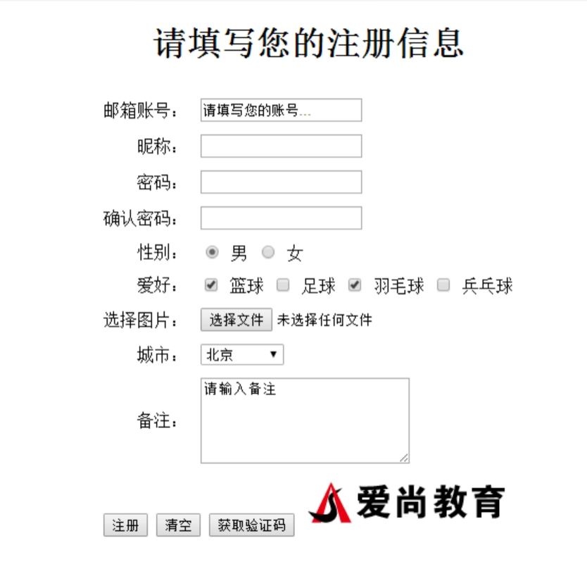
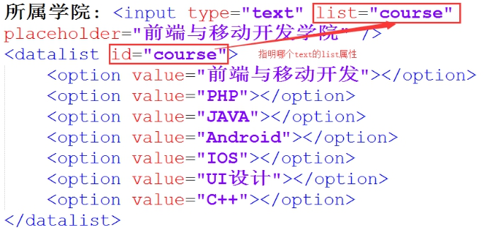

- l placeholder 占位符
- l autofocus 获取焦点
- l required 必填项

框架页

```html
<!DOCTYPE html>
<html lang="en">
<head>
    <meta charset="UTF-8">
    <meta name="viewport" content="width=device-width, initial-scale=1.0">
    <meta http-equiv="X-UA-Compatible" content="ie=edge">
    <title>Document</title>
</head>

<frameset rows="80,*">
    <frame src="top.html" noresize>
    <frameset cols="200,*">
        <frame src="left.html" noresize>
        <frame src="tiyu.html" name="right">
    </frameset>
</frameset>

</html>
```

```html
<!DOCTYPE html>
<html lang="en">
<head>
    <meta charset="UTF-8">
    <meta name="viewport" content="width=device-width, initial-scale=1.0">
    <meta http-equiv="X-UA-Compatible" content="ie=edge">
    <title>left</title>
</head>
<body>
    <a href="tiyu.html" target="right">体育</a>
    <a href="yule.html" target="right">娱乐</a>
</body>
</html>
```

