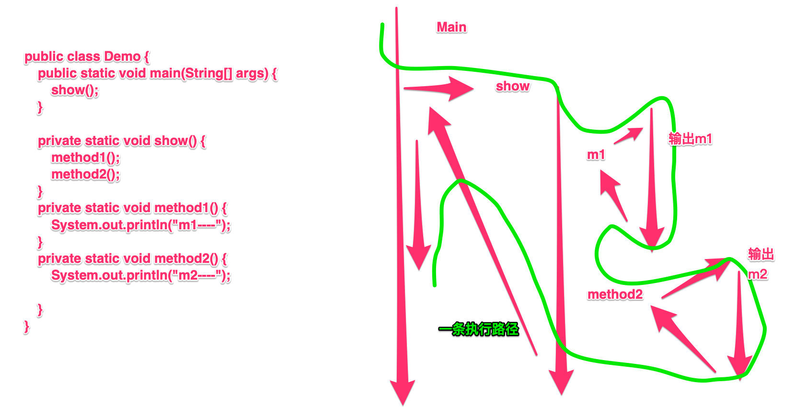

# 线程的实现两种方式

一、线程介绍

- 进程：实际上就是一个应用程序，在内存中的一片运行空间
  - 实际上就是多进程，可以开很多程序
- 线程：一个进程里的最小执行单元，也叫执行路径
  - qq进程里，我可以聊天，玩游戏
  - 一个进程下可以多个线程，最少有一个线程

```java
public class Demo {
	public static void main(String[] args) {
		show();
	}

	private static void show() {
		method1();
		method2();
	}
	private static void method1() {
		System.out.println("m1----");
	}
	private static void method2() {
		System.out.println("m2----");
		
	}
}
```



多进程有什么意义？

- 单进程的计算机只能做一件事
- 多进程，可以同时执行多个任务
  - 提高cpu的使用率

一边玩游戏和一边听音乐是同时进行的吗？

- 不是！
- 因为cpu在高速的切换，在某一个时间点上只能做一件事

多线程的意义？

- 不是提高程序的执行速度，其实是为了提高应用程序的使用率
- 程序的执行其实都只是在抢cpu的资源，cpu的执行权
- 多个进程在抢这个资源，而其中的某一个进程如果执行路径比较多，就会有更高的几率抢到cpu的执行权
- 我们不能保证那个线程能够在那个时刻抢到，所以线程的执行有随机性

java程序的运行原理

- java命令启动java虚拟机，等于启动了一个应用程序，也就是启动了一个进程，该进程会自动启动一个主线程，然后主线程去调用某个类的main方法，所以main方法运行在主线程中，在此之前的所有程序都是单线程的 

二、线程的实现方式

- 由于线程依赖于进程，我们应该先创建一个进程，进程是由系统创建的，所以我们应该去调用系统功能创建一个进程，java是不能直接调用系统功能的，所以我们没有办法直接实现多线程程序
- 但是，java可以调用c写好的来实现多线程程序 

### 第一种:继承Thread类

```java
 class PrimeThread extends Thread {
         long minPrime;
         PrimeThread(long minPrime) {
             this.minPrime = minPrime;
         }
 
         public void run() {
             // compute primes larger than minPrime
              . . .
         }
     }
```

- 创建一个类，继承Thread类
- 重写run方法
  - 为什么？
    - 我这个可能有多个方法，那么我这些方法都需要被线程执行吗？可能只有一部分
  - 那么把要被多线程执行的代码，写在run方法里
- 创建对象
- 启动线程
  - 先调用run方法，为什么是单线程的呢？
  - 因为run方法调用就是普通的方法调用
- run和start的区别
  - run直接调用时普通方法
  - start启动线程，再由jvm调用线程的run方法

### 第二种：实现Runnable接口

```java
创建线程的另一种方法是声明实现 Runnable 接口的类。该类然后实现 run 方法。然后可以分配该类的实例，在创建 Thread 时作为一个参数来传递并启动。采用这种风格的同一个例子如下所示 

class PrimeRun implements Runnable {
         long minPrime;
         PrimeRun(long minPrime) {
             this.minPrime = minPrime;
         }
 
         public void run() {
             // compute primes larger than minPrime
              . . .
         }
     }
     
然后，下列代码会创建并启动一个线程：

     PrimeRun p = new PrimeRun(143);
     new Thread(p).start();
```

- 开发中我们使用哪种？
  - 第二种
  - 可以避免由于java单继承带来的局限性
    - 如果一个类已经有一个父类了，还想实现多线程，那怎么办？
  - 适合多个相同程序的代码去处理同一个资源的情况，把线程同程序的代码，数据分离，较好的体现了面向对象的设计思想

三、线程的异常

哪个线程出现了异常，哪个线程结束，不影响其它线程的运行，但是如果所有的线程都出现异常，进程结束

四、如何多个对象之间共享数据

五、线程状态

