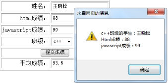

# 第一天JavaScript

## 一、JavaScript是什么

> Netscape在最初将其脚本语言命名为LiveScript，后来Netscape在与Sun合作之后将其改名为JavaScript。JavaScript最初受Java启发而开始设计的，目的之一就是“看上去像Java”，因此语法上有类似之处，一些名称和命名规范也借自Java。JavaScript与Java名称上的近似，是当时Netscape为了营销考虑与Sun微系统达成协议的结果。Java和JavaScript的关系就像张雨和张雨生的关系，只是名字很像。

**Java 服务器端的编程语言**

**JavaScript 运行在客户端(浏览器)的编程语言**

> JavaScript是一种运行在**客户端** 的**脚本语言** JavaScript的解释器被称为JavaScript引擎，为浏览器的一部分，广泛用于客户端的脚本语言，最早是在HTML（标准通用标记语言下的一个应用）网页上使用，用来给HTML网页增加动态功能。


### 1、JavaScript最初的目的

最初的目的是为了处理表单的验证操作。

### 2、JavaScript现在的意义(应用场景)

JavaScript 发展到现在几乎无所不能。

1. 网页特效
2. 服务端开发(Node.js)
3. 命令行工具(Node.js)
4. 桌面程序(nw.js)
5. App(Cordova)
6. 控制硬件-物联网(Ruff)
7. 游戏开发(cocos2d-js)

### 3、JavaScript和HTML、CSS的区别

1. HTML：提供网页的结构，提供网页中的内容
2. CSS: 用来美化网页
3. JavaScript: 可以用来控制网页内容，给网页增加动态的效果

## 二、JavaScript的组成


### 1、ECMAScript - JavaScript的核心

ECMA 欧洲计算机制造联合会

网景：JavaScript

微软：JScript

定义了JavaScript的语法规范 

JavaScript的核心，描述了语言的基本语法和数据类型，ECMAScript是一套标准，定义了一种语言的标准与具体实现无关

### 2、BOM - 浏览器对象模型

一套操作浏览器功能的API

通过BOM可以操作浏览器窗口，比如：弹出框、控制浏览器跳转、获取分辨率等

### 3、DOM - 文档对象模型

一套操作页面元素的API

DOM可以把HTML看做是文档树，通过DOM提供的API可以对树上的节点进行操作

## 三、JavaScript嵌入页面的方式

CSS：行内样式、嵌入样式、外部样式

### 1、JavaScript的书写位置

- 写在行内

```javascript
<input type="button" value="按钮" onclick="alert('Hello World')" />
```

- 写在script标签中

```javascript
<head>
  <script>
    var a = 123;
    var b = 'str';
//一条javascript语句应该以“;”结尾
    function fn(){
        alert(a);
    };
    fn();
  </script>
</head>
```

- 写在外部js文件中，在页面引入

```javascript
<script src="main.js"></script>
```

- 注意点

  **引用外部js文件的script标签中不可以写JavaScript代码**

- javascript注释

  ```javascript
  <script type="text/javascript">    
  
  // 单行注释
  var a = 123;
  /*  
    多行注释
    1、...
    2、...
  */
  var b = 'str';
  </script>
  ```

## 四、变量

### 1、什么是变量

- 什么是变量

  变量是计算机内存中存储数据的标识符，根据变量名称可以获取到内存中存储的数据

- 为什么要使用变量

  使用变量可以方便的获取或者修改内存中的数据

### 2、如何使用变量

- var声明变量

```javascript
var age;
```

- 变量的赋值

```javascript
var age;
age = 18;
```

- 同时声明多个变量

```javascript
var age, name, sex;
age = 10;
name = 'zs';
```

- 同时声明多个变量并赋值

```javascript
var age = 10, name = 'zs';
```

### 3、变量的命名规则和规范

- 规则 - 必须遵守的，不遵守会报错

  - 由字母、数字、下划线、$符号组成，不能以数字开头
  - 不能是关键字和保留字，例如：for、while。
  - 区分大小写

- 规范 - 建议遵守的，不遵守不会报错

  - 变量名必须有意义
  - 遵守驼峰命名法。首字母小写，后面单词的首字母需要大写。例如：userName、userPassword

- 下面哪些变量名不合法

  ```none
  a     
  1
  age18
  18age
  name
  $name
  _sex
  &sex
  theworld  theWorld
  ```

## 五、数据类型

### 1、简单数据类型

Number、String、Boolean、Undefined、Null

#### 1.1、Number类型

- 数值字面量：数值的固定值的表示法

  ```javascript
  var a = 12;
  ```

- 浮点数

  ```javascript
  var b = 12.2;
  ```

- 数值判断

  - NaN：not a number
  - NaN 与任何值都不相等，包括他本身
  - isNaN: is not a number

  ```javascript
  isNaN('tom') 返回true  
  ```

#### 1.2、String类型

- 字符串字面量

  ```javascript
  var a = 'abc';
  var b = "abc";
  ```

- 转义符

  

- 字符串长度

  length属性用来获取字符串的长度

  ```javascript
  var str = 'Hello World';
  console.log(str.length);
  ```

- 字符串拼接

  字符串拼接使用 + 连接

  ```javascript
  console.log(11 + 11);
  console.log('hello' + ' world');
  console.log('100' + '100');
  console.log('11' + 11);
  console.log('male:' + true);
  ```

  1. 两边只要有一个是字符串，那么+就是字符串拼接功能
  2. 两边如果都是数字，那么就是算术功能。

#### 1.3、Boolean类型

- Boolean字面量： true和false，区分大小写
- 计算机内部存储：true为1，false为0

#### 1.4、Undefined和Null

1. undefined表示一个声明了没有赋值的变量，变量只声明的时候值默认是undefined
2. null表示一个空，变量的值如果想为null，必须手动设置

### 2、复杂数据类型

Object

### 3、获取变量的类型

typeof

```javascript
var age = 18;
console.log(typeof age);  // 'number'
```

## 六、数据类型转换

如何使用谷歌浏览器，快速的查看数据类型？

字符串的颜色是黑色的，数值类型是蓝色的，布尔类型也是蓝色的，undefined和null是灰色的

### 1、转换成字符串类型

- toString()

  ```none
  var num = 5;
  console.log(num.toString());
  ```

- String()

  ```none
  String()函数存在的意义：有些值没有toString()，这个时候可以使用String()。比如：undefined和null
  ```

- 拼接字符串方式

  num + ""，当 + 两边一个操作符是字符串类型，一个操作符是其它类型的时候，会先把其它类型转换成字符串再进行字符串拼接，返回字符串

### 2、转换成数值类型

- Number()

  ```none
  Number()可以把任意值转换成数值，如果要转换的字符串中有一个不是数值的字符，返回NaN
  ```

- parseInt()

  ```javascript
  var num1 = parseInt("12.3abc");  // 返回12，如果第一个字符是数字会解析直到遇到非数字结束
  var num2 = parseInt("abc123");   // 返回NaN，如果第一个字符不是数字或者符号就返回NaN
  ```

- parseFloat()

  ```none
  parseFloat()把字符串转换成浮点数
  parseFloat()和parseInt非常相似，不同之处在与
  parseFloat会解析第一个. 遇到第二个.或者非数字结束
  如果解析的内容里只有整数，解析成整数
  ```

- +，-0等运算

  ```javascript
  var str = '500';
  console.log(+str);        // 取正
  console.log(-str);        // 取负
  console.log(str - 0);
  ```

### 3、转换成布尔类型

- Boolean()

0 ''(空字符串) null undefined NaN 会转换成false 其它都会转换成true

## 七、操作符

运算符 operator 

5 + 6 

表达式 组成 操作数和操作符，会有一个结果

### 1、算术运算符

```none
+ - * / %  
```

### 2、一元运算符

一元运算符：只有一个操作数的运算符

5 + 6 两个操作数的运算符 二元运算符

++ 自身加1

-- 自身减1

- 前置++

  ```javascript
  var num1 = 5;
  ++ num1; 
  
  var num2 = 6;
  console.log(num1 + ++ num2);
  ```

- 后置++

  ```javascript
  var num1 = 5;
  num1 ++;    
  var num2 = 6 
  console.log(num1 + num2 ++);
  ```


### 3、逻辑运算符(布尔运算符)

```none
&& 与 两个操作数同时为true，结果为true，否则都是false
|| 或 两个操作数有一个为true，结果为true，否则为false
!  非  取反
```

### 4、关系运算符(比较运算符)

```none
<  >  >=  <= == != === !==
==与===的区别：==只进行值得比较，===类型和值同时相等，则相等

var result = '55' == 55;    // true
var result = '55' === 55;   // false 值相等，类型不相等
var result = 55 === 55;     // true
```

### 5、赋值运算符

= += -= *= /= %=`javascript 例如： var num = 0; num += 5; //相当于 num = num + 5;`

## 八、获取元素

可以使用内置对象document上的getElementById方法来获取页面上设置了id属性的元素，获取到的是一个html对象，然后将它赋值给一个变量，比如：

```javascript
<script type="text/javascript">
    var oDiv = document.getElementById('div1');
</script>
....
<div id="div1">这是一个div元素</div>
```

上面的语句，如果把javascript写在元素的上面，就会出错，因为页面上从上往下加载执行的，javascript去页面上获取元素div1的时候，元素div1还没有加载，解决方法有两种：

- 第一种方法：将javascript放到页面最下边

  ```javascript
  <div id="div1">这是一个div元素</div>
  <script type="text/javascript">
     var oDiv = document.getElementById('div1');
  </script>
  </body>
  ```

- 第二种方法：将javascript语句放到window.onload触发的函数里面,获取元素的语句会在页面加载完后才执行，就不会出错了。

  ```javascript
  <script type="text/javascript">
      window.onload = function(){
          var oDiv = document.getElementById('div1');
      }
  </script>
  <div id="div1">这是一个div元素</div>
  ```

## 九、操作元素属性

获取的页面元素，就可以对页面元素的属性进行操作，属性的操作包括属性的读和写。

操作属性的方法 

1、“.” 操作

2、“[ ]”操作

属性写法

1、html的属性和js里面属性写法一样

2、“class” 属性写成 “className”,改变class的属性

3、“style” 属性里面的属性，有横杠的改成驼峰式，比如：“font-size”，改成”style.fontSize”

通过“.”操作属性：

```javascript
<script type="text/javascript">

    window.onload = function(){
        var oInput = document.getElementById('input1');
        var oA = document.getElementById('link1');
        // 读取属性值
        var val = oInput.value;
        var typ = oInput.type;
        var nam = oInput.name;
        var links = oA.href;
        // 写(设置)属性
        oA.style.color = 'red';
        oA.style.fontSize = val;
        oA.href = "http://www.baidu.com";
    }

</script>

......

<input type="text" name="setsize" id="input1" value="20px">
<a href="www.114la.com" id="link1">baidu</a>
```

通过“[ ]”操作属性：

```javascript
<script type="text/javascript">

    window.onload = function(){
        var oInput1 = document.getElementById('input1');
        var oInput2 = document.getElementById('input2');
        var oA = document.getElementById('link1');
        // 读取属性
        var val1 = oInput1.value;
        var val2 = oInput2.value;
        // 写(设置)属性
        // oA.style.val1 = val2; 没反应
        oA.style[val1] = val2;        
    }

</script>

......

<input type="text" name="setattr" id="input1" value="fontSize">
<input type="text" name="setnum" id="input2" value="30px">
<a href="http://" id="link1">aaa</a>
```

 

### innerHTML

innerHTML可以读取或者写入标签包裹的内容

```none
<script type="text/javascript">
    window.onload = function(){
        var oDiv = document.getElementById('div1');
        //读取
        var txt = oDiv.innerHTML;
        alert(txt);
        //写入
        oDiv.innerHTML = '<a href="http://a">aaa<a/>';
    }
</script>

......

<div id="div1">这是一个div元素</div>
```

## 十、函数

函数就是重复执行的代码片。

函数定义与执行

```none
<script type="text/javascript">
    // 函数定义
    function aa(){
        alert('hello!');
    }
    // 函数执行
    aa();
</script>
```

### 变量与函数预解析

> JavaScript解析过程分为两个阶段，先是编译阶段，然后执行阶段，在编译阶段会将function定义的函数提前，并且将var定义的变量声明提前，将它赋值为undefined。

```none
<script type="text/javascript">    
    aa();       // 弹出 hello！
    alert(bb);  // 弹出 undefined
    alert(c);//报错，c没有声明
    function aa(){
        alert('hello!');
    }
    var bb = 123;
</script>
```

### 提取行间事件

在html行间调用的事件可以提取到javascript中调用，从而做到结构与行为分离。

```none
<!--行间事件调用函数   -->
<script type="text/javascript">        
    function myalert(){
        alert('ok!');
    }
</script>
......
<input type="button" name="" value="弹出" onclick="myalert()">

<!-- 提取行间事件 -->
<script type="text/javascript">

window.onload = function(){
    var oBtn = document.getElementById('btn1');
    oBtn.onclick = myalert;
    function myalert(){
        alert('ok!');
    }
}    
</script>
......
<input type="button" name="" value="弹出" id="btn1">
```

### 表单事件

| 属性                                                         | 描述                                                         |
| ------------------------------------------------------------ | ------------------------------------------------------------ |
| [onblur](http://www.runoob.com/jsref/event-onblur.html)      | 元素失去焦点时触发                                           |
| [onchange](http://www.runoob.com/jsref/event-onchange.html)  | 该事件在表单元素的内容改变时触发("\<input>, \<keygen>, \<select>, 和 \<textarea>") |
| [onfocus](http://www.runoob.com/jsref/event-onfocus.html)    | 元素获取焦点时触发                                           |
| [onfocusin](http://www.runoob.com/jsref/event-onfocusin.html) | 元素即将获取焦点时触发                                       |
| [onfocusout](http://www.runoob.com/jsref/event-onfocusout.html) | 元素即将失去焦点时触发                                       |
| [oninput](http://www.runoob.com/jsref/event-oninput.html)    | 元素获取用户输入时触发                                       |
| [onreset](http://www.runoob.com/jsref/event-onreset.html)    | 表单重置时触发                                               |
| [onsearch](http://www.runoob.com/jsref/event-onsearch.html)  | 用户向搜索域输入文本时触发 ( <input="search">)               |
| [onselect](http://www.runoob.com/jsref/event-onselect.html)  | 用户选取文本时触发 (\<input> 和 \<textarea>)                 |

### 鼠标事件

| 属性                                                         | 描述                                   |
| ------------------------------------------------------------ | -------------------------------------- |
| [onclick](http://www.runoob.com/jsref/event-onclick.html)    | 当用户点击某个对象时调用的事件句柄。   |
| [oncontextmenu](http://www.runoob.com/jsref/event-oncontextmenu.html) | 在用户点击鼠标右键打开上下文菜单时触发 |
| [ondblclick](http://www.runoob.com/jsref/event-ondblclick.html) | 当用户双击某个对象时调用的事件句柄。   |
| [onmousedown](http://www.runoob.com/jsref/event-onmousedown.html) | 鼠标按钮被按下。                       |
| [onmouseenter](http://www.runoob.com/jsref/event-onmouseenter.html) | 当鼠标指针移动到元素上时触发。         |
| [onmouseleave](http://www.runoob.com/jsref/event-onmouseleave.html) | 当鼠标指针移出元素时触发               |
| [onmousemove](http://www.runoob.com/jsref/event-onmousemove.html) | 鼠标被移动。                           |
| [onmouseover](http://www.runoob.com/jsref/event-onmouseover.html) | 鼠标移到某元素之上。                   |
| [onmouseout](http://www.runoob.com/jsref/event-onmouseout.html) | 鼠标从某元素移开。                     |

### 匿名函数

定义的函数可以不给名称，这个叫做匿名函数，可以将匿名函数直接赋值给元素绑定的事件来完成匿名函数的调用。

```none
<script type="text/javascript">

window.onload = function(){
    var oBtn = document.getElementById('btn1');
    /*
    oBtn.onclick = myalert;
    function myalert(){
        alert('ok!');
    }
    */
    // 直接将匿名函数赋值给绑定的事件

    oBtn.onclick = function (){
        alert('ok!');
    }
}

</script>
函数传参

<script type="text/javascript">
    function myalert(a){
        alert(a);
    }
    myalert(12345);
</script>
```

函数'return'关键字 

函数中'return'关键字的作用：

1、返回函数执行的结果

2、结束函数的运行

3、阻止默认行为

```none
<script type="text/javascript">
function add(a,b){
    var c = a + b;
    return c;
    alert('here!');
}

var d = add(3,4);
alert(d);  //弹出7
</script>
```

## 十一、流程控制程序的三种基本结构

### 1、顺序结构

从上到下执行的代码就是顺序结构

**程序默认就是由上到下顺序执行的**

### 2、分支结构

根据不同的情况，执行对应代码

### if语句

语法结构

```javascript
if (/* 条件表达式 */) {
  // 执行语句
}

if (/* 条件表达式 */){
  // 成立执行语句
} else {
  // 否则执行语句
}

if (/* 条件1 */){
  // 成立执行语句
} else if (/* 条件2 */){
  // 成立执行语句
} else if (/* 条件3 */){
  // 成立执行语句
} else {
  // 最后默认执行语句
}
```

### 三元运算符

```none
表达式1 ? 表达式2 : 表达式3
是对if……else语句的一种简化写法
```

案例： 是否年满18岁 从两个数中找最大值

### switch语句

语法格式:`javascript switch (expression) { case 常量1: 语句; break; case 常量2: 语句; break; case 常量3: 语句; break; … case 常量n: 语句; break; default: 语句; break; }`break可以省略，如果省略，代码会继续执行下一个case switch 语句在比较值时使用的是全等操作符, 因此不会发生类型转换（例如，字符串'10' 不等于数值 10）

案例： 显示星期几 素质教育（把分数变成ABCDE）千万不要写100个case哟

### 布尔类型的隐式转换

流程控制语句会把后面的值隐式转换成布尔类型

```none
转换为true   非空字符串  非0数字  true 任何对象
转换成false  空字符串  0  false  null  undefined
// 结果是什么？
var a = !!'123';
```

### 3、循环结构

> 在javascript中，循环语句有三种，while、do..while、for循环。
>
> 循环结构：重复做一件事情

### while语句

基本语法：

```javascript
// 当循环条件为true时，执行循环体，
// 当循环条件为false时，结束循环。
while (循环条件) {
  //循环体
}
```

代码示例：

```javascript
// 计算1-100之间所有数的和
// 初始化变量
var i = 1;
var sum = 0;
// 判断条件
while (i <= 100) {
  // 循环体
  sum += i;
  // 自增
  i++;
}
console.log(sum);
```

案例： 打印100以内 7的倍数 打印100以内所有偶数 打印100以内所有偶数的和 作业： 打印100以内的奇数 打印100以内的奇数的和

### do...while语句

> do..while循环和while循环非常像，二者经常可以相互替代，但是do..while的特点是不管条件成不成立，都会执行一次。

基础语法：

```javascript
do {
  // 循环体;
} while (循环条件);
```

代码示例：

```javascript
// 初始化变量
var i = 1;
var sum = 0;
do {
  sum += i;//循环体
  i++;//自增
} while (i <= 100);//循环条件
```

### for语句

> while和do...while一般用来解决无法确认次数的循环。for循环一般在循环次数确定的时候比较方便

for循环语法：

```javascript
// for循环的表达式之间用的是;号分隔的，千万不要写成,
for (初始化表达式1; 判断表达式2; 自增表达式3) {
  // 循环体4
}
```

执行顺序：1243 ---- 243 -----243(直到循环条件变成false)

1. 初始化表达式
2. 判断表达式
3. 自增表达式
4. 循环体

### continue和break

> break:立即跳出整个循环，即循环结束，开始执行循环后面的内容（直接跳到大括号）
>
> continue:立即跳出当前循环，继续下一次循环（跳到i++的地方）

### 调试

- 断点调试

> 断点调试是指自己在程序的某一行设置一个断点，调试时，程序运行到这一行就会停住，然后你可以一步一步往下调试，调试过程中可以看各个变量当前的值，出错的话，调试到出错的代码行即显示错误，停下。

- 调试步骤

```javascript
浏览器中按F12-->sources-->找到需要调试的文件-->在程序的某一行设置断点
```

- 调试中的相关操作

```javascript
Watch: 监视，通过watch可以监视变量的值的变化，非常的常用。
F10: 程序单步执行，让程序一行一行的执行，这个时候，观察watch中变量的值的变化。
F8：跳到下一个断点处，如果后面没有断点了，则程序执行结束。
```

tips: **监视变量，不要监视表达式，因为监视了表达式，那么这个表达式也会执行。**

1. 代码调试的能力非常重要，只有学会了代码调试，才能学会自己解决bug的能力。初学者不要觉得调试代码麻烦就不去调试，知识点花点功夫肯定学的会，但是代码调试这个东西，自己不去练，永远都学不会。
2. 今天学的代码调试非常的简单，只要求同学们记住代码调试的这几个按钮的作用即可，后面还会学到很多的代码调试技巧。

## 案例

【1】编写一个带有表单提交的页面，完成数据获取--熟悉js语法。


```js
window.onload = function(){
	var btn = document.getElementById("btn");
	btn.onclick = function(){
		var name = document.getElementById("name").value;
		var html = document.getElementById("html").value;
		var js = document.getElementById("js").value;
		var clazz = document.getElementById("class").value;
		if(name =="" || html==""|| js==""){
			alert("输入的信息必须完整!")
			return;
		}
		if(isNaN(html)||isNaN(js)){
			alert("必须是数字")
			return;
		}
		alert('学生姓名是'+name+'\nhtml成绩是'+html+'\njs成绩是'+js+'\n班级是'+clazz)
	}
}
```

```html
<!DOCTYPE html>
<html>
	<head>
		<meta charset="utf-8" />
		<meta name="viewport" content="width=device-width, initial-scale=1">
		<title></title>
		<script src="js/index.js" type="text/javascript" charset="utf-8"></script>
	</head>
	<body>
		<center>
			<table border="1">
				<tr>
					<td>姓名</td>
					<td><input type="text" id="name"></td>
				</tr>
				<tr>
					<td>html成绩</td>
					<td><input type="text" id="html"></td>
				</tr>
				<tr>
					<td>js成绩</td>
					<td><input type="text" id="js"></td>
				</tr>
				<tr>
					<td>班级</td>
					<td>
						<select name="" id="class">
							<option value ="java">java</option>
							<option value ="python">python</option>
							<option value ="web前端">web前端</option>
						</select>
					</td>
				</tr>
				<tr align="center">
					<td colspan="2"><button type="button" id="btn">提交成绩</button></td>
				</tr>
			</table>
		</center>
		
	</body>
</html>
```


【2】在1的基础上，添加计算平均值



```js
window.onload = function(){
	var btn = document.getElementById("btn");
	btn.onclick = function(){
		var name = document.getElementById("name").value;
		var html = document.getElementById("html").value;
		var js = document.getElementById("js").value;
		var clazz = document.getElementById("class").value;
		if(name =="" || html==""|| js==""){
			alert("输入的信息必须完整!")
			return;
		}
		if(isNaN(html)||isNaN(js)){
			alert("必须是数字")
			return;
		}
		var avg = (parseFloat(html)+parseFloat(js))/2;
		alert('学生姓名是'+name+'\nhtml成绩是'+html+'\njs成绩是'+js+'\n班级是'+clazz+'\n平均成绩是'+avg);
		var idavg = document.getElementById("idavg");
		idavg.value = avg;
	}
}
```

```html
<!DOCTYPE html>
<html>
	<head>
		<meta charset="utf-8" />
		<meta name="viewport" content="width=device-width, initial-scale=1">
		<title></title>
		<script src="js/index.js" type="text/javascript" charset="utf-8"></script>
	</head>
	<body>
		<center>
			<table border="1">
				<tr>
					<td>姓名</td>
					<td><input type="text" id="name"></td>
				</tr>
				<tr>
					<td>html成绩</td>
					<td><input type="text" id="html"></td>
				</tr>
				<tr>
					<td>js成绩</td>
					<td><input type="text" id="js"></td>
				</tr>
				<tr>
					<td>班级</td>
					<td>
						<select name="" id="class">
							<option value ="java">java</option>
							<option value ="python">python</option>
							<option value ="web前端">web前端</option>
						</select>
					</td>
				</tr>
				<tr align="center">
					<td colspan="2"><button type="button" id="btn">提交成绩</button></td>
				</tr>
				<tr align="center">
					<td>平均成绩</td>
					<td><input type="text" id="idavg"></td>
				</tr>
			</table>
		</center>
		
	</body>
</html>
```

改造拼接：ES6代码

```js
alert(`学生姓名是${name}\nhtml成绩是${html}\njs成绩是${js}\n班级是${clazz}\n平均成绩是${avg}`)
```

