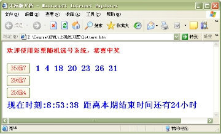

# 第二天JavaScript

## 一、数组

### 创建数组

```javascript
// 创建一个空数组
var arr1 = []; 
// 创建一个包含3个数值的数组，多个数组项以逗号隔开
var arr2 = [1, 3, 4]; 
// 创建一个包含2个字符串的数组
var arr3 = ['a', 'c']; 
//另一种方式
var arr = new Array(10);
// 可以通过数组的length属性获取数组的长度
console.log(arr3.length);
// 可以设置length属性改变数组中元素的个数
arr3.length = 0;
```

### 获取数组元素

数组的取值

```javascript
// 格式：数组名[下标]   下标又称索引
// 功能：获取数组对应下标的那个值，如果下标不存在，则返回undefined。
var arr = ['red', 'green', 'blue'];
arr[0]; // red
arr[2]; // blue
arr[3]; // 这个数组的最大下标为2,因此返回undefined
```

### 遍历数组

> 遍历：遍及所有，对数组的每一个元素都访问一次就叫遍历。

数组遍历的基本语法：

```javascript
for(var i = 0; i < arr.length; i++) {
    // 数组遍历的固定结构
}
```

数组也可以用for-in来遍历：

```none
var arr = ['a', 'b', 'c'];
for(var i in arr){
    alert(arr[i]);
}
```

### 数组中新增元素

数组的赋值

```javascript
// 格式：数组名[下标/索引] = 值;
// 如果下标有对应的值，会把原来的值覆盖，如果下标不存在，会给数组新增一个元素。
var arr = ["red", "green", "blue"];
// 把red替换成了yellow
arr[0] = "yellow";
// 给数组新增加了一个pink的值
arr[3] = "pink";
```

### sort排序

```none
var arr = ['c', 'd', 'a', 'e'];
arr.sort(); // 'a', 'c', 'd', 'e' 按照unicode编码排序

var arr2 = [4, 3, 5, 76, 2, 0, 8];
// arr2.sort(); // 0, 2, 3, 4, 5, 76, 8 sort默认是将数组中的每一个按照字符串来排序的，因此出现了76排在8前面的情况

// arr2. sort(function( a, b ){
    return a - b; //如果a-b返回正数，就a、b两个数字换个序。如果a-b是负数，就不换序
}) //返回数字从小到大 0, 2, 3, 4, 5, 8, 76

// arr2. sort(function( a, b ){
    return b - a;
}) //返回数字从大到小 76, 8, 5, 4, 3, 2, 0
```

### 案例：



```html
<!DOCTYPE html>
<html>

<head>
    <meta charset="utf-8">
    <meta http-equiv="X-UA-Compatible" content="IE=edge">
    <title>Page Title</title>
    <meta name="viewport" content="width=device-width, initial-scale=1">
    <script>
        function one() {
            var one = document.getElementById('one');
            var arr = new Array(7);
            for (var i = 0; i < arr.length; i++) {
                arr[i] = Math.round(Math.random() * 35);
                for (var j = 0; j < i; j++) {
                    if (arr[i] == arr[j]) {
                        i--;
                    }
                }
            }
            arr.sort(function (a, b) {
                return a - b;
            });

            one.innerText = arr.toString();
        }
        function t1() {
            var now = document.getElementById('now');
            var end = document.getElementById('end');
            var date = new Date();
            var hours = date.getHours();
            var minutes = date.getMinutes();
            var miao = date.getSeconds();
            hours = hours < 10 ? '0' + hours : hours;
            minutes = minutes < 10 ? '0' + minutes : minutes;
            miao = miao < 10 ? '0' + miao : miao;
            console.log(`${hours}:${minutes}:${miao}`);
            now.innerText = `${hours}:${minutes}:${miao}`;
        }
        function t2() {
            // 距离本期结束
            var endTime = new Date("2019/3/26 23:59").getTime();
            console.log('endTime==' + endTime);
            var nowTime = new Date().getTime();
            console.log('nowTime==' + nowTime);
            var timer = endTime - nowTime;
            console.log('timer=' + timer);
            var day = timer / 1000 / 60 / 60 / 24;
            var h = timer / 1000 / 60 / 60 - (24 * Math.floor(day));
            var m = timer / 1000 / 60 - (24 * 60 * Math.floor(day)) - (60 * Math.floor(h));
            var s = timer / 1000 - (24 * 60 * 60 * Math.floor(day)) - (60 * 60 * Math.floor(h)) - (60 * Math.floor(m));
            h = Math.floor(h);
            m = Math.floor(m);
            s = Math.floor(s);
            h=h<10?'0'+h:h;
            m=m<10?'0'+m:m;
            s=s<10?'0'+s:s;
            end.innerText = `${h}:${m}:${s}`;
        }
        window.onload = function () {
            t1();
            setInterval(() => {
                t1();
            }, 1000);
            t2();
            setInterval(() => {
                t2();
            }, 1000);
        }
    </script>
</head>

<body>
    <h1 style="color:red;">欢迎使用彩票随机选号系统，恭喜中奖</h1>
    <button style="color:red;" onclick="one()">35选7</button><span id="one" style="color: blue;"></span></br>
    <button>29选7</button><span></span></br>
    <button>25选4</button><span></span></br>
    <h1 style="color:blue;">现在时刻</h1><span id="now"></span>
    <h1>距离本期结束还有小时</h1><span id="end"></span>
</body>

</html>
```

## 二、内置对象

JavaScript中的对象分为3种：内置对象、浏览器对象、自定义对象

JavaScript 提供多个内置对象：Math/Array/Number/String/Boolean...

对象只是带有**属性**和**方法**的特殊数据类型。

学习一个内置对象的使用，只要学会其常用的成员的使用（通过查文档学习）

可以通过MDN/W3C来查询

内置对象的方法很多，我们只需要知道内置对象提供的常用方法，使用的时候查询文档。

### window对象

```js
window.alert("");  弹出消息框

window.confirm();	  弹出确认框，点击确定按钮，返回true

window.open();      打开一个新窗口，可以加载存在的网页文件

window.close();     关闭本窗口
```

特权:window对象使用时候可以省略window，比如：window.alert();可以直接写成alert();window.open();可以直接写成open();如果网页上某个自定义函数定义成open()是不可以的。

#### 案例：

```html
<!DOCTYPE html>
<html>

<head>
    <meta charset="utf-8">
    <meta http-equiv="X-UA-Compatible" content="IE=edge">
    <title>Page Title</title>
    <meta name="viewport" content="width=device-width, initial-scale=1">
</head>

<body>
    <script>
        function openWindow(){
            if(confirm('是否打开窗口？')){
                open('1.html');
            }
        }
        function closeWindow(){
            close();
        }
    </script>
    <input type="button" name="" value="打开新窗口" onclick="openWindow()">
    <input type="button" name="" value="关闭" onclick="closeWindow()">
</body>

</html>
```

### Date对象

创建 `Date` 实例用来处理日期和时间。Date 对象基于1970年1月1日（世界标准时间）起的毫秒数。

```javascript
// 获取当前时间，UTC世界时间，距1970年1月1日（世界标准时间）起的毫秒数
var now = new Date();
console.log(now.valueOf()); // 获取距1970年1月1日（世界标准时间）起的毫秒数

Date构造函数的参数
1. 毫秒数 1498099000356        new Date(1498099000356)
2. 日期格式字符串  '2015-5-1'   new Date('2015-5-1')
3. 年、月、日……                new Date(2015, 4, 1)   // 月份从0开始
```

- 获取日期的毫秒形式

```javascript
var now = new Date();
// valueOf用于获取对象的原始值
console.log(date.valueOf()) 

// HTML5中提供的方法，有兼容性问题
var now = Date.now();   

// 不支持HTML5的浏览器，可以用下面这种方式
var now = + new Date();         // 调用 Date对象的valueOf() 
```

- 日期格式化方法

```javascript
toString()      // 转换成字符串
valueOf()       // 获取毫秒值
// 下面格式化日期的方法，在不同浏览器可能表现不一致，一般不用
toDateString()
toTimeString()
toLocaleDateString()
toLocaleTimeString()
```

- 获取日期指定部分

```javascript
getTime()     // 返回毫秒数和valueOf()结果一样，valueOf()内部调用的getTime()
getMilliseconds() 
getSeconds()  // 返回0-59
getMinutes()  // 返回0-59
getHours()    // 返回0-23
getDay()      // 返回星期几 0周日   6周6
getDate()     // 返回当前月的第几天
getMonth()    // 返回月份，***从0开始***
getFullYear() //返回4位的年份  如 2016
```

#### 案例

- 写一个函数，格式化日期对象，返回yyyy-MM-dd HH:mm:ss的形式

```javascript
function formatDate(d) {
  //如果date不是日期对象，返回
  if (!date instanceof Date) {
    return;
  }
  var year = d.getFullYear(),
      month = d.getMonth() + 1, 
      date = d.getDate(), 
      hour = d.getHours(), 
      minute = d.getMinutes(), 
      second = d.getSeconds();
  month = month < 10 ? '0' + month : month;
  date = date < 10 ? '0' + date : date;
  hour = hour < 10 ? '0' + hour : hour;
  minute = minute < 10 ? '0' + minute:minute;
  second = second < 10 ? '0' + second:second;
  return year + '-' + month + '-' + date + ' ' + hour + ':' + minute + ':' + second;
}
```

- 计算时间差，返回相差的天/时/分/秒

```javascript
function getInterval(start, end) {
  var day, hour, minute, second, interval;
  interval = end - start;
  interval /= 1000;
  day = Math.round(interval / 60 /60 / 24);
  hour = Math.round(interval / 60 /60 % 24);
  minute = Math.round(interval / 60 % 60);
  second = Math.round(interval % 60);
  return {
    day: day,
    hour: hour,
    minute: minute,
    second: second
  }
}
```

### String对象

- 字符串的不可变

```javascript
var str = 'abc';
str = 'hello';
// 当重新给str赋值的时候，常量'abc'不会被修改，依然在内存中
// 重新给字符串赋值，会重新在内存中开辟空间，这个特点就是字符串的不可变
// 由于字符串的不可变，在大量拼接字符串的时候会有效率问题

```

- 创建字符串对象

```javascript
var str = new String('Hello World');

// 获取字符串中字符的个数
console.log(str.length);

```

- 字符串对象的常用方法

  字符串所有的方法，都不会修改字符串本身(字符串是不可变的)，操作完成会返回一个新的字符串

```javascript
// 1 字符方法
charAt()        //获取指定位置处字符
charCodeAt()    //获取指定位置处字符的ASCII码
str[0]          //HTML5，IE8+支持 和charAt()等效
// 2 字符串操作方法
concat()        //拼接字符串，等效于+，+更常用
slice()         //从start位置开始，截取到end位置，end取不到
substring()     //从start位置开始，截取到end位置，end取不到
substr()        //从start位置开始，截取length个字符
// 3 位置方法
indexOf()       //返回指定内容在元字符串中的位置
lastIndexOf()   //从后往前找，只找第一个匹配的
// 4 去除空白   
trim()          //只能去除字符串前后的空白
// 5 大小写转换方法
to(Locale)UpperCase()   //转换大写
to(Locale)LowerCase()   //转换小写
// 6 其它
search()
replace()
split()
fromCharCode()
// String.fromCharCode(101, 102, 103);   //把ASCII码转换成字符串


对象数组：数组中存储的是对象，可以将html中,name属性相同，type属性相同的表单元素当做对象数组使用（示例6）
document.getElementsByName("name属性")：获取指定name属性对象数组
document.getElementsByName("name属性").length：对象数组的长度
document.getElementsByName("name属性").item(下标).value：访问对象数组中指定下标的
```

### 案例

#### 判断用户名首字母只包含字母和数字

```html
<!DOCTYPE html>
<html>
<head>
    <meta charset="utf-8">
    <meta http-equiv="X-UA-Compatible" content="IE=edge">
    <title>Page Title</title>
    <meta name="viewport" content="width=device-width, initial-scale=1">
    <script>
        function check(){
            var name = document.getElementById('name').value;
            var username = new String(name).charAt(0);
            if(username==''||username.trim()==''){
                alert('内容不能为空')
                return;
            }
            if(!(username>='A'&&username<='Z'||username>='a'&&username<='z'||username>=0&&username<=9)){
                alert('必须是数字或汉字');
                return;
            }else{
                alert('符合条件')
            }

        }
    </script>
</head>

<body>
    <input type="text" id="name" >
    <input type="button" name="" value="验证" onclick="check()">
</body>
</html>
```

#### Email验证，必须包含“@”和“.”,并且这两个字符不能连在一起，“.”不能是最后一个字符。


```js
<!DOCTYPE html>
<html>
	<head>
		<meta charset="utf-8">
		<title></title>
		<script type="text/javascript">
			function show(){
				var email = document.getElementById('email').value;
				if(email==""){
					alert('不能为空')
					return;
				}
				if(email.charAt(0)=='@'){
					alert('开头不能为@')
					return;
				}
				if(email.indexOf('@')==-1||email.indexOf('.')==-1){
					alert('必须有@ .')
					return;
				}
				var index = email.indexOf('@')+1;
				console.log(index)
				console.log(email.indexOf('.'))
				if(index==email.indexOf('.')||email.indexOf('.')==index){
					alert('@ 不能挨着.')
					return;
				}
				if(email.indexOf('@')==email.length-1||email.indexOf('.')==email.length-1){
					alert('@ .不能是最后一位')
					return;
				}
				
			}
		</script>
	</head>
	<body>
		<input type="text" id='email'/>
		<input type="button" onclick="show()" value='提交'>
	</body>
</html>

```

#### 获取单选按钮和复选框的值


```html
<!DOCTYPE html>
<html lang="en">

<head>
    <title></title>
    <meta charset="UTF-8">
    <meta name="viewport" content="width=device-width, initial-scale=1">
    <script>
        function show() {
            var edus = document.getElementsByName('edu').length;
            var val;
            for (var i = 0; i < edus; i++) {
                if (document.getElementsByName('edu').item(i).checked) {
                    val = document.getElementsByName('edu').item(i).value;
                    break;
                }
            }
            var hobbys = document.getElementsByName('hobby');
            var str = '';
            for (var i = 0; i < hobbys.length; i++) {
                if (document.getElementsByName('hobby').item(i).checked) {
                    str += document.getElementsByName('hobby').item(i).value+",";
                }
            }
          // str = str.substring(str.length-1,0)
          //substring 方法用于提取字符串中介于两个指定下标之间的字符
						str = str.substr(0,str.length-1);
          //方法用于返回一个从指定位置开始的指定长度的子字符串。
            alert(`学历是：${val}\n爱好是:${str}`)
        }
      
      
      改造：
      function show(){
			var edus = document.getElementsByName('edu');
			var val ;
			for(var i=0;i<edus.length;i++){
				if(edus[i].checked == true){
					val = edus[i].value;
				}
			}
			alert(val)
		}
    </script>
</head>

<body>
    <h1>学历</h1>
    <input type="radio" name='edu' value="博士后" checked='checked'>博士后
    <input type="radio" name='edu' value="本科">本科
    <input type="radio" name='edu' value="研究生">研究生
    <input type="radio" name='edu' value="专科">专科

    <h1>爱好</h1>
    <input type="checkbox" name='hobby' value="王者荣耀">王者荣耀
    <input type="checkbox" name='hobby' value="地下城">地下城
    <input type="checkbox" name='hobby' value="java">java
    <input type="checkbox" name='hobby' value="js">js
    <br>
    <br>
    <br>
    <button style='width:100px;height: 100px; background-color: red' onclick="show()">别浪~~~</button>
</body>

</html>
```

