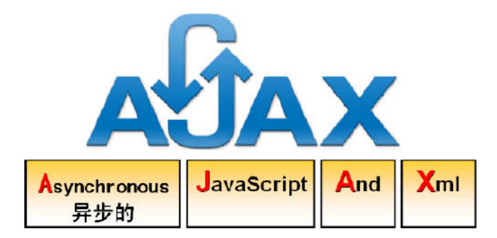

# Ajax



（Asynchronous JavaScript And XML）指异步 JavaScript 及 XML

不是一种新的编程语言，而是一种用于创建更好更快以及交互性更强的 Web 应用程序的技术，是基于JavaScript、XML、HTML、CSS新用法

该技术在 1998 年前后得到了应用

## 同步交互与异步交互

- 同步
  - 发送一个请求，就要等待服务器的响应结束，然后才发第二个请求！中间这段时间就是-卡
  - 刷新的是整个页面
- 异步
  - 发一个请求，无需等待服务器响应，然后就可以发送第二个请求
  - 可以使用js接收服务器的响应，然后使用js来局部刷新！
    - 例如：点击按钮添加文本元素
  - 局部刷新
- window.onload的作用？
  - 在文档加载完毕后马上执行！
- js可以访问服务器了！而且是异步的方式
  - 由于是局部刷新，就不用服务器响应整个页面，而返回局部数据即可
- 接收数据是什么类型
  - text、xml、json等
  - 前后台都认识，那么就是数据交换格式!

## 应用场景

- 注册验证等

  

- 无需等待，继续操作

- 百度搜索框

  

- 文本框改变事件，改变后向服务器发送请求，返回热度前7个，前端用下拉表的显示出来，提高用户体验，感觉不到刷新，异步请求最大的特点，不需要响应等待

#### 优点：

- 增强用户体验
- 因为服务器无需再响应整个页面，只需响应部分内容所以服务器压力减轻了

#### 缺点

- ajax不能应用在所有场景！
- 无端的增多了对服务器的访问次数，给服务器带来了压力

## 发送异步请求

#### 四步

- 第一步只需要学习一个对象，XMLHttpRequest,得到他

  - var xmlHttp = new XMLHttpRequest();

    - IE6:var x = new ActiveXObject("Msxml2.XMLHTTP");
    - IE5.5及以前: var x = new ActiveXObject("Microsoft.XMLHTTP");
    - 是不是需要判断浏览器？我才不判断呢，太麻烦了，我用异常，看代码优雅不

    ```js
    function createXMLHttpRequest(){
    			xmlhttp=null;
    			if (window.XMLHttpRequest)
    			  {// code for all new browsers
    			  xmlhttp=new XMLHttpRequest();
    			  }
    			else if (window.ActiveXObject)
    			  {// code for IE5 and IE6
    			  xmlhttp=new ActiveXObject("Microsoft.XMLHTTP");
    			  }
    		      return xmlhttp;
    		}
    
    
    
    
    
    
    function createXMLHttpRequest(){
        try{
            return new XMLHttpRequest();
        }catch(e){
            try{
            	return new ActiveXObject("Msxml2.XMLHTTP");
            }catch(e){
                try{
                    return new ActiveXObject("Microsoft.XMLHTTP");
                }catch(e){
                    alert('你用的是自己开发的浏览器吗？')
                    throw e
                }
            }
        }
    }
    ```

- 打开与服务器连接

  - xmlHttp.open(),需要三个参数
    - 请求方式：可以是get和post
    - URL：指定服务器的资源路径
    - 请求是否为异步：为true 发送异步请求，否则同步请求
    - 但是他并没有发送请求，第三部发送

- xmlHttp.send(null):如果不给可能会造成部分浏览器无法发送

  - 参数就是请求体内容，如果是get请求，必须给出null，因为get没有请求体

- 第四部最难的

  - 得到响应，由于是异步，你不知道什么时候服务器给你结果，你就干其他事了，就需要一个事件监听

    | 就绪状态码 | 说    明                                                     |
    | ---------- | ------------------------------------------------------------ |
    | 0          | 刚刚创建。没有调用open（）方法                               |
    | 1          | 请求开始，调用了open方法，但还没有调用send方法。请求还没有发出 |
    | 2          | XMLHttpRequest对象的请求发送完成，send方法已经调用，数据已经提交到服务器，但没有任何响应 |
    | 3          | XMLHttpRequest对象开始读取响应，还没有结束，收到了所有的响应消息头，但正文还没有完全收到 |
    | 4          | 服务器响应结束，一切都收到了                                 |

  - 我们通常只关心最后的状态，怎么获得当前状态

    - xmlHttp.readyState

| 状态码 | 说    明           |
| ------ | ------------------ |
| 200    | 服务器响应正常     |
| 400    | 无法找到请求的资源 |
| 403    | 没有访问权限       |
| 404    | 访问的资源不存在   |
| 500    | 服务器内部错误     |

 responseText：获得响应的文本内容 

responseXML：获得响应的XML文档对象 document


```js
xmlHttp.onreadystatechange = function(){
    if(req.status == 200 && req.readyState == 4){
        var data = req.responseText;
        alert(data);
    }
}
```

# 案例

- 先用js点击按钮，生成文本

  ```js
  	<script type="text/javascript">
  		window.onload = function(){
  			var btn = document.getElementById('btn');
  			btn.onclick = function(){
  				var pp = document.getElementById('pp');
  				pp.innerHTML = "hello js";
  			}
  		}
  	</script>
  </head>
  <body>
  	<button id="btn">点我</button>
  	<p id="pp"></p>
  </body>
  ```

- 改造，用ajax获取后台响应文本

  ```java
  protected void doGet(HttpServletRequest req, HttpServletResponse resp) throws ServletException, IOException {
  		// TODO Auto-generated method stub
  		System.out.println("hello ajax");
  		resp.getWriter().print("hello ajax !!!!");
  	}
  ```

  ```js
  <script type="text/javascript">
  		function createXMLHttpRequest(){
  			xmlhttp=null;
  			if (window.XMLHttpRequest)
  			  {// code for all new browsers
  			  xmlhttp=new XMLHttpRequest();
  			  }
  			else if (window.ActiveXObject)
  			  {// code for IE5 and IE6
  			  xmlhttp=new ActiveXObject("Microsoft.XMLHTTP");
  			  }
  		      return xmlhttp;
  		}
  		window.onload = function(){
  			var btn = document.getElementById('btn');
  			btn.onclick = function(){
  				var req = createXMLHttpRequest();
  				req.open("get","/1901demo/ajax");
  				req.send(null);
  				req.onreadystatechange = function(){
  				    if(req.status == 200 && req.readyState == 4){
  				    	var pp = document.getElementById('pp');
  						pp.innerHTML =req.responseText;
  				    }
  				};
  			};
  		}
  	</script>
  ```

  页面未刷新！地址栏不变

## 注册案列

html

```html
	<center>
		<form action="/1901/ajax" method="GET">
			<table>
				<tr>
					<td>姓名</td>
					<td><input type="text" name="username" id="username"></td>
				</tr>
				<tr>
					<td>密码</td>
					<td><input type="password" name="password" id="password"></td>
				</tr>
				<tr>
					<td>性别</td>
					<td><input type="checkbox" name="sex" value="男">男
						<input type="checkbox" name="sex" value="女">女</td>
				</tr>
				<tr>
					<td>部门</td>
					<td><select name="dep" id="dep">
							<option value="0">请选择</option>
							<option value="1">市场部</option>
					</select></td>
				</tr>
				<tr>
					<td>年龄</td>
					<td><input type="number" name="age" id="age"></td>
				</tr>
				<tr>
					<td></td>
					<td><input type='submit' value='注册' /></td>
				</tr>
			</table>
		</form>
	</center>

onsubmit="return checkAddUser()"
```


```java
if ("admin".equals(name)) {
			resp.getWriter().print("ok");
		}else {
			resp.getWriter().print("no");//注意这里不能有ln，相当于把换行传过去，那么接收判断不行
		}
```

```js
function createXMLHttpRequest(){
			xmlhttp=null;
			if (window.XMLHttpRequest)
			  {// code for all new browsers
			  xmlhttp=new XMLHttpRequest();
			  }
			else if (window.ActiveXObject)
			  {// code for IE5 and IE6
			  xmlhttp=new ActiveXObject("Microsoft.XMLHTTP");
			  }
		      return xmlhttp;
		}
		window.onload = function(){
			var username = document.getElementById('username');
			var password = document.getElementById('password');
			username.onblur = function(){
				
				var req = createXMLHttpRequest();
				req.open("get","<%=pageContext.getServletContext().getContextPath()%>/ajax?username="+username.value);
			req.send(null);
			req.onreadystatechange = function() {
				if (req.status == 200 && req.readyState == 4) {
					var error = document.getElementById('error');
				
					var data = req.responseText;
					console.log(typeof data);
					if(data == "no"){
						error.innerHTML = "用户名重复";
					}else{
						error.innerHTML = "用户名可以使用";
					}

				}
			};
		};
	}
```

post:

```java
window.onload = function(){
			var username = document.getElementById('username');
			var password = document.getElementById('password');
			username.onblur = function(){
				
				var req = createXMLHttpRequest();
				req.open("post","<%=pageContext.getServletContext().getContextPath()%>/ajax");
				req.setRequestHeader("Content-Type","application/x-www-form-urlencoded");	
			req.send("username="+username.value);//不写null  火狐容易发不过去
			req.onreadystatechange = function() {
				if (req.status == 200 && req.readyState == 4) {
					var error = document.getElementById('error');
				
					var data = req.responseText;
					console.log(typeof data);
					if(data == "no"){
						error.innerHTML = "用户名重复";
					}else{
						error.innerHTML = "用户名可以使用";
					}

				}
			};
		};
	}
```

省市联动

html

```html
<select name='cap' id='cap'>
	<option>请选择省会</option>
	<option>黑龙江</option>
	<option>沈阳</option>
</select>
<select name='city' id='city'>
	<option>请选择城市</option>
</select>
```


```java
req.setCharacterEncoding("utf-8");
		resp.setContentType("text/html;charset=utf-8");
		String pro = req.getParameter("pro");
		System.out.println("pro="+pro);
		List<String> hei = new ArrayList<String>();
		hei.add("哈尔滨");
		hei.add("齐齐哈尔");
		hei.add("牡丹江");
		hei.add("大庆");
		List<String> liao = new ArrayList<String>();
		liao.add("沈阳");
		liao.add("铁岭");
		liao.add("大连");
		liao.add("鞍山");
		Map<String,List<String>> map = new HashMap<String,List<String>>();
		map.put("1", hei);
		map.put("2", liao);
		
		List<String> list = map.get(pro);
		String citys = list.toString();
		System.out.println(citys);
		
		resp.getWriter().print(citys);


	List<String> list = Arrays.asList("哈尔滨","牡丹江","佳木斯");
		System.out.println(list);
```

```js
window.onload = function(){
			var pro = document.getElementById('pro');
			var city = document.getElementById('city');
			pro.onchange = function(){
				city.innerHTML = "";
				var req = createXMLHttpRequest();
				req.open("get","<%=pageContext.getServletContext().getContextPath()%>/ajax?pro="+pro.value);
			req.send(null);//不写null  火狐容易发不过去
			req.onreadystatechange = function() {
				if (req.status == 200 && req.readyState == 4) {
					var data = req.responseText;
					console.log(data.length);
					var arr = data.substring(1,data.length-1).split(", ");
					console.log(arr);
					for(var i=0;i<arr.length;i++){
						/* city.innerHTML +="<option value="+i+">"+arr[i]+"</option>"; */
						city.innerHTML +=`<option value="${"${i}"}">${"${arr[i]}"}</option>`;//el冲突，另一种办法，抽取出成js文件，之后引入
					}
				}
			};
		};
}
```


```html
<%@ page language="java" contentType="text/html; charset=UTF-8"
    pageEncoding="UTF-8"%>
<!DOCTYPE html>
<html lang="en">

<head>
    <meta charset="UTF-8">
    <meta name="viewport" content="width=device-width, initial-scale=1.0">
    <meta http-equiv="X-UA-Compatible" content="ie=edge">
    <title>Document</title>
    <script>
        window.onload = function () {
            var username = document.getElementById("username");
            var data = null;
            username.onblur = function(){
                var req = createXMLHttpRequest();
                req.open('get','/1908/aj?username='+username.value)
                req.send(null);
                req.onreadystatechange = function(){
                    if(req.status == 200 && req.readyState==4){
                        data = req.responseText
                        console.log(data)
                        show(data);
                    }
                }
            }
            
            
        }

        console.log(data);
        function show(data) {
        	console.log('data='+data)
		}

        function createXMLHttpRequest() {
            xmlhttp = null;
            if (window.XMLHttpRequest) {// code for all new browsers
                xmlhttp = new XMLHttpRequest();
            }
            else if (window.ActiveXObject) {// code for IE5 and IE6
                xmlhttp = new ActiveXObject("Microsoft.XMLHTTP");
            }
            return xmlhttp;
        }
    </script>
</head>

<body>
    <input type="text" name="username" id="username">
</body>

</html>
```

