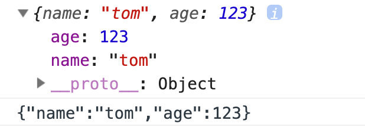

# XML和JSON

数据存储和传输的标准

## xml：

可扩展的标记语言(和html非常类似)

- 可扩展的
- 可自定义标签(可以支持中文<猫></猫>)
- xml是传输数据，html是显示数据
- 需要自定义标签

- xml技术用于解决什么问题？

  - 在现实生活中存在大量有关系的数据，例如省市

  - 这样的数据该如何表示并交给计算机处理？

    

- xml语言出现的根本目的在于描述上图那种有关系的数据

- 他是一种通用的数据交换格式

  ```xml
  <?xml version="1.0" encoding="utf-8"?>
  <中国>
  	<黑龙江>
  		<哈尔滨></哈尔滨>
  		<牡丹江></牡丹江>
  	</黑龙江>
  	<辽宁>
  		<沈阳></沈阳>
  		<大连></大连>
  	</辽宁>
  </中国>
  ```

- xml格式非常严谨的，有开始标签必须有结束标签

  - 中国就是根节点
  - 黑龙江是中国的子节点
  - 哈尔滨市黑龙江的子节点

- 开发中
  - 可以作为配置文件
    - web.xml
  - 系统之间数据的传输

## JSON

#### JSON，全称是 JavaScript Object Notation，即 JavaScript 对象标记法。

JSON 是一种轻量级（Light-Weight）、基于文本的（Text-Based）、可读的（Human-Readable）格式。


JSON 的名称中虽然带有 JavaScript，但这是指其语法规则是参考 JavaScript 对象的，而不是指只能用于 JavaScript 语言。

JSON 无论对于人，还是对于机器来说，都是十分便于阅读和书写的，而且相比 XML （另一种常见的数据交换格式），文件更小，因此迅速成为网络上十分流行的交换格式。


JSON 格式的创始人声称此格式永远不升级，这就表示这种格式具有长时间的稳定性，10 年前写的文件，10 年后也能用，没有任何兼容性问题。


#### JSON 的语法规则是怎样的

JSON 的语法规则十分简单，可称得上“优雅完美”，总结起来有：

- 数组（Array）用方括号(“[]”)表示。
- 对象（Object）用大括号（”{}”）表示。
- 名称/值对（name/value）组合成数组和对象。
- 名称（name）置于双引号中，值（value）有字符串、数值、布尔值、null、对象和数组。
- 并列的数据之间用逗号（“,”）分隔

```json
{
	"name": "Geoff Lui",
	"age": 26
}
```

#### JSON 和 XML

JSON 常被拿来与 XML 做比较，因为 JSON 的诞生本来就多多少少要有取代 XML 的意思。相比 XML，JSON 的优势如下：

- 没有结束标签，长度更短，读写更快
- 能够直接被 JavaScript 解释器解析
- 可以使用数组

```json
{
	"name": "Geoff Lui",
	"age": 26,
	"friends": ["Lily", "Lucy", "Gwen"]
}

var user = {"name":"tom","age":12}
获取年龄 user.age            

<root>
	<name>Geoff Lui</name>
	<age>26</age>
	<friends>Lily</friends>
	<friends>Lucy</friends>
	<friends>Gwen</friends>
</root>
```

#### JSON 解析和生成

在 JavaScript 中，有两个方法与此相关： JSON.parse 和 JSON.stringify 。

```html
<script>
	var str = '{"name":"tom","age":123}';
	var obj = JSON.parse(str);
	//把字符串转换成json对象
	console.log(obj);
	var jsonstr = JSON.stringify(obj);
	//把json对象转成json字符串
	console.log(jsonstr)
</script>
```



### 案例

- 浏览器直接解析xml文件
- 服务器传给客户端数据

```java
import java.io.IOException;
import java.io.PrintWriter;
import java.util.ArrayList;
import java.util.List;

import javax.servlet.ServletException;
import javax.servlet.annotation.WebServlet;
import javax.servlet.http.HttpServlet;
import javax.servlet.http.HttpServletRequest;
import javax.servlet.http.HttpServletResponse;

import com.aishang.domain.User;
import com.aishang.service.UserService;

@WebServlet("/xml")
public class XMLDemo extends HttpServlet {
	@Override
	protected void doGet(HttpServletRequest req, HttpServletResponse resp) throws ServletException, IOException {
		req.setCharacterEncoding("utf-8");
		resp.setContentType("text/xml;charset=utf-8");
		System.out.println("xml");
		PrintWriter out = resp.getWriter();
		UserService userService = new UserService();
		List<User> userList = userService.findAllUser(null, 1, 10);
		out.print("<response>");
		for (User user : userList) {
			out.print("<user>");
			out.print("<id>"+user.getId()+"</id>");
			out.print("<name>"+user.getUserName()+"</name>");
			out.print("<age>"+user.getUserAge()+"</age>");
			out.print("</user>");
		}
		out.print("</response>");
	}

	@Override
	protected void doPost(HttpServletRequest req, HttpServletResponse resp) throws ServletException, IOException {
		doGet(req, resp);
	}
}

```

```jsp
<%@ page language="java" contentType="text/html; charset=UTF-8"
	pageEncoding="UTF-8"%>
<%@taglib uri="http://java.sun.com/jsp/jstl/core" prefix="c"%>
<!DOCTYPE html>
<html lang="en">
<head>
<meta charset="UTF-8">
<meta name="viewport" content="width=device-width, initial-scale=1.0">
<meta http-equiv="X-UA-Compatible" content="ie=edge">
<title>Document</title>
<script src="http://code.jquery.com/jquery-latest.js"></script>
<script>
	$(function() {
		
	})
	
	function getXML() {
		$('#tab').css("display","block");
			$.ajax({
				url:'/1901/xml',
				dataType:'xml',
				success:function(data){
					console.log(data)
					$(data).find('user').each(function(){
						var id = $(this).children('id').text();
						console.log(id)
						var name = $(this).children('name').text();
						var age = $(this).children('age').text();
						$('#tab').append("<tr><td>"+id+"</td><td>"+name+"</td><td>"+age+"</td></tr>")
					})
					
				}
			})
		}
</script>
</head>
<body>
	<button onclick="getXML()">加载xml数据</button>
	<table  style="display:none" id="tab">
		<tr >
			<td>id</td>
			<td>name</td>
			<td>age</td>
		</tr>
	</table>
</body>
</html>
```


- json的省市联动

  ```html
  <!DOCTYPE html>
  <html lang="en">
  <head>
      <meta charset="UTF-8">
      <meta name="viewport" content="width=device-width, initial-scale=1.0">
      <meta http-equiv="X-UA-Compatible" content="ie=edge">
      <title>Document</title>
      <script>
          window.onload = function(){
              var obj = {"1":{"name0":"哈尔滨","name1":"齐齐哈尔","name2":"牡丹江"},"2":{"name0":"沈阳","name1":"大连","name2":"铁岭"}};
              var pro = document.getElementById('pro');
              var city = document.getElementById('city');
              pro.onchange = function(){
                  city.innerHTML = '';
                  if(pro.value ==1){
                      for(var index in obj){
                          if(index ==1){
                              for(var key in obj[index]){
                                  city.innerHTML+="<option value="+key+">"+obj[index][key]+"</option>"
                              }
                          }
                      }
                  }
              }
          }
      </script>
  </head>
  <body>
      <select name="" id="pro">
          <option value="0">请选择</option>
          <option value="1">黑龙江</option>
          <option value="2">辽宁</option>
      </select>
      <select name="" id="city">
          <option value="0">请选择</option>
      </select>
  </body>
  </html>
  ```

  

- json类别遍历

```java
//发送ajax 接收json
		$.ajax({
			url:'ajaxAction?flag=cate',
			dataType:'json',
			success:function(data){
				console.log(data);
				for (var i = 0; i < data.length; i++) {
					console.log(i+"--"+data[i].typeName)
					
					$('#cate').append(`<tr id="${'${i}'}">
							<td><input type="text" class="form-control"
								readonly=true name="typeID" value="${'${data[i].id}'}"></td>
							<td><input type="text" class="form-control"
								name="typeName" placeholder="类别名称" value="${'${data[i].typeName}'}"
								name="userName" onfocus="this.value = '';"
								onblur="if (this.value == '') {this.value = '${'${data[i].typeName}'}';}">
							</td>
							<td>
								<div style="width: 130px;">
									<input type="number" class="form-control"
										placeholder="类别优先级" name="sort" value="${'${data[i].sort}'}">
								</div>
							</td>
							<td class="td-actions text-right">
								<button type="submit" rel="tooltip" title="修改"
									class="btn btn-info btn-simple btn-xs">
									<i class="fa fa-edit"></i>
								</button>
								<button type="button" rel="tooltip" title="删除" name="del"
									value="22" class="btn btn-danger btn-simple btn-xs"
									onclick=delNewsType(${'${i}'},${'${data[i].id}'})>
									<i class="fa fa-times"></i>
								</button>
							</td>
						</tr>`)
				}
			}
		})
```

异步删除

```js
function delNewsType(id,delId){
		$.ajax({
			url:'categoryController?flag=delCate&id='+delId,
			success:function(data){
				console.log(data)
				if (data=="ok") {
					$('#'+id).remove();
				}else{
					alert("该类目下有新闻，不能删除");
				}
			}
		})
		
	}
```

判断类别下是否有新闻

```sql
select count(*) from tb_news,tb_newstype where tb_news.typeid = tb_newstype.id and tb_newstype.id=?
```

controller

```java
//删除类别
	private void delCate(HttpServletRequest req, HttpServletResponse resp) throws IOException {
		// TODO Auto-generated method stub
		System.out.println("删除类别");
		PrintWriter out = resp.getWriter();
		CategoryService categoryService = new CategoryService();
		String id = req.getParameter("id");
		System.out.println("id="+id);
		int num = categoryService.delCate(Integer.parseInt(id));
		if (num!=0) {
			//删除成功
			out.print("ok");
		}else {
			//不能删除，类目下有新闻
			out.print("no");
		}
	}
```

dao

```java
public int delCate(int id) {
		connection = DBUtil.getConnection();
		try {
			preparedStatement = connection.prepareStatement("select count(*) from tb_news,tb_newstype where tb_news.typeid = tb_newstype.id and tb_newstype.id=?");
			preparedStatement.setInt(1, id);
			rs = preparedStatement.executeQuery();
			if (rs.next()&&rs.getInt("count(*)")==0) {
				System.out.println("可以删除"+rs.getInt("count(*)"));
				//删除
				preparedStatement = connection.prepareStatement("delete from tb_newstype where id=?");
				preparedStatement.setInt(1, id);
				int num = preparedStatement.executeUpdate();
				return num;
			}
		} catch (SQLException e) {
			// TODO Auto-generated catch block
			e.printStackTrace();
		}finally {
			DBUtil.close(connection, preparedStatement, rs);
		}
		return 0;
	}
```

