# Spring01

整体19节课
4天spring
9天电子商务系统
6天电商后台管理系统

做出两个项目，并且掌握SSM框架、springboot、vue、elemenUI

## 一、SSM框架概述

Jquery：对于js进行了封装

SSH:   Struts、spring、hibernate
SSM：SpringMVC、spring、Mybatis
springboot: 针对javaweb开发用到的框架进行整合。理解为SSM的整合
springcloud：微服务

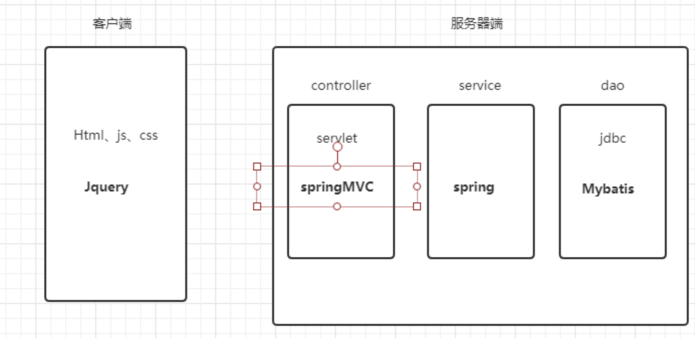

## 二、spring的介绍

Spring框架是一个开源的轻量级J2EE应用程序框架，由Rod Johnson发起，
是针对bean的生命周期进行管理的轻量级容器（lightweight container）。

适用范围：任何java应用程序

根本目的：简化java开发、管理bean
开源：开放源代码
轻量级: 轻量级一般就是非入侵性的、所依赖的东西非常少、资源占用非常少、部署简单等等，总之就是容易使用。
非入侵性: 无需依赖框架的任何类

### 1、spring由来

​	Rod Johnson在2002年编著的《Expert one on one J2EE design and development》一书中，对Java EE 系统框架臃肿、低效、脱离现实的种种现状提出了质疑，并积极寻求探索革新之道。以此书为指导思想，他编写了interface21框架，这是一个力图冲破J2EE传统开发的困境，从实际需求出发，着眼于轻便、灵巧，易于开发、测试和部署的轻量级开发框架。Spring框架即以interface21框架为基础，经过重新设计，并不断丰富其内涵，于2004年3月24日，发布了1.0正式版。同年他又推出了一部堪称经典的力作《Expert one-on-one J2EE Development without EJB》，该书在Java世界掀起了轩然大波，不断改变着Java开发者程序设计和开发的思考方式。在该书中，作者根据自己多年丰富的实践经验，对EJB的各种笨重臃肿的结构进行了逐一的分析和否定，并分别以简洁实用的方式替换之。至此一战功成，Rod Johnson成为一个改变Java世界的大师级人物。

### 2、spring的优点

- 方便解耦，简化开发
  - Spring就是一个大工厂，可以将所有对象创建和依赖关系维护，交给Spring管理
- AOP编程的支持
  - Spring提供面向切面编程，可以方便的实现对程序进行权限拦截、运行监控等功能
- 声明式事务的支持
  - 只需要通过配置就可以完成对事务的管理，而无需手动编程
- 方便程序的测试
  - Spring对Junit4支持，可以通过注解方便的测试Spring程序
- 方便集成各种优秀框架
  - Spring不排斥各种优秀的开源框架，其内部提供了对各种优秀框架（如：Struts、Hibernate、MyBatis、Quartz等）的直接支持
- 降低JavaEE API的使用难度
  - Spring 对JavaEE开发中非常难用的一些API（JDBC、JavaMail、远程调用等），都提供了封装，使这些API应用难度大大降低

### 3、spring的体系结构

spring框架为分层架构，
他包含一系列功能要素大概被分为20个模块。具体如图

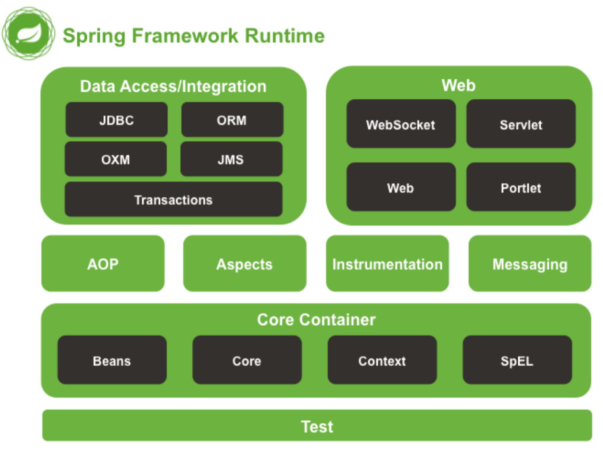

使用spring最简单的，只需导入核心容器
beans 创建对象
core 核心包
context 读取配置文件、注解
spEl 类似el表达式

## 三、掌握spring的核心-IOC

Spring的核心为AOP(面向切面)和IOC(控制反转)

 IOC：控制反转(Inverse of  Control)

控制反转：就是将创建对象的权利交由spring处理

- 正控：自己创建对象

- 反控：从spring容器中获取对象，无需关注创建对象的过程，也就是将创建对象的控制权交给spring

### 入门案例IOC

编写UserController调用UserService的案例，通过ioc和new两种方式创建UserService对象
目标:理解ioc(控制反转)

开发环境:idea, jdk1.8,spring-framework-5.1.5.RELEASE

编写流程

1. 下载Spring开发包 spring-framework-5.1.5.RELEASE 

2. 复制Spring开发 jar包到工程(核心4+1)

   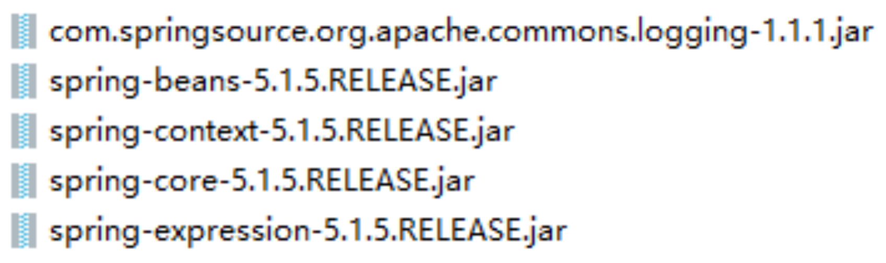

3. 编写Spring核心配置文件

4. 在程序中读取Spring配置文件，通过Spring框架获得Bean，完成相应操作

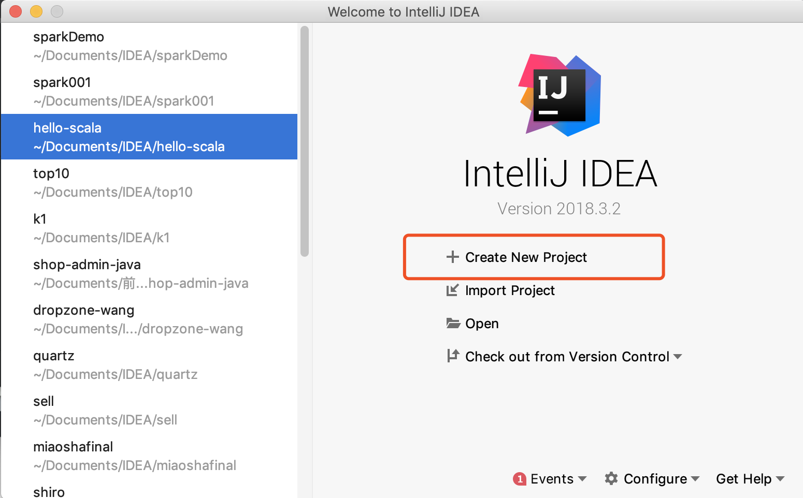

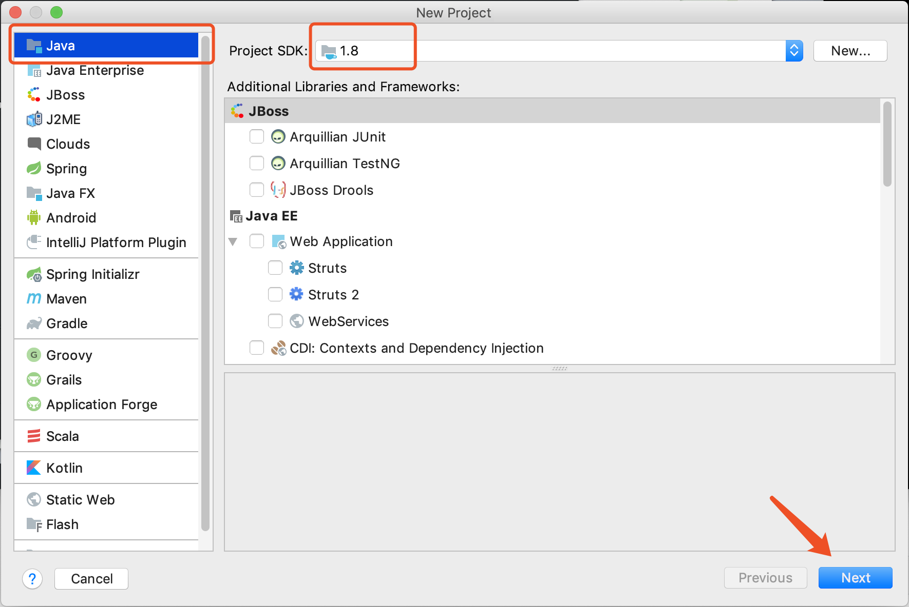

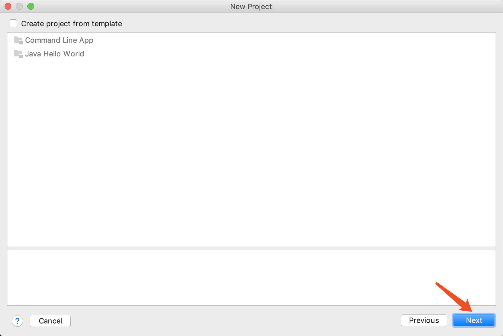

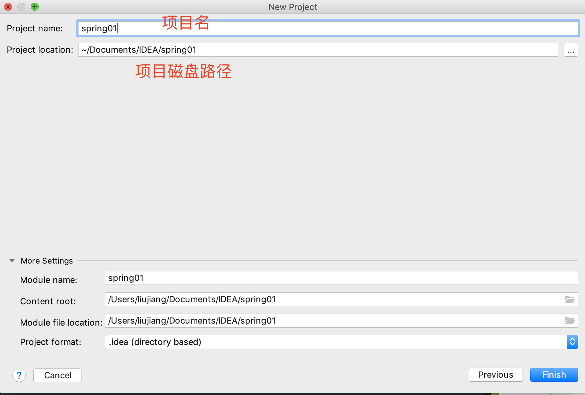

在src下创建包

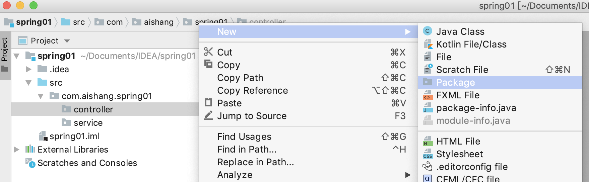

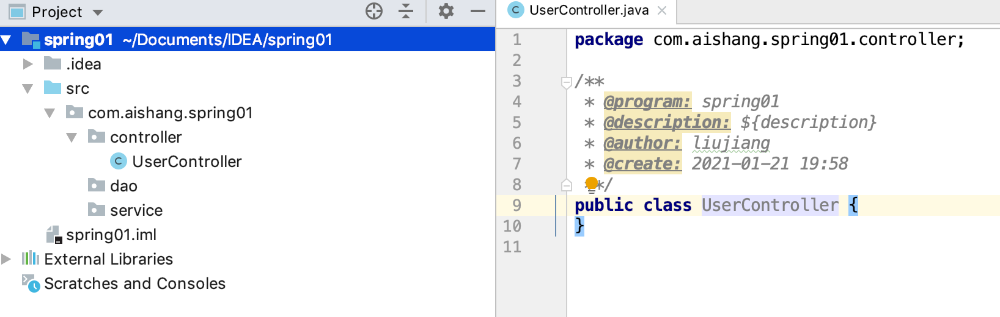

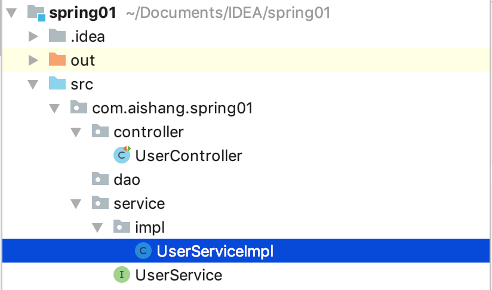

UserController

```java
package com.aishang.spring01.controller;

import com.aishang.spring01.service.UserService;
import com.aishang.spring01.service.impl.UserServiceImpl;
import org.junit.Test;

/**
 * @program: spring01
 * @description: ${description}
 * @author: liujiang
 * @create: 2021-01-21 19:58
 **/
public class UserController {
    @Test
    public void fun1() {
        System.out.println("hello");
    }

    @Test
    public void fun2() {
        UserService userService = new UserServiceImpl();
        userService.addUser();
    }
}

```

UserService

```java
package com.aishang.spring01.service;

/**
 * @program: spring01
 * @description: ${description}
 * @author: liujiang
 * @create: 2021-01-21 20:01
 **/
public interface UserService {
    void addUser();
}

```

UserServiceImpl

```java
package com.aishang.spring01.service.impl;

import com.aishang.spring01.service.UserService;

/**
 * @program: spring01
 * @description: ${description}
 * @author: liujiang
 * @create: 2021-01-21 20:01
 **/
public class UserServiceImpl implements UserService {
    @Override
    public void addUser() {
        System.out.println("添加用户成功");
    }
}

```

### IOC

4个核心包+1个依赖（它们4个依赖这一个）

src下创建lib包，粘贴到此文件夹

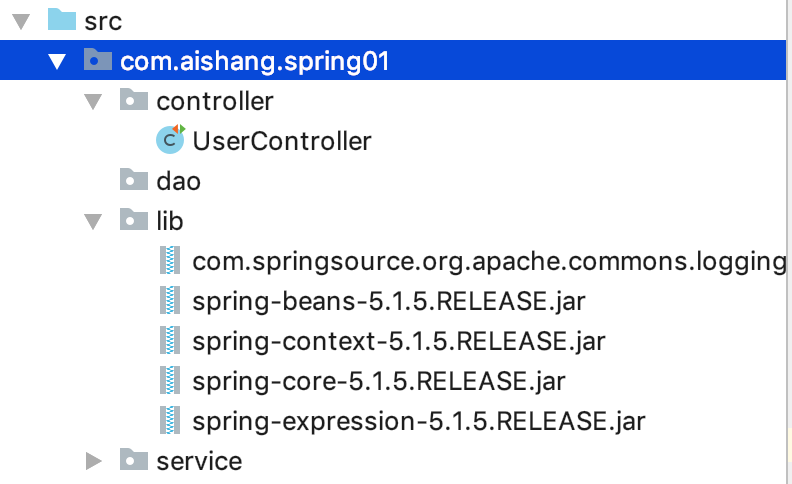

选中包，右键 add as library

#### 创建配置文件(在src目录下)


/Users/liujiang/Documents/JAVA课件/spring01资料/spring的jar包/spring-framework-5.1.5.RELEASE/docs/spring-framework-reference/html/xsd-config.html

这是他的说明文档

约束头

```xml
<?xml version="1.0" encoding="UTF-8"?>
<beans xmlns="http://www.springframework.org/schema/beans"
       xmlns:xsi="http://www.w3.org/2001/XMLSchema-instance"
       xsi:schemaLocation="
http://www.springframework.org/schema/beans http://www.springframework.org/schema/beans/spring-beans.xsd">

<!-- bean definitions here -->

</beans>
```

applicationContext.xml(或者叫application-context.xml)

```xml
<?xml version="1.0" encoding="UTF-8"?>
<beans xmlns="http://www.springframework.org/schema/beans"
       xmlns:xsi="http://www.w3.org/2001/XMLSchema-instance"
       xsi:schemaLocation="
http://www.springframework.org/schema/beans http://www.springframework.org/schema/beans/spring-beans.xsd">

    <!-- bean definitions here -->
    <!--id:对象名-->
    <!--class：全限定类名-->
    <bean id="userService" class="com.aishang.spring01.service.impl.UserServiceImpl"></bean>

</beans>
```

UserController

```java
@Test
public void fun3() {
    //        创建spring工厂,ClassPathXmlApplicationContext->读取xml配置文件的工厂
    ApplicationContext applicationContext = new ClassPathXmlApplicationContext("application-context.xml");
    //        从工厂中获取UserServiceBean（对象）  根据 xml中的id获取 对象
    UserService userService = (UserService) applicationContext.getBean("userService");
    //        调用方法
    userService.addUser();
}
```

## 四、掌握DI

### DI：依赖注入 （Dependency Injection)

分为依赖和注入两个部分
依赖：一个对象需要使用另一个对象
注入：通过setter方法(构造方法也可注入)进行另一个对象实例设置。
因为依赖所以注入:否则程序耦合

### DI与IOC的关系：DI是IOC的一种实现方式，除此之外还有DL

1. DL 已经被抛弃，因为他需要用户自己去是使用 API 进行查找资源和组装对象。即有侵入性。

2. DI 是 Spring 使用的方式，容器负责组件的装配。

### 入门案例DI

- 创建userService+实现类
- 编写xml
- 创建userDao的接口+实现类

- 测试

在此案例中新增dao层，通过解决userService在spring中如何依赖userDao的问题,来理解DI

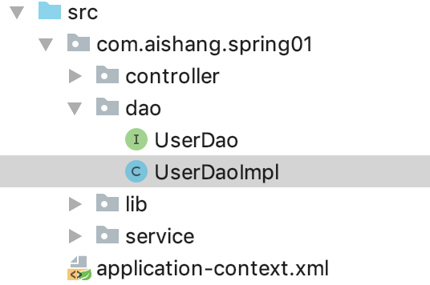

此时调用dao输出添加用户成功，改造之前service

option+shift+空格（ctrl+shift+空格）new 后面时使用 提示

```java
package com.aishang.spring01.service.impl;

import com.aishang.spring01.dao.UserDao;
import com.aishang.spring01.dao.UserDaoImpl;
import com.aishang.spring01.service.UserService;

/**
 * @program: spring01
 * @description: ${description}
 * @author: liujiang
 * @create: 2021-01-21 20:01
 **/
public class UserServiceImpl implements UserService {
    private UserDao userDao = new UserDaoImpl();
    @Override
    public void addUser() {
        userDao.addUser();
    }
}

```

现在我直接new UserDaoImpl（）就写死了，耦合了，以后我想new 别的就不行了，所以我需要注入

```java
package com.aishang.spring01.service.impl;

import com.aishang.spring01.dao.UserDao;
import com.aishang.spring01.dao.UserDaoImpl;
import com.aishang.spring01.service.UserService;

/**
 * @program: spring01
 * @description: ${description}
 * @author: liujiang
 * @create: 2021-01-21 20:01
 **/
public class UserServiceImpl implements UserService {
    private UserDao userDao;

    public void setUserDao(UserDao userDao) {
        this.userDao = userDao;
    }

    @Override
    public void addUser() {
        userDao.addUser();
    }
}

```

UserController

```java
@Test
public void fun3() {
    //        创建spring工厂,ClassPathXmlApplicationContext->读取xml配置文件的工厂
    ApplicationContext applicationContext = new ClassPathXmlApplicationContext("application-context.xml");
    //        从工厂中获取UserServiceBean（对象）  根据 xml中的id获取 对象
    UserService userService = (UserService) applicationContext.getBean("userService");
    userService.setUserDao();
    //        调用方法
    userService.addUser();
}
```

由于调用UserServiceImpl时需要使用setUserDao，给我传进一个userDao，

所以在controller中需要我调用set方法，但是就有问题了，controller调用service，但是我这直接调用dao了。

```java
相当于这么写
UserDao userDao = new UserDaoImpl();
userService.setUserDao(userDao);
```

如果在service中set，那还是需要直接new UserDao()了

#### spring中提供了依赖注入的方式

```xml
<?xml version="1.0" encoding="UTF-8"?>
<beans xmlns="http://www.springframework.org/schema/beans"
       xmlns:xsi="http://www.w3.org/2001/XMLSchema-instance"
       xsi:schemaLocation="
http://www.springframework.org/schema/beans http://www.springframework.org/schema/beans/spring-beans.xsd">

    <!-- bean definitions here -->
    <!--id:对象名-->
    <!--class：全限定类名-->
    <bean id="userService" class="com.aishang.spring01.service.impl.UserServiceImpl">
        <!--userService.setUserDao(userDao);-->
        <!--name是方法名 setUserDao 去调用set  首字母小写-->
        <!--ref 是注入的对象  就是要注入的bean id=“userDao”-->
        <property name="userDao" ref="userDao"></property>
    </bean>

    <!-- 相当于  UserDao userDao = new UserDaoImpl();-->
    <bean id="userDao" class="com.aishang.spring01.dao.UserDaoImpl"></bean>
</beans>
```

```java
package com.aishang.spring01.service.impl;

import com.aishang.spring01.dao.UserDao;
import com.aishang.spring01.dao.UserDaoImpl;
import com.aishang.spring01.service.UserService;

/**
 * @program: spring01
 * @description: ${description}
 * @author: liujiang
 * @create: 2021-01-21 20:01
 **/
public class UserServiceImpl implements UserService {
    private UserDao userDao;

    public void setUserDao(UserDao userDao) {
        this.userDao = userDao;
    }

    @Override
    public void addUser() {
        userDao.addUser();
    }
}

```


## 五、SpringBean的作用域

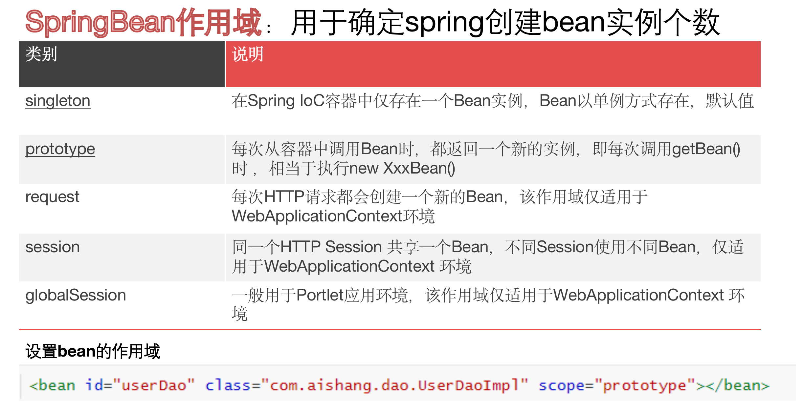


```java
@Test
public void fun3() {
    //        创建spring工厂,ClassPathXmlApplicationContext->读取xml配置文件的工厂
    ApplicationContext applicationContext = new ClassPathXmlApplicationContext("application-context.xml");
    //        从工厂中获取UserServiceBean（对象）  根据 xml中的id获取 对象
    UserService userService1 = (UserService) applicationContext.getBean("userService");
    UserService userService2 = (UserService) applicationContext.getBean("userService");
    System.out.println(userService1==userService2);//true
    //        调用方法
    //        userService.addUser();
}
```

判断给我创建了几个userService对象，结果是true，一个对象（单例设计模式）

多例

```xml
<bean id="userService" class="com.aishang.spring01.service.impl.UserServiceImpl" scope="prototype">
```

一般service 、dao （没有持有数据的对象）交给spring创建

实体类不用，因为实体类我们需要的是多例，如果交给spring，生命周期更长，并且也不能设置成单列（都是一个人），正常情况下都是在方法内创建对象，方法随之出栈