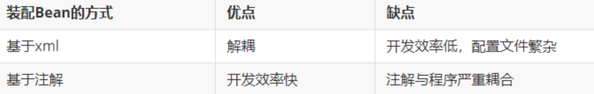
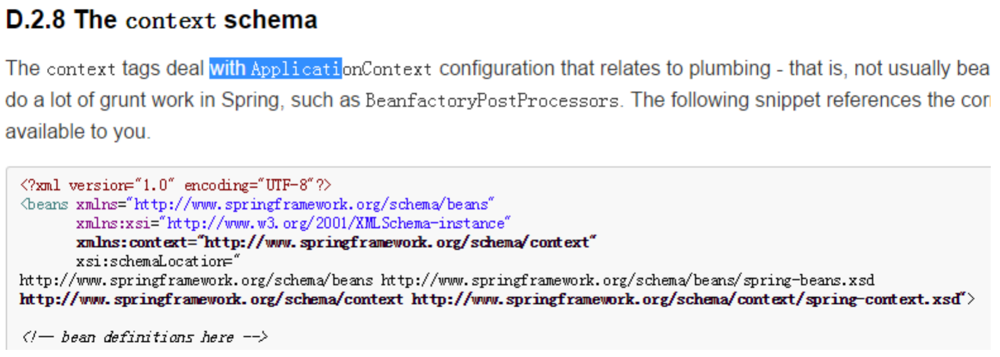
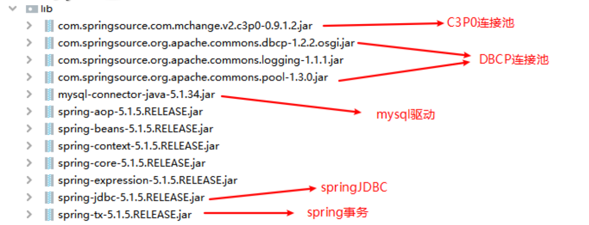

# spring02

## 一、基于注解装配Bean

### 1.注解

就是一个类，和class、interface一样，只是类的修饰符为@interface。

是jdk5.0引入的一种注释机制。支持自定义注解。

可以标注在类、变量、方法、包。与Javadoc不同，java可以通过反射获取到注解内容

### 2.spring程序装配bean的两种方式:

基于xml配置文件装配bean、基于注解装配bean。

### 3.为什么学习基于注解装配bean？



### 4、入门案例-基于注解装配bean

```java
package com.aishang.spring01.service.impl;

import com.aishang.spring01.dao.UserDao;
import com.aishang.spring01.dao.UserDaoImpl;
import com.aishang.spring01.service.UserService;
import org.springframework.stereotype.Component;

/**
 * @program: spring01
 * @description: ${description}
 * @author: liujiang
 * @create: 2021-01-21 20:01
 **/
@Component  //id:userServiceImpl
public class UserServiceImpl implements UserService {
    private UserDao userDao;

    public void setUserDao(UserDao userDao) {
        this.userDao = userDao;
    }

    @Override
    public void addUser() {
        userDao.addUser();
    }
}


```

```java
@Test
public void fun3() {
    ApplicationContext applicationContext = new ClassPathXmlApplicationContext("application-context.xml");
    UserService userService1 = (UserService) applicationContext.getBean("userServiceImpl");
    userService1.addUser();
}
```

```xml
<?xml version="1.0" encoding="UTF-8"?>
<beans xmlns="http://www.springframework.org/schema/beans"
       xmlns:xsi="http://www.w3.org/2001/XMLSchema-instance"
       xsi:schemaLocation="
http://www.springframework.org/schema/beans http://www.springframework.org/schema/beans/spring-beans.xsd">

</beans>
```

运行报错， No bean named 'userServiceImpl' available

#### 环境配置：

1.使用注解装配bean要添加约束



```xml
<?xml version="1.0" encoding="UTF-8"?>
<beans xmlns="http://www.springframework.org/schema/beans"
       xmlns:xsi="http://www.w3.org/2001/XMLSchema-instance"
       xmlns:context="http://www.springframework.org/schema/context"
       xsi:schemaLocation="
http://www.springframework.org/schema/beans http://www.springframework.org/schema/beans/spring-beans.xsd
http://www.springframework.org/schema/context http://www.springframework.org/schema/context/spring-context.xsd">

<!-- bean definitions here -->

</beans>
```

```java
<?xml version="1.0" encoding="UTF-8"?>
<beans xmlns="http://www.springframework.org/schema/beans"
       xmlns:xsi="http://www.w3.org/2001/XMLSchema-instance"
       xmlns:context="http://www.springframework.org/schema/context"
       xsi:schemaLocation="
http://www.springframework.org/schema/beans http://www.springframework.org/schema/beans/spring-beans.xsd
http://www.springframework.org/schema/context http://www.springframework.org/schema/context/spring-context.xsd">

    <!-- bean definitions here -->
    <!--扫描包路径-->
    <context:component-scan base-package="com.aishang.spring01"></context:component-scan>
</beans>
```

```java
package com.aishang.spring01.dao;

import org.springframework.stereotype.Component;

/**
 * @program: spring01
 * @description: ${description}
 * @author: liujiang
 * @create: 2021-01-21 20:50
 **/
@Component
public class UserDaoImpl implements UserDao{
    @Override
    public void addUser() {
        System.out.println("dao添加用户成功");
    }
}

```

报错：java.lang.ClassNotFoundException: org.springframework.aop.TargetSource

2.导入spring-aop包

spring-aop-5.1.5.RELEASE.jar

报错：NullPointerException

3.按照类型注入Autowired

```java
package com.aishang.spring01.service.impl;

import com.aishang.spring01.dao.UserDao;
import com.aishang.spring01.dao.UserDaoImpl;
import com.aishang.spring01.service.UserService;
import org.springframework.beans.factory.annotation.Autowired;
import org.springframework.stereotype.Component;

/**
 * @program: spring01
 * @description: ${description}
 * @author: liujiang
 * @create: 2021-01-21 20:01
 **/
@Component
public class UserServiceImpl implements UserService {
    @Autowired
    private UserDao userDao;
 /*
    public void setUserDao(UserDao userDao) {
        this.userDao = userDao;
    }
*/
    @Override
    public void addUser() {
        userDao.addUser();
    }
}

```

注入的类型是userDao,在扫描到set方法的时候，从工厂中现有的bean里找有没有符合这个类型的

不需要写set方法，通过反射直接获取成员变量

#### 如果现在有两个UserDao类型的实现类呢？

4.按照bean的id注入

```java
package com.aishang.spring01.dao;

import org.springframework.stereotype.Component;

/**
 * @program: spring01
 * @description: ${description}
 * @author: liujiang
 * @create: 2021-01-22 15:45
 **/
@Component
public class UserDao2Impl implements UserDao {
    @Override
    public void addUser() {
        System.out.println("UserDao2Impl  addUser");
    }
}

```

运行报错：No qualifying bean of type 'com.aishang.spring01.dao.UserDao' available: expected single matching bean but found 2: userDao2Impl,userDaoImpl

没有一个唯一的，找到2个,那么就需要指定

```java
package com.aishang.spring01.service.impl;

import com.aishang.spring01.dao.UserDao;
import com.aishang.spring01.dao.UserDaoImpl;
import com.aishang.spring01.service.UserService;
import org.springframework.beans.factory.annotation.Autowired;
import org.springframework.beans.factory.annotation.Qualifier;
import org.springframework.stereotype.Component;

/**
 * @program: spring01
 * @description: ${description}
 * @author: liujiang
 * @create: 2021-01-21 20:01
 **/
@Component
public class UserServiceImpl implements UserService {
    @Autowired
    @Qualifier("userDao2Impl") //id:userDao2Impl  按照bean的id注入  即按照类型也找到id
    private UserDao userDao;

    @Override
    public void addUser() {
        userDao.addUser();
    }
}

```

### 优化

根据MVC分层，演化成对应的注解

service ->@service

Controller ->@Controller

dao -> @Repository 

依赖注入：@Resource(name=“beanID”) 按照bean的id注入@Resource(name=“userDaoImpl”)

如果不指定 直接写 @Resource  就是按照类型注入

依赖注入，可以给私有字段设置，也可以给setter方法设置，
上述依赖注入为注入引用值，若注入普通值：@Value("")注解

```java
package com.aishang.spring01.service.impl;

import com.aishang.spring01.dao.UserDao;
import com.aishang.spring01.dao.UserDaoImpl;
import com.aishang.spring01.service.UserService;
import org.springframework.beans.factory.annotation.Autowired;
import org.springframework.beans.factory.annotation.Qualifier;
import org.springframework.stereotype.Component;
import org.springframework.stereotype.Service;

import javax.annotation.Resource;

/**
 * @program: spring01
 * @description: ${description}
 * @author: liujiang
 * @create: 2021-01-21 20:01
 **/
@Service
public class UserServiceImpl implements UserService {
    @Resource(name = "userDao2Impl")
    private UserDao userDao;

    @Override
    public void addUser() {
        userDao.addUser();
    }
}

```

```java
package com.aishang.spring01.dao;

import org.springframework.stereotype.Component;
import org.springframework.stereotype.Repository;

/**
 * @program: spring01
 * @description: ${description}
 * @author: liujiang
 * @create: 2021-01-21 20:50
 **/
@Repository
public class UserDaoImpl implements UserDao{
    @Override
    public void addUser() {
        System.out.println("dao添加用户成功");
    }
}

```

```java
package com.aishang.spring01.service.impl;

import com.aishang.spring01.dao.UserDao;
import com.aishang.spring01.dao.UserDaoImpl;
import com.aishang.spring01.service.UserService;
import org.springframework.beans.factory.annotation.Autowired;
import org.springframework.beans.factory.annotation.Qualifier;
import org.springframework.beans.factory.annotation.Value;
import org.springframework.stereotype.Component;
import org.springframework.stereotype.Service;

import javax.annotation.Resource;

/**
 * @program: spring01
 * @description: ${description}
 * @author: liujiang
 * @create: 2021-01-21 20:01
 **/
@Service
public class UserServiceImpl implements UserService {
    @Resource(name = "userDao2Impl")
    private UserDao userDao;
    @Value("tom")
    private String name;

    @Override
    public void addUser() {
        System.out.println(name);
        userDao.addUser();
    }
}

```

## 二、JdbcTemplate

是spring 提供用于操作JDBC模板工具类，类似：DBUtils

#### 为什么使用JdbcTemplate？

使用jdbc时,每次都需要自己获取PreparedStatement，

输入sql语句参数，关闭连接等操作。造成操作冗余。影响我们敲代码的效率。有了JDBCTemplate以后就可以只写

SQL语句就可以了。。

### 改写之前的案例，将dao层的测试代码，改为使用JdbcTemplate操作数据库为tb_users表添加一条数据

导包




```java
package com.aishang.spring01.dao;

import org.apache.commons.dbcp.BasicDataSource;
import org.springframework.jdbc.core.JdbcTemplate;
import org.springframework.stereotype.Component;

public class UserDao2Impl implements UserDao {
    @Override
    public void addUser() {
//        创建数据源
        BasicDataSource basicDataSource = new BasicDataSource();
        basicDataSource.setUrl("jdbc:mysql://localhost:3306/1901");
        basicDataSource.setUsername("root");
        basicDataSource.setPassword("password");
        basicDataSource.setDriverClassName("com.mysql.jdbc.Driver");
//        创建JdbcTemplate对象
        JdbcTemplate jt = new JdbcTemplate();
        jt.setDataSource(basicDataSource);
//        执行crud
        jt.update("insert into tb_users values(default,?,?,?,?,?,?,?)",4,"jt","123","0012","男",88,0);
    }

}
```

```xml
<?xml version="1.0" encoding="UTF-8"?>
<beans xmlns="http://www.springframework.org/schema/beans"
       xmlns:xsi="http://www.w3.org/2001/XMLSchema-instance"
       xmlns:context="http://www.springframework.org/schema/context"
       xsi:schemaLocation="
http://www.springframework.org/schema/beans http://www.springframework.org/schema/beans/spring-beans.xsd
http://www.springframework.org/schema/context http://www.springframework.org/schema/context/spring-context.xsd">

    <!-- bean definitions here -->
    <bean id="userDao2Impl" class="com.aishang.spring01.dao.UserDao2Impl"></bean>
    <!--扫描包路径-->
    <context:component-scan base-package="com.aishang.spring01"></context:component-scan>
</beans>
```

### 改造代码

```java
package com.aishang.spring01.dao;

import org.apache.commons.dbcp.BasicDataSource;
import org.springframework.jdbc.core.JdbcTemplate;
import org.springframework.stereotype.Component;
import org.springframework.stereotype.Repository;

import javax.annotation.Resource;
public class UserDao2Impl implements UserDao {
    private JdbcTemplate jt = new JdbcTemplate();

    public void setJt(JdbcTemplate jt) {
        this.jt = jt;
    }

    @Override
    public void addUser() {
        jt.update("insert into tb_users values(default,?,?,?,?,?,?,?)", 4, "jt", "123", "0012", "男", 88, 0);
    }

}

```

```xml
<?xml version="1.0" encoding="UTF-8"?>
<beans xmlns="http://www.springframework.org/schema/beans"
       xmlns:xsi="http://www.w3.org/2001/XMLSchema-instance"
       xmlns:context="http://www.springframework.org/schema/context"
       xsi:schemaLocation="
http://www.springframework.org/schema/beans http://www.springframework.org/schema/beans/spring-beans.xsd
http://www.springframework.org/schema/context http://www.springframework.org/schema/context/spring-context.xsd">

    <!-- bean definitions here -->
    <bean id="userDao2Impl" class="com.aishang.spring01.dao.UserDao2Impl">
        <!--name 去掉set 首字母小写   ref 引入下面的bean-->
        <property name="jt" ref="jt"></property>
    </bean>
    <!--jdbcTemplate-->
    <bean id="jt" class="org.springframework.jdbc.core.JdbcTemplate">
        <property name="dataSource" ref="dataSource"></property>
    </bean>
    <!--datasource-->
    <bean id="dataSource" class="org.apache.commons.dbcp.BasicDataSource">
        <property name="driverClassName" value="com.mysql.jdbc.Driver"></property>
        <property name="url" value="jdbc:mysql://localhost:3306/1901"></property>
        <property name="username" value="root"></property>
        <property name="password" value="password"></property>
    </bean>
    <!--扫描包路径-->
    <context:component-scan base-package="com.aishang.spring01"></context:component-scan>
</beans>
```

### 继续抽取

创建BaseDao

```java
package com.aishang.spring01.dao;

import org.springframework.jdbc.core.JdbcTemplate;
public class BaseDao {
    private JdbcTemplate jt = new JdbcTemplate();

    public void setJt(JdbcTemplate jt) {
        this.jt = jt;
    }

    public JdbcTemplate getJt() {
        return jt;
    }
}

```

UserDao

```java
package com.aishang.spring01.dao;

import org.apache.commons.dbcp.BasicDataSource;
import org.springframework.jdbc.core.JdbcTemplate;
import org.springframework.stereotype.Component;
import org.springframework.stereotype.Repository;

import javax.annotation.Resource;
public class UserDao2Impl extends BaseDao implements UserDao {

    @Override
    public void addUser() {
        getJt().update("insert into tb_users values(default,?,?,?,?,?,?,?)", 4, "jt", "123", "0012", "男", 88, 0);
    }

}

```

### 最终版

spring中已经给我提供了类似的BaseDao

```java
package com.aishang.spring01.dao;

import org.apache.commons.dbcp.BasicDataSource;
import org.springframework.jdbc.core.JdbcTemplate;
import org.springframework.jdbc.core.support.JdbcDaoSupport;
import org.springframework.stereotype.Component;
import org.springframework.stereotype.Repository;
import javax.annotation.Resource;
public class UserDao2Impl extends JdbcDaoSupport implements UserDao {

    @Override
    public void addUser() {
        getJdbcTemplate().update("insert into tb_users values(default,?,?,?,?,?,?,?)", 4, "jt2", "123", "0012", "男", 88, 0);
    }

}

```

```xml
<?xml version="1.0" encoding="UTF-8"?>
<beans xmlns="http://www.springframework.org/schema/beans"
       xmlns:xsi="http://www.w3.org/2001/XMLSchema-instance"
       xmlns:context="http://www.springframework.org/schema/context"
       xsi:schemaLocation="
http://www.springframework.org/schema/beans http://www.springframework.org/schema/beans/spring-beans.xsd
http://www.springframework.org/schema/context http://www.springframework.org/schema/context/spring-context.xsd">

    <!-- bean definitions here -->
    <bean id="userDao2Impl" class="com.aishang.spring01.dao.UserDao2Impl">
        <property name="dataSource" ref="dataSource"></property>
    </bean>
    <bean id="dataSource" class="org.apache.commons.dbcp.BasicDataSource">
        <property name="driverClassName" value="com.mysql.jdbc.Driver"></property>
        <property name="url" value="jdbc:mysql://localhost:3306/1901"></property>
        <property name="username" value="root"></property>
        <property name="password" value="password"></property>
    </bean>
    <!--扫描包路径-->
    <context:component-scan base-package="com.aishang.spring01"></context:component-scan>
</beans>
```

还有一个问题，我在application-config 这个spring配置文件中用了连接池的配置，所以我也可以抽取

在src目录下创建db.properties

```properties
jdbc.driverClassName = com.mysql.jdbc.Driver
jdbc.url = jdbc:mysql://localhost:3306/1901
jdbc.username = root
jdbc.password = password
```

```xml
<?xml version="1.0" encoding="UTF-8"?>
<beans xmlns="http://www.springframework.org/schema/beans"
       xmlns:xsi="http://www.w3.org/2001/XMLSchema-instance"
       xmlns:context="http://www.springframework.org/schema/context"
       xsi:schemaLocation="
http://www.springframework.org/schema/beans http://www.springframework.org/schema/beans/spring-beans.xsd
http://www.springframework.org/schema/context http://www.springframework.org/schema/context/spring-context.xsd">

    <!-- bean definitions here -->
    <bean id="userDao2Impl" class="com.aishang.spring01.dao.UserDao2Impl">
        <property name="dataSource" ref="dataSource"></property>
    </bean>
    <!--读取properties配置文件-->
    <context:property-placeholder location="db.properties"></context:property-placeholder>
    <bean id="dataSource" class="org.apache.commons.dbcp.BasicDataSource">
        <property name="driverClassName" value="${jdbc.driverClassName}"></property>
        <property name="url" value="${jdbc.url}"></property>
        <property name="username" value="${jdbc.username}"></property>
        <property name="password" value="${jdbc.password}"></property>
    </bean>
   
    <!--扫描包路径-->
    <context:component-scan base-package="com.aishang.spring01"></context:component-scan>
</beans>
```

附：@Value注解,获取配置文件的参数，前体先设置让spring读取配置文件

```java
package com.aishang.spring01.dao;

import org.apache.commons.dbcp.BasicDataSource;
import org.springframework.beans.factory.annotation.Value;
import org.springframework.jdbc.core.JdbcTemplate;
import org.springframework.jdbc.core.support.JdbcDaoSupport;
import org.springframework.stereotype.Component;
import org.springframework.stereotype.Repository;

import javax.annotation.Resource;

public class UserDao2Impl extends JdbcDaoSupport implements UserDao {
    @Value("${jdbc.url}")
    private String name;

    @Override
    public void addUser() {
        System.out.println(name);
        getJdbcTemplate().update("insert into tb_users values(default,?,?,?,?,?,?,?)", 4, "jt3", "123", "0012", "男", 88, 0);
    }
}

```

