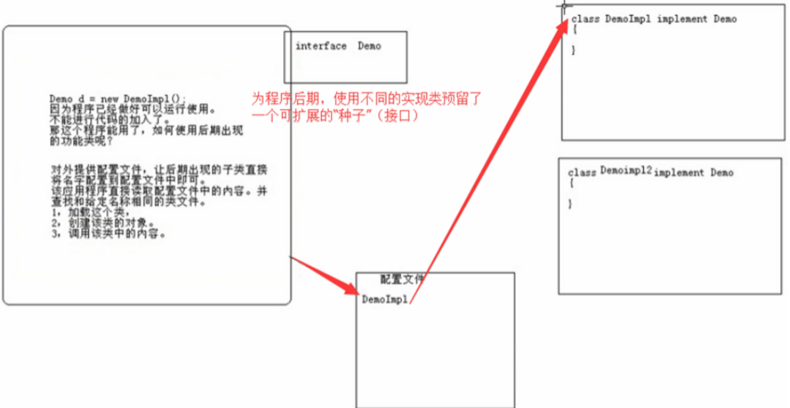
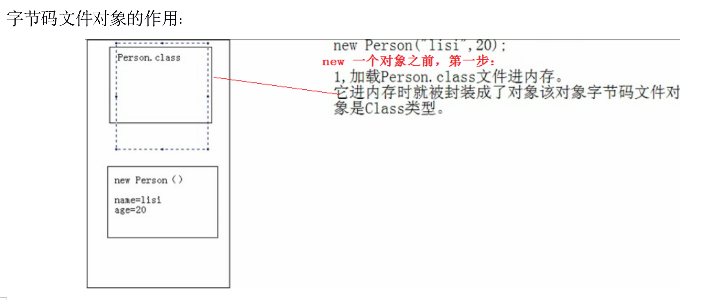

# 反射

Java的反射机制是在运行的状态中，对于任意的一个类，都能够知道这个类的所有属性和方法；对于任意一个对象，能够调用它的任意一个属性和方法，这种动态获取的信息以及动态调用对象的方法的功能成为java语言的反射机制。简单一句话，反射技术可以对类进行解剖。

### 为什么要对类进行解剖？应用场景是什么。

我们能随便对已经发布的一个类的代码做出改动吗？如果没有源码怎么办？

  

 

 应用程序使用的类不确定时，可以让使用者将具体的实现类名存储到配置文件中，然后该程序通过反射技术对指定的类进行内容获取。包括：

1. 加载这个类

2. 创建该类的对象（实例）

3. 调用该类中的内容

被反射的类一般都需要具备特定的规则，反射才有意义。反射技术的出现大大提高了程序的可扩展性。

# 1、字节码文件对象的获取

写一个Person类，下面将要对这个类进行剖析

```java
package com.aishang.day14;

public class Person {
	private String name;
	private int age;

	public Person() {
		System.out.println("Person 构造方法运行");
	}

	public Person(String name, int age) {
		this.name = name;
		this.age = age;
	}

	@Override
	public String toString() {
		return "Person [name=" + name + ", age=" + age + "]";
	}

	public static void show() {
		System.out.println("static show run");
	}

	public String eate(String a, int b) {
		String res = a + b;
		System.out.println("function param:" + a + "." + b);
		return res;
	}

	private void privateShow() {
		System.out.println("private show run...");
	}
}

```



### 字节码文件获取的第一种方式：通过对象实例的.getClass()获取

```java
public class Demo {
	public static void main(String[] args) {
//		第一种方式，通过对象的getClass()方法获取
//		局限性：每次找字节码文件对象，都需要具体的类和对象（Person 、p）
		Person p1 = new Person();
		Person p2 = new Person();
		Class<?> clazz1 = p1.getClass();
		Class<?> clazz2 = p1.getClass();
		System.out.println(p1==p2);
		System.out.println(clazz1==clazz2);
	}
}

```

### 字节码文件获取的第二种方式：通过类的.class属性获取

```java
package com.aishang.day14;

public class Demo {
	public static void main(String[] args) {
//		比第一种简单，不用创建对象，但是还是要用到具体的类
		Class clazz1 = Person.class;
		Class clazz2 = Person.class;
		System.out.println(clazz1 == clazz2);
	}
}

```

### 字节码文件获取的第三种方式：通过Class类的forName()方法获取

```java
package com.aishang.day14;

public class Demo {
	public static void main(String[] args) throws ClassNotFoundException {
//		只要知道类名即可，不需使用该类和对象，有利于扩展
//		需要传入一个字符串，就是全限定类名（全限定类名：包名+类名）
//		你写的类名不一定对，所以抛异常
		Class<?> clazz = Class.forName("com.aishang.day14.Person");
		System.out.println(clazz);
	}
}

```

# 2、对象实例的获取

传统创建对象的方式new

如果不知道这个类，那么就需要用反射

通过class类中的newInstance()创建

```java
package com.aishang.day14;

public class Demo {
	public static void main(String[] args) throws ClassNotFoundException, InstantiationException, IllegalAccessException {
//		只要知道类名即可，不需使用该类和对象，有利于扩展
//		需要传入一个字符串，就是全限定类名（全限定类名：包名+类名）
//		你写的类名不一定对，所以抛异常
		Class<?> clazz = Class.forName("com.aishang.day14.Person");
		Object obj = clazz.newInstance(); //相当于调用了默认的构造方法
//		以上过程相当于： Person p =new Person();
		System.out.println(obj);//Person [name=null, age=0]
	}
}

```

### 调用非默认的构造器

```java
package com.aishang.day14;

import java.lang.reflect.Constructor;
import java.lang.reflect.InvocationTargetException;

public class Demo {
	public static void main(String[] args) throws Exception {
		Class<?> clazz = Class.forName("com.aishang.day14.Person");
		Constructor<?> constructor = clazz.getConstructor();
		Object obj = constructor.newInstance();
		System.out.println(obj);
//		相当于还是调用的无参构造
	}
}

```

```java
package com.aishang.day14;

import java.lang.reflect.Constructor;
import java.lang.reflect.InvocationTargetException;

public class Demo {
	public static void main(String[] args) throws Exception {
		Class<?> clazz = Class.forName("com.aishang.day14.Person");
//		指定参数
		Constructor<?> constructor = clazz.getConstructor(String.class,int.class);
		Object obj = constructor.newInstance("tom",18);
		System.out.println(obj);
	}
}
```

获取所有构造方法

```java
package com.aishang.day14;

import java.lang.reflect.Constructor;
import java.lang.reflect.InvocationTargetException;

public class Demo {
	public static void main(String[] args) throws Exception {
		Class<?> clazz = Class.forName("com.aishang.day14.Person");
		Constructor<?>[] constructors = clazz.getConstructors();
		for (Constructor<?> c : constructors) {
			System.out.println(c);
		}
	}
}

```

只能获取公有构造方法，把一个构造方法改成私有

```java
package com.aishang.day14;

public class Person {
	private String name;
	private int age;

	private Person() {
		System.out.println("Person 构造方法运行");
	}

	public Person(String name, int age) {
		this.name = name;
		this.age = age;
	}

	@Override
	public String toString() {
		return "Person [name=" + name + ", age=" + age + "]";
	}

	public static void show() {
		System.out.println("static show run");
	}

	public String eate(String a, int b) {
		String res = a + b;
		System.out.println("function param:" + a + "." + b);
		return res;
	}

	private void privateShow() {
		System.out.println("private show run...");
	}
}

```

获取所有构造方法

```java
package com.aishang.day14;

import java.lang.reflect.Constructor;
import java.lang.reflect.InvocationTargetException;

public class Demo {
	public static void main(String[] args) throws Exception {
		Class<?> clazz = Class.forName("com.aishang.day14.Person");
		Constructor<?>[] constructors = clazz.getDeclaredConstructors();
		for (Constructor<?> c : constructors) {
			System.out.println(c);
		}
	}
}

```

把构造方法全部私有，接着通过有参构造创建对象

```java
package com.aishang.day14;

import java.lang.reflect.Constructor;
import java.lang.reflect.InvocationTargetException;

public class Demo {
	public static void main(String[] args) throws Exception {
		Class<?> clazz = Class.forName("com.aishang.day14.Person");
		Constructor<?> c = clazz.getDeclaredConstructor(String.class,int.class);
		Object obj = c.newInstance("tom",18);
		System.out.println(obj);
	}
}

```

报错：无效访问异常，因为构造方法私有。

需要取消访问权限

```java
public static void main(String[] args) throws Exception {
    Class<?> clazz = Class.forName("com.aishang.day14.Person");
    Constructor<?> c = clazz.getDeclaredConstructor(String.class,int.class);
    c.setAccessible(true);
    Object obj = c.newInstance("tom",18);
    System.out.println(obj);
}
```

# 3、字段获取

```java
public static void main(String[] args) throws Exception {
    Class<?> clazz = Class.forName("com.aishang.day14.Person");
    //		Field[] fields = clazz.getFields();获取的是公有的
    Field[] fields = clazz.getDeclaredFields();
    for (Field field : fields) {
        System.out.println(field);
    }
}
```

获取指定字段

```java
public static void main(String[] args) throws Exception {
    Class<?> clazz = Class.forName("com.aishang.day14.Person");
    Field age = clazz.getDeclaredField("age");
    System.out.println(age);
}
```

# 4、获取方法

```java
public static void main(String[] args) throws Exception {
    Class<?> clazz = Class.forName("com.aishang.day14.Person");
    Method[] declaredMethods = clazz.getDeclaredMethods();
    for (Method method : declaredMethods) {
        System.out.println(method);
    }
}
```

获取指定方法

```java
	public static void main(String[] args) throws Exception {
		Class<?> clazz = Class.forName("com.aishang.day14.Person");
		Method m = clazz.getDeclaredMethod("eate", String.class,int.class);
		System.out.println(m);
	}
```

调用方法

```java
package com.aishang.day14;

import java.lang.reflect.Constructor;
import java.lang.reflect.Field;
import java.lang.reflect.InvocationTargetException;
import java.lang.reflect.Method;

public class Demo {
	public static void main(String[] args) throws Exception {
		/*
		 * Person p = new Person(); p.eate("tom",18);
		 */
		Class<?> clazz = Class.forName("com.aishang.day14.Person");
		Constructor<?> c = clazz.getDeclaredConstructor();
		c.setAccessible(true);
		Object obj = c.newInstance();
		Method m = clazz.getDeclaredMethod("eate", String.class, int.class);
		//调用方法，反射到对象上
		Object invoke = m.invoke(obj, "tom", 18);
		System.out.println(invoke);
	}
}

```

调用无参方法

```java
package com.aishang.day14;

import java.lang.reflect.Constructor;
import java.lang.reflect.Field;
import java.lang.reflect.InvocationTargetException;
import java.lang.reflect.Method;

public class Demo {
	public static void main(String[] args) throws Exception {
		/*
		 * Person p = new Person(); p.eate("tom",18);
		 */
		Class<?> clazz = Class.forName("com.aishang.day14.Person");
		Constructor<?> c = clazz.getDeclaredConstructor();
		c.setAccessible(true);
		Object obj = c.newInstance();
		Method m = clazz.getDeclaredMethod("eate", String.class, int.class);
		//调用方法，反射到对象上
		Object invoke = m.invoke(obj, "tom", 18);
		Method m1 = clazz.getDeclaredMethod("privateShow");
		m1.setAccessible(true);
		System.out.println(invoke);
		System.out.println(m1);
		Object invoke2 = m1.invoke(obj);
	}
}

```

调用静态方法

```java
public static void main(String[] args) throws Exception {
		/*
		 * Person p = new Person(); p.eate("tom",18);
		 */
		Class<?> clazz = Class.forName("com.aishang.day14.Person");
		Constructor<?> c = clazz.getDeclaredConstructor();
		c.setAccessible(true);
		Object obj = c.newInstance();
		Method m = clazz.getMethod("show");
		System.out.println(m);
//		没有参数可以用null代替
		Object invoke = m.invoke(null, null);
	}
```

# 5、成员变量赋值

```java
package com.aishang.day14;

import java.lang.reflect.Constructor;
import java.lang.reflect.Field;
import java.lang.reflect.InvocationTargetException;
import java.lang.reflect.Method;
import java.util.jar.Attributes.Name;

public class Demo {
	public static void main(String[] args) throws Exception {
		Class<?> clazz = Class.forName("com.aishang.day14.Person");
		Constructor<?> c = clazz.getDeclaredConstructor();
		c.setAccessible(true);
		Object obj = c.newInstance();
		Field name = clazz.getDeclaredField("name");
		name.setAccessible(true);
		Field age = clazz.getDeclaredField("age");
		age.setAccessible(true);
		name.set(obj, "jerry");
		age.set(obj, 18);
		System.out.println(obj);
		System.out.println(name.get(obj));
	}
}

```

# 6、反射的综合案例

利用反射可以充分解耦


```java
public interface USB {
	//设备开启
	void open();
	
	//设备关闭
	void close();
}
```

```java
public class USBMouse implements USB {

	@Override
	public void open() {
		System.out.println("The USB mouse is open!");
	}

	@Override
	public void close() {
		System.out.println("The USB mouse is close!");
	}
}
```

```java
public class USBKeyBoard implements USB {

	@Override
	public void open() {
		System.out.println("The USB keyboard is open!");
	}

	@Override
	public void close() {
		System.out.println("The USB keyboard is open!");
	}
}
```

```java
package com.aishang.day14;

import java.lang.reflect.Constructor;
import java.lang.reflect.Field;
import java.lang.reflect.InvocationTargetException;
import java.lang.reflect.Method;
import java.util.jar.Attributes.Name;

public class Demo {
	public static void main(String[] args) throws Exception {
		USB usb = new USBMouse();
		usb.open();
		usb.close();
	}
}

```

更改new USBMouse();为USBKeyBoard().这就是耦合，硬代码写死了

配置文件(在项目目录下创建)

```java
usb1=com.aishang.day14.USBKeyBoard
usb2=com.aishang.day14.USBMouse
```

```java
package com.aishang.day14;

import java.io.File;
import java.io.FileInputStream;
import java.lang.reflect.Constructor;
import java.lang.reflect.Field;
import java.lang.reflect.InvocationTargetException;
import java.lang.reflect.Method;
import java.util.Properties;
import java.util.jar.Attributes.Name;

public class Demo {
	public static void main(String[] args) throws Exception {
		File file = new File("usb.properties");
		FileInputStream fileInputStream = new FileInputStream(file);
		Properties properties = new Properties();
		properties.load(fileInputStream);
		for (int i = 1; i <= properties.size(); i++) {
			String device = properties.getProperty("usb"+i);
			Class<?> clazz = Class.forName(device);
//			创建对象
			USB usb = (USB) clazz.newInstance();
			usb.open();
			usb.close();
		}
		
	}
}

```

