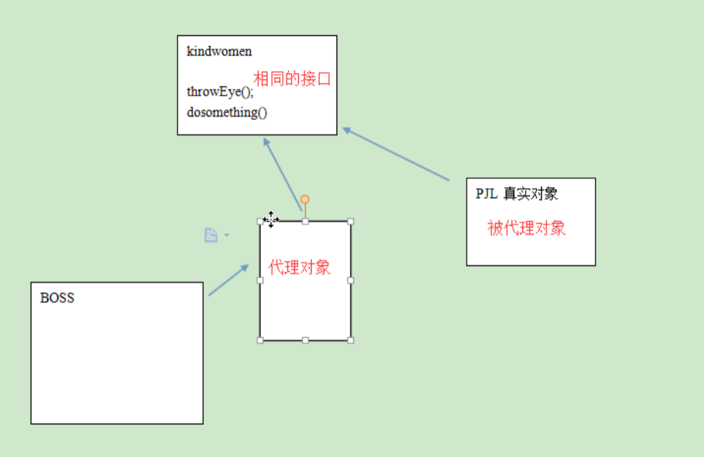
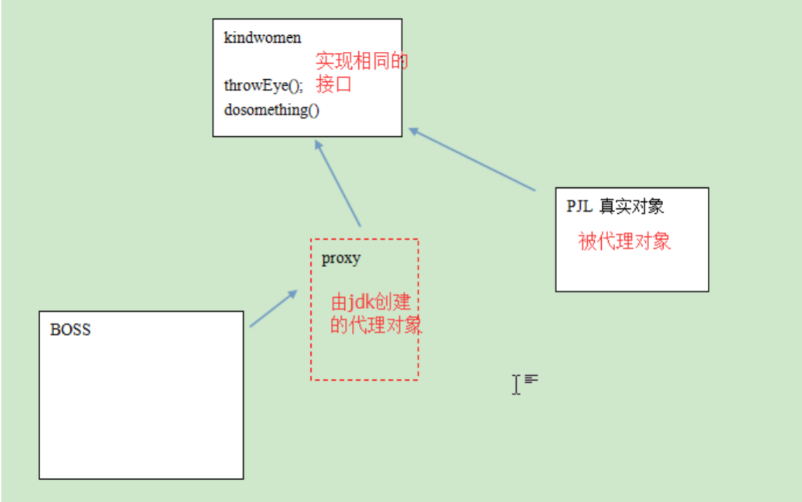
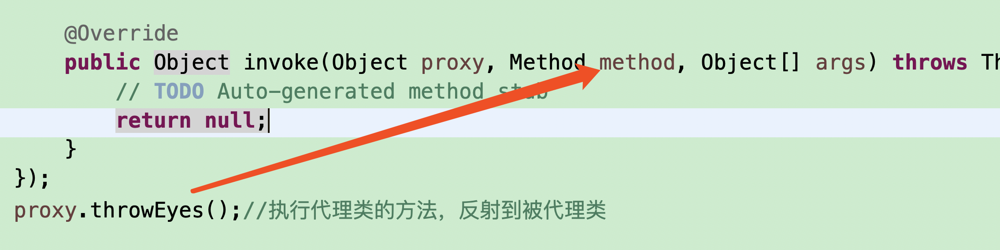

# 静态代理

## 什么是代理模式及其作用

Proxy Pattern（即：代理模式），23种常用的面向对象软件的设计模式之一

代理模式的定义：为其他对象提供一种代理以控制对这个对象的访问。在某些情况下，一个对象不适合或者不能直接引用另一个对象，而代理对象可以在客户端和目标对象之间起到中介的作用。

**优点:**

（1）职责清晰 

真实的角色就是实现实际的业务逻辑，不用关心其他非本职责的事务，通过后期的代理完成一件完成事务，附带的结果就是编程简洁清晰。

（2）代理对象可以在客户端和目标对象之间起到中介的作用，这样起到了的隐藏和保护了目标对象的作用。

（3）高扩展性

**结构**

一个是真正的你要访问的对象（目标类，被代理对象），另一个是代理对象，即：被代理对象与代理对象

被代理对象与代理对象模型中，被代理对象不暴露在外，通过访问代理类的对象，进而访问真正要访问的对象（被代理对象）。代理对象和被代理对象具有相同的行为和约束（能完成相同的功能）



假设西门庆要勾引潘金莲，但直接找到潘金莲会被拒绝，因此西门庆会通过说客王婆联系潘金莲，则对于西门庆来说，潘金莲则为目标对象，王婆为代理对象，王婆代理潘金莲的行为，那么王婆如何代理潘金莲的行为呢？从设计上来说，潘金莲需要与王婆实现相同的接口，这样，王婆才能代理潘金莲。

```java
package com.aishang.day14;

public class PJL {
	public void throwEyes() {
		System.out.println("潘金莲抛媚眼");
	};
	public void smile() {
		System.out.println("潘金莲笑一个");
	};
	public void doSomething() {
		System.out.println("潘金莲...");
	};
}

```

```java
package com.aishang.day14;
public class Demo {
	public static void main(String[] args) throws Exception {
		PJL pjl = new PJL();
		pjl.throwEyes();
	}
}

```

实际上是不能直接找pjl的，需要一个代理

### 1.首先，代理类要具备与被代理类相同的行为，因此代理类需要实现与被代理类相同的接口

```java
package com.aishang.day14;

public interface IKindWoman {
	void throwEyes();
	void smile();
	void doSomething();
}

```

```java
package com.aishang.day14;

public class PJL implements IKindWoman {
	@Override
	public void throwEyes() {
		System.out.println("潘金莲抛媚眼");
	};

	@Override
	public void smile() {
		System.out.println("潘金莲笑一个");
	};

	@Override
	public void doSomething() {
		System.out.println("潘金莲...");
	};
}

```

```java
package com.aishang.day14;

public class WP implements IKindWoman{

	@Override
	public void throwEyes() {
		// TODO Auto-generated method stub
		
	}

	@Override
	public void smile() {
		// TODO Auto-generated method stub
		
	}

	@Override
	public void doSomething() {
		// TODO Auto-generated method stub
		
	}

}

```

现在使用wp那么是wp给西门庆抛媚眼

### 2.代理类中要有一个被代理类类型的成员变量

```java
package com.aishang.day14;

public class WP implements IKindWoman{
	
	private IKindWoman kw;

	@Override
	public void throwEyes() {
		// TODO Auto-generated method stub
		
	}

	@Override
	public void smile() {
		// TODO Auto-generated method stub
		
	}

	@Override
	public void doSomething() {
		// TODO Auto-generated method stub
		
	}

}

```

### 3.代理类中创建一个构造方法，通过注入的方式，将被代理类对象注入进来

```java
package com.aishang.day14;

public class WP implements IKindWoman{
	
	private PJL pjl;
	public WP( PJL pjl) {
		// TODO Auto-generated constructor stub
		this.pjl = pjl;
	}
	@Override
	public void throwEyes() {
		// TODO Auto-generated method stub
		pjl.throwEyes();
	}

	@Override
	public void smile() {
		// TODO Auto-generated method stub
		pjl.smile();
	}

	@Override
	public void doSomething() {
		// TODO Auto-generated method stub
		pjl.doSomething();
	}

}

```

现在我只能代理pjl，所以我可以用多态，接口占位，提高扩展性，并且可以增强原有方法

```java
package com.aishang.day14;

public class WP implements IKindWoman{
	
	private IKindWoman kw;
	public WP(IKindWoman kw) {
		// TODO Auto-generated constructor stub
		this.kw = kw;
	}
	@Override
	public void throwEyes() {
		// TODO Auto-generated method stub
		System.out.println("飞吻");
		kw.throwEyes();
	}

	@Override
	public void smile() {
		// TODO Auto-generated method stub
		kw.smile();
	}

	@Override
	public void doSomething() {
		// TODO Auto-generated method stub
		kw.doSomething();
	}

}

```

```java
public class Demo {
	public static void main(String[] args) throws Exception {
		IKindWoman ik = new PJL();
		IKindWoman wp = new WP(ik);
		wp.throwEyes();
	}
}

```

# 动态代理

分析：静态代理设计模式中，生成一个类的代理类，需要几个要素？

1. 提供目标类（被代理类）

2. 提供代理类和被代理类的相同的约束和行为 – 接口

3. 需要指明代理类如何代理被代理类 – 方法的实现

动态代理它可以直接给某一个目标对象生成一个代理对象，而不需要代理类存在。

动态代理与代理模式原理是一样的，只是它没有具体的代理类，是通过JDK的Proxy类生成了一个代理对象。

动态代理生成技术:

1.jdk提供一个Proxy类可以直接给实现接口类的对象直接生成代理对象。动态代理是基于接口实现的

2.cglib  (不重点学习)。基于继承实现的

 **Java.lang.reflect.Proxy类可以直接生成一个代理对象**

```java
Proxy.newProxyInstance(ClassLoader loader,Class<?> interfaces,InvocationHandler handler):产生代理类的实例。仅能代理实现至少一个接口的类
	ClassLoader：类加载器。固定写法，和被代理类使用相同的类加载器即可。
	Class[] interface：代理类要实现的接口。固定写法，和被代理类使用相同的接口即可。
	InvocationHandler：策略（方案）设计模式的应用。如何代理？

InvocationHandler中的invoke方法：调用代理类的任何方法，此方法都会执行	
	  Object proxy:代理对象本身的引用。一般用不着。
	  Method method:当前调用的方法。
	  Object[] args:当前方法用到的参数
```



由于是动态代理，代理对象不是真正存在的，我们需要使用类加载器，帮我们创建代理类的字节码文件

通过类加载器加载pjl，生成字节码文件，在复制一份生成它的兄弟，这就是加载器的作用

```java
package com.aishang.day14;

import java.io.File;
import java.io.FileInputStream;
import java.lang.reflect.Constructor;
import java.lang.reflect.Field;
import java.lang.reflect.InvocationHandler;
import java.lang.reflect.InvocationTargetException;
import java.lang.reflect.Method;
import java.lang.reflect.Proxy;
import java.nio.channels.NonWritableChannelException;
import java.util.Properties;
import java.util.jar.Attributes.Name;

public class Demo {
	public static void main(String[] args) throws Exception {
		final IKindWoman ik = new PJL();
		/**
		 * loader:clasloader,作用拿到被代理的类加载器
		 * 1、将.class字节码文件加载到内存
		 * 2、加载到内存后，为.class生成字节码文件对象
		 * 
		 * interfaces：拿到共同的接口，也就是被代理类实现的接口
		 * 因为代理类和被代理类必须一模一样
		 * 
		 * InvocationHandler:是一个接口,匿名内部类
		 * 相当于接口可以new了，直接动态产生一个实现类
		 */
		IKindWoman proxy = (IKindWoman) Proxy.newProxyInstance(ik.getClass().getClassLoader(), ik.getClass().getInterfaces(),new InvocationHandler() {
			/**
			 * 	    Object proxy:代理对象本身的引用。一般用不着。
	  				Method method:当前调用的方法。
	  				Object[] args:当前方法用到的参数
			 */
			
			@Override
			public Object invoke(Object proxy, Method method, Object[] args) throws Throwable {
				// TODO Auto-generated method stub
				method.invoke(ik, null);
				return null;
			}
		});
		proxy.throwEyes();//执行代理类的方法，反射到被代理类
		proxy.smile();
		proxy.doSomething();
	}
}

```



此时就不用wp了，这就是动态代理，增强方法

```java
public class Demo {
	public static void main(String[] args) throws Exception {
		final IKindWoman ik = new PJL();
		IKindWoman proxy = (IKindWoman) Proxy.newProxyInstance(ik.getClass().getClassLoader(), ik.getClass().getInterfaces(),new InvocationHandler() {
			@Override
			public Object invoke(Object proxy, Method method, Object[] args) throws Throwable {
				// TODO Auto-generated method stub
				System.out.println("给钱");
				method.invoke(ik, null);
				System.out.println("杀死武大郎");
				return null;
			}
		});

```

带参数的

```java
package com.aishang.day14;

public class PJL implements IKindWoman {
	@Override
	public void throwEyes() {
		System.out.println("潘金莲抛媚眼");
	};

	@Override
	public boolean smile() {
		System.out.println("潘金莲笑一个");
		return true;
	};

	@Override
	public void doSomething(double money,int age) {
		System.out.println("潘金莲收了："+money+"元 ..."+age);
	};
}

```

```java
package com.aishang.day14;

import java.io.File;
import java.io.FileInputStream;
import java.lang.reflect.Constructor;
import java.lang.reflect.Field;
import java.lang.reflect.InvocationHandler;
import java.lang.reflect.InvocationTargetException;
import java.lang.reflect.Method;
import java.lang.reflect.Proxy;
import java.nio.channels.NonWritableChannelException;
import java.util.Properties;
import java.util.jar.Attributes.Name;

public class Demo {
	public static void main(String[] args) throws Exception {
		final IKindWoman ik = new PJL();
		/**
		 * loader:clasloader,作用拿到被代理的类加载器
		 * 1、将.class字节码文件加载到内存
		 * 2、加载到内存后，为.class生成字节码文件对象
		 * 
		 * interfaces：拿到共同的接口，也就是被代理类实现的接口
		 * 因为代理类和被代理类必须一模一样
		 * 
		 * InvocationHandler:是一个接口,匿名内部类
		 * 相当于接口可以new了，直接动态产生一个实现类
		 */
		IKindWoman proxy = (IKindWoman) Proxy.newProxyInstance(ik.getClass().getClassLoader(), ik.getClass().getInterfaces(),new InvocationHandler() {
			/**
			 * 	    Object proxy:代理对象本身的引用。一般用不着。
	  				Method method:当前调用的方法。
	  				Object[] args:当前方法用到的参数
			 */
			
			@Override
			public Object invoke(Object proxy, Method method, Object[] args) throws Throwable {
				// TODO Auto-generated method stub
				Object object = null;
				if("doSomething".equals(method.getName())) {
					System.out.println("给钱");
					object = method.invoke(ik, args[0],args[1]);
					System.out.println("杀死武大郎");
				}else {
					object = method.invoke(ik, null);
				}
		
				return object;
			}
		});
		proxy.throwEyes();//执行代理类的方法，反射到被代理类
		System.out.println(proxy.smile());
		proxy.doSomething(1000,18);
	}
}

```


# AOP

