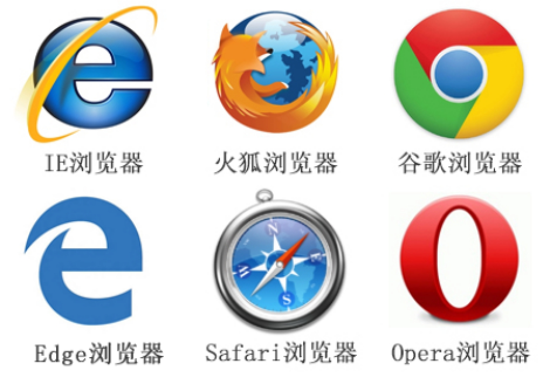
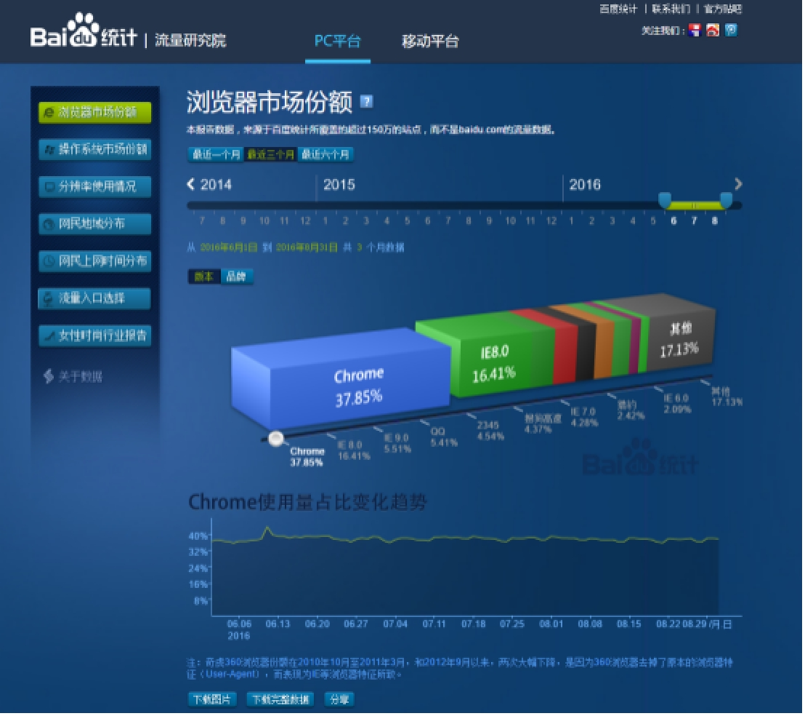
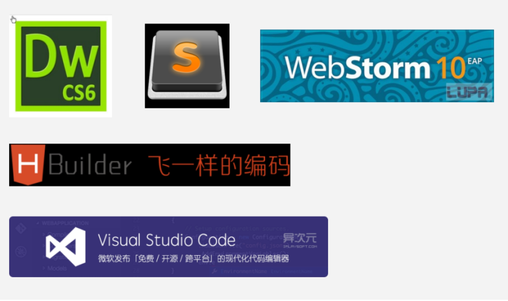
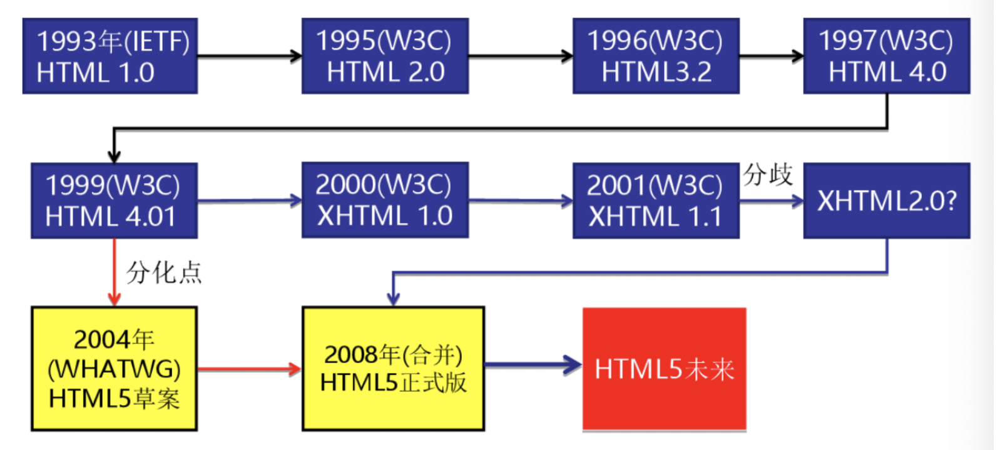
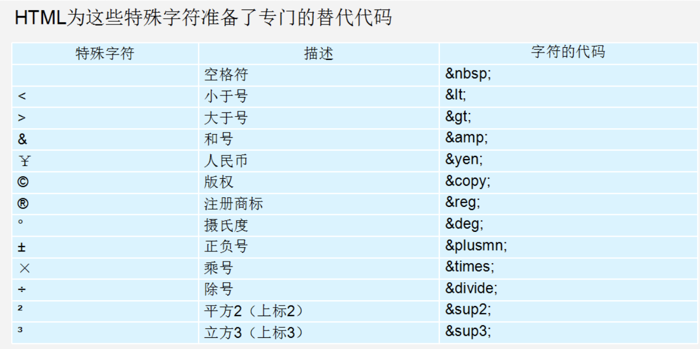

# 第一天Html

## 一、浏览器

 

## 二、查看浏览器占有的市场份额

 

## 三、开发工具

 

 

```html
  普通青年    Dreamweaver

  文艺青年    sublime

  高手和傻子  用记事本

  其实。。。。
```

## 四、常见浏览器内核介绍

浏览器是网页运行的平台，常用的浏览器有IE、火狐（Firefox）、谷歌（Chrome）、Safari和Opera等。我们平时称为五大浏览器。

 

- Trident(IE内核)

 国内很多的双核浏览器的其中一核便是 Trident，美其名曰 "兼容模式"。代表： IE、傲游、世界之窗浏览器、Avant、腾讯TT、猎豹安全浏览器、360极速浏览器、百度浏览器等。Window10 发布后，IE 将其内置浏览器命名为 Edge，Edge 最显著的特点就是新内核 EdgeHTML。

 

- Gecko(firefox) 

Gecko(Firefox 内核)： Mozilla FireFox(火狐浏览器) 采用该内核，Gecko 的特点是代码完全公开，因此，其可开发程度很高，全世界的程序员都可以为其编写代码，增加功能。 可惜这几年已经没落了， 比如 打开速度慢、升级频繁、猪一样的队友flash、神一样的对手chrome。

- webkit(Safari)  

Safari 是苹果公司开发的浏览器，所用浏览器内核的名称是大名鼎鼎的 WebKit。现在很多人错误地把 webkit 叫做 chrome内核（即使 chrome内核已经是 blink 了），苹果感觉像被别人抢了媳妇，都哭晕再厕所里面了。代表浏览器：傲游浏览器3、 Apple Safari (Win/Mac/iPhone/iPad)、Symbian手机浏览器、Android 默认浏览器，

- Chromium/Blink(chrome) 

在 Chromium 项目中研发 Blink 渲染引擎（即浏览器核心），内置于 Chrome 浏览器之中。Blink 其实是 WebKit 的分支。 大部分国产浏览器最新版都采用Blink内核。二次开发

- Presto(Opera)

Presto（已经废弃） 是挪威产浏览器 opera 的 "前任" 内核，为何说是 "前任"，因为最新的 opera 浏览器早已将之抛弃从而投入到了谷歌怀抱了。 

- 移动端的浏览器内核主要说的是系统内置浏览器的内核。

Android手机而言，使用率最高的就是Webkit内核，大部分国产浏览器宣称的自己的内核，基本上也是属于webkit二次开发。

iOS以及WP7平台上，由于系统原因，系统大部分自带浏览器内核

## 六、Web 标准的好处

1、让Web的发展前景更广阔 

2、内容能被更广泛的设备访问

3、更容易被搜寻引擎搜索

4、降低网站流量费用

5、使网站更易于维护

6、提高页面浏览速度

## 七、Web 标准构成

 Web标准不是某一个标准，而是由W3C和其他标准化组织制定的一系列标准的集合。

主要包括结构（Structure）、表现（Presentation）和行为（Behavior）三个方面。

 

理想状态我们的源码： .HTML    .css   .js 

## 八、HTML 初识

HTML（英文Hyper Text Markup Language的缩写）中文译为“超文本标签语言”。是用来描述网页的一种语言。

所谓超文本，因为它可以加入图片、声音、动画、多媒体等内容，不仅如此，它还可以从一个文件跳转到另一个文件，与世界各地主机的文件连接。

 

\- HTML 指的是超文本标记语言

\- HTML 不是一种编程语言，而是一种标记语言 

\- 标记语言是一套标记标签

总结： HTML 作用就是用标记标签来描述网页，把网页内容在浏览器中展示出来。 

### 1、基本结构

```html
<!DOCTYPE html>
<html lang="en">
    <head>            
        <meta charset="UTF-8">
        <title>网页标题</title>
    </head>
    <body>
          网页显示内容
    </body>
</html>
```

第一行是文档声明，第二行`html`标签和最后一行`html`定义html文档的整体，

`html`标签中的`lang=“en”`定义网页的语言为英文，定义成中文是`'lang="zh-CN"`,不定义也没什么影响，它一般作为分析统计用。

 `head`标签和`body`标签是它的第一层子元素，`head`标签里面负责对网页进行一些设置以及定义标题，设置包括定义网页的编码格式，外链css样式文件和javascript文件等，设置的内容不会显示在网页上，标题的内容会显示在标题栏，`body`内编写网页上显示的内容。

- 嵌套关系

```html
<head>  <title> </title>  </head>
```

- 并列关系

```html
<head></head>
<body></body>
```

### 2、文档类型<!DOCTYPE>

这句话就是告诉我们使用哪个html版本？  我们使用的是 html 5 的版本。  html有很多版本，那我们应该告诉用户和浏览器我们使用的版本号。



<!DOCTYPE> 标签位于文档的最前面，用于向浏览器说明当前文档使用哪种 HTML 或 XHTML 标准规范，必需在开头处使用<!DOCTYPE>标签为所有的XHTML文档指定XHTML版本和类型，只有这样浏览器才能按指定的文档类型进行解析。

注意：  一些老网站可能用的还是老版本的文档类型比如 XHTML之类的，但是我们学的是HTML5,而且HTML5的文档类型兼容很好(向下兼容的原则)，所以大家放心的使用HTML5的文档类型就好了。

### 3、字符集

```html
<meta charset="UTF-8" />
```

utf-8是目前最常用的字符集编码方式，常用的字符集编码方式还有gbk和gb2312。

gb2312 简单中文  包括6763个汉字

BIG5   繁体中文 港澳台等用

GBK包含全部中文字符    是GB2312的扩展，加入对繁体字的支持，兼容GB2312

UTF-8则包含全世界所有国家需要用到的字符

- 记住一点，以后我们统统使用UTF-8 字符集, 这样就避免出现字符集不统一而引起乱码的情况了。

### 4、规范及注释

- 所有的标签必须小写

- 所有的属性用双引号括起来

- html文档代码中可以插入注释，注释是对代码的说明和解释，注释的内容不会显示在页面上，html代码中插入注释的方法是：

  ```html
  <!-- 这是一段注释  -->
  ```

### 5、标签特点

html的标签大部分是成对出现的,少量是单个出现的，特定标签之间可以相互嵌套，嵌套就是指一个标签里面可以包含一个或多个其他的标签，包含的标签和父标签可以是同类型的，也可以是不同类型的：

```html
    <!-- 成对出现的标签  -->
        <body>......</body>
        <p>......</p>
        <div>......</div>
        <b>......</b>

    <!-- 单个出现的标签  -->
        <br />
        
        <input type="..." />

    <!-- 标签之间的嵌套  -->
        <p>
            <span>...</span>
            <a href="...">...</a>
        </p>
        <div>
              <h3>...</h3>
              <div>
                      <span>...</span>
                      <p>...</p>
              </div>
        </div>
```

## 九、标签

- 常用标签汇总

```html
h1-h6
p
hr
br
div
span
b或strong 粗体 推荐使用strong
i或em 斜体，推荐使用em
s或del 加删除线 推荐使用del
u或ins 加下划线 推荐使用ins
img
a
注释
base
锚点
pre
```


### 1、标题

通过 `<h1>、<h2>、<h3>、<h4>、<h5>、<h6>`,标签可以在网页上定义6种级别的标题。6种级别的标题表示文档的6级目录层级关系，比如说：

```none
<h1>这是一级标题</h1>
<h2>这是二级标题</h2>
<h3>这是三级标题</h3>
```

### 2、段落、换行与字符实体

案列：不加p标签的显示效果

- 段落

  ```html
  <p>HTML是 HyperText Mark-up Language 的首字母简写，意思是超文本标记语言，超
  文本指的是超链接，标记指的是标签，是一种用来制作网页的语言，这种语言由一个个的
  标签组成，用这种语言制作的文件保存的是一个文本文件，文件的扩展名为html或者htm。
  </p>
  <p>一个html文件就是一个网页，html文件用编辑器打开显示的是文本，可以用文本的方
  式编辑它，如果用浏览器打开，浏览器会按照标签描述内容将文件渲染成网页，显示的网
  页可以从一个网页链接跳转到另外一个网页。</p>
  ```

- 换行 `<br/>`

  ```none
  <p>
  一个html文件就是一个网页，html文件用编辑器打开显示的是文本，可以用<br />
  文本的方式编辑它，如果用浏览器打开，浏览器会按照标签描述内容将文件<br />
  渲染成网页，显示的网页可以从一个网页链接跳转到另外一个网页。
  </p>    
  ```

- 空格、大于号、小于号

`&nbsp;`空格

```none
<p>
3 &lt; 5 <br>
10 &gt; 5
</p>

3 < 5 
10 > 5
```

### 3、图像、绝对路径和相对路径

- **html图像**

标签可以在网页上插入一张图片，它是独立使用的标签，通过“src”属性定义图片的地址，通过“alt”属性定义图片加载失败时显示的文字，以及对搜索引擎和盲人读屏软件的支持。

```html

```

- **绝对路径和相对路径**

像网页上插入图片这种外部文件，需要定义文件的引用地址，引用外部文件还包括引用外部样式表，javascript等等，引用地址分为绝对地址和相对地址。

**绝对地址**：相对于磁盘的位置去定位文件的地址

**相对地址**：相对于引用文件本身去定位被引用的文件地址

绝对地址在整体文件迁移时会因为磁盘和顶层目录的改变而找不到文件，相对路径就没有这个问题。

相对路径的定义技巧：

“ ./ ” 表示当前文件所在目录下，比如：“./pic.jpg” 表示当前目录下的pic.jpg的图片，这个使用时可以省略。

“ ../ ” 表示当前文件所在目录下的上一级目录，比如：“../images/pic.jpg” 表示当前目录下的上一级目录下的images文件夹中的pic.jpg的图片。


### 4、链接

`<a>`标签可以在网页上定义一个链接地址，通过src属性定义跳转的地址，通过title属性定义鼠标悬停时弹出的提示文字框。

```html
<a href="#"></a> <!--  # 表示链接到页面顶部   -->
<a href="http://www.hrbasjy.com/" title="跳转到爱尚网站">爱尚实训</a>
<a href="2.html">测试页面2</a>
```

**定义页面内滚动跳转**

页面内定义了“id”或者“name”的元素，可以通过a标签链接到它的页面滚动位置，前提是页面要足够高，有滚动条，且元素不能在页面顶部，否则页面不会滚动。

```html
<a href="#mao1">标题一</a>
......
......
<h3 id="mao1">跳转到的标题</h3>
```

### 5、列表

- **有序列表**

在网页上定义一个有编号的内容列表可以用`<ol>`、`<li>`配合使用来实现，代码如下：

1. 列表文字一
2. 列表文字二
3. 列表文字三

```none
<ol>
    <li>列表文字一</li>
    <li>列表文字二</li>
    <li>列表文字三</li>
</ol>
```

在网页上生成的列表，每条项目上会按1、2、3编号，有序列表在实际开发中较少使用。

- **无序列表**

在网页上定义一个无编号的内容列表可以用`<ul>`、`<li>`配合使用来实现，代码如下：

- 列表文字一
- 列表文字二
- 列表文字三

```none
<ul>
<li>列表文字一</li>
<li>列表文字二</li>
<li>列表文字三</li>
</ul>
```

在网页上生成的列表，每条项目上会有一个小图标，这个小图标在不同浏览器上显示效果不同，所以一般会用样式去掉默认的小图标，如果需要图标，可以用样式自定义图标，从而达到在不同浏览器上显示的效果相同,实际开发中一般用这种列表。

### 6、自定义列表（理解）

定义列表常用于对术语或名词进行解释和描述，定义列表的列表项前没有任何项目符号。其基本语法如下：

```html
<dl>
  <dt>名词1</dt>
  <dd>名词1解释1</dd>
  <dd>名词1解释2</dd>
  ...
  <dt>名词2</dt>
  <dd>名词2解释1</dd>
  <dd>名词2解释2</dd>
  ...
</dl>
```

 一个`<dl>`中可以有多个题目和解释，代码如下：

```none
<h3>前端三大块</h3>
<dl>
    <dt>html</dt>
    <dd>负责页面的结构</dd>

    <dt>css</dt>
    <dd>负责页面的表现</dd>

    <dt>javascript</dt>
    <dd>负责页面的行为</dd>

</dl>
```

### 7、表格

#### table常用标签

1、table标签：声明一个表格

2、tr标签：定义表格中的一行

3、td和th标签：定义一行中的一个单元格，td代表普通单元格，th表示表头单元格

#### table常用属性：

1、border 定义表格的边框

2、cellpadding 定义单元格内内容与边框的距离

3、cellspacing 定义单元格与单元格之间的距离

4、align 设置单元格中内容的水平对齐方式,设置值有：left | center | right

5、valign 设置单元格中内容的垂直对齐方式 top | middle | bottom

6、colspan 设置单元格水平合并

7、rowspan 设置单元格垂直合并

#### 传统布局：

传统的布局方式就是使用table来做整体页面的布局，布局的技巧归纳为如下几点：

1、定义表格宽高，将border、cellpadding、cellspacing全部设置为0

2、单元格里面嵌套表格

3、单元格中的元素和嵌套的表格用align和valign设置对齐方式

4、通过属性或者css样式设置单元格中元素的样式

| 名称 | 性别 | 年龄 | 电话 |
| :--- | ---- | ---- | ---- |
| 1    | 1    | 1    | 1    |
| 2    | 2    | 2    | 2    |
| 3    | 3    | 3    | 3    |

```html
<table>
<tr>
    <td>名称</td>
    <td>性别</td>
    <td>年龄</td>
    <td>电话</td>
</tr>
<tr>
    <td>1</td>
    <td>1</td>
    <td>1</td>
    <td>1</td>
</tr>
<tr>
    <td>2</td>
    <td>2</td>
    <td>2</td>
    <td>2</td>
</tr>
<tr>
    <td>3</td>
    <td>3</td>
    <td>3</td>
    <td>3</td>
</tr>
</table>
```

表格的标题： caption

**定义和用法**

caption 元素定义表格标题。

```html
<table>
   <caption>我是表格标题</caption>
</table>
```

caption 标签必须紧随 table 标签之后。您只能对每个表格定义一个标题。通常这个标题会被居中于表格之上。

表格常用样式属性 border-collapse:collapse 设置边框合并，制作一像素宽的边线的表格

```html
table里的属性

    1. border  边框

    2. width/height 宽 高

    3. align 

    4. bgcolor/background

    5. cellspacing 单元格与单元格之间的距离

    6. cellpadding 内容与单元格之间的距离

    7. bordercolor 边框颜色

tr里的属性

    1. height

    2. align

    3. valign 垂直对齐方式 top 顶部 middle 中间bottom底部       
    4. bgcolor/background
td里的属性

    1. height/width

    2. align

    3. valign 垂直对齐方式 top 顶部 middle 中间bottom底部       
    4. bgcolor/background

    5. colspan 跨列

    6. rowspan 跨行   
```

### 锚点定位

通过创建锚点链接，用户能够快速定位到目标内容。
创建锚点链接分为两步：

```html
1.使用“a href=”#id名>“链接文本"</a>创建链接文本（被点击的）
  <a href="#two">   

2.使用相应的id名标注跳转目标的位置。
  <h3 id="two">第2集</h3> 
```

### 特殊字符标签 （理解）




