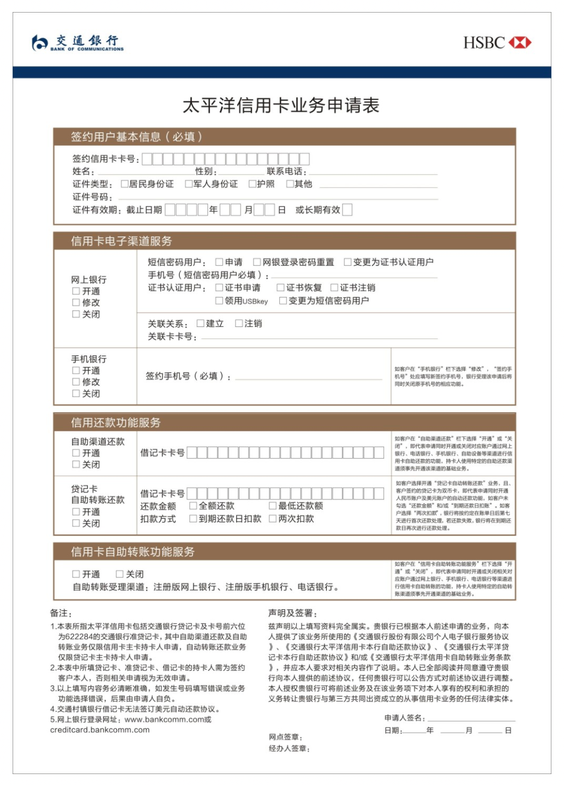
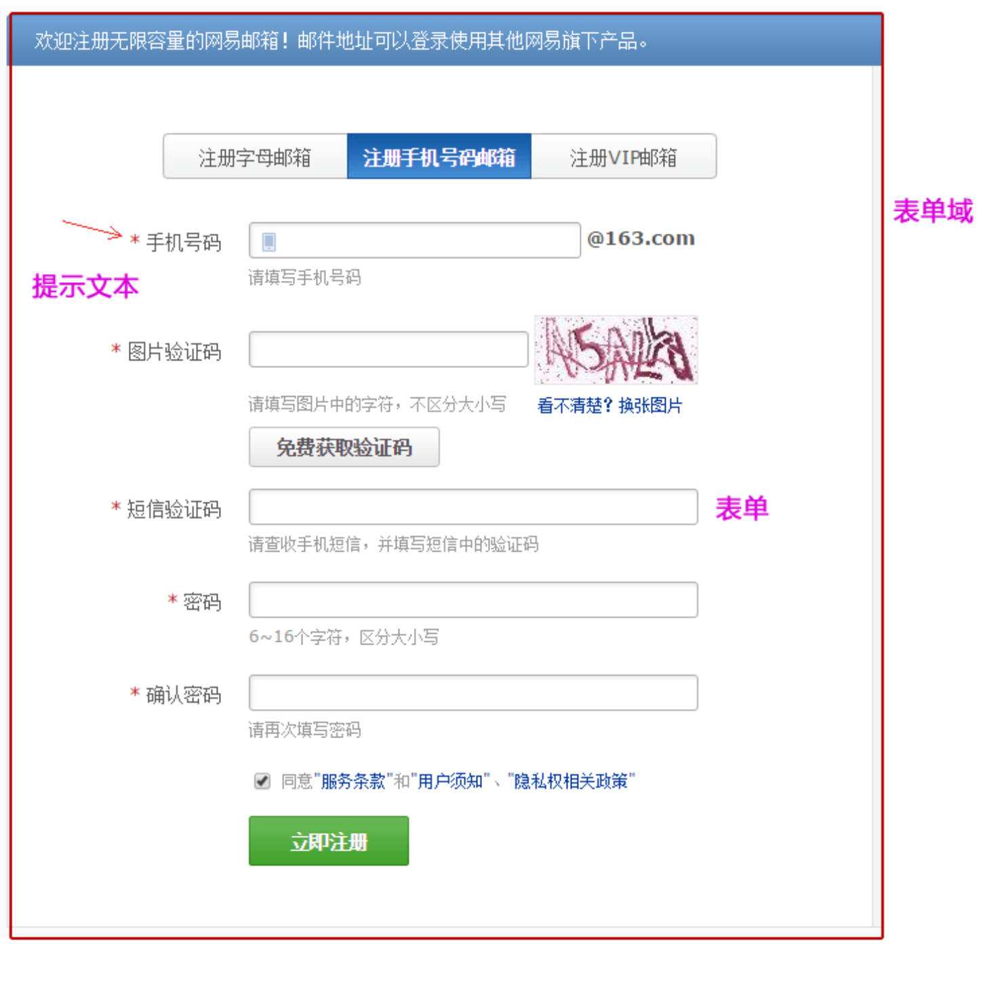
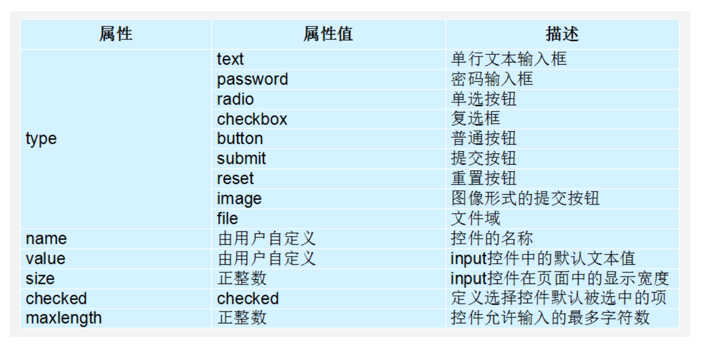
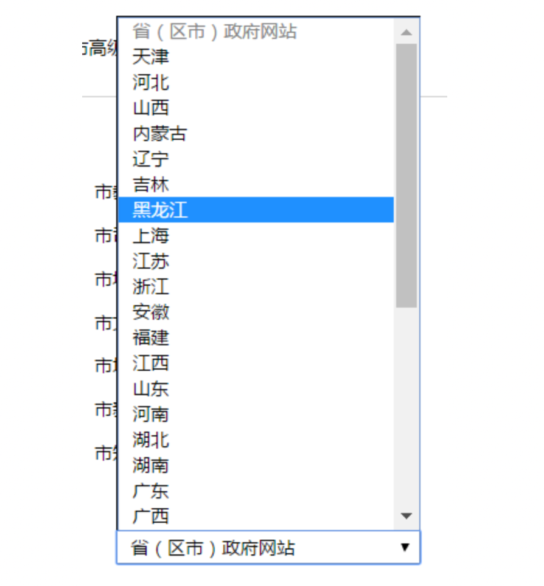
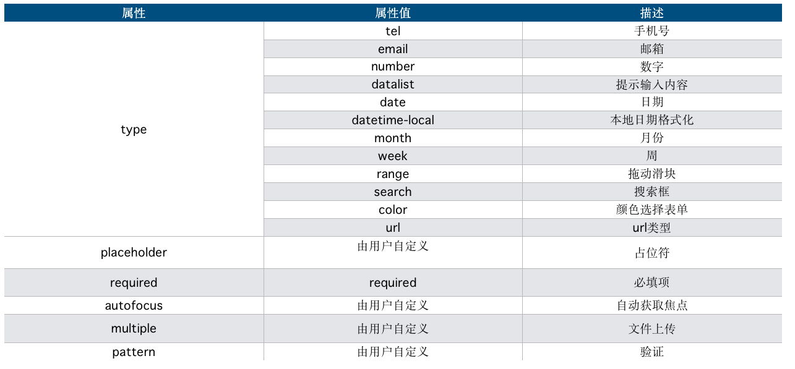

# 第二天Html

## 表单标签(掌握)

现实中的表单，类似我们去银行办理信用卡填写的单子。 如下图



目的是为了收集用户信息。

在我们网页中， 我们也需要跟用户进行交互，收集用户资料，此时也需要表单。

在HTML中，一个完整的表单通常由表单控件（也称为表单元素）、提示信息和表单域3个部分构成。



  表单控件：

​       包含了具体的表单功能项，如单行文本输入框、密码输入框、复选框、提交按钮、重置按钮等。

  提示信息：

​        一个表单中通常还需要包含一些说明性的文字，提示用户进行填写和操作。

  表单域：  

​      他相当于一个容器，用来容纳所有的表单控件和提示信息，可以通过他定义处理表单数据所用程序的url地址，以及数据提交到服务器的方法。如果不定义表单域，表单中的数据就无法传送到后台服务器。

## input 控件(重点)

在上面的语法中，&lt;input /&gt;标签为单标签，type属性为其最基本的属性，其取值有多种，用于指定不同的控件类型。除了type属性之外，&lt;input /&gt;标签还可以定义很多其他的属性，其常用属性如下表所示。



## label标签(理解)

label 标签为 input 元素定义标注（标签）。

作用：  用于绑定一个表单元素, 当点击label标签的时候, 被绑定的表单元素就会获得输入焦点

如何绑定元素呢？

for 属性规定 label 与哪个表单元素绑定（id）。

```html
<label for="male">Male</label>
<input type="radio" name="sex" id="male" value="male">
```

## textarea控件(文本域)

如果需要输入大量的信息，就需要用到&lt;textarea&gt;&lt;/textarea&gt;标签。通过textarea控件可以轻松地创建多行文本输入框，其基本语法格式如下：

```html
<textarea cols="每行中的字符数" rows="显示的行数">
  文本内容
</textarea>
```


## 下拉菜单

使用select控件定义下拉菜单的基本语法格式如下

```html
<select>
  <option>选项1</option>
  <option>选项2</option>
  <option>选项3</option>
  ...
</select>
```

注意：

1. &lt;select&gt;</select&gt;中至少应包含一对&lt;option></option&gt;。

2. 在option 中定义selected =" selected "时，当前项即为默认选中项。

   

## 表单域

在HTML中，form标签被用于定义表单域，即创建一个表单，以实现用户信息的收集和传递，form中的所有内容都会被提交给服务器。创建表单的基本语法格式如下：

```html
<form action="url地址" method="提交方式" name="表单名称">
  各种表单控件
</form>
```

常用属性：

1. Action
   在表单收集到信息后，需要将信息传递给服务器进行处理，action属性用于指定接收并处理表单数据的服务器程序的url地址。
2. method
   用于设置表单数据的提交方式，其取值为get或post。
3. name
   用于指定表单的名称，以区分同一个页面中的多个表单。

注意：  每个表单都应该有自己表单域。

 

# H5新增表单




# 框架页

```html
<frameset rows="80,*">
 <frame src="top.html"/>
    <frameset cols="300,*">
       <frame src="left.html"/>
 <frame src="right.html"/>
 </frameset>
</frameset>
```


  

 