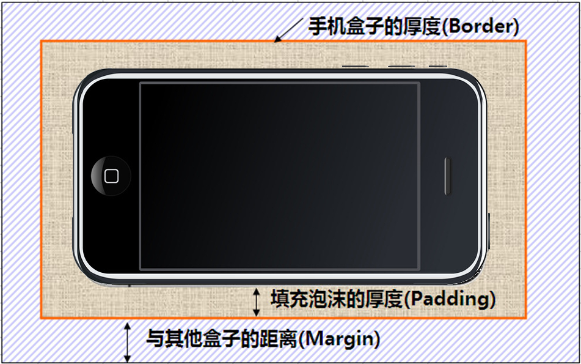

# DIV+CSS网页布局

## 1、盒子模型（div）

所谓盒子模型就是把HTML页面中的元素看作是一个矩形的盒子，也就是一个盛装内容的容器。每个矩形都由元素的内容、内边距（padding）、边框（border）和外边距（margin）组成。

### 看透网页布局的本质

网页布局中，我们是如何把里面的文字，图片，按照美工给我们的效果图排列的整齐有序呢？


把网页元素比如文字图片等等，放入盒子里面，然后利用CSS摆放盒子的过程，就是网页布局。

### 盒子模型（Box Model）

首先，我们来看一张图，来体会下什么是盒子模型。



所有的文档元素（标签）都会生成一个矩形框，我们成为元素框（element box），它描述了一个文档元素再网页布局汇总所占的位置大小。因此，<strong style="color: #f00;">每个盒子除了有自己大小和位置外，还影响着其他盒子的大小和位置。</strong>


### 版心和布局流程

阅读报纸时容易发现，虽然报纸中的内容很多，但是经过合理地排版，版面依然清晰、易读。同样，在制作网页时，要想使页面结构清晰、有条理，也需要对网页进行“排版”。

“版心”(可视区) 是指网页中主体内容所在的区域。一般在浏览器窗口中水平居中显示，常见的宽度值为960px、980px、1000px、1200px等。

### 布局流程

为了提高网页制作的效率，布局时通常需要遵守一定的布局流程，具体如下：

1、确定页面的版心（可视区）。

2、分析页面中的行模块，以及每个行模块中的列模块。

3、制作HTML结构 。

4、CSS初始化，然后开始运用盒子模型的原理，通过DIV+CSS布局来控制网页的各个模块。

### 一列固定宽度且居中


最普通的，最为常用的结构

### 两列左窄右宽型


比如小米    <a href="http://www.mi.com" target="_blank"> 小米官网 </a>

### 通栏平均分布型


## 2、块级元素和行内元素

### 块级元素(block-level)

每个块元素通常都会独自占据一整行或多整行，可以对其设置宽度、高度、对齐等属性，常用于网页布局和网页结构的搭建。

```html
常见的块元素有<h1>~<h6>、<p>、<div>、<ul>、<ol>、<li>等，其中<div>标签是最典型的块元素。
```

块级元素的特点：

（1）总是从新行开始

（2）高度，行高、外边距以及内边距都可以控制。

（3）宽度默认是容器的100%

（4）可以容纳内联元素和其他块元素。

### 行内元素(inline-level)

行内元素（内联元素）不占有独立的区域，仅仅靠自身的字体大小和图像尺寸来支撑结构，一般不可以设置宽度、高度、对齐等属性，常用于控制页面中文本的样式。

```
常见的行内元素有<a>、<strong>、<b>、<em>、<i>、<del>、<s>、<ins>、<u>、<span>等，其中<span>标签最典型的行内元素。
```

行内元素的特点：

（1）和相邻行内元素在一行上。

（2）高、宽无效，但水平方向的padding和margin可以设置，垂直方向的无效。

（3）默认宽度就是它本身内容的宽度。

（4）行内元素只能容纳文本或则其他行内元素。（a特殊）

1. 只有 文字才 能组成段落  因此 p  里面不能放块级元素，同理还有这些标签h1,h2,h3,h4,h5,h6,dt，他们都是文字类块级标签，里面不能放其他块级元素。
2. 链接里面不能再放链接。

### 块级元素和行内元素区别

```
块级元素的特点：
（1）总是从新行开始
（2）高度，行高、外边距以及内边距都可以控制。
（3）宽度默认是容器的100%
（4）可以容纳内联元素和其他块元素。
```

```
行内元素的特点：
（1）和相邻行内元素在一行上。
（2）高、宽无效，但水平方向的padding和margin可以设置，垂直方向的无效。
（3）默认宽度就是它本身内容的宽度。
（4）行内元素只能容纳文本或则其他行内元素。
```

### 行内块元素（inline-block）

```
在行内元素中有几个特殊的标签——、<input />、<td>，可以对它们设置宽高和对齐属性，有些资料可能会称它们为行内块元素。

行内块元素的特点：
（1）和相邻行内元素（行内块）在一行上,但是之间会有空白缝隙。
（2）默认宽度就是它本身内容的宽度。
（3）高度，行高、外边距以及内边距都可以控制。
```

### 标签显示模式转换 display

块转行内：display:inline;

行内转块：display:block;

块、行内元素转换为行内块： display: inline-block;

## 3、内边距、外边距

### 内边距（padding）

padding属性用于设置内边距。  是指 边框与内容之间的距离。

padding-top:上内边距

padding-right:右内边距

padding-bottom:下内边距

padding-left:左内边距

注意：  后面跟几个数值表示的意思是不一样的。

| 值的个数 | 表达意思                                                     |
| -------- | ------------------------------------------------------------ |
| 1个值    | padding：上下左右边距 比如padding: 3px; 表示上下左右都是3像素 |
| 2个值    | padding: 上下边距 左右边距 比如 padding: 3px 5px; 表示 上下3像素 左右 5像素 |
| 3个值    | padding：上边距 左右边距 下边距 比如 padding: 3px 5px 10px; 表示 上是3像素 左右是5像素 下是10像素 |
| 4个值    | padding:上内边距 右内边距 下内边距 左内边距 比如: padding: 3px 5px 10px 15px; 表示 上3px 右是5px 下 10px 左15px 顺时针 |


### 外边距（margin）

margin属性用于设置外边距。  设置外边距会在元素之间创建“空白”， 这段空白通常不能放置其他内容。

margin-top:上外边距

margin-right:右外边距

margin-bottom:下外边距

margin-left:上外边距

margin:上外边距 右外边距  下外边距  左外边

取值顺序跟内边距相同。

### 外边距实现盒子居中

可以让一个盒子实现水平居中，需要满足一下两个条件：

1. 必须是块级元素。     
2. 盒子必须指定了宽度（width）

然后就给**左右的外边距都设置为auto**，就可使块级元素水平居中。

实际工作中常用这种方式进行网页布局，示例代码如下：

```css
.header{ width:960px; margin:0 auto;}

```

## 4、浮动(float)

### 普通流(normal flow)

这个单词很多人翻译为 文档流 ， 字面翻译  普通流 或者标准流都可以。

前面我们说过，网页布局的核心，就是用CSS来摆放盒子位置。如何把盒子摆放到合适的位置？  

CSS的定位机制有3种：普通流（标准流）、浮动和定位。

html语言当中另外一个相当重要的概念----------标准流！或者普通流。普通流实际上就是一个网页内标签元素正常从上到下，从左到右排列顺序的意思，比如块级元素会独占一行，行内元素会按顺序依次前后排列；按照这种大前提的布局排列之下绝对不会出现例外的情况叫做普通流布局。


### 浮动(float)

浮动最早是用来控制图片，以便达到其他元素（特别是文字）实现“环绕”图片的效果。


后来，我们发现浮动有个很有意思的事情：就是让任何盒子可以一行排列,因此我们就慢慢的偏离主题，用浮动的特性来布局了。（CSS3已经我们真正意义上的网页布局，具体CSS3我们会详细解释）


### 什么是浮动？

元素的浮动是指设置了浮动属性的元素会脱离标准普通流的控制，移动到其父元素中指定位置的过程。

在CSS中，通过float属性来定义浮动，其基本语法格式如下：

```
选择器{float:属性值;}
```

| 属性值 | 描述                 |
| ------ | -------------------- |
| left   | 元素向左浮动         |
| right  | 元素向右浮动         |
| none   | 元素不浮动（默认值） |

### 浮动特性

浮动脱离标准流，不占位置，会影响标准流。浮动只有左右浮动。

```
浮动的元素总是找离它最近的父级元素对齐。但是不会超出内边距的范围。 
```


```html
<!DOCTYPE html>
<html lang="en">
<head>
    <meta charset="UTF-8">
    <meta name="viewport" content="width=device-width, initial-scale=1.0">
    <title>Document</title>
    <style>
        .box{
            width: 500px;
            height: 500px;
            background-color: pink;
            padding: 10px;
        }
        .box div:nth-child(1){
            width: 100px;
            height: 100px;
            background-color: lightblue;
            float: left;
        }
    </style>
</head>
<body>
    <div class="box">
        <div></div>
        <div></div>
        <div></div>
    </div>
</body>
</html>
```

#### 浮动的元素排列位置，跟上一个元素（块级）有关系。如果上一个元素有浮动，则A元素顶部会和上一个元素的顶部对齐


一个父盒子里面的子盒子，如果其中一个子级有浮动的，则其他子级都需要浮动。这样才能一行对齐显示。

元素添加浮动后，元素会具有行内块元素的特性。元素的大小完全取决于定义的大小或者默认的内容多少浮动根据元素书写的位置来显示相应的浮动。

总结：  浮动 --->    

浮动的目的就是为了让多个块级元素同一行上显示。

float      浮 漏 特   

浮：    加了浮动的元素盒子是浮起来的，漂浮在其他的标准流盒子上面。
漏：    加了浮动的盒子，不占位置的，它浮起来了，它原来的位置漏 给了标准流的盒子。
特：    特别注意，首先浮动的盒子需要和标准流的父级搭配使用， 其次 特别的注意浮动可以使元素显示模式体现为行内块特性。

### 导航栏案例

**使用技巧**：在一行内的盒子内，我们设定行高等于盒子的高度，就可以使文字垂直居中。

```html
<head>
        <meta charset="utf-8">
        <style>
		body {
			background-color: #000;
		}
		a {
			width: 200px;
			height: 50px;
			/* background-color: orange; */
			display: inline-block;  /* 把a 行内元素转换为行内块元素 */
			text-align: center;  /* 文字水平居中 */
			line-height: 50px;  /* 我们设定行高等于盒子的高度，就可以使文字垂直居中 */
			color: #fff;
			font-size: 22px;
			text-decoration: none;  /* 取消下划线 文本装饰 */
		}
		a:hover {  /* 鼠标经过 给我们的链接添加背景图片*/
			background: url(images/h.png) no-repeat; 
		}
        </style>
    </head>
    <body>
    <a href="#">专区说明</a>
    <a href="#">申请资格</a>
    <a href="#">兑换奖励</a>
    <a href="#">下载游戏</a>
    </body>
```


## 5、后代选择器

- 概念：

  后代选择器又称为包含选择器

- 作用：

  用来选择元素或元素组的**子孙后代**

- 其写法就是把外层标签写在前面，内层标签写在后面，中间用**空格**分隔，先写父亲，在写儿子孙子。 

```css
.class h3{color:red;font-size:16px;}
```

 

```html
<!DOCTYPE html>
<html lang="en">
<head>
    <meta charset="UTF-8">
    <meta name="viewport" content="width=device-width, initial-scale=1.0">
    <meta http-equiv="X-UA-Compatible" content="ie=edge">
    <title>Document</title>
    <style>
        .box .son p {
            color: red;
            font-size: 40px;
        }
    </style>
</head>
<body>
    <div class="box">
        <div class="son">
            <p>哈哈</p>
        </div>
    </div>
</body>
</html>
```

### 


