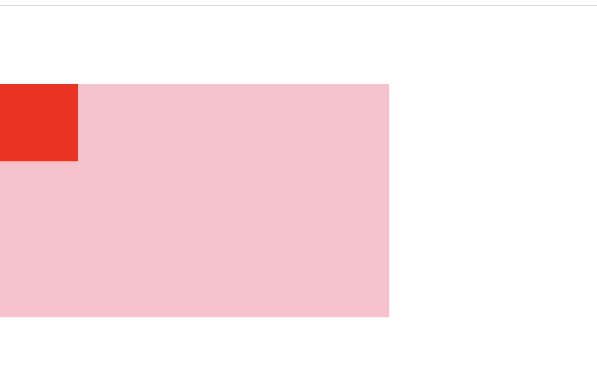
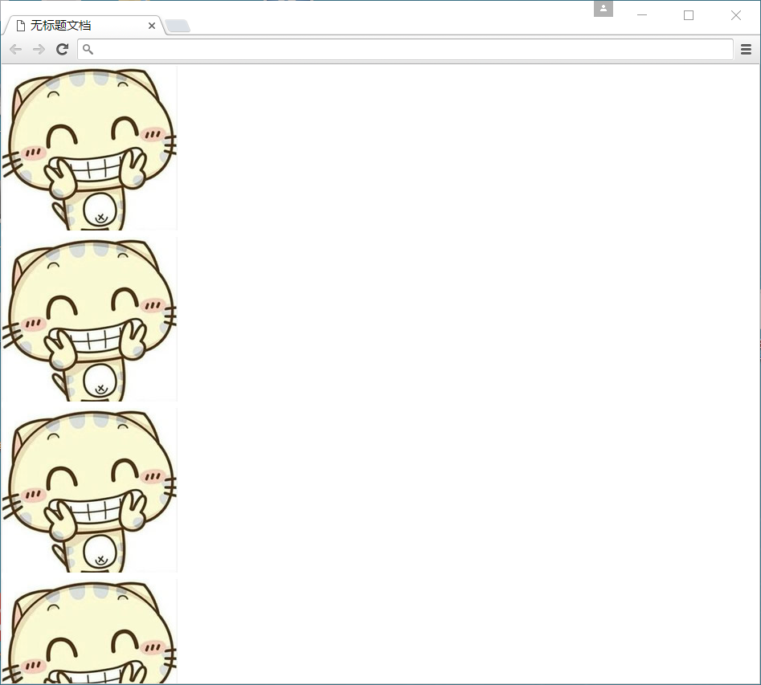

# 1、CSS 三大特性

层叠 继承  优先级 是我们学习CSS 必须掌握的三个特性。

## CSS层叠性

所谓层叠性是指多种CSS样式的叠加。

是浏览器处理冲突的一个能力,如果一个属性通过两个相同选择器设置到同一个元素上，那么这个时候一个属性就会将另一个属性层叠掉

比如先给某个标签指定了内部文字颜色为红色，接着又指定了颜色为蓝色，此时出现一个标签指定了相同样式不同值的情况，这就是样式冲突。

一般情况下，如果出现样式冲突，则会按照CSS书写的顺序，以最后的样式为准。

1. 样式冲突，遵循的原则是就近原则。 那个样式离着结构近，就执行那个样式。
2. 样式不冲突，不会层叠

```
CSS最后的执行口诀：  长江后浪推前浪，前浪死在沙滩上。
```

```html
<!DOCTYPE html>
<html>
<head>
	<title></title>
	<style type="text/css">
		div {
			color: red;
		}
		div {
			color: green;
		}
	</style>
</head>
<body>
<div>tom</div>
</body>
</html>
```

## CSS继承性

所谓继承性是指书写CSS样式表时，子标签会继承父标签的某些样式，如文本颜色和字号。想要设置一个可继承的属性，只需将它应用于父元素即可。

简单的理解就是：  子承父业。

```html
<!DOCTYPE html>
<html>
<head>
	<title></title>
	<style type="text/css">
		.father {
			color: red;
		}
	</style>
</head>
<body>
<div class="father">
	<p>王思聪</p>
</div>
</body>
</html>
```

注意：

```
恰当地使用继承可以简化代码，降低CSS样式的复杂性。子元素可以继承父元素的样式（text-，font-，line-这些元素开头的都可以继承，以及color属性）
```

## CSS优先级

定义CSS样式时，经常出现两个或更多规则应用在同一元素上，这时就会出现优先级的问题。

在考虑权重时，初学者还需要注意一些特殊的情况，具体如下：

```
继承样式的权重为0。即在嵌套结构中，不管父元素样式的权重多大，被子元素继承时，他的权重都为0，也就是说子元素定义的样式会覆盖继承来的样式。

行内样式优先。应用style属性的元素，其行内样式的权重非常高，可以理解为远大于100。总之，他拥有比上面提高的选择器都大的优先级。

权重相同时，CSS遵循就近原则。也就是说靠近元素的样式具有最大的优先级，或者说排在最后的样式优先级最大。

CSS定义了一个!important命令，该命令被赋予最大的优先级。也就是说不管权重如何以及样式位置的远近，!important都具有最大优先级。
```

```html
<!DOCTYPE html>
<html>
<head>
	<title></title>
	<style type="text/css">
		.box { 
			color: red;
		}
		div {
			color: green;
		}
	</style>
</head>
<body>
<div class="box">
	tom
</div>
</body>
</html>
```

### CSS特殊性（Specificity）

关于CSS权重，我们需要一套计算公式来去计算，这个就是 CSS Specificity，我们称为CSS 特性或称非凡性，它是一个衡量CSS值优先级的一个标准 具体规范入如下：

specificity用一个四位的数 字串(CSS2是三位)来表示，更像四个级别，值从左到右，左面的最大，一级大于一级，数位之间没有进制，级别之间不可超越。 

| 继承或者* 的贡献值       | 0,0,0,0  |
| ------------------------ | -------- |
| 每个元素（标签）贡献值为 | 0,0,0,1  |
| 每个类，伪类贡献值为     | 0,0,1,0  |
| 每个ID贡献值为           | 0,1,0,0  |
| 每个行内样式贡献值       | 1,0,0,0  |
| 每个!important贡献值     | ∞ 无穷大 |

权重是可以叠加的

 比如的例子：

```
div ul  li   ------>      0,0,0,3

.nav ul li   ------>      0,0,1,2

a:hover      -----—>      0,0,1,1

.nav a       ------>      0,0,1,1   

#nav p       ----->       0,1,0,1
```

 注意： 

1.数位之间没有进制 比如说： 0,0,0,5 + 0,0,0,5 =0,0,0,10 而不是 0,0, 1, 0， 所以不会存在10个div能赶上一个类选择器的情况。

1. 继承的 权重是 0

总结优先级：

1. 使用了 !important声明的规则。
2. 内嵌在 HTML 元素的 style属性里面的声明。
3. 使用了 ID 选择器的规则。
4. 使用了类选择器、属性选择器、伪元素和伪类选择器的规则。
5. 使用了元素选择器的规则。
6. 只包含一个通用选择器的规则。
7. 同一类选择器则遵循就近原则。

```
总结：权重是优先级的算法，层叠是优先级的表现
```

# 2、CSS复合选择器

复合选择器是由两个或多个基础选择器，通过不同的方式组合而成的,目的是为了可以选择更准确更精细的目标元素标签。

### 交集选择器

交集选择器由两个选择器构成，其中第一个为标签选择器，第二个为class选择器，两个选择器之间不能有空格，如h3.special。

交集选择器 是 并且的意思。  即...又...的意思

比如：   p.one   选择的是： 类名为 .one  的 段落标签。 

```html
 
<!DOCTYPE html>
<html lang="en">
<head>
    <meta charset="UTF-8">
    <meta name="viewport" content="width=device-width, initial-scale=1.0">
    <meta http-equiv="X-UA-Compatible" content="ie=edge">
    <title>Document</title>
    <style>
        /* 居中的效果 */
        p {
           height: 100px;
           background-color: goldenrod;
           line-height: 100px;
        }
        p.one{
            background-color: red;
        }
    </style>
</head>
<body>
    <p>哈哈哈</p>
    <p>a</p>
    <p class="one">b</p>
    <p>c</p>
    <p>d</p>
</body>
</html>
```


用的相对来说比较少，不太建议使用。

### 并集选择器

并集选择器（CSS选择器分组）是各个选择器通过<strong style="color:#f00">逗号</strong>连接而成的，任何形式的选择器（包括标签选择器、class类选择器id选择器等），都可以作为并集选择器的一部分。如果某些选择器定义的样式完全相同，或部分相同，就可以利用并集选择器为它们定义相同的CSS样式。


并集选择器  和 的意思，  就是说，只要逗号隔开的，所有选择器都会执行后面样式。

比如  .one, p , #test {color: #F00;}  表示   .one 和 p  和 #test 这三个选择器都会执行颜色为红色。  通常用于集体声明。

```html
<!DOCTYPE html>
<html lang="en">
<head>
    <meta charset="UTF-8">
    <meta name="viewport" content="width=device-width, initial-scale=1.0">
    <meta http-equiv="X-UA-Compatible" content="ie=edge">
    <title>Document</title>
    <style>
        /* 居中的效果 */
        p {
           height: 100px;
           background-color: goldenrod;
           line-height: 100px;
        }
        p.one{
            background-color: red;
        }
        #test,.one{
            background-color: gray;
        }
    </style>
</head>
<body>
    <p>哈哈哈</p>
    <p>a</p>
    <p class="one">b</p>
    <p>c</p>
    <p id="test">d</p>
    
</body>
</html>
```


由于权重的问题，b并没有变成灰色，后面再说权重的计算问题

### 子元素选择器

子元素选择器只能选择作为某元素子元素的元素。其写法就是把父级标签写在前面，子级标签写在后面，中间跟一个 &gt; 进行连接，注意，符号左右两侧各保留一个空格。

 这里的子 指的是 亲儿子  不包含孙子 重孙子之类。

```css
 .demo > h3 {color: red;}   说明  h3 一定是demo 亲儿子。  demo 元素包含着h3。
```


```html
<!DOCTYPE html>
<html lang="en">

<head>
    <meta charset="UTF-8">
    <meta name="viewport" content="width=device-width, initial-scale=1.0">
    <meta http-equiv="X-UA-Compatible" content="ie=edge">
    <title>Document</title>
    <style>
        .box>p {
            /* 不好使 */
            color: red;
        }

        /* 正确如下 */
        .son>p {
            color: red;
        }
    </style>
</head>

<body>
    <div class="box">
        <div class="son">
            <p>哈哈</p>
        </div>
    </div>

</body>

</html>
```

### 伪类选择器

- 链接伪类选择器

  - :link      /* 未访问的链接 */

  - :visited   /* 已访问的链接 */

  - :hover     /* 鼠标移动到链接上 */

  - :active    /* 选定的链接 */

    注意写的时候，他们的顺序尽量不要颠倒  按照  lvha 的顺序。  

# 3、外边距合并

使用margin定义块元素的垂直外边距时，可能会出现外边距的合并。

### 相邻块元素垂直外边距的合并

当上下相邻的两个块元素相遇时，如果上面的元素有下外边距margin-bottom，下面的元素有上外边距margin-top，则他们之间的垂直间距不是margin-bottom与margin-top之和，而是两者中的较大者。这种现象被称为相邻块元素垂直外边距的合并（也称外边距塌陷）。


解决方案：  避免就好了。

```html
<!DOCTYPE html>
<html lang="en">

<head>
    <meta charset="UTF-8">
    <meta name="viewport" content="width=device-width, initial-scale=1.0">
    <meta http-equiv="X-UA-Compatible" content="ie=edge">
    <title>Document</title>
    <style>
        .one {
            width: 100px;
            height: 100px;
            background-color: pink;
            margin-bottom: 100px;
        }

        .two {
            width: 100px;
            height: 100px;
            background-color: red;
            margin-top: 200px;
        }
    </style>
</head>

<body>
    <div class="one"></div>
    <div class="two"></div>
</body>

</html>
```


### 嵌套块元素垂直外边距的合并

对于两个嵌套关系的块元素，如果父元素没有上内边距及边框，则父元素的上外边距会与子元素的上外边距发生合并，合并后的外边距为两者中的较大者，即使父元素的上外边距为0，也会发生合并。


解决方案：

1. 可以为父元素定义1像素的上边框或上内边距。
2. 可以为父元素添加overflow:hidden。

```html
<!DOCTYPE html>
<html lang="en">

<head>
    <meta charset="UTF-8">
    <meta name="viewport" content="width=device-width, initial-scale=1.0">
    <meta http-equiv="X-UA-Compatible" content="ie=edge">
    <title>Document</title>
    <style>
        *{
            margin: 0;
            padding: 0;
        }
        .one {
            width: 500px;
            height: 300px;
            background-color: pink;
            margin-top: 10px;
            /* 解决的方法三种 */
            /* border: 1px solid red; */
            /* padding-top: 1px; */
            /* overflow: hidden; */
        }

        .two {
            width: 100px;
            height: 100px;
            background-color: red;
            margin-top: 100px;
        }
    </style>
</head>

<body>
    <div class="one">
        <div class="two"></div>
    </div>

</body>

</html>
```




# 4、清除浮动

清除浮动主要为了解决父级元素因为子级浮动引起内部高度为0 的问题。

### 问题：


```html
<!DOCTYPE html>
<html>
<head>
	<title></title>
	<style type="text/css">
		.box { 
			background-color: pink;
		}
		.one{
            width: 100px;
            height: 100px;
            background-color: red;
            /* float: left; */
        }
        .two{
            width: 100px;
            height: 100px;
            background-color: gold;
            /* float: left; */
        }
        .content{
            background-color: green;
            height: 100px;
        }
	</style>
</head>
<body>
<div class="box">
    <div class="one"></div>
    <div class="two"></div>
</div>
<div class="content"></div>
</body>
</html>
```


浮动后

```html
<!DOCTYPE html>
<html>
<head>
	<title></title>
	<style type="text/css">
		.box { 
			background-color: pink;
		}
		.one{
            width: 100px;
            height: 100px;
            background-color: red;
            float: left;
        }
        .two{
            width: 100px;
            height: 100px;
            background-color: gold;
            float: left;
        }
        .content{
            background-color: green;
            height: 100px;
        }
	</style>
</head>
<body>
<div class="box">
    <div class="one"></div>
    <div class="two"></div>
</div>
<div class="content"></div>
</body>
</html>
```


### 清除浮动的方法

```css
clear:both
```

```html
<!DOCTYPE html>
<html>
<head>
	<title></title>
	<style type="text/css">
		.box { 
			background-color: pink;
		}
		.one{
            width: 100px;
            height: 100px;
            background-color: red;
            float: left;
        }
        .two{
            width: 100px;
            height: 100px;
            background-color: gold;
            float: left;
        }
        .content{
            background-color: green;
            height: 100px;
            clear: both;
        }
	</style>
</head>
<body>
<div class="box">
    <div class="one"></div>
    <div class="two"></div>
</div>
<div class="content"></div>
</body>
</html>
```

或者写一个新的标签

```html
<div class="box">
    <div class="one"></div>
    <div class="two"></div>
</div>
<div style="clear:both"></div>
<div class="content"></div>
```

### 父级添加overflow属性方法

```css
.box {
    background-color: pink;
    overflow: hidden;
}
```

# 5、盒子阴影

语法格式：

```css
box-shadow:水平阴影 垂直阴影 模糊距离 阴影尺寸 阴影颜色  内/外阴影；
```

1. 前两个属性是必须写的。其余的可以省略。
2. 外阴影 (outset) 但是不能写    默认      想要内阴影  inset 

```css
div {
			width: 200px;
			height: 200px;
			border: 10px solid red;
			/* box-shadow: 5px 5px 3px 4px rgba(0, 0, 0, .4);  */
			/* box-shadow:水平位置 垂直位置 模糊距离 阴影尺寸（影子大小） 阴影颜色  内/外阴影； */
			box-shadow: 0 15px 30px  rgba(0, 0, 0, .4);
			
}
```

# 6、CSS 背景(background)

CSS 可以添加背景颜色和背景图片，以及来进行图片设置。

| background-color                                            | 背景颜色         |
| ----------------------------------------------------------- | ---------------- |
| background-image                                            | 背景图片地址     |
| background-repeat                                           | 是否平铺         |
| background-position                                         | 背景位置         |
| background-attachment                                       | 背景固定还是滚动 |
| 背景的合写（复合属性）                                      |                  |
| background:背景颜色 背景图片地址 背景平铺 背景滚动 背景位置 |                  |

## 背景图片(image)

语法： 

```css
background-image : none | url (url) 
```

参数： 

none : 　无背景图（默认的）
url : 　使用绝对或相对地址指定背景图像 

background-image 属性允许指定一个图片展示在背景中（只有CSS3才可以多背景）可以和 background-color 连用。 如果图片不重复地话，图片覆盖不到地地方都会被背景色填充。 如果有背景图片平铺，则会覆盖背景颜色。

小技巧：  我们提倡 背景图片后面的地址，url不要加引号。

## 背景平铺（repeat）

语法： 

```css
background-repeat : repeat | no-repeat | repeat-x | repeat-y 
```

参数： 

repeat : 　背景图像在纵向和横向上平铺（默认的）

no-repeat : 　背景图像不平铺

repeat-x : 　背景图像在横向上平铺

repeat-y : 　背景图像在纵向平铺 

设置背景图片时，默认把图片在水平和垂直方向平铺以铺满整个元素。

repeat-x : 　背景图像在横向上平铺  

repeat-y : 　背景图像在纵向平铺 



设置背景图片时，默认把图片在水平和垂直方向平铺以铺满整个元素。


## 背景位置(position)

语法： 

```css
background-position : length || length

background-position : position || position 
```

参数： 

length : 　百分数 | 由浮点数字和单位标识符组成的长度值。请参阅长度单位 
position : 　top | center | bottom | left | center | right 

说明： 

设置或检索对象的背景图像位置。必须先指定background-image属性。默认值为：(0% 0%)。
如果只指定了一个值，该值将用于横坐标。纵坐标将默认为50%。第二个值将用于纵坐标。

注意：

1. position 后面是x坐标和y坐标。 可以使用方位名词或者 精确单位。
2. 如果和精确单位和方位名字混合使用，则必须是x坐标在前，y坐标后面。比如 background-position: 15px top;   则 15px 一定是  x坐标   top是 y坐标。

实际工作用的最多的，就是背景图片居中对齐了。

## 背景简写

background属性的值的书写顺序官方并没有强制标准的。为了可读性，建议大家如下写：

background:背景颜色 背景图片地址 背景平铺 背景滚动 背景位置

```css
background: transparent url(image.jpg) repeat-y  scroll 50% 0 ;
```

## 背景透明(CSS3)

CSS3支持背景半透明的写法语法格式是:

```css
background: rgba(0,0,0,0.3);
```

 最后一个参数是alpha 透明度  取值范围 0~1之间

 注意：  背景半透明是指盒子背景半透明， 盒子里面的内容不收影响。

# 7、定位(position)

## 为什么要用定位？

那么定位，最长运用的场景再那里呢？   来看几幅图片，你一定会有感悟！

第一幅图， 小黄色块可以再图片上移动：


第二幅图， 左右箭头压住图片：


第三幅图,  hot 再盒子外面多出一块，更加突出：


以上三个小地方，如果用标准流或者浮动，实现会比较复杂或者难以实现，此时我们用定位来做

## 元素的定位属性

元素的定位属性主要包括定位模式和边偏移两部分。

1、边偏移

| 边偏移属性 | 描述                                           |
| ---------- | ---------------------------------------------- |
| top        | 顶端偏移量，定义元素相对于其父元素上边线的距离 |
| bottom     | 底部偏移量，定义元素相对于其父元素下边线的距离 |
| left       | 左侧偏移量，定义元素相对于其父元素左边线的距离 |
| right      | 右侧偏移量，定义元素相对于其父元素右边线的距离 |

也就说，以后定位要和这边偏移搭配使用了， 比如 top: 100px;  left: 30px; 等等

2、定位模式(定位的分类)

在CSS中，position属性用于定义元素的定位模式，其基本语法格式如下：

选择器{position:属性值;}

position属性的常用值

| 值       | 描述                                             |
| -------- | ------------------------------------------------ |
| static   | 自动定位（默认定位方式）                         |
| relative | 相对定位，相对于其原文档流的位置进行定位         |
| absolute | 绝对定位，相对于其上一个已经定位的父元素进行定位 |
| fixed    | 固定定位，相对于浏览器窗口进行定位               |

## 静态定位(static)

静态定位是所有元素的默认定位方式，当position属性的取值为static时，可以将元素定位于静态位置。 所谓静态位置就是各个元素在HTML文档流中默认的位置。

上面的话翻译成白话：  就是网页中所有元素都默认的是静态定位哦！ 其实就是标准流的特性。

在静态定位状态下，无法通过边偏移属性（top、bottom、left或right）来改变元素的位置。

PS： 静态定位其实没啥可说的。

## 相对定位relative

相对定位是将元素相对于它在标准流中的位置进行定位，当position属性的取值为relative时，可以将元素定位于相对位置。

对元素设置相对定位后，可以通过边偏移属性改变元素的位置，但是它在文档流中的位置仍然保留。如下图所示，即是一个相对定位的效果展示：


注意：   

1. 相对定位最重要的一点是，它可以通过边偏移移动位置，但是原来的所占的位置，继续占有。
2. 其次，每次移动的位置，是以自己的左上角为基点移动（相对于自己来移动位置）

就是说，相对定位的盒子仍在标准流中，它后面的盒子仍以标准流方式对待它。（相对定位不脱标，占坑）

如果说浮动的主要目的是 让多个块级元素一行显示，那么定位的主要价值就是 移动位置， 让盒子到我们想要的位置上去。

## 绝对定位absolute 

　**[注意]** 如果文档可滚动，绝对定位元素会随着它滚动，因为元素最终会相对于正常流的某一部分定位。

当position属性的取值为absolute时，可以将元素的定位模式设置为绝对定位。

注意：    绝对定位最重要的一点是，它可以通过边偏移移动位置，但是它完全脱标，完全不占位置。

### 父级没有定位

若所有父元素都没有定位，以浏览器为准对齐(document文档)。


### 父级有定位

绝对定位是将元素依据最近的已经定位（绝对、固定或相对定位）的父元素（祖先）进行定位。 


### 子绝父相

这个“子绝父相”太重要了，是我们学习定位的口诀，时时刻刻记住的。

这句话的意思是 子级是绝对定位的话， 父级要用相对定位。

首先， 我们说下， 绝对定位是将元素依据最近的已经定位绝对、固定或相对定位）的父元素（祖先）进行定位。

就是说， 子级是绝对定位，父亲只要是定位即可（不管父亲是绝对定位还是相对定位，甚至是固定定位都可以），就是说， 子绝父绝，子绝父相都是正确的。

但是，在我们网页布局的时候， 最常说的 子绝父相是怎么来的呢？ 请看如下图：


所以，我们可以得出如下结论：

因为子级是绝对定位，不会占有位置， 可以放到父盒子里面的任何一个地方。

父盒子布局时，需要占有位置，因此父亲只能是 相对定位. 

这就是子绝父相的由来。

## 绝对定位的盒子水平/垂直居中

普通的盒子是左右margin 改为 auto就可， 但是对于绝对定位就无效了

定位的盒子也可以水平或者垂直居中，有一个算法。

1. 首先left 50%   父盒子的一半大小

2. 然后走自己外边距负的一半值就可以了 margin-left。

   ​

## 固定定位fixed

固定定位是绝对定位的一种特殊形式，类似于 正方形是一个特殊的 矩形。它以浏览器窗口作为参照物来定义网页元素。当position属性的取值为fixed时，即可将元素的定位模式设置为固定定位。

当对元素设置固定定位后，它将脱离标准文档流的控制，始终依据浏览器窗口来定义自己的显示位置。不管浏览器滚动条如何滚动也不管浏览器窗口的大小如何变化，该元素都会始终显示在浏览器窗口的固定位置。

固定定位有两点：

1. 固定定位的元素跟父亲没有任何关系，只认浏览器。
2. 固定定位完全脱标，不占有位置，不随着滚动条滚动。

## 叠放次序（z-index）

当对多个元素同时设置定位时，定位元素之间有可能会发生重叠。


在CSS中，要想调整重叠定位元素的堆叠顺序，可以对定位元素应用z-index层叠等级属性，其取值可为正整数、负整数和0。

比如：  z-index: 2;

注意：

1. z-index的默认属性值是0，取值越大，定位元素在层叠元素中越居上。
2. 如果取值相同，则根据书写顺序，后来居上。
3. 后面数字一定不能加单位。
4. 只有相对定位，绝对定位，固定定位有此属性，其余标准流，浮动，静态定位都无此属性，亦不可指定此属性。


## 四种定位总结

| 定位模式         | 是否脱标占有位置     | 是否可以使用边偏移 | 移动位置基准                     |
| ---------------- | -------------------- | ------------------ | -------------------------------- |
| 静态static       | 不脱标，正常模式     | 不可以             | 正常模式                         |
| 相对定位relative | 不脱标，占有位置     | 可以               | 相对自身位置移动（自恋型）       |
| 绝对定位absolute | 完全脱标，不占有位置 | 可以               | 相对于定位父级移动位置（拼爹型） |
| 固定定位fixed    | 完全脱标，不占有位置 | 可以               | 相对于浏览器移动位置（认死理型） |

## 定位模式转换

跟 浮动一样， 元素添加了 绝对定位和固定定位之后， 元素模式也会发生转换， 都转换为 行内块模式，

因此 比如 行内元素 如果添加了 绝对定位或者 固定定位后 浮动后，可以不用转换模式，直接给高度和宽度就可以了。

# 8、元素的显示与隐藏

在CSS中有三个显示和隐藏的单词比较常见，我们要区分开，他们分别是 display visibility 和 overflow。

他们的主要目的是让一个元素在页面中消失，但是不在文档源码中删除。 最常见的是网站广告，当我们点击类似关闭不见了，但是我们重新刷新页面，它们又会出现和你玩躲猫猫！！

## display 显示

display 设置或检索对象是否及如何显示。

display : none 隐藏对象 与它相反的是 display:block 除了转换为块级元素之外，同时还有显示元素的意思。

特点： 隐藏之后，不再保留位置。

## visibility 可见性

设置或检索是否显示对象。

visible : 　对象可视

hidden : 　对象隐藏

特点： 隐藏之后，继续保留原有位置。

## overflow 溢出

检索或设置当对象的内容超过其指定高度及宽度时如何管理内容。

visible : 　不剪切内容也不添加滚动条。

auto : 　 超出自动显示滚动条，不超出不显示滚动条

hidden : 　不显示超过对象尺寸的内容，超出的部分隐藏掉

scroll : 　不管超出内容否，总是显示滚动条

