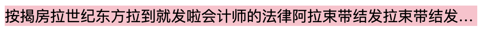

# 1、CSS高级技巧

## CSS用户界面样式

 所谓的界面样式， 就是更改一些用户操作样式， 比如 更改用户的鼠标样式， 表单轮廓等。但是比如滚动条的样式改动受到了很多浏览器的抵制，因此我们就放弃了。 防止表单域拖拽

### 鼠标样式cursor

 设置或检索在对象上移动的鼠标指针采用何种系统预定义的光标形状。 

```html
cursor :  default  小白 | pointer  小手  | move  移动  |  text  文本
```

 鼠标放我身上查看效果哦：

```html
<ul>
  <li style="cursor:default">我是小白</li>
  <li style="cursor:pointer">我是小手</li>
  <li style="cursor:move">我是移动</li>
  <li style="cursor:text">我是文本</li>
</ul>
```

### 轮廓 outline

清除input浏览器加的篮框

最直接的写法是 ：  outline: 0;   或者  outline: none;

```html
 <input  type="text"  style="outline: 0;"/>
```

### 防止拖拽文本域resize

resize：none    这个单词可以防止 火狐 谷歌等浏览器随意的拖动 文本域。

右下角可以拖拽： 

<textarea></textarea>

右下角不可以拖拽： 

```html
<textarea  style="resize: none;"></textarea>
```

### vertical-align 垂直对齐

以前我们讲过让带有宽度的块级元素居中对齐，是margin: 0 auto;

以前我们还讲过让文字居中对齐，是 text-align: center;

但是我们从来没有讲过有垂直居中的属性

```css
vertical-align : baseline |top |middle |bottom 
```

vertical-align 不影响块级元素中的内容对齐，它只针对于 行内元素或者行内块元素，特别是行内块元素， **通常用来控制图片/表单与文字的对齐**。

```html
<html>

<head>
    <style type="text/css">
        img.top {
            vertical-align: middle;
        }

        img.bottom {
            vertical-align: top;
        }
    </style>
</head>

<body>

    <p>
        这是一幅位于段落中的图像。
    </p>

    <p>
        这是一幅位于段落中的图像。
    </p>

</body>

</html>
```


### 溢出的文字隐藏

```html
<html>

<head>
    <style type="text/css">
        p {
            width: 500px;
            background-color: pink;
        }
    </style>
</head>

<body>
    <p>
        aaaaaaaaaaaaaaaaaaaaaaaaaaaaaaaaaaaaaaaaaaaaaaaaaaaaaaaaaaaaaaaaaaaaaaaaaaaaaaaaaaaaaaaaaaaaaaaaaaaaaaaaaaaaaaaaaaaaaaaaaaaaaaaaaaaaaaaaaaaaaaaa
    </p>
</body>

</html>
```


#### word-break:自动换行

normal   使用浏览器默认的换行规则。

break-all   允许在单词内换行。

```html
<html>

<head>
    <style type="text/css">
        p {
            width: 500px;
            background-color: pink;
            word-break: break-all;
        }
    </style>
</head>

<body>
    <p>
        aaaaaaaaaaaaaaaaaaaaaaaaaaaaaaaaaaaaaaaaaaaaaaaaaaaaaaaaaaaaaaaaaaaaaaaaaaaaaaaaaaaaaaaaaaaaaaaaaaaaaaaaaaaaaaaaaaaaaaaaaaaaaaaaaaaaaaaaaaaaaaaa
    </p>
</body>

</html>
```


keep-all    只能在半角空格或连字符处换行。

```html
<html>

<head>
    <style type="text/css">
        p {
            width: 500px;
            background-color: pink;
            word-break:keep-all;
        }
    </style>
</head>

<body>
    <p>
        aaaaaaaaaaaaaa aaaaaaaaaaaaaaaaaaaaaaaaaaaaaaaaaaaaaaaaaaaaaaaaaaaaaaaaaaaaaaaaaaaaaaaaaaaaaaaaaaaaaaaaaaaaaaaaaaaaaaaaaaaaaaaaaaaaaaa
    </p>
</body>

</html>
```


#### white-space

white-space设置或检索对象内文本显示方式。通常我们使用于强制一行显示内容 

normal : 　默认处理方式
nowrap : 　强制在同一行内显示所有文本，直到文本结束或者遭遇br标签对象才换行。

```html
<html>

<head>
    <style type="text/css">
        p {
            width: 500px;
            background-color: pink;
            word-break:break-all;
            white-space:nowrap;
        }
    </style>
</head>

<body>
    <p>
        按揭房拉世纪东方拉到就发啦会计师的法律阿拉束带结发拉束带结发了卡数据的按揭房拉世纪东方拉到就发啦会计师的法律阿拉束带结发拉束带结发了卡数据的按揭房拉世纪东方拉到就发啦会计师的法律阿拉束带结发拉束带结发了卡数据的
    </p>
</body>

</html>
```


#### text-overflow 文字溢出

text-overflow : clip | ellipsis

设置或检索是否使用一个省略标记（...）标示对象内文本的溢出

clip : 　不显示省略标记（...），而是简单的裁切 

ellipsis : 　当对象内文本溢出时显示省略标记（...）

注意一定要首先强制一行内显示，再次和overflow属性  搭配使用

```html
<html>

<head>
    <style type="text/css">
        p {
            width: 500px;
            background-color: pink;
            white-space:nowrap;
            text-overflow: clip;
            overflow: hidden;
        }
    </style>
</head>

<body>
    <p>
        按揭房拉世纪东方拉到就发啦会计师的法律阿拉束带结发拉束带结发了卡数据的按揭房拉世纪东方拉到就发啦会计师的法律阿拉束带结发拉束带结发了卡数据的按揭房拉世纪东方拉到就发啦会计师的法律阿拉束带结发拉束带结发了卡数据的
    </p>
</body>

</html>
```




多行文本溢出（了解）

```html
<html>

<head>
    <style type="text/css">
        p {
            width: 500px;
            background-color: pink;
            display: -webkit-box;
            -webkit-box-orient: vertical;
            /*设置省略号在容器第2行文本后*/
            -webkit-line-clamp: 2;
            overflow: hidden;
        }
    </style>
</head>

<body>
    <p>
        按揭房拉世纪东方拉到就发啦会计师的法律阿拉束带结发拉束带结发了卡数据的按揭房拉世纪东方拉到就发啦会计师的法律阿拉束带结发拉束带结发了卡数据的按揭房拉世纪东方拉到就发啦会计师的法律阿拉束带结发拉束带结发了卡数据的
    </p>
</body>

</html>
```

# 2、CSS精灵技术（sprite） 小妖精  雪碧

当用户访问一个网站时，需要向服务器发送请求，网页上的每张图像都要经过一次请求才能展现给用户。

然而，一个网页中往往会应用很多小的背景图像作为修饰，当网页中的图像过多时，服务器就会频繁地接受和发送请求，这将大大降低页面的加载速度。为了有效地减少服务器接受和发送请求的次数，提高页面的加载速度，出现了CSS精灵技术（也称CSS Sprites、CSS雪碧）。

### 精灵技术本质

简单地说，CSS精灵是一种处理网页背景图像的方式。它将一个页面涉及到的所有零星背景图像都集中到一张大图中去，然后将大图应用于网页，这样，当用户访问该页面时，只需向服务发送一次请求，网页中的背景图像即可全部展示出来。通常情况下，这个由很多小的背景图像合成的大图被称为精灵图（雪碧图），如下图所示为京东网站中的一个精灵图。


### 精灵技术的使用

CSS 精灵其实是将网页中的一些背景图像整合到一张大图中（精灵图），然而，各个网页元素通常只需要精灵图中不同位置的某个小图，要想精确定位到精灵图中的某个小图，就需要使用CSS的background-image、background-repeat和background-position属性进行背景定位，其中最关键的是使用background-position属性精确地定位。

```html
<!DOCTYPE html>
<html lang="en">
<head>
    <meta charset="UTF-8">
    <meta name="viewport" content="width=device-width, initial-scale=1.0">
    <meta http-equiv="X-UA-Compatible" content="ie=edge">
    <title>Document</title>
    <style>
        div{
            width: 220px;
            height: 120px;
            background: url('./jd.png');
            background-position: 10px 110px;
        }
    </style>
</head>
<body>
    <div></div>
</body>
</html>
```

# 3、CSS3 新增选择器

### 结构(位置)伪类选择器（CSS3)

- :first-child :选取属于其父元素的首个子元素的指定选择器
- :last-child :选取属于其父元素的最后一个子元素的指定选择器
- :nth-child(n) ： 匹配属于其父元素的第 N 个子元素，不论元素的类型​

```css
<!DOCTYPE html>
<html lang="en">
<head>
    <meta charset="UTF-8">
    <meta name="viewport" content="width=device-width, initial-scale=1.0">
    <meta http-equiv="X-UA-Compatible" content="ie=edge">
    <title>Document</title>
    <style>
       li{
           list-style: none;
           font-size: 50px;
       }
       li:first-child{
           color: red;
       }
       li:last-child{
           color: green;
       }
       li:nth-child(3){
           color: gold;
       }
    </style>
</head>
<body>
   <ul>
       <li>1</li>
       <li>2</li>
       <li>3</li>
       <li>4</li>
       <li>5</li>
       <li>6</li>
   </ul>
</body>
</html>
```

### 目标伪类选择器(CSS3)

 :target目标伪类选择器 :选择器可用于选取当前活动的目标元素

```css
<!DOCTYPE html>
<html lang="en">
<head>
    <meta charset="UTF-8">
    <meta name="viewport" content="width=device-width, initial-scale=1.0">
    <meta http-equiv="X-UA-Compatible" content="ie=edge">
    <title>Document</title>
    <style>
      input:focus{
          color:red;
      }
    </style>
</head>
<body>
   <input type="text">
</body>
</html>
```

### 属性选择器

选取标签带有某些特殊属性的选择器 我们成为属性选择器

```html
<!DOCTYPE html>
<html lang="en">

<head>
    <meta charset="UTF-8">
    <meta name="viewport" content="width=device-width, initial-scale=1.0">
    <meta http-equiv="X-UA-Compatible" content="ie=edge">
    <title>Document</title>
    <style>
        /* 获取到 拥有 该属性的元素 */
        div[class^=font] {
            /*  class^=font 表示 font 开始位置就行了 */
            color: pink;
        }

        div[class$=footer] {
            /*  class$=footer 表示 footer 结束位置就行了 */
            color: skyblue;
        }

        div[class*=tao] {
            /* class*=tao  *=  表示tao 在任意位置都可以 */
            color: green;
        }
    </style>
</head>

<body>
    <div class="font12">属性选择器</div>
    <div class="font12">属性选择器</div>
    <div class="font24">属性选择器</div>
    <div class="font24">属性选择器</div>
    <div class="font24">属性选择器</div>
    <div class="24font">属性选择器123</div>
    <div class="sub-footer">属性选择器footer</div>
    <div class="jd-footer">属性选择器footer</div>
    <div class="news-tao-nav">属性选择器</div>
    <div class="news-tao-header">属性选择器</div>
    <div class="tao-header">属性选择器</div>
</body>

</html>
```

### 伪元素选择器（CSS3)

1. E::first-letter文本的第一个单词或字（如中文、日文、韩文等）
2. E::first-line 文本第一行；
3. E::selection 可改变选中文本的样式；

```css
<!DOCTYPE html>
<html lang="en">

<head>
    <meta charset="UTF-8">
    <meta name="viewport" content="width=device-width, initial-scale=1.0">
    <meta http-equiv="X-UA-Compatible" content="ie=edge">
    <title>Document</title>
    <style>
        p::first-letter {
            font-size: 20px;
            color: hotpink;
        }

        /* 首行特殊样式 */
        p::first-line {
            color: skyblue;
        }

        p::selection {
            /* font-size: 50px; */
            color: orange;
        }
    </style>
</head>

<body>
   <p>之所以被称为伪元素，是因为他们不是真正的页面元素，html没有对应的元素，但是其所有用法和表现行为与真正的页面元素一样，可以对其使用诸如页面元素一样的css样式，表面上看上去貌似是页面的某些元素来展现，实际上是css样式展现的行为，因此被称为伪元素。是伪元素在html代码机构中的展现，可以看出无法伪元素的结构无法审查</p>
</body>

</html>
```


4、E::before和E::after

在E元素内部的开始位置和结束位创建一个元素，该元素为行内元素，且必须要结合content属性使用。

```css
div::befor {
  content:"开始";
}
div::after {
  content:"结束";
}
```


CSS3的规范里

“:”用来表示伪类，

“::”用来表示伪元素，

但是在高版本浏览器下E:after、E:before会被自动识别为E::after、E::before，这样做的目的是用来做兼容处理。

":" 与 "::" 区别在于区分伪类和伪元素

之所以被称为伪元素，是因为他们不是真正的页面元素，html没有对应的元素，但是其所有用法和表现行为与真正的页面元素一样，可以对其使用诸如页面元素一样的css样式，表面上看上去貌似是页面的某些元素来展现，实际上是css样式展现的行为，因此被称为伪元素。是伪元素在html代码机构中的展现，可以看出无法伪元素的结构无法审查


**注意**

伪元素:before和:after添加的内容默认是inline元素**；这个两个伪元素的`content`属性，表示伪元素的内容,设置:before和:after时必须设置其`content`属性，否则伪元素就不起作用。

```html
<!DOCTYPE html>
<html lang="en">

<head>
    <meta charset="UTF-8">
    <meta name="viewport" content="width=device-width, initial-scale=1.0">
    <meta http-equiv="X-UA-Compatible" content="ie=edge">
    <title>Document</title>
    <style>
        div::before {
            /* content: "开始"; */
            margin-left: 100px;
            color: gold;
        }

        div::after {
            content: "结束";
            margin-left: 100px;
            color: gold;
        }
    </style>
</head>

<body>
    <div>
        aaaa
    </div>
</body>

</html>
```

# 第一个项目

## 首页


## 列表页


## 详情页


## 注册页


# 项目结构


## 1、创建基础样式

base.css

```css
/*清除元素默认的内外边距  */
* {
    margin: 0;
    padding: 0
}

/*去掉列表前面的小点*/
li {
    list-style: none;
}
/*图片没有边框   去掉图片底侧的空白缝隙*/
img {
    border: 0;  /*ie6*/
    vertical-align: middle;
}
/*让button 按钮 变成小手*/
button {
    cursor: pointer;
}
/*取消链接的下划线*/
a {
    color: #666;
    text-decoration: none;
}

a:hover {
    color: #e33333;
}

button,
input {
    /*取消轮廓线 蓝色的*/
    outline: none;
}

body {
    background-color: #fff;
    font-size: 12px ;
    color: #666
}

.hide,
.none {
    display: none;
}
/*清除浮动*/
.clearfix:after {
    clear: both;
    display: block;
    content: "";
}
```

## 2、引入公共样式

commons.css

```css
/*公共样式*/
.fl {
	float: left;
}
.fr {
	float: right;
}
/*版心*/
.w {
	width: 1200px;
	margin: 0 auto;
}
```

## 3、引入ico图标

```css
 <link rel="shortcut icon" href="favicon.ico" type="image/x-icon">
```

注意： 

1. 位置是放到 head 标签中间。
2. 后面的type="image/x-icon"  属性可以省略。
3. 为了兼容性，请将favicon.ico 这个图标放到根目录下。转换ico图标

我们可以自己做的图片，转换为 ico图标，以便放到我们站点里面。 http://www.bitbug.net/

## 4、网站优化三大标签

SEO是由英文Search Engine Optimization缩写而来， 中文意译为“搜索引擎优化”！SEO是指通过对网站进行站内优化、网站结构调整、网站内容建设、网站代码优化等)和站外优化，从而提高网站的关键词排名以及公司产品的曝光度。 简单的说就是，把产品做好，搜索引擎就会介绍客户来。  

 我们现在阶段主要进行站内优化。网站优化，我们应该要懂。。。


#### 网页title 标题

title具有不可替代性，是我们的内页第一个重要标签，是搜索引擎了解网页的入口，和对网页主题归属的最佳判断点。


建议：

首页标题：网站名（产品名）- 网站的介绍    

例如：

京东(JD.COM)-综合网购首选-正品低价、品质保障、配送及时、轻松购物！

小米商城 - 小米5s、红米Note 4、小米MIX、小米笔记本官方网站


#### Description  网站说明

对于关键词的作用明显降低，但由于很多搜索引擎，仍然大量采用网页的MATA标签中描述部分作为搜索结果的“内容摘要”。 就是简要说明我们网站的主要做什么的。
我们提倡，Description作为网站的总体业务和主题概括，多采用“我们是…”“我们提供…”“×××网作为…”“电话：010…”之类语句。

京东网：

```
<meta name="description" content="爱尚购物-专业的综合网上购物商城,销售家电、数码通讯、电脑、家居百货、服装服饰、母婴、图书、食品等数万个品牌优质商品.便捷、诚信的服务，为您提供愉悦的网上购物体验!" />
```

注意点：

1. 描述中出现关键词，与正文内容相关，这部分内容是给人看的，所以要写的很详细，让人感兴趣， 吸引用户点击。
2. 同样遵循简短原则，字符数含空格在内不要超过 120  个汉字。
3. 补充在 title  和 keywords  中未能充分表述的说明.
4. 用英文逗号 关键词1,关键词2

```
<meta name="description" content="小米商城直营小米公司旗下所有产品，囊括小米手机系列小米MIX、小米Note 2，红米手机系列红米Note 4、红米4，智能硬件，配件及小米生活周边，同时提供小米客户服务及售后支持。" />
```

#### Keywords 关键字

Keywords是页面关键词，是搜索引擎关注点之一。Keywords应该限制在6～8个关键词左右，电商类网站可以多 少许。

京东网：

```
<meta name="Keywords" content="网上购物,网上商城,手机,笔记本,电脑,MP3,CD,VCD,DV,相机,数码,配件,手表,存储卡,京东" />
```

小米网：

```
<meta name="keywords" content="小米,小米6,红米Note4,小米MIX,小米商城" />
```

```html
    <title>爱尚购物-综合网购首选-正品低价、品质保障、配送及时、轻松购物！</title>
    <meta name="description"
        content="爱尚购物-专业的综合网上购物商城,销售家电、数码通讯、电脑、家居百货、服装服饰、母婴、图书、食品等数万个品牌优质商品.便捷、诚信的服务，为您提供愉悦的网上购物体验!" />
    <meta name="Keywords" content="网上购物,网上商城,手机,笔记本,电脑,MP3,CD,VCD,DV,相机,数码,配件,手表,存储卡" />
```

## 5、字体图标iconfont

阿里巴巴图标库，下载代码


- 把下载的代码放到根目录下
- 文件夹能打开index.html 使用说明

```css
/*公共样式*/
.fl {
	float: left;
}
.fr {
	float: right;
}
/*版心*/
.w {
	width: 1200px;
	margin: 0 auto;
}
/* 字体图标 */
@font-face {
    font-family: 'iconfont';
    src: url('../font/iconfont.eot');
    src: url('../font/iconfont.eot?#iefix') format('embedded-opentype'),
        url('../font/iconfont.woff2') format('woff2'),
        url('../font/iconfont.woff') format('woff'),
        url('../font/iconfont.ttf') format('truetype'),
        url('../font/iconfont.svg#iconfont') format('svg');
}

.iconfont {
    font-family: "iconfont" !important;
    font-size: 16px;
    font-style: normal;
    -webkit-font-smoothing: antialiased;
    -moz-osx-font-smoothing: grayscale;
}
```

注意路径


```html
<i class="iconfont">&#xe669;</i>
```

## 6、搜索框制作

```html
<!DOCTYPE html>
<html lang="en">
<head>
    <meta charset="UTF-8">
    <meta name="viewport" content="width=device-width, initial-scale=1.0">
    <meta http-equiv="X-UA-Compatible" content="ie=edge">
    <title>Document</title>
    <style>
        .box{
            margin: 100px auto;
            width: 800px;
            height: 50px;
            background-color: pink;
            position: relative;
        }
        input{
            width: 600px;
            height: 46px;
            border: 1px red solid;
            outline: none;
            font-size: 24px;
        }
        button{
            margin: 0;
            padding: 0;
            border: 0;
            background-color: red;
            color:white;
            font-size: 26px;
            width: 200px;
            height: 50px;
            position: absolute;
            outline: none;
            cursor: pointer;
        }
    </style>
</head>
<body>
    <div class="box">
        <input type="text" name="" id="">
        <button>搜索</button>
    </div>
</body>
</html>
```

