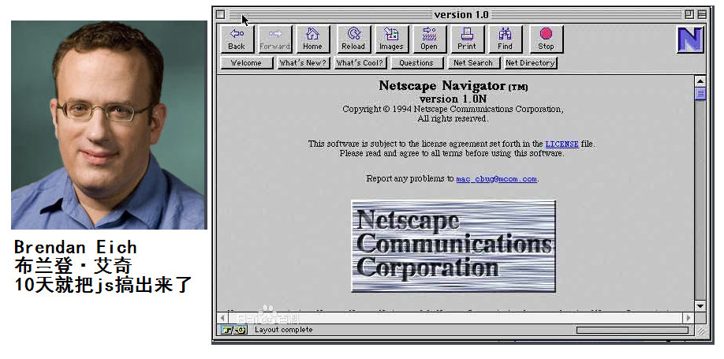
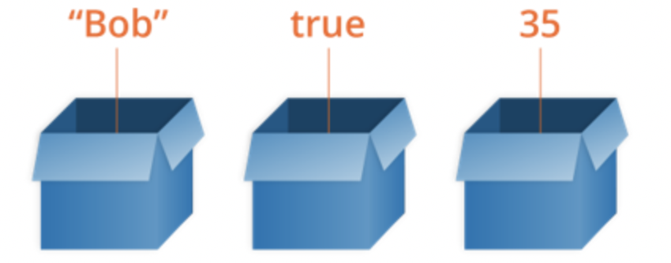
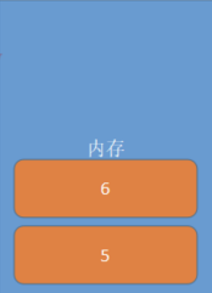
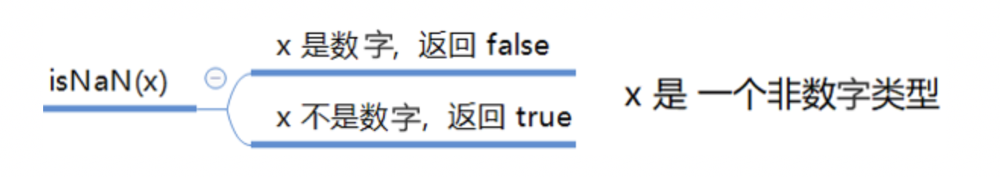

## 一、JavaScript是什么

> Netscape在最初将其脚本语言命名为LiveScript，后来Netscape在与Sun合作之后将其改名为JavaScript。JavaScript最初受Java启发而开始设计的，目的之一就是“看上去像Java”，因此语法上有类似之处，一些名称和命名规范也借自Java。JavaScript与Java名称上的近似，是当时Netscape为了营销考虑与Sun微系统达成协议的结果。Java和JavaScript的关系就像张雨和张雨生的关系，只是名字很像。

**Java 服务器端的编程语言**

**JavaScript 运行在客户端(浏览器)的编程语言**

> JavaScript是一种运行在**客户端** 的**脚本语言** JavaScript的解释器被称为JavaScript引擎，为浏览器的一部分，广泛用于客户端的脚本语言，最早是在HTML（标准通用标记语言下的一个应用）网页上使用，用来给HTML网页增加动态功能。



### 1、JavaScript最初的目的

最初的目的是为了处理表单的验证操作。

### 2、JavaScript现在的意义(应用场景)

JavaScript 发展到现在几乎无所不能。

1. 网页特效
2. 服务端开发(Node.js)
3. 命令行工具(Node.js)
4. 桌面程序(Electron)
5. App(Cordova)
6. 控制硬件-物联网(Ruff)
7. 游戏开发(cocos2d-js)

### 3、JavaScript和HTML、CSS的区别

1. HTML：提供网页的结构，提供网页中的内容
2. CSS: 用来美化网页
3. JavaScript: 可以用来控制网页内容，给网页增加动态的效果

## 二、JavaScript的组成


### 1、ECMAScript - JavaScript的核心

ECMA 欧洲计算机制造联合会

网景：JavaScript

微软：JScript

定义了JavaScript的语法规范 

JavaScript的核心，描述了语言的基本语法和数据类型，ECMAScript是一套标准，定义了一种语言的标准与具体实现无关

### 2、BOM - 浏览器对象模型

一套操作浏览器功能的API

通过BOM可以操作浏览器窗口，比如：弹出框、控制浏览器跳转、获取分辨率等

### 3、DOM - 文档对象模型

一套操作页面元素的API

DOM可以把HTML看做是文档树，通过DOM提供的API可以对树上的节点进行操作

## 三、JavaScript嵌入页面的方式

CSS：行内样式、嵌入样式、外部样式

### 1、JavaScript的书写位置

- 写在行内

```javascript
<input type="button" value="按钮" onclick="alert('Hello World')" />
```

- 写在script标签中

```javascript
<head>
  <script>
    var a = 123;
    var b = 'str';
//一条javascript语句应该以“;”结尾
    function fn(){
        alert(a);
    };
    fn();
  </script>
</head>
```

- 写在外部js文件中，在页面引入

```javascript
<script src="main.js"></script>
```

- 注意点

  **引用外部js文件的script标签中不可以写JavaScript代码**

- javascript注释

  ```javascript
  <script type="text/javascript">    
  
  // 单行注释
  var a = 123;
  /*  
    多行注释
    1、...
    2、...
  */
  var b = 'str';
  </script>
  ```

## 变量

### 什么是变量

- 什么是变量

  变量是计算机内存中存储数据的标识符，根据变量名称可以获取到内存中存储的数据

  变量是用于存放数据的容器。 我们通过 变量名 获取数据，甚至数据可以修改。

  

- 为什么要使用变量

  使用变量可以方便的获取或者修改内存中的数据

### 如何使用变量

- var声明变量

```javascript
var age;
```

- 变量的赋值

```javascript
var age;
age = 18;
```

- 同时声明多个变量

```javascript
var age, name, sex;
age = 10;
name = 'zs';
```

- 同时声明多个变量并赋值

```javascript
var age = 10, name = 'zs';
```

### 变量在内存中的存储

```javascript
var num1 = 5;
var num2 = 6;

本质：变量是程序在内存中申请的一块用来存放数据的空间。类似我们酒店的房间，一个房间就可以看做是一个变量。  
```



### 变量的命名规则和规范

- 规则 - 必须遵守的，不遵守会报错

  - 由字母、数字、下划线、$符号组成，不能以数字开头
  - 不能是关键字和保留字，例如：for、while。
  - 区分大小写

- 规范 - 建议遵守的，不遵守不会报错

  - 变量名必须有意义
  - 遵守驼峰命名法。首字母小写，后面单词的首字母需要大写。例如：userName、userPassword


### 案例

1. 交换两个变量的值

```js
//错误
var a = 10;
var b = 100;
a = b;
b = a;
console.log(a);
console.log(b);
//正确
var a = 10;
var b = 100;
var temp;
temp = a;
a = b;
b = temp;
console.log(a);
console.log(b);
```


## 数据类型

### 简单数据类型

Number、String、Boolean、Undefined、Null

#### Number类型

- 数值字面量：数值的固定值的表示法

  - 110 1024  60.5


- 浮点数

  - 12.3

- 数值判断
  - NaN：not a number
    - NaN 与任何值都不相等，包括他本身
  - isNaN: is not a number

  

```js
var usrAge = 21;
var isOk = isNaN(userAge);
console.log(isNum);          // false ，21 不是一个非数字
var usrName = "andy";
console.log(isNaN(userName));// true ，"andy"是一个非数字
```

#### String类型

'abc'   "abc"

- 字符串字面量

  ```js
  var strMsg = "我爱北京天安门~";  // 使用双引号表示字符串
  var strMsg2 = '我爱吃猪蹄~';    // 使用单引号表示字符串
  // 常见错误
  var strMsg3 = 我爱大肘子;       // 报错，没使用引号，会被认为是js代码，但js没有这些语法
  ```

  因为 HTML 标签里面的属性使用的是双引号，JS 这里我们更推荐使用单引号。

  ```js
  var strMsg = '我是"高帅富"程序猿';   // 可以用''包含""
  var strMsg2 = "我是'高帅富'程序猿";  // 也可以用"" 包含''
  //  常见错误
  var badQuotes = 'What on earth?"; // 报错，不能 单双引号搭配
  ```

  

- 转义符

  类似HTML里面的特殊字符，字符串中也有特殊字符，我们称之为转义符。

  转义符都是 \ 开头的，常用的转义符及其说明如下：

  

  | 转义符 | 解释说明                          |
  | ------ | --------------------------------- |
  | \n     | 换行符，n   是   newline   的意思 |
  | \ \    | 斜杠   \                          |
  | \'     | '   单引号                        |
  | \"     | ”双引号                           |
  | \t     | tab  缩进                         |
  | \b     | 空格 ，b   是   blank  的意思     |

- 字符串长度

  length属性用来获取字符串的长度

  ```javascript
  var str = 'Hello World';
  console.log(str.length);
  ```

- 字符串拼接

  字符串拼接使用 + 连接

  ```javascript
  console.log(11 + 11);
  console.log('hello' + ' world');
  console.log('100' + '100');
  console.log('11' + 11);
  console.log('male:' + true);
  ```

  1. 两边只要有一个是字符串，那么+就是字符串拼接功能
  2. 两边如果都是数字，那么就是算术功能。

#### Boolean类型

- Boolean字面量：  true和false，区分大小写
- 计算机内部存储：true为1，false为0

#### Undefined和Null

1. undefined表示一个声明了没有赋值的变量，变量只声明的时候值默认是undefined

```js
var variable;
console.log(variable);           // undefined
console.log('你好' + variable);  // 你好undefined
console.log(11 + variable);     // NaN
console.log(true + variable);   //  NaN
```


1. null表示一个空，变量的值如果想为null，必须手动设置,一个声明变量给 null 值，里面存的值为空

```js
var vari = null;
console.log('你好' + vari);  // 你好null
console.log(11 + vari);     // 11
console.log(true + vari);   //  1
```


### 复杂数据类型

​	讲对象时再讲（Object）

### 获取变量的类型

typeof

```javascript
var age = 18;
console.log(typeof age);  // 'number'
```

## 数据类型转换

如何使用谷歌浏览器，快速的查看数据类型？

字符串的颜色是黑色的，数值类型是蓝色的，布尔类型也是蓝色的，undefined和null是灰色的

### 转换成字符串类型

- toString()

  ```
  var num = 5;
  console.log(num.toString());
  ```

- String()

  ```
  String()函数存在的意义：有些值没有toString()，这个时候可以使用String()。比如：undefined和null
  
  var num = undefined
  console.log(String(num));
  ```

- 拼接字符串方式

  num  +  ""，当 + 两边一个操作符是字符串类型，一个操作符是其它类型的时候，会先把其它类型转换成字符串再进行字符串拼接，返回字符串

### 转换成数值类型

- parseInt()

  ```javascript
  var num1 = parseInt("12.3abc");  // 返回12，如果第一个字符是数字会解析知道遇到非数字结束
  var num2 = parseInt("abc123");   // 返回NaN，如果第一个字符不是数字或者符号就返回NaN
  ```

- parseFloat()

  ```
  parseFloat()把字符串转换成浮点数
  parseFloat()和parseInt非常相似，不同之处在与
  	parseFloat会解析第一个. 遇到第二个.或者非数字结束
  	如果解析的内容里只有整数，解析成整数
  ```

- +，-0等运算

  ```javascript
  var str = '500';
  console.log(+str);		// 取正
  console.log(-str);		// 取负
  console.log(str - 0);   //转换成数值
  ```

## 操作符

### 算术运算符

```
+ - * / %  
```

++  自身加1

-- 自身减1

- 前置++

  ```javascript
  var num1 = 5;
  ++ num1; 
  
  var num2 = 6;
  console.log(num1 + ++ num2);
  ```

- 后置++

  ```javascript
  var num1 = 5;
  num1 ++;    
  var num2 = 6 
  console.log(num1 + num2 ++);
  ```

  ​


### 逻辑运算符(布尔运算符)

```
&& 与 两个操作数同时为true，结果为true，否则都是false
|| 或 两个操作数有一个为true，结果为true，否则为false
!  非  取反
```

### 关系运算符(比较运算符)

```
<  >  >=  <= == != === !==
```

```javascript
==与===的区别：==只进行值得比较，===类型和值同时相等，则相等

var result = '55' == 55;  	// true
var result = '55' === 55; 	// false 值相等，类型不相等
var result = 55 === 55; 	// true
```

### 赋值运算符

=   +=   -=   *=   /=   %=

```javascript
例如：
var num = 0;
num += 5;	//相当于  num = num + 5;
```

## 流程控制

> 程序的三种基本结构

### 顺序结构

 从上到下执行的代码就是顺序结构

**程序默认就是由上到下顺序执行的**

### 分支结构	

根据不同的情况，执行对应代码

### 循环结构

循环结构：重复做一件事情

## 分支结构

### if语句

语法结构

```javascript
if (/* 条件表达式 */) {
  // 执行语句
}

if (/* 条件表达式 */){
  // 成立执行语句
} else {
  // 否则执行语句
}

if (/* 条件1 */){
  // 成立执行语句
} else if (/* 条件2 */){
  // 成立执行语句
} else if (/* 条件3 */){
  // 成立执行语句
} else {
  // 最后默认执行语句
}
```

案例：
    求两个数的最大数

```js
var a = 10;
var b = 100;
if(a>b){
    console.log(a);
}else{
    console.log(b);
}
```

​    判断一个数是偶数还是奇数

```js
var a = 12;
if(a%2==0){
    console.log('偶数');
}else{
    console.log('奇数');
}
```

​    分数转换，把百分制转换成ABCDE   

<60  E 

 60-70 D 

 70-80 C  

80-90 B  

90 - 100 A

```js
var score = prompt('请输入成绩')
if(score< 60){
    console.log('E');
}else if(score>=60 && score<=70){
    console.log('D');
}
```


### 三元运算符

```
表达式1 ? 表达式2 : 表达式3
是对if……else语句的一种简化写法
```

案例：
	是否年满18岁

```js
var age =10
console.log(age>18?'成年':'未成年');
```

​	从两个数中找最大值

```js
var a = 10;
var b = 8;
console.log(a>b?a:b);
```

### switch语句

语法格式:

```javascript
switch (expression) {
  case 常量1:
    语句;
    break;
  case 常量2:
    语句;
    break;
  case 常量3:
    语句;
    break;
  …
  case 常量n:
    语句;
    break;
  default:
    语句;
    break;
}
```

```
break可以省略，如果省略，代码会继续执行下一个case
switch 语句在比较值时使用的是全等操作符, 因此不会发生类型转换（例如，字符串'10' 不等于数值 10）
```

案例：

```js
var fruit = prompt('请您输入查询的水果:');
switch (fruit) {
    case '苹果':
        alert('苹果的价格是 3.5/斤');
        break;
    case '榴莲':
        alert('榴莲的价格是 35/斤');
        break;
    default:
        alert('没有此水果');
}
```


### 布尔类型的隐式转换

流程控制语句会把后面的值隐式转换成布尔类型

```
转换为true   非空字符串  非0数字  true 任何对象
转换成false  空字符串  0  false  null  undefined
```

### 案例

```javascript
var message;
// 会自动把message转换成false
if (message) {     
  // todo...
}

if(!true){
    
}
```

### 转换成布尔类型

- Boolean()

0  ''(空字符串) null undefined NaN 会转换成false  其它都会转换成true

```js
console.log(Boolean('')); // false
console.log(Boolean(0)); // false
console.log(Boolean(NaN)); // false
console.log(Boolean(null)); // false
console.log(Boolean(undefined)); // false
console.log(Boolean('小白')); // true
console.log(Boolean(12)); // true
```


## 

# 作业

1. 判断一个人的年龄是否满18岁(弹出是否成年信息)

2. 用户输入几点弹出问候信息

   ​	如用户输入12点中午好；

     	用户输入18点 弹出傍晚好；

   ​	用户输入23点弹出深夜好；

3. 求图形的周长和面积。具体要求如下：

   a)	通过键盘输入长方形的长和宽，输入前给出相应的提示，求出长方形的周长和面积并输出

   b)	通过键盘输入正方形的边长，输入前给出相应的提示，求出正方形的周长和面积并输出

   c)	通过键盘输入圆形的半径，输入前给出相应的提示，求出圆形的周长和面积并输出

   d)	通过键盘输入三角形的边长，输入前给出相应的提示，求出三角形的周长和面积并输出

   d = (a+b+c)/2; 面积 = Math.sqrt(d*(d-a)*(d-b)*(d-c))

4. 统计小朋友摘苹果的个数。具体要求如下：

   a)	有小红、小刚、小丽、小玉4个小朋友到苹果园子摘苹果。

   b)	先输入小红摘的苹果数，然后输出1个小朋友一共摘了多少个苹果；

   c)	再输入小刚摘的苹果数，然后输出2个小朋友一共摘了多少个苹果；

   d)	再输入小丽摘的苹果数，然后输出3个小朋友一共摘了多少个苹果；

   e)	再输入小玉摘的苹果数，然后输出4个小朋友一共摘了多少个苹果。

5. 拆数字

   a)	从键盘输入一个五位数

   b)	将这五位数拆分成5个一位数，分别保存在5个不同的变量中

   c)	将拆分完的5个数，依次显示出来

   例如：键盘输入42380，则输出4   2     3     8     0

   （提示：

   用number代表任意的一个数，则有如下原则：

   ---number/10能够将number的尾数舍掉，因为两个整数相除，只能得到整除的结果

   ---number%10代表一个数除以10得到的余数，该余数一定是number的尾数）

6. 模拟商场购物打折的优惠活动

   优惠活动细则如下：

   1．消费金额不低于2000

   1）如果是会员

   A）现金支付：8折

   B）信用卡支付：8.5折

   C）借记卡支付：9折

   2）如果不是会员：只能使用现金支付方式，可以享受9.5折优惠

   2．消费金额低于2000：只能使用现金支付方式，不能享受任何打折的优惠

    

   编写程序：接受用户从键盘输入消费金额，根据消费的具体金额、是否为会员和支付的方式输出该顾客实际需要支付的金额数。

   效果如下：

   【运行结果第一种可能性】

   请输入您的消费金额：1500

   您的消费金额不足2000，只能使用现金支付，不能享受任何打折的优惠，您的实际支付金额为1500元

    

   【运行结果第二种可能性】

   请输入您的消费金额：3000

   请输入您是否为会员（y - 会员，其它 - 非会员）：1

   请输入您的支付方式（1-现金支付 2-信用卡支付 其它-借记卡支付）：1

   您消费3000元，并且为会员，选择了现金支付，可以享受8折优惠，您的实际支付金额为2400元

    

   【运行结果第三种可能性】

   请输入您的消费金额：5000

   请输入您是否为会员（y - 会员，其它 - 非会员）：1

   请输入您的支付方式（1-现金支付 2-信用卡支付 其它-借记卡支付）：3

   您消费5000元，并且为会员，选择了借记卡支付，可以享受9折优惠，您的实际支付金额为4500元

    

   【运行结果的第四种可能性】

   请输入您的消费金额：2500

   请输入您是否为会员（y - 会员，其它 - 非会员）：0

   您消费2500元，但不是会员，只能使用现金支付方式，可以享受9.5折优惠，您的实际支付金额为2375元

    

   附加题：饭店点餐系统

   要求：

   1）	程序启动，提示用户进行注册信息，要求用户输入用户名、密码和确认密码，判断用户名和密码是否符合要求，密码和确认密码是否相同，若输入有效，则注册成功，继续提示用户进行登录，否则给出相应的错误提示信息，程序结束。

   2）	若注册成功，完成登录功能，提示用户输入用户名和密码，与刚刚注册的信息进行比较，登录成功则提出相应提示，并继续完成如下功能

   3）	登录成功，完成该功能，模拟点餐系统。给出用户一个提示信息：您需要炒饼还是炒面，当用户输入1代表炒饼，输入2代表炒面，输入其他则代表用户选择放弃用餐。当用户选择炒饼后，继续提示用户选择鱿鱼炒饼还是鸡蛋炒饼，并根据用户的选择，显示相应的提示信息，即“你选择了****，请稍后！”；当用户选择炒面，继续提示用户选择肉丝炒面还是蔬菜烧面，并根据用户的选择，显示相应的提示信息，即“你选择了****，请稍后！”