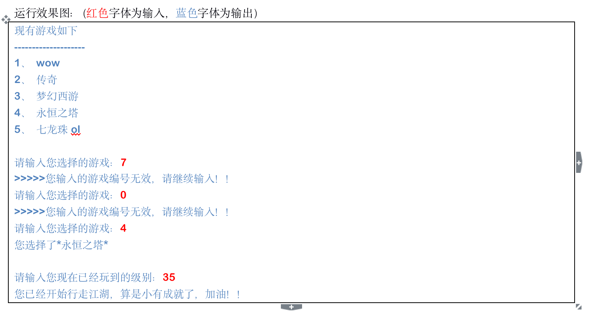

## 循环结构

> 在javascript中，循环语句有三种，while、do..while、for循环。

### while语句

基本语法：

```javascript
// 当循环条件为true时，执行循环体，
// 当循环条件为false时，结束循环。
while (循环条件) {
  //循环体
}
```

代码示例：

```javascript
// 计算1-100之间所有数的和
// 初始化变量
var i = 1;
var sum = 0;
// 判断条件
while (i <= 100) {
  // 循环体
  sum += i;
  // 自增
  i++;
}
console.log(sum);
```

案例：

​    打印1-100以内 7的倍数

```js
var i=1
while(i<=100){
    if(i%7==0){
        console.log(i);
    }
    i++
}
```

​    打印100以内所有偶数

```js
var i=1
while(i<=100){
    if(i%2==0){
        console.log(i);
    }
    i++
}
```

​    打印100以内所有偶数的和

```js
var i=1
var sum = 0
while(i<=100){
    if(i%2==0){
        sum+=i
    }
    i++
}
console.log(sum);
```


### do...while语句

> do..while循环和while循环非常像，二者经常可以相互替代，但是do..while的特点是不管条件成不成立，都会执行一次。

基础语法：

```javascript
do {
  // 循环体;
} while (循环条件);
```

代码示例：

```javascript
// 初始化变量
var i = 1;
var sum = 0;
do {
  sum += i;//循环体
  i++;//自增
} while (i <= 100);//循环条件
```

案例：

求100以内所有3的倍数的和

```js
var i = 1
var sum = 0
do {
    if (i % 3 == 0) {
        sum += i
    }
    i++
} while (i <= 100)
    console.log(sum);
```

计算图形面积

```js
do{
    var state = prompt('1、正方形，2、圆形')
    if (state == 1) {
        var c = prompt('请输入边长')
        console.log(c * c);
    } else {
        var r = prompt('请输入半径')
        console.log(Math.PI*r*r);
    }
	var flag = prompt('是否继续 y/n')
}while(flag=='y')
```

### for语句

> while和do...while一般用来解决无法确认次数的循环。for循环一般在循环次数确定的时候比较方便

for循环语法：

```javascript
// for循环的表达式之间用的是;号分隔的，千万不要写成,
for (初始化表达式1; 判断表达式2; 自增表达式3) {
  // 循环体
}
```

执行顺序：1243  ----  243   -----243(直到循环条件变成false)

1. 初始化表达式
2. 判断表达式
3. 自增表达式
4. 循环体

案例：

打印1-100之间所有数

```js
for(var i=1;i<=100;i++){
    console.log(i);
}
```

求1-100之间所有数的和

```js
var sum = 0;
for (var i = 1; i <= 100; i++) {
    sum+=i;
}
console.log(sum);
```

求1-100之间所有偶数的和

```js
var sum = 0;
for (var i = 1; i <= 100; i++) {
    if(i%2==0){
        sum+=i
    }
}
console.log(sum);
```

打印正方形

```js
var start = '';
for (var i = 0; i < 10; i++) {
  for (var j = 0; j < 10; j++) {
    start += '* ';
  }
  start += '\n';
}
console.log(start);


// 使用拼字符串的方法的原因
// console.log 输出重复内容的问题
// console.log 默认输出内容后有换行
```

打印直角三角形

```js
var start = '';
for (var i = 0; i < 10; i++) {
    for (var j = 0; j <= i; j++) {
        start += '* ';
    }
    start += '\n';
}
console.log(start);
```

### continue和break

> break:立即跳出整个循环，即循环结束，开始执行循环后面的内容（直接跳到大括号）
>
> continue:立即跳出当前循环，继续下一次循环（跳到i++的地方）

案例：

打印1-100之间的数，如果到58停止循环

```javascript
for (var i = 1; i <= 100; i++) {

    if (i == 58) {
        break
    }
    console.log(i);

}
```

打印1-100之间的数，如果到58停止本次循环，之后继续

```js
for (var i = 1; i <= 100; i++) {

    if (i == 58) {
        continue
    }
    console.log(i);

} 
```

# 作业：

1. 打印100以内的奇数

2. 打印100以内的奇数的和

3. 打印9*9乘法表

4. 【重点：while循环与break的使用】

   1、	制作一个游戏菜单下图所示

   2、	接受用户输入游戏编号，并对编号进行判断其有效性，若无效，则要求继续输入，直到编号有效为止

   3、	根据用户输入的游戏编号显示出对应的游戏名字

   4、	继续提示用户输入当前所处的等级，根据等级数显示出不同的结果

   a)	20级以下：您还是新出茅庐的小菜鸟，加快步伐向前冲吧！！

   b)	21-40级：您已经开始行走江湖，算是小有成就了，加油！！

   c)	41-60级：您已经横扫天下了，离天下无敌还有差距，继续努力吧！！

   d)	60级以上：您已经天下无敌了，太牛了！！

   

5. 修改商场打折活动的题目，实现能够连续为客户结账的功能，每次为一位顾客结账结束之后，提问是否继续为下一位顾客结账，当输入‘y’的时候则继续，否则结束

6. 模拟登录功能：能够成功登录的用户名和密码分别为：admin和asjy

   1、	接受用户输入用户名和密码，判断能否登录成功

   2、	如果登录成功则提示成功

   3、	如果登录失败，则要求必须重新登录

   4、	如果连续3次登录失败，则不允许再登录，并给出相应的提示

7. 分析下列数字序列的规律，使用循环，输出该序列的前20位数字

   1  1  2  3  5  8  13 ………

8. 编程计算1x2x3+4x5x6+…+100x101x102的值

