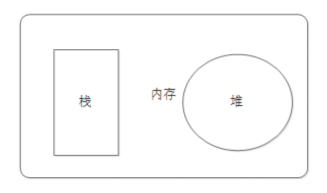
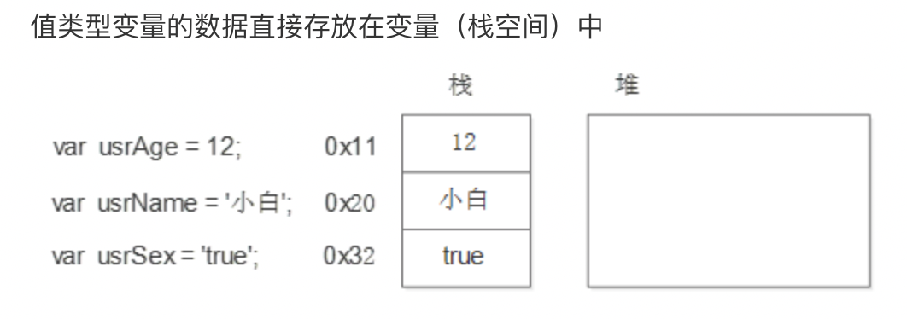
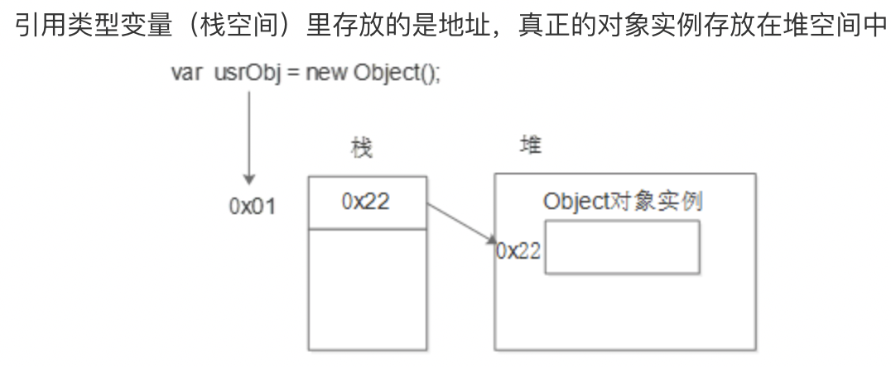

## 对象

### 什么是对象

```
现实生活中：万物皆对象，对象是一个具体的事物，一个具体的事物就会有行为和特征。
举例： 一部车，一个手机
车是一类事物，门口停的那辆车才是对象
	特征：红色、四个轮子
	行为：驾驶、刹车
```

### JavaScript中的对象

```
JavaScript中的对象其实就是生活中对象的一个抽象
JavaScript的对象是无序属性的集合。
	其属性可以包含基本值、对象或函数。对象就是一组没有顺序的值。我们可以把JavaScript中的对象想象成键值对，其中值可以是数据和函数。
对象的行为和特征
	特征---属性
	行为---方法
```

- 事物的特征在对象中用属性来表示。
- 事物的行为在对象中用方法来表示。

### 对象创建方式

- 对象字面量

```javascript
var person = {
  name: 'zs',
  age: 18,
  sex: true,
  sayHi: function () {
    console.log(this.name);
  }
};   

方法中通过this关键词使用属性的值，this在方法中代表的是当前对象 person 

如何访问对象中的方法和属性呢？
对象名.属性名
对象名.方法名

console.log(person.name)
person.sayHi()

另一种方式：
console.log(person['name'])
```

- new Object()创建对象

```javascript
var person = new Object();
  console.log(person.name);//undefined
  person.name = 'lisi';
  person.age = 35;
  person.job = 'doctor';
  person.sayHi = function(){
      console.log('Hello,everyBody');
  }


new Object();是一个构造函数，就创建了一个空的对象
```

- 工厂函数创建对象(如果创建多个对象，每个对象都有name等属性，那就使用工厂的方式)

```javascript
function createPerson(name, age, job) {
  var person = new Object();
  person.name = name;
  person.age = age;
  person.job = job;
  person.sayHi = function(){
    console.log('Hello,everyBody');
  }
  return person;
}
var p1 = createPerson('张三', 22, 'doctor');
var p2 = createPerson('李四', 32, 'worker');
```

- 自定义构造函数(简化工厂的方式)

```javascript
function Person(name,age,job){
   //this指向当前对象  p1  谁new的 就指向谁
  this.name = name;
  this.age = age;
  this.job = job;
  this.sayHi = function(){
  	console.log('Hello,everyBody');
  }
}
var p1 = new Person('张三', 22, 'doctor');
var p2 = new Person('李四', 32, 'worker');
```

### 属性和方法

```
如果一个变量属于一个对象所有，那么该变量就可以称之为该对象的一个属性，属性一般是名词，用来描述事物的特征
如果一个函数属于一个对象所有，那么该函数就可以称之为该对象的一个方法，方法是动词，描述事物的行为和功能
```

### new关键字

> 构造函数 ，是一种特殊的函数。主要用来在创建对象时初始化对象， 即为对象成员变量赋初始值，总与new运算符一起使用在创建对象的语句中。

1. 构造函数用于创建一类对象，首字母要大写。
2. 构造函数要和new一起使用才有意义。

new在执行时会做四件事情

```
new会在内存中创建一个新的空对象
new 会让this指向这个新的对象
执行构造函数  目的：给这个新对象加属性和方法
new会返回这个新对象
```

### this详解

- 函数中的this

```js
function foo(){
    console.log(this)//指向的是window，后期会详细学习
}
```

- 在方法（函数是独立存在的，方法是在对象中的）中this

```js
var person = {
  name: 'zs',
  sayHi: function () {
    console.log(this);
  }
};  

person.sayHi()//Object  那么this指向的是这个方法所属的对象  this.name  ->  zs
```

- 构造函数中的this

```js
function Person(){
  this.name = 'zs'
  console.log(this);//构造函数所创建的对象
}
var o = new Person()
```

### 遍历对象的属性

> 通过for..in语法可以遍历一个对象

```javascript
var person = {
  name: 'zs',
  age: 18,
  sex: true,
  sayHi: function () {
    console.log(this.name);
  }
};  
for(var key in person) {
  console.log(key + "==" + person[key]);
}


var obj = {}
obj.name = 'zs'
for(var key in obj) {
  console.log(key + "==" + obj[key]);
}
```

### 删除对象的属性

```javascript
function fun() { 
  this.name = 'mm';
}
var obj = new fun(); 
console.log(obj.name); // mm 
delete obj.name;
console.log(obj.name); // undefined

```

### 简单类型和复杂类型的区别

> 基本类型又叫做值类型，复杂类型又叫做引用类型
>
> 值类型：简单数据类型，基本数据类型，在存储时，变量中存储的是值本身，因此叫做值类型。
>
> 引用类型：复杂数据类型，在存储是，变量中存储的仅仅是地址（引用），因此叫做引用数据类型。
>
> 简单数据类型
>
> ​	Number String Boolean Null Undefined
>
> 复杂数据类型
>
> ​	Object

- 堆和栈

  ```
  堆栈空间分配区别：
  　　1、栈（操作系统）：由操作系统自动分配释放 ，存放简单数据类型
  　　2、堆（操作系统）： 存储复杂类型(对象)，一般由程序员分配释放， 若程序员不释放，由垃圾回收机制回收
  ```

- 注意：JavaScript中没有堆和栈的概念，此处我们用堆和栈来讲解，目的方便理解和方便以后的学习。



#### 基本类型在内存中的存储



#### 复杂类型在内存中的存储




```js
function Person(name, age, salary) {
    this.name = name;
    this.age = age;
    this.salary = salary;
}
var p1 = new Person("zs", 18, 1800)
console.log(p1.name);
var p2 = new Person("lsi", 28, 2800)
console.log(p2.name);
p1 = p2
p1.name = "王五"
console.log(p2.name);
```

 下面代码输出的结果

```js
function Person(name, age, salary) {
    this.name = name;
    this.age = age;
    this.salary = salary;
}
function f1(person) {
    person.name = "ls";
}
var p = new Person("zs", 18, 1000);
console.log(p.name);
f1(p);
console.log(p.name);
```

函数的形参也可以看做是一个变量，当我把引用类型变量传给形参时，其实是把变量在栈空间里保存的对地址值赋值给了形参，形参和实参其实保存的是同一个对地址值，所以操作的是同一个对象

```javascript
function Person(name, age, salary) {
    this.name = name;
    this.age = age;
    this.salary = salary;
}
var p = new Person("zs", 18, 1000);
function f1(person) {
    person.name = "ls";
    person = new  Person("aa", 18, 1000);
    console.log(person.name);
}
console.log(p.name);
f1(p);
console.log(p.name);
```

思考：

```javascript
//1. 
var num1 = 10;
var num2 = num1;
num1 = 20;
console.log(num1);
console.log(num2);

//2. 
var num = 50;
function f1(num) {
    num = 60;
    console.log(num);
}
f1(num);
console.log(num);

//3. 
var num1 = 55;
var num2 = 66;
function f1(num, num1) {
  num = 100;
  num1 = 100;
  num2 = 100;
  console.log(num);
  console.log(num1);
  console.log(num2);
}

f1(num1, num2);
console.log(num1);
console.log(num2);
console.log(num);
```

## 内置对象

### Math对象

Math对象不是构造函数，它具有数学常数和函数的属性和方法，都是以静态成员的方式提供

跟数学相关的运算来找Math中的成员（求绝对值，取整）

[Math](https://developer.mozilla.org/zh-CN/docs/Web/JavaScript/Reference/Global_Objects/Math)

演示：Math.PI、Math.random()、Math.floor()/Math.ceil()、Math.round()、Math.abs()	、Math.max()

```javascript
Math.PI						// 圆周率
Math.random()				// 生成随机数
Math.floor(45.85)/Math.ceil()	 // 向下取整/向上取整
Math.round()				// 取整，四舍五入
Math.abs()					// 绝对值
Math.max(2，3，1)/Math.min()		 // 求最大和最小值

var arr = [1,2,3,4]
Math.max(...arr) 数组以字符串形式展开
```

### Date对象

创建 `Date` 实例用来处理日期和时间。Date 对象基于1970年1月1日（世界标准时间）起的毫秒数。

```javascript
// 获取当前时间，UTC世界时间，距1970年1月1日（世界标准时间）起的毫秒数
var now = new Date();
console.log(now.valueOf());	// 获取距1970年1月1日（世界标准时间）起的毫秒数

Date构造函数的参数
1. 毫秒数 1498099000356		new Date(1498099000356)
2. 日期格式字符串  '2015-5-1'	 new Date('2015-5-1')
3. 年、月、日……				  new Date(2015, 4, 1)   // 月份从0开始

```

- 获取日期的毫秒形式

```javascript
var now = new Date();
// valueOf用于获取对象的原始值
console.log(date.valueOf())	

// HTML5中提供的方法，有兼容性问题
var now = Date.now();	

```

- 日期格式化方法

```javascript
toString()		// 转换成字符串
valueOf()		// 获取毫秒值
// 下面格式化日期的方法，在不同浏览器可能表现不一致，一般不用
toDateString()
toTimeString()
toLocaleDateString()
toLocaleTimeString()

```

- 获取日期指定部分

```javascript
getTime()  	  // 返回毫秒数和valueOf()结果一样，valueOf()内部调用的getTime()
getMilliseconds() //毫秒
getSeconds()  // 秒，返回0-59
getMinutes()  // 分钟，返回0-59
getHours()    // 小时，返回0-23
getDay()      // 返回星期几 0周日   6周6
getDate()     // 返回当前月的第几天
getMonth()    // 返回月份，***从0开始***
getFullYear() //返回4位的年份  如 2016

```

#### 案例

- 写一个函数，格式化日期对象，返回yyyy-MM-dd HH:mm:ss的形式

```javascript
function formatDate(d) {
  //如果date不是日期对象，返回
  if (!date instanceof Date) {
    return;
  }
  var year = d.getFullYear(),
      month = d.getMonth() + 1, 
      date = d.getDate(), 
      hour = d.getHours(), 
      minute = d.getMinutes(), 
      second = d.getSeconds();
  month = month < 10 ? '0' + month : month;
  date = date < 10 ? '0' + date : date;
  hour = hour < 10 ? '0' + hour : hour;
  minute = minute < 10 ? '0' + minute:minute;
  second = second < 10 ? '0' + second:second;
  return year + '-' + month + '-' + date + ' ' + hour + ':' + minute + ':' + second;
}
```

### String对象

- 字符串的不可变

```javascript
var str = 'abc';
str = 'hello';
// 当重新给str赋值的时候，常量'abc'不会被修改，依然在内存中
// 重新给字符串赋值，会重新在内存中开辟空间，这个特点就是字符串的不可变
// 由于字符串的不可变，在大量拼接字符串的时候会有效率问题
```

- 字符串对象的常用方法

  字符串所有的方法，都不会修改字符串本身(字符串是不可变的)，操作完成会返回一个新的字符串

```javascript
// 1 字符方法
charAt()    	//获取指定位置处字符
// 2 字符串操作方法
slice()    		//从start位置开始，截取到end位置，end取不到
substring() 	//从start位置开始，截取到end位置，end取不到
substr()   		//从start位置开始，截取length个字符
// 3 位置方法
indexOf()   	//返回指定内容在元字符串中的位置
lastIndexOf() 	//从后往前找，只找第一个匹配的
// 4 去除空白   
trim()  		//只能去除字符串前后的空白
// 5 大小写转换方法
toUpperCase() 	//转换大写
toLowerCase() 	//转换小写
// 6 其它
replace()
split() //切割字符串，返回一个数组
```

#### 案例

- 截取字符串"我爱中华人民共和国"，中的"中华"

```javascript
var s = "我爱中华人民共和国";
s = s.substr(2,2);
console.log(s);

```

- "abcoefoxyozzopp"查找字符串中所有o出现的位置

```javascript
var s = 'abcoefoxyozzopp';
var index = -1;
do{
    index  = s.indexOf('o',index+1)
    if(index!=-1){
        console.log(index);
    }
}while(index!=-1)
```

- 把字符串中所有的o替换成!

```javascript
var s = 'abcoefoxyozzopp';
do {
  s = s.replace('o', '!');
} while (s.indexOf('o') > -1);
console.log(s);
```

- 判断一个字符串中出现次数最多的字符，统计这个次数

```javascript
var s = 'abcoefoxyozzopp';
var o = {};

for (var i = 0; i < s.length; i++) {
  var item = s.charAt(i);
  if (o[item]) {
    o[item] ++;
  }else{
    o[item] = 1;
  }
}

var max = 0;
var char ;
for(var key in o) {
  if (max < o[key]) {
    max = o[key];
    char = key;
  }
}

console.log(max);
console.log(char);
```


#### 作业

- 自己封装一个对象，描述该对象的属性和方法，并输出结果

```
给定一个字符串如：“abaasdffggghhjjkkgfddsssss3444343”问题如下： 
1、 字符串的长度 
2、 取出指定位置的字符，如：0,3,5,9等 
3、 查找指定字符是否在以上字符串中存在，如：i，c ，b等 
4、 替换指定的字符，如：g替换为22,ss替换为b等操作方法 
5、 截取指定开始位置到结束位置的字符串，如：取得1-5的字符串
6、 找出以上字符串中出现次数最多的字符和出现的次数 
```

- 实现双色球的机选功能：

  双色球的构成：6个红号+1个蓝号，红号的范围是1-33，蓝号的范围是1-16。

  声明一个长度为6的整型数组，存储6个不同的1-33之间的随机数；声明一个变量，存储1-16之间的随机数；输出机选的号码。

  效果图如下：

  本期双色球机选号码如下：

  红号：3 10 17 23 29 30 蓝号：14


```html
<!DOCTYPE html>
<html>

<head>
    <meta charset="utf-8">
    <meta http-equiv="X-UA-Compatible" content="IE=edge">
    <title>Page Title</title>
    <meta name="viewport" content="width=device-width, initial-scale=1">
    <script>
        function one() {
            var one = document.getElementById('one');
            var arr = new Array(7);
            for (var i = 0; i < arr.length; i++) {
                arr[i] = Math.round(Math.random() * 35);
                for (var j = 0; j < i; j++) {
                    if (arr[i] == arr[j]) {
                        i--;
                    }
                }
            }
            arr.sort(function (a, b) {
                return a - b;
            });

            one.innerText = arr.toString();
        }
        function t1() {
            var now = document.getElementById('now');
            var end = document.getElementById('end');
            var date = new Date();
            var hours = date.getHours();
            var minutes = date.getMinutes();
            var miao = date.getSeconds();
            hours = hours < 10 ? '0' + hours : hours;
            minutes = minutes < 10 ? '0' + minutes : minutes;
            miao = miao < 10 ? '0' + miao : miao;
            console.log(`${hours}:${minutes}:${miao}`);
            now.innerText = `${hours}:${minutes}:${miao}`;
        }
        function t2() {
            // 距离本期结束
            var endTime = new Date("2019/3/26 23:59").getTime();
            console.log('endTime==' + endTime);
            var nowTime = new Date().getTime();
            console.log('nowTime==' + nowTime);
            var timer = endTime - nowTime;
            console.log('timer=' + timer);
            var day = timer / 1000 / 60 / 60 / 24;
            var h = timer / 1000 / 60 / 60 - (24 * Math.floor(day));
            var m = timer / 1000 / 60 - (24 * 60 * Math.floor(day)) - (60 * Math.floor(h));
            var s = timer / 1000 - (24 * 60 * 60 * Math.floor(day)) - (60 * 60 * Math.floor(h)) - (60 * Math.floor(m));
            h = Math.floor(h);
            m = Math.floor(m);
            s = Math.floor(s);
            h=h<10?'0'+h:h;
            m=m<10?'0'+m:m;
            s=s<10?'0'+s:s;
            end.innerText = `${h}:${m}:${s}`;
        }
        window.onload = function () {
            t1();
            setInterval(() => {
                t1();
            }, 1000);
            t2();
            setInterval(() => {
                t2();
            }, 1000);
        }
    </script>
</head>

<body>
    <h1 style="color:red;">欢迎使用彩票随机选号系统，恭喜中奖</h1>
    <button style="color:red;" onclick="one()">35选7</button><span id="one" style="color: blue;"></span></br>
    <button>29选7</button><span></span></br>
    <button>25选4</button><span></span></br>
    <h1 style="color:blue;">现在时刻</h1><span id="now"></span>
    <h1>距离本期结束还有小时</h1><span id="end"></span>
</body>

</html>
```

