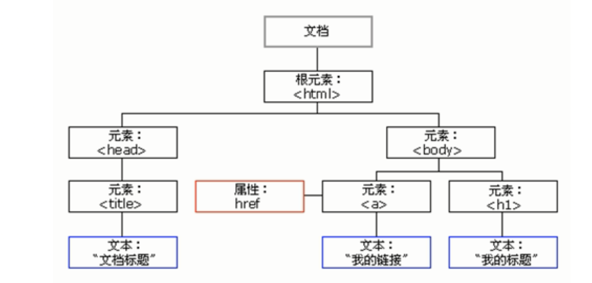
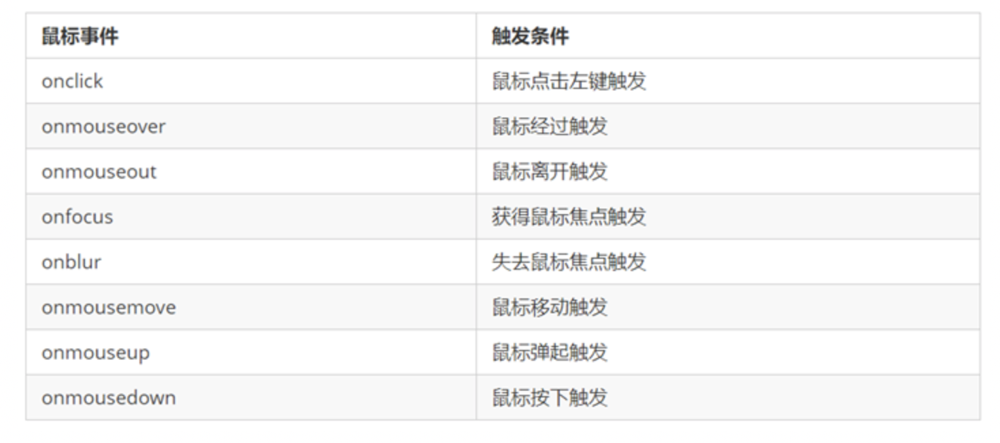
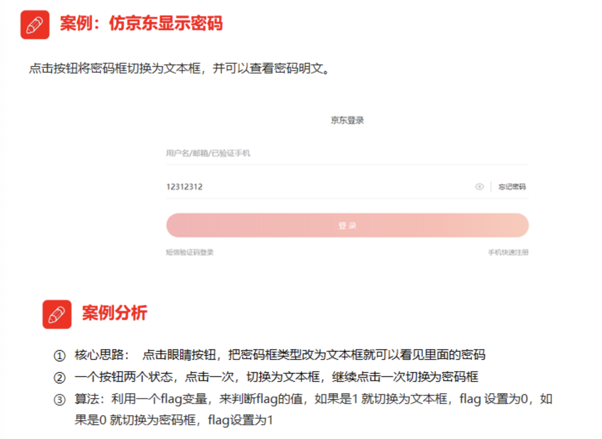
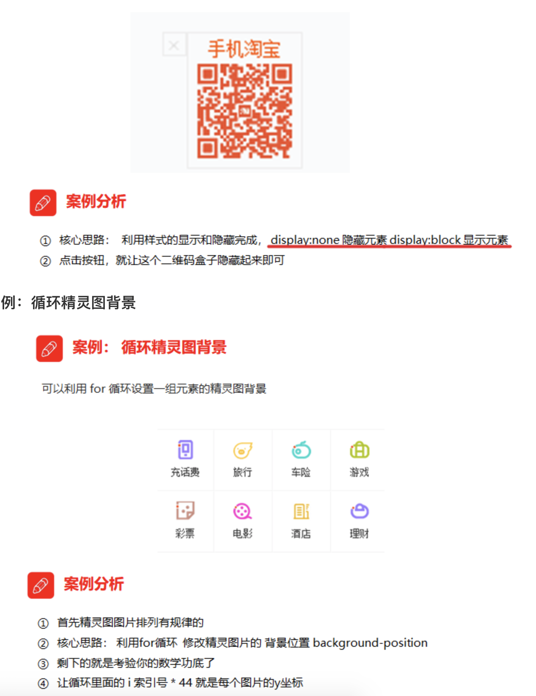
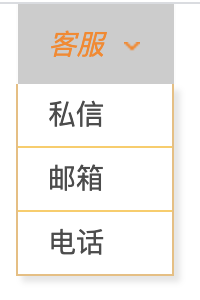

## DOM 介绍

### 什么是DOM

​	文档对象模型（Document Object Model，简称DOM），是 [W3C](https://baike.baidu.com/item/W3C) 组织推荐的处理[可扩展标记语言](https://baike.baidu.com/item/%E5%8F%AF%E6%89%A9%E5%B1%95%E7%BD%AE%E6%A0%87%E8%AF%AD%E8%A8%80)（html或者xhtml）的标准[编程接口](https://baike.baidu.com/item/%E7%BC%96%E7%A8%8B%E6%8E%A5%E5%8F%A3)。

​	W3C 已经定义了一系列的 DOM 接口，通过这些 DOM 接口可以改变网页的内容、结构和样式。

> DOM是W3C组织制定的一套处理 html和xml文档的规范，所有的浏览器都遵循了这套标准。

### DOM树



## 获取元素

为什么要获取页面元素？

例如：我们想要操作页面上的某部分(显示/隐藏，动画)，需要先获取到该部分对应的元素，再对其进行操作。

### 1.根据ID获取

```js
语法：document.getElementById(id)
作用：根据ID获取元素对象
参数：id值，区分大小写的字符串
返回值：元素对象 或 null
```

**案例代码**

```js
<body>
    <div id="time">2019-9-9</div>
    <script>
        // 因为我们文档页面从上往下加载，所以先得有标签 所以我们script写到标签的下面
        var timer = document.getElementById('time');
        console.log(timer);
        console.log(typeof timer);
        // console.dir 打印我们返回的元素对象 更好的查看里面的属性和方法
        console.dir(timer);
    </script>
</body>
```

### 2. 根据标签名获取元素

```
语法：document.getElementsByTagName('标签名') 
作用：根据标签名获取元素对象
参数：标签名
返回值：元素对象集合（伪数组，数组元素是元素对象）
```

**案例代码**

```javascript
<body>
    <ul>
        <li>我们想要操作页面上的某部分(显示/隐藏，动画)</li>
        <li>我们想要操作页面上的某部分(显示/隐藏，动画)</li>
        <li>我们想要操作页面上的某部分(显示/隐藏，动画)</li>
        <li>我们想要操作页面上的某部分(显示/隐藏，动画)</li>
        <li>我们想要操作页面上的某部分(显示/隐藏，动画)</li>
    </ul>
    <ul id="nav">
        <li>生僻字1</li>
        <li>生僻字2</li>
        <li>生僻字3</li>
        <li>生僻字4</li>
        <li>生僻字5</li>
    </ul>
    <script>
        // 1.返回的是 获取过来元素对象的集合 以伪数组的形式存储的
        var lis = document.getElementsByTagName('li');
        console.log(lis);
        console.log(lis[0]);
        // 2. 我们想要依次打印里面的元素对象我们可以采取遍历的方式
        for (var i = 0; i < lis.length; i++) {
            console.log(lis[i]);
        }
        // 3. element.getElementsByTagName()  可以得到这个元素里面的某些标签
        var nav = document.getElementById('nav'); // 这个获得nav 元素
        var navLis = nav.getElementsByTagName('li');
        console.log(navLis);
    </script>
</body>
```

注意：getElementsByTagName()获取到是动态集合，即：当页面增加了标签，这个集合中也就增加了元素。

### 3. H5新增获取元素方式

```js
<body>
    <div class="box">盒子1</div>
    <div class="box">盒子2</div>
    <div id="nav">
        <ul>
            <li>首页</li>
            <li>产品</li>
        </ul>
    </div>
    <script>
        // 1. getElementsByClassName 根据类名获得某些元素集合
        var boxs = document.getElementsByClassName('box');
        console.log(boxs);
        // 2. querySelector 返回指定选择器的第一个元素对象  切记 里面的选择器需要加符号 .box  #nav
        var firstBox = document.querySelector('.box');
        console.log(firstBox);
        var nav = document.querySelector('#nav');
        console.log(nav);
        var li = document.querySelector('li');
        console.log(li);
        // 3. querySelectorAll()返回指定选择器的所有元素对象集合
        var allBox = document.querySelectorAll('.box');
        console.log(allBox);
        var lis = document.querySelectorAll('li');
        console.log(lis);
    </script>
</body>
```

### 4 获取特殊元素（body，html）

```js
document.body//返回body元素对象
document.documentElement//返回html元素对象
```

## 事件基础

### 1. 事件概述

JavaScript 使我们有能力创建动态页面，而事件是可以被 JavaScript 侦测到的行为。

简单理解： **触发--- 响应机制**。

​	网页中的每个元素都可以产生某些可以触发 JavaScript 的事件，例如，我们可以在用户点击某按钮时产生一个 事件，然后去执行某些操作。

### 2. 事件三要素

- 事件源（谁）：触发事件的元素
- 事件类型（什么事件）： 例如 click 点击事件
- 事件处理程序（做啥）：事件触发后要执行的代码(函数形式)，事件处理函数

**案例代码**

```js
<body>
    <button id="btn">唐伯虎</button>
    <script>
        // 点击一个按钮，弹出对话框
        // 1. 事件是有三部分组成  事件源  事件类型  事件处理程序   我们也称为事件三要素
        //(1) 事件源 事件被触发的对象   谁  按钮
        var btn = document.getElementById('btn');
        //(2) 事件类型  如何触发 什么事件 比如鼠标点击(onclick) 还是鼠标经过 还是键盘按下
        //(3) 事件处理程序  通过一个函数赋值的方式 完成
        btn.onclick = function() {
            alert('点秋香');
        }
    </script>
</body>
```

### 3. 执行事件的步骤

```js
<body>
    <div>123</div>
    <script>
        // 执行事件步骤
        // 点击div 控制台输出 我被选中了
        // 1. 获取事件源
        var div = document.querySelector('div');
        // 2.绑定事件 注册事件
        // div.onclick 
        // 3.添加事件处理程序 
        div.onclick = function() {
            console.log('我被选中了');
        }
    </script>
</body>
```

### 4. 常见的鼠标事件



### 提取行间事件

在html行间调用的事件可以提取到javascript中调用，从而做到结构与行为分离。

```js
<!--行间事件调用函数   -->
<script type="text/javascript">        
    function myalert(){
        alert('ok!');
    }
</script>
......
<input type="button" name="" value="弹出" onclick="myalert()">

<!-- 提取行间事件 -->
<script type="text/javascript">

window.onload = function(){
    var oBtn = document.getElementById('btn1');
    oBtn.onclick = function(){
        alert('ok!');
    }
}    
</script>
......
<input type="button" name="" value="弹出" id="btn1">
```

### 

## 操作元素

​	JavaScript的 DOM 操作可以改变网页内容、结构和样式，我们可以利用 DOM 操作元素来改变元素里面的内容、属性等。（注意：这些操作都是通过元素对象的属性实现的）

### 1. 改变元素内容（获取或设置）

innerText改变元素内容

**innerText和innerHTML的区别**

- 获取内容时的区别：

​	innerText会去除空格和换行，而innerHTML会保留空格和换行	

- 设置内容时的区别：

​	innerText不会识别html，而innerHTML会识别

**案例代码**

```js
<body>
    <div></div>
    <p>
        我是文字
        <span>123</span>
    </p>
    <script>
        // innerText 和 innerHTML的区别 
        // 1. innerText 不识别html标签 非标准  去除空格和换行
        var div = document.querySelector('div');
        // div.innerText = '<strong>今天是：</strong> 2019';
        // 2. innerHTML 识别html标签 W3C标准 保留空格和换行的
        div.innerHTML = '<strong>今天是：</strong> 2019';
        // 这两个属性是可读写的  可以获取元素里面的内容
        var p = document.querySelector('p');
        console.log(p.innerText);
        console.log(p.innerHTML);
    </script>
</body>
```

### 2. 常用元素的属性操作

**获取属性的值**

> 元素对象.属性名

**设置属性的值**

> 元素对象.属性名 = 值

**案例代码**：切换图片

```js
<!DOCTYPE html>
<html lang="en">

<head>
    <meta charset="UTF-8">
    <meta name="viewport" content="width=device-width, initial-scale=1.0">
    <meta http-equiv="X-UA-Compatible" content="ie=edge">
    <title>Document</title>
</head>

<body>

    <button>⿊黑寡妇</button>
    <button>钢铁侠</button>
    
    <script>
        var btns = document.querySelectorAll('button')
        var img = document.querySelector('img')
        btns[0].onclick = function () {
            img.src = '../资料/01.jpeg'
        }
        btns[1].onclick = function () {
        img.src = '../资料/02.jpeg'
        }
    </script>
</body>

</html>
```

### 3. 表单元素的属性操作

**获取属性的值**

> 元素对象.属性名

**设置属性的值**

> 元素对象.属性名 = 值
>
> 表单元素中有一些属性如：disabled、checked、selected，元素对象的这些属性的值是布尔型。

**案例代码**:按钮禁用

```js
<!DOCTYPE html>
<html lang="en">

<head>
    <meta charset="UTF-8">
    <meta name="viewport" content="width=device-width, initial-scale=1.0">
    <meta http-equiv="X-UA-Compatible" content="ie=edge">
    <title>Document</title>
</head>

<body>
    <button>按钮</button>
    <input type="text" value="输入内容">
    <script>
        // 1. 获取元素
        var btn = document.querySelector('button');
        var input = document.querySelector('input');
        // 2. 注册事件 处理程序
        btn.onclick = function () {
            // 表单里面的值 文字内容是通过 value 来修改的
            input.value = '被点击了';
            // 如果想要某个表单被禁用 不能再点击 disabled  我们想要这个按钮 button禁用
            // btn.disabled = true;
            this.disabled = true;
            // this 指向的是事件函数的调用者 btn
        }
    </script>
</body>

</html>
```

### 4. 案例：仿京东显示密码



```js
<!DOCTYPE html>
<html lang="en">

<head>
    <meta charset="UTF-8">
    <meta name="viewport" content="width=device-width, initial-scale=1.0">
    <meta http-equiv="X-UA-Compatible" content="ie=edge">
    <title>Document</title>
    <style>
        .box {
            position: relative;
            width: 400px;
            border-bottom: 1px solid #ccc;
            margin: 100px auto;
        }

        .box input {
            width: 370px;
            height: 30px;
            border: 0;
            outline: none;
        }

        .box img {
            position: absolute;
            top: 2px;
            right: 2px;
            width: 24px;
        }
    </style>
</head>

<body>
    <div class="box">
        
        <input type="password" name="" id="pwd">
    </div>
    <script>
        // 1. 获取元素
        var eye = document.getElementById('eye');
        var pwd = document.getElementById('pwd');
        // 2. 注册事件 处理程序
        var flag = 0;
        eye.onclick = function () {
            // 点击一次之后， flag 一定要变化
            if (flag == 0) {
                pwd.type = 'text';
                eye.src = '../资料/open.png';
                flag = 1; // 赋值操作
            } else {
                pwd.type = 'password';
                eye.src = '../资料/close.png';
                flag = 0;
            }

        }
    </script>
</body>

</html>
```


### 5. 样式属性操作

我们可以通过 JS 修改元素的大小、颜色、位置等样式。

#### 通过操作style属性

> 元素对象的style属性也是一个对象！
>
> 元素对象.style.样式属性 = 值;

#### 案例：淘宝点击关闭二维码



关闭二维码

```html
<!DOCTYPE html>
<html lang="en">

<head>
    <meta charset="UTF-8">
    <meta name="viewport" content="width=device-width, initial-scale=1.0">
    <meta http-equiv="X-UA-Compatible" content="ie=edge">
    <title>Document</title>
    <style>
      span{
          width: 20px;
          height: 20px;
          position: absolute;
          left: 150px;
      }
    </style>
</head>

<body>
    <div>
        <span>x</span>
        
    </div>

    <script>
        var span = document.querySelector('span')
        var img = document.querySelector('img')
        span.onclick = function(){
            span.style.display = "none";
            img.style.display = "none";
        }
    </script>
</body>

</html>
```

精灵图

```js
<!DOCTYPE html>
<html lang="en">

<head>
    <meta charset="UTF-8">
    <meta name="viewport" content="width=device-width, initial-scale=1.0">
    <meta http-equiv="X-UA-Compatible" content="ie=edge">
    <title>Document</title>
    <style>
        * {
            margin: 0;
            padding: 0;
        }

        li {
            list-style-type: none;
        }

        .box {
            width: 250px;
            margin: 100px auto;
        }

        .box li {
            float: left;
            width: 24px;
            height: 24px;
            background-color: pink;
            margin: 15px;
            background: url('../资料/sprite.png') no-repeat;
            /* background-position:0px -44px; */
        }
    </style>
</head>

<body>
    <div class="box">
        <ul>
            <li></li>
            <li></li>
            <li></li>
            <li></li>
            <li></li>
            <li></li>
            <li></li>
            <li></li>
            <li></li>
            <li></li>
            <li></li>
            <li></li>
        </ul>
    </div>
    <script>
        var lis = document.querySelectorAll('li');
        for (var i = 0; i < lis.length; i++) {
            // 让索引号 乘以 44 就是每个li 的背景y坐标  index就是我们的y坐标
            var index = i * 44;
            lis[i].style.backgroundPosition = '0 -' + index + 'px';
        }
    </script>
</body>

</html>
```

#### 通过操作className属性

> 元素对象.className = 值;
>
> 因为class是关键字，所有使用className。

**案例代码**

```js
<body>
    <div class="first">文本</div>
    <script>
        // 1. 使用 element.style 获得修改元素样式  如果样式比较少 或者 功能简单的情况下使用
        var test = document.querySelector('div');
        test.onclick = function() {
            // this.style.backgroundColor = 'purple';
            // this.style.color = '#fff';
            // this.style.fontSize = '25px';
            // this.style.marginTop = '100px';

            // 2. 我们可以通过 修改元素的className更改元素的样式 适合于样式较多或者功能复杂的情况
            // 3. 如果想要保留原先的类名，我们可以这么做 多类名选择器
            // this.className = 'change';
            this.className = 'first change';
        }
    </script>
</body>
```

#### 案例：验证密码

```html
<!DOCTYPE html>
<html lang="en">

<head>
    <meta charset="UTF-8">
    <meta name="viewport" content="width=device-width, initial-scale=1.0">
    <meta http-equiv="X-UA-Compatible" content="ie=edge">
    <title>Document</title>
    <style>
        span {
            background-image: url('/资料/mess.png');
            background-repeat: no-repeat;
            padding-left: 20px;
            color: lightblue;
        }

        .right {
            background-image: url('/资料/right.png');
            background-repeat: no-repeat;
            color: greenyellow;
        }

        .wrong {
            background-image: url('/资料/wrong.png');
            background-repeat: no-repeat;
            color: red;
        }
    </style>
</head>

<body>
    <input type="text">
    <span>请输入6-16位数</span>
    <script>
        var input = document.querySelector('input')
        var span = document.querySelector('span')
        input.onblur = function () {
             if(this.value.length>=6&&this.value.length<=16){
                span.className = "right"
                span.innerText = "输入正确"
               
            }else{
                span.className = "wrong"
                span.innerText = "请重新输入"
            }
        }
    </script>
</body>

</html>
```


### 6. 排他思想

如果有同一组元素，我们想要某一个元素实现某种样式， 需要用到循环的排他思想算法：

1. 所有元素全部清除样式（干掉其他人）
2. 给当前元素设置样式 （留下我自己）
3. 注意顺序不能颠倒，首先干掉其他人，再设置自己

```js
<!DOCTYPE html>
<html lang="en">

<head>
    <meta charset="UTF-8">
    <meta name="viewport" content="width=device-width, initial-scale=1.0">
    <meta http-equiv="X-UA-Compatible" content="ie=edge">
    <title>Document</title>
    <style>
        button {
            width: 100px;
            height: 100px;
            background-color: lightcyan;
        }
    </style>
</head>

<body>
    <button>按钮1</button>
    <button>按钮2</button>
    <button>按钮3</button>
    <button>按钮4</button>
    <button>按钮5</button>
    <script>
        // 1. 获取所有按钮元素
        var btns = document.getElementsByTagName('button');
        // btns得到的是伪数组  里面的每一个元素 btns[i]
        for (var i = 0; i < btns.length; i++) {
            btns[i].onclick = function () {
                // (1) 我们先把所有的按钮背景颜色去掉  干掉所有人
                for (var i = 0; i < btns.length; i++) {
                    btns[i].style.backgroundColor = '';
                }
                // (2) 然后才让当前的元素背景颜色为pink 留下我自己
                this.style.backgroundColor = 'pink';
            }
        }

    </script>
</body>

</html>
```

###  7. 案例：百度换肤

```js
<!DOCTYPE html>
<html lang="en">

<head>
    <meta charset="UTF-8">
    <meta name="viewport" content="width=device-width, initial-scale=1.0">
    <meta http-equiv="X-UA-Compatible" content="ie=edge">
    <title>Document</title>
    <style>
        li{
            list-style: none;
            float: left;
            margin-right: 10px;
        }
        img {
            width: 200px;
            height: 150px;
        }
        html {
            /* html{height: 100%;}  这是整个页面，占满浏览器当前窗口 */
            height: 100%;
        }
        body{
            /* 以父元素的百分比来设置背景图像的宽度和高度。
            第一个值设置宽度，第二个值设置高度。 */
            background-size: 100% 100%;
            background-repeat: no-repeat;
        }
    </style>
</head>

<body>
    <ul class="baidu">
        <li></li>
        <li></li>
        <li></li>
        <li></li>
    </ul>
    <script>
        // 1. 获取元素 
        var imgs = document.querySelector('.baidu').querySelectorAll('img');
        // console.log(imgs);
        // 2. 循环注册事件 
        for (var i = 0; i < imgs.length; i++) {
            imgs[i].onclick = function() {
                // this.src 就是我们点击图片的路径   images/2.jpg
                // console.log(this.src);
                // 把这个路径 this.src 给body 就可以了
                document.body.style.backgroundImage = 'url(' + this.src + ')';
            }
        }
    </script>
</body>

</html>
```

# 作业：

- 改造注册页面
  - 验证用户名（6-10个字符）
  - 验证密码（最小6位，最大10位）
  - 验证手机号（11位，只能是数字）
  - 显示提示信息
- 主页上添加关闭广告功能
- 主页上鼠标移到客服时，添加下拉框功能



- 主页轮播图区域，通过点击右键，切换背景的广告图片