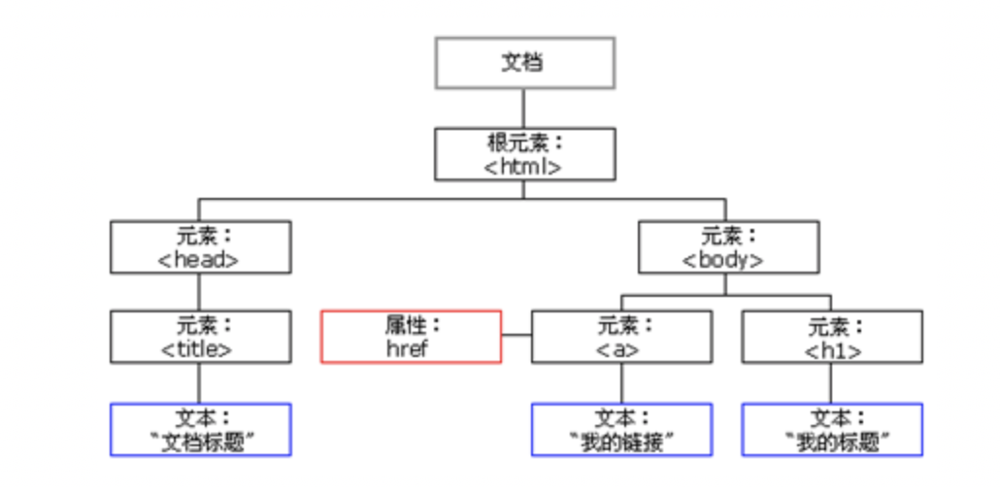
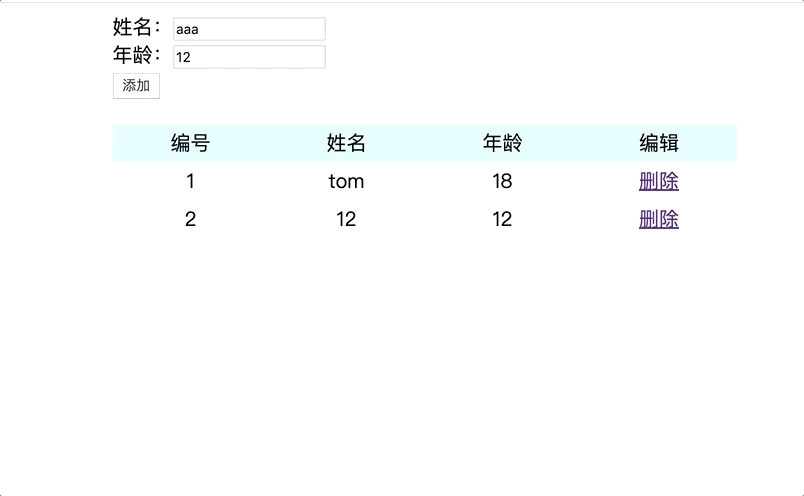

# 网页特效2

## 表格隔行变色

```html
<!DOCTYPE html>
<html lang="en">

<head>
    <meta charset="UTF-8">
    <meta name="viewport" content="width=device-width, initial-scale=1.0">
    <meta http-equiv="X-UA-Compatible" content="ie=edge">
    <title>Document</title>
    <style>
        table {
            margin: 0 auto;
            width: 500px;
            border-collapse: collapse;
            text-align: center;
        }
        thead {
            background-color: lightcyan;
        }
    </style>
</head>

<body>
    <table>
        <thead>
            <tr>
                <td>编号</td>
                <td>姓名</td>
                <td>性别</td>
                <td>年龄</td>
            </tr>
        </thead>
        <tbody>
            <tr>
                <td>1</td>
                <td>tom</td>
                <td>男</td>
                <td>18</td>
            </tr>
            <tr>
                <td>1</td>
                <td>tom</td>
                <td>男</td>
                <td>18</td>
            </tr>
            <tr>
                <td>1</td>
                <td>tom</td>
                <td>男</td>
                <td>18</td>
            </tr>
            <tr>
                <td>1</td>
                <td>tom</td>
                <td>男</td>
                <td>18</td>
            </tr>
        </tbody>
    </table>

    <script>
    
    </script>
</body>

</html>
```

```js
    var trs = document.querySelector('tbody').querySelectorAll('tr')
        for (var i = 0; i < trs.length; i++) {
            trs[i].onmouseover = function () {
                this.style.backgroundColor = "pink"
            }
            trs[i].onmouseout = function () {
                this.style.backgroundColor = ""
            }
        }
```


## 全选反选

```html
<!DOCTYPE html>
<html lang="en">

<head>
    <meta charset="UTF-8">
    <meta name="viewport" content="width=device-width, initial-scale=1.0">
    <meta http-equiv="X-UA-Compatible" content="ie=edge">
    <title>Document</title>
    <style>
        table {
            margin: 0 auto;
            width: 500px;
            border-collapse: collapse;
            text-align: center;
        }

        thead {
            background-color: lightcyan;
        }
    </style>
</head>

<body>
    <table>
        <thead>
            <tr>
                <td><input type="checkbox"></td>
                <td>编号</td>
                <td>姓名</td>
                <td>性别</td>
                <td>年龄</td>
            </tr>
        </thead>
        <tbody>
            <tr>
                <td><input type="checkbox"></td>
                <td>1</td>
                <td>tom</td>
                <td>男</td>
                <td>18</td>
            </tr>
            <tr>
                <td><input type="checkbox"></td>
                <td>1</td>
                <td>tom</td>
                <td>男</td>
                <td>18</td>
            </tr>
            <tr>
                <td><input type="checkbox"></td>
                <td>1</td>
                <td>tom</td>
                <td>男</td>
                <td>18</td>
            </tr>
            <tr>
                <td><input type="checkbox"></td>
                <td>1</td>
                <td>tom</td>
                <td>男</td>
                <td>18</td>
            </tr>
        </tbody>
    </table>

    <script>
       
    </script>
</body>

</html>
```

```js


        // 全选
        var checkAll = document.querySelector('thead').querySelector('input')
        var checkboxs = document.querySelector('tbody').querySelectorAll('input')
        checkAll.onclick = function () {
            // 选中是true 否则false
            // console.log(this.checked);
            for (var i = 0; i < checkboxs.length; i++) {
                checkboxs[i].checked = this.checked
            }
        }
        for (var i = 0; i < checkboxs.length; i++) {
            checkboxs[i].onclick = function () {
                var flag = true
                for (var i = 0; i < checkboxs.length; i++) {
                    // 有一个未选中，就让全选未选中，并且跳出循环，提高效率
                    if (!checkboxs[i].checked) {
                        flag = false
                        break
                    }
                }
                checkAll.checked = flag
            }
        }
```


## 自定义属性操作

获取元素的属性值

```html
<!DOCTYPE html>
<html lang="en">
<head>
    <meta charset="UTF-8">
    <meta name="viewport" content="width=device-width, initial-scale=1.0">
    <meta http-equiv="X-UA-Compatible" content="ie=edge">
    <title>Document</title>
</head>
<body>
    <div id="aa" index="100"></div>
    <script>
        var div = document.querySelector('div')
        console.log(div.id);//aa
        console.log(div.index);//undefined
    </script>
</body>
</html>
```

获取自定义的属性

- element.getAttribute('属性')

```html
<!DOCTYPE html>
<html lang="en">
<head>
    <meta charset="UTF-8">
    <meta name="viewport" content="width=device-width, initial-scale=1.0">
    <meta http-equiv="X-UA-Compatible" content="ie=edge">
    <title>Document</title>
</head>
<body>
    <div id="aa" index="100"></div>
    <script>
        var div = document.querySelector('div')
        console.log(div.id);//aa
        console.log(div.index);//undefined
        console.log(div.getAttribute('index'));
        console.log(div.getAttribute('id'));
        div.setAttribute('name','tom')
        console.log(div.getAttribute('name'));
    </script>
</body>
</html>
```

## tab栏切换

```html
<!DOCTYPE html>
<html lang="en">

<head>
    <meta charset="UTF-8">
    <meta name="viewport" content="width=device-width, initial-scale=1.0">
    <meta http-equiv="X-UA-Compatible" content="ie=edge">
    <title>Document</title>
    <style>
        * {
            margin: 0;
            padding: 0;
        }

        li {
            list-style-type: none;
        }

        .tab {
            width: 978px;
            margin: 100px auto;
        }

        .tab_list {
            height: 39px;
            border: 1px solid #ccc;
            background-color: #f1f1f1;
        }

        .tab_list li {
            float: left;
            height: 39px;
            line-height: 39px;
            padding: 0 20px;
            text-align: center;
            cursor: pointer;
        }

        .tab_list .current {
            background-color: #c81623;
            color: #fff;
        }

        .item_info {
            padding: 20px 0 0 20px;
        }

        .item {
            display: none;
        }
    </style>
</head>

<body>
    <div class="tab">
        <div class="tab_list">
            <ul>
                <li class="current">商品介绍</li>
                <li>规格与包装</li>
                <li>售后保障</li>
                <li>商品评价（50000）</li>
                <li>手机社区</li>
            </ul>
        </div>
        <div class="tab_con">
            <div class="item" style="display: block;">
                商品介绍模块内容
            </div>
            <div class="item">
                规格与包装模块内容
            </div>
            <div class="item">
                售后保障模块内容
            </div>
            <div class="item">
                商品评价（50000）模块内容
            </div>
            <div class="item">
                手机社区模块内容
            </div>

        </div>
    </div>

    <script>
      
    </script>
</body>

</html>
```

```js
  var lis = document.querySelectorAll('li');
        var items = document.querySelectorAll('.item');
        // for循环绑定点击事件
        for (var i = 0; i < lis.length; i++) {
            // 开始给5个小li 设置索引号 
            lis[i].setAttribute('index', i);
            lis[i].onclick = function () {
                // 1. 上的模块选项卡，点击某一个，当前这一个底色会是红色，其余不变（排他思想） 修改类名的方式

                // 干掉所有人 其余的li清除 class 这个类
                for (var i = 0; i < lis.length; i++) {
                    lis[i].className = '';
                }
                // 留下我自己 
                this.className = 'current';
                // 2. 下面的显示内容模块
                // 干掉所有人 让其余的item 这些div 隐藏
                for (var i = 0; i < items.length; i++) {
                    items[i].style.display = 'none';
                }
                // 留下我自己 让对应的item 显示出来
                items[this.getAttribute('index')].style.display = "block"
            }
        }
```


## 节点操作

### 节点概述

​	网页中的所有内容都是节点（标签、属性、文本、注释等），在DOM 中，节点使用 node 来表示。

​	HTML DOM 树中的所有节点均可通过 JavaScript 进行访问，所有 HTML 元素（节点）均可被修改，也可以创建或删除。



### 节点层级

​	利用 DOM 树可以把节点划分为不同的层级关系，常见的是**父子兄层级关系**。

```html
<!DOCTYPE html>
<html lang="en">
<head>
    <meta charset="UTF-8">
    <meta name="viewport" content="width=device-width, initial-scale=1.0">
    <meta http-equiv="X-UA-Compatible" content="ie=edge">
    <title>Document</title>
</head>
<body>
    <div class="demo">
        <div class="box">
            <span class="erweima">×</span>
        </div>
    </div>
    <script>
        // 1. 父节点 parentNode
        var erweima = document.querySelector('.erweima');
        var box = document.querySelector('.box');
        var demo = document.querySelector('.demo');
        // 得到的是离元素最近的父级节点(亲爸爸) 如果找不到父节点就返回为 null
        console.log(erweima.parentNode);
        console.log(box.parentNode);
        console.log(demo.parentNode.parentNode.parentNode.parentNode);
    </script>
</body>
</html>
```
### 子节点

```html
<!DOCTYPE html>
<html lang="en">
<head>
    <meta charset="UTF-8">
    <meta name="viewport" content="width=device-width, initial-scale=1.0">
    <meta http-equiv="X-UA-Compatible" content="ie=edge">
    <title>Document</title>
</head>
<body>
    <ul>
        <li>我是li</li>
        <li>我是li</li>
        <li>我是li</li>
        <li>我是li</li>
    </ul>
    <script>
        var ul = document.querySelector('ul');
        var lis = ul.querySelectorAll('li');
        console.log(ul.children);
        console.log(lis.children);
        console.log(ul.children[0]);
    </script>
</body>
</html>
```
### 案例：新浪下拉菜单

```html
<!DOCTYPE html>
<html lang="en">

<head>
    <meta charset="UTF-8">
    <meta name="viewport" content="width=device-width, initial-scale=1.0">
    <meta http-equiv="X-UA-Compatible" content="ie=edge">
    <title>Document</title>
    <style>
        * {
            margin: 0;
            padding: 0;
        }
        
        li {
            list-style-type: none;
        }
        
        a {
            text-decoration: none;
            font-size: 14px;
        }
        
        .nav {
            margin: 100px;
        }
        
        .nav li {
            position: relative;
            float: left;
            width: 80px;
            height: 41px;
            text-align: center;
        }
        
        .nav>li a {
            display: block;
            width: 100%;
            height: 100%;
            line-height: 41px;
            color: #333;
        }
        .nav>li>a:hover {
            background-color: #eee;
        }
        
        .nav ul {
            display: none;
            position: absolute;
            top: 41px;
            left: 0;
            width: 100%;
            border-left: 1px solid #FECC5B;
            border-right: 1px solid #FECC5B;
        }
        
        .nav ul li {
            border-bottom: 1px solid #FECC5B;
        }
        
        .nav ul li a:hover {
            background-color: #FFF5DA;
        }
        
    </style>
</head>

<body>
    <ul class="nav">
        <li>
            <a href="#">微博</a>
            <ul>
                <li>
                    <a href="">私信1</a>
                </li>
                <li>
                    <a href="">评论</a>
                </li>
                <li>
                    <a href="">@我</a>
                </li>
            </ul>
        </li>
        <li>
            <a href="#">微博</a>
            <ul>
                <li>
                    <a href="">私信2</a>
                </li>
                <li>
                    <a href="">评论</a>
                </li>
                <li>
                    <a href="">@我</a>
                </li>
            </ul>
        </li>
        <li>
            <a href="#">微博</a>
            <ul>
                <li>
                    <a href="">私信</a>
                </li>
                <li>
                    <a href="">评论</a>
                </li>
                <li>
                    <a href="">@我</a>
                </li>
            </ul>
        </li>
        <li>
            <a href="#">微博</a>
            <ul>
                <li>
                    <a href="">私信</a>
                </li>
                <li>
                    <a href="">评论</a>
                </li>
                <li>
                    <a href="">@我</a>
                </li>
            </ul>
        </li>
    </ul>
    <script>
       
    </script>
</body>

</html>
```

```js
 // 1. 获取元素
        var nav = document.querySelector('.nav');
        var lis = nav.children; // 得到4个小li
        // 2.循环注册事件
        for (var i = 0; i < lis.length; i++) {
            lis[i].onmouseover = function() {
                this.children[1].style.display = 'block';
            }
            lis[i].onmouseout = function() {
                this.children[1].style.display = 'none';
            }
        }
```


### 创建节点\添加节点

```html
<!DOCTYPE html>
<html lang="en">

<head>
    <meta charset="UTF-8">
    <meta name="viewport" content="width=device-width, initial-scale=1.0">
    <meta http-equiv="X-UA-Compatible" content="ie=edge">
    <title>Document</title>
</head>

<body>
    <ul>
        <li>123</li>
    </ul>
    <script>
        // 1. 创建节点元素节点
        var li1= document.createElement('li');
        // 2. 添加节点 node.appendChild(child)  node 父级  child 是子级 后面追加元素
        var ul = document.querySelector('ul');
        ul.appendChild(li1);
        var li2= document.createElement('li');
        li2.innerHTML= "<h1>我是创建的第二个li</h1>"
        ul.appendChild(li2)
        // 3. 添加节点 node.insertBefore(child, 指定元素);
        var li3 = document.createElement('li');
        li3.innerHTML= "<h1>我是创建的第3个li</h1>"
        ul.insertBefore(li3, ul.children[1]);
    </script>
</body>

</html>
```

### 案例：简单版发布留言

```html
<!DOCTYPE html>
<html lang="en">

<head>
    <meta charset="UTF-8">
    <meta name="viewport" content="width=device-width, initial-scale=1.0">
    <meta http-equiv="X-UA-Compatible" content="ie=edge">
    <title>Document</title>
</head>

<body>
    <textarea name="" id=""></textarea>
    <button>发布</button>
    <ul>

    </ul>

    <script>
        var content = document.querySelector('textarea')
        var btn = document.querySelector('button')
        var ul = document.querySelector('ul')
        btn.onclick = function () {
            var li = document.createElement('li')
            li.innerText = content.value
            ul.insertBefore(li,ul.children[0])
            content.value = ''
        }
    </script>
</body>

</html>
```

node.removeChild() 方法从 node节点中删除一个子节点，返回删除的节点。

### 删除留言

```html
<!DOCTYPE html>
<html lang="en">

<head>
    <meta charset="UTF-8">
    <meta name="viewport" content="width=device-width, initial-scale=1.0">
    <meta http-equiv="X-UA-Compatible" content="ie=edge">
    <title>Document</title>
</head>

<body>
    <textarea name="" id=""></textarea>
    <button>发布</button>
    <ul>

    </ul>

    <script>
        var content = document.querySelector('textarea')
        var btn = document.querySelector('button')
        var ul = document.querySelector('ul')
        btn.onclick = function () {
            var li = document.createElement('li')
            li.innerHTML = content.value + "<a href='#'>删除</a>"
            ul.insertBefore(li, ul.children[0])
            content.value = ''
            var dels = document.querySelectorAll('a');
            for (var i = 0; i < dels.length; i++) {
                dels[i].onclick = function () {
                    // 删除ul下的子节点，需要找到对应的li，找到点击当前的a标签的父节点即可
                    ul.removeChild(this.parentNode)
                }
            }
        }
    </script>
</body>

</html>
```

## 作业

1. 在商品详情页面，添加tab栏切换功能
2. 继续改进之前下拉框效果
3. 完成用户列表增删功能



```html
<!DOCTYPE html>
<html lang="en">

<head>
    <meta charset="UTF-8">
    <meta name="viewport" content="width=device-width, initial-scale=1.0">
    <meta http-equiv="X-UA-Compatible" content="ie=edge">
    <title>Document</title>
    <style>
        table {
            margin: 0 auto;
            width: 500px;
            border-collapse: collapse;
            text-align: center;
        }

        thead {
            background-color: lightcyan;
        }

        tr {
            height: 30px;
        }

        div {
            width: 500px;
            margin: 0 auto;
            margin-bottom: 20px;
        }
    </style>
</head>

<body>
    <div>
        姓名：<input type="text" id="name">
        <br>
        年龄：<input type="text" id="age">
        <br>
        <button>添加</button>
    </div>
    <table>
        <thead>
            <tr>
                <td>编号</td>
                <td>姓名</td>
                <td>年龄</td>
                <td>编辑</td>
            </tr>
        </thead>
        <tbody>
            <tr>
                <td>1</td>
                <td>tom</td>
                <td>18</td>
                <td><a href="#">删除</a></td>
            </tr>
        </tbody>
    </table>

    <script>
        var trs = document.querySelector('tbody').querySelectorAll('tr')
        for (var i = 0; i < trs.length; i++) {
            trs[i].onmouseover = function () {
                this.style.backgroundColor = "pink"
            }
            trs[i].onmouseout = function () {
                this.style.backgroundColor = ""
            }
        }

        // 添加
        var btn = document.querySelector('button')
        var tbody = document.querySelector('tbody')
        var index = 2;
        btn.onclick = function () {
            var name = document.querySelector('#name')
            var age = document.querySelector('#age')
            var tr = document.createElement('tr')
            var code = document.createElement('td')
            code.innerText = index
            var n = document.createElement('td')
            n.innerText = name.value
            var a = document.createElement('td')
            a.innerText = age.value
            var del = document.createElement('td')
            del.innerHTML = "<a href='#'>删除</a>"
            tr.appendChild(code)
            tr.appendChild(n)
            tr.appendChild(a)
            tr.appendChild(del)
            tbody.appendChild(tr)
            index++
            // 删除
            var as = document.querySelectorAll('a')
            for(var i=0;i<as.length;i++){
                as[i].onclick = function () {
                    tbody.removeChild(this.parentNode.parentNode)
                    for(var i=0;i<tbody.children.length;i++){
                        tbody.children[i].children[0].innerText = i+1
                    }
                    index =  tbody.children.length+1
                }
            }
            name.value = ''
            age.value = ''
        }

    </script>
</body>

</html>
```

