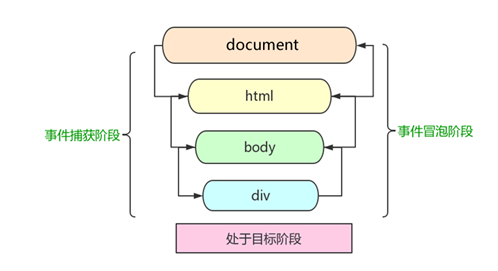

# 网页特效3

## 复制（克隆）节点

```html
<!DOCTYPE html>
<html lang="en">
<head>
    <meta charset="UTF-8">
    <meta name="viewport" content="width=device-width, initial-scale=1.0">
    <meta http-equiv="X-UA-Compatible" content="ie=edge">
    <title>Document</title>
</head>
<body>
    <ul>
        <li>1111</li>
        <li>2</li>
        <li>3</li>
    </ul>
    <script>
        var ul = document.querySelector('ul');
        // 1. node.cloneNode(); 括号为空或者里面是false 浅拷贝 只复制标签不复制里面的内容
        // 2. node.cloneNode(true); 括号为true 深拷贝 复制标签复制里面的内容
        var lili = ul.children[0].cloneNode(true);
        ul.appendChild(lili);
    </script>
</body>
</html>
```

## 事件监听

addEventListener()事件监听（IE9以后支持）

- 传统的注册事件，如果要同时绑定2个多个事件呢？

```html
<!DOCTYPE html>
<html lang="en">

<head>
    <meta charset="UTF-8">
    <meta name="viewport" content="width=device-width, initial-scale=1.0">
    <meta http-equiv="X-UA-Compatible" content="ie=edge">
    <title>Document</title>
</head>

<body>
    <button>传统注册事件</button>
    <script>
        var btns = document.querySelectorAll('button');
        btns[0].onclick = function () {
            alert('hi');
        }
        btns[0].onclick = function () {
            alert('hello');
        }
    </script>
</body>

</html>
```

- 发现相同事件，后面会覆盖前面的

```html
<!DOCTYPE html>
<html lang="en">

<head>
    <meta charset="UTF-8">
    <meta name="viewport" content="width=device-width, initial-scale=1.0">
    <meta http-equiv="X-UA-Compatible" content="ie=edge">
    <title>Document</title>
    <style>
        div{
            width: 200px;
            height: 200px;
            background-color: lightblue;
        }
    </style>
</head>

<body>
    <div>
        传统注册事件
    </div>
    <script>
        var div = document.querySelector('div');
        div.onclick = function () {
            alert('hi');
        }
        div.onmouseover = function () {
            div.style.backgroundColor = "red"
        }
    </script>
</body>

</html>
```

- 不同事件，会分别执行

### 为什么使用事件监听？

相同onclick事件，前面的会被覆盖，特别是当团队合作时，事件并行的需求增多，是不希望被覆盖的！

```html
<!DOCTYPE html>
<html lang="en">

<head>
    <meta charset="UTF-8">
    <meta name="viewport" content="width=device-width, initial-scale=1.0">
    <meta http-equiv="X-UA-Compatible" content="ie=edge">
    <title>Document</title>
    <style>
        div {
            width: 200px;
            height: 200px;
            background-color: lightblue;
        }
    </style>
</head>

<body>
    <div>
        注册事件
    </div>
    <script>
        var div = document.querySelector('div');
        // 事件侦听注册事件 addEventListener  ie9以前不支持
        // (1) 里面的事件类型是字符串 必定加引号 而且不带on
        // (2) 同一个元素 同一个事件可以添加多个侦听器（事件处理程序）
        div.addEventListener('click', function () {
            alert('hi');
        })
        div.addEventListener('mouseover', function () {
            div.style.backgroundColor = "red"
        })
         div.addEventListener('click', function () {
            alert('hi111');
        })
    </script>
</body>

</html>
```

ie9以前的版本写法，有on

```js
div.attachEvent('onclick', function () {
	alert(11);
})
```

## 事件监听兼容性解决方案

封装一个函数，函数中判断浏览器的类型：

- 判断一个对象里是否有该方法

```js
function Person(){
    this.sayHI = function(){
   	 console.log('hi');
	}
}

var person = new Person();
if(person.sayHI){
	console.log('有该方法');
}
```

- 封装函数

```js
<!DOCTYPE html>
<html lang="en">

<head>
    <meta charset="UTF-8">
    <meta name="viewport" content="width=device-width, initial-scale=1.0">
    <meta http-equiv="X-UA-Compatible" content="ie=edge">
    <title>Document</title>
    <style>
        div {
            width: 200px;
            height: 200px;
            background-color: lightblue;
        }
    </style>
</head>

<body>
    <div>
        注册事件
    </div>
    <script>
        var div = document.querySelector('div');
        //  事件源 div  事件类型click，事件处理函数 function
        div.addEventListener('click', function () {
            alert('hi111');
        })
        // 对比 
        // 封装一个函数,判断浏览器是否支持
        function addEventListener(element,type,fn){

        }
        // 任意参数，事件类型，事件处理函数
         addEventListener(div,click,function(){

        })

    

    </script>
</body>

</html>
```

```js
function addEventListener(element,type,fn){
    if(element.addEventListener){
        element.addEventListener(type,fn)
    }else if(element.attachEvent){
        element.attachEvent('on'+type,fn)
    }else{
        element['on'+type] = fn
    }
}
// 任意参数，事件类型，事件处理函数
addEventListener(div,'click',function(){
    console.log('hello');
})
```

## 删除事件（解绑事件）

- 传统事件删除

```html
<!DOCTYPE html>
<html lang="en">

<head>
    <meta charset="UTF-8">
    <meta name="viewport" content="width=device-width, initial-scale=1.0">
    <meta http-equiv="X-UA-Compatible" content="ie=edge">
    <title>Document</title>
    <style>
        div {
            width: 200px;
            height: 200px;
            background-color: lightblue;
        }
    </style>
</head>

<body>
    <div>
        传统事件删除
    </div>
    <script>
        var div = document.querySelector('div');
        div.onclick = function(){
            alert(123)
            div.onclick = null
        }
    </script>
</body>

</html>
```

- 删除事件监听

```js
<!DOCTYPE html>
<html lang="en">

<head>
    <meta charset="UTF-8">
    <meta name="viewport" content="width=device-width, initial-scale=1.0">
    <meta http-equiv="X-UA-Compatible" content="ie=edge">
    <title>Document</title>
    <style>
        div {
            width: 200px;
            height: 200px;
            background-color: lightblue;
        }
    </style>
</head>

<body>
    <div>
        删除事件监听
    </div>
    <script>
        var div = document.querySelector('div');
        div.addEventListener('click',function(){
            alert(123)
            div.removeEventListener('click',function(){
                alert(123)
                // 这种方式不行，function虽然是匿名函数，那也是两个不同的函数
                // 需要使用命名函数
            })
        })
    </script>
</body>

</html>
```
```html
<!DOCTYPE html>
<html lang="en">

<head>
    <meta charset="UTF-8">
    <meta name="viewport" content="width=device-width, initial-scale=1.0">
    <meta http-equiv="X-UA-Compatible" content="ie=edge">
    <title>Document</title>
    <style>
        div {
            width: 200px;
            height: 200px;
            background-color: lightblue;
        }
    </style>
</head>

<body>
    <div>
        删除事件监听
    </div>
    <script>
        var div = document.querySelector('div');
        div.addEventListener('click',fn)

        function fn(){
            alert(123)
            div.removeEventListener('click',fn)
        }
    </script>
</body>

</html>
```

### 删除事件兼容性解决方案

```js
function removeEventListener(element,type,fn){
    if(element.removeEventListener){
        element.removeEventListener(type,fn)
    }else if(element.detachEvent){
        element.detachEvent('on'+type,fn)
    }else{
        element['on'+type] = null
    }
}
// 任意参数，事件类型，事件处理函数
removeEventListener(div,'click',function(){
    console.log('hello');
})
```

```html
<!DOCTYPE html>
<html lang="en">

<head>
    <meta charset="UTF-8">
    <meta name="viewport" content="width=device-width, initial-scale=1.0">
    <meta http-equiv="X-UA-Compatible" content="ie=edge">
    <title>Document</title>
    <style>
        div {
            width: 200px;
            height: 200px;
            background-color: lightblue;
        }
    </style>
</head>

<body>
    <div>
        删除事件监听
    </div>
    <script>
        var div = document.querySelector('div');
        div.addEventListener('click', fn)

        function fn() {
            alert(123)
            removeEventListener(div,'click', fn)
        }

        function removeEventListener(element, type, fn) {
            if (element.removeEventListener) {
                element.removeEventListener(type, fn)
            } else if (element.detachEvent) {
                element.detachEvent('on' + type, fn)
            } else {
                element['on' + type] = null
            }
        }
    </script>
</body>

</html>
```

##  DOM事件流

> html中的标签都是相互嵌套的，我们可以将元素想象成一个盒子装一个盒子，document是最外面的大盒子。
> 当你单击一个div时，同时你也单击了div的父元素，甚至整个页面。
> 那么是先执行父元素的单击事件，还是先执行div的单击事件 ？？？
>
> 比如：我们给页面中的一个div注册了单击事件，当你单击了div时，也就单击了body，单击了html，单击了document。


### DOM 事件流会经历3个阶段： 

1. 捕获阶段
2. 当前目标阶段
3. 冒泡阶段 


​	我们向水里面扔一块石头，首先它会有一个下降的过程，这个过程就可以理解为从最顶层向事件发生的最具体元素（目标点）的捕获过程；之后会产生泡泡，会在最低点（ 最具体元素）之后漂浮到水面上，这个过程相当于事件冒泡。 




## 事件冒泡

```html
<!DOCTYPE html>
<html lang="en">

<head>
    <meta charset="UTF-8">
    <meta name="viewport" content="width=device-width, initial-scale=1.0">
    <meta http-equiv="X-UA-Compatible" content="ie=edge">
    <title>Document</title>
    <style>
        div {
            width: 200px;
            height: 200px;
            background-color: lightblue;
        }
    </style>
</head>

<body>
    <div class="father">
        <div class="son">son盒子</div>
    </div>
    <script>
        // onclick 和 attachEvent（ie） 在冒泡阶段触发
        // 冒泡阶段 如果addEventListener 第三个参数是 false 或者 省略 
        // son -> father ->body -> html -> document
        var son = document.querySelector('.son');
        // 给son注册单击事件
        son.addEventListener('click', function() {
            alert('son');
        }, false);
        // 给father注册单击事件
        var father = document.querySelector('.father');
        father.addEventListener('click', function() {
            alert('father');
        }, false);
        // 给document注册单击事件，省略第3个参数
        document.addEventListener('click', function() {
            alert('document');
        })
    </script>
</body>

</html>
```
## 事件捕获

```html
<!DOCTYPE html>
<html lang="en">

<head>
    <meta charset="UTF-8">
    <meta name="viewport" content="width=device-width, initial-scale=1.0">
    <meta http-equiv="X-UA-Compatible" content="ie=edge">
    <title>Document</title>
    <style>
        div {
            width: 200px;
            height: 200px;
            background-color: lightblue;
        }
    </style>
</head>

<body>
    <div class="father">
        <div class="son">son盒子</div>
    </div>
    <script>
        // 如果addEventListener() 第三个参数是 true 那么在捕获阶段触发
        // document -> html -> body -> father -> son
         var son = document.querySelector('.son');
		// 给son注册单击事件，第3个参数为true
         son.addEventListener('click', function() {
             alert('son');
         }, true);
         var father = document.querySelector('.father');
		// 给father注册单击事件，第3个参数为true
         father.addEventListener('click', function() {
             alert('father');
         }, true);
		// 给document注册单击事件，第3个参数为true
        document.addEventListener('click', function() {
            alert('document');
        }, true)
    </script>
</body>

</html>
```

## 事件对象

#### 什么是事件对象

事件发生后，跟事件相关的一系列信息数据的集合都放到这个对象里面，这个对象就是事件对象。

比如：  

1. 谁绑定了这个事件。
2. 鼠标触发事件的话，会得到鼠标的相关信息，如鼠标位置。
3. 键盘触发事件的话，会得到键盘的相关信息，如按了哪个键。

#### 事件对象的使用

事件触发发生时就会产生事件对象，并且系统会以实参的形式传给事件处理函数。

所以，在事件处理函数中声明1个形参用来接收事件对象。


```html
<!DOCTYPE html>
<html lang="en">

<head>
    <meta charset="UTF-8">
    <meta name="viewport" content="width=device-width, initial-scale=1.0">
    <meta http-equiv="X-UA-Compatible" content="ie=edge">
    <title>Document</title>
    <style>
        div {
            width: 200px;
            height: 200px;
            background-color: lightblue;
        }
    </style>
</head>

<body>
    <div class="father">
        <div class="son">son盒子</div>
    </div>
    <script>
        var son = document.querySelector('.son')
        son.onclick = function (e) {
            console.log(e);
        }
    </script>
</body>

</html>
```


## 事件对象的兼容性处理

事件对象本身的获取存在兼容问题：

1. 标准浏览器中是浏览器给方法传递的参数，只需要定义形参 e 就可以获取到。
2. 在 IE6~8 中，浏览器不会给方法传递参数，如果需要的话，需要到 window.event 中获取查找。

```html
<!DOCTYPE html>
<html lang="en">

<head>
    <meta charset="UTF-8">
    <meta name="viewport" content="width=device-width, initial-scale=1.0">
    <meta http-equiv="X-UA-Compatible" content="ie=edge">
    <title>Document</title>
    <style>
        div {
            width: 200px;
            height: 200px;
            background-color: lightblue;
        }
    </style>
</head>

<body>
    <div class="father">
        <div class="son">son盒子</div>
    </div>
    <script>
        var son = document.querySelector('.son')
        son.onclick = function (e) {
            //只要“||”前面为false, 不管“||”后面是true 还是 false，都返回 “||” 后面的值。
			//只要“||”前面为true, 不管“||”后面是true 还是 false，都返回 “||” 前面的值。
            //&& 符号在前面为假时就不会执行后面的语句了
            e = e || window.event
            console.log(e);
        }
    </script>
</body>

</html>
```

## 事件对象的属性和方法


#### e.target 和 this 的区别

- this 是事件绑定的元素（绑定这个事件处理函数的元素） 。
- e.target 是事件触发的元素。

> ```
> 通常情况下terget 和 this是一致的，
> 但有一种情况不同，那就是在事件冒泡时（父子元素有相同事件，单击子元素，父元素的事件处理函数也会被触发执行），
> 	这时候this指向的是父元素，因为它是绑定事件的元素对象，
> 	而target指向的是子元素，因为他是触发事件的那个具体元素对象。
> ```

事件冒泡下的e.target和this

```html
<!DOCTYPE html>
<html lang="en">

<head>
    <meta charset="UTF-8">
    <meta name="viewport" content="width=device-width, initial-scale=1.0">
    <meta http-equiv="X-UA-Compatible" content="ie=edge">
    <title>Document</title>
    <style>
        div {
            width: 200px;
            height: 200px;
            background-color: lightblue;
        }
    </style>
</head>

<body>
    <div class="father">
        <div class="son">son盒子</div>
    </div>
    <script>
        var son = document.querySelector('.son')
        son.onclick = function (e) {
            e = e || window.event
            // e.target 和 this指向的都是son
            console.log('son');
            
            console.log(e.target);
            console.log(this);
        }
        var father = document.querySelector('.father')
        father.onclick = function (e) {
            e = e || window.event
            // e.target指向的是son 和 this指向的是father
            console.log('father');
            
            console.log(e.target);
            console.log(this);
        }
    </script>
</body>

</html>
```

## 阻止默认行为

> html中一些标签有默认行为，例如a标签被单击后，默认会进行页面跳转。

```html
<!DOCTYPE html>
<html lang="en">

<head>
    <meta charset="UTF-8">
    <meta name="viewport" content="width=device-width, initial-scale=1.0">
    <meta http-equiv="X-UA-Compatible" content="ie=edge">
    <title>Document</title>
</head>

<body>
    <a href="http://www.baidu.com">百度</a>
    <script>
        // 1. 阻止默认行为 让链接不跳转 
        var a = document.querySelector('a');
        a.addEventListener('click', function (e) {
            e.preventDefault(); //  dom 标准写法
            // 低版本浏览器 ie678  returnValue  属性
            e.returnValue = false;

        });
        // 传统的注册方式
        a.onclick = function (e) {
            // 普通浏览器 e.preventDefault();  方法
            e.preventDefault();
            // 低版本浏览器 ie678  returnValue  属性
            e.returnValue = false;
            // 我们可以利用return false 也能阻止默认行为 没有兼容性问题
            return false;
        }

    </script>
</body>

</html>
```

## 阻止事件冒泡

事件冒泡本身的特性，会带来的坏处，也会带来的好处。

```html
<!DOCTYPE html>
<html lang="en">

<head>
    <meta charset="UTF-8">
    <meta name="viewport" content="width=device-width, initial-scale=1.0">
    <meta http-equiv="X-UA-Compatible" content="ie=edge">
    <title>Document</title>
    <style>
        .son {
            width: 200px;
            height: 200px;
            background-color: lightcyan;
        }
        .father{
            width: 300px;
            height: 300px;
            background-color: lightpink;
        }
    </style>
</head>

<body>
    <div class="father">
        <div class="son">son儿子</div>
    </div>
    <script>
        var son = document.querySelector('.son');
		// 给son注册单击事件
        son.addEventListener('click', function(e) {
            alert('son');
            e.stopPropagation(); // stop 停止  Propagation 传播 谷歌火狐支持
            window.event.cancelBubble = true; // 非标准 cancel 取消 bubble 泡泡 ie、谷歌支持  火狐不支持
        }, false);

        var father = document.querySelector('.father');
		// 给father注册单击事件
        father.addEventListener('click', function() {
            alert('father');
        }, false);
		// 给document注册单击事件
        document.addEventListener('click', function() {
            alert('document');
        })
    </script>
</body>

</html>
```

阻止事件冒泡的兼容性处理


## 事件委托

事件冒泡本身的特性，会带来的坏处，也会带来的好处。

#### 什么是事件委托

```
把事情委托给别人，代为处理。
```

事件委托也称为事件代理

> 说白了就是，不给子元素注册事件，给父元素注册事件，把处理代码在父元素的事件中执行。


**生活中的代理：**


**js事件中的代理：**


#### 事件委托的原理

​	给父元素注册事件，利用事件冒泡，当子元素的事件触发，会冒泡到父元素，然后去控制相应的子元素。

#### 事件委托的作用

- 我们只操作了一次 DOM ，提高了程序的性能。
- 动态新创建的子元素，也拥有事件。

#### 案例：点击li添加背景颜色

```html
<!DOCTYPE html>
<html lang="en">

<head>
    <meta charset="UTF-8">
    <meta name="viewport" content="width=device-width, initial-scale=1.0">
    <meta http-equiv="X-UA-Compatible" content="ie=edge">
    <title>Document</title>
</head>

<body>
    <ul>
        <li>知否知否，点我应有弹框在手！</li>
        <li>知否知否，点我应有弹框在手！</li>
        <li>知否知否，点我应有弹框在手！</li>
        <li>知否知否，点我应有弹框在手！</li>
        <li>知否知否，点我应有弹框在手！</li>
    </ul>
    <script>
        // 事件委托的核心原理：给父节点添加侦听器， 利用事件冒泡影响每一个子节点
        var ul = document.querySelector('ul');
        ul.addEventListener('click', function(e) {
            // e.target 这个可以得到我们点击的对象
            e.target.style.backgroundColor = 'pink';
        })
    </script>
</body>

</html>
```

# 作业

- 上课所有案例
- 动态创建列表


