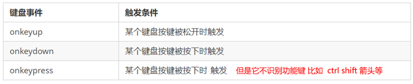

# 网页特效4

## 禁止选中文字和禁止右键菜单

```html
<!DOCTYPE html>
<html lang="en">
<head>
    <meta charset="UTF-8">
    <meta name="viewport" content="width=device-width, initial-scale=1.0">
    <meta http-equiv="X-UA-Compatible" content="ie=edge">
    <title>Document</title>
</head>
<body>
    我是一段不愿意分享的文字
    <script>
        // 禁止右键菜单
        document.addEventListener('contextmenu',function(e){
            e.preventDefault()
        })   
        // 禁止选中文字
        document.addEventListener('selectstart',function(e){
            e.preventDefault()
        })         
    </script>
</body>
</html>
```

## 	鼠标事件对象


### 获取鼠标在页面的坐标

```html
<!DOCTYPE html>
<html lang="en">

<head>
    <meta charset="UTF-8">
    <meta name="viewport" content="width=device-width, initial-scale=1.0">
    <meta http-equiv="X-UA-Compatible" content="ie=edge">
    <title>Document</title>
    <style>
        body {
            height: 3000px;
        }
    </style>
</head>

<body>
    <script>
        // 鼠标事件对象 MouseEvent
        document.addEventListener('click', function(e) {
            // 1. client 鼠标在可视区的x和y坐标
            console.log(e.clientX);//615
            console.log(e.clientY);//221
            console.log('---------------------');

            // 2. page 鼠标在页面文档的x和y坐标,document,滚动后结果就变了
            console.log(e.pageX);//615
            console.log(e.pageY);//221
            console.log('---------------------');

            // 3. screen 鼠标在电脑屏幕的x和y坐标
            console.log(e.screenX);//615
            console.log(e.screenY);//355

        })
    </script>
</body>

</html>
```

### 跟随鼠标的图片

```html
<!DOCTYPE html>
<html lang="en">

<head>
    <meta charset="UTF-8">
    <meta name="viewport" content="width=device-width, initial-scale=1.0">
    <meta http-equiv="X-UA-Compatible" content="ie=edge">
    <title>Document</title>
    <style>
        img {
            position: absolute;
            top: 2px;
        }
        body{
            height: 3000px;
        }
    </style>
</head>

<body>
    
    <script>
        var pic = document.querySelector('img');
        document.addEventListener('mousemove', function(e) {
            // 1. mousemove只要我们鼠标移动1px 就会触发这个事件
            // console.log(1);
            // 2.核心原理： 每次鼠标移动，我们都会获得最新的鼠标坐标， 把这个x和y坐标做为图片的top和left 值就可以移动图片
            var x = e.pageX;//如果是client就会出现问题
            var y = e.pageY;
            console.log('x坐标是' + x, 'y坐标是' + y);
            //3 . 千万不要忘记给left 和top 添加px 单位
            pic.style.left = x -40 + 'px';
            pic.style.top = y -40 + 'px';


        });
    </script>
</body>

</html>
```

## 常用的键盘事件

### 键盘事件




```js
    <script>
        // 常用的键盘事件
        //1. keyup 按键弹起的时候触发 
        document.addEventListener('keyup', function() {
            console.log('我弹起了');
        })

        //3. keypress 按键按下的时候触发  不能识别功能键 比如 ctrl shift 左右箭头啊
        document.addEventListener('keypress', function() {
                console.log('我按下了press');
        })
        //2. keydown 按键按下的时候触发  能识别功能键 比如 ctrl shift 左右箭头啊
        document.addEventListener('keydown', function() {
                console.log('我按下了down');
        })
        // 4. 三个事件的执行顺序  keydown -- keypress -- keyup
    </script>
```

### 使用keyCode属性判断用户按下哪个键

```html
<!DOCTYPE html>
<html lang="en">

<head>
    <meta charset="UTF-8">
    <meta name="viewport" content="width=device-width, initial-scale=1.0">
    <meta http-equiv="X-UA-Compatible" content="ie=edge">
    <title>Document</title>
  
</head>

<body>
    <script>
        // 常用的键盘事件
        //1. keyup 按键弹起的时候触发 
        document.addEventListener('keyup', function(e) {
            console.log(e.keyCode);
        })
    </script>
</body>

</html>
```

### 案例：快递单号放大镜

```html
<!DOCTYPE html>
<html lang="en">

<head>
    <meta charset="UTF-8">
    <meta name="viewport" content="width=device-width, initial-scale=1.0">
    <meta http-equiv="X-UA-Compatible" content="ie=edge">
    <title>Document</title>
    <style>
        * {
            margin: 0;
            padding: 0;
        }

        .search {
            position: relative;
            width: 178px;
            margin: 100px;
        }

        .con {
            display: none;
            position: absolute;
            top: -40px;
            width: 200px;
            border: 1px solid rgba(0, 0, 0, .2);
            box-shadow: 0 2px 4px rgba(0, 0, 0, .2);
            padding: 5px 5px;
            font-size: 18px;
            line-height: 20px;
            color: #333;
        }

        .con::before {
            content: '';
            /* width: 0;
            height: 0; */
            position: absolute;
            top: 28px;
            left: 18px;
            border: 8px solid #000;
            /* border-color: red greenyellow pink yellow ; */
            border-color: white transparent transparent;
        }
    </style>
</head>

<body>
    <div class="search">
        <div class="con"></div>
        <input type="text" placeholder="请输入您的快递单号">
    </div>
    <script>
        // 快递单号输入内容时， 上面的大号字体盒子（con）显示(这里面的字号更大）
        // 表单检测用户输入： 给表单添加键盘事件
        // 同时把快递单号里面的值（value）获取过来赋值给 con盒子（innerText）做为内容
        // 如果快递单号里面内容为空，则隐藏大号字体盒子(con)盒子
        var con = document.querySelector('.con');
        var input = document.querySelector('input');
        input.addEventListener('keyup', function () {
            // console.log('输入内容啦');
            if (this.value == '') {
                con.style.display = 'none';
            } else {
                con.style.display = 'block';
                con.innerText = this.value;
            }
        })
    </script>
</body>
```

##  什么是BOM

  	BOM（Browser Object Model）即浏览器对象模型，它提供了独立于内容而与浏览器窗口进行交互的对象，其核心对象是 window。

​	BOM 由一系列相关的对象构成，并且每个对象都提供了很多方法与属性。

​	BOM 缺乏标准，JavaScript 语法的标准化组织是 ECMA，DOM 的标准化组织是 W3C，BOM 最初是Netscape 浏览器标准的一部分。


BOM 比 DOM 更大，它包含 DOM。


## 顶级对象window


## window对象的常见事件

- ### 页面（窗口）加载事件（第一种）

window.onload 是窗口 (页面）加载事件，**当文档内容完全加载完成**会触发该事件(包括图像、脚本文件、CSS 文件等), 就调用的处理函数。


- 第二种

  - DOMContentLoaded 事件触发时，仅当DOM加载完成，不包括样式表，图片，flash等等。
  - IE9以上才支持！！！
  - 如果页面的图片很多的话, 从用户访问到onload触发可能需要较长的时间, 交互效果就不能实现，必然影响用户的体验，此时用 DOMContentLoaded 事件比较合适。

  ```js
      <script>
          window.addEventListener('load', function() {
              var btn = document.querySelector('button');
              btn.addEventListener('click', function() {
                  alert('点击我');
              })
          })
          window.addEventListener('load', function() {
              alert(22);
          })
  		//第二种
          document.addEventListener('DOMContentLoaded', function() {
              alert(33);
          })
      </script>
  ```

### 调整窗口大小事件

window.onresize 是调整窗口大小加载事件,  当触发时就调用的处理函数。

注意：

1. 只要窗口大小发生像素变化，就会触发这个事件。
2. 我们经常利用这个事件完成响应式布局。
3.  window.innerWidth 当前屏幕的宽度

```html
<!DOCTYPE html>
<html lang="en">

<head>
    <meta charset="UTF-8">
    <meta name="viewport" content="width=device-width, initial-scale=1.0">
    <meta http-equiv="X-UA-Compatible" content="ie=edge">
    <title>Document</title>
    <style>
        div{
            width: 200px;
            height: 200px;
            background-color: lightcyan;
        }
    </style>
</head>

<body>
    <script>
        // 注册页面加载事件
        window.addEventListener('load', function() {
            var div = document.querySelector('div');
        	// 注册调整窗口大小事件
            window.addEventListener('resize', function() {
                // window.innerWidth 获取窗口大小
                console.log('变化了');
                if (window.innerWidth <= 800) {
                    div.style.display = 'none';
                } else {
                    div.style.display = 'block';
                }
            })
        })
    </script>
    <div></div>
</body>
```

##  定时器（两种）

window 对象给我们提供了 2 个非常好用的方法-定时器。

- setTimeout() 
- setInterval()  

### 案例：3秒后关闭广告

```js
<body>
    
    <script>
        // 获取要操作的元素
        var ad = document.querySelector('.ad');
		// 开启定时器
        setTimeout(function() {
            ad.style.display = 'none';
        }, 3000);
    </script>
</body>
```

### 案例：拆弹

```html
<!DOCTYPE html>
<html lang="en">

<head>
    <meta charset="UTF-8">
    <meta name="viewport" content="width=device-width, initial-scale=1.0">
    <meta http-equiv="X-UA-Compatible" content="ie=edge">
    <title>Document</title>
</head>

<body>

        
        <button>拆除炸弹！</button>
        <script>
            var btn = document.querySelector('button');
            var img = document.querySelector('img');
            // 开启定时器
            var timer = setTimeout(function() {
                img.src = "/资料/boom.jpg"
            }, 3000);
            // 给按钮注册单击事件
            btn.addEventListener('click', function() {
                // 停止定时器
                clearTimeout(timer);
            })
        </script>

</body>
</html>
```

### setInterval() 闹钟定时器

##### 开启定时器

```js
    <script>
        // 1. setInterval 
        setInterval(function() {
            console.log('继续输出');
        }, 1000);
    </script>
```

### 案例：发送短信倒计时

```html
<!DOCTYPE html>
<html lang="en">

<head>
    <meta charset="UTF-8">
    <meta name="viewport" content="width=device-width, initial-scale=1.0">
    <meta http-equiv="X-UA-Compatible" content="ie=edge">
    <title>Document</title>
</head>

<body>

    手机号码： <input type="number"> <button>发送</button>
    <script>
        var btn = document.querySelector('button');
        // 全局变量，定义剩下的秒数
        var time = 2;
        // 注册单击事件
        btn.addEventListener('click', function () {
            // 禁用按钮
            btn.disabled = true;
            // 开启定时器
            var timer = setInterval(function () {
                // 判断剩余秒数
                if (time == 0) {
                    // 清除定时器和复原按钮
                    clearInterval(timer);
                    btn.disabled = false;
                    btn.innerHTML = '发送';
                } else {
                    btn.innerHTML = '还剩下' + time + '秒';
                    time--;
                }
            }, 1000);
        });
    </script>
</body>

</html>
```

## location对象


### 案例：3秒钟后自动跳转页面

```html
<!DOCTYPE html>
<html lang="en">

<head>
    <meta charset="UTF-8">
    <meta name="viewport" content="width=device-width, initial-scale=1.0">
    <meta http-equiv="X-UA-Compatible" content="ie=edge">
    <title>Document</title>
</head>

<body>

    <button>点击</button>
    <div></div>
    <script>
        var btn = document.querySelector('button');
        var div = document.querySelector('div');
        btn.addEventListener('click', function() {
            // console.log(location.href);
            location.href = 'http://www.baidu.com';
        })
        var timer = 3;
        setInterval(function() {
            if (timer == 0) {
                location.href = 'http://www.baidu.com';
            } else {
                div.innerHTML = '您将在' + timer + '秒钟之后跳转到首页';
                timer--;
            }
        }, 1000);
    </script>
</body>

</html>
```

### 案例：获取URL参数

https://www.baidu.com/s?username=tom

1.html

```html
<!DOCTYPE html>
<html lang="en">

<head>
    <meta charset="UTF-8">
    <meta name="viewport" content="width=device-width, initial-scale=1.0">
    <meta http-equiv="X-UA-Compatible" content="ie=edge">
    <title>Document</title>
</head>

<body>

   <form action="index.html" method="get">
       用户名<input type="text" name="usename" id="" value="">
       <input type="submit" value="提交">
   </form>
</body>

</html>
```

index.html

```html
<!DOCTYPE html>
<html lang="en">

<head>
    <meta charset="UTF-8">
    <meta name="viewport" content="width=device-width, initial-scale=1.0">
    <meta http-equiv="X-UA-Compatible" content="ie=edge">
    <title>Document</title>
</head>

<body>
    <script>
        console.log(location.search);
        var url = location.search
        var arr = url.substr(1).split('=')
        console.log(arr[1]);
    </script>
</body>

</html>
```

### location对象的常见方法


```js
    <button>点击</button>
    <script>
        var btn = document.querySelector('button');
        btn.addEventListener('click', function() {
            // 记录浏览历史，所以可以实现后退功能
            // location.assign('http://www.baidu.cn');
            // 不记录浏览历史，所以不可以实现后退功能
            // location.replace('http://www.baidu.cn');
            location.reload();
        })
    </script>
```

### history对象

​	window对象给我们提供了一个 history对象，与浏览器历史记录进行交互。该对象包含用户（在浏览器窗口中）访问过的URL。


#### 返回上一页

1.html

```html
<!DOCTYPE html>
<html lang="en">

<head>
    <meta charset="UTF-8">
    <meta name="viewport" content="width=device-width, initial-scale=1.0">
    <meta http-equiv="X-UA-Compatible" content="ie=edge">
    <title>Document</title>
</head>

<body>

   <form action="index.html" method="get">
       用户名<input type="text" name="usename" id="" value="">
       <input type="submit" value="提交">
   </form>
</body>

</html>
```

index.html

```html
<!DOCTYPE html>
<html lang="en">

<head>
    <meta charset="UTF-8">
    <meta name="viewport" content="width=device-width, initial-scale=1.0">
    <meta http-equiv="X-UA-Compatible" content="ie=edge">
    <title>Document</title>
</head>

<body>
    <button onclick="history.go(-1)">返回</button>
    <script>
    </script>
</body>

</html>
```

# 作业

- 在项目中添加秒杀功能


```js
    <div>
        <span class="hour">1</span>
        <span class="minute">2</span>
        <span class="second">3</span>
    </div>
    <script>
        // 1. 获取元素（时分秒盒子） 
        var hour = document.querySelector('.hour'); // 小时的黑色盒子
        var minute = document.querySelector('.minute'); // 分钟的黑色盒子
        var second = document.querySelector('.second'); // 秒数的黑色盒子
        var inputTime = +new Date('2020-5-5 18:00:00'); // 返回的是用户输入时间总的毫秒数

        countDown(); // 我们先调用一次这个函数，防止第一次刷新页面有空白 

        // 2. 开启定时器
        setInterval(countDown, 1000);
		
        function countDown() {
            var nowTime = new Date(); // 返回的是当前时间总的毫秒数
            var times = (inputTime - nowTime) / 1000; // times是剩余时间总的秒数 
            var h = parseInt(times / 60 / 60 % 24); //时
            h = h < 10 ? '0' + h : h;
            hour.innerHTML = h; // 把剩余的小时给 小时黑色盒子
            var m = parseInt(times / 60 % 60); // 分
            m = m < 10 ? '0' + m : m;
            minute.innerHTML = m;
            var s = parseInt(times % 60); // 当前的秒
            s = s < 10 ? '0' + s : s;
            second.innerHTML = s;
        }
    </script>
```

- 上课案例

