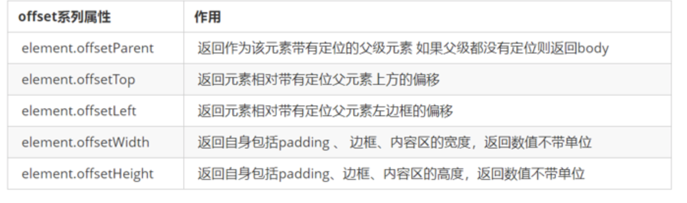
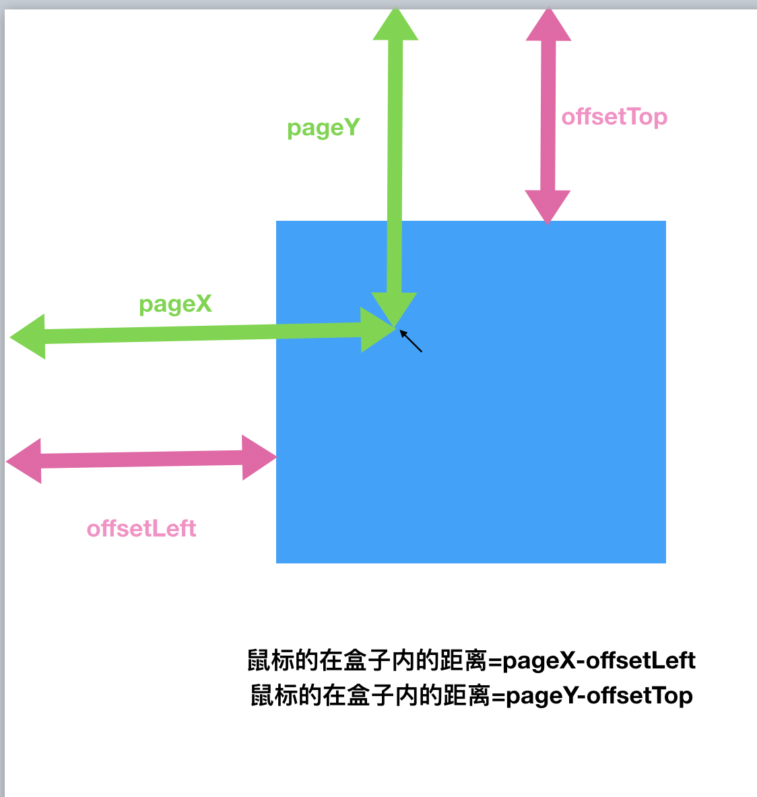
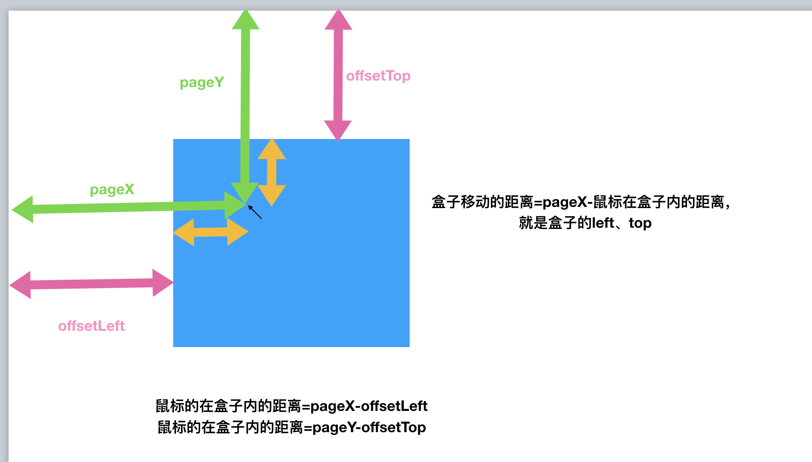
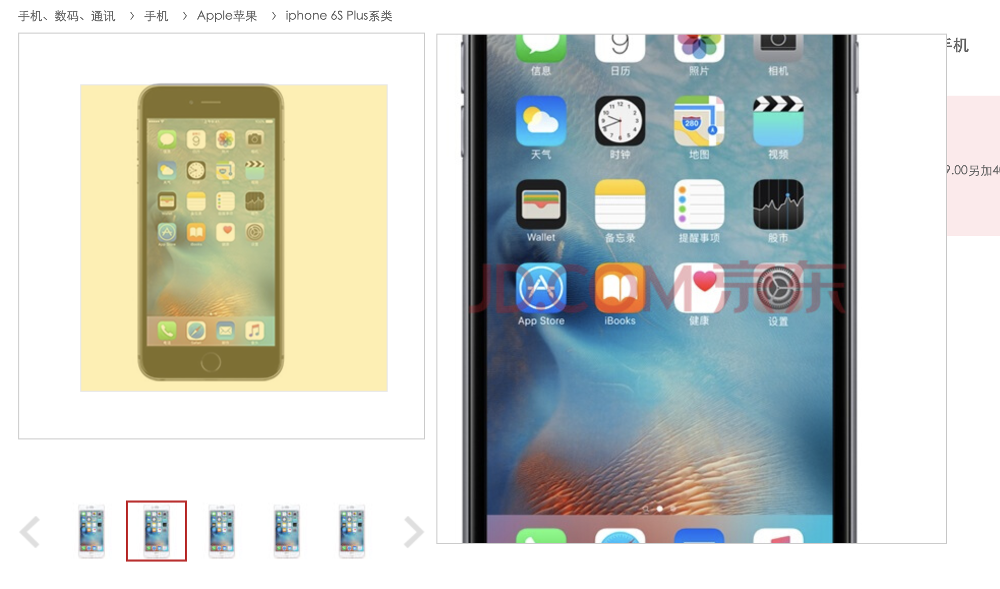
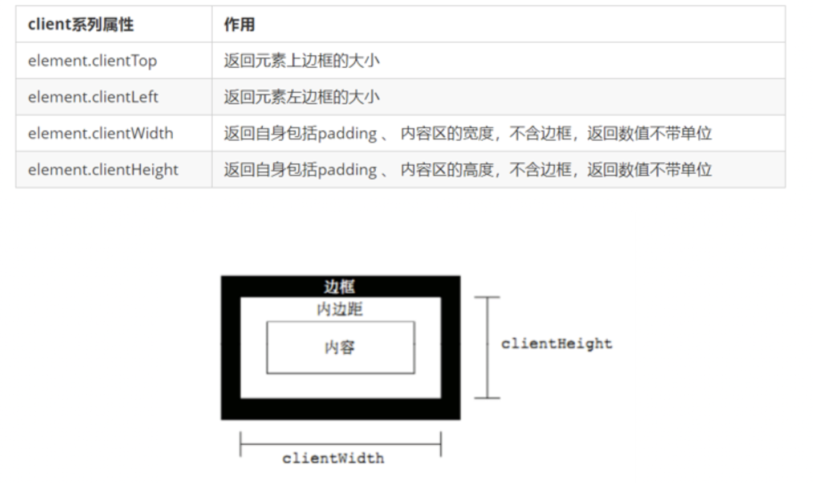
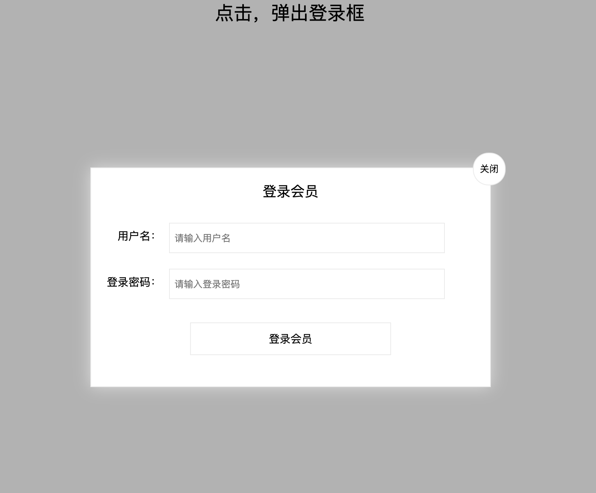

# 网页特效5

## 元素偏移量 offset 系列

### offset 概述 

offset 翻译过来就是偏移量，就是指绝对位置, 我们使用 offset系列相关属性可以动态的得到该元素的位置（偏移）、大小等。

1. 获得元素距离带有定位父元素的位置

2. 获得元素自身的大小（宽度高度）

3. 页面即使滚动依然是固定的

4. 注意：返回的数值都不带单位

   

```js
<!DOCTYPE html>
<html lang="en">

<head>
    <meta charset="UTF-8">
    <meta name="viewport" content="width=device-width, initial-scale=1.0">
    <meta http-equiv="X-UA-Compatible" content="ie=edge">
    <title>Document</title>
    <style>
        * {
            margin: 0;
            padding: 0;
        }
        
        .father {
            /* position: relative; */
            width: 200px;
            height: 200px;
            background-color: pink;
            margin: 150px;
        }
        
        .son {
            width: 100px;
            height: 100px;
            background-color: purple;
            margin-left: 45px;
        }
        
        .w {
            height: 200px;
            background-color: skyblue;
            margin: 0 auto 200px;
            padding: 10px;
            border: 15px solid red;
        }
    </style>
</head>

<body>
    <div class="father">
        <div class="son"></div>
    </div>
    <div class="w"></div>
    <script>
        // offset 系列
        var father = document.querySelector('.father');
        var son = document.querySelector('.son');
        // 1.可以得到元素的偏移 位置 返回的不带单位的数值  
        console.log(father.offsetTop);//150
        console.log(father.offsetLeft);//150
        // 它以带有定位的父亲为准  如果没有父亲或者父亲没有定位 则以 body 为准
        //position: relative;  ->45
        console.log(son.offsetLeft);//195
        var w = document.querySelector('.w');
        // 2.可以得到元素的大小 宽度和高度 是包含padding + border + width 
        console.log(w.offsetWidth);
        console.log(w.offsetHeight);
        // 3. 返回带有定位的父亲 否则返回的是body
        console.log(son.offsetParent); // 返回带有定位的父亲 否则返回的是body
        console.log(son.parentNode); // 返回父亲 是最近一级的父亲 亲爸爸 不管父亲有没有定位
    </script>
</body>

</html>
```


### offset 与 style 区别 

#### offset

- offset 可以得到任意样式表中的样式值

- offset 系列获得的数值是没有单位的

- offsetWidth 包含padding+border+width

- offsetWidth 等属性是只读属性，只能获取不能赋值

- > 所以，我们想要获取元素大小位置，用offset更合适

#### style

- style 只能得到行内样式表中的样式值

- style.width 获得的是带有单位的字符串

- style.width 获得不包含padding和border 的值

- style.width 是可读写属性，可以获取也可以赋值

- > 所以，我们想要给元素更改值，则需要用style改变

> **因为平时我们都是给元素注册触摸事件，所以重点记住 targetTocuhes**

### 案例：获取鼠标在盒子内的坐标

1. 我们在盒子内点击，想要得到鼠标距离盒子左右的距离。
2. 首先得到鼠标在页面中的坐标（e.pageX, e.pageY）
3. 其次得到盒子在页面中的距离 ( box.offsetLeft, box.offsetTop)
4. 用鼠标距离页面的坐标减去盒子在页面中的距离，得到 鼠标在盒子内的坐标
5. 如果想要移动一下鼠标，就要获取最新的坐标，使用鼠标移动



```html
<!DOCTYPE html>
<html lang="en">

<head>
    <meta charset="UTF-8">
    <meta name="viewport" content="width=device-width, initial-scale=1.0">
    <meta http-equiv="X-UA-Compatible" content="ie=edge">
    <title>Document</title>
    <style>
        .box {
            width: 300px;
            height: 300px;
            background-color: pink;
            margin: 200px;
        }
    </style>
</head>

<body>
    <div class="box"></div>
    <script>
        // 我们在盒子内点击， 想要得到鼠标距离盒子左右的距离。
        // 首先得到鼠标在页面中的坐标（ e.pageX, e.pageY）
        // 其次得到盒子在页面中的距离(box.offsetLeft, box.offsetTop)
        // 用鼠标距离页面的坐标减去盒子在页面中的距离， 得到 鼠标在盒子内的坐标
        var box = document.querySelector('.box');
        box.addEventListener('mousemove', function (e) {
            // console.log(e.pageX);
            // console.log(e.pageY);
            // console.log(box.offsetLeft);
            var x = e.pageX - this.offsetLeft;
            var y = e.pageY - this.offsetTop;
            this.innerHTML = 'x坐标是' + x + ' y坐标是' + y;
        })
    </script>
</body>

</html>
```

### 案例：模态框拖拽

弹出框，我们也称为模态框。

​	1.点击弹出层，会弹出模态框， 并且显示灰色半透明的遮挡层。

​	2.点击关闭按钮，可以关闭模态框，并且同时关闭灰色半透明遮挡层。

​	3.鼠标放到模态框上面，可以按住鼠标拖拽模态框在页面中移动。

​	4.鼠标松开，可以停止拖动模态框移动

### 

```html
<!DOCTYPE html>
<html lang="en">

<head>
    <meta charset="UTF-8">
    <meta name="viewport" content="width=device-width, initial-scale=1.0">
    <title>Document</title>
    <style>
        * {
            padding: 0;
            margin: 0;
        }

        .box {
            display: none;
            width: 200px;
            height: 200px;
            background-color: lightblue;
            position: absolute;
            z-index: 100;
          
        }

        .mask {
            display: none;
            position: absolute;
            width: 100%;
            height: 100%;
            background-color: rgba(0, 0, 0, 0.3);
            top: 0;
            left: 0;
        }

        span {
            margin-left: 180px;
        }
    </style>
</head>

<body>
    <button>弹出模态框</button>
    <div class="box">
        <span>x</span>
    </div>
    <div class="mask"></div>

    <script>
        // 点击按钮，显示遮挡层和模态框
        var btn = document.querySelector('button')
        var box = document.querySelector('.box')
        var mask = document.querySelector('.mask')
        var span = document.querySelector('span')
        btn.addEventListener('click', function () {
            box.style.display = "block"
            mask.style.display = "block"
        })
        span.addEventListener('click', function () {
            box.style.display = "none"
            mask.style.display = "none"
        })
        box.addEventListener('mousedown', function (e) {
            //当我们鼠标按下， 就获得鼠标在盒子内的坐标
            var x = e.pageX - this.offsetLeft;
            var y = e.pageY - this.offsetTop;
            console.log(x + "--" + y);
            // 鼠标移动的时候，把鼠标在页面中的坐标，减去 鼠标在盒子内的坐标就是模态框的left和top值
            document.addEventListener('mousemove', move)
            function move(e) {
                box.style.left = e.pageX - x + "px"
                box.style.top = e.pageY - y + "px"
            }
            // 鼠标弹起，就让鼠标移动事件移除
            document.addEventListener('mouseup', function() {
                document.removeEventListener('mousemove', move);
            })
        })

    </script>
</body>

</html>
```

### 案例：仿京东放大镜



1. 整个案例可以分为三个功能模块
2. 鼠标经过小图片盒子， 黄色的遮挡层 和 大图片盒子显示，离开隐藏2个盒子功能
3. 黄色的遮挡层跟随鼠标功能。 
4. 移动黄色遮挡层，大图片跟随移动功能。

#### 案例分析:

1. 黄色的遮挡层跟随鼠标功能。
2. 把鼠标坐标给遮挡层不合适。因为遮挡层坐标以父盒子为准。
3. 首先是获得鼠标在盒子的坐标。 
4. 之后把数值给遮挡层做为left 和top值。
5. 此时用到鼠标移动事件，但是还是在小图片盒子内移动。
6. 发现，遮挡层位置不对，需要再减去盒子自身高度和宽度的一半。
7. 遮挡层不能超出小图片盒子范围。
8. 如果小于零，就把坐标设置为0
9. 如果大于遮挡层最大的移动距离，就把坐标设置为最大的移动距离
10. 遮挡层的最大移动距离：小图片盒子宽度 减去 遮挡层盒子宽度

#### css部分

```html
<!DOCTYPE html>
<html lang="en">
<head>
    <meta charset="UTF-8">
    <meta name="viewport" content="width=device-width, initial-scale=1.0">
    <title>Document</title>
    <style>
        *{
            padding: 0;
            margin: 0;
        }
        .box{
           margin-top: 20px;
           margin-left: 20px;
           position: relative;
        }
        .small {
            width: 300px;
            height: 300px;
            border: 1px solid gray;
        }
        .small img {
            width: 300px;
            height: 300px;
        }
        .big {
         	width: 450px;
            height: 450px;
            position: absolute;
            left: 305px;
            top:0;
            border: 1px solid gray;
            display: none;
            overflow: hidden;
        }
        .big img {
            position: absolute;
            top:0;
            left:0;
        }
        .mask {
            position: absolute;
            cursor: move;
            width: 100px;
            height: 100px;
            background-color: rgba(255, 255, 0, 0.4);
            top:0;
            left:0;
            display: none;
        }
    </style>
</head>
<body>
    <div class="box">
        <div class="small">
            
            <div class="mask"></div>
        </div>
        <div class="big">
            
        </div>
    </div>
</body>
</html>
```

#### js部分

```html

<script>
    var small = document.querySelector('.small')
    var big = document.querySelector('.big')
    var mask = document.querySelector('.mask')
    var box = document.querySelector('.box')

    // 鼠标经过small，盒子显示
    small.addEventListener('mouseover', function () {
        big.style.display = "block"
        mask.style.display = "block"
    })
    small.addEventListener('mouseout', function () {
        big.style.display = "none"
        mask.style.display = "none"
    })
    // 黄色盒子跟随鼠标
    small.addEventListener('mousemove', function (e) {
        // 这里不能使用this，因为offset获取的他对于父亲定位的偏移量
        // 1、让黄盒子居中，需要减去自身的一半
        // var x = e.pageX - box.offsetLeft - mask.offsetWidth / 2
        // var y = e.pageY - box.offsetTop - mask.offsetHeight / 2
        var x = e.pageX - this.offsetParent.offsetLeft - mask.offsetWidth / 2
        var y = e.pageY - this.offsetParent.offsetTop - mask.offsetHeight / 2
        // console.log((x + '--' + y));
        // mask.style.left = x + "px"
        // mask.style.top = y + "px"
        //2、 黄色盒子会出界
        // x的范围在small宽度范围内  0-300
        // y  0-300

        if (x < 0) {
            x = 0
        } else if (x > small.offsetWidth - mask.offsetWidth) {//x>200 相当于 small.offsetWidth-mask.offsetWidth
            x = small.offsetWidth - mask.offsetWidth
        }
        if (y < 0) {
            y = 0
        } else if (y > small.offsetHeight - mask.offsetHeight) {
            y = small.offsetHeight - mask.offsetHeight
        }
        mask.style.left = x + "px"
        mask.style.top = y + "px"

        // 3 右边放大镜效果
        // 获取到大图片,因为是图片在动，需要在样式上添加定位
        var bigImg = big.children[0]
        // 小图移动， 大图成比例移动  
        // 小图350px  大图450px  比例=大图/小图  450/350
        // tom 吃1个包子 jerry 吃3个   比例 3/1 
        // 小盒子移动一像素 大盒子移动 1像素乘以(450/350)

        // 4、小盒子光标往下移动 大盒子图片往上去的 相反方向 所以是负值
        bigImg.style.left = - x * big.offsetWidth/small.offsetWidth +"px"
        bigImg.style.top = - y * big.offsetHeight/small.offsetHeight +"px"

    })

</script>
```


## 元素可视区 client 系列

### client概述

client 翻译过来就是客户端，我们使用 client 系列的相关属性来获取元素可视区的相关信息。通过 client
系列的相关属性可以动态的得到该元素的边框大小、元素大小等。




```html
<!DOCTYPE html>
<html lang="en">

<head>
    <meta charset="UTF-8">
    <meta name="viewport" content="width=device-width, initial-scale=1.0">
    <meta http-equiv="X-UA-Compatible" content="ie=edge">
    <title>Document</title>
    <style>
        div {
            width: 200px;
            height: 200px;
            background-color: pink;
            border: 10px solid red;
            padding: 10px;
            margin: 100px;
        }
    </style>
</head>

<body>
    <div></div>
    <script>
        // client 宽度 和我们offsetWidth 最大的区别就是 不包含边框
        var div = document.querySelector('div');
        console.log(div.clientWidth);//220
        console.log(div.clientTop);//10
        
    </script>
</body>

</html>
```


# 作业

1. 项目中添加放大镜效

2. 项目中添加模态框拖拽




### 

