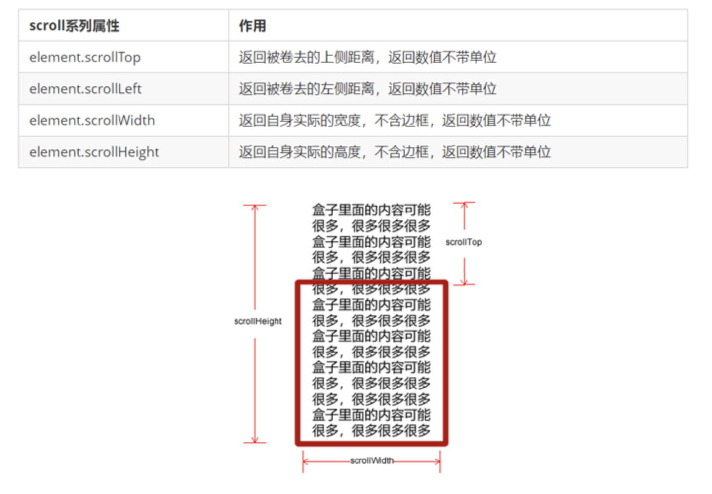
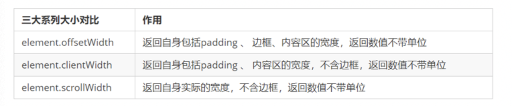
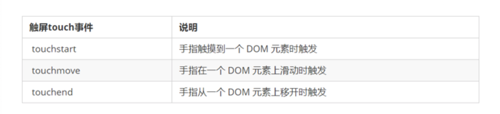
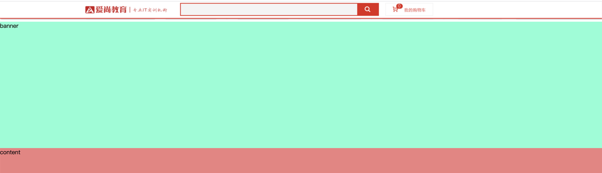

# 网页特效6

## 元素滚动 scroll 系列

### scroll 概述

scroll 翻译过来就是滚动的，我们使用 scroll 系列的相关属性可以动态的得到该元素的大小、滚动距离等。



### 元素被卷去的头部

如果浏览器的高（或宽）度不足以显示整个页面时，会自动出现滚动条。当滚动条向下滚动时，页面上面被隐藏掉的高度，我们就称为页面被卷去的头部。滚动条在滚动时会触发 onscroll事件。

```html
<!DOCTYPE html>
<html lang="en">

<head>
    <meta charset="UTF-8">
    <meta name="viewport" content="width=device-width, initial-scale=1.0">
    <meta http-equiv="X-UA-Compatible" content="ie=edge">
    <title>Document</title>
    <style>
        div {
            width: 200px;
            height: 200px;
            background-color: pink;
            border: 10px solid red;
            padding: 10px;
            /*  overflow: hidden;隐藏，不出滚动条 */
            overflow: auto;
        }
    </style>
</head>

<body>
    <div>
        我是内容 我是内容 我是内容 我是内容 我是内容 我是内容 我是内容 我是内容 我是内容 我是内容 我是内容 我是内容 我是内容 我是内容 我是内容 我是内容 我是内容 我是内容 我是内容 我是内容 我是内容 我是内容 我是内容 我是内容 我是内容 我是内容 我是内容 我是内容 我是内容 我是内容 我是内容 我是内容 我是内容 我是内容
    </div>
    <script>
        // scroll 系列
        var div = document.querySelector('div');
        console.log(div.scrollHeight);//328
        console.log(div.clientHeight);//220 不包含边框
        // scroll滚动事件当我们滚动条发生变化会触发的事件
        div.addEventListener('scroll', function() {
            console.log(div.scrollTop);//滚动的高度
        })
    </script>
</body>

</html>
```

## 屏幕滑动效果

window.scrollTo(x坐标,y坐标)

案例

```html
<html>

<head>
    <style>
        body{
            height: 5000px;
        }
    </style>
</head>

<body>

    <input type="button" onclick="scrollWindow()" value="Scroll" />
    <p>SCROLL SCROLL SCROLL SCROLL SCROLL SCROLL SCROLL SCROLL</p>
    <br />
    <br />
    <br />
    <br />
    <br />
    <br />
    <br />
    <br />
    <p>SCROLL SCROLL SCROLL SCROLL SCROLL SCROLL SCROLL SCROLL</p>
    <br />
    <br />
    <br />
    <br />
    <br />
    <br />
    <br />
    <br />
    <p>SCROLL SCROLL SCROLL SCROLL SCROLL SCROLL SCROLL SCROLL</p>
    <script type="text/javascript">
        function scrollWindow() {
            window.scrollTo(0, 1500)
        }
    </script>
</body>

</html>
```


- 结构样式

```html
<!DOCTYPE html>
<html lang="en">

<head>
    <meta charset="UTF-8">
    <meta name="viewport" content="width=device-width, initial-scale=1.0">
    <title>Document</title>
    <style>
        ul,
        ol {
            list-style-type: none;
        }

        * {
            margin: 0;
            padding: 0;
        }
        /* 页面全屏 */
        html, body {
            width: 100%;
            height: 100%;
        }

        #ul {
            width: 100%;
            height: 100%;
        }
        ul li{
            width: 100%;
            height: 100%;
            text-align: center;
        }
        #ol {
            position: fixed;
            top:50px;
            left:50px;
        }
        #ol li {
            width: 50px;
            height: 50px;
            border: 1px solid #000;
        }
    </style>
</head>

<body>
    <ul id="ul">
        <li>家用电器</li>
        <li>手机数码</li>
        <li>男装女装</li>
        <li>美食</li>
        <li>运动</li>
    </ul>
    <ol id="ol">
        <li>家用电器1</li>
        <li>手机数码</li>
        <li>男装女装</li>
        <li>美食</li>
        <li>运动</li>
    </ol>
</body>

</html>
```

- js添加背景色

```js
var ol = document.querySelector('#ol')
var ul = document.querySelector('#ul')
var olLis = ol.children
var ulLis = ul.children
var bgColor = ["pink","purple","orange","blue","green"];
for (var i = 0; i < ulLis.length; i++) {
    olLis[i].style.backgroundColor = bgColor[i]
    ulLis[i].style.backgroundColor = bgColor[i]
}
```

```js
<!DOCTYPE html>
<html lang="en">

<head>
    <meta charset="UTF-8">
    <meta name="viewport" content="width=device-width, initial-scale=1.0">
    <title>Document</title>
    <style>
        ul,
        ol {
            list-style-type: none;
        }

        * {
            margin: 0;
            padding: 0;
        }

        /* 页面全屏 */
        html,
        body {
            width: 100%;
            height: 100%;
        }

        #ul {
            width: 100%;
            height: 100%;
        }

        ul li {
            width: 100%;
            height: 100%;
            text-align: center;
        }

        #ol {
            position: fixed;
            top: 50px;
            left: 50px;
        }

        #ol li {
            width: 50px;
            height: 50px;
            border: 1px solid #000;
        }
    </style>
</head>

<body>
    <ul id="ul">
        <li>家用电器</li>
        <li>手机数码</li>
        <li>男装女装</li>
        <li>美食</li>
        <li>运动</li>
    </ul>
    <ol id="ol">
        <li>家用电器1</li>
        <li>手机数码</li>
        <li>男装女装</li>
        <li>美食</li>
        <li>运动</li>
    </ol>
</body>
<script>
    var ol = document.querySelector('#ol')
    var ul = document.querySelector('#ul')
    var olLis = ol.children
    var ulLis = ul.children
    var bgColor = ["pink", "purple", "orange", "blue", "green"];
    for (var i = 0; i < ulLis.length; i++) {
        olLis[i].style.backgroundColor = bgColor[i]
        ulLis[i].style.backgroundColor = bgColor[i]

        // 记录当前索引号
        olLis[i].index = i
        console.log(i);
        // console.log(olLis[i].index);
        olLis[i].addEventListener('click', function () {
            // 直接获取i，因为是循环，所以拿到的一值是5
            console.log(i);
            window.scrollTo(0, ulLis[this.index].offsetTop)
        })
    }
</script>

</html>
```

## 两侧广告跟随

- 结构布局

```html
<!DOCTYPE html>
<html lang="en">

<head>
    <meta charset="UTF-8">
    <meta name="viewport" content="width=device-width, initial-scale=1.0">
    <title>Document</title>
    <style>
        img {
            position: absolute;
            left: 0;
            top: 150px;
        }

        .box {
            width: 1000px;
            margin: 0 auto;
        }
    </style>
</head>

<body>
    
    <div class="box">
        <p>爱尚实训，做品质教育，用事实说话</p>
        <p>爱尚实训，做品质教育，用事实说话</p>
        <p>爱尚实训，做品质教育，用事实说话</p>
        <p>爱尚实训，做品质教育，用事实说话</p>
        <p>爱尚实训，做品质教育，用事实说话</p>
        <p>爱尚实训，做品质教育，用事实说话</p>
        <p>爱尚实训，做品质教育，用事实说话</p>
        <p>爱尚实训，做品质教育，用事实说话</p>
        <p>爱尚实训，做品质教育，用事实说话</p>
        <p>爱尚实训，做品质教育，用事实说话</p>
        <p>爱尚实训，做品质教育，用事实说话</p>
        <p>爱尚实训，做品质教育，用事实说话</p>
        <p>爱尚实训，做品质教育，用事实说话</p>
        <p>爱尚实训，做品质教育，用事实说话</p>
        <p>爱尚实训，做品质教育，用事实说话</p>
        <p>爱尚实训，做品质教育，用事实说话</p>
        <p>爱尚实训，做品质教育，用事实说话</p>
        <p>爱尚实训，做品质教育，用事实说话</p>
        <p>爱尚实训，做品质教育，用事实说话</p>
        <p>爱尚实训，做品质教育，用事实说话</p>
        <p>爱尚实训，做品质教育，用事实说话</p>
        <p>爱尚实训，做品质教育，用事实说话</p>
        <p>爱尚实训，做品质教育，用事实说话</p>
        <p>爱尚实训，做品质教育，用事实说话</p>
        <p>爱尚实训，做品质教育，用事实说话</p>
        <p>爱尚实训，做品质教育，用事实说话</p>
        <p>爱尚实训，做品质教育，用事实说话</p>
        <p>爱尚实训，做品质教育，用事实说话</p>
        <p>爱尚实训，做品质教育，用事实说话</p>
        <p>爱尚实训，做品质教育，用事实说话</p>
        <p>爱尚实训，做品质教育，用事实说话</p>
        <p>爱尚实训，做品质教育，用事实说话</p>
        <p>爱尚实训，做品质教育，用事实说话</p>
        <p>爱尚实训，做品质教育，用事实说话</p>
        <p>爱尚实训，做品质教育，用事实说话</p>
        <p>爱尚实训，做品质教育，用事实说话</p>
        <p>爱尚实训，做品质教育，用事实说话</p>
        <p>爱尚实训，做品质教育，用事实说话</p>
        <p>爱尚实训，做品质教育，用事实说话</p>
        <p>爱尚实训，做品质教育，用事实说话</p>
        <p>爱尚实训，做品质教育，用事实说话</p>
        <p>爱尚实训，做品质教育，用事实说话</p>
        <p>爱尚实训，做品质教育，用事实说话</p>
        <p>爱尚实训，做品质教育，用事实说话</p>
        <p>爱尚实训，做品质教育，用事实说话</p>
        <p>爱尚实训，做品质教育，用事实说话</p>
        <p>爱尚实训，做品质教育，用事实说话</p>
        <p>爱尚实训，做品质教育，用事实说话</p>
        <p>爱尚实训，做品质教育，用事实说话</p>
        <p>爱尚实训，做品质教育，用事实说话</p>
        <p>爱尚实训，做品质教育，用事实说话</p>
        <p>爱尚实训，做品质教育，用事实说话</p>
        <p>爱尚实训，做品质教育，用事实说话</p>
        <p>爱尚实训，做品质教育，用事实说话</p>
        <p>爱尚实训，做品质教育，用事实说话</p>
        <p>爱尚实训，做品质教育，用事实说话</p>
        <p>爱尚实训，做品质教育，用事实说话</p>
        <p>爱尚实训，做品质教育，用事实说话</p>
        <p>爱尚实训，做品质教育，用事实说话</p>
        <p>爱尚实训，做品质教育，用事实说话</p>
        <p>爱尚实训，做品质教育，用事实说话</p>
        <p>爱尚实训，做品质教育，用事实说话</p>
        <p>爱尚实训，做品质教育，用事实说话</p>
        <p>爱尚实训，做品质教育，用事实说话</p>
        <p>爱尚实训，做品质教育，用事实说话</p>
        <p>爱尚实训，做品质教育，用事实说话</p>
        <p>爱尚实训，做品质教育，用事实说话</p>
        <p>爱尚实训，做品质教育，用事实说话</p>
        <p>爱尚实训，做品质教育，用事实说话</p>
        <p>爱尚实训，做品质教育，用事实说话</p>
        <p>爱尚实训，做品质教育，用事实说话</p>
        <p>爱尚实训，做品质教育，用事实说话</p>
        <p>爱尚实训，做品质教育，用事实说话</p>
        <p>爱尚实训，做品质教育，用事实说话</p>
        <p>爱尚实训，做品质教育，用事实说话</p>
        <p>爱尚实训，做品质教育，用事实说话</p>
        <p>爱尚实训，做品质教育，用事实说话</p>
        <p>爱尚实训，做品质教育，用事实说话</p>
        <p>爱尚实训，做品质教育，用事实说话</p>
        <p>爱尚实训，做品质教育，用事实说话</p>
        <p>爱尚实训，做品质教育，用事实说话</p>
        <p>爱尚实训，做品质教育，用事实说话</p>
        <p>爱尚实训，做品质教育，用事实说话</p>
        <p>爱尚实训，做品质教育，用事实说话</p>
        <p>爱尚实训，做品质教育，用事实说话</p>
        <p>爱尚实训，做品质教育，用事实说话</p>
       

    </div>
</body>

</html>
```

### 页面被卷去的头部

#### window.pageYOffset

```js
    var box = document.querySelector('.box')
    var img = document.querySelector('img')
    var target = 0
    var imgOffsetTop = img.offsetTop
    document.onscroll = function () {
        // 此时滚动时，更改了top原来的值，也就更改了offsetTop
        // top=150 img.offsetTop=150 滚动20px top = 150+20  那么 img.offsetTop = 170
        // img.style.top = window.pageYOffset + img.offsetTop + "px"
        // console.log(img.style.top);
        // console.log(img.offsetTop);
        target = window.pageYOffset + imgOffsetTop;  
        img.style.top = target + "px"
    }
```

### 案例：返回顶部

1. 当滚动到banner区域的时候，
2. 当页面滚动到一定位置，侧边栏改为固定定位
3. 页面继续滚动，会让 返回顶部显示出来

#### 案例分析: 

1. 需要用到页面滚动事件 scroll  因为是页面滚动，所以事件源是document
2. 滚动到某个位置，就是判断页面被卷去的上部值。
3. 页面被卷去的头部：可以通过window.pageYOffset 获得  如果是被卷去的左侧window.pageXOffset
4. 注意，元素被卷去的头部是element.scrollTop  , 如果是页面被卷去的头部 则是 window.pageYOffset
5. 其实这个值 可以通过盒子的 offsetTop可以得到，如果大于等于这个值，就可以让盒子固定定位了

```html
<!DOCTYPE html>
<html lang="en">

<head>
    <meta charset="UTF-8">
    <meta name="viewport" content="width=device-width, initial-scale=1.0">
    <meta http-equiv="X-UA-Compatible" content="ie=edge">
    <title>Document</title>
    <style>
        .back {
            position: absolute;
            right: 10%;
            top: 300px;
            width: 35px;
            height: 50px;
            background-color: pink;
        }

        .w {
            width: 1200px;
            margin: 10px auto;
        }

        .header {
            height: 150px;
            background-color: purple;
        }

        .banner {
            height: 250px;
            background-color: skyblue;
        }

        .main {
            height: 1000px;
            background-color: yellowgreen;
        }

    </style>
</head>

<body>
    <div class="back">
        
    </div>
    <div class="header w">头部区域</div>
    <div class="banner w">banner区域</div>
    <div class="main w">主体部分</div>
    <script>
        var banner = document.querySelector('.banner')
        var back = document.querySelector('.back')
        // banner区域顶部距离170
        var bannerTop = banner.offsetTop
        // 返回区域顶部距离300
        console.log(back.offsetTop);
        // 返回距离banner顶部的距离 ,当变成固定定位的时候top值应该等于130
        var backTop = back.offsetTop-banner.offsetTop
        
        
        document.addEventListener('scroll', function () {
             // window.pageYOffset 页面被卷去的头部
            console.log('页面被卷去的头部'+window.pageYOffset);
            var top  = window.pageYOffset
            console.log(backTop);
            if(top >= bannerTop){
                // 定位之前获取当时火箭的位置
                back.style.position = "fixed"
                back.style.top = backTop +"px"
            }else{
                back.style.position = 'absolute';
                back.style.top = "300px"
            }

        })

        back.addEventListener('click',function(){
           // document.documentElement.scrollTop = 0
             window.scrollTo(0,0)
        })

    </script>
</body>

</html>
```

### 页面被卷去的头部兼容性解决方案

需要注意的是，页面被卷去的头部，有兼容性问题，因此被卷去的头部通常有如下几种写法：

1. 声明了 DTD，使用 document.documentElement.scrollTop
2. 未声明 DTD，使用  document.body.scrollTop
3. 新方法 window.pageYOffset和 window.pageXOffset，IE9 开始支持

```javascript
function getScroll() {
    return {
      left: window.pageXOffset || document.documentElement.scrollLeft || document.body.scrollLeft||0,
      top: window.pageYOffset || document.documentElement.scrollTop || document.body.scrollTop || 0
    };
 } 
使用的时候  getScroll().left
```


## 三大系列总结



他们主要用法：

1.offset系列 经常用于获得元素位置    offsetLeft  offsetTop

2.client经常用于获取元素大小  clientWidth clientHeight

3.scroll 经常用于获取滚动距离 scrollTop  scrollLeft  

4.注意页面滚动的距离通过 window.pageXOffset  获得

## mouseenter 和mouseover的区别

- 当鼠标移动到元素上时就会触发mouseenter 事件
- 类似 mouseover，它们两者之间的差别是
- mouseover 鼠标经过自身盒子会触发，经过子盒子还会触发。mouseenter  只会经过自身盒子触发
- 之所以这样，就是因为mouseenter不会冒泡
- 跟mouseenter搭配鼠标离开 mouseleave  同样不会冒泡

#### mouseover

```html
<!DOCTYPE html>
<html lang="en">
<head>
    <meta charset="UTF-8">
    <meta name="viewport" content="width=device-width, initial-scale=1.0">
    <title>Document</title>
    <style>
        .father{
            width: 200px;
            height: 200px;
            background-color: lightblue;
        }
        .son{
            width: 100px;
            height: 100px;
            background-color: lightcoral;
        }
    </style>
</head>
<body>
    <div class="father">
        <div class="son"></div>
    </div>

    <script>
        var father =document.querySelector('.father')
        var son =document.querySelector('.son')

        father.addEventListener('mouseover',function(){
            console.log('father');
            
        })
    </script>
</body>
</html>
```

#### mouseenter

```js
father.addEventListener('mouseenter',function(){
    console.log('father');
})
```

## 触屏事件

### 触屏事件概述 

移动端浏览器兼容性较好，我们不需要考虑以前 JS 的兼容性问题，可以放心的使用原生 JS 书写效果，但是移动端也有自己独特的地方。比如触屏事件 touch（也称触摸事件），Android和 IOS 都有。

touch 对象代表一个触摸点。触摸点可能是一根手指，也可能是一根触摸笔。触屏事件可响应用户手指（或触控笔）对屏幕或者触控板操作。

常见的触屏事件如下：



#### 案例

```html
<!DOCTYPE html>
<html lang="en">
<head>
    <meta charset="UTF-8">
    <meta name="viewport" content="width=device-width, initial-scale=1.0">
    <title>Document</title>
    <style>
        .father{
            width: 200px;
            height: 200px;
            background-color: lightblue;
        }
        .son{
            width: 100px;
            height: 100px;
            background-color: lightcoral;
        }
    </style>
</head>
<body>
    <div class="father">
        <div class="son"></div>
    </div>

    <script>
        var father =document.querySelector('.father')
        var son =document.querySelector('.son')
        // 按下时触发
        father.addEventListener('touchstart',function(){
            console.log('touchstart');
        })
        // 移动时触发
        father.addEventListener('touchmove',function(){
            console.log('touchmove');
        })
        // 抬起时触发
        father.addEventListener('touchend',function(){
            console.log('touchend');
        })
    </script>
</body>
</html>
```


# 作业

1. ### 固定导航栏



- 页面滚动时，导航栏隐藏
- 滚动到content的时候，导航栏显示并固定到上方

2. ### 项目中添加，电梯导航功能

3. ### 项目中添加两侧跟随广告，并且可以关闭

    

   