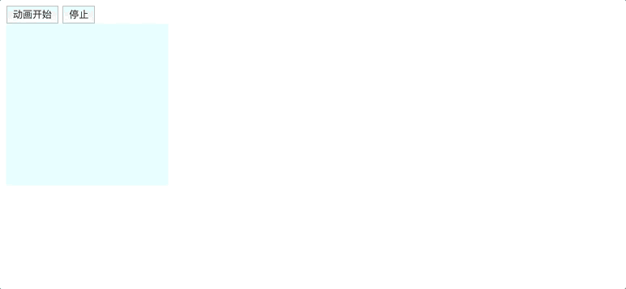

# 网页特效7

## 动画

### 动画实现原理 

> 核心原理：通过定时器 setInterval() 不断移动盒子位置。



实现步骤：

1. 获得盒子当前位置
2. 让盒子在当前位置加上1个移动距离
3. 利用定时器不断重复这个操作
4. 加一个结束定时器的条件
5. 注意此元素需要添加定位，才能使用element.style.left

```html
<!DOCTYPE html>
<html lang="en">

<head>
    <meta charset="UTF-8">
    <meta name="viewport" content="width=device-width, initial-scale=1.0">
    <title>Document</title>
    <style>
        div {
            width: 200px;
            height: 200px;
            background-color: lightcyan;
            position: relative;
            top: 0;
            left: 0;
        }
    </style>
</head>

<body>
    <button class="start">动画开始</button>
    <button class="end">停止</button>
    <div></div>
    <script>
        var div = document.querySelector('div')
        var start = document.querySelector('.start')
        var end = document.querySelector('.end')
        var timer
        start.addEventListener('click', function () {
            timer = setInterval(function () {
                move()
            }, 500)
        })
        function move() {
            div.style.left = div.offsetLeft + 10 + "px"
        }
        end.addEventListener('click', function () {
            clearInterval(timer)
        })
    </script>
</body>

</html>
```

### 动画函数封装

如果多个元素都使用这个动画函数，每次都要var 声明定时器。我们可以给不同的元素使用不同的定时器（自己专门用自己的定时器）。

> 核心原理：利用 JS 是一门动态语言，可以很方便的给当前对象添加属性。

```html
<!DOCTYPE html>
<html lang="en">

<head>
    <meta charset="UTF-8">
    <meta name="viewport" content="width=device-width, initial-scale=1.0">
    <title>Document</title>
    <style>
        div {
            width: 200px;
            height: 200px;
            background-color: lightcyan;
            position: relative;
            top: 0;
            left: 0;
        }
    </style>
</head>

<body>
    <button class="start">动画开始</button>
    <button class="end">停止</button>
    <div></div>
    <script>
        var div = document.querySelector('div')
        var start = document.querySelector('.start')
        var end = document.querySelector('.end')
        var timer
        start.addEventListener('click', function () {
            animate(div,500)
        })
        end.addEventListener('click', function () {
            clearInterval(div.timer)
        })


        function animate(obj, target) {
            clearInterval(obj.timer)
            obj.timer = setInterval(function () {
                if (obj.offsetLeft > target) {
                    clearInterval(obj.timer)
                }
                obj.style.left = obj.offsetLeft + target + "px"
            }, 500)
        }
    </script>
</body>

</html>
```

### 缓动效果原理  

缓动动画就是让元素运动速度有所变化，最常见的是让速度慢慢停下来

思路：

1. 让盒子每次移动的距离慢慢变小，速度就会慢慢落下来。
2. 核心算法： (目标值 - 现在的位置)   /  10    做为每次移动的距离步长 （800-0）/10  ->  (800-100)/10 ，步长从80到70
3. 停止的条件是： 让当前盒子位置等于目标位置就停止定时器  
4. 注意步长值需要取整  

### 动画函数多个目标值之间移动  

如果让动画从 0 移动到 800,那么步长是正值，如果从1000移动到800，是负值

当我们点击按钮时候，判断步长是正值还是负值，避免小数问题

​	1.如果是正值，则步长往大了取整

​	2.如果是负值，则步长 向小了取整

### 动画函数添加回调函数 

回调函数原理：函数可以作为一个参数。将这个函数作为参数传到另一个函数里面，当那个函数执行完之后，再执行传进去的这个函数，这个过程就叫做回调。

回调函数写的位置：定时器结束的位置。

```html
<!DOCTYPE html>
<html lang="en">

<head>
    <meta charset="UTF-8">
    <meta name="viewport" content="width=device-width, initial-scale=1.0">
    <title>Document</title>
</head>

<body>
    <script>
        function show() {
            console.log('show');
        }
        function fn(callback) {
            console.log(callback);
            callback()
        }
        fn(show)
    </script>
</body>

</html>
```

### 动画完整版代码:

```javascript
function animate(obj, target, callback) {
    // console.log(callback);  callback = function() {}  调用的时候 callback()

    // 先清除以前的定时器，只保留当前的一个定时器执行
    clearInterval(obj.timer);
    obj.timer = setInterval(function() {
        // 步长值写到定时器的里面
        // 把我们步长值改为整数 不要出现小数的问题
        // var step = Math.ceil((target - obj.offsetLeft) / 10);
        var step = (target - obj.offsetLeft) / 10;
        step = step > 0 ? Math.ceil(step) : Math.floor(step);
        if (obj.offsetLeft == target) {
            // 停止动画 本质是停止定时器
            clearInterval(obj.timer);
            // 回调函数写到定时器结束里面
            // if (callback) { =》 callback = function() {console.log(123)}   
            //     // 调用函数
            //     callback();
            // }
            //&& 符号在前面为假时就不会执行后面的语句了
            //判断有没有回调函数，有就调用
            callback && callback();
        }
        // 把每次加1 这个步长值改为一个慢慢变小的值  步长公式：(目标值 - 现在的位置) / 10
        obj.style.left = obj.offsetLeft + step + 'px';

    }, 15);
}
```

```html
<!DOCTYPE html>
<html lang="en">

<head>
    <meta charset="UTF-8">
    <meta name="viewport" content="width=device-width, initial-scale=1.0">
    <title>Document</title>
    <style>
        div {
            width: 200px;
            height: 200px;
            background-color: lightblue;
               /* 这里必须是absolute */
            position: absolute;
        }
    </style>
</head>
<body>
    <button>开始</button>
    <div></div>
    <script>
        var div = document.querySelector('div')
        var btn = document.querySelector('button')
        btn.addEventListener('click', function () {
            animate(div,400,function () {
                alert(123)
              })
        })
        function animate(obj, target, callback) {
            // console.log(callback);  callback = function() {}  调用的时候 callback()

            // 先清除以前的定时器，只保留当前的一个定时器执行
            clearInterval(obj.timer);
            obj.timer = setInterval(function () {
                // 步长值写到定时器的里面
                // 把我们步长值改为整数 不要出现小数的问题
                // var step = Math.ceil((target - obj.offsetLeft) / 10);
                var step = (target - obj.offsetLeft) / 10;
                step = step > 0 ? Math.ceil(step) : Math.floor(step);
                if (obj.offsetLeft == target) {
                    // 停止动画 本质是停止定时器
                    clearInterval(obj.timer);
                    // 回调函数写到定时器结束里面
                    // if (callback) { =》 callback = function() {console.log(123)}   
                    //     // 调用函数
                    //     callback();
                    // }
                    //&& 符号在前面为假时就不会执行后面的语句了
                    //判断有没有回调函数，有就调用
                    callback && callback();
                }
                // 把每次加1 这个步长值改为一个慢慢变小的值  步长公式：(目标值 - 现在的位置) / 10
                obj.style.left = obj.offsetLeft + step + 'px';
            }, 15);
        }


    </script>
</body>

</html>
```

### 网页轮播图

轮播图也称为焦点图，是网页中比较常见的网页特效。

功能需求：

​	1.鼠标经过轮播图模块，左右按钮显示，离开隐藏左右按钮。

​	2.点击右侧按钮一次，图片往左播放一张，以此类推，左侧按钮同理。

​	3.图片播放的同时，下面小圆圈模块跟随一起变化。

​	4.点击小圆圈，可以播放相应图片。

​	5.鼠标不经过轮播图，轮播图也会自动播放图片。

​	6.鼠标经过，轮播图模块， 自动播放停止。

#### 1、布局和css

```html
<!DOCTYPE html>
<html lang="en">

<head>
    <meta charset="UTF-8">
    <meta name="viewport" content="width=device-width, initial-scale=1.0">
    <title>Document</title>
    <style>
        * {
            padding: 0;
            margin: 0;
        }

        .box {
            width: 721px;
            height: 455px;
            border: 1px solid gray;
            padding: 5px;
            margin: 100px auto;
        }

        .inner {
            width: 721px;
            height: 455px;
            position: relative;
            background-color: pink;
            /* overflow: hidden; */
        }

        ul {
            width: 500%;
            position: absolute;
            top: 0;
            left: 0;
        }

        li {
            list-style: none;
            float: left;
        }

        .square {
            width: 600px;
            height: 20px;
            position: absolute;
            bottom: 20px;
            left: 10%;
            border-radius: 10px;
        }

        .square div {
            width: 20px;
            height: 20px;
            background-color: white;
            bottom: 20px;
            left: 10%;
            border-radius: 10px;
            float: left;
            margin: 0 5px;
            cursor: pointer;
        }

        .square .current {
            background-color: red;
        }

        .left {
            position: absolute;
            width: 32px;
            height: 42px;
            top:50%;
            margin-top: -21px;
            left: 10px;
        }
        .right {
            position: absolute;
            width: 22px;
            height: 32px;
            top:50%;
            margin-top: -11px;
            right: 10px;
        }

    </style>
</head>

<body>
    <div class="box">
        <div class="inner">
            <ul>
                <li><a href="#"></a></li>
                <li><a href="#"></a></li>
                <li><a href="#"></a></li>
                <li><a href="#"></a></li>
            </ul>
            <!-- 圆点 -->
            <div class="square">
                <div></div>
                <div></div>
                <div></div>
                <div></div>
            </div>
            <!-- 箭头 -->
            <div class="left">
                <a href="#"></a>
            </div>
            <div class="right">
                <a href="#"></a>
            </div>
        </div>
    </div>
</body>

</html>
```

#### 2、点击圆点切换图片

```js
// 点击圆点切换图片
    var squares = document.querySelector('.square').querySelectorAll('div')
    var ul = document.querySelector('ul')
    var inner = document.querySelector('.inner')
    for (var i = 0; i < squares.length; i++) {
        squares[i].setAttribute('index',i)
        squares[i].addEventListener('mouseover', function () {
            // 排他思想，干掉其他圆点的样式
            for (var i = 0; i < squares.length; i++) {
                squares[i].className = ''
            }
            this.className = 'current'
            var index = this.getAttribute('index')
            animate(ul,-index*inner.offsetWidth,null)
        })
    }
```

#### 3、左右焦点点击切换图片

```js
// 左右焦点点击切换图片
    var left = document.querySelector('.left')
    var right = document.querySelector('.right')
    var num = 0
    left.addEventListener('click',function(){
        num++
        animate(ul,-num*inner.offsetWidth,null)
       
    })
    right.addEventListener('click',function(){
        num--
        animate(ul,-num*inner.offsetWidth,null)
    })
```

#### 4、圆点跟左右焦点点击时同步

- 设置全局变量index，圆点的索引和点击左右共用一个
- 获取圆点元素square

```js
// 点击圆点切换图片
    var squares = document.querySelector('.square').querySelectorAll('div')
    var ul = document.querySelector('ul')
    var inner = document.querySelector('.inner')
    // 全局变量，圆点和焦点绑定
    var index = 0
    for (var i = 0; i < squares.length; i++) {
        squares[i].setAttribute('index', i)
        squares[i].addEventListener('mouseover', function () {
            // 排他思想，干掉其他圆点的样式
            for (var i = 0; i < squares.length; i++) {
                squares[i].className = ''
            }
            this.className = 'current'
            index = this.getAttribute('index')
            animate(ul, -index * inner.offsetWidth, null)
        })
    }
    // 左右焦点点击切换图片
    var left = document.querySelector('.left')
    var right = document.querySelector('.right')
    // 获取square
    var square = document.querySelector('.square')
    left.addEventListener('click', function () {
        // 圆点跟左右焦点点击时同步（实际上就是点击按钮时，相当于鼠标移动圆点上）
        // var index = this.getAttribute('index')
        // 点击按钮，相当于 index 加1，提升到全局变量
        index++
        animate(ul, -index * inner.offsetWidth, null)
        for (var i = 0; i < squares.length; i++) {
            squares[i].className = ''
        }
        square.children[index].className = 'current'
    })


    right.addEventListener('click', function () {
        index--
        animate(ul, -index * inner.offsetWidth, null)
        for (var i = 0; i < squares.length; i++) {
            squares[i].className = ''
        }
        square.children[index].className = 'current'
    })

```

#### 5、轮播循环

- 图片是最后一张时，点击右键，应该切换到第一张，实际上是在最后面追加了一张跟第一张图片一样的li
- 当点击时，看见的是追加的图片，此时，将ul的left值为0
- 定义变量，用于控制圆点的current,由于有第5张图片，需要重新改变current的索引

```js
// 克隆第一张图片(li)放到ul 最后面
    var first = ul.children[0].cloneNode(true);
    ul.appendChild(first);
    // 控制圆点的current
    var num = 0
    left.addEventListener('click', function () {
        // 圆点跟左右焦点点击时同步（实际上就是点击按钮时，相当于鼠标移动圆点上）
        // var index = this.getAttribute('index')
        // 点击按钮，相当于 index 加1，提升到全局变量

        // 如果走到了最后复制的一张图片，此时 我们的ul 要快速复原 left 改为 0
        if (index == ul.children.length - 1) {
            index = 0
            ul.style.left = 0
        }
        index++
        animate(ul, -index * inner.offsetWidth, null)
        for (var i = 0; i < squares.length; i++) {
            squares[i].className = ''
        }
        // 由于有第5张图片，需要重新改变current的索引
        num = index
        if (index == ul.children.length - 1) {
            num = 0
        }
        square.children[num].className = 'current'
    })


    right.addEventListener('click', function () {
        if (index == 0) {
            index = ul.children.length - 1
            ul.style.left = -index * inner.offsetWidth + "px"
        }
        index--
        animate(ul, -index * inner.offsetWidth, null)
        for (var i = 0; i < squares.length; i++) {
            squares[i].className = ''
        }
        square.children[index].className = 'current'
    })
```

#### 6、自动播放

- 相当于每秒点击一下左键
- 鼠标滑过停止

```js
    // 自动播放
    var play = setInterval(function () {
        left.click();
    }, 2000)
    inner.addEventListener('mouseover', function () {
        clearInterval(play)
    })
    inner.addEventListener('mouseout', function () {
        play = setInterval(function () {
            left.click();
        }, 2000)
    })
```

### 完整轮播图代码

```html
<!DOCTYPE html>
<html lang="en">

<head>
    <meta charset="UTF-8">
    <meta name="viewport" content="width=device-width, initial-scale=1.0">
    <title>Document</title>
    <style>
        * {
            padding: 0;
            margin: 0;
        }

        .box {
            width: 721px;
            height: 455px;
            border: 1px solid gray;
            padding: 5px;
            margin: 100px auto;
        }

        .inner {
            width: 721px;
            height: 455px;
            position: relative;
            background-color: pink;
            overflow: hidden;
        }

        ul {
            width: 500%;
            position: absolute;
            top: 0;
            left: 0;
        }

        li {
            list-style: none;
            float: left;
        }

        .square {
            width: 600px;
            height: 20px;
            position: absolute;
            bottom: 20px;
            left: 10%;
            border-radius: 10px;
        }

        .square div {
            width: 20px;
            height: 20px;
            background-color: white;
            bottom: 20px;
            left: 10%;
            border-radius: 10px;
            float: left;
            margin: 0 5px;
            cursor: pointer;
        }

        .square .current {
            background-color: red;
        }

        .left {
            position: absolute;
            width: 32px;
            height: 42px;
            top: 50%;
            margin-top: -21px;
            left: 10px;
        }

        .right {
            position: absolute;
            width: 22px;
            height: 32px;
            top: 50%;
            margin-top: -11px;
            right: 10px;
        }
    </style>
</head>

<body>
    <div class="box">
        <div class="inner">
            <ul>
                <li><a href="#"></a></li>
                <li><a href="#"></a></li>
                <li><a href="#"></a></li>
                <li><a href="#"></a></li>
            </ul>
            <!-- 圆点 -->
            <div class="square">
                <div class="current"></div>
                <div></div>
                <div></div>
                <div></div>
            </div>
            <!-- 箭头 -->
            <div class="left">
                <a href="#"></a>
            </div>
            <div class="right">
                <a href="#"></a>
            </div>
        </div>
    </div>
</body>
<script>
    var squares = document.querySelector('.square').querySelectorAll('div')
    var ul = document.querySelector('ul')
    var inner = document.querySelector('.inner')
    var left = document.querySelector('.left')
    var right = document.querySelector('.right')
    var index = 0
    // 圆点切换图片
    for (var i = 0; i < squares.length; i++) {
        squares[i].setAttribute('index', i)
        squares[i].onmouseover = function () {
            for (var i = 0; i < squares.length; i++) {
                squares[i].className = ''
            }
            this.className = 'current'
            index = this.getAttribute('index')
            animate(ul, -index * inner.offsetWidth)
        }
    }
    var first = ul.children[0].cloneNode(true)
    ul.appendChild(first)
    var num = 0
    // 点击左右焦点切换图片
    left.onclick = function () {
        if (index == ul.children.length - 1) {
            index = 0
            ul.style.left = 0
        }
        index++

        animate(ul, -index * inner.offsetWidth)
        for (var i = 0; i < squares.length; i++) {
            squares[i].className = ''
        }
        num = index
        if (index == ul.children.length - 1) {
            num = 0
        }
        squares[num].className = "current"
    }
    right.onclick = function () {
        console.log(ul.children.length);
        if (index == 0) {
            index = ul.children.length - 1
            ul.style.left = -index * inner.offsetWidth + 'px'
        }
        index--
        animate(ul, -index * inner.offsetWidth)
        for (var i = 0; i < squares.length; i++) {
            squares[i].className = ''
        }
        squares[index].className = "current"
    }

    var play = setInterval(function () {
        left.click()
    }, 2000)
    inner.onmouseover = function () {
        clearInterval(play)
    }
    inner.onmouseout = function () {
        play = setInterval(function () {
            left.click()
        }, 2000)
    }


    function animate(obj, target, callback) {
        clearInterval(obj.timer)
        obj.timer = setInterval(function () {
            var step = (target - obj.offsetLeft) / 10
            step = step > 0 ? Math.ceil(step) : Math.floor(step)
            console.log(step);
            if (obj.offsetLeft == target) {
                clearInterval(obj.timer)
                callback && callback()
            }
            obj.style.left = obj.offsetLeft + step + 'px'
        }, 50)
    }
</script>

</html>
```


# 作业

项目中添加轮播图


### 节流阀（不讲）

防止轮播图按钮连续点击造成播放过快。

节流阀目的：当上一个函数动画内容执行完毕，再去执行下一个函数动画，让事件无法连续触发。

核心实现思路：利用回调函数，添加一个变量来控制，锁住函数和解锁函数。

 开始设置一个变量var flag= true;

If(flag){flag = false; do something}       关闭水龙头

利用回调函数动画执行完毕， flag = true     打开水龙头

```js
window.addEventListener('load', function() {
    // 1. 获取元素
    var arrow_l = document.querySelector('.arrow-l');
    var arrow_r = document.querySelector('.arrow-r');
    var focus = document.querySelector('.focus');
    var focusWidth = focus.offsetWidth;
    // 2. 鼠标经过focus 就显示隐藏左右按钮
    focus.addEventListener('mouseenter', function() {
        arrow_l.style.display = 'block';
        arrow_r.style.display = 'block';
        clearInterval(timer);
        timer = null; // 清除定时器变量
    });
    focus.addEventListener('mouseleave', function() {
        arrow_l.style.display = 'none';
        arrow_r.style.display = 'none';
        timer = setInterval(function() {
            //手动调用点击事件
            arrow_r.click();
        }, 2000);
    });
    // 3. 动态生成小圆圈  有几张图片，我就生成几个小圆圈
    var ul = focus.querySelector('ul');
    var ol = focus.querySelector('.circle');
    // console.log(ul.children.length);
    for (var i = 0; i < ul.children.length; i++) {
        // 创建一个小li 
        var li = document.createElement('li');
        // 记录当前小圆圈的索引号 通过自定义属性来做 
        li.setAttribute('index', i);
        // 把小li插入到ol 里面
        ol.appendChild(li);
        // 4. 小圆圈的排他思想 我们可以直接在生成小圆圈的同时直接绑定点击事件
        li.addEventListener('click', function() {
            // 干掉所有人 把所有的小li 清除 current 类名
            for (var i = 0; i < ol.children.length; i++) {
                ol.children[i].className = '';
            }
            // 留下我自己  当前的小li 设置current 类名
            this.className = 'current';
            // 5. 点击小圆圈，移动图片 当然移动的是 ul 
            // ul 的移动距离 小圆圈的索引号 乘以 图片的宽度 注意是负值
            // 当我们点击了某个小li 就拿到当前小li 的索引号
            var index = this.getAttribute('index');
            // 当我们点击了某个小li 就要把这个li 的索引号给 num  
            num = index;
            // 当我们点击了某个小li 就要把这个li 的索引号给 circle  
            circle = index;
            // num = circle = index;
            console.log(focusWidth);
            console.log(index);

            animate(ul, -index * focusWidth);
        })
    }
    // 把ol里面的第一个小li设置类名为 current
    ol.children[0].className = 'current';
    // 6. 克隆第一张图片(li)放到ul 最后面
    var first = ul.children[0].cloneNode(true);
    ul.appendChild(first);
    // 7. 点击右侧按钮， 图片滚动一张
    var num = 0;
    // circle 控制小圆圈的播放
    var circle = 0;
    // flag 节流阀
    var flag = true;
    arrow_r.addEventListener('click', function() {
        if (flag) {
            flag = false; // 关闭节流阀
            // 如果走到了最后复制的一张图片，此时 我们的ul 要快速复原 left 改为 0
            if (num == ul.children.length - 1) {
                ul.style.left = 0;
                num = 0;
            }
            num++;
            animate(ul, -num * focusWidth, function() {
                flag = true; // 打开节流阀
            });
            // 8. 点击右侧按钮，小圆圈跟随一起变化 可以再声明一个变量控制小圆圈的播放
            circle++;
            // 如果circle == 4 说明走到最后我们克隆的这张图片了 我们就复原
            if (circle == ol.children.length) {
                circle = 0;
            }
            // 调用函数
            circleChange();
        }
    });

    // 9. 左侧按钮做法
    arrow_l.addEventListener('click', function() {
        if (flag) {
            flag = false;
            if (num == 0) {
                num = ul.children.length - 1;
                ul.style.left = -num * focusWidth + 'px';

            }
            num--;
            animate(ul, -num * focusWidth, function() {
                flag = true;
            });
            // 点击左侧按钮，小圆圈跟随一起变化 可以再声明一个变量控制小圆圈的播放
            circle--;
            // 如果circle < 0  说明第一张图片，则小圆圈要改为第4个小圆圈（3）
            // if (circle < 0) {
            //     circle = ol.children.length - 1;
            // }
            circle = circle < 0 ? ol.children.length - 1 : circle;
            // 调用函数
            circleChange();
        }
    });

    function circleChange() {
        // 先清除其余小圆圈的current类名
        for (var i = 0; i < ol.children.length; i++) {
            ol.children[i].className = '';
        }
        // 留下当前的小圆圈的current类名
        ol.children[circle].className = 'current';
    }
    // 10. 自动播放轮播图
    var timer = setInterval(function() {
        //手动调用点击事件
        arrow_r.click();
    }, 2000);

})
```


# 页面滚动原理

```html
<!DOCTYPE html>
<html lang="en">

<head>
    <meta charset="UTF-8">
    <meta name="viewport" content="width=device-width, initial-scale=1.0">
    <title>Document</title>
    <style>
        * {
            padding: 0;
            margin: 0;
        }

        ul {
            list-style: none;
        }

        .box {
            position: fixed;
            margin: 100px;
            width: 100px;
            border: 1px red solid;
        }

        .box li {
            height: 100px;
        }

        .box li:nth-child(1) {
            background-color: lightgoldenrodyellow;
        }

        .box li:nth-child(2) {
            background-color: lightblue;
        }

        .box li:nth-child(3) {
            background-color: lightcoral;
        }

        .box li:nth-child(4) {
            background-color: lightgreen;
        }

        .color li {
            width: 100%;
            height: calc(100vh);
        }

        .color li:nth-child(1) {
            background-color: lightgoldenrodyellow;
        }

        .color li:nth-child(2) {
            background-color: lightblue;
        }

        .color li:nth-child(3) {
            background-color: lightcoral;
        }

        .color li:nth-child(4) {
            background-color: lightgreen;
        }
    </style>
</head>

<body>
    <ul class="box">
        <li>家电</li>
        <li>服装</li>
        <li>美食</li>
        <li>母婴</li>
    </ul>
    <ul class="color">
        <li></li>
        <li></li>
        <li></li>
        <li></li>
    </ul>

    <script>
        let lis = document.querySelector('.box').querySelectorAll('li')
        let colors = document.querySelector('.color').querySelectorAll('li')
        let target = 0;
        let step = 0;
        let timer = null;
        let num = 0;
        for (let index = 0; index < lis.length; index++) {
            lis[index].onclick = function () {
                clearInterval(timer)
                target = colors[index].offsetTop
                timer = setInterval(function () {
                    step = step + (target - step) / 10
                    step = step > 0 ? Math.ceil(step) : Math.floor(step)
                    // 防止点击第一个的是 target永不不等step
                    if (num == step) {
                        step = target
                        clearInterval(timer)
                    }
                    num = step
                    if (target == step) {
                        clearInterval(timer)
                    }
                    window.scrollTo(0, step)
                }, 15)
            }
        }
    </script>
</body>

</html>
```

- 滚动到第四张的时候，点击第一张 ， 会发现 step 永远是9 
- 0-9  /10      -0.9          9-0.9=8.1  向上取整 还是 9  
- 所以没有停止定时器，此时鼠标滚轮不好使
- 定义一个临时变量num
- 如果 num  和 step  一直是一个数 就说嘛 死循环了
- 此时清除定时器，并且 step值 还是9px  需要 重置成 target