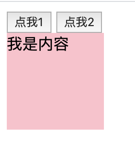
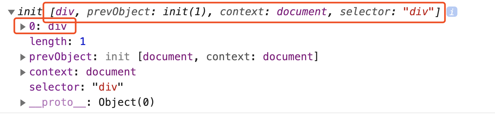
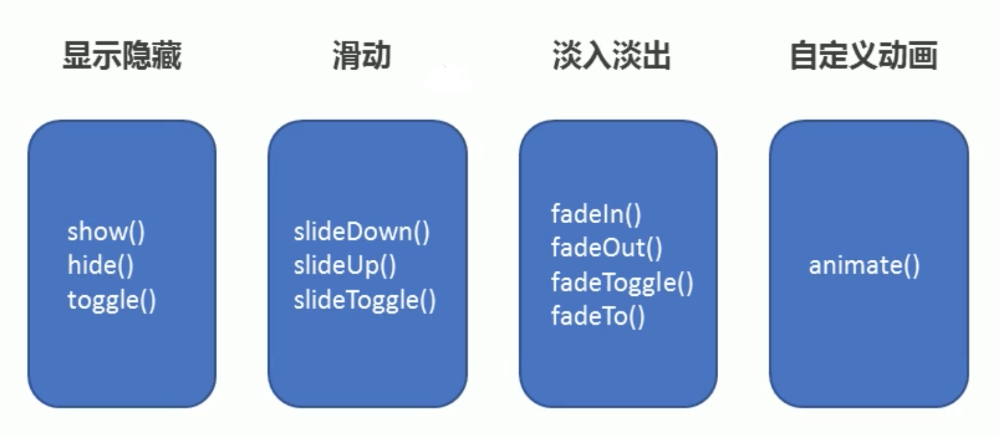
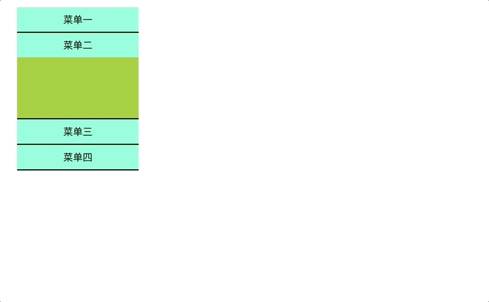
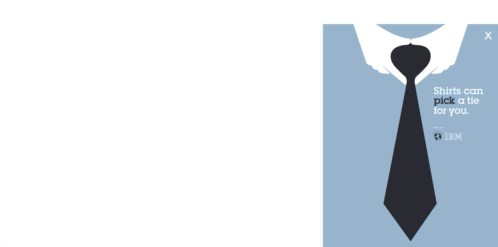

# Jquery

## 一、什么是jQuery?

> jQuery的官网 <http://jquery.com/> jQuery就是一个js库，使用jQuery的话，会比使用JavaScript更简单。

js库：把一些常用到的方法写到一个单独的js文件，使用的时候直接去引用这js文件就可以了。

我们知道了，jQuery其实就是一个js文件，里面封装了一大堆的方法方便我们的开发，其实就是一个加强版的js，因此我们学习jQuery，其实就是学习jQuery这个js文件中封装的一大堆方法。

### 1、jQuery的版本

> 官网下载地址：<http://jquery.com/download/> jQuery版本有很多，分为1.x 2.x 3.x
>
> ```none
>  <script src="http://code.jquery.com/jquery-latest.js"></script>
> ```

大版本分类：

```javascript
1.x版本：能够兼容IE678浏览器
2.x版本：不兼容IE678浏览器
1.x和2.x版本jquery都不再更新版本了，现在只更新3.x版本。

3.x版本：不兼容IE678，更加的精简（在国内不流行，因为国内使用jQuery的主要目的就是兼容IE678）
```

关于压缩版和未压缩版

```javascript
jquery-1.12.4.min.js:压缩版本，适用于生产环境，因为文件比较小，去除了注释、换行、空格等东西，但是基本没有阅读性。
jquery-1.12.4.js:未压缩版本，适用于学习与开发环境，源码清晰，易阅读。
```

### 2、jQuery的入口函数

使用jQuery的三个步骤：

```javascript
1. 引入jQuery文件
2. 入口函数
3. 功能实现
```

关于jQuery的入口函数：

```javascript
//第一种写法
$(document).ready(function() {
    
});
//第二种写法
$(function() {
    
});
```

jQuery入口函数与js入口函数的对比

```javascript
1.  JavaScript的入口函数要等到页面中所有资源（包括图片、文件）加载完成才开始执行。
2.  jQuery的入口函数只会等待文档树加载完成就开始执行，并不会等待图片、文件的加载。
```

### 3、jQuery初体验

让div显示与设置内容.html



```html
<!DOCTYPE html>
<html>
	<head>
		<meta charset="utf-8" />
		<meta name="viewport" content="width=device-width, initial-scale=1">
		<title></title>
		<script type="text/javascript" src="jquery-1.11.1.min.js"></script>
		<script type="text/javascript">
			$(document).ready(function() {
				$("#btn1").click(function() {
					$("div").show(200);
				});

				$("#btn2").click(function() {
					$("div").text("我是内容");
				});
			});
		</script>
		<style type="text/css">
			div {
				width: 100px;
				height: 100px;
				background-color: #FFC0CB;
				display: none;
			}
		</style>
	</head>
	<body>
		<button id="btn1">点我1</button>
		<button id="btn2">点我2</button>
		<div></div>
	</body>
</html>
```

### 4、jQuery对象与DOM对象的区别

```javascript
1. DOM对象：使用JavaScript中的方法获取页面中的元素返回的对象就是dom对象。
2. jQuery对象：jquery对象就是使用jquery的方法获取页面中的元素返回的对象就是jQuery对象。
3. jQuery对象其实就是DOM对象的包装集（包装了DOM对象的集合（伪数组））
4. DOM对象与jQuery对象的方法不能混用。
```

DOM对象转换成jQuery对象：

```javascript
//语法 $(DOM)
var d = document.querySelector('div')//dom对象
d.show()没有show方法
$(d)//转成jquery对象  $(div).show(200);
```

jQuery对象转换成DOM对象：



```html
<!DOCTYPE html>
<html>
	<head>
		<meta charset="utf-8" />
		<meta name="viewport" content="width=device-width, initial-scale=1">
		<title></title>
		<script type="text/javascript" src="../资料/jquery.min.js"></script>
		<script type="text/javascript">
			$(document).ready(function() {
				$("#btn1").click(function() {
					//隐式迭代：偷偷的遍历，在jQuery中，不需要手动写for循环了，会自动进行遍历。
                    var a = document.querySelector('div')
					$(a).show(200);
				});

				$("#btn2").click(function() {
					console.log($('div'));
                    console.log($('div')[0]);
                    console.log($('div').get(0));
                    $('div')[0].style.display="none"
				});
			});
		</script>
		<style type="text/css">
			div {
				width: 100px;
				height: 100px;
				background-color: #FFC0CB;
				display: none;
			}
		</style>
	</head>
	<body>
		<button id="btn1">点我1</button>
		<button id="btn2">点我2</button>
		<div></div>
	</body>
</html>
```


## 二、选择器

### 1、什么是jQuery选择器

jQuery选择器是jQuery为我们提供的一组方法，让我们更加方便的获取到页面中的元素。注意：jQuery选择器返回的是jQuery对象。

jQuery选择器有很多，基本兼容了CSS1到CSS3所有的选择器，并且jQuery还添加了很多更加复杂的选择器。【查看jQuery文档】

jQuery选择器虽然很多，但是选择器之间可以相互替代，就是说获取一个元素，你会有很多种方法获取到。所以我们平时真正能用到的只是少数的最常用的选择器。

### 2、基本选择器

| 名称       | 用法               | 描述                                 |
| ---------- | ------------------ | ------------------------------------ |
| ID选择器   | $(“#id”);          | 获取指定ID的元素                     |
| 类选择器   | $(“.class”);       | 获取同一类class的元素                |
| 标签选择器 | $(“div”);          | 获取同一类标签的所有元素             |
| 并集选择器 | $(“div,p,li”);     | 使用逗号分隔，只要符合条件之一就可。 |
| 交集选择器 | $(“div.redClass”); | 获取class为redClass的div元素         |

> 总结：跟css的选择器用法一模一样。

并集选择器：

```html
<!DOCTYPE html>
<html>
	<head>
		<meta charset="utf-8">
		<title></title>
        <script src="/资料/jquery.min.js"></script>
		<script type="text/javascript">
			$(function(){
				$('.one,p').css('color','red')
			})
		</script>
	</head>
	<body>
		<div>
			<ul>
				<li class="one">li</li>
				<li>li</li>
				<li>li</li>
				<li>li</li>
				<li>li</li>
				<li>li</li>
				<li>li</li>
				<li>li
					<p>p</p>
				</li>
				<li>li</li>
				<li>li</li>
			</ul>
		</div>
	</body>
</html>

```

交集选择器

```html
<!DOCTYPE html>
<html>
	<head>
		<meta charset="utf-8">
		<title></title>
		<script src="/资料/jquery.min.js" type="text/javascript" charset="utf-8"></script>
		<script type="text/javascript">
			$(function(){
				//只想让li里面的class为red的变色
				$('li.red').css('color','red')
			})
		</script>
	</head>
	<body>
		<ul>
			<li>li</li>
			<li class="red">li</li>
			<li>li</li>
			<li>li</li>
			<li>li</li>
		</ul>
		
		<div class="red">
			div
		</div>
	</body>
</html>

```


### 3、层级选择器

| 名称       | 用法           | 描述                                                        |
| ---------- | -------------- | ----------------------------------------------------------- |
| 子代选择器 | $(“ul>li”);    | 使用>号，获取儿子层级的元素，注意，并不会获取孙子层级的元素 |
| 后代选择器 | $(“ul li”);    | 使用空格，代表后代选择器，获取ul下的所有li元素，包括孙子等  |
| 紧邻选择器 | $(''#box+div") | 选择id为box的下一个div元素                                  |
| 兄弟选择器 | $(''#box~div") | 选择id为box的元素后面的所有div元素                          |

> 跟CSS的选择器一模一样。

子代和后代选择器

```html
<!DOCTYPE html>
<html>
	<head>
		<meta charset="utf-8">
		<title></title>
		<script src="js/jquery-1.11.1.min.js" type="text/javascript" charset="utf-8"></script>
		<script type="text/javascript">
			$(function(){
				$('#father p').css('color','red')
                //$('#father>p').css('color','red')
			})
		</script>
	</head>
	<body>
		<div id="father">
			<div>1</div>
			<div>1</div>
			<div>
				<p>2</p>
				<p>2</p>
				<p>2</p>
				<p>2</p>
			</div>
			<div>1</div>
			<p>p</p>
			<p>p</p>
			<p>p</p>
			<p>p</p>
		</div>
	</body>
</html>
```

兄弟和相邻选择器

```html
<!DOCTYPE html>
<html>

<head lang="en">
    <meta charset="UTF-8">
    <title></title>
    <script src="../资料/jquery.min.js"></script>
    <script>
        $(function () {
            $('.ad+div').css('color','red')
        })
    </script>
</head>

<body>
    <div class="ad">
    </div>
    <div>33</div>
    <div>44</div>
</body>

</html>
```


### 4、过滤选择器

> 这类选择器都带冒号:

| 名称              | 用法                                | 描述                                                        |
| ----------------- | ----------------------------------- | ----------------------------------------------------------- |
| :eq（index）      | $(“li:eq(2)”).css(“color”, ”red”);  | 获取到的li元素中，选择索引号为2的元素，索引号index从0开始。 |
| :odd              | $(“li:odd”).css(“color”, ”red”);    | 获取到的li元素中，选择索引号为奇数的元素                    |
| :even             | $(“li:even”).css(“color”, ”red”);   | 获取到的li元素中，选择索引号为偶数的元素                    |
| :first            | $(“div:first”).css(“color”, ”red”); | 选择第一个div元素                                           |
| :last             | $(“div:last”).css(“color”, ”red”);  | 选择最后一个div元素                                         |
| :not()            | $('div:not('.one'))                 | 选择class不为one的所有div元素                               |
| :gt（3）:lt(3)    |                                     | 索引大于、小于3，从0开始                                    |
| :header           | $(':header')                        | 选择所有标题元素(h1-h6)                                     |
| :contains('elem') | $('div:contains('di')')             | 选择含有文本‘di’的div元素                                   |
| :empty            | $('div:empty')                      | 不包含子元素或者文本元素的div空元素                         |
| input:hidden      | $('input:hidden')                   | 获取input里属性为hidden的元素                               |

```html
<!DOCTYPE html>
<html>

<head lang="en">
    <meta charset="UTF-8">
    <title></title>
    <script src="../资料/jquery.min.js"></script>
    <script>
        $(function () {
            $('li:eq(2)').css('color','red')
            $('li:odd').css('color','gold')
            $('li:even').css('color','green')
            $('li:first').css('color','blue')
            $('li:last').css('color','orange')
            $('li:not(".one")').css('color','red')
            $('li:gt(3)').css('color','pink')
            $(':header').css('color','red')
            $('div:contains("box")').css('color','red')
            $('li:empty').css('color','red')
            $('input:password').css('color','red')
        })
    </script>
</head>

<body>
    <h1>t1</h1>
    <h2>t2</h2>
    <div>box</div>
    <div>d</div>
    <div>abox</div>
    <input type="password">
    <ul>
        <li>1</li>
        <li>2</li>
        <li class="one">3</li>
        <li>4</li>
        <li>5</li>
        <li>6</li>
        <li>7</li>
        <li>8</li>
        <li>9</li>
        <li>10</li>
        <li></li>
    </ul>
</body>

</html>
```


【案例：隔行变色】

```html
<!DOCTYPE html>
<html>
	<head>
		<meta charset="utf-8" />
		<meta name="viewport" content="width=device-width, initial-scale=1">
		<title></title>
		<script src="../资料/jquery.min.js"></script>
		<script type="text/javascript">
			$(function() {
				$('#btn1').click(function(){
					$('li:odd').css('backgroundColor','red')
				})
			});
		</script>
		<style type="text/css">
			li {
				width: 100%;
				height: 20px;
			}
		</style>
	</head>
	<body>
		<button id="btn1">点我1</button>
		<ul>
			<li></li>
			<li></li>
			<li></li>
			<li></li>
			<li></li>
			<li></li>
			<li></li>
			<li></li>
			<li></li>
			<li></li>
		</ul>
	</body>
</html>

```


### 4、筛选选择器(方法)

> 筛选选择器的功能与过滤选择器有点类似，但是用法不一样，筛选选择器主要是方法。

| 名称               | 用法                        | 描述                             |
| ------------------ | --------------------------- | -------------------------------- |
| children(selector) | $(“ul”).children(“li”)      | 相当于$(“ul>li”)，子类选择器     |
| find(selector)     | $(“ul”).find(“li”);         | 相当于$(“ul li”),后代选择器      |
| siblings(selector) | $(“#first”).siblings(“li”); | 查找兄弟节点，不包括自己本身。   |
| parent()           | $(“#first”).parent();       | 查找父亲                         |
| eq(index)          | $(“li”).eq(2);              | 相当于$(“li:eq(2)”),index从0开始 |
| next()             | $(“li”).next()              | 找下一个兄弟                     |
| prev()             | $(“li”).prev()              | 找上一次兄弟                     |

```html
<!DOCTYPE html>
<html>

<head>
    <meta charset="utf-8" />
    <meta name="viewport" content="width=device-width, initial-scale=1">
    <title></title>
    <script src="../资料/jquery.min.js"></script>
    <style>
    </style>
    <script type="text/javascript">

        $(function () {
            $('.father').children('p').css('backgroundColor','red')
            $('.father').find('p').css('backgroundColor','yellow')
            $('.one').siblings('div').css('backgroundColor','pink')
            $(".one").parent().css('backgroundColor','black')
            $('.father>p').eq(2).css('backgroundColor','blue')
            $(".one").next().css('backgroundColor','green')
            $(".one").prev().css('backgroundColor','gold')

        });
    </script>
    <style type="text/css">
        li {
            width: 100%;
            height: 20px;
        }
    </style>
</head>

<body>

    <div class="father">
        <div>1</div>
        <div class="one">one</div>
        <div>
            <p>22</p>
            <p>22</p>
            <p>22</p>
            <p>22</p>
            <p>22</p>
        </div>
        <div>1</div>
        <p>p</p>
        <p>p</p>
        <p>p</p>
        <p>p</p>
        <p>p</p>
        <p>p</p>
    </div>
</body>

</html>
```


### 案例：下拉菜单

```html
<!DOCTYPE html>
<html lang="en">

<head>
    <meta charset="UTF-8">
    <meta name="viewport" content="width=device-width, initial-scale=1.0">
    <meta http-equiv="X-UA-Compatible" content="ie=edge">
    <title>Document</title>
    <script src="http://code.jquery.com/jquery-latest.js"></script>
    <style>
        .nav {
            width: 500px;
            height: 40px;
            padding: 0;
            margin: 0;
            list-style: none;
            text-align: center;
            line-height: 40px;
            border: 1px solid gray;
        }

        .nav ul {
            padding: 0;
            margin: 0;
            list-style: none;
        }

        .nav>li {
            width: 120px;
            margin-right: 3px;
            float: left;
        }

        .nav li ul li {
            width: 120px;
            height: 40px;
            text-align: center;
            line-height: 40px;

        }

        .nav li>ul {
            display: none;
        }

        a {
            text-decoration: none;
            color: black;
        }
    </style>
</head>

<body>
    <ul class="nav">
        <li>
            <a href="#">菜单</a>
            <ul>
                <li>子菜单</li>
                <li>子菜单</li>
                <li>子菜单</li>
                <li>子菜单</li>
            </ul>
        </li>
        <li>
            <a href="#">菜单</a>
            <ul>
                <li>子菜单</li>
                <li>子菜单</li>
                <li>子菜单</li>
                <li>子菜单</li>
            </ul>
        </li>
        <li>
            <a href="#">菜单</a>
            <ul>
                <li>子菜单</li>
                <li>子菜单</li>
                <li>子菜单</li>
                <li>子菜单</li>
            </ul>
        </li>
        <li>
            <a href="#">菜单</a>
            <ul>
                <li>子菜单</li>
                <li>子菜单</li>
                <li>子菜单</li>
                <li>子菜单</li>
            </ul>
        </li>
    </ul>
</body>

</html>
```

```js
<script type="text/javascript">
    $(function () {
    $('.nav>li').mouseover(function () {
        $(this).children('ul').show()
    })
    $('.nav>li').mouseout(function () {
        $(this).children('ul').hide()
    })
})
</script>

$(this).children('ul').show().parent().siblings('li').children('ul').hide()
```


## 三、jquery样式操作

**操作行间样式**

```none
// 获取div的样式
$("div").css("width");
$("div").css("color");


//设置div的样式
$("div").css("width","30px");
$("div").css("height","30px");
$("div").css({fontSize:"30px",color:"red"});
$('div').css('backgroundColor','red');


特别注意 
选择器获取的多个元素，获取信息获取的是第一个，比如：$("div").css("width")，获取的是第一个div的width。
```

**操作样式类名**

```none
$("#div1").addClass("divClass2") //为id为div1的对象追加样式divClass2
$("#div1").removeClass("divClass")  //移除id为div1的对象的class名为divClass的样式
$("#div1").removeClass("divClass divClass2") //移除多个样式
```

### 案例：排他思想

```html
<!DOCTYPE html>
<html>
	<head>
		<meta charset="utf-8">
		<title></title>
		<script src="http://code.jquery.com/jquery-latest.js"></script>
		<script type="text/javascript">
	
		</script>
		<style type="text/css">
			* {
				margin: 0;
				padding: 0;
			}

			.box {
				width: 300px;
				height: 200px;
				border: 1px slateblue solid;
			}

			.left,
			.right {
				float: left;
				width: 50px;
				height: 200px;
				border: 1px red solid;
			}

			.center {
				float: left;
				width: 196px;
				height: 200px;
			}
			.center div {
				width: 196px;
				height: 200px;
			}
			ul {
				list-style: none;
			}

			li {
				width: 48px;
				height: 48px;
				border: red solid 1px;
				text-align: center;
				line-height: 40px;
			}

			.red {
				background-color: red;
				display: none;
			}

			.yellow {
				background-color: yellow;
				display: none;
			}

			.blue {
				background-color: blue;
				display: none;
			}

			.green {
				background-color: green;
				display: none;
			}

			.black {
				background-color: black;
				display: none;
			}

			.orange {
				background-color: orange;
				display: none;
			}

			.pink {
				background-color: pink;
				display: none;
			}
			.white {
				background-color: white;
				display: none;
			}
			.active {
				display: block;
			}
		</style>
	</head>
	<body>
		<div class="box">
			<div class="left">
				<ul>
					<li>红色</li>
					<li>黄色</li>
					<li>蓝色</li>
					<li>绿色</li>
				</ul>
			</div>
			<div class="center">
				<div class="red active"></div>
				<div class="yellow"></div>
				<div class="blue"></div>
				<div class="green"></div>
				<div class="black"></div>
				<div class="orange"></div>
				<div class="pink"></div>
				<div class="white"></div>
			</div>
			<div class="right">
				<ul>
					<li>黑色</li>
					<li>橙色</li>
					<li>粉色</li>
					<li>白色</li>
				</ul>
			</div>
		</div>
	</body>
</html>


```

```js
$(function() {
    $('.left li').mouseover(function() {
        var index = $(this).index();
        $('.center>div:eq('+index+')').show().siblings().hide();
    })
    $('.right li').mouseover(function() {
        var index = $(this).index()+4;
        $('.center>div').eq(index).show().siblings().hide();
    })
})
```


### 案例：tab栏切换

```html
<!DOCTYPE html>
<html>

<head>
    <meta charset="utf-8">
    <title></title>
    <script src="http://code.jquery.com/jquery-latest.js"></script>
    <script type="text/javascript">

    </script>
    <style type="text/css">
        .box {
            width: 500px;
        }

        .nav {
            width: 1000px;
            height: 40px;
        }

        ul {
            list-style: none;
        }

        li {
            float: left;
            margin-right: 10px;
            width: 150px;
            height: 40px;
            line-height: 40px;
            text-align: center;
            border: 1px gray solid;
        }

        .item {
            padding: 50px;
        }

        .item div:nth-child(1) {
            display: none;
        }

        .item div:nth-child(2) {
            display: none;
        }

        .item div:nth-child(3) {
            display: none;
        }

        .current {
            background-color: greenyellow;
        }

        div .item .active {
            display: block;
        }
    </style>
</head>

<body>
    <div class="box">
        <div class="nav">
            <ul>
                <li class="current">商品详情</li>
                <li>规格</li>
                <li>售后</li>
            </ul>
        </div>
        <div class="item">
            <div class="active">手机</div>
            <div>iphoneX</div>
            <div>没有</div>
        </div>

    </div>
</body>

</html>
```

- js的className会覆盖原来的类名
- jquery的addClass不会影响之前的，相当于追加

```js
$(function () {
    $(".nav li").mouseover(function () {
        //背景色变成绿色，其他变成白色
        $(this).addClass('current').siblings().removeClass('current')
        // 根据索引显示下方信息
        var index = $(this).index()
        $('.item div').eq(index).show().siblings().hide()

    })
})
```


## 四、jquery特殊效果


- show(speed，easing,fn)
  - speed  速度  毫秒值  slow normal fast
  - easing:指定的切换效果 默认swing 可用参数linear
  - fn：回调函数，在动画完成时执行的函数，每个元素执行一次


```html
<!DOCTYPE html>
<html>

<head>
    <meta charset="utf-8">
    <title></title>
    <script src="http://code.jquery.com/jquery-latest.js"></script>
    <style>
        #div1{
            width: 100px;
            height: 100px;
            background-color: pink;
        }
    </style>
    <script type="text/javascript">
        $(function () {
            $('#btn').click(function () {

                $('#div1').fadeOut(1000, 'swing', function () {
                    alert('done!');
                });

            });
        })
    </script>

</head>

<body>
    <button id="btn">点我</button>
    <div id="div1">

    </div>
</body>

</html>

```



fadeIn() 淡入

fadeOut() 淡出

fadeToggle() 切换淡入淡出

fadeTo()修改透明度

hide() 隐藏元素

show() 显示元素

toggle() 依次展示或隐藏某个元素(切换)

```html
<!DOCTYPE html>
<html>

<head>
    <meta charset="utf-8">
    <title></title>
    <script src="http://code.jquery.com/jquery-latest.js"></script>
    <style>
        #div1{
            width: 100px;
            height: 100px;
            background-color: pink;
        }
    </style>
    <script type="text/javascript">
        $(function () {
            $('#btn').click(function () {
                $('#div1').toggle(1000, 'swing');
            });
        })
    </script>

</head>

<body>
    <button id="btn">点我</button>
    <div id="div1">

    </div>
</body>

</html>
```


slideDown() 向下展开

slideUp() 向上卷起

slideToggle() 依次展开或卷起某个元素 

### 案例：滑动效果

```html
<!DOCTYPE html>
<html>

<head>
    <meta charset="utf-8">
    <title></title>
    <script src="http://code.jquery.com/jquery-latest.js"></script>
    <style>
        #div1{
            width: 100px;
            height: 400px;
            background-color: pink;
            display: none;
        }
    </style>
    <script type="text/javascript">
        $(function () {
            $('#btn1').click(function () {
                $('#div1').slideDown();
            });
            $('#btn2').click(function () {
                $('#div1').slideUp();
            });
            $('#btn3').click(function () {
                $('#div1').slideToggle();
            });
        })
    </script>

</head>

<body>
    <button id="btn1">下拉</button>
    <button id="btn2">上拉</button>
    <button id="btn3">切换</button>
    <div id="div1">

    </div>
</body>

</html>
```


### 案例：下拉菜单切换

```html
<!DOCTYPE html>
<html lang="en">

<head>
    <meta charset="UTF-8">
    <meta name="viewport" content="width=device-width, initial-scale=1.0">
    <meta http-equiv="X-UA-Compatible" content="ie=edge">
    <title>Document</title>
    <script src="http://code.jquery.com/jquery-latest.js"></script>
    <style>
        .nav {
            width: 500px;
            height: 40px;
            padding: 0;
            margin: 0;
            list-style: none;
            text-align: center;
            line-height: 40px;
            border: 1px solid gray;
        }

        .nav ul {
            padding: 0;
            margin: 0;
            list-style: none;
        }

        .nav>li {
            width: 120px;
            margin-right: 3px;
            float: left;
        }

        .nav li ul li {
            width: 120px;
            height: 40px;
            text-align: center;
            line-height: 40px;

        }

        .nav li>ul {
            display: none;
        }

        a {
            text-decoration: none;
            color: black;
        }
    </style>
    <script type="text/javascript">
        $(function () {
            // $('.nav>li').mouseover(function () {
            //     $(this).children('ul').show()
            // })
            // $('.nav>li').mouseout(function () {
            //     $(this).children('ul').hide()
            // })
            $('.nav>li').hover(function () {
                $(this).children('ul').slideDown()
            }, function () {
                $(this).children('ul').slideUp()
             })
        })
    </script>
</head>

<body>
    <ul class="nav">
        <li>
            <a href="#">菜单</a>
            <ul>
                <li>子菜单</li>
                <li>子菜单</li>
                <li>子菜单</li>
                <li>子菜单</li>
            </ul>
        </li>
        <li>
            <a href="#">菜单</a>
            <ul>
                <li>子菜单</li>
                <li>子菜单</li>
                <li>子菜单</li>
                <li>子菜单</li>
            </ul>
        </li>
        <li>
            <a href="#">菜单</a>
            <ul>
                <li>子菜单</li>
                <li>子菜单</li>
                <li>子菜单</li>
                <li>子菜单</li>
            </ul>
        </li>
        <li>
            <a href="#">菜单</a>
            <ul>
                <li>子菜单</li>
                <li>子菜单</li>
                <li>子菜单</li>
                <li>子菜单</li>
            </ul>
        </li>
    </ul>
</body>

</html>
```

简写

```js
$('.nav>li').hover(function () {
    $(this).children('ul').slideToggle()
})
```

### 动画队列

- 快速滑动式会有bug

动画或者效果一旦触发就会执行，如果多次触发，就造成多个动画或者效果排队执行

- stop()
  - 停止的是以上一次动画，不会有排队的效果,写在动画前面

```js
$('.nav>li').hover(function () {
    $(this).children('ul').stop().slideToggle()
})
```

### 案例：突出显示


```html
<html>

<head lang="en">
    <meta charset="UTF-8">
    <title></title>
    <style type="text/css">
        body {
            background-color: black;
        }

        .box {
            width: 1000px;
            height: 500px;
            border: 2px solid white;
            margin: 100px auto;
        }

        .box li {
            width: 300px;
            height: 230px;
            float: left;
            margin-right: 10px;
            margin-bottom: 10px;
            opacity: 0.4;
        }

        ul {
            list-style: none;
        }

        img {
            width: 100%;
            height: 100%;
        }
    </style>

    <script src="http://code.jquery.com/jquery-latest.js"></script>
    <script>
        $(function(){
            $('li').hover(function(){
                $(this).stop().fadeTo(100,1)
            },function(){
                $(this).stop().fadeTo(100,0.4)
            })
        })
    </script>
</head>

<body>
    <div class="box">
        <ul>
            <li></li>
            <li></li>
            <li></li>
            <li></li>
            <li></li>
            <li></li>
        </ul>
    </div>
</body>

</html>
```

```js
$(function(){
    $('li').hover(function(){
        $(this).stop().fadeTo(100,1)
    },function(){
        $(this).stop().fadeTo(100,0.4)
    })
})
```


## 五、jquery链式调用

jquery对象的方法会在执行完后返回这个jquery对象，所有jquery对象的方法可以连起来写：

```none
$('#div1') // id为div1的元素
.children('ul') //该元素下面的ul子元素
.slideDown('fast') //高度从零变到实际高度来显示ul元素
.parent()  //跳到ul的父元素，也就是id为div1的元素
.siblings()  //跳到div1元素平级的所有兄弟元素
.children('ul') //这些兄弟元素中的ul子元素
.slideUp('fast');  //高度实际高度变换到零来隐藏ul元素
```

## 六、自定义动画

### animate(param,[speed],[easing],[fn])

- Param 想要更改的样式属性，以对象形式传参，必须写！属性名可以不带引号，复合属性驼峰命名法borderLeft，其余参数都可以省略
- speed 速度
- easing 切换效果
- fn 回调函数

```html
<html>

<head lang="en">
    <meta charset="UTF-8">
    <title></title>
    <style type="text/css">
        .box {
            width: 500px;
            height: 500px;
            background-color: pink;
            position: relative;
        }
    </style>

    <script src="http://code.jquery.com/jquery-latest.js"></script>
    <script>
       
    </script>
</head>

<body>
    <button>浪起来！！</button>
    <div class="box"></div>
</body>

</html>
```

```js
 $(function () {
            $('button').click(function () {
                $('.box').animate({
                    left: 500,
                    top: 300,
                    opacity: .4,
                    width: 500
                },1000)
            })
        })
```


### 案例：


```html
<!doctype html>
<html>

<head>
    <meta charset="utf-8">
    <title>手风琴案例</title>

    <style type="text/css">
        * {
            margin: 0;
            padding: 0;
        }

        img {
            display: block;
        }

        ul {
            list-style: none;
        }

        .king {
            width: 852px;
            margin: 100px auto;
            overflow: hidden;
            padding: 10px;
        }

        .king ul {
            overflow: hidden;
        }

        .king li {
            position: relative;
            float: left;
            width: 69px;
            height: 69px;
            margin-right: 10px;
        }

        .king li.current {
            width: 224px;
        }

        .king li.current .big {
            display: block;
        }

        .king li.current .small {
            display: none;
        }

        .big {
            width: 224px;
            display: none;
        }

        .small {
            position: absolute;
            top: 0;
            left: 0;
            width: 69px;
            height: 69px;
            border-radius: 5px;
        }
    </style>

</head>

<body>
    <script src="http://code.jquery.com/jquery-latest.js"></script>
    <script type="text/javascript">

    </script>
    <div class="king">
        <ul>
            <li class="current">
                <a href="#">
                    
                    
                </a>
            </li>
            <li>
                <a href="#">
                    
                    
                </a>
            </li>
            <li>
                <a href="#">
                    
                    
                </a>
            </li>
            <li>
                <a href="#">
                    
                    
                </a>
            </li>
            <li>
                <a href="#">
                    
                    
                </a>
            </li>
            <li>
                <a href="#">
                    
                    
                </a>
            </li>
            <li>
                <a href="#">
                    
                    
                </a>
            </li>
        </ul>

    </div>

</body>

</html>
```

```js
$(function () {
    // 鼠标经过某个小li 有两步操作：
    $(".king li").mouseenter(function () {
        // 1.当前小li 宽度变为 224px， 同时里面的小图片淡出，大图片淡入
        $(this).stop().animate({
            width: 224
        }).find(".small").stop().fadeOut().siblings(".big").stop().fadeIn();
        // 2.其余兄弟小li宽度变为69px， 小图片淡入， 大图片淡出
        $(this).siblings("li").stop().animate({
            width: 69
        }).find(".small").stop().fadeIn().siblings(".big").stop().fadeOut();
    })
});
```


### 作业：

#### 下拉框



#### 右下角广告




