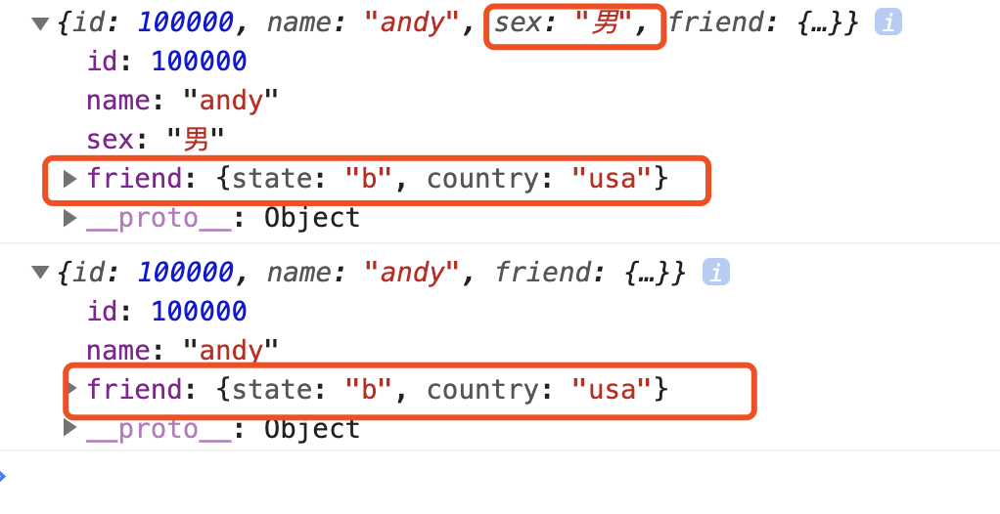
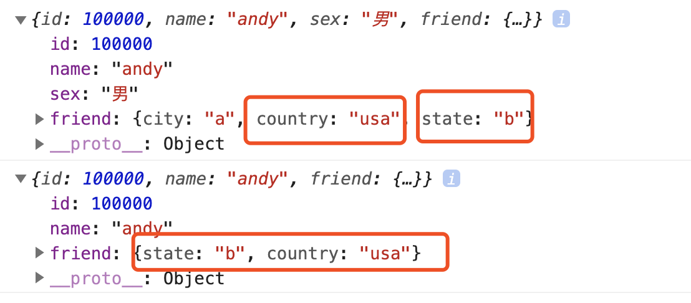

## Jquery

## 事件处理 off() 解绑事件

​	当某个事件上面的逻辑，在特定需求下不需要的时候，可以把该事件上的逻辑移除，这个过程我们称为事件解绑。jQuery 为我们提供 了多种事件解绑方法：die() / undelegate() / off() 等，甚至还有只触发一次的事件绑定方法 one()，在这里我们重点讲解一下 off() ;

```html
<!DOCTYPE html>
<html lang="en">

<head>
    <meta charset="UTF-8">
    <meta name="viewport" content="width=device-width, initial-scale=1.0">
    <meta http-equiv="X-UA-Compatible" content="ie=edge">
    <title>Document</title>
    <script src="../资料/jquery.min.js"></script>
    <script src="../资料/jquery.stellar.min.js"></script>
</head>

<body>
    <div>div</div>
    <ul>
        <li>我们都是好孩子</li>
        <li>我们都是好孩子</li>
        <li>我们都是好孩子</li>
    </ul>
    <p>我是一个P标签</p>
    <script>
        $(function () {
            // 事件绑定
            $("div").on({
                click: function () {
                    console.log("我点击了");
                },
                mouseover: function () {
                    console.log('我鼠标经过了');
                }
            });
            $("ul").on("click", "li", function () {
                alert(11);
            });

            // 1. 事件解绑 off 
            // $("div").off();  // 这个是解除了div身上的所有事件
            $("div").off("click"); // 这个是解除了div身上的点击事件
            $("ul").off("click", "li");

            // 2. one() 但是它只能触发事件一次
            $("p").one("click", function () {
                alert(11);
            })
        })
    </script>
</body>

</html>
```

### 自动触发事件

```html
<!DOCTYPE html>
<html lang="en">

<head>
    <meta charset="UTF-8">
    <meta name="viewport" content="width=device-width, initial-scale=1.0">
    <meta http-equiv="X-UA-Compatible" content="ie=edge">
    <title>Document</title>
    <script src="../资料/jquery.min.js"></script>
    <style>
        div {
            width: 200px;
            height: 200px;
            background-color: pink;
        }
    </style>
</head>

<body>
    <div>div</div>
    <input type="text">

    <script>
        // var div = document.querySelector('div')
        // div.onclick = function(){
        //     alert(123)
        // }

        // $('div').on('click', function () {
        //     alert(123)
        // })
        // $('div').trigger('click')

        $('input').trigger('focus')
    </script>
</body>

</html>
```

##  jQuery 事件对象

jQuery 对DOM中的事件对象 event 进行了封装，兼容性更好，获取更方便，使用变化不大。事件被触发，就会有事件对象的产生。

```html
<!DOCTYPE html>
<html lang="en">

<head>
    <meta charset="UTF-8">
    <meta name="viewport" content="width=device-width, initial-scale=1.0">
    <meta http-equiv="X-UA-Compatible" content="ie=edge">
    <title>Document</title>
    <script src="../资料/jquery.min.js"></script>
</head>

<body>
   <a href="https://www.baidu.com/">百度</a>

    <script>
        $('a').click(function(e){
            console.log(e);
            e.preventDefault()
        })
    </script>
</body>

</html>
```

## jQuery 拷贝对象

*$*.extend( [deep ], target, object1 [, objectN ] )

- deep:可选。 Boolean类型 指示是否深度合并对象，默认为false。如果该值为true，且多个对象的某个同名属性也都是对象，则该"属性对象"的属性也将进行合并。
- target:Object类型 目标对象，其他对象的成员属性将被附加到该对象上。
- object1:可选。 Object类型 第一个被合并的对象。
- objectN:可选。 Object类型 第N个被合并的对象。

```html
<!DOCTYPE html>
<html lang="en">

<head>
    <meta charset="UTF-8">
    <meta name="viewport" content="width=device-width, initial-scale=1.0">
    <meta http-equiv="X-UA-Compatible" content="ie=edge">
    <title>Document</title>
    <script src="../资料/jquery.min.js"></script>
</head>

<body>
    <div>div</div>

    <script>
        $(function () {
            // 1.合并数据
            var targetObj = {
                id: 1000,
                name: 'tom',
                sex: '男',
                friend: {city:'a', country: 'china'}
            };
            var obj = {};
            $.extend(obj, targetObj);
            // 浅拷贝，如果相同属性会覆盖目标对象
            console.log(obj);
        })
    </script>
</body>

</html>
```


```html
<!DOCTYPE html>
<html lang="en">

<head>
    <meta charset="UTF-8">
    <meta name="viewport" content="width=device-width, initial-scale=1.0">
    <meta http-equiv="X-UA-Compatible" content="ie=edge">
    <title>Document</title>
    <script src="../资料/jquery.min.js"></script>
    <script src="../资料/jquery.stellar.min.js"></script>
</head>

<body>
    <div>div</div>

    <script>
        $(function () {
            // 1.合并数据
            var targetObj = {
                id: 1000,
                name: 'tom',
                sex: '男',
                friend: {city:'a', country: 'china'}
            };
            var obj = {
                id: 100000,
                name: "andy",
                friend: {state: 'b', country: 'usa'}
            };
            $.extend(targetObj, obj);
            // 浅拷贝，如果相同属性会覆盖目标对象
            console.log(targetObj);
            console.log(obj);
        })
    </script>
</body>

</html>
```



```html
<!DOCTYPE html>
<html lang="en">

<head>
    <meta charset="UTF-8">
    <meta name="viewport" content="width=device-width, initial-scale=1.0">
    <meta http-equiv="X-UA-Compatible" content="ie=edge">
    <title>Document</title>
    <script src="../资料/jquery.min.js"></script>
    <script src="../资料/jquery.stellar.min.js"></script>
</head>

<body>
    <div>div</div>

    <script>
        $(function () {
            // 1.合并数据
            var targetObj = {
                id: 1000,
                name: 'tom',
                sex: '男',
                friend: {city:'a', country: 'china'}
            };
            var obj = {
                id: 100000,
                name: "andy",
                friend: {state: 'b', country: 'usa'}
            };
            $.extend(true,targetObj, obj);
            // 深拷贝，相同属性会覆盖目标对象，不同就合并
            console.log(targetObj);
            console.log(obj);
        })
    </script>
</body>

</html>
```



##  jQuery 多库共存

实际开发中，很多项目连续开发十多年，jQuery版本不断更新，最初的 jQuery 版本无法满足需求，这时就需要保证在旧有版本正常运行的情况下，新的功能使用新的jQuery版本实现，这种情况被称为，jQuery 多库共存。

- 可能别的插件也用$符，那就冲突了

```html
<!DOCTYPE html>
<html lang="en">

<head>
    <meta charset="UTF-8">
    <meta name="viewport" content="width=device-width, initial-scale=1.0">
    <meta http-equiv="X-UA-Compatible" content="ie=edge">
    <title>Document</title>
    <script src="../资料/jquery.min.js"></script>
</head>

<body>
    <div>box</div>
    <script>
        // 让jquery 释放对$ 控制权 让用自己决定
        var bb = jQuery.noConflict()
        bb('div').css('color', 'red')

    </script>
</body>

</html>
```

## jQuery 插件

jQuery 功能比较有限，想要更复杂的特效效果，可以借助于 jQuery 插件完成。 这些插件也是依赖于jQuery来完成的，所以必须要先引入

jQuery文件，因此也称为 jQuery 插件。

jQuery 之家   http://www.htmleaf.com/ 

### jQuery 插件使用步骤：

1. 引入相关文件。（jQuery 文件 和 插件文件）    
2. 复制相关html、css、js (调用插件)。

## 视差滚动插件

视差滚动（Parallax Scrolling）指网页滚动过程中，多层次的元素进行不同程度的移动，视觉上形成立体运动效果的网页展示技术

主要核心就是前景和背景以不同的速度移动，从而创造出3D效果。 这种效果可以给网站一个很好的补充。

### 原理

传统的网页的文字、图片、背景都是一起按照相同方向相同速度滚动的，而视差滚动则是在滚动的时候，内容和多层次的背景实现或不同速度，或不同方向的运动。

有的时候也可以加上一些透明度、大小的动画来优化显示。 

利用background-attachment属性实现。

**background-attachment: fixed || scroll || local**

```html
<!DOCTYPE html>
<html lang="en">

<head>
    <meta charset="UTF-8">
    <meta name="viewport" content="width=device-width, initial-scale=1.0">
    <meta http-equiv="X-UA-Compatible" content="ie=edge">
    <title>Document</title>
    <script src="../资料/jquery.min.js"></script>
    <script src="../资料/jquery.stellar.min.js"></script>
    <style>
        *{
            padding: 0;
            margin: 0;
        }
        body {
            height: 3000px;
        }

        div {
            width: 1280px;
            height: 853px;
            /* background-attachment: fixed  */
            background: url('../资料/1.jpeg') no-repeat fixed;
            /* 背景固定，div盒子懂了，背景不动 */
            border: 3px solid red;
        }
    </style>
</head>

<body>
    <div></div>
</body>

</html>
```

### 案例

```html
<!DOCTYPE html>
<html lang="en">

<head>
    <meta charset="UTF-8">
    <meta name="viewport" content="width=device-width, initial-scale=1.0">
    <meta http-equiv="X-UA-Compatible" content="ie=edge">
    <title>Document</title>
    <script src="../资料/jquery.min.js"></script>
    <script src="../资料/jquery.stellar.min.js"></script>
    <style>
        *{
            padding: 0;
            margin: 0;
        }
        body {
            height: 3000px;
        }

        div {
            width: 1024px;
            height: 1536px;
            /* background-attachment: fixed  */
            background: url('../资料/22.jpg') no-repeat fixed;
            /* 背景固定，div盒子懂了，背景不动 */
            border: 3px solid red;
            position: relative;
        }
        span{
            display: block;
            width: 1024px;
            height: 768px;
            background: url('../资料/33.jpg') no-repeat;
            top:0;
            left:0;
            position: absolute;
        }
    </style>
</head>

<body>
    <div>
        <span></span>
    </div>

    <script>
      
    </script>
</body>

</html>
```


### Stellar.js是什么？

[stellar.js]是一个 jQuery插件，能很容易地给网站添加视差滚动效果。 尽管已经停止了维护，但它非常稳定，与最新版本的jQuery兼容，很多开发者也在使用它。 这个插件在jQuery插件库里很流行。

http://markdalgleish.com/projects/stellar.js/   官网

### 引用 js包 

```javascript
<script src="../资料/jquery.min.js"></script>
<script src="../资料/jquery.stellar.min.js"></script>
```

### 引用html

```html
<!DOCTYPE html>
<html lang="en">
<head>
    <meta charset="UTF-8">
    <meta name="viewport" content="width=device-width, initial-scale=1.0">
    <meta http-equiv="X-UA-Compatible" content="ie=edge">
    <title>Document</title>
    <script src="../资料/jquery.min.js"></script>
    <script src="../资料/jquery.stellar.min.js"></script>
    <link rel="stylesheet" href="./1.css">
</head>
<body>
    <div class="content" id="content1">
        <p>ONE</p>
    </div>
    <div class="content" id="content2">
        <p>TWO</p>
    </div>
    <div class="content" id="content3">
        <p>THREE</p>
    </div>
    <div class="content" id="content4">
        <p>FOUR</p>
    </div>

    <script>
        $(function(){
            $('.content').height($(window).height())
        })
    </script>
</body>
</html>
```

### 引入css

```css
body {
    font-size: 20px;
    color: white;
    text-shadow: 0 1px 0 black, 0 0 5px black;
}
*{
    margin: 0;
    padding: 0;
}
p {
    padding: 0 0.5em;
    margin: 0;
    text-align: center;
    font-size: 4rem;
}
.content {
    background-attachment: fixed;
    background-size: cover;
}
#content1 {
    background-image: url("/资料/1.jpg");
}
#content2 {
    background-image: url("/资料/2.jpg");
}
#content3 {
    background-image: url("/资料/3.jpg");
}
#content4 {
   background-image: url("/资料/4.jpg");
}


```

### js调用函数

```javascript
$.stellar({
    horizontalScrolling: false,
    responsive: true
});
```


### 详细参数

| 名称                                     | 说明                                                         |
| ---------------------------------------- | ------------------------------------------------------------ |
| horizontalScrolling 和 verticalScrolling | 该配置项用来设置视差效果的方向。horizontalScrolling设置水平方向，verticalScro设置垂直方向， 为布尔值，默认为true |
| responsive                               | 该配置项用来制定load或者resize时间触发时是否刷新页面，其值为布尔值，默认为false |
| hideDistantElements                      | 该配置项用来设置移出视线的元素是否隐藏，其值为布尔值，若不想隐藏则设置为false` |
| data-stellar-ratio="2"                   | 定义了此元素针对页面滚动的速度比率，比如，0.5为页面滚动的50%，2为页面滚动的200%，所以数值越大，你可以看到页面元素滚动速度越快。 |
| data-stellar-background-ratio            | 该配置项用在单个元素中，其值为一个正数，用来改变被设置元素的影响速度。 例如 值为0.3时，则表示背景的滚动速度为正常滚动速度的0.3倍。如果值为小数时最好在样式表中设置(设置背景的滚动速度) |

```html
<!DOCTYPE html>
<html lang="en">

<head>
    <meta charset="UTF-8">
    <meta name="viewport" content="width=device-width, initial-scale=1.0">
    <meta http-equiv="X-UA-Compatible" content="ie=edge">
    <title>Document</title>
    <script src="../资料/jquery.min.js"></script>
    <script src="../资料/jquery.stellar.min.js"></script>
    <link rel="stylesheet" href="./1.css">
    <style>
        .img1 {
            position: absolute;
            top: 300px;
            left: 200px;
            width: 100px;
            height: 100px;
        }

        .img2 {
            position: absolute;
            top: 300px;
            left: 600px;
            width: 100px;
            height: 100px;
        }
    </style>
</head>

<body>
    
    
    <div class="content" id="content1">
        <p>ONE</p>
    </div>
    <div class="content" id="content2">
        <p>TWO</p>
    </div>
    <div class="content" id="content3">
        <p>THREE</p>
    </div>
    <div class="content" id="content4">
        <p>FOUR</p>
    </div>

    <script>
        $(function () {
            $('.content').height($(window).height())
        })
        $.stellar({
            horizontalScrolling: false,
            responsive: true
        });
    </script>


</body>

</html>
```

# 作业

### QQTIM


```html
<!DOCTYPE html>
<html lang="en">

<head>
    <meta charset="UTF-8">
    <meta name="viewport" content="width=device-width, initial-scale=1.0">
    <meta http-equiv="X-UA-Compatible" content="ie=edge">
    <title>Document</title>
    <script src="../资料/jquery.min.js"></script>
    <script src="../资料/jquery.stellar.min.js"></script>
    <style>
        *{
            padding: 0;
            margin: 0;
        }
        img{
            width: 100%;
            height: 100%;
        }
        .bg1{
            width: 100%;
            height: 500px;
            background: url('../资料/fisrtbg.jpg') fixed;
        }
        .bg2{
            width: 100%;
            height: 500px;
            background: url('../资料/avd.jpg') fixed;
        }
        .bg3{
            width: 100%;
            height: 500px;
            background: url('../资料/blog.jpg') fixed;
        }
    </style>
</head>

<body>
    
    <div class="bg1" data-stellar-background-ratio="0.03"></div>
    
    <div class="bg2" data-stellar-background-ratio="0.03"></div>
    
    <div class="bg3" data-stellar-background-ratio="0.03"></div>
    
    <script>
        $(function(){
            $('.bg1').height($(window).height())
            $('.bg2').height($(window).height())
        })

        $.stellar({
            verticalScrolling: true
        });
    </script>
</body>

</html>
```

