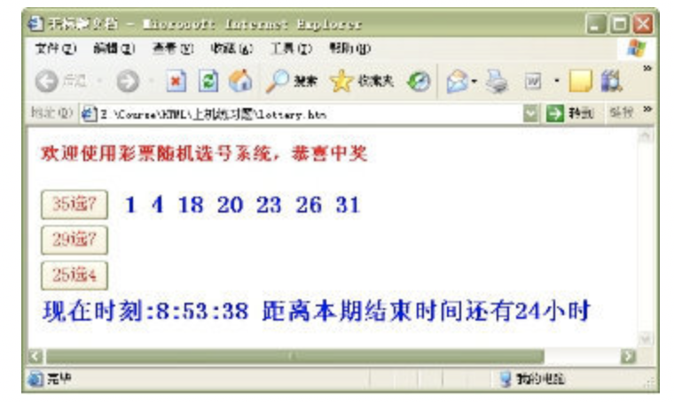

# ES6语法

### 什么是ES6

ES 的全称是 ECMAScript , 它是由 ECMA 国际标准化组织,制定的一项脚本语言的标准化规范。


### 为什么使用 ES6 ?

每一次标准的诞生都意味着语言的完善，功能的加强。JavaScript语言本身也有一些令人不满意的地方。

- 变量提升特性增加了程序运行时的不可预测性
- 语法过于松散，实现相同的功能，不同的人可能会写出不同的代码

## ES6新增语法

### let（★★★）

ES6中新增了用于声明变量的关键字

### let声明的变量只在所处的块级有效

```html
<!DOCTYPE html>
<html lang="en">
<head>
    <meta charset="UTF-8">
    <meta name="viewport" content="width=device-width, initial-scale=1.0">
    <title>Document</title>
</head>
<body>
    <script>
        if(true){
            var a = 10;
        }
        console.log(a);
        if(true){
            let b = 100;
        }
        console.log(b);//b is not defined
    </script>
</body>
</html>
```

**注意：**使用let关键字声明的变量才具有块级作用域，使用var声明的变量不具备块级作用域特性。

### 防止循环变量变成全局变量

```js
for(var i=0;i<10;i++){
    
}
console.log(i)
此时是可以访问到i的
```

更改

```js
for(let i=0;i<10;i++){
    
}
console.log(i)//i is not defined
```

### 不存在变量提升

```javascript
console.log(a); // a is not defined 
let a = 20;
```

利用let声明的变量会绑定在这个块级作用域，不会受外界的影响

```javascript
 var tmp = 123;
 if (true) { 
     tmp = 100;//绑定在块级作用域里，不上在往上找
     let tmp = 456; 
 } 
```

- 报错

### 经典面试题

```javascript
 var arr = [];
 for (var i = 0; i < 2; i++) {
     arr[i] = function () {
         console.log(i); 
     }
 }

 arr[0]();
 arr[1]();

```


函数在调用时，循环已经结束了，var i=0  是个全局变量，此时的i=2

经典面试题图解：**此题的关键点在于变量i是全局的，函数执行时输出的都是全局作用域下的i值。

```javascript
 let arr = [];
 for (let i = 0; i < 2; i++) {
     arr[i] = function () {
         console.log(i); 
     }
 }
 arr[0]();//0
 arr[1]();//1

```


**经典面试题图解：**此题的关键点在于每次循环都会产生一个块级作用域，每个块级作用域中的变量都是不同的，函数执行时输出的是自己上一级（循环产生的块级作用域）作用域下的i值.

#### 小结

- let关键字就是用来声明变量的
- 使用let关键字声明的变量具有块级作用域
- 在一个大括号中 使用let关键字声明的变量才具有块级作用域 var关键字是不具备这个特点的
- 防止循环变量变成全局变量
- 使用let关键字声明的变量没有变量提升

### const（★★★）

声明常量，常量就是值（内存地址）不能变化的量

#### 具有块级作用域

```javascript
 if (true) { 
     const a = 10;
 }
console.log(a) // a is not defined
```

#### 声明常量时必须赋值

```javascript
const PI; // Missing initializer in const declaration
```

#### 常量赋值后，值不能修改

```javascript
const PI = 3.14;
PI = 100; // Assignment to constant variable.

const ary = [100, 200];
ary[0] = 'a';
ary[1] = 'b';
console.log(ary); // ['a', 'b']; 
ary = ['a', 'b']; // Assignment to constant variable.
```

#### 小结

- const声明的变量是一个常量
- 既然是常量不能重新进行赋值，如果是基本数据类型，不能更改值，如果是复杂数据类型，不能更改地址值
- 声明 const时候必须要给定值

### let、const、var 的区别

- 作用域
- 变量提升
- 值


### 解构赋值（★★★★）

ES6中允许从数组中提取值，按照对应位置，对变量赋值，对象也可以实现解构

#### 数组解构

```javascript
 let [a, b, c, d] = [1, 2, 3];
 console.log(a)//1
 console.log(b)//2
 console.log(c)//3
 console.log(d)//undefined
//如果解构不成功，变量的值为undefined
```

#### 对象解构

```javascript
 let person = { name: 'zhangsan', age: 20 }; 
 let { name, age } = person;
 console.log(name); // 'zhangsan' 
 console.log(age); // 20

 let {name: myName, age: myAge} = person; // myName myAge 属于别名
 console.log(myName); // 'zhangsan' 
 console.log(myAge); // 20

```

#### 小结

- 解构赋值就是把数据结构分解，然后给变量进行赋值
- 如果结构不成功，变量跟数值个数不匹配的时候，变量的值为undefined
- 数组解构用中括号包裹，多个变量用逗号隔开，对象解构用花括号包裹，多个变量用逗号隔开
- 利用解构赋值能够让我们方便的去取对象中的属性跟方法

### 箭头函数（★★★★）

ES6中新增的定义函数的方式。

```javascript
() => {} //()：代表是函数； =>：必须要的符号，指向哪一个代码块；{}：函数体
const fn = () => {}//代表把一个函数赋值给fn
```

函数体中只有一句代码，且代码的执行结果就是返回值，可以省略大括号

```javascript
 function sum(num1, num2) { 
     return num1 + num2; 
 }
 //es6写法
 const sum = (num1, num2) => num1 + num2; 

```

如果形参只有一个，可以省略小括号

```javascript
 function fn (v) {
     return v;
 } 
//es6写法
 const fn = v => v;

```

### 箭头函数中的this关键词

#### 普通函数下的this:

- 在普通函数中的this总是代表它的直接调用者，在默认情况下，this指的是window，

```html
<!DOCTYPE html>
<html lang="en">

<head>
    <meta charset="UTF-8">
    <meta name="viewport" content="width=device-width, initial-scale=1.0">
    <title>Document</title>
</head>

<body>
    <script>
        var num = 10
        var fn = () => {
            var num = 100
            console.log(this.num);
        }
        fn()

        var fn1 = function () {
            var num = 100
            console.log(this.num);
        }
        fn1()
    </script>
</body>

</html>
```

- 结果是10，this指向的是window，全局作用域

```html
<!DOCTYPE html>
<html lang="en">

<head>
    <meta charset="UTF-8">
    <meta name="viewport" content="width=device-width, initial-scale=1.0">
    <title>Document</title>
</head>

<body>
    <script>
        var age = 100;

        var obj = {
            age: 20,
            say: () => {
                console.log(this.age);//this指向window
            },
            say1:function(){
                console.log(this.age);//this指向obj  20
            }
        }

        obj.say();//箭头函数this指向的是被声明的作用域里面，而对象没有作用域的，所以箭头函数虽然在对象中被定义，但是this指向的是全局作用域
        obj.say1()


    </script>
</body>

</html>
```

箭头函数不绑定this关键字，箭头函数中的this，指向的是函数定义位置的上下文this

```html
<!DOCTYPE html>
<html lang="en">

<head>
    <meta charset="UTF-8">
    <meta name="viewport" content="width=device-width, initial-scale=1.0">
    <title>Document</title>
</head>

<body>
    <script>
        var age = 100;

        var obj = {
            age: 20,
            a:this,
            say: () => {
                console.log(this.age);//this指向window
            },
            say1:function(){
                console.log(this.age);//this指向obj  20
            }
        }

        obj.say();//箭头函数this指向的是被声明的作用域里面，而对象没有作用域的，所以箭头函数虽然在对象中被定义，但是this指向的是全局作用域
        obj.say1()
        console.log(obj.a);
        


    </script>
</body>

</html>
```

#### 小结

- 箭头函数中不绑定this，箭头函数中的this指向是它所定义的位置，可以简单理解成，定义箭头函数中的作用域的this指向谁，它就指向谁

## ES6 的内置对象扩展

### Array 的扩展方法（★★）

#### 方法：find()

用于找出第一个符合条件的数组成员，如果没有找到返回undefined

```javascript
let obj = [{
    id: 1,
    name: '张三'
}, {
    id: 2,
    name: '李四'
}];
let target = obj.find((item, index) => {
    return item.id == 2
});//找数组里面符合条件的值，当数组中元素id等于2的查找出来，注意，只会匹配第一个
console.log(target);

let arr = [1,23,1,5,6,2,1]
let num =arr.find((item,index)=>{
    // console.log(index+'='+item);
    return item > 1
})
console.log(num);
```

#### 方法：includes()

判断某个数组是否包含给定的值，返回布尔值。

```javascript
[1, 2, 3].includes(2) // true 
[1, 2, 3].includes(4) // false

```

#### 方法：forEach()

```js
var arr = [2,34,4,6,7,68]
arr.forEach(function(value,index,arr){
    // 数组中的值
    console.log(value);
    console.log(index);//索引
    console.log(arr);//数组本身
})
console.log("----------------");
arr.forEach((value)=>{
    console.log(value);

})
```

### String 的扩展方法

#### 模板字符串（★★★）

ES6新增的创建字符串的方式，使用反引号定义

```javascript
let name = `zhangsan`;

```

##### 模板字符串中可以解析变量

```javascript
let name = '张三'; 
let sayHello = `hello,my name is ${name}`; // hello, my name is zhangsan
```

##### 模板字符串中可以换行

```javascript
 let result = { 
     name: 'zhangsan', 
     age: 20,
     sex: '男' 
 } 
 let html = ` <div>
     <span>${result.name}</span>
     <span>${result.age}</span>
     <span>${result.sex}</span>
 </div> `;

```

##### 在模板字符串中可以调用函数

```javascript
const sayHello = () =>'哈哈哈哈 追不到我吧 我就是这么强大';
let greet = `${sayHello()} 哈哈哈哈`;
console.log(greet); // 哈哈哈哈 追不到我吧 我就是这么强大 哈哈哈哈
```

#### 方法：startsWith() 和 endsWith()

- startsWith()：表示参数字符串是否在原字符串的头部，返回布尔值
- endsWith()：表示参数字符串是否在原字符串的尾部，返回布尔值

```javascript
let str = 'Hello world!';
str.startsWith('Hello') // true 
str.endsWith('!')       // true

```

#### 实例方法：repeat()

repeat方法表示将原字符串重复n次，返回一个新字符串

```javascript
'x'.repeat(3)      // "xxx" 
'hello'.repeat(2)  // "hellohello"
```

### Set 数据结构（★★）

ES6 提供了新的数据结构  Set。它类似于数组，但是成员的值都是唯一的，没有重复的值。

Set本身是一个构造函数，用来生成  Set  数据结构

```javascript
const s = new Set();
```

Set函数可以接受一个数组作为参数，用来初始化。

```javascript
const set = new Set([1, 2, 3, 4, 4]);

```

#### 实例方法

- add(value)：添加某个值，返回 Set 结构本身,添加重复，会去重
- delete(value)：删除某个值，返回一个布尔值，表示删除是否成功
- has(value)：返回一个布尔值，表示该值是否为 Set 的成员
- clear()：清除所有成员，没有返回值

```javascript
 const s = new Set();
 s.add(1).add(2).add(3); // 向 set 结构中添加值 
 s.delete(2)             // 删除 set 结构中的2值   
 s.has(1)                // 表示 set 结构中是否有1这个值 返回布尔值 
 s.clear()               // 清除 set 结构中的所有值
 //注意：删除的是元素的值，不是代表的索引
```

#### 遍历

Set 结构的实例与数组一样，也拥有forEach方法，用于对每个成员执行某种操作，没有返回值。

```javascript
s.forEach(value => console.log(value))
```

 


# 作业



