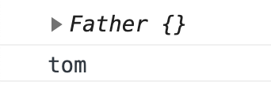

## 	1.面向过程与面向对象

### 1.1面向过程

- 面向过程就是分析出解决问题所需要的步骤，然后用函数把这些步骤一步一步实现，使用的时候再一个一个的依次调用就可以了。

### 1.2面向对象

- 面向对象是把事务分解成为一个个对象，然后由对象之间分工与合作。

### 1.3面向过程与面向对象对比

|      | 面向过程                                                     | 面向对象                                                     |
| ---- | ------------------------------------------------------------ | ------------------------------------------------------------ |
| 优点 | 性能比面向对象高，适合跟硬件联系很紧密的东西，例如单片机就采用的面向过程编程。 | 易维护、易复用、易扩展，由于面向对象有封装、继承、多态性的特性，可以设计出低耦合的系统，使系统 更加灵活、更加易于维护 |
| 缺点 | 不易维护、不易复用、不易扩展                                 | 性能比面向过程低                                             |

## 2.对象

### 2.1对象

对象是由属性和方法组成的：是一个无序键值对的集合,指的是一个具体的事物

- 属性：事物的特征，在对象中用属性来表示（常用名词）
- 方法：事物的行为，在对象中用方法来表示（常用动词）

#### 2.1.1创建对象

```js
//以下代码是对对象的复习
//字面量创建对象
var person = {
    name: 'tom',
    age: 18
}
console.log(person);

//构造函数创建对象
  function Person(name, age) {
    this.name = name;
    this.age = age;
 }
var p = new Person('tom', 18)//实例化对象
console.log(p);	

当有多个对象实例化时，构造函数里的方法会开辟多个新的内存空间，既浪费时间又浪费内存
```


### 2.2原型（prototype）

创建一个函数以后，解析器都会默认在函数中添加一个属性prototype

```js
function Person(){

}
console.log(Person.prototype);
```


```js
function Person(){

}
function Human(){

}
console.log(Person.prototype==Human.prototype);//false

```

- 每一个函数都有自己的prototype
- prototype属性指向的是一个对象，这个对象我们称为原型对象。
- 当函数作为构造函数使用，它所创建的对象中都会有一个隐含的属性指向该原型对象。我们可以通过 _ _proto__  来访问该隐含属性 

```js
function Person(){

}
function Human(){

}
var p = new Person();
console.log(p.__proto__);
console.log(p.__proto__==Person.prototype);
```


#### 注意：

#### 1. 原型对象就相当于一个公共的区域，凡是通过同一个构造函数创建的对象他们通常都可以访问到相同的原型对象。

```js
function Person() {

}
var p = new Person();
var p1 = new Person();
console.log(p.__proto__ == p1.__proto__);
console.log(p == p1);
```


#### 2.我们可以将对象中共有的属性和方法统一添加到原型对象中，这样我们只需要添加一次，就可以使所有的对象都可以使用。这也就意味着，我们可以把所有对象实例需要共享的属性和方法直接定义在 `prototype` 对象上。

```js
function Person() {

}
var p = new Person();

Person.prototype.sex = "男"
console.log(p.sex);


p.sex = "女"
console.log(p.sex);


var p1 = new Person();
console.log(p1.sex);
Person.prototype.sayHi = function () {
console.log('person sayhi');
}

p.sayHi(); //在原型上找
p1.sayHi = function(){
console.log('p1 -say hi');
}
p1.sayHi()//对象本身
```

其实都是同一个内存地址，指向 `prototype` 对象，因此就提高了运行效率。


- 当我们去访问对象的一个属性或调用对象的一个方法时，它会先自身中寻找
- 如果在自身中找到了，则直接使用。
- 如果没有找到，则去原型对象中寻找，如果找到了则使用

#### 注意

#### 原型对象 也是对象， 是对象就有原型，  那么原型对象里还有一个原型proto


- 如果没有找到，则去原型的原型中寻找，依此类推。直到找到Object的原型为止，Object的原型为null,object没有原型，简单而言，如果原型上也没找到，属性是undefined，方法会报错

```js
function Person() {

}
var p = new Person();

Person.prototype.sex = "男"
console.log(p.sex);
p.sex = "女"
console.log(p.sex);
var p1 = new Person();
console.log(p1.sex);
Person.prototype.sayHi = function () {
    console.log('person sayhi');
}

p.sayHi(); //在原型上找
p1.sayHi = function(){
    console.log('p1 -say hi');
}
p1.sayHi()//对象本身


// 如果都没找到
console.log(p.name);//undefined
p.hi()//报错
console.log(p.__proto__);//p的原型对象
console.log(p.__proto__.__proto__);//p的原型对象的原型 就是object
console.log(p.__proto__.__proto__.__proto__);//p的原型对象的原型的原型   __proto__  -> null
```


### 2.3 constructor

每一个函数都有一个prototype属性，它默认指向一个原型对象

原型对象中默认都有一个constructor属性，它指向的是函数对象

```js
<!DOCTYPE html>
<html lang="en">

<head>
    <meta charset="UTF-8">
    <meta name="viewport" content="width=device-width, initial-scale=1.0">
    <title>Document</title>
</head>

<body>
    <script>
        function Person() {

        }
        var p = new Person()
        var p1 = new Person()
        console.log(Person.prototype.constructor == Person);
        console.log(p.__proto__.constructor == Person);
        console.log(p1.__proto__.constructor == Person);
        
    </script>
</body>

</html>
```


## 3.继承

### 3.1函数里的this指向

```js
function fn() {
    console.log("fn方法");
    //指向的是window
    console.log(this);
}
fn(); //直接调用 
```

### 3.2call方法

```js
function fn() {
    console.log("fn方法");
    //指向的是window
    console.log(this);
}
//用call方法调用 
fn.call()
```

- 可以改变this的指向问题

```js
function fn() {
    console.log("fn方法");
    //指向的是window
    console.log(this);
}
fn.call()   

var obj = {
    name:'tom'
}
fn.call(obj)//此时指向obj
```

- 用call来实现继承关系

```js
function Father(name, age) {
    // this指向的father的实例对象
    console.log(this);
    this.name = name
    this.age = age
    this.sayHi = function(){
        console.log(this.name);
    }
}
var f = new Father('tom',18)
f.sayHi()
```



- 让儿子继承父亲的saiHi方法和属性

```js
function Father(name, age) {
    // this指向的father的实例对象
    console.log(this);
    this.name = name
    this.age = age
    this.sayHi = function () {
        console.log(this.name);
    }
}
var f = new Father('tom', 18)
f.sayHi()
function Son(name, age, score) {
    // console.log(name+"-"+age);
    // this指向的son的实例对象，把参数赋值到son上了
    this.score = score;
}

var son = new Son("jerry", 19, 100);
console.log(son);//Son {score: 100}
```

- 使用call方法更改this指向问题

```js
function Father(name, age) {
    // this指向的father的实例对象
    console.log(this);
    this.name = name
    this.age = age
    this.sayHi = function () {
        console.log(this.name);
    }
}
function Son(name, age, score) {
    // Father(name,age)  //1.儿子和父亲没有关系
    // 2.把儿子的this给了father
    Father.call(this, name, age)
    this.score = score;
}

var son = new Son("jerry", 19, 100);
console.log(son.name);
son.sayHi()
```

### 3.3继承的原型问题

```js
function Father(name, age) {
    // this指向的father的实例对象
    console.log(this);
    this.name = name
    this.sayHi = function () {
        console.log(this.name);
    }
}
function Son(name, age, score) {
    // Father(name,age)  //1.儿子和父亲没有关系
    // 2.把儿子的this给了father
    Father.call(this, name, age)
    this.score = score;
}

var son = new Son("jerry", 19, 100);
console.log(son.name);
son.sayHi()

// 共同的方法
Father.prototype.money = function () {
    console.log("10000");
}

var son2 = new Son("letter", 25, 100)
console.log(son2);//此时儿子是没有money方法的
Son.prototype = Father.prototype
var son3 = new Son("eric", 33, 100)
console.log(son3.__proto__);//原型对象上有money
```


- 在son的原型对象添加学习的方法

```js
Son.prototype.study = function(){
    console.log("son  study");
}
console.log(Father.prototype);//发现此时父亲也有儿子的方法，就有问题了
```


##### 因为Son.prototype = Father.prototype已经修改了指向，修改儿子就相当于修改了父亲的原型对象，所以不能这么使用


```js
var son2 = new Son("letter", 25, 100)
// Son.prototype = Father.prototype
// son的原型对象指向father的实例对象，每个实例对象都指向的原型对象
Son.prototype = new Father()
var son3 = new Son("eric", 33, 100)
Son.prototype.study = function(){
    console.log("son  study");
}
console.log(Father.prototype);
console.log(Son.prototype);
```


- 此时还有一个问题，由于更改了son的原型指向，此时指向的是father的原型对象，那么son的constructor也指向了father，需要更改为son的

```js
console.log(Son.prototype.constructor);
/*
        ƒ Father(name, age) {
                    // this指向的father的实例对象
                    console.log(name);

                    this.name = name;
                    this.age = age;
                }

        */
Son.prototype.constructor=Son
console.log(Son.prototype.constructor);
/*
            ƒ Son(name, age, score) {
                // console.log(name+"-"+age);
                // Father(name,age)  //儿子和父亲没有关系
                // this指向的son的实例对象，把参数赋值到son上了
                Father.call(this, name, age)
            …

        */
```


## 4.类

在 ES6 中新增加了类的概念，可以使用 class 关键字声明一个类，之后以这个类来实例化对象。类抽象了对象的公共部分，它泛指某一大类（class）对象特指某一个，通过类实例化一个具体的对象

#### 4.1创建类

1. 语法:

```js
//步骤1 使用class关键字
class Dog {
  // class body
}     
//步骤2使用定义的类创建实例  注意new关键字
var d = new Dog();     
```

1. 示例

```js
 // 1. 创建类 class  创建一个 人类
class Person{
        // 类的共有属性放到 constructor 里面
    constructor(name,age){
        this.name = name;
        this.age = age;
    }
}
   // 2. 利用类创建对象 new
var person = new Person("tom", 18);
console.log(person);
console.log(person.name + "--" + person.age);
```

通过结果我们可以看出,运行结果和使用构造函数方式一样


constructor就是构造函数，就是为类给对象初始化赋值的

#### 4.2类创建添加属性和方法

```html
<!DOCTYPE html>
<html lang="en">

<head>
    <meta charset="UTF-8">
    <meta name="viewport" content="width=device-width, initial-scale=1.0">
    <meta http-equiv="X-UA-Compatible" content="ie=edge">
    <title>Document</title>
</head>

<body>
    <script>
        // 1. 创建类 class  创建一个 明星类
        class Person {
            // 类的共有属性放到 constructor 里面
            constructor(name, age) {
                this.name = name;
                this.age = age;
            }
            speak(str){
                console.log(this.name+"speak"+str);
            }
        }

        var person = new Person("tom", 18);
        console.log(person);
        console.log(person.name + "--" + person.age);
        person.speak("中文")


    </script>
</body>

</html>
```

##### 注意:

1. 通过class 关键字创建类, 类名我们还是习惯性定义首字母大写
2. 类里面有个constructor 函数,可以接受传递过来的参数,同时返回实例对象
3. constructor 函数 只要 new 生成实例时,就会自动调用这个函数, 如果我们不写这个函数,类也会自动生成这个函数
4. 多个函数方法之间不需要添加逗号分隔
5. 生成实例 new 不能省略
6. 语法规范, 创建类 类名后面不要加小括号,生成实例 类名后面加小括号, 构造函数不需要加function

#### 4.3类的继承

1. 语法

```js
// 父类
class Father{   
} 

// 子类继承父类
class  Son  extends Father {  
}       
```

1. 示例

```html

<!DOCTYPE html>
<html lang="en">

<head>
    <meta charset="UTF-8">
    <meta name="viewport" content="width=device-width, initial-scale=1.0">
    <meta http-equiv="X-UA-Compatible" content="ie=edge">
    <title>Document</title>
</head>

<body>
    <script>
        class Father {
            constructor(name) {
                console.log('构造函数'+name)
                this.name = name;
            }
            say() {
                console.log('father-say' + this.name);
            }
        }

        class Son extends Father{} // 这样子类就继承了父类的属性和方法

        let son = new Son("son tom");
        son.say()//father-say   son tom
    </script>
</body>

</html>
```

### **注意:** 

1. 继承中,如果实例化子类输出一个方法,先看子类有没有这个方法,如果有就先执行子类的

   ```html
   <!DOCTYPE html>
   <html lang="en">
   
   <head>
       <meta charset="UTF-8">
       <meta name="viewport" content="width=device-width, initial-scale=1.0">
       <meta http-equiv="X-UA-Compatible" content="ie=edge">
       <title>Document</title>
   </head>
   
   <body>
       <script>
           class Father {
               constructor(name) {
                   console.log('构造函数'+name)
                   this.name = name;
               }
               say() {
                   console.log('father-say' + this.name);
               }
           }
   
           class Son extends Father{
               say() {
                   console.log('son-say' + this.name);
               }
           }
   
           let son = new Son("son tom");
           son.say()//son-sayson tom
       </script>
   </body>
   
   </html>
   ```

   

2. 继承中,如果子类里面没有,就去查找父类有没有这个方法,如果有,就执行父类的这个方法(就近原则)

   ```html
   <!DOCTYPE html>
   <html lang="en">
   
   <head>
       <meta charset="UTF-8">
       <meta name="viewport" content="width=device-width, initial-scale=1.0">
       <meta http-equiv="X-UA-Compatible" content="ie=edge">
       <title>Document</title>
   </head>
   
   <body>
       <script>
           class Father {
               constructor(name) {
                   console.log('构造函数'+name)
                   this.name = name;
               }
               say() {
                   console.log('father-say' + this.name);
               }
           }
   
           class Son extends Father{
              
           }
   
           let son = new Son("son tom");
           son.say()//father-say   son tom
       </script>
   </body>
   
   </html>
   ```

3. 子类继承父类，当创建子类对象的时候，此时子类构造方法里必须写先调用父类的构造方法，super 必须在子类this之前调用（写在第一行）

   ```js
   <!DOCTYPE html>
   <html lang="en">
   
   <head>
       <meta charset="UTF-8">
       <meta name="viewport" content="width=device-width, initial-scale=1.0">
       <title>Document</title>
   </head>
   
   <body>
       <script>
           class Father {
               constructor(name) {
                   console.log('构造函数' + name);
                   this.name = name
               }
               say() {
                   console.log('father say ' + this.name);
   
               }
           }
           class Son extends Father {
               constructor(name, age) {
                   super(name)
                   this.age = age
               }
               say() {
                   console.log('son say ' + this.name + this.age);
   
               }
           }
           let s = new Son("son  tom", 100)
           s.say()
       </script>
   </body>
   
   </html>
   ```

4. 如果子类想要继承父类的方法,同时在自己内部扩展自己的方法,利用super 调用父类的构造函数

   - 子类继承父类，子类可以不写构造方法，因为继承了父类的构造方法
   - 子类在使用自己的构造方法时，必须使用super关键词

   - 必须写在第一行，继承先构造父类，然后是儿子
   - super()调用构造方法
   - super.方法名()

   ```js
   <!DOCTYPE html>
   <html lang="en">
   
   <head>
       <meta charset="UTF-8">
       <meta name="viewport" content="width=device-width, initial-scale=1.0">
       <title>Document</title>
   </head>
   
   <body>
       <script>
   
           class Father {
               constructor(x, y) {
                   this.x = x
                   this.y = y
               }
               sum() {
                  return this.x+this.y
               }
           }
           class Son extends Father {
               show() {
                   var num = super.sum();
                   console.log(num + 1000);
               }
           }
   
           let son = new Son(3, 2)
           son.show()
       </script>
   </body>
   
   </html>
   ```

   


## 作业

### 第一题

#### 1． 创建一个Person类，包含如下成员：

a) 属性：name，age，sex

b) 方法：

i. 带3个参数的构造方法，通过参数给属性赋值

ii. show()：显示出所有的属性值

#### 2． 创建Child类，继承Person类，成员如下：

a) 属性：kindergarten（幼儿园）

b) 方法：

i. 带4个参数的构造方法，通过参数给属性赋值constructor(name,age,sex,kindergarten)

ii. game（gameName）：输出小朋友们正在玩什么游戏，游戏名字通过参数获取

#### 3． 创建Student类，继承Person类，成员如下：

a)属性：stuClass（班级）

b) 方法：

i. 带4个参数的构造方法，通过参数给属性赋值constructor(name,age,sex,stuClass)

ii.  study（ subject）：输出学生们正在学习什么课程，课程名字通过参数获取

#### 需求：

a) 创建每个类的对象

b) 输出每个对象的所有属性

c) 分别使用不同的子类对象调用其新增的方法，实现相应的功能

### 第二题

#### 1． 创建一个动物类Animal，包括的成员如下：

a) 属性：动物的名字（name），动物是否会叫（sound），颜色（color）

b) 方法：

i. 无参构造方法，给属性分别赋值为“怪物”、true、“黑色”；

ii. 吃食的方法：eatFood（）：输出“我是一个动物，我什么都吃”

iii.显示所有属性的方法：showAnimal（），输出的效果为“这是一只黑色的怪物，它会叫 或者   这是一只黑色的怪物，它会叫”

#### 2． 创建一个猫类Cat，继承Animal类：

方法：

i. 无参构造方法，给属性分别赋值为“波斯猫”、true、“白色”；

ii. 重写eatFood()，输出猫类应该吃的食物

#### 需求

 创建一个动物类和猫类对象，输出所有属性，显示出该动物所吃的食物

### 第三题

程序设计：统计每个学生的交费金额，和学校的收到学生学费的总金额


# 答案

### 第一题

```html
<!DOCTYPE html>
<html lang="en">

<head>
    <meta charset="UTF-8">
    <meta name="viewport" content="width=device-width, initial-scale=1.0">
    <title>Document</title>
</head>

<body>
    <script>
        class Person {
            constructor(name,age,sex){
                this.name = name
                this.age  = age
                this.sex  = sex
            }
            show(){
                console.log(this.name+'-'+this.age+'-'+this.sex);
            }
        }
        class Child extends Person{
            constructor(name,age,sex,kindergarten){
                super(name,age,sex)
                this.kindergarten = kindergarten
            }
            game(gameName){
                console.log('小朋友正在玩'+gameName);
            }
        }
        class Student extends Person{
            constructor(name,age,sex,stuClass){
                super(name,age,sex)
                this.stuClass = stuClass
            }
            study(subject){
                console.log('学生们正在学'+subject);
            }
        }


        let p = new Person('tom',19,'男')
        p.show()
        let c = new Child('小红',11,'女','格兰迪幼儿园')
        console.log(c);
        c.game('旮旯哈')
        let s = new Student('小刚',14,'男','1班')
        s.study('画画')
        s.show()
        


    </script>
</body>

</html>
```


### 第二题

```html
<!DOCTYPE html>
<html lang="en">

<head>
    <meta charset="UTF-8">
    <meta name="viewport" content="width=device-width, initial-scale=1.0">
    <title>Document</title>
</head>

<body>
    <script>
        class Animal {
            constructor() {
                this.name = "怪物"
                this.sound = true
                this.color = "黑色"
            }
            eatFood() {
                console.log('我是一个动物，我什么都吃');
            }
            showAnimal(){
                var sound = this.sound==true?'会叫':'不会叫'
                console.log('这是一只'+this.color+'的'+this.name+'，它'+sound);
            }
        }
        class Cat extends Animal {
            constructor() {
                super()
                this.name = "波斯猫"
                this.sound = true
                this.color = "白色"
            }
            eatFood() {
                console.log('猫吃鱼');
            }
        }

        let a = new Animal()
        a.showAnimal()
        a.eatFood()
        let c = new Cat()
        console.log(c.name);
        
        c.eatFood()
        c.showAnimal()


    </script>
</body>

</html>
```

### 第三题

```js
class Student{
    constructor(money){
        this.money = money
    }
    show(){
        console.log('交费金额='+this.money);
        return this.money
    }
}

var s1 = new Student(2000)
var s2 = new Student(8000)

var num1 = s1.show()
Student.prototype.total = num1
var num2 = s2.show()
Student.prototype.total = Student.prototype.total+num2
console.log(Student.prototype);
```


