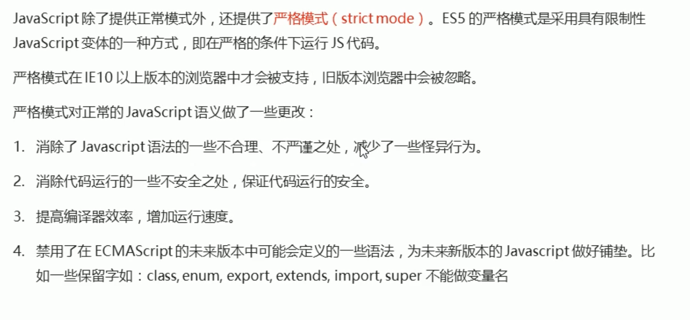
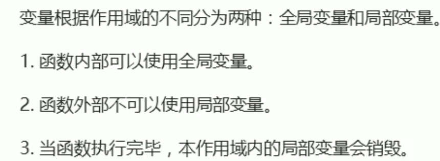
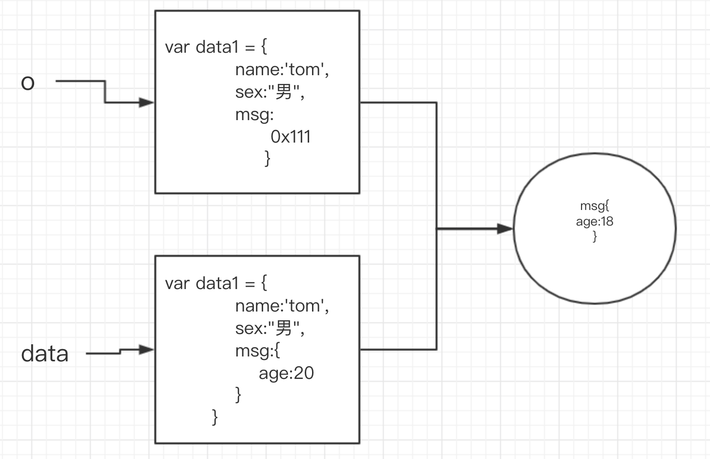
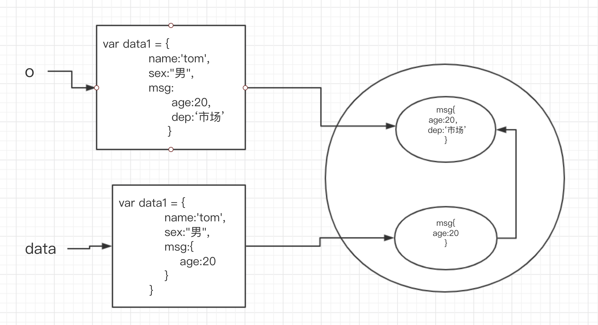

# 函数进阶

### 函数的定义方式

1. 命名函数

```js
function foo () {}
```

2. 匿名函数

```js
var foo = function(){}
```

### 函数的调用方式

1. 普通函数

```js
function foo () {
    console.log("普通函数的调用")
}
foo();//foo.call()
```

2. 构造函数

```js
function Person(){
    
}
var p = new Person()
```

3. 对象方法

```js
var obj = {
    saiHi:function(){
        console.log("hi")
    }
}
obj.saiHi()
```

4. 绑定事件函数

```js
btn.onclick = function(){}
```

5. 定时器函数

```js
setInterval(function(){
    
},1000)
```

6. 立即执行函数

```js
(function(){})();
```


### 函数内 `this` 指向的不同场景

函数的调用方式决定了 `this` 指向的不同：

| 调用方式     | 非严格模式     | 备注                         |
| ------------ | -------------- | ---------------------------- |
| 普通函数调用 | window         | 严格模式下是 undefined       |
| 构造函数调用 | 实例对象       | 原型方法中 this 也是实例对象 |
| 对象方法调用 | 该方法所属对象 | 紧挨着的对象                 |
| 事件绑定方法 | 绑定事件对象   |                              |
| 定时器函数   | window         |                              |
| 立即执行函数 | window         |                              |

这就是对函数内部 this 指向的基本整理，写代码写多了自然而然就熟悉了。

严格模式（了解）<https://www.runoob.com/js/js-strict.html>



## apply方法

`apply()` 方法调用一个函数, 其具有一个指定的 `this` 值，以及作为一个数组（或类似数组的对象）提供的参数。

<p class="danger">
  注意：该方法的作用和 `call()` 方法类似，只有一个区别，就是 `call()` 方法接受的是若干个参数的列表，而 `apply()` 方法接受的是一个包含多个参数的数组。
</p>

语法：

```javascript
fun.apply(thisArg, [argsArray])
如下：
fun.apply(this, ['eat', 'bananas'])
```

参数：

- `thisArg`
- `argsArray`

`apply()` 与 `call()` 非常相似，不同之处在于提供参数的方式。
`apply()` 使用参数数组而不是一组参数列表。例如：

```javascript
function foo(arr){
    console.log(this);//window
    console.log(arr);//打印的不是数组，是字符串pink
}

foo.apply(null,['pink'])//不改变指向传null
```

```html
<!DOCTYPE html>
<html lang="en">

<head>
    <meta charset="UTF-8">
    <meta name="viewport" content="width=device-width, initial-scale=1.0">
    <meta http-equiv="X-UA-Compatible" content="ie=edge">
    <title>Document</title>
</head>

<body>
    <script>
        var arr = [3, 42, 31, 3, 5, 465, 6, 99]
        function foo(arr) {
            console.log(this);//window
            console.log(arr);//打印的不是数组，是字符串pink
        }

        foo.apply(null, ['pink'])
		//求数组中的最大值，Math.max()  数组没有去最大值的方法
        var max = Math.max.apply(null, arr)//这里Math是调用者，可以把null也成Math更合适
        console.log(max);

    </script>
</body>

</html>
```


## bind

bind() 方法不会调用函数，但是能改变函数内部this指向

语法：

```js
fun.bind(thisArg[, arg1[, arg2[, ...]]])
```

参数：

- thisArg
  - 当绑定函数被调用时，该参数会作为原函数运行时的 this 指向。当使用new 操作符调用绑定函数时，该参数无效。
- arg1, arg2, ...
  - 当绑定函数被调用时，这些参数将置于实参之前传递给被绑定的方法。

返回值：

- 返回由指定的this值和初始化参数改造的原函数拷贝。

```html
<!DOCTYPE html>
<html lang="en">

<head>
    <meta charset="UTF-8">
    <meta name="viewport" content="width=device-width, initial-scale=1.0">
    <title>Document</title>

</head>

<body>
    <script>
        var obj = {
            name:'tom'
        }
        function foo(){
            console.log(this);//指向window
        }
       var fn =  foo.bind(obj)//改变this的指向为obj，但是不调用，接收返回值
       fn()
        
        
        function show(a,b){
            console.log(a+b)
        }
        var f = show.bind(null,1,2)
        f()
    </script>
</body>

</html>
```

如果有的函数我们不需要立即调用，但是又想改变这个函数内部的this指向，此时用bind

#### 案例：我们有一个按钮，当我们点击之后，就禁用这个按钮，3秒后在开启这个按钮

```html
<!DOCTYPE html>
<html lang="en">

<head>
    <meta charset="UTF-8">
    <meta name="viewport" content="width=device-width, initial-scale=1.0">
    <title>Document</title>

</head>

<body>
    <button>按钮</button>
    <script>
       var btn = document.querySelector('button')
       btn.onclick = function(){
           this.disabled  = true
           setInterval(function(){
                this.disabled = false //定时器里的this指向window
           },3000)
       }
    </script>
</body>

</html>
```

更改

```html
<!DOCTYPE html>
<html lang="en">

<head>
    <meta charset="UTF-8">
    <meta name="viewport" content="width=device-width, initial-scale=1.0">
    <title>Document</title>

</head>

<body>
    <button>按钮</button>
    <script>
       var btn = document.querySelector('button')
       btn.onclick = function(){
           this.disabled  = true //this指向btn
           var that = this
           setInterval(function(){
            that.disabled = false //定时器里的this指向window
           },3000)
       }
    </script>
</body>

</html>
```

使用bind方法

```html
<!DOCTYPE html>
<html lang="en">

<head>
    <meta charset="UTF-8">
    <meta name="viewport" content="width=device-width, initial-scale=1.0">
    <title>Document</title>

</head>

<body>
    <button>按钮</button>
    <script>
        var btn = document.querySelector('button')
        btn.onclick = function () {
            this.disabled = true //this指向btn
            //    var that = this
            setInterval(function () {
                this.disabled = false //定时器里的this指向window
            }.bind(this), 3000)
            // 不需要立即执行，有定时器决定时间，所以不能使用apply call 
        }
    </script>
</body>

</html>
```


#### 小结

- call 和 apply 特性一样
  - 都是用来调用函数，而且是立即调用
  - 但是可以在调用函数的同时，通过第一个参数指定函数内部 `this` 的指向
  - call 调用的时候，参数必须以参数列表的形式进行传递，也就是以逗号分隔的方式依次传递即可
  - apply 调用的时候，参数必须是一个数组，然后在执行的时候，会将数组内部的元素一个一个拿出来，与形参一一对应进行传递
  - 如果第一个参数指定了 `null` 或者 `undefined` 则内部 this 指向 window
- bind
  - 可以用来指定内部 this 的指向，然后生成一个改变了 this 指向的新的函数
  - 它和 call、apply 最大的区别是：bind 不会调用
  - bind 支持传递参数，它的传参方式比较特殊，一共有两个位置可以传递
    - 1. 在 bind 的同时，以参数列表的形式进行传递
    - 1. 在调用的时候，以参数列表的形式进行传递
    - 那到底以谁 bind 的时候传递的参数为准呢还是以调用的时候传递的参数为准
    - 两者合并：bind 的时候传递的参数和调用的时候传递的参数会合并到一起，传递到函数内部

### 高阶函数

- 函数可以作为参数
- 函数可以作为返回值

#### 作为参数

```javascript
function sum(a,b,callback){
    console.log(a+b);
    callback && callback();//有参数才调用
}

sum(1,2,function(){
    console.log("求和之后调用的！")
})
```

#### 作为返回值

```javascript
function foo(){
    return function(){}
}
foo()
```

```html
<!DOCTYPE html>
<html lang="en">

<head>
    <meta charset="UTF-8">
    <meta name="viewport" content="width=device-width, initial-scale=1.0">
    <title>Document</title>
</head>

<body>
    <script>
        function sum(a, b, callback) {
            console.log(a + b);
            callback && callback();//有参数才调用
        }

        sum(1, 2, function () {
            console.log("求和之后调用的！")
        })
        function foo(){
            return function(){
                return 123
            }
        }
        var a = foo()
        console.log(a);
        var n = a()
        console.log(n);
        
        
    </script>
</body>

</html>
```


# 函数闭包



## 什么是闭包

闭包就是能够读取其他函数内部变量的函数，
由于在 Javascript 语言中，只有函数内部的子函数才能读取局部变量，
因此可以把闭包简单理解成 “定义在一个函数内部的函数”。
所以，在本质上，闭包就是将函数内部和函数外部连接起来的一座桥梁。

闭包的用途：

- 可以在函数外部读取函数内部成员
- 让函数内成员始终存活在内存中

#### 

```html
<!DOCTYPE html>
<html lang="en">

<head>
    <meta charset="UTF-8">
    <meta name="viewport" content="width=device-width, initial-scale=1.0">
    <title>Document</title>
</head>

<body>
    <script>
        function show() {
            var num = 100
            function fn(){
                console.log(num);
            }
            return fn
        }
        // console.log(num);
        show()()
    </script>
</body>

</html>
```

#### 小结

- 闭包是一个函数，在一个作用域中可以访问另外一个作用域的变量

### 案例：闭包应用-点击li输出当前li的索引号

```html

<!DOCTYPE html>
<html lang="en">

<head>
    <meta charset="UTF-8">
    <meta name="viewport" content="width=device-width, initial-scale=1.0">
    <meta http-equiv="X-UA-Compatible" content="ie=edge">
    <title>Document</title>
</head>

<body>
    <ul class="nav">
        <li>榴莲</li>
        <li>臭豆腐</li>
        <li>鲱鱼罐头</li>
        <li>大猪蹄子</li>
    </ul>
    <script>
        // 闭包应用-点击li输出当前li的索引号
        // 1. 我们可以利用动态添加属性的方式
        var lis = document.querySelector('.nav').querySelectorAll('li');
        for (var i = 0; i < lis.length; i++) {
            lis[i].index = i;
            lis[i].onclick = function() {
                // console.log(i);
                console.log(this.index);

            }
        }
        // 2. 利用闭包的方式得到当前小li 的索引号
        for (var i = 0; i < lis.length; i++) {
            // 利用for循环创建了4个立即执行函数
            // 立即执行函数也成为小闭包因为立即执行函数里面的任何一个函数都可以使用它的i这变量
            (function(i) {
                // console.log(i);
                lis[i].onclick = function() {
                    console.log(i);

                }
            })(i);
        }
    </script>
</body>

</html>
```


# 函数递归

- 函数内部自己调用自己，这个函数就是递归
- 作用和循环一样，但是容易发生死循环（栈溢出）

#### 递归执行模型

```javascript
function fn(){
    fn()
}
fn()//死递归

```

必须加退出条件

```js
var num = 1;
function fn(){
    console.log("我是递归")
    if(num>10){
        return;
    }
    num++;
    fn()
}
fn()
```

### 举个栗子：

##### 斐波那契数列

```js
// 1、1、2、3、5、8
// 用户输入一个数字 n 求出这个数字对应的序列值(输入6 对应的是8)
// 我们只需要知道用户输入的n，那么前面两项（n-1  n-2）
function fb(n) {
    if(n==1 || n==2){
        return 1;
    }
    return fb(n-1)+fb(n-2);
}

console.log(fb(3));//2
console.log(fb(6));//8
// fn5+fn4
// fn4+fn3+fn3+1
// fn3+1+1+1+1+1+1
// 1+1+1+1+1+1+1+1
```

##### 根据输入的id，返回数据对象

数据

```json
var data = [{
    id:1,
    name:'家电',
    goods:[{
        id:11,
        gname:'冰箱'
    },{
        id:12,
        gname:'洗衣机'
    }]
},{
    id:2,
    name:'服饰'
}]
```

```js
//我们想要输入id，就可以获取数据对象
//forEach遍历
function getId(json, id) {
    json.forEach(element => {
        if(element.id == id){
            console.log(element);
        }else if(element.goods && element.goods.length>0){
            //里面有goods 这个数组 并且 数组的长度不为0
            getId(element.goods,id)
        }
    });
}

getId(data, 1);
getId(data, 12);
```

不打印，而是获取数据

```html
<!DOCTYPE html>
<html lang="en">

<head>
    <meta charset="UTF-8">
    <meta name="viewport" content="width=device-width, initial-scale=1.0">
    <meta http-equiv="X-UA-Compatible" content="ie=edge">
    <title>Document</title>
</head>

<body>
    <script>
        var data = [{
            id: 1,
            name: '家电',
            goods: [{
                id: 11,
                gname: '冰箱'
            }, {
                id: 12,
                gname: '洗衣机'
            }]
        }, {
            id: 2,
            name: '服饰'
        }]
        //我们想要输入id，就可以获取数据对象
        //forEach遍历
        function getId(json, id) {
            var o ={};
            json.forEach(element => {
                if(element.id == id){
                    // console.log(element);
                    o = element;
                    return o;
                }else if(element.goods && element.goods.length>0){
                    //里面有goods 这个数组 并且 数组的长度不为0
                   o =  getId(element.goods,id)
                }
            });

            return o;
        }

       console.log(getId(data, 1));
       console.log(getId(data, 12));
    </script>
</body>

</html>
```

# 浅拷贝和深拷贝

1. 浅拷贝只是拷贝一层，更深层次对象级别的只拷贝引用（地址值）
2. 深拷贝拷贝多层，每一级别的数据都会拷贝

### 浅拷贝

```js
//浅拷贝
        var data = {
            name:'tom',
            sex:"男"
        }
        var o = {}
        for(var k in data){
            o[k] = data[k]
        }
        console.log(o);
        

        var data1 = {
            name:'tom',
            sex:"男",
            msg:{
                age:20
            }
        }
        var o1 = {}
        for(var k1 in data1){
            o1[k1] = data1[k1]
        }
        console.log(o1);//age是20，但是浅拷贝 拷贝是地址值，修改o1的年龄，data1也随之修改
        o1.msg.age = 100
        console.log(data1);//100
        

```



##### ES6新语法

```js
var data1 = {
    name:'tom',
    sex:"男",
    msg:{
        age:20
    }
}
var o1 = {}
Object.assign(o1,data1)
console.log(o1);//age是20，但是浅拷贝 拷贝是地址值，修改o1的年龄，data1也随之修改
o1.msg.age = 100
console.log(data1);//100
```

### 深拷贝



```js
var data = {
    name: 'tom',
    sex: "男",
    msg: {
        age: 20
    },
    color:['pink','red']
}
var o = {}

function deepCopy(newObj, oldObj) {
    for(var k in oldObj){
        //如果是简单类型 直接拷贝，复杂类型进入后在拷贝
        //获取属性值oldObj[k]
        var item = oldObj[k]
        if(item instanceof Array){//数组也属于对象，必须先判断数组
            newObj[k] = []
            deepCopy(newObj[k],item)
        }else if(item instanceof Object){
            newObj[k] = {}
            deepCopy(newObj[k],item)
        }else{
            newObj[k] = item;
        }
    }
}

deepCopy(o,data);
console.log(o);

o.msg.age =100;
console.log(data);//没有被修改
```

# 递归应用场景

- 深拷贝
- 菜单树
- 遍历 DOM 树

# 作业

分析下面代码结果,并说明原因

1、

```js
this.x = 9; 
var module = {
  x: 81,
  getX: function() { return this.x; }
};

module.getX(); 

var retrieveX = module.getX;
retrieveX(); 


var boundGetX = retrieveX.bind(module);
boundGetX(); 


```

2、

```js
function LateBloomer() {
  this.petalCount = Math.ceil(Math.random() * 12) + 1;
}


LateBloomer.prototype.bloom = function() {
  window.setTimeout(this.declare.bind(this), 1000);
};

LateBloomer.prototype.declare = function() {
  console.log('I am a beautiful flower with ' +
    this.petalCount + ' petals!');
};

var flower = new LateBloomer();
flower.bloom();


```

#### 闭包的思考题

- 有没有闭包的产生
- 结果是什么？

思考题 1：

```javascript
var name = "The Window";
var object = {
  name: "My Object",
  getNameFunc: function () {
    return function () {
      return this.name;
    };
  }
};

console.log(object.getNameFunc()())

```

思考题 2：

```javascript
var name = "The Window";　　
var object = {　　　　
  name: "My Object",
  getNameFunc: function () {
    var that = this;
    return function () {
      return that.name;
    };
  }
};
console.log(object.getNameFunc()())

```

#### 


#### 答案

示例1：

```javascript
this.x = 9; 
var module = {
  x: 81,
  getX: function() { return this.x; }
};

module.getX(); // 返回 81

var retrieveX = module.getX;
retrieveX(); // 返回 9, 在这种情况下，"this"指向全局作用域

// 创建一个新函数，将"this"绑定到module对象
// 新手可能会被全局的x变量和module里的属性x所迷惑
var boundGetX = retrieveX.bind(module);
boundGetX(); // 返回 81

```

示例2：

```javascript
function LateBloomer() {
  this.petalCount = Math.ceil(Math.random() * 12) + 1;
}

// Declare bloom after a delay of 1 second
LateBloomer.prototype.bloom = function() {
  window.setTimeout(this.declare.bind(this), 1000);
};

LateBloomer.prototype.declare = function() {
  console.log('I am a beautiful flower with ' +
    this.petalCount + ' petals!');
};

var flower = new LateBloomer();
flower.bloom();  // 一秒钟后, 调用'declare'方法

```

#### 闭包的思考题

- 有没有闭包的产生
- 结果是什么？

思考题 1：

```javascript
var name = "The Window";
var object = {
  name: "My Object",
  getNameFunc: function () {
    return function () {
      return this.name;
    };
  }
};

console.log(object.getNameFunc()())//The Window
//object.getNameFunc()() => var f = object.getNameFunc()   f()  this指向的是window  全局属性是挂载到window下的
//没有闭包的产生，函数内没有局部变量
```

思考题 2：

```javascript
var name = "The Window";　　
var object = {　　　　
  name: "My Object",
  getNameFunc: function () {
    var that = this;//此时的this指向的是调用者=》object
    return function () {
      return that.name;
    };
  }
};
console.log(object.getNameFunc()())//My Object，有闭包的产生，使用了局部变量

```

#### 