# html5发展之路

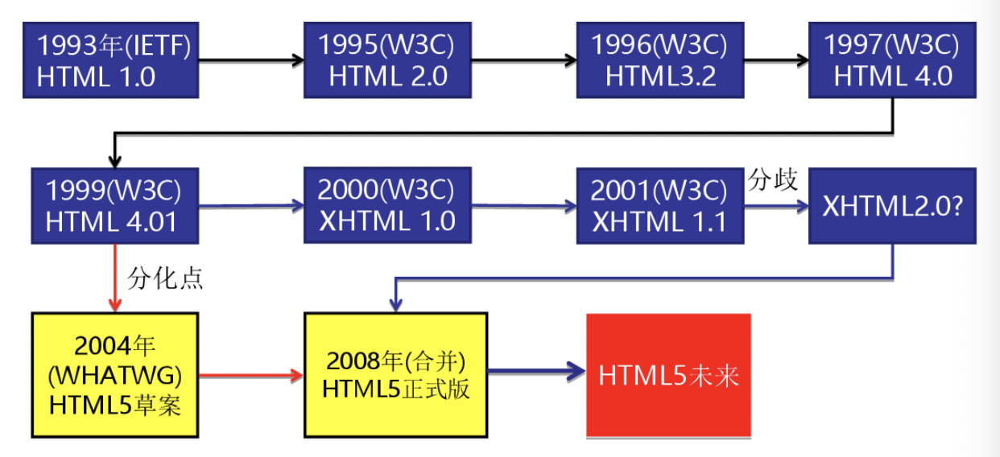

#### 什么是XHTML

XHTML 是更严格更纯净的 HTML 代码。

- XHTML 指**可扩展超文本标签语言**（EXtensible HyperText Markup Language）。
- XHTML 的目标是取代 HTML。
- XHTML 与 HTML 4.01 几乎是相同的。
- XHTML 是更严格更纯净的 HTML 版本。
- XHTML 是作为一种 XML 应用被重新定义的 HTML。
- XHTML 是一个 W3C 标准。

#### HTML和 XHTML之间有什么区别?

- XHTML 指的是可扩展超文本标记语言
- XHTML 与 HTML 4.01 几乎是相同的
- XHTML 是更严格更纯净的 HTML 版本
- XHTML 是以 XML 应用的方式定义的 HTML
- XHTML 是 2001 年 1 月发布的 W3C 推荐标准
- XHTML 得到所有主流浏览器的支持
- XHTML 元素是以 XML 格式编写的 HTML 元素。XHTML是严格版本的HTML，例如它要求标签必须小写，标签必须被正确关闭，标签顺序必须正确排列，对于属性都必须使用双引号等。


# 一、什么是 `HTML5`

1. ## `HTML5` 的概念与定义 

   - 定义：`HTML5` 定义了 `HTML` 标准的最新版本，是对 `HTML` 的第五次重大修改，号称下一代的 `HTML` 
   - 两个概念：
     - 是一个新版本的 `HTML` 语言，定义了新的标签、特性和属性
     - 拥有一个强大的技术集，这些技术集是指： `HTML5` 、`CSS3` 、`javascript`, 这也是广义上的 `HTML5`

2. ## `HTML5` 拓展了哪些内容

   - 语义化标签
   - 本地存储
   - 兼容特性
   - `2D`、`3D` 
   - 动画、过渡
   - `CSS3` 特性
   - 性能与集成

3. ## `HTML5 ` 的现状

   绝对多数新的属性，都已经被浏览器所支持，最新版本的浏览器已经开始陆续支持最新的特性，

   总的来说：`HTML5` 已经是大势所趋


# 二、`HTML5 ` 新增标签

1. 什么是语义化
2. 新增了那些语义化标签
   - `header`   ---  头部标签
   - `nav`        ---  导航标签
   - `article` ---   内容标签
   - `section` ---   块级标签
   - `aside`     ---   侧边栏标签
   - `footer`   ---   尾部标签

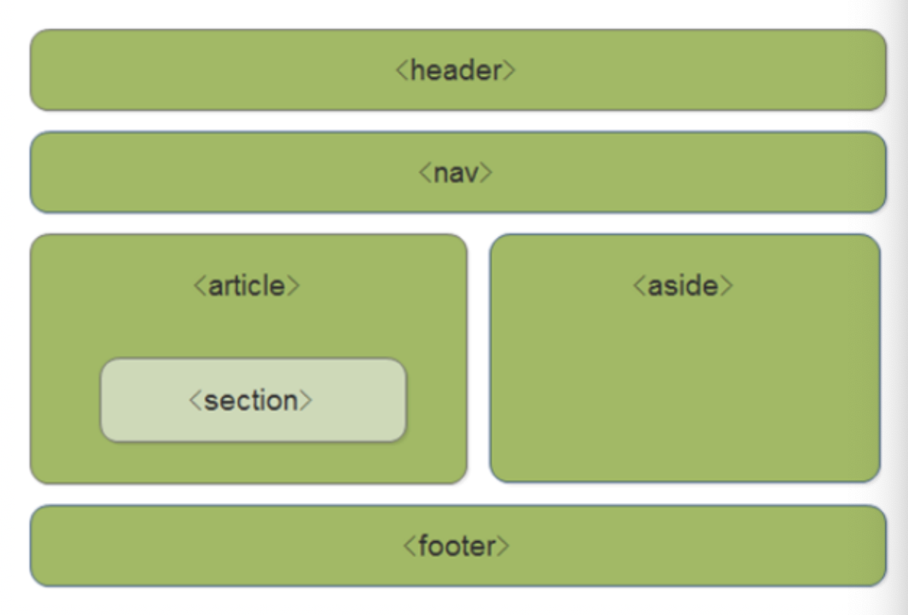

1. 使用语义化标签的注意
   - 语义化标签主要针对搜索引擎
   - 新标签可以使用一次或者多次
   - 在 `IE9` 浏览器中，需要把语义化标签都转换为块级元素
   - 语义化标签，在移动端支持比较友好，
   - 另外，`HTML5` 新增的了很多的语义化标签，随着课程深入，还会学习到其他的

# 三、多媒体音频标签

1. 多媒体标签有两个，分别是

   - 音频  -- `audio`
   - 视频  -- `video`

2. `audio` 标签说明

   - 可以在不使用标签的情况下，也能够原生的支持音频格式文件的播放，
   - 但是：播放格式是有限的

3. audio 支持的音频格式

   - audio 目前支持三种格式

     ​

   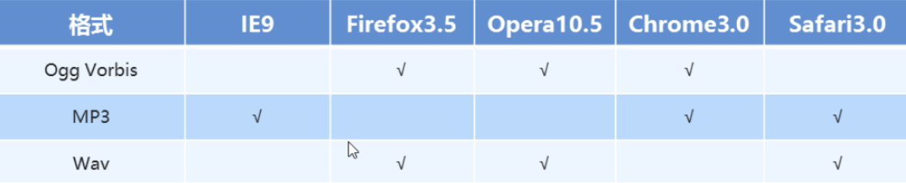

4. audio 的参数

   ​

   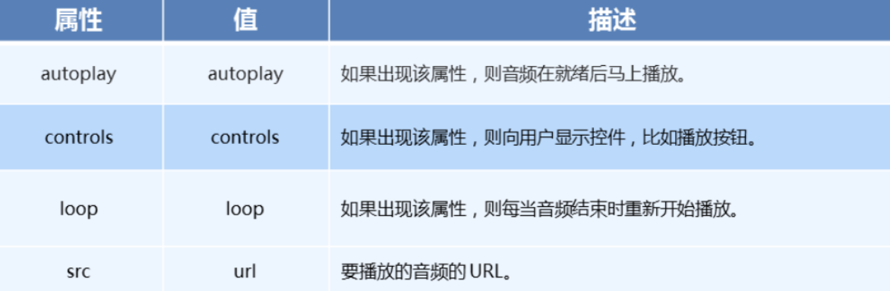

5、audio 代码演示

```css
<body>
  <!-- 注意：在 chrome 浏览器中已经禁用了 autoplay 属性 -->
  <!-- <audio src="./media/snow.mp3" controls autoplay></audio> -->

  <!-- 
    因为不同浏览器支持不同的格式，所以我们采取的方案是这个音频准备多个文件
   -->
  <audio controls>
    <source src="./media/snow.mp3" type="audio/mpeg" />
   <source src="horse.ogg" type="audio/ogg">
   <source src="horse.mp3" type="audio/mpeg">
  </audio>
</body>
```

# 四、多媒体视频标签

1. video 视频标签

   - 目前支持三种格式

   ​

   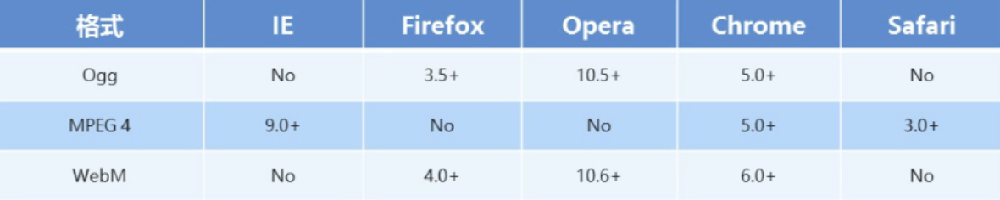

2. 语法格式

   ```html
   <video src="./media/video.mp4" controls="controls"></video>
   ```

3. video 参数

   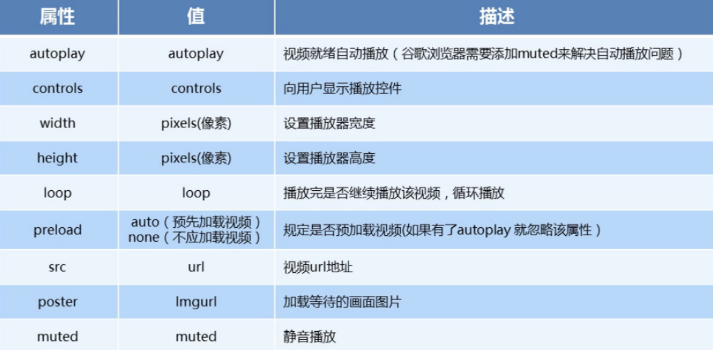

   ​

4. video 代码演示

   ```html
   <body>
     <!-- <video src="./media/video.mp4" controls="controls"></video> -->
   
     <!-- 谷歌浏览器禁用了自动播放功能，如果想自动播放，需要添加 muted 属性 -->
     <video controls="controls" autoplay muted loop poster="./media/pig.jpg">
       <source src="./media/video.mp4" type="video/mp4">
       <source src="./media/video.ogg" type="video/ogg">
     </video>
   </body>
   ```

5. 多媒体标签总结

   - 音频标签与视频标签使用基本一致
   - 多媒体标签在不同浏览器下情况不同，存在兼容性问题
   - 谷歌浏览器把音频和视频标签的自动播放都禁止了
   - 谷歌浏览器中视频添加 muted 标签可以自己播放
   - 注意：重点记住使用方法以及自动播放即可，其他属性可以在使用时查找对应的手册

6. ### 小米案例

```html
<!DOCTYPE html>
<html lang="en">

<head>
    <meta charset="UTF-8">
    <meta name="viewport" content="width=device-width, initial-scale=1.0">
    <meta http-equiv="X-UA-Compatible" content="ie=edge">
    <title>Document</title>
    <style>
        * {
            margin: 0;
            padding: 0;
        }

        .bg {
            width: 100%;
            height: calc(100vh);
            position: relative;
        }

        .bg img {
            width: 100%;
            height: 100%;
        }

        .phone {
            position: absolute;
            top: 80px;
            left: 290px;
            z-index: 1;
        }

        .phone img {
            width: 450px;
            height: 520px;
        }

        video {

            position: absolute;
            top: 95px;
            left: 435px;
            width: 277px;
        }
    </style>
</head>

<body>
    <div>
        <div class="bg">
            
        </div>
        <div class="phone">
            
        </div>
        <div>
            <video src="/资料/video.mp4" muted loop autoplay></video>
        </div>
    </div>
</body>

</html>
```


# 六、文件读取

通过FileReader对象我们可以读取本地存储的文件，使用 File 对象来指定所要读取的文件或数据。其中File对象可以是来自用户在一个 [ ](https://developer.mozilla.org/zh-CN/docs/HTML/Element/input)元素上选择文件后返回的FileList 对象，也可以来自由拖放操作生成的  DataTransfer

###  Files对象

由于HTML5中我们可以通过为表单元素添加multiple属性，因此我们通过<input>上传文件后得到的是一个Files对象（伪数组形式）。

```html
 <input type="file" multiple>
```

- multiple  多文件上传

```html
<!DOCTYPE html>
<html lang="en">
<head>
    <meta charset="UTF-8">
    <meta name="viewport" content="width=device-width, initial-scale=1.0">
    <meta http-equiv="X-UA-Compatible" content="ie=edge">
    <title>Document</title>
</head>
<body>
    <input type="file" multiple>
    <script>
        var file = document.querySelector('input');
        file.onchange =function(){
            console.log(this.files);
        }
    </script>
</body>
</html>
```

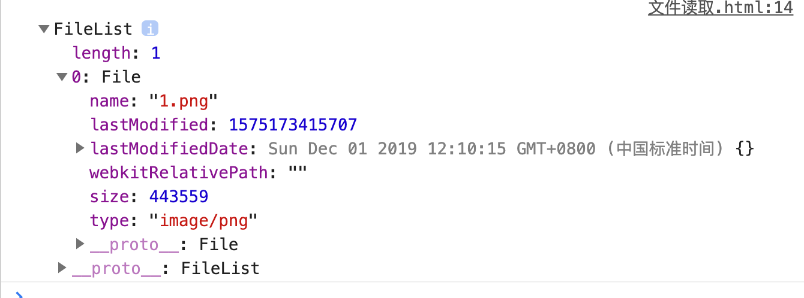

### FileReader对象

HTML5新增内建对象，可以读取本地文件内容。

var reader = new FileReader; 可以实例化一个对象

readAsDataURL  字节流

readAsText 字符流

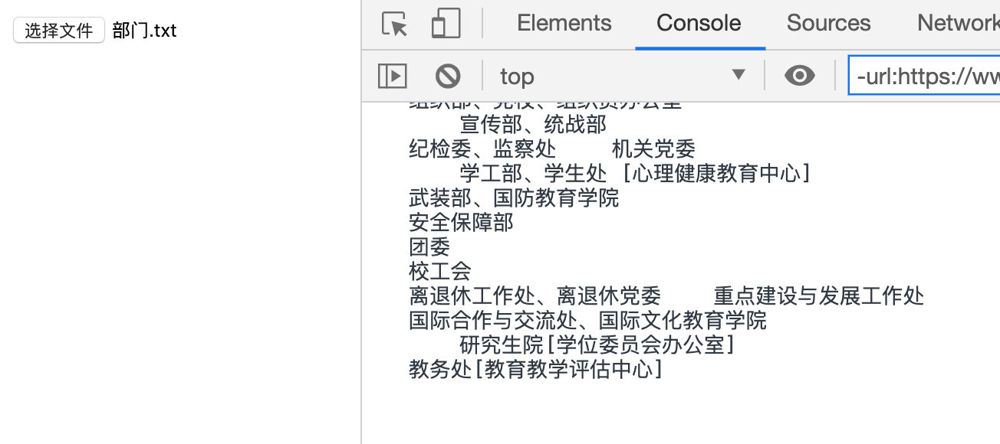

```html
<!DOCTYPE html>
<html lang="en">

<head>
    <meta charset="UTF-8">
    <meta name="viewport" content="width=device-width, initial-scale=1.0">
    <meta http-equiv="X-UA-Compatible" content="ie=edge">
    <title>Document</title>
</head>

<body>
    <input type="file" multiple>
    <script>
        var file = document.querySelector('input');
        file.onchange = function () {
            // console.log(this.files);
            var read = new FileReader()
            // 读取文件
            read.readAsText(this.files[0])//读取第一个文件
            // 读取完成后触发onload事件
            read.onload = function () {
                // 读取的内容默认存放到result中
                console.log(read.result);
            }
        }
    </script>
</body>

</html>
```

改造：

```html
<!DOCTYPE html>
<html lang="en">

<head>
    <meta charset="UTF-8">
    <meta name="viewport" content="width=device-width, initial-scale=1.0">
    <meta http-equiv="X-UA-Compatible" content="ie=edge">
    <title>Document</title>
</head>

<body>
    <input type="file" multiple>
    <div></div>
    <script>
        var file = document.querySelector('input');
        var div = document.querySelector('div');
        file.onchange = function () {
            // console.log(this.files);
            var read = new FileReader()
            // 读取文件
            read.readAsText(this.files[0])//读取第一个文件
            // 读取完成后触发onload事件
            read.onload = function () {
                // 读取的内容默认存放到result中
                // console.log(read.result);
                div.innerHTML = this.result
            }
        }
    </script>
</body>

</html>
```

### 读取图片

```html
<!DOCTYPE html>
<html lang="en">

<head>
    <meta charset="UTF-8">
    <meta name="viewport" content="width=device-width, initial-scale=1.0">
    <meta http-equiv="X-UA-Compatible" content="ie=edge">
    <title>Document</title>
</head>

<body>
    <input type="file" multiple>
    </img>
    <script>
        var file = document.querySelector('input');
        var img = document.querySelector('img');
        file.onchange = function () {
            // console.log(this.files);
            var read = new FileReader()
            // 读取文件
            read.readAsDataURL(this.files[0])//读取第一个文件
            // 读取完成后触发onload事件
            read.onload = function () {
                // 读取的内容默认存放到result中
                // console.log(read.result);
                img.src = this.result
            }
        }
    </script>
</body>

</html>
```

# 七、地图定位

在HTML规范中，增加了获取用户地理信息的API，这样使得我们可以基于用户位置开发互联网应用，即基于位置服务 (Location Base Service)

```html
1、获取当前地理信息

navigator.geolocation.getCurrentPosition(successCallback, errorCallback) 

2、重复获取当前地理信息

navigator. geolocation.watchPosition(successCallback, errorCallback)

当成功获取地理信息后，会调用succssCallback，并返回一个包含位置信息的对象position。

position.coords.latitude 纬度

position.coords.longitude经度

position.coords.accuracy精度

position.coords.altitude海拔高度

当获取地理信息失败后，会调用errorCallback，并返回错误信息error
```

谷歌浏览器用到的了谷歌服务，需要翻墙，使用其他浏览器打开

```html
<!DOCTYPE html>
<html lang="en">

<head>
    <meta charset="UTF-8">
    <meta name="viewport" content="width=device-width, initial-scale=1.0">
    <meta http-equiv="X-UA-Compatible" content="ie=edge">
    <title>Document</title>
    <style>
        * {
            margin: 0;
            padding: 0;
        }

        #box {
            width: 500px;
            height: 500px;
            border: 2px solid deeppink;
        }
    </style>
</head>

<body>
    <button id='btn'> 请求位置信息 </button>
    <div id="box"></div>

    <script>
        let btn = document.getElementById('btn');
        let box = document.getElementById('box');

        //点击按钮获取地理位置信息
        btn.onclick = function () {
            //getCurrentPosition与定时器setInterval类似多次请求，因为位置需要不间断的获取
            //直接navigator.geolocation表示单次获取位置
            navigator.geolocation.getCurrentPosition(function (position) {
                box.innerHTML += "经度" + position.coords.longitude;
                box.innerHTML += "纬度" + position.coords.latitude;
                box.innerHTML += "准确度" + position.coords.accuracy;
                box.innerHTML += "海拔" + position.coords.altitude;
                box.innerHTML += "海拔准确度" + position.coords.altitudeAcuracy;
                box.innerHTML += "行进方向" + position.coords.heading;
                box.innerHTML += "地面速度" + position.coords.speed;
                box.innerHTML += "请求的时间" + new Date(position.timestamp);
            }, function (err) {
                alert(err.code);
                //              code：返回获取位置的状态
                //              0  :  不包括其他错误编号中的错误
                // ​		     1  :  用户拒绝浏览器获取位置信息
                // ​		     2  :  尝试获取用户信息，但失败了
                // ​		     3  :   设置了timeout值，获取位置超时了
            }, {
                enableHighAcuracy: false, //位置是否精确获取
                timeout: 100000,            //获取位置允许的最长时间
                maximumAge: 1000          //多久更新获取一次位置
            })
        }
    </script>
</body>

</html>
```


http://lbsyun.baidu.com/   百度地图api

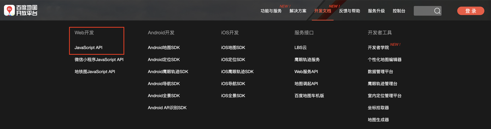

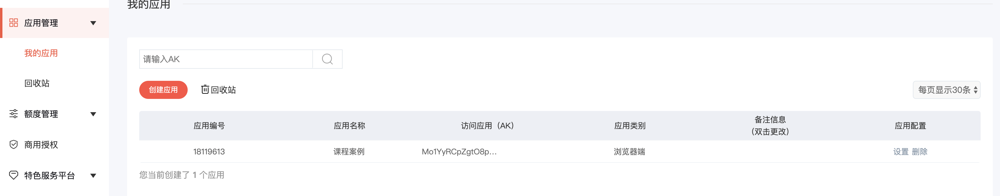

Mo1YyRCpZgtO8pLuGutf3P8kEaotgtOq

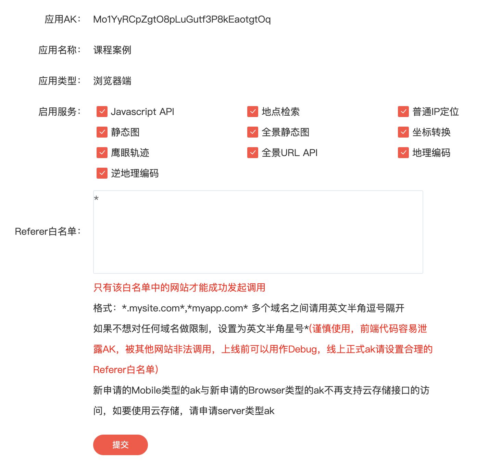

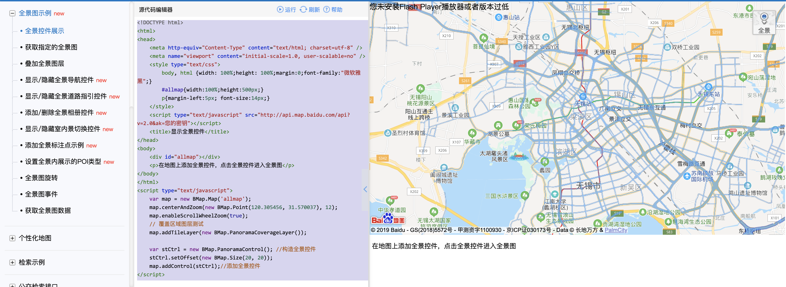

```html
<!DOCTYPE html>
<html>
<head>
	<meta http-equiv="Content-Type" content="text/html; charset=utf-8" />
	<meta name="viewport" content="initial-scale=1.0, user-scalable=no" />
	<style type="text/css">
		body, html {width: 100%;height: 100%;margin:0;font-family:"微软雅黑";}
		#allmap{width:100%;height:500px;}
		p{margin-left:5px; font-size:14px;}
    </style>
    <!-- !!!更改自己的key -->
    <script type="text/javascript"
     src="//api.map.baidu.com/api?v=2.0&ak=Mo1YyRCpZgtO8pLuGutf3P8kEaotgtOq"></script>
	<title>显示全景控件</title>
</head>
<body>
	<div id="allmap"></div>
	<p>在地图上添加全景控件，点击全景控件进入全景图</p>
</body>
</html>
<script type="text/javascript">
	var map = new BMap.Map('allmap');
	map.centerAndZoom(new BMap.Point(126.5362, 45.80227), 12);
	map.enableScrollWheelZoom(true);
	// 覆盖区域图层测试
	map.addTileLayer(new BMap.PanoramaCoverageLayer());

	var stCtrl = new BMap.PanoramaControl(); //构造全景控件
	stCtrl.setOffset(new BMap.Size(20, 20));
	map.addControl(stCtrl);//添加全景控件
</script>

```

# 八、本地存储-cookie

Cookie是一段不超过4KB的小型文本数据，由一个名称（Name）、一个值（Value）和其它几个用于控制Cookie有效期、安全性、使用范围的可选属性组成。

HTTP协议本身是无状态的。什么是无状态呢，即服务器无法判断用户身份。客户端向服务器发起请求，如果服务器需要记录该用户状态，就使用response向客户端浏览器颁发一个Cookie。客户端浏览器会把Cookie保存起来。当浏览器再请求该网站时，浏览器把请求的网址连同该Cookie一同提交给服务器。服务器检查该Cookie，以此来辨认用户状态。

打个比方，我们去银行办理储蓄业务，第一次给你办了张银行卡，里面存放了身份证、密码、手机等个人信息。当你下次再来这个银行时，银行机器能识别你的卡，从而能够直接办理业务。

1、创建 cookie

```js
document.cookie = "username=Bill Gates";
```

2、您还可以添加有效日期（UTC 时间）。默认情况下，在浏览器关闭时会删除 cookie：

```js
document.cookie = "username=John Doe; expires=Sun, 31 Dec 2017 12:00:00 UTC";
```

3、通过 path 参数，您可以告诉浏览器 cookie 属于什么路径。默认情况下，cookie 属于当前页。

```js
document.cookie = "username=Bill Gates; expires=Sun, 31 Dec 2017 12:00:00 UTC; path=/";
```

```js
function setCookie(cname, cvalue, exdays) {
    var d = new Date();
    d.setTime(d.getTime() + (exdays*24*60*60*1000));
    var expires = "expires="+ d.toUTCString();//世界时间表示
    document.cookie = cname + "=" + cvalue + ";" + expires + ";path=/";
} 
```

4、读取 cookie

```js
var x = document.cookie;
```

5、改变 cookie,旧 cookie 被覆盖。

```js
document.cookie = "username=Steve Jobs; expires=Sun, 31 Dec 2017 12:00:00 UTC; path=/";
```

6、 删除 cookie,删除 cookie 时不必指定 cookie 值：直接把 expires 参数设置为过去的日期即可：

```js
document.cookie = "username=; expires=Thu, 01 Jan 1970 00:00:00 UTC; path=/;";
```

### 案例：记住用户名

```html
<!DOCTYPE html>
<html lang="en">

<head>
    <meta charset="UTF-8">
    <meta name="viewport" content="width=device-width, initial-scale=1.0">
    <title>Document</title>
</head>

<body>
    <form action="#">
        用户名<input type="text" id="username" value="">
        <input type="submit" value="提交" id="btn">
    </form>
    <script>
        var btn = document.querySelector('#btn')
        var username = document.querySelector('#username')
        btn.onclick = function () {
            document.cookie = "username=" + username.value
            document.cookie = "password=" + username.value
        }
        // 获取cookie
        var str = document.cookie
        if (str.search('username')!=-1) {
            var name = str.split(';')[0].split('=')[1]
            username.value = name
        }else{
            username.value = ''
        }


    </script>
</body>

</html>
```


# 作业

### 1、视频背景


### 2、制作地图名片

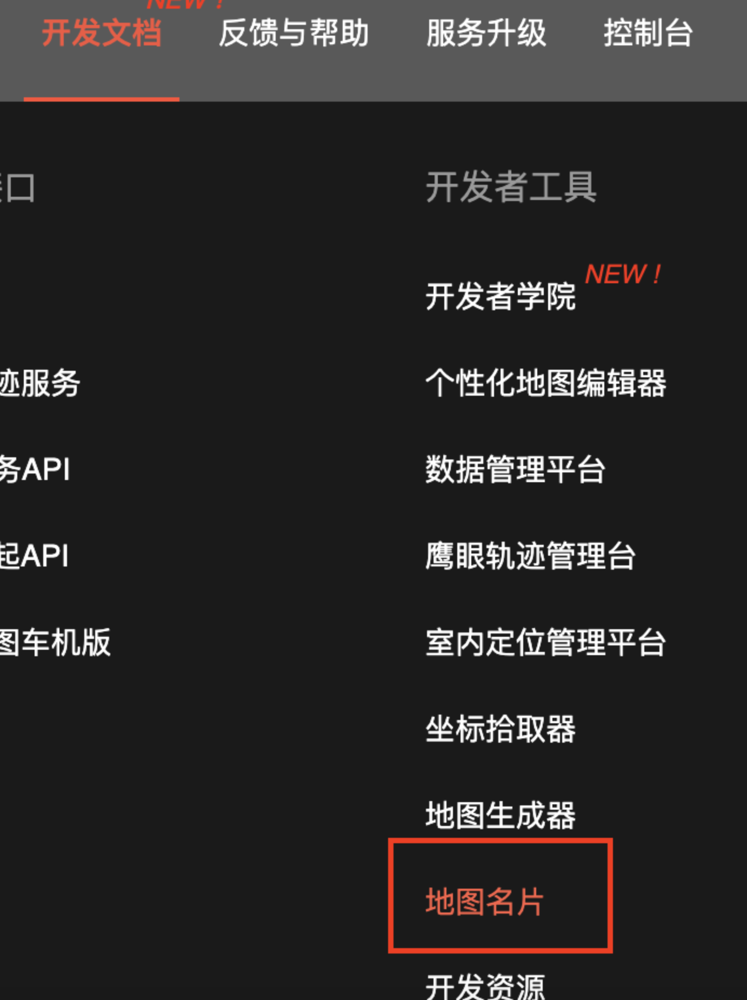

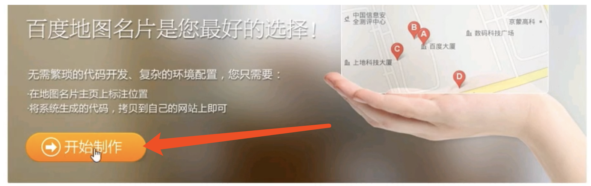

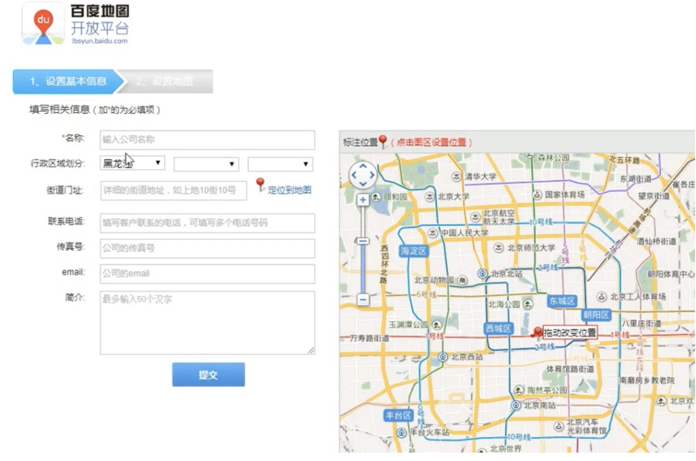

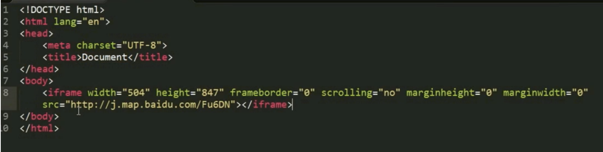

### 3、使用cookie完成登陆记住我功能，保存时间为7天


### 4、图片上传后回显（最少三张）

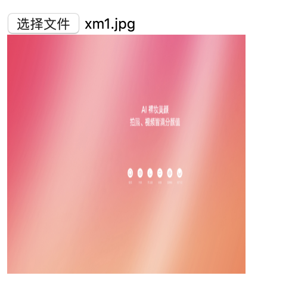


# 答案

### 社会我雷哥

```html
<!DOCTYPE html>
<html lang="en">

<head>
    <meta charset="UTF-8">
    <meta name="viewport" content="width=device-width, initial-scale=1.0">
    <meta http-equiv="X-UA-Compatible" content="ie=edge">
    <script src="/资料/jquery-3.1.0.js"></script>
    <title>Document</title>
    <style>
        * {
            margin: 0;
            padding: 0;
        }
        .box{
            width:100%;
            height: calc(100vh);
            overflow: hidden;
        }
        .mask {
            position: absolute;
            width:100%;
            height: 100%;
            background: rgba(0, 0, 0, 0.6);
            text-align: center;
            color: white;
            letter-spacing: 10px;
            font-size: 30px;
            line-height: 800px;
        }
    </style>
</head>

<body>
        <div class="box">
            <div class="mask">
                <h1>社会我雷哥</h1>
            </div>
            <video src="/资料/mi.mp4"  muted loop autoplay></video>
        </div>
</body>

</html>
```


## 多附件上传

```html
<!DOCTYPE html>
<html lang="en">

<head>
    <meta charset="UTF-8">
    <title>Document</title>
</head>

<body>
    <input type="file" name="" id="" multiple>
    <div>
        
    </div>

    <script>
        var input = document.querySelector('input')
        var div = document.querySelector('div')
        var img = document.querySelector('img')
        input.onchange = function () {

            for (var i = 0; i < this.files.length; i++) {
                var file = this.files[i];
                // console.log(file);
                var reader = new FileReader();
                reader.readAsDataURL(file);
                // 文件读取完触发
                // 典型的闭包案例，作用域读取另一个作用域外的值，
                // 如果不使用立即执行，那么读取到最后一个上传的文件
                reader.onload = (function () {
                    console.log(reader);
                    return function(e){
                        console.log(e.target.result);
                        var img = document.createElement('img')
                        img.src = e.target.result
                        div.appendChild(img)
                    }
                })()
            }


        }
    </script>
</body>

</html>
```

```html
<!DOCTYPE html>
<html lang="en">

<head>
    <meta charset="UTF-8">
    <title>Document</title>
</head>

<body>
    <input type="file" name="" id="" multiple>
    <div>
        
    </div>

    <script>
        var input = document.querySelector('input')
        var div = document.querySelector('div')
        var img = document.querySelector('img')
        input.onchange = function () {

            for (var i = 0; i < this.files.length; i++) {
                var file = this.files[i];
                // console.log(file);
                var reader = new FileReader();
                reader.readAsDataURL(file);
                // 文件读取完触发
                // 典型的闭包案例，作用域读取另一个作用域外的值，
                // 如果不使用立即执行，那么读取到最后一个上传的文件
                // reader.onload = (function () {
                //     console.log(reader);
                //     return function(e){
                //         console.log(e.target.result);
                //         var img = document.createElement('img')
                //         img.src = e.target.result
                //         div.appendChild(img)
                //     }
                // })()
                reader.onload = function (e) {
                    var img = document.createElement('img')
                    img.src = e.target.result
                    div.appendChild(img)
                }
            }


        }
    </script>
</body>

</html>
```

