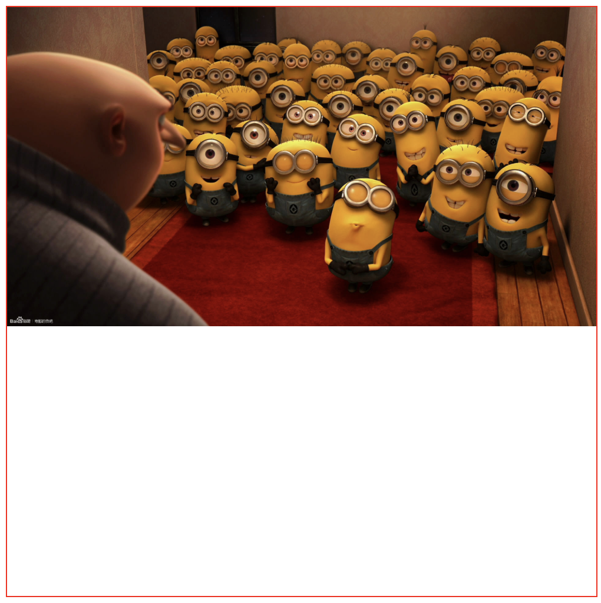
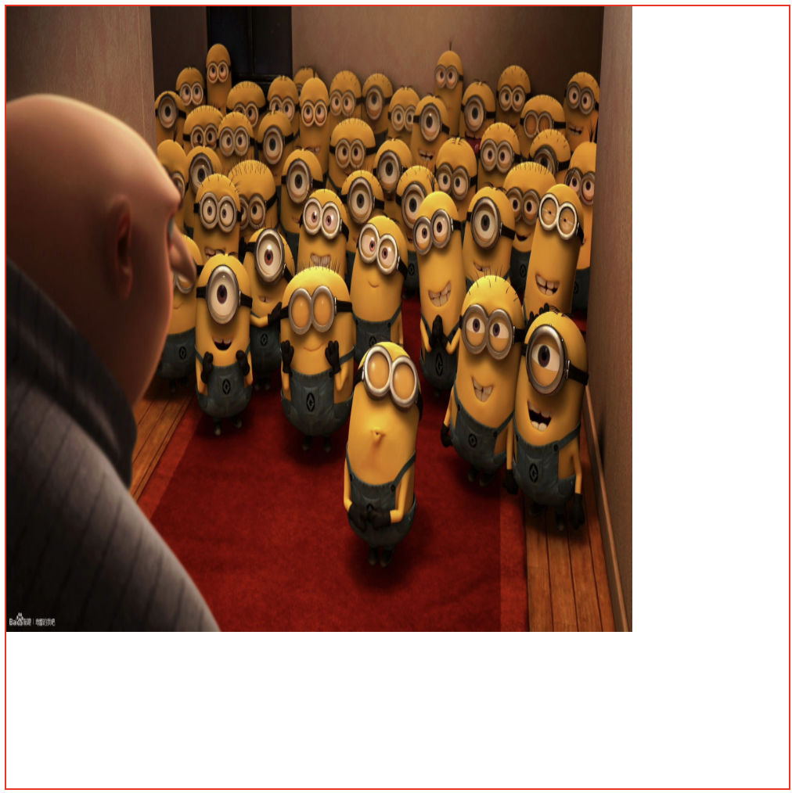
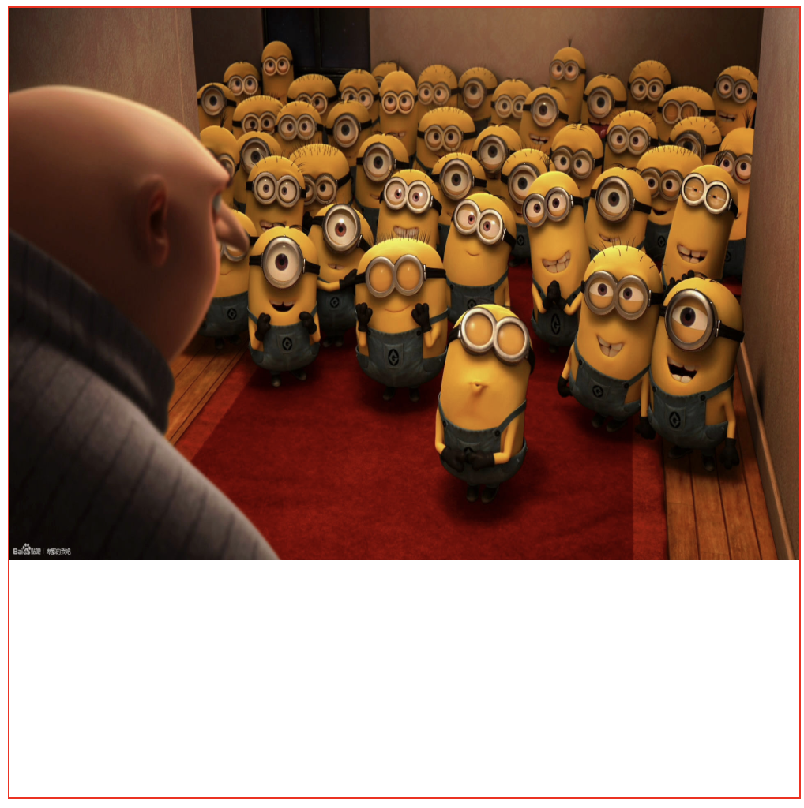
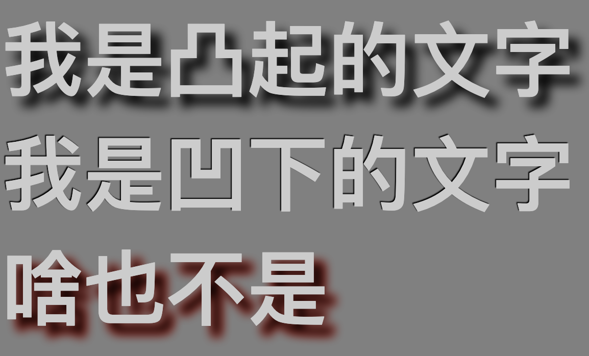
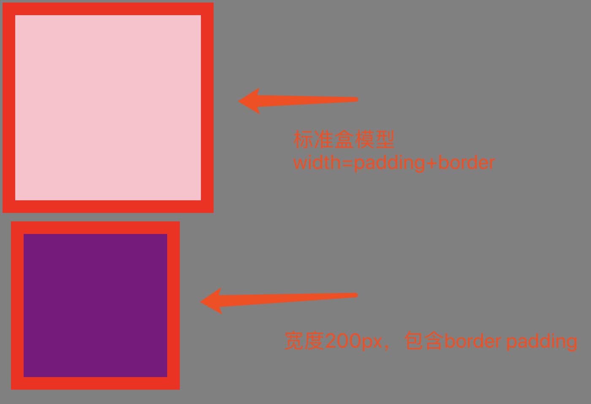
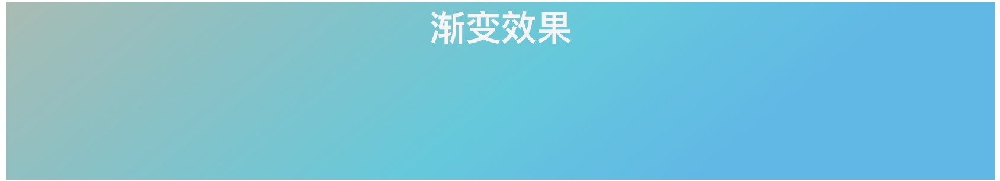

# 一、拖放功能

在 HTML5 中，拖放是标准的一部分，任何元素都能够拖放。

拖拽：Drag

释放：Drop

拖拽指的是鼠标点击源对象后一直移动对象不松手，一但松手即释放了

- 哪个需要，就给它设置可拖放效果
- 找到源文件，设置拖拽效果
- 找到目标文件，设置释放效果

### 设置元素为可拖放

draggable 属性：就是标签元素要设置draggable=true，否则不会有效果 

注意：  链接和图片默认是可拖动的，不需要 draggable 属性。

拖拽API的相关事件

**被拖动的源对象可以触发的事件：**

(1)ondragstart：源对象开始被拖动

(2)ondrag：源对象被拖动过程中(鼠标可能在移动也可能未移动)

(3)ondragend：源对象被拖动结束

  **拖动源对象可以进入到目标对象可以触发的事件：**

(1)ondragenter：目标对象被源对象拖动着进入

(2)ondragover：目标对象被源对象拖动着悬停在上方

(3)ondragleave：源对象拖动着离开了目标对象

(4)ondrop：源对象拖动着在目标对象上方释放/松手

拖拽API总共就是7个函数！！

```html
<!DOCTYPE html>
<html lang="en">
<head>
	<meta charset="UTF-8">
	<title>Document</title>
	<style>
	* {
		margin: 0;
		padding: 0;
	}
	div {
		width: 200px;
		height: 200px;
		border: 1px solid red;
		float: left;
		margin: 10px;
	}
	div:nth-child(2) {
		border: 1px solid green;
	}
	div:last-child {
		border: 1px solid blue;
	}
	p {
		height: 25px;
		background-color: pink;
		line-height: 25px;
		text-align: center;
	}
	</style>
</head>
<body>
	<div id="div1">
		<p id="p1" draggable="true">拖拽内容</p>
	</div>
	<div id="div2"></div>
	<div id="div3"></div>
	<script>
	// 完整的拖拽   +  释放   
	// 1. 那个需要拖放 就 给这个盒子设置 可拖放效果
	// 2. 找到源文件 设置拖拽效果 
	// (1)ondragstart：源对象开始被拖动
		var p = document.querySelector("#p1");
		p.ondragstart = function() {
			console.log("源对象开始被拖动");
		}
	// (2)ondrag：源对象被拖动过程中(鼠标可能在移动也可能未移动)
		p.ondrag = function() {
			console.log("源对象被拖动过程中");
			// 不断的执行
		}

	// (3)ondragend：源对象被拖动结束
 		p.ondragend = function() {
			console.log("源对象被拖动结束");
		}
	
	// 3. 找到目标文件  设置 释放效果  onmouseenter   onmouseover 
	    var target = document.querySelector("#div2");
   //  (1)ondragenter：目标对象被源对象拖动着进入
 		target.ondragenter = function() {
 			console.log("目标对象被源对象拖动着进入");
 		}
	// (2)ondragover：目标对象被源对象拖动着悬停在上方
		target.ondragover = function(e) {
 			console.log("目标对象被源对象悬停在上方");
 			// 不断的执行
 			// 如果想要触发 ondrop 事件 则需要在over 里面 阻止  默认行为
 			return false;
 			// e.preventDefault()

 		}
	// (3)ondragleave：源对象拖动着离开了目标对象
		target.ondragleave = function() {
 			console.log("离开了");
 		}
	// (4)ondrop：源对象拖动着在目标对象上方释放/松手
		target.ondrop = function() {
 			console.log("上方释放/松手");
 		}
	</script>
</body>
</html>
```

改造：

- event.target  事件对象里面的事件目标
- 目标对象. appendChild(源对象)

```html
<!DOCTYPE html>
<html lang="en">
<head>
	<meta charset="UTF-8">
	<title>Document</title>
	<style>
	* {
		margin: 0;
		padding: 0;
	}
	div {
		width: 200px;
		height: 200px;
		border: 1px solid red;
		float: left;
		margin: 10px;
	}
	div:nth-child(2) {
		border: 1px solid green;
	}
	div:nth-child(3){
		border: 1px solid blue;
	}
	p {
		height: 25px;
		background-color: pink;
		line-height: 25px;
		text-align: center;
	}
	</style>
</head>
<body>
	<div id="div1">
		<p id="p1" draggable="true">拖拽内容1</p>
		<p id="p2" draggable="true">拖拽内容2</p>
		<p id="p3" draggable="true">拖拽内容3</p>
		<p id="p4" draggable="true">拖拽内容4</p>
	</div>
	<div id="div2"></div>
	<div id="div3"></div>
	<script>
	// 完整的拖拽   +  释放   
	// 1. 我们有很多盒子， 那个需要拖放 就 给这个盒子设置 可拖放效果
	// 2. 找到源文件 设置拖拽效果 
	// (1)ondragstart：源对象开始被拖动
		// var p = document.querySelector("#p1");
		 var obj = null; // 用于存放我们拖放对象 源对象
		document.ondragstart = function(event) {
			console.log("源对象开始被拖动");
			// event.target  事件对象里面的事件目标
			console.log(event.target);
			obj = event.target;  // 把当前对象给 obj 然后追加到 新目标对象里面就阔以了

		}
	// (2)ondrag：源对象被拖动过程中(鼠标可能在移动也可能未移动)
		document.ondrag = function() {
			console.log("源对象被拖动过程中");
			// 不断的执行
		}

	// (3)ondragend：源对象被拖动结束
 		document.ondragend = function() {
			console.log("源对象被拖动结束");
		}
	
	// 3. 找到目标对象  设置 释放效果  onmouseenter   onmouseover 
	    var target = document.querySelector("#div2");
   //  (1)ondragenter：目标对象被源对象拖动着进入
 		target.ondragenter = function() {
 			console.log("目标对象被源对象拖动着进入");
 		}
	// (2)ondragover：目标对象被源对象拖动着悬停在上方
		target.ondragover = function(e) {
 			console.log("目标对象被源对象悬停在上方");
 			// 不断的执行
 			// 如果想要触发 ondrop 事件 则需要在over 里面 阻止  默认行为
 			return false;
 			// e.preventDefault()

 		}
	// (3)ondragleave：源对象拖动着离开了目标对象
		target.ondragleave = function() {
 			console.log("离开了");
 		}
	// (4)ondrop：源对象拖动着在目标对象上方释放/松手 
		target.ondrop = function() {
 			console.log("上方释放/松手");
 			// 当我们的源对象 在 目标对象上  释放   就可以吧 源对象放入目标对象里面了 追加
 			// 目标对象. appendChild(源对象)
 			this.appendChild(obj);
 			// 拖拽的时候 ，不用删除原来的  
 		}
	</script>
</body>
</html>
```

多个拖拽

```html
<!DOCTYPE html>
<html lang="en">
<head>
	<meta charset="UTF-8">
	<title>Document</title>
	<style>
	* {
		margin: 0;
		padding: 0;
	}
	div {
		width: 200px;
		height: 200px;
		border: 1px solid red;
		float: left;
		margin: 10px;
	}
	div:nth-child(2) {
		border: 1px solid green;
	}
	div:nth-child(3){
		border: 1px solid blue;
	}
	p {
		height: 25px;
		background-color: pink;
		line-height: 25px;
		text-align: center;
	}
	</style>
</head>
<body>
	<div id="div1">
		<p id="p1" draggable="true">拖拽内容1</p>
		<p id="p2" draggable="true">拖拽内容2</p>
		<p id="p3" draggable="true">拖拽内容3</p>
		<p id="p4" draggable="true">拖拽内容4</p>
	</div>
	<div id="div2"></div>
	<div id="div3"></div>
	<script>
	// 完整的拖拽   +  释放   
	// 1. 我们有很多盒子， 那个需要拖放 就 给这个盒子设置 可拖放效果
	// 2. 找到源文件 设置拖拽效果 
	// (1)ondragstart：源对象开始被拖动
		// var p = document.querySelector("#p1");
		var obj = null;  //用于存放我们拖放对象 源对象
		document.ondragstart = function(event) {
			console.log("源对象开始被拖动");
			// event.target  事件对象里面的事件目标
			console.log(event.target);
			 obj = event.target; // 把当前对象给 obj 然后追加到 新目标对象里面就阔以了

		}
	// (2)ondrag：源对象被拖动过程中(鼠标可能在移动也可能未移动)
		document.ondrag = function() {
			console.log("源对象被拖动过程中");
			// 不断的执行
		}

	// (3)ondragend：源对象被拖动结束
 		document.ondragend = function() {
			console.log("源对象被拖动结束");
		}
	
	// 3. 找到目标对象  设置 释放效果  onmouseenter   onmouseover 
	    // var target = document.querySelector("#div2");
   //  (1)ondragenter：目标对象被源对象拖动着进入
 		document.ondragenter = function(event) {
 			console.log("目标对象被源对象拖动着进入");
 		}
	// (2)ondragover：目标对象被源对象拖动着悬停在上方
		document.ondragover = function(e) {
 			console.log("目标对象被源对象悬停在上方");
 			// 不断的执行
 			// 如果想要触发 ondrop 事件 则需要在over 里面 阻止  默认行为
 			return false;
 			// e.preventDefault()

 		}
	// (3)ondragleave：源对象拖动着离开了目标对象
		document.ondragleave = function() {
 			console.log("离开了");
 		}
	// (4)ondrop：源对象拖动着在目标对象上方释放/松手 
		document.ondrop = function(event) {
 			console.log("上方释放/松手");
 			// 当我们的源对象 在 目标对象上  释放   就可以吧 源对象放入目标对象里面了 追加
 			// 目标对象. appendChild(源对象)
 			event.target.appendChild(obj);
 		}
	</script>
</body>
</html>
```

###  DataTransfer

在进行拖放操作时，`DataTransfer` 对象用来保存被拖动的数据。它可以保存一项或多项数据、一种或者多种数据类型

- event.dataTransfer.setData(key,value)
- event.dataTransfer.getData(key)

```html
<!DOCTYPE html>
<html lang="en">

<head>
    <meta charset="UTF-8">
    <title>Document</title>
    <style>
        * {
            margin: 0;
            padding: 0;
        }

        div {
            width: 200px;
            height: 200px;
            border: 1px solid red;
            float: left;
            margin: 10px;
        }

        div:nth-child(2) {
            border: 1px solid green;
        }

        div:nth-child(3) {
            border: 1px solid blue;
        }

        p {
            height: 25px;
            background-color: pink;
            line-height: 25px;
            text-align: center;
        }
    </style>
</head>

<body>
    <div id="div1">
        <p id="p1" draggable="true">拖拽内容1</p>
        <p id="p2" draggable="true">拖拽内容2</p>
        <p id="p3" draggable="true">拖拽内容3</p>
        <p id="p4" draggable="true">拖拽内容4</p>
    </div>
    <div id="div2"></div>
    <div id="div3"></div>
    <script>
        // 完整的拖拽   +  释放   
        // 1. 我们有很多盒子， 那个需要拖放 就 给这个盒子设置 可拖放效果
        // 2. 找到源文件 设置拖拽效果 
        // (1)ondragstart：源对象开始被拖动
        document.ondragstart = function (event) {
            console.log("源对象开始被拖动");
            // event.target  事件对象里面的事件目标
            // event.dataTransfer.setData("类型", 数据) 在我们start 里面设置 当我们开始拖拽的时候，就存储数据
            // 类型  text/html   URL  
            // 记录 当前源对象的id 名字
            event.dataTransfer.setData("text", event.target.id);
            // 我们传递的是 id  字符型形式  text

        }
        // (2)ondrag：源对象被拖动过程中(鼠标可能在移动也可能未移动)
        document.ondrag = function () {
            console.log("源对象被拖动过程中");
            // 不断的执行
        }

        // (3)ondragend：源对象被拖动结束
        document.ondragend = function () {
            console.log("源对象被拖动结束");
        }

        // 3. 找到目标对象  设置 释放效果  onmouseenter   onmouseover 
        // var target = document.querySelector("#div2");
        //  (1)ondragenter：目标对象被源对象拖动着进入
        document.ondragenter = function (event) {
            console.log("目标对象被源对象拖动着进入");
        }
        // (2)ondragover：目标对象被源对象拖动着悬停在上方
        document.ondragover = function (e) {
            console.log("目标对象被源对象悬停在上方");
            // 不断的执行
            // 如果想要触发 ondrop 事件 则需要在over 里面 阻止  默认行为
            return false;
            // e.preventDefault()

        }
        // (3)ondragleave：源对象拖动着离开了目标对象
        document.ondragleave = function () {
            console.log("离开了");
        }
        // (4)ondrop：源对象拖动着在目标对象上方释放/松手 
        document.ondrop = function (event) {
            console.log("上方释放/松手");
            // 当我们的源对象 在 目标对象上  释放   就可以吧 源对象放入目标对象里面了 追加
            // 获取 dataTransfer里面的数据
            var id = event.dataTransfer.getData("text");
            console.log(id);
            event.target.appendChild(document.getElementById(id))
           
           
        }
    </script>
</body>

</html>
```

# 二、本地存储

随着互联网的快速发展，基于网页的应用越来越普遍，同时也变的越来越复杂，为了满足各种各样的需求，会经常性在本地存储大量的数据，HTML5规范提出了相关解决方案。

### 1.1 特性

1、设置、读取方便、页面刷新不丢失数据

2、容量较大，sessionStorage约5M、localStorage约20M

4、只能存储字符串，可以将对象JSON.stringify() 编码后存储

### 1.2 window.sessionStorage

1、生命周期为关闭浏览器窗口

2、在同一个窗口(页面)下数据可以共享

### 1.3 window.localStorage

1、永久生效，除非手动删除 关闭页面也会存在

2、可以多窗口（页面）共享（同一浏览器可以共享）

### 1.4 方法详解

setItem(key, value) 设置存储内容

getItem(key) 读取存储内容

removeItem(key) 删除键值为key的存储内容

clear() 清空所有存储内容

```html
<!DOCTYPE html>
<html lang="en">

<head>
    <meta charset="UTF-8">
    <title>Document</title>
</head>

<body>
    <input type="text" id="username"> <br /><br />
    <button id="setData">设置数据</button>
    <button id="getData">获取数据</button>
    <button id="delData">删除数据</button>
    <script>
        var username = document.querySelector("#username");
        // 点击按钮存取数据 
        window.sessionStorage.setItem("age", 18);
        window.sessionStorage.setItem("address", "北京");
        // 
        document.querySelector("#setData").onclick = function () {
            // 点击之后得到 username 里面值
            var val = username.value;
            // 存储数据
            // window.sessionStorage.setItem(key, value) 设置存储内容
            window.sessionStorage.setItem("username", val);
        }

        // 点击按钮获得数据 
        document.querySelector("#getData").onclick = function () {

            // 获得数据
            // window.sessionStorage.getItem(key) 读取存储内容
            alert(window.sessionStorage.getItem("username"));
        }

         // 删除数据 
        document.querySelector("#delData").onclick = function () {

            // 获得数据
            // window.sessionStorage.removeItem(key) 删除键值为key的存储内容
            // window.sessionStorage.removeItem("username");
            // 删除所有的 数据 
            window.sessionStorage.clear();


        }


    </script>
</body>

</html>
```

localStorage同理

# 三、兼容处理（理解）

1. 在不支持HTML5新标签的浏览器里，会将这些新的标签解析成行内元素(inline)对待，所以我们只需要将其转换成块元素(block)即可使用，但是在IE9版本以下，并不能正常解析这些新标签，但是却可以识别通过document.createElement('tagName')创建的自定义标签，于是我们的解决方案就是将HTML5的新标签全部通过document.createElement('tagName')来创建一遍，这样IE低版本也能正常解析HTML5新标签了。
2. 处理方式：在实际开发中我们更多采用的是通过检测IE浏览器的版本来加载三方的一个JS库来解决兼容问题（测试在IE下面的兼容性：ieTester软件的使用）

```html
 <script src="../js/html5shiv.min.js"></script>
```

我们解决的问题， 主要是针对于ie低版本的，也就是只有低版本ie才执行才对。

```html
<!--[if lt IE 9]>

　　 <script src="js/respond.js"></script>
     
 　　<script src="js/html5shiv.min.js"></script>

<![endif]-->
```

respond.js  目的是为了解决 ie低版本的CSS3媒体查询  media query

条件注释 (了解)

```html
<!--[if !IE]><!--> 除IE外都可识别 <!--<![endif]-->
<!--[if IE]> 所有的IE可识别 <![endif]-->
<!--[if IE 6]> 仅IE6可识别 <![endif]-->
<!--[if lt IE 6]> IE6以及IE6以下版本可识别 <![endif]-->
<!--[if gt IE 6]> IE6以及IE6以上版本可识别 <![endif]-->
<!--[if IE 7]> 仅IE7可识别 <![endif]-->
<!--[if lt IE 7]> IE7以下版本可识别 <![endif]-->
<!--[if gt IE 7]> IE7以上版本可识别 <![endif]-->
<!--[if IE 8]> 仅IE8可识别 <![endif]-->
<!--[if IE 9]> 仅IE9可识别 <![endif]-->
```

# 四、背景缩放(CSS3)

通过background-size设置背景图片的尺寸，就像我们设置img的尺寸一样，在移动Web开发中做屏幕适配应用非常广泛。

| *length*     | 设置背景图像的高度和宽度。第一个值设置宽度，第二个值设置高度。如果只设置一个值，则第二个值会被设置为 "auto"。 |
| ------------ | ------------------------------------------------------------ |
| *percentage* | 以父元素的百分比来设置背景图像的宽度和高度。第一个值设置宽度，第二个值设置高度。如果只设置一个值，则第二个值会被设置为 "auto"。 |
| cover        | 把背景图像扩展至足够大，以使背景图像完全覆盖背景区域。背景图像的某些部分也许无法显示在背景定位区域中。 |
| contain      | 把图像图像扩展至最大尺寸，以使其宽度和高度完全适应内容区域。 |

### 原图：


其参数设置如下：

a) 可以设置长度单位(px)或百分比（设置百分比时，参照盒子的宽高）

b) 设置为cover时，会自动调整缩放比例，保证图片始终填充满背景区域，如有溢出部分则会被隐藏。我们平时用的cover 最多


c) 设置为contain会自动调整缩放比例，保证图片始终完整显示在背景区域。



```html
<!DOCTYPE html>
<html lang="en">
<head>
    <meta charset="UTF-8">
    <meta name="viewport" content="width=device-width, initial-scale=1.0">
    <meta http-equiv="X-UA-Compatible" content="ie=edge">
    <title>Document</title>
    <style>
        div{
            width: 500px;
            height: 500px;
            border: 1px red solid;
            margin: 30px auto;

            background: url("./ax.png") no-repeat;
            background-size: 400px 400px;
        }
    </style>
</head>
<body>
    <div></div>
</body>
</html>
```



```html
<!DOCTYPE html>
<html lang="en">
<head>
    <meta charset="UTF-8">
    <meta name="viewport" content="width=device-width, initial-scale=1.0">
    <meta http-equiv="X-UA-Compatible" content="ie=edge">
    <title>Document</title>
    <style>
        div{
            width: 500px;
            height: 500px;
            border: 1px red solid;
            margin: 30px auto;

            background: url("./ax.png") no-repeat;
            background-size: 100% 70%;
        }
    </style>
</head>
<body>
    <div></div>
</body>
</html>
```



```css
background: url('./img/it.png') no-repeat  0 0 / contain;
```

# 五、凹凸文字

text-shadow: 水平位置  垂直位置  模糊距离 阴影颜色;

```css
<!DOCTYPE html>
<html lang="en">

<head>
    <meta charset="utf-8">
    <style>
        body {
            background-color: gray;
        }

        div {
            color: #ccc;
            font: 700 80px "微软雅黑";
        }

        div:nth-child(1) {
            /* text-shadow: 水平位置  垂直位置  模糊距离 阴影颜色; */
            text-shadow: 10px 10px 10px #000;
        }

        div:nth-child(2) {
            /* text-shadow: 水平位置  垂直位置  模糊距离 阴影颜色; */
            text-shadow: -1px -1px 1px #000;
        }
        div:nth-child(3) {
            /* text-shadow: 水平位置  垂直位置  模糊距离 阴影颜色; */
            text-shadow: 10px 10px 10px #000,10px 10px 10px red;
        }
    </style>
</head>

<body>
    <div>我是凸起的文字</div>
    <div>我是凹下的文字</div>
    <div>啥也不是</div>
</body>

</html>
```



# 六、box-shadow

属性向框添加一个或多个阴影。

| 值         | 描述                                  |
| ---------- | ------------------------------------- |
| *h-shadow* | 必需。水平阴影的位置。允许负值。      |
| *v-shadow* | 必需。垂直阴影的位置。允许负值。      |
| *blur*     | 可选。模糊距离。                      |
| *spread*   | 可选。阴影的尺寸。                    |
| *color*    | 可选。阴影的颜色。请参阅 CSS 颜色值。 |

```css
<!DOCTYPE html>
<html lang="en">
<head>
    <meta charset="UTF-8">
    <meta name="viewport" content="width=device-width, initial-scale=1.0">
    <meta http-equiv="X-UA-Compatible" content="ie=edge">
    <title>Document</title>
    <style>
        div{
            width: 300px;
            height: 300px;
            border: 2px red solid;
            margin: 0 auto;
            /* box-shadow: 水平阴影 垂直阴影 模糊距离 阴影的颜色; */
            box-shadow: 10px 10px 5px #888888;
        }
    </style>
</head>
<body>
    <div></div>
</body>
</html>
```

# 七、CSS3盒模型

CSS3中可以通过box-sizing 来指定盒模型，即可指定为content-box、border-box，这样我们计算盒子大小的方式就发生了改变。

可以分成两种情况：

1、box-sizing: content-box  盒子大小为 width + padding + border   content-box:此值为其默认值，其让元素维持W3C的标准Box Mode

2、box-sizing: border-box  盒子大小为 width    就是说  padding 和 border 是包含到width里面的

```html
<!DOCTYPE html>
<html lang="en">

<head>
    <meta charset="utf-8">
    <style>
        body {
            background-color: gray;
        }

        div {
            color: #ccc;
            font: 700 80px "微软雅黑";
        }

        div:nth-child(1) {
            width: 200px;
			height: 200px;
			background-color: pink; 
			box-sizing: content-box;  /*  就是以前的标准盒模型  w3c */
			padding: 10px;
			border: 15px solid red;
			/* 盒子大小为 width + padding + border   content-box:此值为其默认值，其让元素维持W3C的标准Box Mode */
        }

        div:nth-child(2) {
            width: 200px;
			height: 200px;
			background-color: purple;
			padding: 10px;
			box-sizing: border-box;   /* padding border  不撑开盒子 */
			border: 15px solid red;
			margin: 10px;
			/* 盒子大小为 width    就是说 width包含 padding 和 border  */
        }
    </style>
</head>

<body>
    <div></div>
    <div></div>
</body>

</html>
```



# 八、CSS3 渐变（Gradients）

CSS3 渐变（gradients）可以让你在两个或多个指定的颜色之间显示平稳的过渡。



CSS3 定义了两种类型的渐变（gradients）：

- 线性渐变（Linear Gradients）- 向下/向上/向左/向右/对角方向
- 径向渐变（Radial Gradients）- 由它们的中心定义

### 线性渐变 - 从上到下（默认情况下）

```css
<!DOCTYPE html>
<html>
<head>
<meta charset="utf-8"> 
<title></title> 
<style>
#grad1 {
    height: 200px;
	background-color: red; /* 浏览器不支持时显示 */
    background-image: linear-gradient(#e66465, #9198e5);
}
</style>
</head>
<body>

<h3>线性渐变 - 从上到下</h3>
<p>从顶部开始的线性渐变。起点是红色，慢慢过渡到蓝色：</p>

<div id="grad1"></div>

<p><strong>注意：</strong> Internet Explorer 9 及之前的版本不支持渐变。</p>

</body>
</html>
```

#### 线性渐变 - 从左到右

```css
<!DOCTYPE html>
<html>
<head>
<meta charset="utf-8"> 
<title></title> 
<style>
#grad1 {
    height: 200px;
    background-color: red; /* 不支持线性的时候显示 */
    background-image: linear-gradient(to right, red , yellow);
}
</style>
</head>
<body>

<h3>线性渐变 - 从左到右</h3>
<p>从左边开始的线性渐变。起点是红色，慢慢过渡到黄色：</p>

<div id="grad1"></div>

<p><strong>注意：</strong> Internet Explorer 8 及之前的版本不支持渐变。</p>

</body>
</html>
```

#### 线性渐变 - 对角

```html
<!DOCTYPE html>
<html>
<head>
<meta charset="utf-8"> 
<title></title> 
<style>
#grad1 {
    height: 200px;
    background-color: red; /* 不支持线性的时候显示 */
    background-image: linear-gradient(to bottom right, red , yellow);
}
</style>
</head>
<body>

<h3>线性渐变 - 对角</h3>
<p>从左上角开始（到右下角）的线性渐变。起点是红色，慢慢过渡到黄色：</p>

<div id="grad1"></div>

<p><strong>注意：</strong> Internet Explorer 8 及之前的版本不支持渐变。</p>

</body>
</html>
```

如果你想要在渐变的方向上做更多的控制，你可以定义一个角度，而不用预定义方向（to bottom、to top、to right、to left、to bottom right，等等）

```css
background-image: linear-gradient(-90deg, red, yellow);
```


### CSS3 径向渐变

径向渐变由它的中心定义。

#### 径向渐变 - 颜色结点均匀分布（默认情况下）

```html
<!DOCTYPE html>
<html>
<head>
<meta charset="utf-8"> 
<title></title> 
<style>
#grad1 {
    height: 150px;
    width: 200px;
    background-color: red; /* 浏览器不支持的时候显示 */
    background-image: radial-gradient(red, green, blue); /* 标准的语法（必须放在最后） */
}
</style>
</head>
<body>

<h3>径向渐变 - 颜色结点均匀分布</h3>
<div id="grad1"></div>

<p><strong>注意：</strong> Internet Explorer 9 及之前的版本不支持渐变。</p>

</body>
</html>
```

#### 径向渐变 - 颜色结点不均匀分布

```html
<!DOCTYPE html>
<html>
<head>
<meta charset="utf-8"> 
<title></title> 
<style>
#grad1 {
    height: 150px;
    width: 200px;
    background-color: red; /* 浏览器不支持的时候显示 */
    background-image: radial-gradient(red 5%, green 15%, blue 60%); /* 标准的语法（必须放在最后） */
}
</style>
</head>
<body>

<h3>径向渐变 - 颜色结点不均匀分布</h3>
<div id="grad1"></div>

<p><strong>注意：</strong> Internet Explorer 9 及之前的版本不支持渐变。</p>

</body>
</html>
```

#### 径向渐变 - 形状

```html
<!DOCTYPE html>
<html>
<head>
<meta charset="utf-8"> 
<title></title> 
<style>
#grad1 {
    height: 150px;
    width: 200px;
    background-color: red; /* 浏览器不支持的时候显示 */
    background-image: radial-gradient(red, yellow, green); /* 标准的语法（必须放在最后） */
}

#grad2 {
    height: 150px;
    width: 200px;
    background-color: red; /* 浏览器不支持的时候显示 */
    background-image: radial-gradient(circle, red, yellow, green); /* 标准的语法（必须放在最后） */
}
</style>
</head>
<body>

<h3>径向渐变 - 形状</h3>

<p><strong>椭圆形 Ellipse（默认）：</strong></p>
<div id="grad1"></div>

<p><strong>圆形 Circle：</strong></p>
<div id="grad2"></div>

<p><strong>注意：</strong> Internet Explorer 9 及之前的版本不支持渐变。</p>

</body>
</html>
```


# 作业

1、图片拖放功能

2、登陆cookie功能改成sessionStorage

3、使用背景图制作全屏主页

4、使用渐变色制作全屏主页<https://webgradients.com/>

5、写一个div，宽高个200px，背景色pink，当鼠标划过时，显示出该盒子的阴影效果