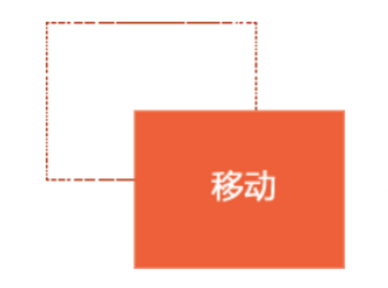
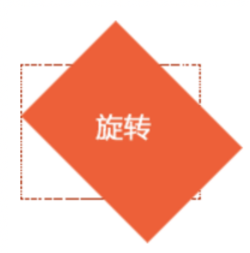
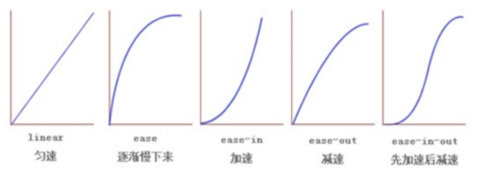
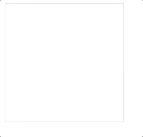
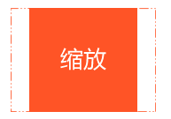
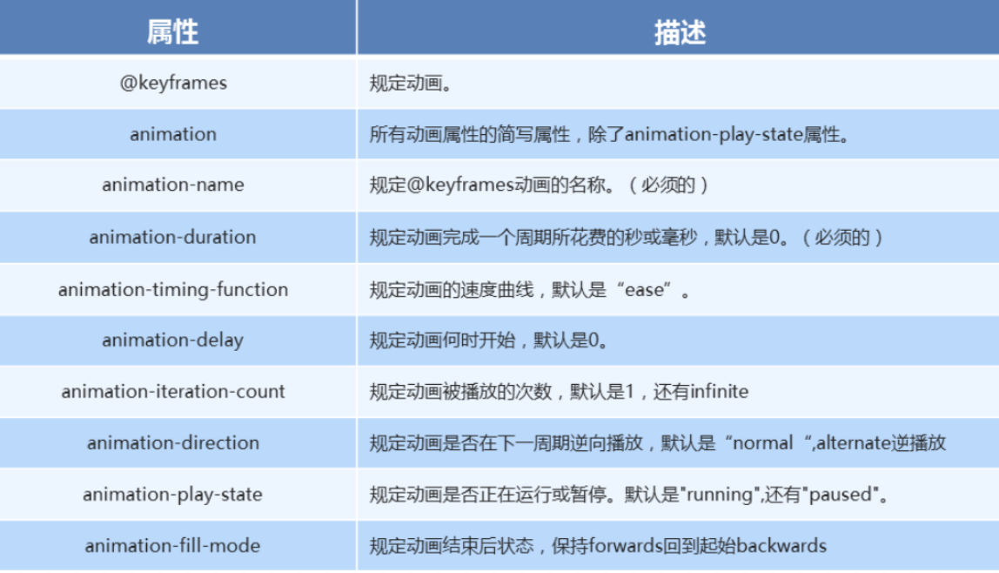
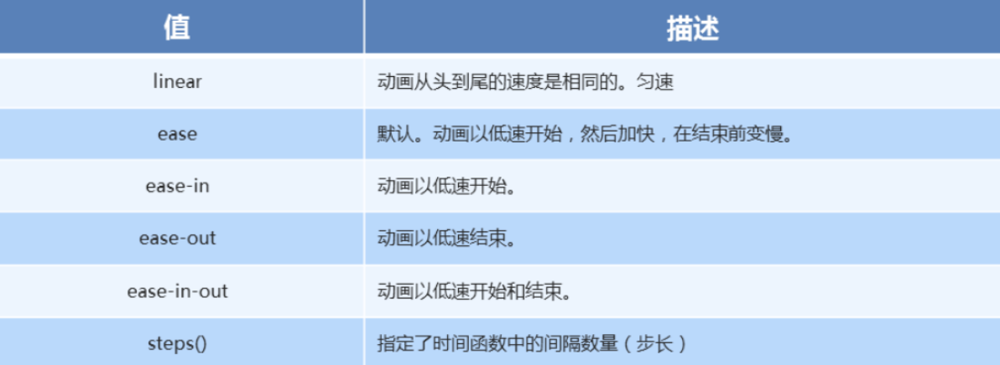
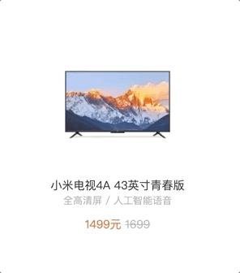
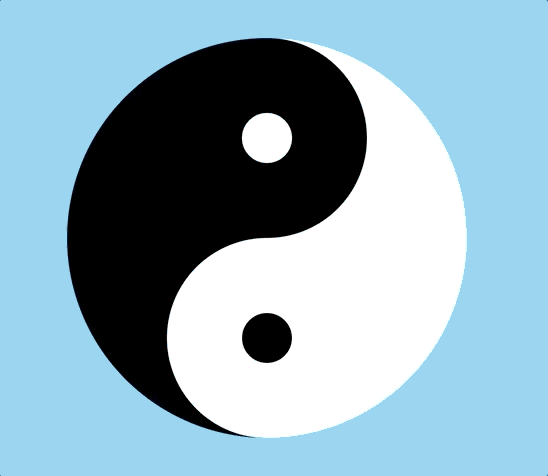
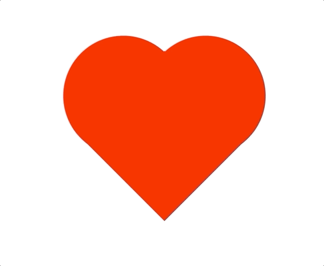

# transform转换

### 转换包含三个效果

- translate移动

- rotate旋转

- scale缩放

### translate 移动平移的意思



- x 就是 x 轴上水平移动
- y 就是 y 轴上水平移动

```css
transform: translate(x, y)
transform: translateX(n)
transfrom: translateY(n)
```

1. 重点知识点

   - `2D` 的移动主要是指 水平、垂直方向上的移动
   - `translate` 最大的优点就是不影响其他元素的位置
   - `translate` 中的100%单位，是相对于本身的宽度和高度来进行计算的
   - 行内标签没有效果

2. 代码演示

```css
<!DOCTYPE html>
<html lang="en">

<head>
    <meta charset="UTF-8">
    <meta name="viewport" content="width=device-width, initial-scale=1.0">
    <title>Document</title>
    <style>
        body{
            height: 5000px;
        }
        div {
            background-color: lightseagreen;
            width: 200px;
            height: 100px;
            /* 平移 */
            /* 水平垂直移动 100px */
            /* transform: translate(100px, 100px); */

            /* 水平移动 100px */
            /* transform: translate(100px, 0) */

            /* 垂直移动 100px */
            /* transform: translate(0, 100px) */

            /* 水平移动 100px */
            /* transform: translateX(100px); */

            /* 垂直移动 100px */
            /* transform: translateY(100px) */
        }
    </style>
</head>

<body>
    <div></div>
</body>

</html>
```

### 盒子水平居中

```html
<!DOCTYPE html>
<html lang="en">

<head>
    <meta charset="UTF-8">
    <meta name="viewport" content="width=device-width, initial-scale=1.0">
    <title>Document</title>
    <style>
        div {
            background-color: lightseagreen;
            width: 200px;
            height: 100px;
            position: absolute;
            left:50%;
            top:50%;
            margin-top: -50px;
            margin-left: -100px;
        }
    </style>
</head>

<body>
    <div></div>
</body>

</html>
```

使用translate

```html
<!DOCTYPE html>
<html lang="en">

<head>
    <meta charset="UTF-8">
    <meta name="viewport" content="width=device-width, initial-scale=1.0">
    <title>Document</title>
    <style>
        div {
            background-color: lightseagreen;
            width: 200px;
            height: 100px;
            position: absolute;
            left:50%;
            top:50%;
            /* margin-top: -50px;
            margin-left: -100px; */
            transform: translate(-50%,-50%);
        }
    </style>
</head>

<body>
    <div></div>
</body>

</html>
```

## 旋转rotate



1. rotate 旋转

   - `2D` 旋转指的是让元素在二维平面内顺时针或者逆时针旋转

2. `rotate` 语法

   ```css
   /* 单位是：deg */
   transform: rotate(度数) 
   ```

3. 重点知识点

   - `rotate` 里面跟度数，单位是 `deg`
   - 角度为正时，顺时针，角度为负时，逆时针
   - 默认旋转的中心点是元素的中心点

4. 代码演示

   ```css
   <!DOCTYPE html>
   <html lang="en">
   
   <head>
       <meta charset="UTF-8">
       <meta name="viewport" content="width=device-width, initial-scale=1.0">
       <title>Document</title>
       <style>
           img:hover{
               transform: rotate(45deg);
           }
       </style>
   </head>
   
   <body>
       
   </body>
   
   </html>
   ```

# 过渡

过渡（transition)是CSS3中具有颠覆性的特征之一，我们可以在不使用 Flash 动画或 JavaScript 的情况下，当元素从一种样式变换为另一种样式时为元素添加效果。


语法格式:

```
transition: 要过渡的属性  花费时间  运动曲线  何时开始;
如果有多组属性变化，还是用逗号隔开。
```

| 属性                       | 描述                                         | CSS  |
| -------------------------- | -------------------------------------------- | ---- |
| transition                 | 简写属性，用于在一个属性中设置四个过渡属性。 | 3    |
| transition-property        | 规定应用过渡的 CSS 属性的名称。              | 3    |
| transition-duration        | 定义过渡效果花费的时间。默认是 0。           | 3    |
| transition-timing-function | 规定过渡效果的时间曲线。默认是 "ease"。      | 3    |
| transition-delay           | 规定过渡效果何时开始。默认是 0。             | 3    |

如果想要所有的属性都变化过渡， 写一个all 就可以

transition-duration  花费时间  单位是  秒     s    比如 0.5s    这个s单位必须写      ms 毫秒

运动曲线   默认是 ease

 何时开始  默认是 0s  立马开始

运动曲线示意图：



```css
div {
			width: 200px;
			height: 100px;
			background-color: pink;
			/* transition: 要过渡的属性  花费时间  运动曲线  何时开始; */
			transition: width 0.6s ease 0s, height 0.3s ease-in 1s;
			/* transtion 过渡的意思  这句话写到div里面而不是 hover里面 */
  
			
}
div:hover {  /* 鼠标经过盒子，我们的宽度变为400 */

			width: 600px;
			height: 300px
}

transition: all 0.6s;  /* 所有属性都变化用all 就可以了  后面俩个属性可以省略 */
```

### 过渡写在本身上，谁做动画给谁加

```html
<!DOCTYPE html>
<html lang="en">

<head>
    <meta charset="UTF-8">
    <meta name="viewport" content="width=device-width, initial-scale=1.0">
    <meta http-equiv="X-UA-Compatible" content="ie=edge">
    <title>Document</title>
    <style>
        img {
            transition: all 5s;
        }
        img:hover {
            transform: rotate(360deg);
        }

        div {
            width: 110px;
            height: 110px;
            background-color: aqua;
        }

        div:hover {
            transform: rotate(45deg);
        }
    </style>
</head>

<body>
    <div></div>
    
</body>

</html>
```

### transform-origin可以调整元素转换变形的原点

- transform-origin:x y


重要知识点

- 注意后面的参数 x 和 y 用空格隔开
- x y 默认旋转的中心点是元素的中心 (50% 50%)，等价于 `center`  `center`
- 还可以给 x y 设置像素或者方位名词(`top`、`bottom`、`left`、`right`、`center`)

```css
 div{transform-origin: left top;transform: rotate(45deg); }  /* 改变元素原点到左上角，然后进行顺时旋转45度 */    
```

 如果是4个角，可以用 left top这些，如果想要精确的位置， 可以用  px 像素。

```css
 div{transform-origin: 10px 10px;transform: rotate(45deg); }  /* 改变元素原点到x 为10  y 为10，然后进行顺时旋转45度 */ 
```

```html
<!DOCTYPE html>
<html lang="en">

<head>
    <meta charset="UTF-8">
    <meta name="viewport" content="width=device-width, initial-scale=1.0">
    <meta http-equiv="X-UA-Compatible" content="ie=edge">
    <title>Document</title>
    <style>
        img {
            transition: all 5s;
            transform-origin: right bottom;
        }
        img:hover {
            transform: rotate(360deg);
        }

        div {
            width: 110px;
            height: 110px;
            background-color: aqua;
        }

        div:hover {
            transform: rotate(45deg);
        }
    </style>
</head>

<body>
    <div></div>
    
</body>

</html>
```


案例



```html
<!DOCTYPE html>
<html lang="en">

<head>
    <meta charset="UTF-8">
    <meta name="viewport" content="width=device-width, initial-scale=1.0">
    <meta http-equiv="X-UA-Compatible" content="ie=edge">
    <title>Document</title>
    <style>
        .box {
            width: 200px;
            height: 200px;
            border: 1px pink solid;
            margin-right: 20px;
            overflow: hidden;
        }

        .box1 {
            width: 200px;
            height: 200px;
            background-color: aqua;
            transform: rotate(90deg);
            transform-origin: left bottom;
            transition: all 0.5s;
            opacity: 0;
        }

        .box:hover .box1 {
            transform: rotate(0);
            opacity: 1;
        }
    </style>
</head>

<body>
    <div class="box">
        <div class="box1"></div>
    </div>

</body>

</html>
```

# 缩放 scale(x, y) 



```css
transform:scale(0.8,1);
```

可以对元素进行水平和垂直方向的缩放。该语句使用scale方法使该元素在水平方向上缩小了20%，垂直方向上不缩放。

```
scale(X,Y)使元素水平方向和垂直方向同时缩放（也就是X轴和Y轴同时缩放）
scaleX(x)元素仅水平方向缩放（X轴缩放）
scaleY(y)元素仅垂直方向缩放（Y轴缩放）
```

 scale()的取值默认的值为1，当值设置为0.01到0.99之间的任何值，作用使一个元素缩小；而任何大于或等于1.01的值，作用是让元素放大

知识要点

- 注意，x 与 y 之间使用逗号进行分隔
- `transform: scale(1, 1)`: 宽高都放大一倍，相当于没有放大
- `transform: scale(2, 2)`: 宽和高都放大了二倍
- `transform: scale(2)`: 如果只写了一个参数，第二个参数就和第一个参数一致
- `transform:scale(0.5, 0.5)`: 缩小

```html
<!DOCTYPE html>
<html lang="en">

<head>
    <meta charset="UTF-8">
    <meta name="viewport" content="width=device-width, initial-scale=1.0">
    <meta http-equiv="X-UA-Compatible" content="ie=edge">
    <title>Document</title>
    <style>
        div{
            width: 100px;
            height: 100px;
            background-color: pink;
        }
        div:hover {
            /* 注意，数字是倍数的含义，所以不需要加单位 */
            /* transform: scale(2, 2) */

            /* 实现等比缩放，同时修改宽与高 */
            /* transform: scale(2) */

            /* 小于 1 就等于缩放*/
            /* transform: scale(0.5, 0.5) */
            transform:scale(0.8,2);
        }
    </style>
</head>

<body>
    <div></div>
</body>

</html>
```

###  `2D` 转换综合写法以及顺序问题

1. 知识要点

   - 同时使用多个转换，其格式为 `transform: translate() rotate() scale()`
   - 顺序会影响到转换的效果(先旋转会改变坐标轴方向)
   - 但我们同时有位置或者其他属性的时候，要将位移放到最前面

2. 代码演示

   ```css
   div:hover {
     transform: translate(200px, 0) rotate(360deg) scale(1.2)
   }
   ```


# 动画(animation)

1. 什么是动画

   - 动画是 `CSS3` 中最具颠覆性的特征之一，可通过设置多个节点来精确的控制一个或者一组动画，从而实现复杂的动画效果

2. 动画的基本使用

   - 先定义动画
   - 在调用定义好的动画

3. 语法格式(定义动画)

   ```css
   @keyframes 动画名称 {
       0% {
           width: 100px;
       }
       100% {
           width: 200px
       }
   }
   ```

4. 语法格式(使用动画)

   ```
   div {
   	/* 调用动画 */
       animation-name: 动画名称;
    	/* 持续时间 */
    	animation-duration: 持续时间；
   }
   ```

5. 动画序列

   - 0% 是动画的开始，100 % 是动画的完成，这样的规则就是动画序列
   - 在 @keyframs 中规定某项 CSS 样式，就由创建当前样式逐渐改为新样式的动画效果
   - 动画是使元素从一个样式逐渐变化为另一个样式的效果，可以改变任意多的样式任意多的次数
   - 用百分比来规定变化发生的时间，或用 `from` 和 `to`，等同于 0% 和 100%

6. 代码演示

   ```css
   <!DOCTYPE html>
   <html lang="en">
   <head>
   	<meta charset="UTF-8">
   	<meta name="viewport" content="width=device-width, initial-scale=1.0">
   	<title>Document</title>
   	<style>
   		div {
   		  width: 100px;
   		  height: 100px;
   		  background-color: aquamarine;
   		  animation-name: move;
   		  animation-duration: 0.5s;
   		}
   	
   		@keyframes move{
   		  0% {
   			transform: translate(0px)
   		  }
   		  100% {
   			transform: translate(500px, 0)
   		  }
   		}
   	  </style>
   </head>
   <body>
   	<div></div>
   </body>
   </html>
   ```

7. 常见的属性

​

1. 代码演示

```css
div {
  width: 100px;
  height: 100px;
  background-color: aquamarine;
  /* 动画名称 */
  animation-name: move;
  /* 动画花费时长 */
  animation-duration: 2s;
  /* 动画速度曲线 */
  animation-timing-function: ease-in-out;
  /* 动画等待多长时间执行 */
  animation-delay: 2s;
  /* 规定动画播放次数 infinite: 无限循环 */
  animation-iteration-count: infinite;
  /* 是否逆行播放 */
  animation-direction: alternate;
  /* 动画结束之后的状态 */
  animation-fill-mode: forwards;
}

div:hover {
  /* 规定动画是否暂停或者播放 */
  animation-play-state: paused;
}
```

1. 动画简写方式

```css
/* animation: 动画名称 持续时间 运动曲线 何时开始 播放次数 是否反方向 起始与结束状态 */
animation: name duration timing-function delay iteration-count direction fill-mode
```

- 简写属性里面不包含 `animation-paly-state`
- 暂停动画 `animation-paly-state: paused`; 经常和鼠标经过等其他配合使用
- 要想动画走回来，而不是直接调回来：`animation-direction: alternate`
- 盒子动画结束后，停在结束位置：`animation-fill-mode: forwards` 

代码演示

```css
animation: move 2s linear 1s infinite alternate forwards;
```

1. 速度曲线细节

- `animation-timing-function`: 规定动画的速度曲线，默认是`ease`



- steps(10) 就是分10步完成我们的动画

1. 代码演示

```css
<!DOCTYPE html>
<html lang="en">

<head>
	<meta charset="UTF-8">
	<meta name="viewport" content="width=device-width, initial-scale=1.0">
	<title>Document</title>
	<style>
		div {
			width: 0px;
			height: 50px;
			background-color: aquamarine;
			animation: move 4s steps(24) forwards;
		}

		@keyframes move {
			0% {
				width: 0px;
			}

			100% {
				width: 480px;
			}
		}
	</style>
</head>

<body>
	<div></div>
</body>

</html>
```


## 奔跑的熊大

1. 代码演示

```html
<!DOCTYPE html>
<html lang="en">
<head>
    <meta charset="UTF-8">
    <meta name="viewport" content="width=device-width, initial-scale=1.0">
    <meta http-equiv="X-UA-Compatible" content="ie=edge">
    <title>Document</title>
    <style>
        body {
            background-color: #ccc;
        }      
        div {
            position: absolute;
            width: 200px;
            height: 100px;
            background: url('/资料/bear.png') no-repeat;
            /* 我们元素可以添加多个动画， 用逗号分隔 */
            animation: bear .4s steps(8) infinite, move 3s forwards;
        }
        
        @keyframes bear {
            0% {
                background-position: 0 0;
            }
            100% {
                background-position: -1600px 0;
            }
        }
        
        @keyframes move {
            0% {
                left: 0;
            }
            100% {
                left: 50%;
                /* margin-left: -100px; */
                transform: translateX(-50%);
            }
        }
    </style>
</head>

<body>
    <div></div>
</body>

</html>
```


# 浏览器私有前缀

- 在开发中，可以使用插件统一添加前缀，后期使用的less语法也能 快速的生成前缀模板 
- 在学习中，为了快速实现效果可以先不考虑兼容，因为主流的浏览 器，都是支持的 
- -moz-:代表firefox浏览器
- -ms-:代表ie
- -webkit-:代表safari，chrome
- -o-:代表opera

```css
-moz-border-radius:10px;
-ms-border-radius:10px;
-webkit-border-radius:10px;
-o-border-radius:10px;
border-radius:10px;
```

vscode插件

- Autoprefixer


# 作业

- 小米商品



- 八卦




- 跳动的心

  


# 答案

### 小米

```html
<!DOCTYPE html>
<html lang="en">

<head>
    <meta charset="UTF-8">
    <title>Document</title>
    <style>
        * {
            margin: 0;
            padding: 0;
        }

        ul,
        ol {
            list-style: none;
        }

        input,
        button {
            outline: none;
            border: none;
        }

        a {
            text-decoration: none;
        }

        .clearfix::before,
        .clearfix::after {
            content: "";
            height: 0;
            line-height: 0;
            display: block;
            visibility: hidden;
        }

        .clearfix::after {
            clear: both;
        }

        body {
            padding: 100px;
            background-color: #f5f5f5;
        }

        .product li {
            float: left;
            width: 234px;
            height: 246px;
            padding: 34px 0 20px;
            z-index: 1;
            margin-left: 14px;
            margin-bottom: 14px;
            background: #fff;
            -webkit-transition: all .2s linear;
            transition: all .2s linear;
            position: relative;
        }

        .pro-img {
            width: 150px;
            height: 150px;
            margin: 0 auto 18px;
        }

        .pro-img a {
            width: 100%;
            height: 100%;
        }

        .pro-img img {
            display: block;
            width: 100%;
            height: 100%;
        }

        .product li h3 {
            margin: 0 10px;
            font-size: 14px;
            font-weight: 400;
            text-align: center;
        }

        .product li h3 a {
            color: #333;
        }

        .desc {
            margin: 0 10px 10px;
            height: 18px;
            font-size: 12px;
            text-align: center;
            text-overflow: ellipsis;
            white-space: nowrap;
            overflow: hidden;
            color: #b0b0b0;
        }

        .price {
            font-size: 14px;
            margin: 0 10px 10px;
            text-align: center;
            color: #ff6700;
        }

        .price del {
            color: #b0b0b0;
        }

        .review {
            position: absolute;
            bottom: 0;
            left: 0;
            z-index: 3;
            width: 234px;
            height: 0;
            overflow: hidden;
            font-size: 12px;
            background: #ff6700;
            opacity: 0;
            -webkit-transition: all .2s linear;
            transition: all .2s linear;
        }

        .review a {
            color: #757575;
            display: block;
            padding: 8px 30px;
            outline: 0;
        }

        .review a span {
            display: block;
            margin-bottom: 5px;
            color: #fff;
        }

        .product li:hover {
            -webkit-box-shadow: 0 15px 30px rgba(0, 0, 0, 0.1);
            box-shadow: 0 15px 30px rgba(0, 0, 0, 0.1);
            -webkit-transform: translate3d(0, -2px, 0);
            transform: translate3d(0, -2px, 0);
        }

        .product li:hover .review {
            opacity: 1;
            height: 76px;
        }
    </style>
</head>

<body>
    <div class="product">
        <ul>
            <li>
                <div class="pro-img">
                    <a href="#">
                        
                    </a>
                </div>
                <h3><a href="#">小米电视4A 43英寸青春版</a></h3>
                <p class="desc">全高清屏 / 人工智能语音</p>
                <p class="price">
                    <span>1499</span>元
                    <del>1699</del>
                </p>
                <div class="review">
                    <a href="#">
                        <span class="msg">一如既往的好，小米情怀</span>
                        <span class="auther"> 来自于 惊喜 的评价 </span>
                    </a>
                </div>
            </li>
        </ul>
    </div>
</body>

</html>
```


### 八卦

```html

<!DOCTYPE html>
<html lang="en">
<head>
	<meta charset="UTF-8">
	<title>Document</title>
	<style>
		* {
			margin: 0;
			padding: 0;
		}
		body {
			background-color: skyblue;
		}
		div {
			width: 200px;
			height: 400px;
			background-color: #fff;
			border-left: 200px solid #000;
			margin: 50px auto;
			border-radius: 50%;

			transition: all .6s ease-in-out;
            -webkit-transition: all .6s ease-in-out;
            -moz-transition: all .6s ease-in-out;
            -o-transition: all .6s ease-in-out;
		}
		div::before,div::after {
			content: "";
			display: block;
			width: 50px;
			height: 50px;
			border-radius: 50%;
			margin-left: -100px;
		}
		div::before {
			background-color: #fff;
			border: 75px solid #000;
		}
		div::after {
			background-color: #000;
			border: 75px solid #fff;
		}
		div:hover {
			transform: rotate(360deg);
            -webkit-transform: rotate(360deg);
            -moz-transform: rotate(360deg);
            -o-transform: rotate(360deg);
            -ms-transform: rotate(360deg);
		}
	</style>
</head>
<body>
	<div></div>
</body>
</html>
```

### 跳动的心代码

```html
<!DOCTYPE html>
<html lang="en">
<head>
	<meta charset="UTF-8">
	<title>CSS3 跳动的心</title>
	<style>
/*		html, body {
			height: 100%;
		}

		body {
			margin: 0;
			padding: 0;
		}

		.heart {
			width: 220px;
			height: 500px;
			margin: 40px auto;
			position: relative;
		}

		.left, .right, .bottom {
			display: block;
			width: 220px;
			height: 220px;
			position: absolute;
			background-color: red;
			animation: beat 0.7s infinite;

		}

		.left, .right {
			border-radius: 110px;
		}

		.left {
			z-index: 3;
			left: -80px;
		}

		.right {
			z-index: 2;
			right: -80px;
		}

		.bottom {
			z-index: 1;
			top: 80px;
			transform: rotate(225deg);
		}

		@keyframes beat {
			0% {
				transform: rotate(225deg) scale(1);
			}

			50% {
				transform: rotate(225deg) scale(1.1);
			}

			100% {
				transform: scale(1) rotate(225deg);
			}
		}*/

		.heart {
			width: 200px;
			height: 200px;
			margin: 100px auto;
			position: relative;
		}

		.left {
			width: 200px;
			height: 200px;
			background-color: red;
			position: absolute;
			left: -70px;
		}

		.right {
			width: 200px;
			height: 200px;
			background-color: red;
			position: absolute;
			right: -94px;
		}

		.bottom {
			width: 200px;
			height: 200px;
			background-color: red;
			position: absolute;
			bottom: -80px;
			left: 12px;
		}

		.left, .right {
			border-radius: 100px;
		}

		.left, .right, .bottom {
			animation: move 1s infinite;
		}

		@keyframes move {
			0% {
				transform: scale(1) rotate(45deg);
			}

			50% {
				transform: scale(1.2) rotate(45deg);
			}

			100% {
				transform: scale(1) rotate(45deg);
			}
		}

	</style>
</head>
<body>
	<div class="heart">
		<span class="left"></span>
		<span class="right"></span>
		<span class="bottom"></span>
	</div>
</body>
</html>
```


## 加强版大熊

```html
<!DOCTYPE html>
<html lang="en">
<head>
    <meta charset="UTF-8">
    <meta name="viewport" content="width=device-width, initial-scale=1.0">
    <title>Document</title>
    <link rel="stylesheet" href="index.css">
</head>
<body>
    <div class="box">
        <div class="line1"></div>
        <div class="line2"></div>
        <div class="line3"></div>
        <div class="line4"></div>
        <div class="line5"></div>
    </div>
    <div class="star"></div>
    <div class="white"></div>
    <div class="dark"></div>
    <div class="black"></div>
    <div class="bear"></div>
    <div class="light">
        <div class="l1"></div>
        <div class="l2"></div>
        <div class="l3"></div>
        <div class="l4"></div>
        <div class="l5"></div>
    </div>
    <div class="content">
        <div class="logo"></div>
        <div class="txt">
            <h1>爱尚实训</h1>
            <h2>专业的IT培训机构</h2>
        </div>
    </div>
</body>
</html>
```

```css
body{
    overflow: hidden;
    background:url('./bg-container-b19993e.png');
}
*{
    padding: 0;
    margin: 0;
}
.box{
    width: 1200px;
    height: 600px;
    /* background-color: pink; */
    position: absolute;
    left: 50%;
    top:50%;
    transform: translate(-50%,-50%);
    display: flex;
    justify-content: space-between;
    animation: w 2s linear forwards;
}
.box div{
    width: 200px;
    height: 100%;
    animation: show 2s linear forwards;
    /* margin:0 50px; */
}
.box .line1{
    background-color: lightpink;
    box-shadow: 0 0 20px lightpink;
    
}
.box .line2{
    background-color: lightgreen;
    box-shadow: 0 0 20px lightgreen;
}
.box .line3{
    background-color: lightskyblue;
    box-shadow: 0 0 20px lightskyblue;
}
.box .line4{
    background-color: lightgoldenrodyellow;
    box-shadow: 0 0 20px lightgoldenrodyellow;
}
.box .line5{
    background-color: lightsalmon;
    box-shadow: 0 0 20px lightsalmon;
}
@keyframes w{
    0%{
        width: 1200px;
    }
    50%{
        width: 600px;
        transform:translate(-50%,-50%) scale(3);
    }
    75%{
        width: 200px;
        transform:translate(-50%,-50%) scale(1);
    }
    100%{
        width: 1200px;

    }
}
@keyframes show{
    0%{
        width: 200px;
        transform: scale(1);
    }
    50%{
        width: 20px;
        transform: scale(2);
        margin: 0 50px;
    }
    75%{
        width: 20px;
        transform: scale(.5);
    }
    100%{
        width: 20px;
        transform: scale(0);
    }
}
.star{
    width: 100%;
    height: 100%;
    background: url('./bg-star-1920-1080.png');
    opacity: 0;
    animation: star 1s linear 2s forwards,starMove 30s linear infinite;
    position: absolute;

}
@keyframes starMove{
    from{
        background-position-x: 0;
    }
    to{
        background-position-x: -1920px;
    }
}
@keyframes star{
    from{
        opacity: 0;
    }
    to{
        opacity: 1;
    }
}

.white{
    position: absolute;
    width: 100%;
    height: 336px;
    background: url('./bg1.png');
    transform: scaleY(0.5);
    bottom: 0;
    margin-bottom: -100px;
    opacity: 0;
    z-index: 100;
    animation: star 1s linear 2s forwards, whiteMove 15s linear 2s infinite;
}
@keyframes whiteMove{
    from{
        background-position-x: 0;
    }
    to{
        background-position-x: -3840px;
    }
}
.dark{
    position: absolute;
    width: 100%;
    height: 336px;
    background: url('./bg3.png');
    /* transform: scaleY(0.5); */
    bottom: 0;
    margin-bottom: -50px;
    z-index: 99;
    opacity: 0;
    animation: star 1s linear 2s forwards, darkMove 20s linear 2s infinite;
}
@keyframes darkMove{
    from{
        background-position-x: 0;
    }
    to{
        background-position-x: -3840px;
    }
}
.black{
    position: absolute;
    width: 100%;
    height: 336px;
    background: url('./bg2.png');
    /* transform: scaleY(0.5); */
    bottom: 0;
    z-index: 98;
    /* margin-bottom: -100px; */
    opacity: 0;
    animation: star 1s linear 2s forwards, blackMove 25s linear 2s infinite;
}
@keyframes blackMove{
    from{
        background-position-x: 0;
    }
    to{
        background-position-x: -3840px;
    }
}
.bear{
    width: 200px;
    height: 100px;
    background: url('./bear.png');
    position: absolute;
    animation:star .1s linear 2s forwards,  bear 2s 2s forwards,bearMove .7s steps(8) infinite;
    bottom: 0;
    z-index: 101;
    opacity: 0;
}
@keyframes bear{
    from{
        left: 0;
    }
    to{
        left: 50%;
        transform: translateX(-50%);
    }
}
@keyframes bearMove{
    from{
        background-position-x: 0;
    }
    to{
        background-position-x: -1600px;
    }
}

.light{
    width: 640px;
    height: 352px;
    position: absolute;
    /* background-color: pink; */
    top:15%;
    left: 50%;
    transform: translateX(-50%) scale(1.8);
}
.light div{
    width: 640px;
    height: 352px;
    position: absolute;
    opacity: 0;
}
.l1{
    background: url('./bg-aurora-1.png');
    animation: star 2s linear 2s infinite alternate;
}
.l2{
    background: url('./bg-aurora-2.png');
    animation: star 2s linear 3s infinite alternate;
}
.l3{
    background: url('./bg-aurora-3.png');
    animation: star 2s linear 4s infinite alternate;
}
.l4{
    background: url('./bg-aurora-4.png');
    animation: star 2s linear 5s infinite alternate;
}
.l5{
    background: url('./bg-aurora-5.png');
    animation: star 2s linear 6s infinite alternate;
}
.logo{
    width: 246px;
    height: 268px;
    background: url('./ice.png');
}
.content{
    width: 500px;
    height: 600px;
    /* background-color: pink; */
    position: absolute;
    left:50%;
    display: flex;
    transform: translateX(-50%);
    justify-content: space-around;
    align-items: center;
    animation:star 2s linear 2s forwards, txt 2s linear 2s forwards;
    opacity: 0;
}
.txt{
    text-align: center;
    color: white;
}
@keyframes txt{
    from{
       top:80%;
       transform: translateX(-50%) scale(0.2);
    }
    to{
        top:0;
        transform: translateX(-50%) scale(1);
    }
}
```

