# 3D变形(CSS3) transform


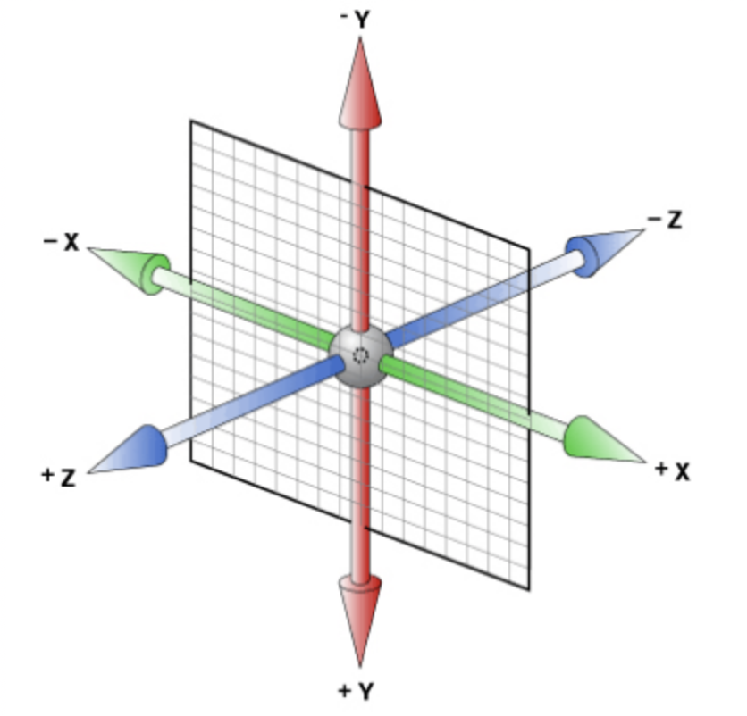

- x左边是负的，右边是正的
- y 上面是负的， 下面是正的
- z 里面是负的， 外面是正的

## rotateX() 

 就是沿着 x 立体旋转.

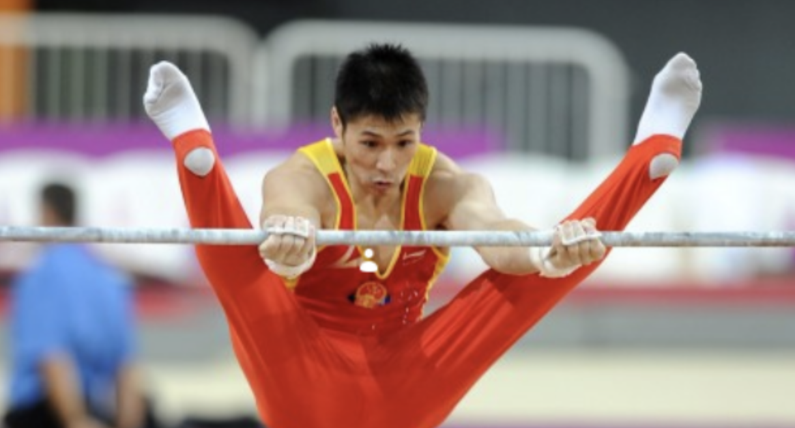

```html
<!DOCTYPE html>
<html lang="en">
<head>
    <meta charset="UTF-8">
    <meta name="viewport" content="width=device-width, initial-scale=1.0">
    <meta http-equiv="X-UA-Compatible" content="ie=edge">
    <title>Document</title>
    <style>
        body{

            /* 透视(perspective)，必须加在父类上 近大远小，数值越小，立体感更强，看的更大 */
            perspective: 500px;
        }
        img {
            display: block;
            margin: 100px auto;
            transition:all 1s ;
        }
        img:hover{
            transform: rotateX(45deg);
        }
    </style>
</head>
<body>
    
</body>
</html>
```

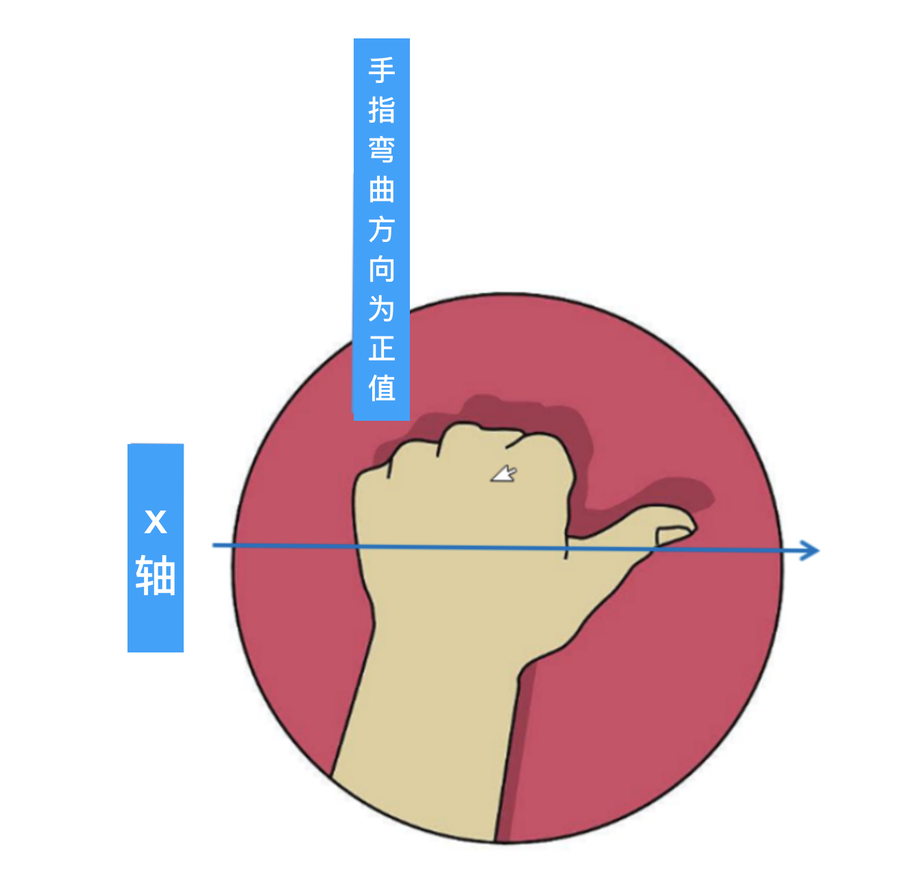

### rotateY()

沿着y轴进行旋转

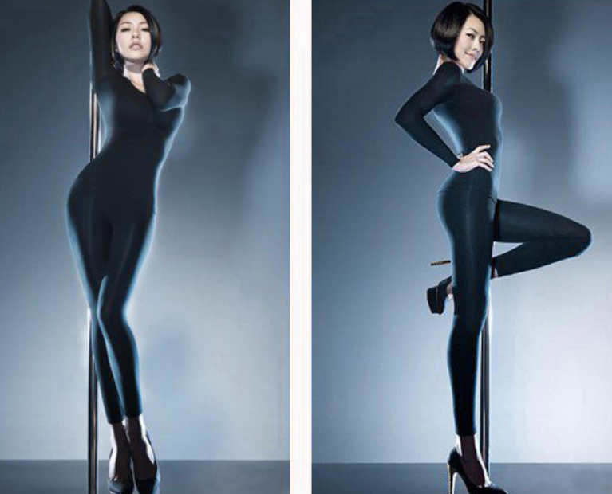

```html
<!DOCTYPE html>
<html lang="en">
<head>
    <meta charset="UTF-8">
    <meta name="viewport" content="width=device-width, initial-scale=1.0">
    <meta http-equiv="X-UA-Compatible" content="ie=edge">
    <title>Document</title>
    <style>
        body{

            /* 透视(perspective)，必须加在父类上 近大远小，数值越小，立体感更强，看的更大 */
            perspective: 500px;
        }
        img {
            display: block;
            margin: 100px auto;
            transition:all 1s ;
        }
        img:hover{
            transform: rotateY(-45deg);
        }
    </style>
</head>
<body>
    
</body>
</html>
```

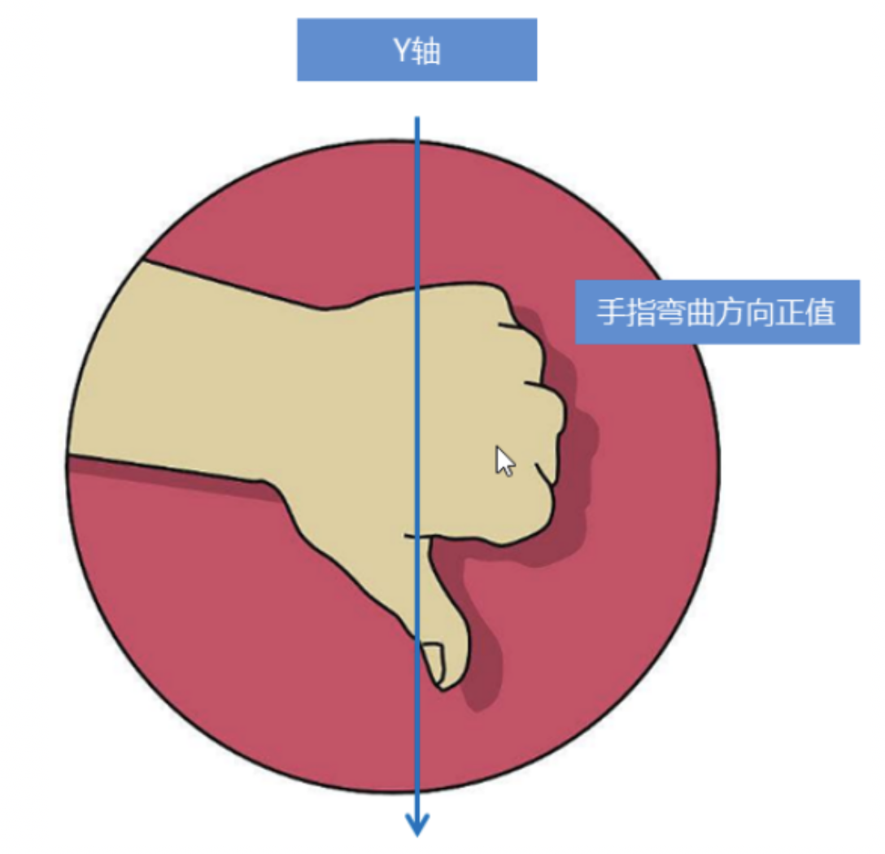

### rotateZ()

沿着z轴进行旋转

```html
<!DOCTYPE html>
<html lang="en">
<head>
    <meta charset="UTF-8">
    <meta name="viewport" content="width=device-width, initial-scale=1.0">
    <meta http-equiv="X-UA-Compatible" content="ie=edge">
    <title>Document</title>
    <style>
        body{

            /* 透视(perspective)，必须加在父类上 近大远小，数值越小，立体感更强，看的更大 */
            perspective: 500px;
        }
        img {
            display: block;
            margin: 100px auto;
            transition:all 1s ;
        }
        img:hover{
            transform: rotateZ(-45deg);
        }
    </style>
</head>
<body>
    
</body>
</html>
```

综合

```html
<!DOCTYPE html>
<html lang="en">
<head>
    <meta charset="UTF-8">
    <meta name="viewport" content="width=device-width, initial-scale=1.0">
    <meta http-equiv="X-UA-Compatible" content="ie=edge">
    <title>Document</title>
    <style>
        body{

            /* 透视(perspective)，必须加在父类上 近大远小，数值越小，立体感更强，看的更大 */
            perspective: 500px;
        }
        img {
            display: block;
            margin: 100px auto;
            transition:all 1s ;
        }
        img:hover{
            transform:rotateX(45deg) rotateY(180deg) rotateZ(90deg) skew(0,10deg); 
            /* 只要x轴旋转  1为旋转，0不旋转 */
            /* transform: rotate3d(x,y,z,deg);  */
            /* transform: rotate3d(1,0,0,45deg);  */
            /* transform: rotate3d(1,1,1,45deg); */
        }
    </style>
</head>
<body>
    
</body>
</html>
```

### 了解

### translateX(x)

仅水平方向移动（X轴移动）

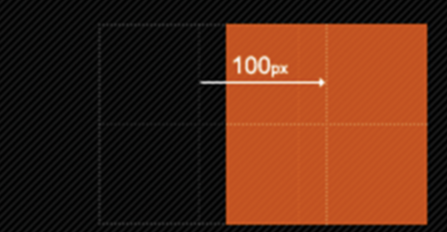

主要目的实现移动效果

### translateY(y)

仅垂直方向移动（Y轴移动）

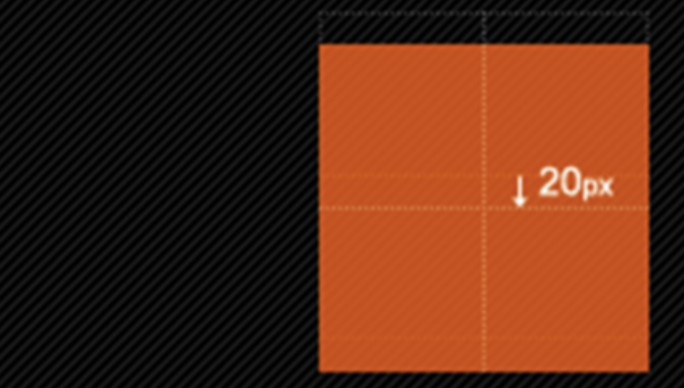

### translateZ(z)

translateZ的直观表现形式就是大小变化，实质是XY平面相对于视点的远近变化（说远近就一定会说到离什么参照物远或近，在这里参照物就是perspective属性）。比如设置了perspective为200px;那么transformZ的值越接近200，就是离的越近，看上去也就越大，超过200就看不到了，因为相当于跑到后脑勺去了，我相信你正常情况下，是看不到自己的后脑勺的。

### translate3d(x,y,z)

[注意]其中，x和y可以是长度值，也可以是百分比，百分比是相对于其本身元素水平方向的宽度和垂直方向的高度和；z只能设置长度值

```html
<!DOCTYPE html>
<html lang="en">
<head>
    <meta charset="UTF-8">
    <meta name="viewport" content="width=device-width, initial-scale=1.0">
    <meta http-equiv="X-UA-Compatible" content="ie=edge">
    <title>Document</title>
    <style>
        body{
            /* 透视(perspective)，必须加在父类上 近大远小，数值越小，立体感更强，看的更大 */
            perspective: 500px;
        }
        img {
            display: block;
            transition:all 1s ;
        }
        img:hover{
            /*transform: translateZ(100px);*/
            transform: translate3d(210px,210px,200px)
        }
    </style>
</head>
<body>
    
</body>
</html>
```


# 3D` 呈现 `transform-style

### 透视(perspective)

电脑显示屏是一个2D平面，图像之所以具有立体感（3D效果），其实只是一种视觉呈现，通过透视可以实现此目的。

透视可以将一个2D平面，在转换的过程当中，呈现3D效果。

- 透视原理： 近大远小 。
- 浏览器透视：把近大远小的所有图像，透视在屏幕上。
- perspective：视距，表示视点距离屏幕的长短。视点，用于模拟透视效果时人眼的位置

注：并非任何情况下需要透视效果，根据开发需要进行设置。

perspective 一般作为一个属性，设置给父元素，作用于所有3D转换的子元素

理解透视距离原理：


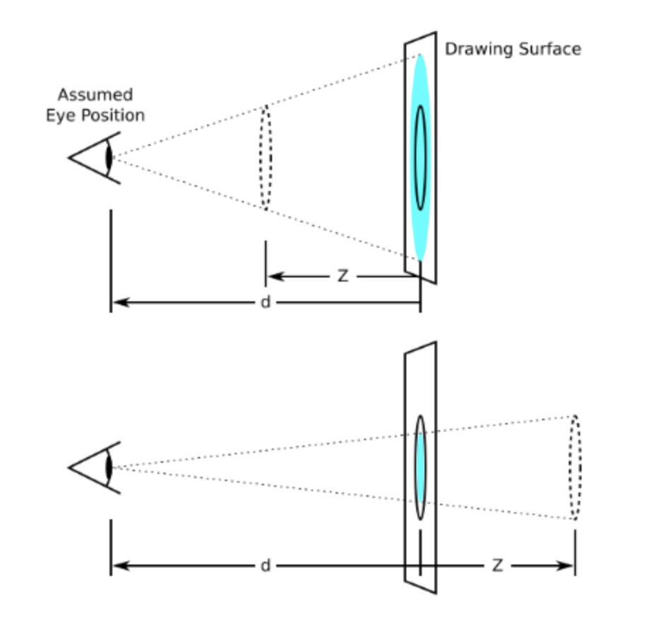

1. `transform-style`
   - ☆☆☆☆☆
   - 控制子元素是否开启三维立体环境
   - `transform-style: flat`  代表子元素不开启 `3D` 立体空间，默认的
   - `transform-style: preserve-3d` 子元素开启立体空间
   - 代码写给父级，但是影响的是子盒子

```html
<!DOCTYPE html>
<html lang="en">
<head>
    <meta charset="UTF-8">
    <meta name="viewport" content="width=device-width, initial-scale=1.0">
    <meta http-equiv="X-UA-Compatible" content="ie=edge">
    <title>Document</title>
    <style>
        body{
            perspective: 500px;
        }
        .box {
            position: relative;
            width: 200px;
            height:200px;
            margin: 30px auto;
            transition: all 2s;
        }
        .box:hover {
            transform: rotateY(60deg); 
        }
        .box div{
            background-color: green;
            width: 100%;
            height: 100%;
            position: absolute;
            top:0;
            left:0;
        }
        .box div:last-child{
            background-color: pink;
            transform: rotateX(60deg);
        }
    </style>
</head>
<body>
    <div class="box">
        <div></div>
        <div></div>
    </div>
</body>
</html>
```

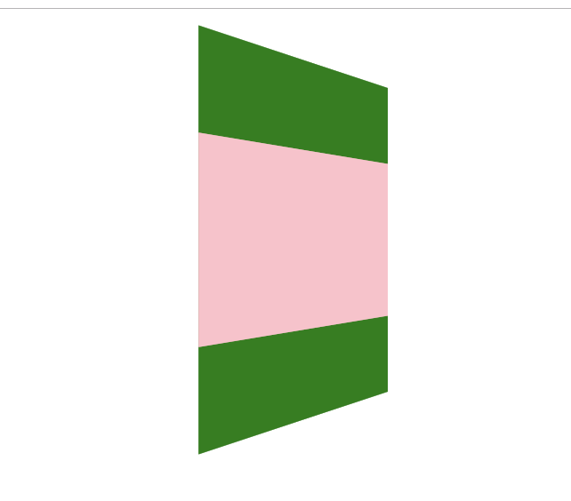

当我鼠标放上去的时候，旋转的效果是不对的，需要开启3d

```html
<!DOCTYPE html>
<html lang="en">
<head>
    <meta charset="UTF-8">
    <meta name="viewport" content="width=device-width, initial-scale=1.0">
    <meta http-equiv="X-UA-Compatible" content="ie=edge">
    <title>Document</title>
    <style>
        body{
			/* 试试 100-2000的效果 */
            perspective: 500px;
        }
        .box {
            position: relative;
            width: 200px;
            height:200px;
            margin: 30px auto;
            transition: all 2s;
			 /* 开启3d  加给元素的父盒子，效果在子盒子上 */
			 transform-style: preserve-3d;
        }
        .box:hover {
            transform: rotateY(60deg); 
        }
        .box div{
            background-color: green;
            width: 100%;
            height: 100%;
            position: absolute;
            top:0;
            left:0;
        }
        .box div:last-child{
            background-color: pink;
            transform: rotateX(60deg);
        }
    </style>
</head>
<body>
    <div class="box">
        <div></div>
        <div></div>
    </div>
</body>
</html>
```

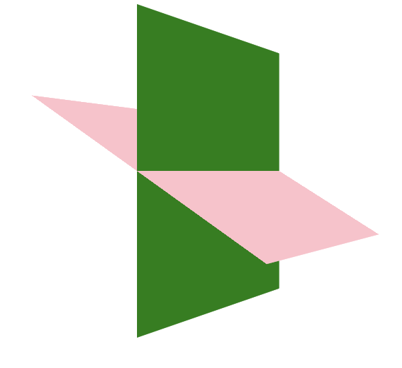


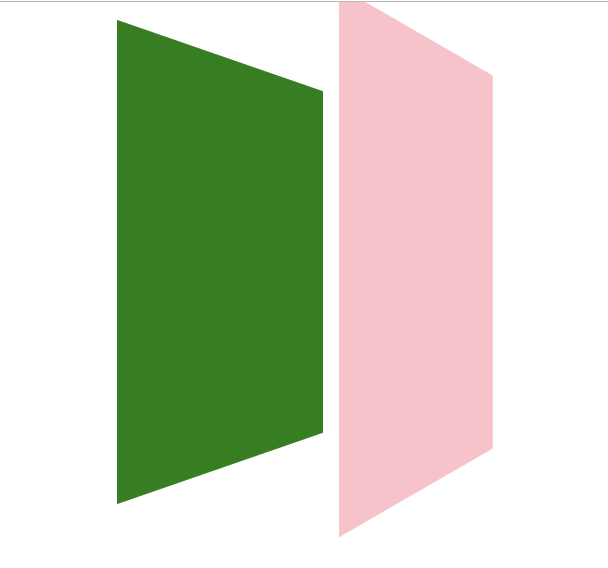

```html
<!DOCTYPE html>
<html lang="en">
<head>
    <meta charset="UTF-8">
    <meta name="viewport" content="width=device-width, initial-scale=1.0">
    <meta http-equiv="X-UA-Compatible" content="ie=edge">
    <title>Document</title>
    <style>
        body{
            perspective: 500px;
        }
        .box {
            position: relative;
            width: 200px;
            height:200px;
            margin: 30px auto;
            transition: all 2s;
            /* 开启3d  加给元素的父盒子，效果在子盒子上 */
            transform-style: preserve-3d;
        }
        .box:hover {
            transform: rotateY(60deg); 
        }
        .box div{
            background-color: green;
            width: 100%;
            height: 100%;
            position: absolute;
            top:0;
            left:0;
        }
        .box div:last-child{
            background-color: pink;
            transform: translateZ(100px);
        }
    </style>
</head>
<body>
    <div class="box">
        <div></div>
        <div></div>
    </div>
</body>
</html>
```

### money

```html
<!DOCTYPE html>
<html lang="en">

<head>
	<meta charset="UTF-8">
	<title>CSS3 3D转换</title>
	<style re>
		body {
			margin: 0;
			padding: 0;
		}

		.wallet {
			width: 500px;
			height: 211px;
			margin: 50px auto;
			position: relative;
		}

		.wallet::before,
		.wallet::after {
			content: '';
			position: absolute;
			left: 0;
			top: 0;
			width: 100%;
			height: 100%;
			/* 隐藏被旋转的 div 元素的背面 */
			backface-visibility: hidden;
			transition: all 0.6s;
		}

		.wallet::before {
			background: url("/资料/money1.png");
		}

		.wallet::after {
			background: url("/资料/money2.png");
			transform: rotateY(180deg);
		}

		.wallet:hover::before {
			transform: rotateY(180deg);
		}

		.wallet:hover::after {
			transform: rotateY(0deg);
		}
	</style>
</head>

<body>
	<div class="wallet"></div>
</body>

</html>
```

# Fullpage.js

插件功能介绍

- 基于 jQuery 的插件，它能够帮你很方便、很轻松的制作出全屏网站。
- 支持鼠标滚动，支持前进后退和键盘控制，多个回调函数，
  支持手机、平板触摸事件，支持 CSS3 动画，支持窗口缩放，窗口缩放时自动调整，
  可设置滚动宽度、背景颜色、滚动速度、循环选项、回调、文本对齐方式等等。
- 参考文档：http://www.dowebok.com/demo/2014/77/   或者
- <http://fullpage.81hu.com/>
- 原理：window.onmousewheel = function(){ console.log('ok') };

### 1、引入插件文件

这个插件依赖于jQuery，所以你还需要下载jQuery，并且在Fullpage插件之前引入。

```html
    <link rel="stylesheet" type="text/css" href="./css/jquery.fullpage.css" />
    <script src="./js/jquery-1.11.1.min.js"></script>
    <script type="text/javascript" src="./js/jquery.fullpage.js"></script>
```

### 2、cdn引入方式

```html
<link rel="stylesheet" href="http://cdn.dowebok.com/77/css/jquery.fullPage.css">
<script src="http://cdn.staticfile.org/jquery/1.8.3/jquery.min.js"></script>
<script src="http://cdn.dowebok.com/77/js/jquery.fullPage.min.js"></script>
```

### 3、html代码

默认情况下，每一屏幕的代码都需要有DIV包裹，并且设置DIV的类名为section，默认情况下，第一个setion将作为首页显示在页面上。

```html
<!DOCTYPE html>
<html lang="en">

<head>
    <meta charset="UTF-8">
    <meta name="viewport" content="width=device-width, initial-scale=1.0">
    <meta http-equiv="X-UA-Compatible" content="ie=edge">
    <title>Document</title>
    <link rel="stylesheet" type="text/css" href="./css/jquery.fullpage.css" />
    <script src="./js/jquery-1.11.1.min.js"></script>
    <script type="text/javascript" src="./js/jquery.fullpage.js"></script>
    <script src="./js/index.js"></script>
    <link rel="stylesheet" href="./css/index.css">
    <style>
        * {
            margin: 0;
        }
    </style>
</head>

<body>
    <div id="fullpage">
        <div class="section back1">第一屏</div>
        <div class="section back2">第二屏</div>
        <div class="section back3">第三屏 </div>
        <div class="section back4">第四屏 </div>
        <div class="section back5">第五屏 </div>
    </div>
</body>

</html>
```

### 4、js初始化

```js
//<script type="text/javascript" src="./js/index.js"></script>html别忘引入index.js文件
$(function(){
    $('#fullpage').fullpage();
})
```

## 二、参考文档

| 选项                              | 类型   | 默认值      | 说明                                                         |
| :-------------------------------- | :----- | ----------- | ------------------------------------------------------------ |
| verticalCentered                  | 字符串 | true        | 内容是否垂直居中                                             |
| resize                            | 布尔值 | false       | 字体是否随着窗口缩放而缩放                                   |
| slidesColor                       | 函数   | 无          | 设置背景颜色                                                 |
| anchors                           | 数组   | 无          | 定义锚链接                                                   |
| scrollingSpeed                    | 整数   | 700         | 滚动速度，单位为毫秒                                         |
| easing                            | 字符串 | easeInQuart | 滚动动画方式                                                 |
| menu                              | 布尔值 | false       | 绑定菜单，设定的相关属性与 anchors 的值对应后，菜单可以控制滚动 |
| navigation                        | 布尔值 | false       | 是否显示项目导航                                             |
| navigationPosition                | 字符串 | right       | 项目导航的位置，可选 left 或 right                           |
| navigationColor                   | 字符串 | #000        | 项目导航的颜色                                               |
| navigationTooltips                | 数组   | 空          | 项目导航的 tip                                               |
| slidesNavigation                  | 布尔值 | false       | 是否显示左右滑块的项目导航                                   |
| slidesNavPosition                 | 字符串 | bottom      | 左右滑块的项目导航的位置，可选 top 或 bottom                 |
| controlArrowColor                 | 字符串 | #fff        | 左右滑块的箭头的背景颜色                                     |
| loopBottom                        | 布尔值 | false       | 滚动到最底部后是否滚回顶部                                   |
| loopTop                           | 布尔值 | false       | 滚动到最顶部后是否滚底部                                     |
| loopHorizontal                    | 布尔值 | true        | 左右滑块是否循环滑动                                         |
| autoScrolling                     | 布尔值 | true        | 是否使用插件的滚动方式，如果选择 false，则会出现浏览器自带的滚动条 |
| scrollOverflow                    | 布尔值 | false       | 内容超过满屏后是否显示滚动条                                 |
| css3                              | 布尔值 | false       | 是否使用 CSS3 transforms 滚动                                |
| paddingTop                        | 字符串 | 0           | 与顶部的距离                                                 |
| paddingBottom                     | 字符串 | 0           | 与底部距离                                                   |
| fixedElements                     | 字符串 | 无          |                                                              |
| normalScrollElements              |        | 无          |                                                              |
| keyboardScrolling                 | 布尔值 | true        | 是否使用键盘方向键导航                                       |
| touchSensitivity                  | 整数   | 5           |                                                              |
| continuousVertical                | 布尔值 | false       | 是否循环滚动，与 loopTop 及 loopBottom 不兼容                |
| animateAnchor                     | 布尔值 | true        |                                                              |
| normalScrollElementTouchThreshold | 整数   | 5           | -                                                            |

- 方法

| 名称                   | 说明                                     |
| ---------------------- | ---------------------------------------- |
| moveSectionUp()        | 向上滚动                                 |
| moveSectionDown()      | 向下滚动                                 |
| moveTo(section, slide) | 滚动到                                   |
| moveSlideRight()       | slide 向右滚动                           |
| moveSlideLeft()        | slide 向左滚动                           |
| setAutoScrolling()     | 设置页面滚动方式，设置为 true 时自动滚动 |
| setAllowScrolling()    | 添加或删除鼠标滚轮/触控板控制            |
| setKeyboardScrolling() | 添加或删除键盘方向键控制                 |
| setScrollingSpeed()    | 定义以毫秒为单位的滚动速度               |

- 回调函数

| 名称           | 说明                                                         |
| -------------- | ------------------------------------------------------------ |
| afterLoad      | 滚动到某一屏后的回调函数，接收 anchorLink 和 index 两个参数，anchorLink 是锚链接的名称，index 是序号，从1开始计算 |
| onLeave        | 滚动前的回调函数，接收 index、nextIndex 和 direction 3个参数：index 是离开的“页面”的序号，从1开始计算；nextIndex 是滚动到的“页面”的序号，从1开始计算；direction 判断往上滚动还是往下滚动，值是 up 或 down。 |
| afterRender    | 页面结构生成后的回调函数，或者说页面初始化完成后的回调函数   |
| afterSlideLoad | 滚动到某一水平滑块后的回调函数，与 afterLoad 类似，接收 anchorLink、index、slideIndex、direction 4个参数 |
| onSlideLeave   | 某一水平滑块滚动前的回调函数，与 onLeave 类似，接收 anchorLink、index、slideIndex、direction 4个参数 |


```js
$(function(){
    $('#fullpage').fullpage({
		//Navigation
		menu: false,//绑定菜单，设定的相关属性与anchors的值对应后，菜单可以控制滚动，默认为false。
		anchors:['firstPage', 'secondPage'],//anchors定义锚链接，默认为[]
		lockAnchors: false,//是否锁定锚链接，默认为false,设为true后链接地址不会改变
		navigation: false,//是否显示导航，默认为false
		navigationPosition: 'right',//导航小圆点的位置
		navigationTooltips: ['firstSlide', 'secondSlide'],//导航小圆点的提示
		showActiveTooltip: false,//是否显示当前页面的tooltip信息
		slidesNavigation: true,//是否显示横向幻灯片的导航，默认为false
		slidesNavPosition: 'bottom',//横向导航的位置，默认为bottom，可以设置为top或bottom
		 
		//Scrolling
		css3: true,//是否使用CSS3 transforms来实现滚动效果，默认为true
		scrollingSpeed: 700,//设置滚动速度，单位毫秒，默认700
		autoScrolling: true,//是否使用插件的滚动方式，默认为true,若为false则会出现浏览器自带滚动条
		fitToSection: true,//设置是否自适应整个窗口的空间，默认值：true
		scrollBar: false,//是否包含滚动条，默认为false,若为true浏览器自带滚动条出现
		easing: 'easeInOutCubic',//定义页面section滚动的动画方式，若修改此项需引入jquery.easing插件
		easingcss3: 'ease',//定义页面section滚动的过渡效果，若修改此项需引入第三方插件
		loopBottom: false,//滚动到最低部后是否连续滚动到顶部，默认为false
		loopTop: false,//滚动到最顶部后是否连续滚动到底部，默认为false
		loopHorizontal: true,//横向slide幻灯片是否循环滚动，默认为true
		continuousVertical: false,//是否循环滚动，不兼容loopTop和loopBottom选项
		normalScrollElements: '#element1, .element2',//避免自动滚动，滚动时的一些元素，例如百度地图
		scrollOverflow: false,//内容超过满屏后是否显示滚动条，true则显示滚动条，若需滚动查看内容还需要jquery.slimscroll插件的配合
		touchSensitivity: 15,//在移动设备中滑动页面的敏感性，默认为5最高100，越大越难滑动
		normalScrollElementTouchThreshold: 5,
		 
		//Accessibility
		keyboardScrolling: true,//是否可以使用键盘方向键导航，默认为true
		animateAnchor: true,//锚链接是否可以控制滚动动画，默认为true,若为false则锚链接定位失效
		recordHistory: true,//是否记录历史，默认为true,浏览器的前进后退可导航。若autoScrolling:false,那么这个属性将被关闭
		 
		//Design
		controlArrows: true,//定义是否通过箭头来控制slide,默认true
		verticalCentered: true,//定义每一页的内容是否垂直居中，默认true
		resize : false,//字体是否随窗口缩放而缩放，默认false
		sectionsColor : ['#ccc', '#fff'],//为每个section设置background-color属性
		paddingTop: '3em',设置每一个section顶部的padding,默认为0
		paddingBottom: '10px',设置每一个section底部的padding,默认为0
		fixedElements: '#header, .footer',固定元素，默认为null,需要配置一个jquery选择器，在页面滚动时，fixElements设置的元素不滚动
		responsiveWidth: 0,
		responsiveHeight: 0,
		 
		//Custom selectors
		sectionSelector: '.section',//section选择器。默认为.section
		slideSelector: '.slide',//slide选择器，默认为.slide
		 
		//events
		onLeave: function(index, nextIndex, direction){},
		afterLoad: function(anchorLink, index){},
		afterRender: function(){},
		afterResize: function(){},
		afterSlideLoad: function(anchorLink, index, slideAnchor, slideIndex){},
		onSlideLeave: function(anchorLink, index, slideIndex, direction, nextSlideIndex){}
	});
})
```

## 基础结构

```js
$(function(){
    $('#fullpage').fullpage({
		//Navigation
		navigation: true,//是否显示导航，默认为false
		navigationPosition: 'right',//导航小圆点的位置
		//Scrolling
		scrollingSpeed: 500,//设置滚动速度，单位毫秒，默认700
        continuousVertical: true,//是否循环滚动，不兼容loopTop和loopBottom选项
	});
})
```

```css
/* 改变导航颜色 */
#fp-nav ul li a.active span{
    background-color: white;
}
#fp-nav ul li a span{
    background-color: white;
}
```

- onLeave事件


# 项目3天

- 利用fullpage插件完成项目
- 第一屏：会员福利(鼠标滑过触发)


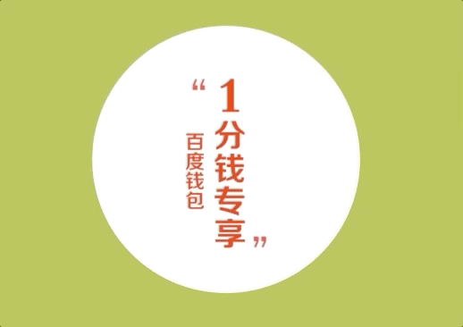


- 第二屏：旋转木马（动画）


- 第三屏：奔跑的大熊


- 第四屏-第八屏：360急速浏览器官网

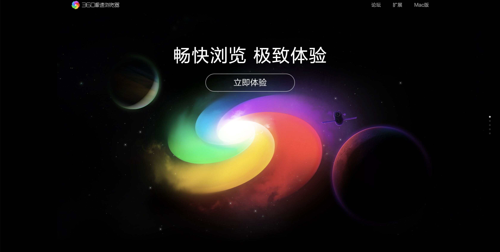


# 答案

### 旋转木马

```html
<!DOCTYPE html>
<html lang="en">

<head>
    <meta charset="UTF-8">
    <meta name="viewport" content="width=device-width, initial-scale=1.0">
    <meta http-equiv="X-UA-Compatible" content="ie=edge">
    <title>Document</title>
    <style>
        body {
            perspective: 1000px;
        }
        
        section {
            position: relative;
            width: 300px;
            height: 500px;
            margin: 150px auto;
            transform-style: preserve-3d;
            /* 添加动画效果 */
            animation: rotate 10s linear infinite;
			background: url('/资料/001.png') no-repeat;
			background-size: cover;
			
        }
        
        section:hover {
            /* 鼠标放入section 停止动画 */
            animation-play-state: paused;
        }
        
        @keyframes rotate {
            0% {
                transform: rotateY(0);
            }
            100% {
                transform: rotateY(360deg);
            }
        }
        
        section div {
            position: absolute;
            top: 40%;
            left: 0;
            width: 100%;
            height: 100%;
			background: url('/资料/002.jpg') no-repeat;
			background-size: 200px 200px;
        }
        
        section div:nth-child(1) {
            transform: rotateY(0) translateZ(300px);
        }
        
        section div:nth-child(2) {
            /* 先旋转好了再 移动距离 */
            transform: rotateY(60deg) translateZ(300px);
        }
        
        section div:nth-child(3) {
            /* 先旋转好了再 移动距离 */
            transform: rotateY(120deg) translateZ(300px);
        }
        
        section div:nth-child(4) {
            /* 先旋转好了再 移动距离 */
            transform: rotateY(180deg) translateZ(300px);
        }
        
        section div:nth-child(5) {
            /* 先旋转好了再 移动距离 */
            transform: rotateY(240deg) translateZ(300px);
        }
        
        section div:nth-child(6) {
            /* 先旋转好了再 移动距离 */
            transform: rotateY(300deg) translateZ(300px);
        }
    </style>
</head>

<body>
    <section>
        <div></div>
        <div></div>
        <div></div>
        <div></div>
        <div></div>
        <div></div>
    </section>
</body>

</html>
```


### 百度钱包

```html
<!DOCTYPE html>
<html lang="en">
<head>
	<meta charset="UTF-8">
	<title>CSS3 3D转换</title>
	<style>
		body {
			margin: 0;
			padding: 0;
			background-color: #B3C04C;
		}

		.wallet {
			width: 300px;
			height: 300px;
			margin: 50px auto;
			position: relative;
		}

		.wallet::before, .wallet::after {
			content: '';
			position: absolute;
			left: 0;
			top: 0;
			width: 100%;
			height: 100%;
			border-radius: 150px;
			backface-visibility: hidden;
			transition: all 0.6s;
		}
		.wallet::before {
			background: url('/资料/会员福利.png') left top;
			transform: rotateY(0deg);
		}
		.wallet::after {
			background: url('/资料/会员福利.png') right top;
			transform: rotateY(180deg);
		}
		.wallet:hover::before {
			transform: rotateY(180deg);
		}
		.wallet:hover::after {
			transform: rotateY(0deg);
		}

	</style>
</head>
<body>
	<div class="wallet"></div>
</body>
</html>
```


### 大熊代码

```html
<!DOCTYPE html>
<html lang="en">

<head>
    <meta charset="UTF-8">
    <meta name="viewport" content="width=device-width, initial-scale=1.0">
    <meta http-equiv="X-UA-Compatible" content="ie=edge">
    <title>Document</title>
    <style>
        body {
            background: url("/资料/bg-container-b19993e.png") repeat-x;
            height: 100%;
        }

        .star {
            width: 100%;
            height: 100%;
            max-height: 100%;
            position: absolute;
            top: 0;
            left: 0;
            /* height: calc(100vh - 20px); */
            /* 默认水平平铺 */
            background: url("/资料/bg-space-6e69cd1.png");
            z-index: -5;
            animation: starmove 200s linear infinite forwards;
        }

        /* star */
        @keyframes starmove {
            100% {
                background-position: -1920px 0;
            }
        }


        .white-m {
            width: 100%;
            height: 336px;
            position: absolute;
            background: url("/资料/bg1.png") repeat-x;
            left: 0;
            bottom: -84px;
            transform: scaleY(0.5);
            animation: whitemove 60s linear infinite forwards;
        }

        @keyframes whitemove {
            100% {
                background-position: -1920px 0;
            }
        }

        .lightgray-m {
            width: 100%;
            height: 384px;
            position: absolute;
            background: url("/资料/bg-mountain-2-f8a4360.png") repeat-x;
            left: 0;
            bottom: -92px;
            z-index: -3;
            transform: scaleY(0.5);
            animation: lightgraymove 120s linear infinite forwards;
        }

        @keyframes lightgraymove {
            100% {
                background-position: -1920px 0;
            }
        }

        .gray-m {
            width: 100%;
            height: 569px;
            position: absolute;
            background: url("/资料/bg2.png") repeat-x;
            left: 0;
            bottom: -92px;
            z-index: -4;
            transform: scaleY(0.5);
            animation: graymove 160s linear infinite forwards;
        }

        @keyframes graymove {
            100% {
                background-position: -1920px 0;
            }
        }

        /* 光 */
        .aurora {
            width: 640px;
            height: 352px;
            position: relative;
            left: 50%;
            margin-left: -320px;
            top: 200px;
        }

        .aurora div {
            position: absolute;
            width: 100%;
            height: 100%;
            transform: scale(2.1, 2.2);
        }

        .aurora div:nth-child(1) {
            background: url("/资料/bg-aurora-1-322b435.png") no-repeat;
            animation: lightshow 2s linear infinite alternate forwards;
            opacity: 0;
        }

        .aurora div:nth-child(2) {
            background: url("/资料/bg-aurora-2-9872721.png") no-repeat;
            animation: lightshow 2s linear 2s infinite alternate forwards;
            opacity: 0;
        }

        .aurora div:nth-child(3) {
            background: url("/资料/bg-aurora-3-96add9f.png") no-repeat;
            animation: lightshow 2s linear 4s infinite alternate forwards;
            opacity: 0;
        }

        .aurora div:nth-child(4) {
            background: url("/资料/bg-aurora-4-131b685.png") no-repeat;
            animation: lightshow 2s linear 6s infinite alternate forwards;
            opacity: 0;
        }

        .aurora div:nth-child(5) {
            background: url("/资料/bg-aurora-5-3514cd0.png") no-repeat;
            animation: lightshow 2s linear 8s infinite alternate forwards;
            opacity: 0;
        }

        @keyframes lightshow {
            0% {
                opacity: 0;
            }

            100% {
                opacity: 1;
            }
        }


        /* 熊 */
        .bear {
            position: absolute;
            width: 200px;
            height: 100px;
            bottom: 30px;
            background: url("/资料/bear.png") no-repeat;
            /* 我们元素可以添加多个动画， 用逗号分隔 */
            animation: bear .4s steps(8) infinite, move 3s forwards;
        }

        @keyframes bear {
            0% {
                background-position: 0 0;
            }

            100% {
                background-position: -1600px 0;
            }
        }

        @keyframes move {
            0% {
                left: 0;
            }

            100% {
                left: 50%;
                /* margin-left: -100px; */
                transform: translateX(-50%);
            }
        }

        /* logo */
        .logo {
            background: url("/资料/ice.png");
            position: absolute;
            left: 30%;
            top: 25%;
            width: 246px;
            height: 269px;
            z-index: 77;
            animation: logomove 1s linear;
        }

         .txt1 {
            font-size: 62px;
            color: white;
            width: 300px;
            position: absolute;
            left: 48%;
            top:24%;
            animation: logomove 1s linear;
        }

         .txt2 {
            font-size: 20px;
            color: white;
            width: 400px;
            position: absolute;
            left: 49%;
            top:40%;
            letter-spacing: 10px;
            animation: itmove 1s linear;
        }


        /* logo动画 */
        @keyframes logomove {
            0%{
                top:44%;
                transform: scale(0.5,0.5);
            }
            100%{
                transform: scale(1,1);
            }
        }
        @keyframes itmove {
            0%{
                top:60%;
                transform: scale(0.5,0.5);
            }
            100%{
                transform: scale(1,1);
            }
        }
    </style>
</head>

<body>
    <div>
        <div class="star">
        </div>
        <div class="white-m">
        </div>
        <div class="lightgray-m">
        </div>
        <div class="gray-m"></div>
        <div class="aurora">
            <div></div>
            <div></div>
            <div></div>
            <div></div>
            <div></div>
        </div>
        <div class="bear">
        </div>
        <div class="logo">

        </div>
        <p class="txt1">爱尚实训</p>
        <p class="txt2">专业IT培训机构</p>
    </div>
</body>

</html>
```

项目

```html
<!DOCTYPE html>
<html>

<head>
    <meta charset="utf-8">
    <title>fullPage.js 基本演示_fullPage.js全屏滚动插件</title>
    <meta name="keywords" content="fullPage.js,全屏滚动,jQuery全屏滚动,fullPage全屏滚动,jQuery插件">
    <meta name="description"
        content="fullPage.js 是一个基于 jQuery 的插件，它能够很方便、很轻松的制作出全屏网站。本站详细介绍fullPage各初始化属性设置。如果你也希望你的网站能设计成全屏的，显得更上档次，你可以试试fullPage.js。">
    <link rel="stylesheet" href="../资料/js/jquery.fullpage.css">
    <link rel="stylesheet" href="./back1.css">
</head>

<body>
    <div id="fullPage">
        <div class="section back1">
            <div class="star">
            </div>
            <div class="white-m">
            </div>
            <div class="lightgray-m">
            </div>
            <div class="gray-m"></div>
            <div class="aurora">
                <div></div>
                <div></div>
                <div></div>
                <div></div>
                <div></div>
            </div>
            <div class="bear">
            </div>
            <div class="logo">

            </div>
            <p class="txt1">爱尚实训</p>
            <p class="txt2">专业IT培训机构</p>
        </div>
        <div class="section back2">
            <div class="bg"></div>
            <div class="ball1"></div>
            <div class="ball2"></div>
            <div class="ball3"></div>
        </div>
    </div>
    <script src="http://libs.baidu.com/jquery/1.7.2/jquery.js"></script>
    <script src="../资料/js/jquery.fullpage.js"></script>
    <script>
        $(function () {
            $('#fullPage').fullpage({
                sectionsColor: ['#1bbc9b', 'black', '#7BAABE', 'black'],
                navigation: true,//是否显示导航，默认为false
                navigationPosition: 'right',//导航小圆点的位置
                scrollingSpeed: 700,//设置滚动速度，单位毫秒，默认700
                continuousVertical: true,
                onLeave: function (index,nextIndex) {
                    console.log(nextIndex)
                    /*index 序号 1开始  当前屏的序号*/
                    // $('.back2').addClass('now');
                    if(nextIndex==2){
                        $('.logo').addClass('leave').removeClass('now');
                        $('.txt1').addClass('leave').removeClass('now');
                        $('.txt2').addClass('leave').removeClass('now');
                    }else if(nextIndex==1){
                        $('.logo').addClass('now').removeClass('leave');
                        $('.txt1').addClass('now').removeClass('leave');
                        $('.txt2').addClass('now').removeClass('leave');
                    }
                },
            });
        });

    </script>
</body>

</html>
```

```css
#fp-nav ul li span {
    background-color: white !important;
}
.back1{
    background: url("/资料/bg-container-b19993e.png") repeat-x;
    height: 100%;
}
.star {
    width: 100%;
    height: 100%;
    position: absolute;
    top: 0;
    left: 0;
    /* 默认水平平铺 */
    background: url("/资料/bg-space-6e69cd1.png");
    animation: starmove 200s linear infinite forwards;
}

/* star */
@keyframes starmove {
    100% {
        background-position: -1920px 0;
    }
}


.white-m {
    width: 100%;
    height: 336px;
    position: absolute;
    background: url("/资料/bg1.png") repeat-x;
    left: 0;
    bottom: -84px;
    transform: scaleY(0.5);
    z-index: 10;
    animation: whitemove 60s linear infinite forwards;
}

@keyframes whitemove {
    100% {
        background-position: -1920px 0;
    }
}

.lightgray-m {
    width: 100%;
    height: 384px;
    position: absolute;
    background: url("/资料/bg-mountain-2-f8a4360.png") repeat-x;
    left: 0;
    bottom: -92px;
    z-index: 5;
    transform: scaleY(0.5);
    animation: lightgraymove 120s linear infinite forwards;
}

@keyframes lightgraymove {
    100% {
        background-position: -1920px 0;
    }
}

.gray-m {
    width: 100%;
    height: 569px;
    position: absolute;
    background: url("/资料/bg2.png") repeat-x;
    left: 0;
    bottom: -92px;
    transform: scaleY(0.5);
    animation: graymove 160s linear infinite forwards;
}

@keyframes graymove {
    100% {
        background-position: -1920px 0;
    }
}

/* 光 */
.aurora {
    width: 640px;
    height: 352px;
    position: relative;
    left: 50%;
    margin-left: -320px;
    top: -14%;
}

.aurora div {
    position: absolute;
    width: 100%;
    height: 100%;
    transform: scale(1.8, 1.8);
}

.aurora div:nth-child(1) {
    background: url("/资料/bg-aurora-1-322b435.png") no-repeat;
    animation: lightshow 2s linear infinite alternate forwards;
    opacity: 0;
}

.aurora div:nth-child(2) {
    background: url("/资料/bg-aurora-2-9872721.png") no-repeat;
    animation: lightshow 2s linear 2s infinite alternate forwards;
    opacity: 0;
}

.aurora div:nth-child(3) {
    background: url("/资料/bg-aurora-3-96add9f.png") no-repeat;
    animation: lightshow 2s linear 4s infinite alternate forwards;
    opacity: 0;
}

.aurora div:nth-child(4) {
    background: url("/资料/bg-aurora-4-131b685.png") no-repeat;
    animation: lightshow 2s linear 6s infinite alternate forwards;
    opacity: 0;
}

.aurora div:nth-child(5) {
    background: url("/资料/bg-aurora-5-3514cd0.png") no-repeat;
    animation: lightshow 2s linear 8s infinite alternate forwards;
    opacity: 0;
}

@keyframes lightshow {
    0% {
        opacity: 0;
    }

    100% {
        opacity: 1;
    }
}


/* 熊 */
.bear {
    position: absolute;
    width: 200px;
    height: 100px;
    bottom: 30px;
    background: url("/资料/bear.png") no-repeat;
    z-index: 20;
    /* 我们元素可以添加多个动画， 用逗号分隔 */
    animation: bear .4s steps(8) infinite, move 3s forwards;
}

@keyframes bear {
    0% {
        background-position: 0 0;
    }

    100% {
        background-position: -1600px 0;
    }
}

@keyframes move {
    0% {
        left: 0;
    }

    100% {
        left: 50%;
        /* margin-left: -100px; */
        transform: translateX(-50%);
    }
}

/* logo */
.logo {
    background: url("/资料/ice.png");
    position: absolute;
    left: 30%;
    top: 25%;
    width: 246px;
    height: 269px;
    z-index: 77;
    animation: logomove 1s linear;
}

 .txt1 {
    font-size: 62px;
    color: white;
    width: 300px;
    position: absolute;
    left: 48%;
    z-index: 77;
    top:24%;
    animation: logomove 1s linear;
}

 .txt2 {
    font-size: 20px;
    color: white;
    width: 400px;
    position: absolute;
    left: 49%;
    top:40%;
    z-index: 77;
    letter-spacing: 10px;
    animation: itmove 1s linear;
}


/* logo动画 */
@keyframes logomove {
    0%{
        top:44%;
        transform: scale(0.5,0.5);
    }
    100%{
        transform: scale(1,1);
    }
}
@keyframes itmove {
    0%{
        top:60%;
        transform: scale(0.5,0.5);
    }
    100%{
        transform: scale(1,1);
    }
}
/* 第一屏切换到第二屏动画 */

.back2.now{
    color: red;
}
/* 滚动到第二屏 logo的动画 */
.logo.leave {
    animation: logoleave 0.6s linear forwards;
}
@keyframes logoleave{
    from{
    }
    to{
        transform: translate(0px,750px);
    }
}
.logo.now {
    animation: logonow 0.6s linear forwards;
}
@keyframes logonow{
    from{
        transform: translate(0px,750px);
    }
    to{
        transform: translate(0px,0px);
    }
}
.txt1.leave,.txt2.leave{
    animation: txtleave 0.6s linear forwards;
}
@keyframes txtleave{
    from{
    }
    to{
        transform: translate(0px,750px);
    }
}
.txt1.now,.txt2.now {
    animation: txtnow 0.6s linear forwards;
}
@keyframes txtnow{
    from{
        transform: translate(0px,750px);
    }
    to{
        transform: translate(0px,0px);
    }
}

/* 第二屏 */
.back2  {
    position: absolute;
    background: url('../资料/bg3.jpg');
    background-size: cover;
    
}
.ball1{
    width: 254px;
    height: 254px;
    background: url('../资料/ball1.png');
    position: absolute;
    top:40%;
    left: 17%;
    animation: ball 3s linear infinite alternate;
}
@keyframes ball{
    50%{
        top:50%
    }
}
.ball2{
    width: 430px;
    height: 430px;
    background: url('../资料/ball2.png');
    position: absolute;
    top:30%;
    left: 66%;
    animation: ball 7s linear 1s infinite alternate;
}
.ball3{
    width: 138px;
    height: 138px;
    background: url('../资料/ball3.png');
    position: absolute;
    top:40%;
    left: 56%;
    animation: ball3 50s linear infinite ;
}
@keyframes ball3{
    from{
        transform: rotate(0);
    }
    to{
        transform: rotate(360deg);
    }
}
```


