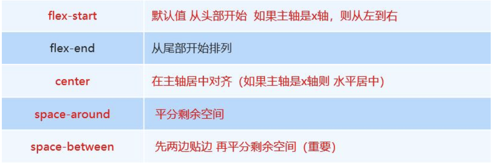
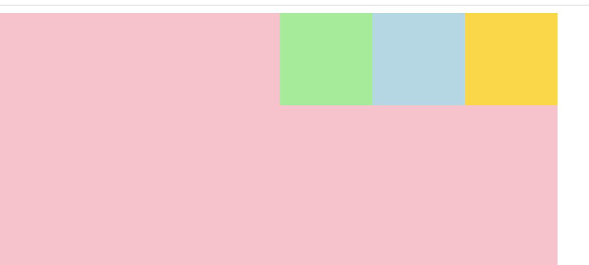
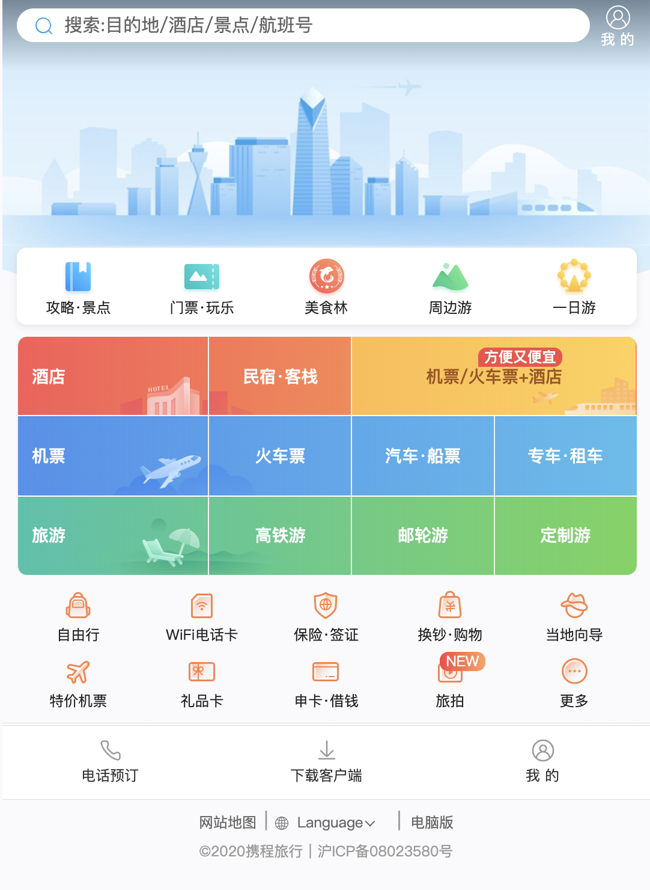

# flex布局

## 1.0传统布局和flex布局对比

### 1.1传统布局

- 兼容性好
- 布局繁琐
- 局限性，不能再移动端很好的布局

```html
<!DOCTYPE html>
<html lang="en">
<head>
    <meta charset="UTF-8">
    <meta name="viewport" content="width=device-width, initial-scale=1.0">
    <meta http-equiv="X-UA-Compatible" content="ie=edge">
    <title>Document</title>
    <style>
        .box {
            position: relative;
            width: 1000px;
            height:300px;
            background-color: pink;
            margin: 30px auto;
        }
        .box div{
            background-color: green;
            width: 100px;
            height: 100px;
            float: left;
            margin-right: 5px;
        }
    </style>
</head>
<body>
    <div class="box">
        <div></div>
        <div></div>
        <div></div>
    </div>
</body>
</html>
```


### 1.2 flex布局

- 操作方便，布局极其简单，移动端使用比较广泛
- pc端浏览器支持情况比较差
- IE11或更低版本不支持flex或仅支持部分

### 1.3 建议

- 如果是pc端页面布局，还是采用传统方式
- 如果是移动端或者是不考虑兼容的pc则采用flex

## 2.0 flex布局原理

- flex 是 flexible Box 的缩写，意为"弹性布局"，用来为盒状模型提供最大的灵活性，任何一个容器都可以指定为 flex 布局。
- 当我们为父盒子设为 flex 布局以后，子元素的 float、vertical-align 属性将失效。
- flex布局又叫伸缩布局 、弹性布局 、伸缩盒布局 、弹性盒布局 
- 采用 Flex 布局的元素，称为 Flex 容器（flexcontainer），简称"容器"。它的所有子元素自动成为容器成员，称为 Flex 项目（flexitem），简称"项目"。

```html
<!DOCTYPE html>
<html lang="en">
<head>
    <meta charset="UTF-8">
    <meta name="viewport" content="width=device-width, initial-scale=1.0">
    <title>Document</title>
    <style>
        .box{
            width: 1000px;
            height: 700px;
            background-color: pink;
            display: flex;
            
        }
        .box div:nth-child(1){
            width: 100px;
            height: 100px;
            background-color: lightgreen;
            /* float: left; */
        }
        .box div:nth-child(2){
            width: 100px;
            height: 100px;
            background-color: lightblue;
            /* float: left; */
        }
        .box div:nth-child(3){
            width: 100px;
            height: 100px;
            background-color: gold;
            /* float: left; */
        }
    </style>
</head>
<body>
    <div class="box">
        <div></div>
        <div></div>
        <div></div>
    </div>
</body>
</html>
```


#### **总结**：就是通过给父盒子添加flex属性，来控制子盒子的位置和排列方式


## 3.0 父项常见属性

- flex-direction：设置主轴的方向
- justify-content：设置主轴上的子元素排列方式
- flex-wrap：设置子元素是否换行  
- align-content：设置侧轴上的子元素的排列方式（多行）
- align-items：设置侧轴上的子元素排列方式（单行）
- flex-flow：复合属性，相当于同时设置了 flex-direction 和 flex-wrap

### 3.1 flex-direction设置主轴的方向

- 在 flex 布局中，是分为主轴和侧轴两个方向，同样的叫法有 ： 行和列、x 轴和y 轴
- 默认主轴方向就是 x 轴方向，水平向右
- 默认侧轴方向就是 y 轴方向，水平向下


- 注意： 主轴和侧轴是会变化的，就看 flex-direction 设置谁为主轴，剩下的就是侧轴。而我们的子元素是跟着主轴来排列的

  

  ​

```css
.box{
    width: 1000px;
    height: 700px;
    background-color: pink;
    display: flex;
    /* flex-direction: row; */
    flex-direction: row-reverse;
    /* flex-direction: column; */
    /* flex-direction: column-reverse; */
}
```

### 3.2 justify-content 设置主轴上的子元素排列方式



- flex-end

```css
.box{
            width: 1000px;
            height: 700px;
            background-color: pink;
            display: flex;
            flex-direction: row;
            /* flex-direction: row-reverse; */
            /* flex-direction: column; */
            /* flex-direction: column-reverse; */
            justify-content: flex-end;
        }
```



- center

```css
justify-content: center;
```


- space-around:平分剩余空间

```css
justify-content: space-around;
```


- space-between:先贴两边，在平分剩余空间

```CSS
justify-content: space-between;
```


### 3.3 flex-wrap设置是否换行

- 默认情况下，项目都排在一条线（又称”轴线”）上。flex-wrap属性定义，flex布局中默认是不换行的。

- nowrap 不换行（放不下，就缩小子元素的宽度）

- wrap 换行

  

```html
<!DOCTYPE html>
<html lang="en">
<head>
    <meta charset="UTF-8">
    <meta name="viewport" content="width=device-width, initial-scale=1.0">
    <title>Document</title>
    <style>
        .box{
            width: 1000px;
            height: 700px;
            background-color: pink;
            display: flex;
            flex-direction: row;
            /* flex-direction: row-reverse; */
            /* flex-direction: column; */
            /* flex-direction: column-reverse; */
            /* justify-content: space-between; */
            flex-wrap: wrap;
        }
        .box div:nth-child(1){
            width: 400px;
            height: 100px;
            background-color: lightgreen;
            /* float: left; */
        }
        .box div:nth-child(2){
            width: 400px;
            height: 100px;
            background-color: lightblue;
            /* float: left; */
        }
        .box div:nth-child(3){
            width: 400px;
            height: 100px;
            background-color: gold;
            /* float: left; */
        }
    </style>
</head>
<body>
    <div class="box">
        <div></div>
        <div></div>
        <div></div>
    </div>
</body>
</html>
```

### 3.4 align-items 设置侧轴上的子元素排列方式（单行 ）

- 该属性是控制子项在侧轴（默认是y轴）上的排列方式  在子项为单项（单行）的时候使用
- flex-start 从头部开始
- flex-end 从尾部开始
- center 居中显示
- stretch 拉伸  (默认)


### 3.5 align-content  设置侧轴上的子元素的排列方式（多行）

设置子项在侧轴上的排列方式 并且只能用于子项出现 换行 的情况（多行），在单行下是没有效果的。


### 3.6 align-content 和align-items区别

- align-items  适用于单行情况下， 只有上对齐、下对齐、居中和 拉伸

- align-content适应于换行（多行）的情况下（单行情况下无效）， 可以设置 上对齐、下对齐、居中、拉伸以及平均分配剩余空间等属性值。 

- ### 总结就是单行找align-items  多行找 align-content

```css
.box{
    width: 1000px;
    height: 700px;
    background-color: pink;
    display: flex;
    flex-direction: row;
    flex-wrap: wrap;
    /* align-items: center; */
    align-content: center;
}
```

- flex-wrap: wrap换行，align-content: center


- 不换行，align-items: center;


### 3.7 flex-flow 属性是 flex-direction 和 flex-wrap 属性的复合属性

```
flex-flow:row wrap;
```

## 4.0 flex布局子项常见属性

- flex子项目占的份数
- align-self控制子项自己在侧轴的排列方式
- order属性定义子项的排列顺序（前后顺序）

### 4.1  flex 属性

flex 属性定义子项目分配剩余空间，用flex来表示占多少份数。

```
.item {
    flex: <number>; /* 默认值 0 */
}

```

### 4.2 align-self控制子项自己在侧轴上的排列方式

align-self 属性允许单个项目有与其他项目不一样的对齐方式，可覆盖 align-items 属性。

默认值为 auto，表示继承父元素的 align-items 属性，如果没有父元素，则等同于 stretch。

```
span:nth-child(2) {
      /* 设置自己在侧轴上的排列方式 */
      align-self: flex-end;
}

```

```html
<!DOCTYPE html>
<html lang="en">
<head>
    <meta charset="UTF-8">
    <meta name="viewport" content="width=device-width, initial-scale=1.0">
    <title>Document</title>
    <style>
        .box{
            width: 1000px;
            height: 700px;
            background-color: pink;
            display: flex;
            
        }
        .box div:nth-child(1){
            width: 100px;
            height: 100px;
            background-color: lightgreen;
            flex: 1;
        }
        .box div:nth-child(2){
            width: 100px;
            height: 100px;
            background-color: lightblue;
            flex: 1;
            align-self: flex-end;
        }
        .box div:nth-child(3){
            width: 100px;
            height: 100px;
            background-color: gold;
            flex: 3;
        }
    </style>
</head>
<body>
    <div class="box">
        <div></div>
        <div></div>
        <div></div>
    </div>
</body>
</html>
```


### 4.3 order 属性定义项目的排列顺序

数值越小，排列越靠前，默认为0。

注意：和 z-index 不一样。

```html
<!DOCTYPE html>
<html lang="en">
<head>
    <meta charset="UTF-8">
    <meta name="viewport" content="width=device-width, initial-scale=1.0">
    <title>Document</title>
    <style>
        .box{
            width: 1000px;
            height: 700px;
            background-color: pink;
            display: flex;
            
        }
        .box div:nth-child(1){
            width: 100px;
            height: 100px;
            background-color: lightgreen;
            flex: 1;
            order:3;
        }
        .box div:nth-child(2){
            width: 100px;
            height: 100px;
            background-color: lightblue;
            flex: 1;
            align-self:center;
            order:2;
        }
        .box div:nth-child(3){
            width: 100px;
            height: 100px;
            background-color: gold;
            flex: 3;
            order: 1;
        }
    </style>
</head>
<body>
    <div class="box">
        <div></div>
        <div></div>
        <div></div>
    </div>
</body>
</html>
```

## 5.0灵活运用css flex:1


假设**a**是父组件width=500px，用flex布局设置子控件左右居中

**b**是子控件，居左。width：150px;

**c**是子控件，居右。width不给，设置flex：1；

原始盒模型 ：

**c**.width = **a**.width-(**a**的margin和padding[左右])-**b**.width--(**b**的margin和padding[左右])-(**c**的margin和padding[左右])

css3盒模型：box-sizing: border-box;

**c**.width = **a**.width-**b**.width

```html
<!DOCTYPE html>
<html lang="en">
<head>
    <meta charset="UTF-8">
    <meta name="viewport" content="width=device-width, initial-scale=1.0">
    <title>Document</title>
    <style>
        div{
            box-sizing: border-box;
        }
        .a{
            width: 500px;
            height: 200px;
            border: 2px black solid;
            display: flex;
        }
        .b {
            width: 150px;
            border:1px solid red;
            height: 180px;
            margin: 10px 10px;
            /* flex: 1; */
        }
        .c{
            border:1px solid purple;
            height: 180px;
            background-color: purple;
            margin: 10px 10px;
            /* flex: 1; */
        }
    </style>
</head>
<body>
    <div class="a">
        <div class="b"></div>
        <div class="c"></div>
    </div>
</body>
</html>
```


## 6.0 携程网首页案例制作

携程网链接：http://m.ctrip.com


新版



### 设置视口标签以及引入初始化样式

```
<meta name="viewport" content="width=device-width, user-scalable=no,initial-scale=1.0, maximum-scale=1.0, minimum-scale=1.0">
<link rel="stylesheet" href="css/index.css">
```

- width=device-width：xxxx.html文件的页面可视区域的宽度，以设备（device）宽度（width）为基数进行缩放。即假设页面实际尺寸是x，后进行缩放，值为z，则把页面实际尺寸缩放后的值z，放进一个宽度为y的框框里面，其中，width=device-width就是y的值。
- initial-scale=？：**xxxx.html文件**的页面首次被显示时可视区域的缩放级别。取值1.0则**xxxx.html文件**的页面按实际尺寸显示，无任何缩放。（当然，**xxxx.html文件**的页面的无任何缩放的宽度可能等于设备宽度y，也可能大于或者小于设备宽度y）。
- maximum-scale=？：**xxxx.html文件**的页面的显示大小如果可以进行缩放，最大缩放值不能超过？*页面实际尺寸的值。
- minimum-scale=？：**xxxx.html文件**的页面的显示大小如果可以进行缩放，最小缩放值不能小于？*页面实际尺寸的值。
- use-scalable=yes/no：表示用户是否可以手动调整缩放比例。（在安卓手机上就是表示，用两只手指缩放，是否有网页缩放效果）

### 常用初始化样式

```css
body {
  max-width: 540px;
  min-width: 320px;
  margin: 0 auto;
  font: normal 14px/1.5 Tahoma,"Lucida Grande",Verdana,"Microsoft Yahei",STXihei,hei;
  color: #000;
  background: #f2f2f2;
  /*不会出现横向滚动条*/
  overflow-x: hidden;
  /* 这个属性只用于iOS (iPhone和iPad)。当你点击一个链接或者通过Javascript定义的可点击元素的时候，它就会出现一个半透明的灰色背景。要重设这个表现，你可以设置-webkit-tap-highlight-color为任何颜色。
想要禁用这个高亮，设置颜色的alpha值为0即可。*/
  -webkit-tap-highlight-color: transparent;
}

```

```html
<!DOCTYPE html>
<html lang="en">

<head>
    <meta charset="UTF-8">
    <meta name="viewport" content="width=device-width, initial-scale=1.0">
    <title>Document</title>
    <style>
        * {
            margin: 0;
            padding: 0;
        }

        ul {
            list-style: none;
        }


        body {
            max-width: 540px;
            min-width: 320px;
            margin: 0 auto;
            font: normal 14px/1.5 Tahoma, "Lucida Grande", Verdana, "Microsoft Yahei", STXihei, hei;
            color: #000;
            background: #f2f2f2;
            /*不会出现横向滚动条*/
            overflow-x: hidden;
            /* 这个属性只用于iOS (iPhone和iPad)。当你点击一个链接或者通过Javascript定义的可点击元素的时候，它就会出现一个半透明的灰色背景。要重设这个表现，你可以设置-webkit-tap-highlight-color为任何颜色。
想要禁用这个高亮，设置颜色的alpha值为0即可。*/
            -webkit-tap-highlight-color: transparent;
        }


        header {
            position: fixed;
            top: 0;
            left: 0;
            /* 固定定位跟父级没有关系，它以屏幕为准 */
            width: 100%;
            /* 限定大小，不是全屏幕100% */
            min-width: 320px;
            max-width: 540px;
            height: 44px;
            /* 居中，因为固定了，所以margin：0 auto 不好使了 */
            left: 50%;
            transform: translateX(-50%);
            /* c3属性 下面加上兼容写法 */
            display: flex;

        }

        div {
            /* css3盒模型  */
            box-sizing: border-box;
        }

        header .search {
            flex: 1;
            width: 100%;
            height: 26px;
        }

        header .search div {
            border-radius: 40px;
            height: 26px;
            margin: 6px 10px;
            background-color: white;
            position: relative;
            font-size: 14px;
            color: #666;
            line-height: 26px;
            padding-left: 35px;
        }

        header .search span {
            position: absolute;
            background: url('../资料/m.png') no-repeat 0 0;
            width: 23px;
            height: 23px;
            background-size: 23px auto;
            left: 20px;
            top: 11px;
        }

        header .mycenter {

            width: 44px;
            height: 44px;
            color: white;
            font-size: 12px;
            text-align: center;
            padding-top: 2px;
        }

        header .mycenter .top {
            width: 23px;
            height: 23px;
            background: url("../资料/m.png") no-repeat 0 -39px;
            margin: 0 auto;
            background-size: 23px auto;

        }

        .bg {
            /* 限定大小，不是全屏幕100% */
            min-width: 320px;
            max-width: 540px;
            margin: 0 auto;
            height: 220px;
            background: url("../资料/bg.jpg") no-repeat;
            background-size: 100% 150%;
            background-position: 0 -65px;
            border-radius: 0 0 65% 65%/0 0 25% 25%;
        }

        a {
            text-decoration: none;
            color: black;
        }


        /* local-nav */

        .local-nav {
            display: flex;
            height: 64px;
            background-color: #fff;
            border-radius: 8px;
            margin: -55px 10px 3px 10px;
        }

        .local-nav li {
            flex: 1;
        }

        .local-nav a {
            display: flex;
            flex-direction: column;
            /* 侧轴居中对齐 因为是单行 */
            align-items: center;
            font-size: 12px;
        }

        .local-nav li [class^="local-nav-icon"] {
            width: 32px;
            height: 32px;
            margin-top: 8px;
            background: url(../资料/localnav_bg.png) no-repeat 0 0;
            background-size: 32px auto;
        }

        .local-nav li .local-nav-icon-icon2 {
            background-position: 0 -32px;
        }

        .local-nav li .local-nav-icon-icon3 {
            background-position: 0 -64px;
        }

        .local-nav li .local-nav-icon-icon4 {
            background-position: 0 -96px;
        }

        .local-nav li .local-nav-icon-icon5 {
            background-position: 0 -128px;
        }


        /* nav */

        nav {
            overflow: hidden;
            border-radius: 8px;
            margin: 10px 10px;
        }

        .nav-common {
            display: flex;
            height: 65px;
            line-height: 65px;
        }

        .first div:nth-child(1) {
            flex: 1;
            background: url(../资料/grid-nav-items-hotel@v7.15.png) no-repeat bottom right;
            background-size: 65px auto;
        }

        .first div:nth-child(2) {
            flex: 1;
            background: url(../资料/grid-nav-items-minsu@v7.15.png) no-repeat bottom left;
            background-size: 25px auto;
        }

        .first div:nth-child(3) {
            flex: 2;
            background: url(../资料/grid-nav-items-hot.png) no-repeat bottom right;
            background-size: 100% auto;
        }

        .nav-common:nth-child(2) {
            margin: 3px 0px;
        }

        .nav-common .nav-items:nth-child(1) a {
            text-align: left;
            margin-left: 15px;
        }

        .first .nav-items:nth-child(3) a {
            color: brown;
        }

        .nav-items {
            /* 不冲突的 */
            flex: 1;
            display: flex;
        }

        .nav-items a {
            flex: 1;
            text-align: center;
            color: #fff;
            font-size: 16px;
            font-weight: bold;
            /* 文字阴影 */
            text-shadow: 1px 1px rgba(0, 0, 0, .2);
        }


        .nav-items:nth-child(1) {
            border-right: 1px solid #fff;

        }

        .nav-items:nth-child(2) {
            border-right: 1px solid #fff;
        }

        .nav-items:nth-child(3) {
            border-right: 1px solid #fff;
        }

        .nav-common:nth-child(1) {
            background: -webkit-linear-gradient(left, #FA5A55, gold);
        }

        .nav-common:nth-child(2) {
            background: -webkit-linear-gradient(left, #4B90ED, #53BCED);
        }

        .nav-common:nth-child(3) {
            background: -webkit-linear-gradient(left, #34C2A9, #6CD559);
        }


        /* subnav-entry */

        .subnav-entry {
            display: flex;
            border-radius: 8px;
            margin: 0 4px;
            flex-wrap: wrap;
            padding: 5px 0;
        }

        .subnav-entry li {
            /* 里面的子盒子可以写 % 相对于父级来说的 */
            flex: 20%;
        }

        .subnav-entry a {
            display: flex;
            flex-direction: column;
            align-items: center;
        }

        .subnav-entry-icon {
            width: 28px;
            height: 28px;
            margin-top: 4px;
            background: url(../资料/subnav-bg.png) no-repeat;
            background-size: 28px auto;
        }


        /* sales-box */

        .sales-box {
            border-top: 1px solid #bbb;
            background-color: #fff;
            margin: 4px;
        }

        .sales-hd {
            position: relative;
            height: 44px;
            border-bottom: 1px solid #ccc;
        }

        .sales-hd h2 {
            position: relative;
            text-indent: -999px;
            overflow: hidden;
        }

        .sales-hd h2::after {
            position: absolute;
            top: 15px;
            left: 8px;
            content: "";
            width: 79px;
            height: 15px;
            background: url(../资料/hot.png) no-repeat 0 -20px;
            background-size: 79px auto;
        }

        .more {
            position: absolute;
            right: 5px;
            top: 8px;
            background: -webkit-linear-gradient(left, #FF506C, #FF6BC6);
            border-radius: 15px;
            padding: 3px 20px 3px 10px;
            color: #fff;
        }

        .more::after {
            content: "";
            position: absolute;
            top: 9px;
            right: 9px;
            width: 7px;
            height: 7px;
            border-top: 2px solid #fff;
            border-right: 2px solid #fff;
            transform: rotate(45deg);
        }

        .row {
            display: flex;
        }

        .row a {
            flex: 1;
            border-bottom: 1px solid #eee;
        }

        .row a:nth-child(1) {
            border-right: 1px solid #eee;
        }

        .row a img {
            width: 100%;
        }
    </style>
</head>

<body>
    <header>
        <div class="search">
            <div>搜索:目的地/酒店/景点/航班号</div>
            <span></span>
        </div>
        <div class="mycenter">
            <div class="top"></div>
            我 的
        </div>
    </header>
    <div class="bg">

    </div>
    <!-- 局部导航栏 -->
    <ul class="local-nav">
        <li>
            <a href="#" title="景点·玩乐">
                <span class="local-nav-icon-icon1"></span>
                <span>景点·玩乐</span>
            </a>
        </li>
        <li>
            <a href="#" title="景点·玩乐">
                <span class="local-nav-icon-icon2"></span>
                <span>景点·玩乐</span>
            </a>
        </li>
        <li>
            <a href="#" title="景点·玩乐">
                <span class="local-nav-icon-icon3"></span>
                <span>景点·玩乐</span>
            </a>
        </li>
        <li>
            <a href="#" title="景点·玩乐">
                <span class="local-nav-icon-icon4"></span>
                <span>景点·玩乐</span>
            </a>
        </li>
        <li>
            <a href="#" title="景点·玩乐">
                <span class="local-nav-icon-icon5"></span>
                <span>景点·玩乐</span>
            </a>
        </li>

    </ul>

    <!-- 主导航栏 -->
    <nav>
        <div class="nav-common first">
            <div class="nav-items">
                <a href="#">酒店</a>
            </div>
            <div class="nav-items">
                <a href="#">民宿客栈</a>
            </div>
            <div class="nav-items">
                <a href="#">特价·爆款</a>
            </div>
        </div>
        <div class="nav-common">
            <div class="nav-items">
                <a href="#">机票</a>
            </div>
            <div class="nav-items">
                <a href="#">海外酒店</a>
            </div>
            <div class="nav-items">
                <a href="#">海外酒店</a>
            </div>
            <div class="nav-items">
                <a href="#">海外酒店</a>
            </div>
        </div>
        <div class="nav-common">
            <div class="nav-items">
                <a href="#">旅游</a>
            </div>
            <div class="nav-items">
                <a href="#">特价酒店</a>
            </div>
            <div class="nav-items">
                <a href="#">特价酒店</a>
            </div>
            <div class="nav-items">
                <a href="#">海外酒店</a>
            </div>
        </div>

    </nav>

    <!-- 侧导航栏 -->
    <ul class="subnav-entry">
        <li>
            <a href="#">
                <span class="subnav-entry-icon"></span>
                <span>电话费</span>
            </a>
        </li>
        <li>
            <a href="#">
                <span class="subnav-entry-icon"></span>
                <span>电话费</span>
            </a>
        </li>
        <li>
            <a href="#">
                <span class="subnav-entry-icon"></span>
                <span>电话费</span>
            </a>
        </li>
        <li>
            <a href="#">
                <span class="subnav-entry-icon"></span>
                <span>电话费</span>
            </a>
        </li>
        <li>
            <a href="#">
                <span class="subnav-entry-icon"></span>
                <span>电话费</span>
            </a>
        </li>
        <li>
            <a href="#">
                <span class="subnav-entry-icon"></span>
                <span>电话费</span>
            </a>
        </li>
        <li>
            <a href="#">
                <span class="subnav-entry-icon"></span>
                <span>电话费</span>
            </a>
        </li>
        <li>
            <a href="#">
                <span class="subnav-entry-icon"></span>
                <span>电话费</span>
            </a>
        </li>
        <li>
            <a href="#">
                <span class="subnav-entry-icon"></span>
                <span>电话费</span>
            </a>
        </li>
        <li>
            <a href="#">
                <span class="subnav-entry-icon"></span>
                <span>电话费</span>
            </a>
        </li>

    </ul>
    <!-- 销售模块 -->
    <div class="sales-box">
        <div class="sales-hd">
            <h2>热门活动</h2>
            <a href="#" class="more">获取更多福利</a>
        </div>
        <div class="sales-bd">
            <div class="row">
                <a href="#">
                    
                </a>
                <a href="#">
                    

                </a>
            </div>
            <div class="row">
                <a href="#">
                    
                </a>
                <a href="#">
                    

                </a>
            </div>
            <div class="row">
                <a href="#">
                    
                </a>
                <a href="#">
                    

                </a>
            </div>

        </div>
    </div>
</body>

</html>
```


# 作业

完成携程页面


 

