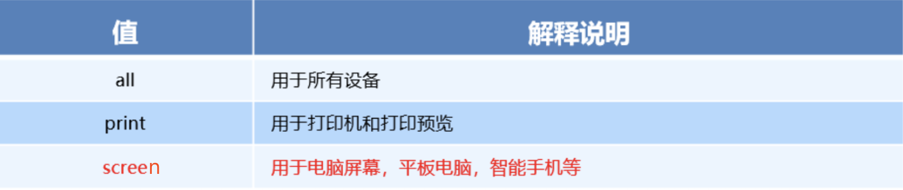
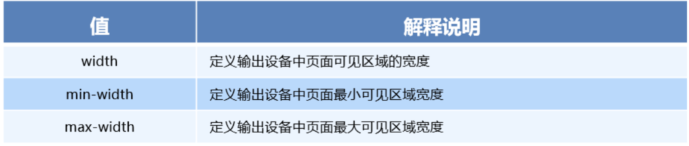
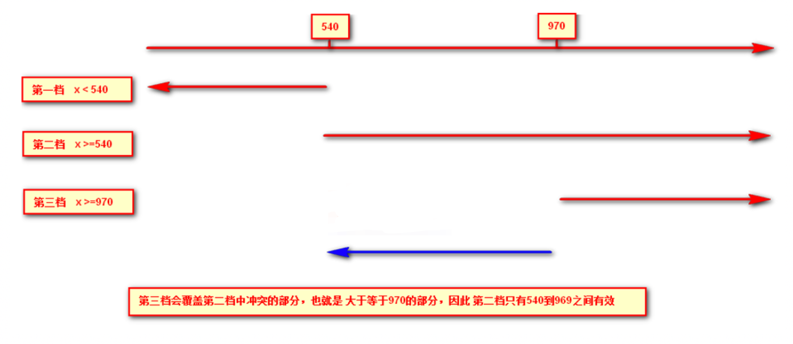
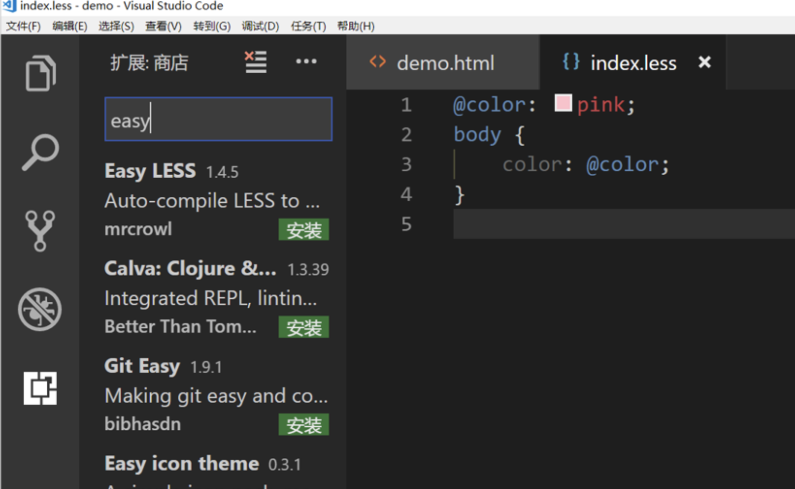
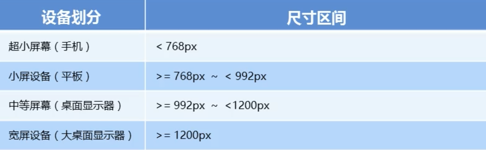
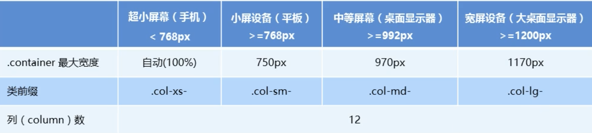
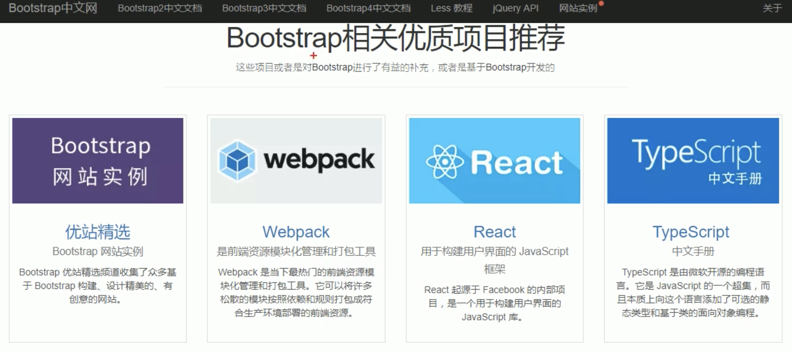
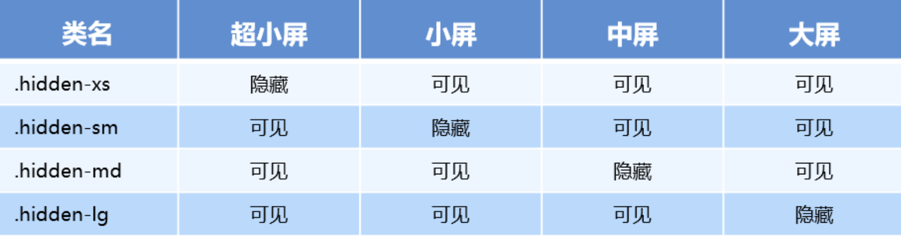

# rem布局

### 1、以前布局文字的大小能否随着页面的变化而变化？

苏宁https://m.suning.com/

携程https://m.ctrip.com/html5/

当屏幕发生缩小的时候，文字的变化

### 2、flex布局和流式布局主要针对于宽度布局，那高度如何设置？

之前的携程页面，nav的高度是60px，写死的，屏幕无论怎么变化，高度是固定的

### 3、怎么让屏幕发生变化的时候元素高度和宽度等比例缩放？

### 4、rem单位

rem (root em)是一个相对单位，类似于em，em是父元素字体大小。

#### em

```html
<!DOCTYPE html>
<html lang="en">
<head>
    <meta charset="UTF-8">
    <meta name="viewport" content="width=device-width, initial-scale=1.0">
    <title>Document</title>
    <style>
        div{
            font-size: 12px;
        }
        p{
            /* 12px * 10 = 120px */
            width: 10em;
            height: 10em;
            background-color: pink;
        }
    </style>
</head>
<body>
    <div>
        <p></p>
    </div>
</body>
</html>
```

不同的是rem的基准是相对于html元素的字体大小。

浏览器默认的字号`16px`，来看一些`px`单位与`rem`之间的转换关系：

```
|  px  |     rem       |
------------------------
|  12  | 12/16 = .75   |
|  14  | 14/16 = .875  |
|  16  | 16/16 = 1     |
|  18  | 18/16 = 1.125 |
|  20  | 20/16 = 1.25  |
|  24  | 24/16 = 1.5   |
|  30  | 30/16 = 1.875 |
|  36  | 36/16 = 2.25  |
|  42  | 42/16 = 2.625 |
|  48  | 48/16 = 3     |
-------------------------   
```

在`<html>`中设置`font-size`为`10px`，此时，上面示例中所示的值将会改变

```
|  px  |     rem        |
-------------------------
|  12  | 12/10 = 1.2    |
|  14  | 14/10 = 1.4    |
|  16  | 16/10 = 1.6    |
|  18  | 18/10 = 1.8    |
|  20  | 20/10 = 2.0    |
|  24  | 24/10 = 2.4    |
|  30  | 30/10 = 3.0    |
|  36  | 36/10 = 3.6    |
|  42  | 42/10 = 4.2    |
|  48  | 48/10 = 4.8    |
-------------------------        
```

比如，根元素（html）设置font-size=12px; 非根元素设置width:2rem; 则换成px表示就是24px。

```
/* 根html 为 12px */
html {
   font-size: 12px;
}
/* 此时 div 的字体大小就是 24px */       
div {
    font-size: 2rem;
}
```

```html
<!DOCTYPE html>
<html lang="en">
<head>
    <meta charset="UTF-8">
    <meta name="viewport" content="width=device-width, initial-scale=1.0">
    <title>Document</title>
    <style>
        html{
            font-size: 14px;
        }
        div{
            font-size: 12px;
        }
        p{
            /* 12px * 10 = 120px */
            /* width: 10em;
            height: 10em; */
            width: 10rem;
            height: 10rem;
            background-color: pink;
        }
    </style>
</head>
<body>
    <div>
        <p></p>
    </div>
</body>
</html>
```

rem的优势：父元素文字大小可能不一致， 但是整个页面只有一个html，可以很好来控制整个页面的元素大小。也就是所谓的自适应（响应式）

##### vscode插件

- cssrem

### 媒体查询

#### 什么是媒体查询

媒体查询（Media Query）是CSS3新语法。

- 使用 @media查询，可以针对不同的媒体类型定义不同的样式
- @media 可以针对不同的屏幕尺寸设置不同的样式
- 当你重置浏览器大小的过程中，页面也会根据浏览器的宽度和高度重新渲染页面 
- 目前针对很多苹果手机、Android手机，平板等设备都用得到多媒体查询

#### 媒体查询语法规范

- 用 @media开头 注意@符号
- mediatype  媒体类型
- 关键字 and  not  only
- media feature 媒体特性必须有小括号包含

```
@media mediatype and|not|only (media feature) {
    CSS-Code;
}
```

1. mediatype 查询类型

​       将不同的终端设备划分成不同的类型，称为媒体类型



2. 关键字

​       关键字将媒体类型或多个媒体特性连接到一起做为媒体查询的条件。

- and：可以将多个媒体特性连接到一起，相当于“且”的意思。
- not：排除某个媒体类型，相当于“非”的意思，可以省略。
- only：指定某个特定的媒体类型，可以省略。    

3. 媒体特性

每种媒体类型都具体各自不同的特性，根据不同媒体类型的媒体特性设置不同的展示风格。我们暂且了解三个。

注意他们要加小括号包含



媒体查询书写规则

注意： 为了防止混乱，媒体查询我们要按照从小到大或者从大到小的顺序来写,但是我们最喜欢的还是从小到大来写，这样代码更简洁



```html
<!DOCTYPE html>
<html lang="en">
<head>
    <meta charset="UTF-8">
    <meta name="viewport" content="width=device-width, initial-scale=1.0">
    <meta http-equiv="X-UA-Compatible" content="ie=edge">
    <title>Document</title>
    <style>
        /* max-width: 800px 最大宽度小于=800px 的时候 设置我们想要的样式*/
        /* <=539 */
        @media screen and (max-width: 539px){
            body{
                background-color: yellow;
            }
        }
        /* 540 - 970 */
        @media screen and (min-width: 540px) and (max-width: 970px){
            body{
                background-color: pink;
            }
        }
        /* 或者简写 */
        @media (min-width: 540px) and (max-width: 970px){
            body{
                background-color: pink;
            }
        }
        /* >970 */
        @media screen and (min-width: 970px){
            body{
                background-color: green;
            }
        }
    </style>
</head>
<body>
</body>
</html>
```

#### 总结：min-width相当于>=,max-width相当于<=

### less 基础

#### 维护css弊端

CSS 是一门非程序式语言，没有变量、函数、SCOPE（作用域）等概念。

- CSS 需要书写大量看似没有逻辑的代码，CSS 冗余度是比较高的。
- 不方便维护及扩展，不利于复用。
- CSS 没有很好的计算能力
- 非前端开发工程师来讲，往往会因为缺少 CSS 编写经验而很难写出组织良好且易于维护的 CSS 代码项目。 

#### Less 介绍 

Less（LeanerStyle Sheets 的缩写）是一门 CSS扩展语言，也成为CSS预处理器。

做为 CSS的一种形式的扩展，它并没有减少CSS的功能，而是在现有的CSS语法上，为CSS加入程序式语言的特性。

它在CSS 的语法基础之上，引入了变量，Mixin（混入），运算以及函数等功能，大大简化了 CSS 的编写，并且降低了 CSS的维护成本，就像它的名称所说的那样，Less可以让我们用更少的代码做更多的事情。

Less中文网址：[http://](http://lesscss.cn/)[less](http://lesscss.cn/)[css.cn/](http://lesscss.cn/)

常见的CSS预处理器：Sass、Less、Stylus

一句话：Less是一门 CSS 预处理语言，它扩展了CSS的动态特性。

### Less 编译 vocode Less 插件

Easy LESS 插件用来把less文件编译为css文件

安装完毕插件，重新加载下 vscode。

只要保存一下Less文件，会自动生成CSS文件。



- 创建index.html 和 index.less文件

  html

  ```html
  <!DOCTYPE html>
  <html lang="en">
  <head>
      <meta charset="UTF-8">
      <meta name="viewport" content="width=device-width, initial-scale=1.0">
      <meta http-equiv="X-UA-Compatible" content="ie=edge">
      <title>Document</title>
      //引入index.css  实际是 由less编译器 帮我们生成css文件
      <link rel="stylesheet" href="./index.css">
  </head>
  <body>
      <div>
          <p>123</p>
      </div>
  </body>
  </html>
  ```

  index.less

  ```less
  
  div{
      width: 100px;
      height: 100px;
      background-color: red;
      p {
          width: 50px;
          height: 50px;
          background-color:yellow;
      }
  }
  ```

  - 当我们保存的时候，会自动生成css文件，以后修改less即可

### Less 嵌套

```less
// 将css改为less
#header .logo {
  width: 300px;
}

#header {
    .logo {
       width: 300px;
    }
}

```

如果遇见 （交集|伪类|伪元素选择器） ，利用&进行连接

```less
a:hover{
    color:red;
}


div{
    width: 100px;
    height: 100px;

    p {
        width: 50px;
        height: 50px;
        background-color:yellow;
        &:hover{
            background-color: black;
        }
    }
}
```

### Less 使用之变量

变量是指没有固定的值，可以改变的。因为我们CSS中的一些颜色和数值等经常使用。

```
@变量名:值;
```

- 必须有@为前缀
- 不能包含特殊字符
- 不能以数字开头
- 大小写敏感

```
@color: pink;
```

```less
@bgcolor:pink;
div{
    width: 100px;
    height: 100px;
    background-color: @bgcolor;
    p {
        width: 50px;
        height: 50px;
        background-color:yellow;
    }
}
```


### Less 运算

任何数字、颜色或者变量都可以参与运算。就是Less提供了加（+）、减（-）、乘（*）、除（/）算术运算。

```
/*Less 里面写*/
@witdh: 10px + 5;
div {
    border: @witdh solid red;
}
/*生成的css*/
div {
  border: 15px solid red;
}
/*Less 甚至还可以这样 */
width: (@width + 5) * 2;

```

- 乘号（*）和除号（/）的写法  
- 运算符中间左右有个空格隔开 1px + 5
- 对于两个不同的单位的值之间的运算，运算结果的值取第一个值的单位 
- 如果两个值之间只有一个值有单位，则运算结果就取该单位

# 响应式开发原理 

### 1.1 响应式开发原理

就是使用媒体查询针对不同宽度的设备进行布局和样式的设置，从而适配不同设备的目的。

设备的划分情况：

- 小于768的为超小屏幕（手机）
- 768~992之间的为小屏设备（平板）
- 992~1200的中等屏幕（桌面显示器）
- 大于1200的宽屏设备（大桌面显示器）

### 1.2 响应式布局容器

响应式需要一个父级做为布局容器，来配合子级元素来实现变化效果。

原理就是在不同屏幕下，通过媒体查询来改变这个布局容器的大小，再改变里面子元素的排列方式和大小，从而实现不同屏幕下，看到不同的页面布局和样式变化。

父容器版心的尺寸划分

- 超小屏幕（手机，小于 768px）：设置宽度为 100%

- 小屏幕（平板，大于等于 768px）：设置宽度为 750px

- 中等屏幕（桌面显示器，大于等于 992px）：宽度设置为 970px

- 大屏幕（大桌面显示器，大于等于 1200px）：宽度设置为 1170px 

  

但是我们也可以根据实际情况自己定义划分

### 2.0 bootstrap的介绍

#### 2.1Bootstrap简介

Bootstrap 来自 Twitter（推特），是目前最受欢迎的前端框架。Bootstrap 是基于HTML、CSS 和 JAVASCRIPT 的，它简洁灵活，使得 Web 开发更加快捷。

[中文网](lhttp://www.bootcss.com/)  [官网](lhttp://getbootstrap.com/)  [推荐网站](http://bootstrap.css88.com/)

框架：顾名思义就是一套架构，它有一套比较完整的网页功能解决方案，而且控制权在框架本身，有预制样式库、组件和插件。使用者要按照框架所规定的某种规范进行开发。

#### 2.2 bootstrap优点

- 标准化的html+css编码规范
- 提供了一套简洁、直观、强悍的组件
- 有自己的生态圈，不断的更新迭代
- 让开发更简单，提高了开发的效率

#### 2.3 版本简介

2.x.x：停止维护,兼容性好,代码不够简洁，功能不够完善。

3.x.x：目前使用最多,稳定,但是放弃了IE6-IE7。对 IE8 支持但是界面效果不好,偏向用于开发响应式布局、移动设备优先的WEB 项目。

4.x.x：最新版，目前还不是很流行

#### 2.4bootstrap基本使用

在现阶段我们还没有接触JS相关课程，所以我们只考虑使用它的样式库。

Bootstrap 使用四步曲： 

1. 创建 html 骨架结构 

   ```html
   <!DOCTYPE html>
   <html lang="en">
   <head>
       <meta charset="UTF-8">
       <meta name="viewport" content="width=device-width, initial-scale=1.0">
       <meta http-equiv="X-UA-Compatible" content="ie=edge">
       <title>Document</title>
       <link rel="stylesheet" href="../资料/bootstrap/css/bootstrap.min.css">
       <style>
           .container{
               background-color: pink;
           }
       </style>
   </head>
   <body>
       
       <div class="container">
           asdf
       </div>
       
   </body>
   </html>
   ```

   ​

2. 引入相关样式文件  

   ```html
   <!-- Bootstrap 核心样式-->
   <link rel="stylesheet" href="../资料/bootstrap/css/bootstrap.min.css">
   ```

   ​

3. 书写内容 

   直接拿Bootstrap 预先定义好的样式来使用

   修改Bootstrap 原来的样式，注意权重问题

   学好Bootstrap 的关键在于知道它定义了哪些样式，以及这些样式能实现什么样的效果

#### 2.5 bootstrap布局容器

Bootstrap 需要为页面内容和栅格系统包裹一个 .container 或者.container-fluid 容器，它提供了两个作此用处的类。

.container

- 响应式布局的容器  固定宽度
- 大屏 ( >=1200px)  宽度定为 1170px
- 中屏 ( >=992px)   宽度定为  970px
- 小屏 ( >=768px)   宽度定为  750px
- 超小屏  (100%) 

.container-fluid

- 流式布局容器 百分百宽度
- 占据全部视口（viewport）的容器。

#### 导航栏

- 安装bootstrap插件，快捷键navbar

```html
<!DOCTYPE html>
<html lang="en">
<head>
    <meta charset="UTF-8">
    <meta name="viewport" content="width=device-width, initial-scale=1.0">
    <meta http-equiv="X-UA-Compatible" content="ie=edge">
    <title>Document</title>
    <link rel="stylesheet" href="./bootstrap/css/bootstrap.min.css">
    <style>
      
    </style>
</head>
<body>
    
        
        
   


<div class="container">
    
    <nav class="navbar navbar-default" role="navigation">
        <!-- Brand and toggle get grouped for better mobile display -->
        <div class="navbar-header">
            <button type="button" class="navbar-toggle" data-toggle="collapse" data-target=".navbar-ex1-collapse">
                <span class="sr-only">Toggle navigation</span>
                <span class="icon-bar"></span>
                <span class="icon-bar"></span>
                <span class="icon-bar"></span>
            </button>
            <a class="navbar-brand" href="#">Title</a>
        </div>
    
        <!-- Collect the nav links, forms, and other content for toggling -->
        <div class="collapse navbar-collapse navbar-ex1-collapse">
            <ul class="nav navbar-nav">
                <li class="active"><a href="#">Link</a></li>
                <li><a href="#">Link</a></li>
            </ul>
            <form class="navbar-form navbar-left" role="search">
                <div class="form-group">
                    <input type="text" class="form-control" placeholder="Search">
                </div>
                <button type="submit" class="btn btn-default">Submit</button>
            </form>
            <ul class="nav navbar-nav navbar-right">
                <li><a href="#">Link</a></li>
                <li class="dropdown">
                    <a href="#" class="dropdown-toggle" data-toggle="dropdown">Dropdown <b class="caret"></b></a>
                    <ul class="dropdown-menu">
                        <li><a href="#">Action</a></li>
                        <li><a href="#">Another action</a></li>
                        <li><a href="#">Something else here</a></li>
                        <li><a href="#">Separated link</a></li>
                    </ul>
                </li>
            </ul>
        </div><!-- /.navbar-collapse -->
    </nav>
    
</div>

        
        
    
</body>
</html>
```

- 字体图标

```html
<span class="glyphicon glyphicon-search" ></span>
```

- 按钮

```html
    <button type="button" class="btn btn-default">button</button>
    <button type="button" class="btn btn-danger">button</button>

修改样式
<style>
      .btn-danger{
          width: 200px;
          height: 200px;
          line-height: 200px;
      }
    </style>
```


#### 2.6 bootstrap栅格系统



Bootstrap提供了一套响应式、移动设备优先的流式栅格系统，随着屏幕或视口（viewport）尺寸的增加，系统会自动分为最多12列。

栅格系统用于通过一系列的行（row）与列（column）的组合来创建页面布局，你的内容就可以放入这些创建好的布局中。

- 按照不同屏幕划分为1~12 等份
- 行（row） 可以去除父容器作用15px的边距
- xs-extra small：超小； sm-small：小；  md-medium：中等； lg-large：大；
- 列（column）大于 12，多余的“列（column）”所在的元素将被作为一个整体另起一行排列
- 每一列默认有左右15像素的 padding
- 可以同时为一列指定多个设备的类名，以便划分不同份数  例如 class="col-md-4 col-sm-6"

栅格嵌套

栅格系统内置的栅格系统将内容再次嵌套。简单理解就是一个列内再分成若干份小列。我们可以通过添加一个新的 .row 元素和一系列 .col-sm-* 元素到已经存在的 .col-sm-*
元素内。

案例：



一共12等份，现在有4个盒子，每个盒子3份

```html


<!DOCTYPE html>
<html lang="en">

<head>
    <meta charset="UTF-8">
    <meta name="viewport" content="width=device-width, initial-scale=1.0">
    <meta http-equiv="X-UA-Compatible" content="ie=edge">
    <title>Document</title>
    <link rel="stylesheet" href="./bootstrap/css/bootstrap.min.css">
    <style>
        .row {
            margin-bottom: 10px;
        }

        [class*="col"] {
            border: 1px black solid;
        }

        .row:nth-child(1){
            background-color: pink;
        }
        .row:nth-child(2){
            background-color: yellow;
        }
        .row:nth-child(3){
            background-color: red;
        }
        .row:nth-child(4){
            background-color: greenyellow;
        }
    </style>
</head>

<body>

  <!-- div{$}*4-->
    <div class="container">

        <div class="row">
            <div class="box col-lg-3 col-sm-6 col-xs-12">13</div>
            <div class="box col-lg-3 col-sm-6 col-xs-12">23</div>
            <div class="box col-lg-3 col-sm-6 col-xs-12">33</div>
            <div class="box col-lg-3 col-sm-6 col-xs-12">43</div>
        </div>
        <div class="row">
            <div class="box col-lg-6 col-sm-6 col-xs-12">13</div>
            <div class="box col-lg-2 col-sm-6 col-xs-12">23</div>
            <div class="box col-lg-2 col-sm-6 col-xs-12">33</div>
            <div class="box col-lg-2 col-sm-6 col-xs-12">43</div>
        </div>
        <!-- 小于12份，占不满container，有个空白 -->
        <div class="row">
            <div class="box col-lg-6 col-sm-6 col-xs-12">13</div>
            <div class="box col-lg-2 col-sm-6 col-xs-12">23</div>
            <div class="box col-lg-2 col-sm-6 col-xs-12">33</div>
            <div class="box col-lg-1 col-sm-6 col-xs-12">43</div>
        </div>
         <!-- 大于12份，换行 -->
         <div class="row">
                <div class="box col-lg-6 col-sm-6 col-xs-12">13</div>
                <div class="box col-lg-2 col-sm-6 col-xs-12">23</div>
                <div class="box col-lg-2 col-sm-6 col-xs-12">33</div>
                <div class="box col-lg-3 col-sm-6 col-xs-12">43</div>
            </div>
    </div>


</body>

</html>
```


响应式工具

为了加快对移动设备友好的页面开发工作，利用媒体查询功能，并使用这些工具类可以方便的针对不同设备展示或隐藏页面内容。



- 显示  visible-md  visible-xs visible-sm visible-lg 

```html
<!DOCTYPE html>
<html lang="en">

<head>
    <meta charset="UTF-8">
    <meta name="viewport" content="width=device-width, initial-scale=1.0">
    <meta http-equiv="X-UA-Compatible" content="ie=edge">
    <title>Document</title>
    <link rel="stylesheet" href="./bootstrap/css/bootstrap.min.css">
    <style>
        .row {
            margin-bottom: 10px;
        }

        [class*="col"] {
            border: 1px black solid;
        }

        .row:nth-child(1) {
            background-color: pink;
        }

        .row:nth-child(2) {
            background-color: yellow;
        }

        .row:nth-child(3) {
            background-color: red;
        }

        .row:nth-child(4) {
            background-color: greenyellow;
        }

        .between {
            display: flex;
            background-color: lightslategray;
            width: 100%;
            height: 200px;
            justify-content: space-between;
        }

        .between div {
            width: 100px;
            height: 100px;
            background-color: pink;
        }
    </style>
</head>

<body>


    <div class="container">

        <div class="row">
            <div class="box col-lg-3 col-sm-6 col-xs-12">13</div>
            <div class="box col-lg-3 col-sm-6 col-xs-12">23</div>
            <div class="box col-lg-3 col-sm-6 col-xs-12">33</div>
            <div class="box col-lg-3 col-sm-6 col-xs-12">43</div>
        </div>
        <div class="row">
            <div class="box col-lg-6 col-sm-6 col-xs-12">13</div>
            <div class="box col-lg-2 col-sm-6 col-xs-12">23</div>
            <div class="box col-lg-2 col-sm-6 col-xs-12">33</div>
            <div class="box col-lg-2 col-sm-6 col-xs-12">43</div>
        </div>
        <!-- 小于12份，占不满container，有个空白 -->
        <div class="row">
            <div class="box col-lg-6 col-sm-6 col-xs-12">13</div>
            <div class="box col-lg-2 col-sm-6 col-xs-12">23</div>
            <div class="box col-lg-2 col-sm-6 col-xs-12">33</div>
            <div class="box col-lg-1 col-sm-6 col-xs-12">43</div>
        </div>
        <!-- 大于12份，换行 -->
        <div class="row">
            <div class="box col-lg-6 col-sm-6 col-xs-12">13</div>
            <div class="box col-lg-2 col-sm-6 col-xs-12">23</div>
            <div class="box col-lg-2 col-sm-6 col-xs-12">33</div>
            <div class="box col-lg-3 col-sm-6 col-xs-12">43</div>
        </div>


        <!-- 隐藏 -->
        <div class="row">
            <div class="box col-xs-3">111111111</div>
            <div class="box col-xs-3">111111111</div>
            <div class="box col-xs-3 hidden-md hidden-xs hidden-sm">没逼脸见人</div>
            <div class="box col-xs-3">111111111</div>
        </div>


        <div class="between">
                <div class="left">1</div>
                <div class="right">2</div>
            </div>
    </div>


</body>

</html>
```

### 2.1、bootstrap 表单

```none
1、form 声明一个表单域
2、form-inline 内联表单域
3、form-horizontal 水平排列表单域
4、form-group 表单组、包括表单文字和表单控件
5、form-control 文本输入框、下拉列表控件样式
6、checkbox checkbox-inline 多选框样式
7、radio radio-inline 单选框样式
8、input-group 表单控件组
9、input-group-addon 表单控件组物件样式 10、input-group-btn 表单控件组物件为按钮的样式
10、form-group-lg 大尺寸表单
11、form-group-sm 小尺寸表单
```

### 2.2、bootstrap 按钮

```none
1、btn 声明按钮
2、btn-default 默认按钮样式
3、btn-primay
4、btn-success
5、btn-info
6、btn-warning
7、btn-danger
8、btn-link
9、btn-lg
10、btn-md
11、btn-xs
12、btn-block 宽度是父级宽100%的按钮
13、active
14、disabled
15、btn-group 定义按钮组
```

### 2.3、bootstrap 图片

img-responsive 声明响应式图片

bootstrap 隐藏类

```none
1、hidden-xs
2、hidden-sm
3、hidden-md
4、hidden-lg
```

bootstrap 字体图标

通过字体代替图标，font文件夹需要和css文件夹在同一目录

bootstrap 下拉菜单

```none
1、dropdown-toggle
2、dropdown-menu
```

bootstrap 选项卡

```none
1、nav
2、nav-tabs
3、nav-pills
4、tab-content
```

bootstrap 导航条

```none
1、navbar 声明导航条
2、navbar-default 声明默认的导航条样式
3、navbar-inverse 声明反白的导航条样式
4、navbar-static-top 去掉导航条的圆角
5、navbar-fixed-top 固定到顶部的导航条
6、navbar-fixed-bottom 固定到底部的导航条
7、navbar-header 申明logo的容器
8、navbar-brand 针对logo等固定内容的样式
11、nav navbar-nav 定义导航条中的菜单
12、navbar-form 定义导航条中的表单
13、navbar-btn 定义导航条中的按钮
14、navbar-text 定义导航条中的文本
9、navbar-left 菜单靠左
10、navbar-right 菜单靠右
```

bootstrap 模态框

```none
1、modal 声明一个模态框
2、modal-dialog 定义模态框尺寸
3、modal-lg 定义大尺寸模态框
4、modal-sm 定义小尺寸模态框
5、modal-header
6、modal-body
7、modal-footer
```

### 

# 作业

更改之前携程代码

- 使用less语法
- 使用rem

bootstrap练习

- 导航栏
- 响应式图片
- 栅格系统
- 轮播图

