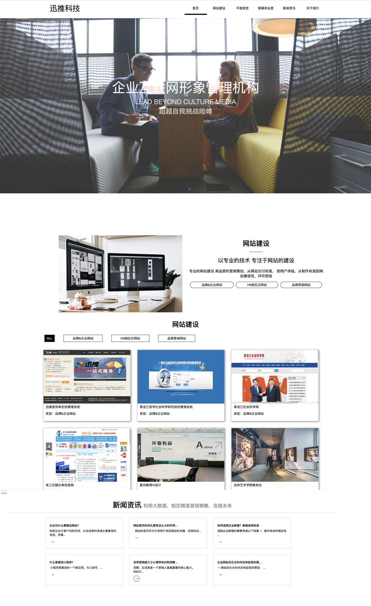

# 响应式网站

## 网站

```html
<!DOCTYPE html>
<html lang="en">

<head>
    <meta charset="UTF-8">
    <meta name="viewport" content="width=device-width, initial-scale=1.0">
    <meta http-equiv="X-UA-Compatible" content="ie=edge">
    <title>Aishang</title>
    <link rel="stylesheet" href="../资料//bootstrap/css/bootstrap.min.css">
    <link rel="stylesheet" href="./index.css">
    <script src="../资料/bootstrap/js/jquery-1.11.1.min.js"></script>
    <script src="../资料/bootstrap/js/bootstrap.min.js"></script>
   
</head>

<body>

    <header>
        <div class="container">

            <nav class="navbar navbar-default" role="navigation">
                <div class="navbar-header">
                    <button type="button" class="navbar-toggle" data-toggle="collapse"
                        data-target=".navbar-ex1-collapse">
                        <span class="sr-only">Toggle navigation</span>
                        <span class="icon-bar"></span>
                        <span class="icon-bar"></span>
                        <span class="icon-bar"></span>
                    </button>
                    <a class="navbar-brand" href="#">AISHANG <span class="by hidden-md hidden-sm hidden-xs">practical
                            training</span></a>
                </div>

                <div class="collapse navbar-collapse navbar-ex1-collapse">
                    <ul class="nav navbar-nav navbar-right">
                        <li><a href="#">PRODUCTS</a></li>
                        <li><a href="#">INSIGHTS</a></li>
                        <li><a href="#">COMPANY</a></li>
                        <li><a href="#">FAQ</a></li>
                    </ul>
                </div><!-- /.navbar-collapse -->
            </nav>

        </div>
    </header>

    <!-- banner -->
    <div class="banner">
        
        <div class="imgTitle" style="display: block;">
            <h2><strong>BYTON M-BYTE. YOUR PLATFORM FOR LIFE.</strong><strong> </strong></h2>

            <h5>&nbsp;</h5>

            <h5>The first premium electric SUV with an encapsulating<br>
                interior experience as rich as the world it travels.</h5>

            <p>&nbsp;</p>

        </div>
    </div>

    <!-- info -->
    <div class="info container">
        <div class="row">
            <div class="c1 col-md-6 col-sm-6 col-xs-12"></div>
            <div class="c2 col-md-6 col-sm-6 col-xs-12"></div>
        </div>
        <div class="row">
            <div class="c3 col-md-6 col-sm-6 col-xs-12"></div>
            <div class="c4 col-md-6 col-sm-6 col-xs-12"></div>
        </div>
        <div class="row">
            <div class="c5 col-md-12 col-sm-12 col-xs-12"></div>
        </div>
    </div>
    <!-- footer -->
    <footer>

    </footer>
</body>

</html> 	
```

less

```less

body{

    /* 禁止横向出现滚动条 */
    overflow-x: hidden;
  }
  
  /* 全屏1280px */
  @media screen and (min-width:1280px){
    .container{
       width: 1280px;
    }
  }
  /* 当屏幕小于768 */
  @media screen and (max-width:768px){
    .navbar-nav{
        li {
            width: 100% !important;
            text-align: center;
            background-color: white;
            margin-right: 5px;
            a{
                color:black !important;
                transition: all .1s;
                &:hover{
                    border-bottom: 5px solid black !important;
                }
            }
        }
        
    }
    .navbar-toggle{
        .icon-bar{
            background-color: white !important;
        }
        &:hover{
            background-color: white !important;
            .icon-bar{
                background-color: black !important;
            }
        }
    }
  }
  
  
  header{
    width: 100%;
    height: 80px;
    position: fixed;
    background: rgba(0, 0, 0, .1);
    z-index: 99;
    .container{
        .navbar{
            margin-top: 10px;
            background: transparent;
            border: 0;
  
            a{
                position: relative;
                .by{
                    width: 200px;
                    font-family: Impact, Haettenschweiler, 'Arial Narrow Bold', sans-serif;
                    font-size: 20px;
                    position: absolute;
                    left: 103%;
                    top:20px;
                }
            }
            
            .navbar-brand{
                font-family: Impact, Haettenschweiler, 'Arial Narrow Bold', sans-serif;
                color:white;
                font-size: 34px;
            }
            .navbar-nav{
                li {
                    width: 130px;
                    text-align: center;
                    margin-right: 5px;
                    a{
                        color:white;
                        transition: all .1s;
                        &:hover{
                            border-bottom: 5px solid white;
                        }
                    }
                }
                
            }
            .icon-bar{
                background-color: white;
            }
          
        }
    }
    
  }
  
  @media screen and (max-width:992px){
    .imgTitle{
        position: absolute;
        top:50% !important;
        left: 50%;
        transform: translate(-50%,-50%);
        color: white;
        text-align: center;
        h5{
            font-size:18px;
        }
   }
  }
  @media screen and (max-width:768px){
    .imgTitle{
        position: absolute;
        top:60% !important;
        left: 50%;
        transform: translate(-50%,-50%);
        color: white;
        text-align: center;
        h2{
            font-size: 18px;
        }
        h5{
            font-size:12px !important;
        }
   }
  }
  
  .banner{
   width: 100%;
   height: auto;
   position: relative;
   .imgTitle{
        position: absolute;
        top:30%;
        left: 50%;
        transform: translate(-50%,-50%);
        color: white;
        text-align: center;
        h5{
            font-size:18px;
        }
   }
  }
  
  // info
  @media screen and (min-width:1280px){
    .info{
       width: 100%;
    }
  }
  @media screen and (min-width:768px){
    .info{
       width: 100%;
    }
  }
  .info {
    .row {
       div{
        background-color: white;
            img {
                width: 100%;
            }
           padding: 8px 5px;
       }
       .c5{
           margin-bottom: 260px;
       }
    }
  }
  
  // footer
  footer{
    width: 100%;
    height: 260px;
    background-color: #383736;
    position: fixed;
    bottom: 0;
    z-index: -1;
  }
```

```js
    <script>
     $(window).scroll(function () {
        console.log("滚动的像素 ----" + $(window).scrollTop())
        // 当浏览器滚动到100的时候 让图片显示出来，并过渡效果
        if ($(window).scrollTop() >= 300) {
            $("header").css({
                backgroundColor: "white"
            })
            $("header .navbar-nav a").css("color", "black")
            $("header .navbar-brand").css("color", "black")
            $("header .navbar-nav li a").hover(function () {
                $(this).css("borderBottom", "5px black solid ")
            }, function () {
                $(this).css("borderBottom", "5px white solid ")
            })
        } else {
            $("header").css({
                backgroundColor: "rgba(0, 0, 0, .1)"
            })
            $("header .navbar-nav a").css("color", "white")
            $("header .navbar-brand").css("color", "white")
            $("header .navbar-nav li a").hover(function () {
                $(this).css("borderBottom", "5px white solid ")
            }, function () {
                $(this).css("borderBottom", "5px black solid ")
            })
        }
    })
    </script>
```


# 作业+项目2天

http://www.xuntui.org/

迅推科技主页-响应式开发

开发思路

- 先不考虑响应式，直接做pc端
- 之后再分辨率分档，从大到小依次开发响应式




## 页面滚动显示图片

```html
<!DOCTYPE html>
<html lang="en">

<head>
    <meta charset="UTF-8">
    <title>页面滚动，图片显示案例</title>
    <script src="http://code.jquery.com/jquery-1.9.1.min.js"></script>
    <style>
        body{
            height: 5000px;
        }
        div {
            text-align: center;
            margin-top: 200px;
        }
        img{
            opacity: 0;
            margin-top: 350px;
            transition: all 1s;
        }
    </style>
    <script>
        $(window).scroll(function () {
            console.log( "图片距离浏览器顶部的高度 100 ----"+$("img").offset().top)
            console.log( "滚动的像素 ----"+$(window).scrollTop())
            // 当浏览器滚动到100的时候 让图片显示出来，并过渡效果
            if($(window).scrollTop()>=100){
                $("img").css("opacity","1")
                $("img").css("margin-top","100px")
            }
        })
    </script>
</head>

<body>

    <div>
        
    </div>

</body>

</html>
```

