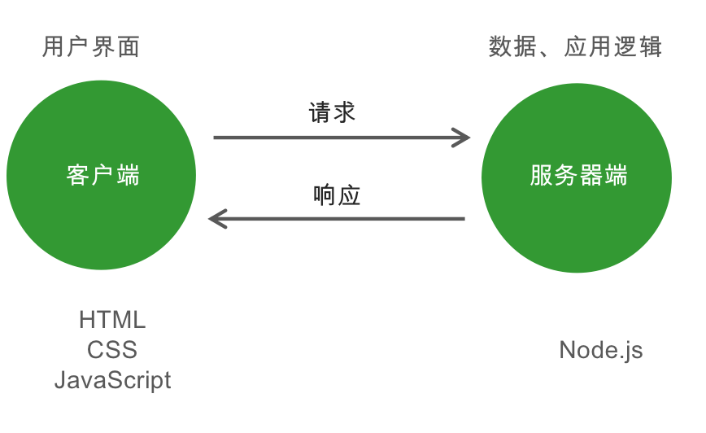
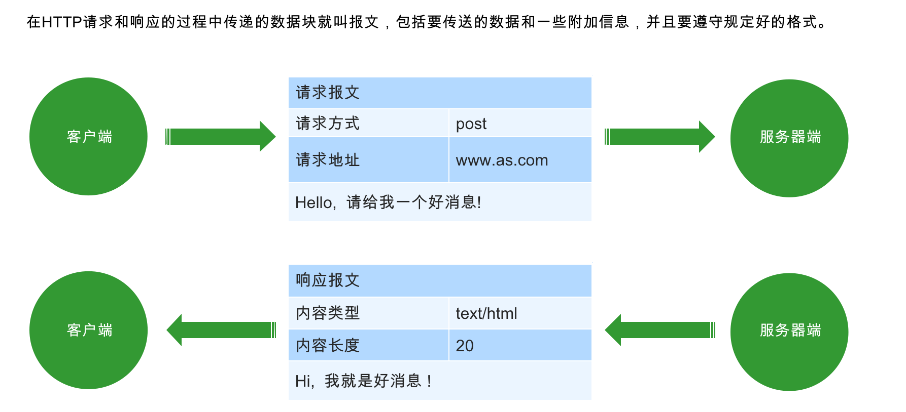
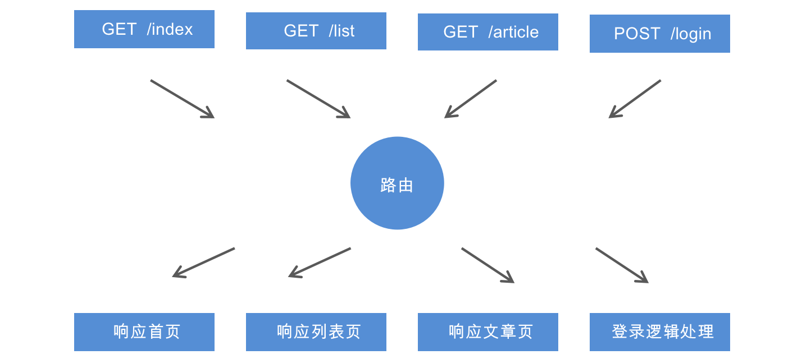
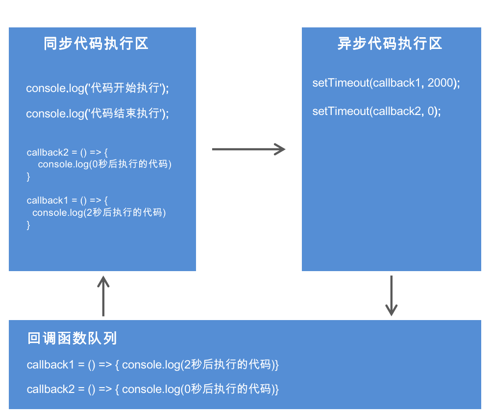
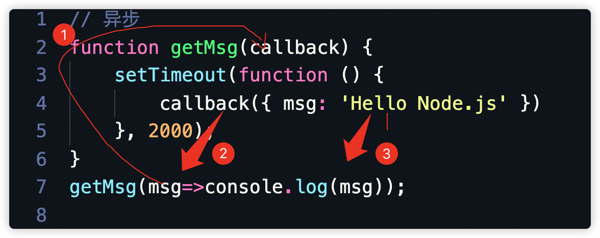
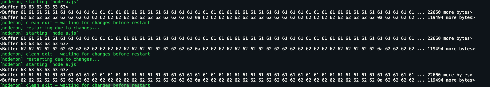
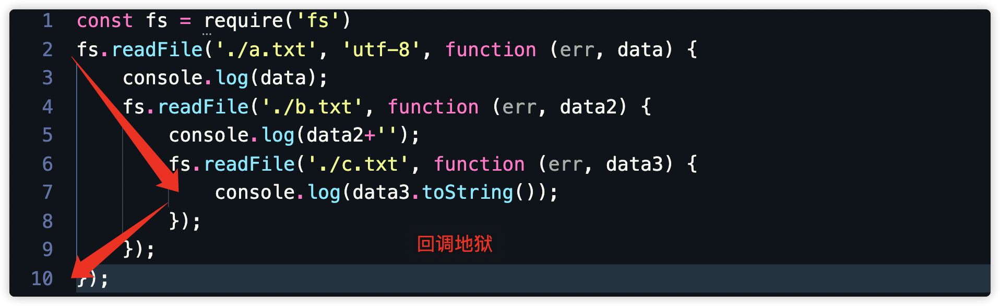
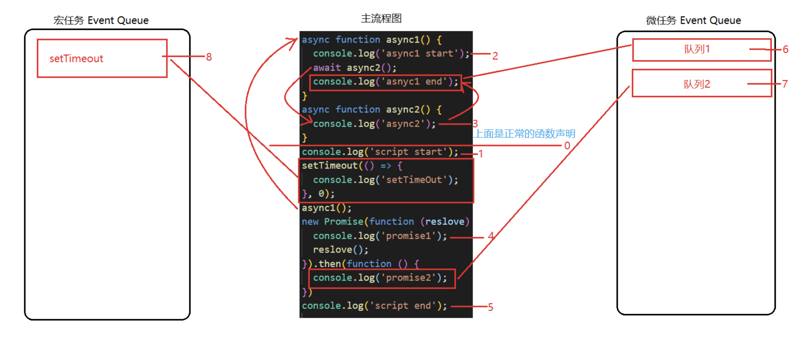

## 1、网站的组成



#### URL

统一资源定位符，又叫URL（Uniform Resource Locator），是专为标识Internet网上资源位置而设的一种编址方式，我们平时所说的网页地址指的即是URL。

传输协议://服务器IP或域名:端口/资源所在位置标识

http：超文本传输协议，提供了一种发布和接收HTML页面的方法。

## 2、创建web服务器

```js
// 引用系统模块
const http = require('http');
// 创建web服务器
const app = http.createServer();
// 当客户端发送请求的时候
app.on('request', (req, res) => {
    //  响应
    res.end('<h1>hi, user</h1>');
});
// 监听3000端口
app.listen(3000,()=>{
    console.log('服务器已启动，监听3000端口，请访问 localhost:3000')
});
```



### 1、请求报文

#### 请求方式 （Request Method）

- GET     请求数据
- POST   发送数据

#### 请求地址 （Request URL）

```js
// 引用系统模块
const http = require('http');
// 创建web服务器
const app = http.createServer();
// 当客户端发送请求的时候
app.on('request', (req, res) => {
    //  响应
    console.log(req.headers);// 获取请求报文
    console.log(req.url);// 获取请求地址
    console.log( req.method);// 获取请求方法

    res.end('<h1>hi, user</h1>');
});
// 监听3000端口
app.listen(3000, () => {
    console.log('服务器已启动，监听3000端口，请访问 localhost:3000')
});
```

### 2、响应报文

#### HTTP状态码

- 200 请求成功
- 404 请求的资源没有被找到
- 500 服务器端错误
- 400 客户端请求有语法错误

#### 内容类型

- text/html
- text/css
- application/javascript
- image/jpeg
- application/json

```js
 app.on('request', (req, res) => {
     // 设置响应报文
     res.writeHead(200, {'Content-Type': 'text/html;charset=utf8'
     });
 });

```

### 3、GET请求参数

- 参数被放置在浏览器地址栏中，例如：http://localhost:3000/?name=zhangsan&age=20
- 参数获取需要借助系统模块url，url模块用来处理url地址

```js
// 引用系统模块
const http = require('http');
// 创建web服务器
const app = http.createServer();
// 导入url系统模块 用于处理url地址
const url = require('url');
// 当客户端发送请求的时候
app.on('request', (req, res) => {
    // 将url路径的各个部分解析出来并返回对象
    // true 代表将参数解析为对象格式
    /*
    Url {
        protocol: null,
        slashes: null,
        auth: null,
        host: null,
        port: null,
        hostname: null,
        hash: null,
        search: null,
        query: [Object: null prototype] {},
        pathname: '/favicon.ico',
        path: '/favicon.ico',
        href: '/favicon.ico'
    }
    
    
    默认为false，//foo/bar 形式的字符串将被解释成 { pathname: ‘//foo/bar' }

    如果设置成true，//foo/bar 形式的字符串将被解释成 { host: ‘foo', pathname: ‘/bar' }
 */
    let {query} = url.parse(req.url, true);
    res.end('<h1>hi, '+query.name+'</h1>');
});
// 监听3000端口
app.listen(3000, () => {
    console.log('服务器已启动，监听3000端口，请访问 localhost:3000')
});
```

### 4、POST请求参数

- 参数被放置在请求体中进行传输
- 获取POST参数需要使用data事件和end事件
- 使用querystring系统模块将参数转换为对象格式

html

```html
<!DOCTYPE html>
<html lang="en">
<head>
    <meta charset="UTF-8">
    <meta name="viewport" content="width=device-width, initial-scale=1.0">
    <title>Document</title>
</head>
<body>
    <form action="http://localhost:3000/" method="post">
        <input type="text" name="username" id="" value="tom">
        <input type="submit" value="post提交">
    </form>
</body>
</html>
```

js

```js
// 引用系统模块
const http = require('http');
// 创建web服务器
const app = http.createServer();
const querystring = require('querystring');
// 当客户端发送请求的时候
app.on('request', (req, res) => {
    let postData = '';
    // 监听参数传输事件
    req.on('data', (data) => {
        postData  += data
        console.log(data);//<Buffer 75 73 65 72 6e 61 6d 65 3d 74 6f 6d>
        // 服务端接收到是流数据，必须把流数据通过拼引号转化成字符串  data+''
        console.log(postData);
    });
    // 监听参数传输完毕事件
    req.on('end', () => {
        console.log(querystring.parse(postData));
        var obj = querystring.parse(postData)
        res.end('<h1>hi,'+obj.username+' </h1>');
    });
});
// 监听3000端口
app.listen(3000, () => {
    console.log('服务器已启动，监听3000端口，请访问 localhost:3000')
});
```


### 5、路由

http://localhost:3000/index
http://localhost:3000/login
路由是指客户端请求地址与服务器端程序代码的对应关系。简单的说，就是请求什么响应什么。



```js
// 引用系统模块
const http = require('http');
// 创建web服务器
const app = http.createServer();
const url = require('url');
// 当客户端发送请求的时候
app.on('request', (req, res) => {
    // 解决中文乱码
    res.write('<head><meta charset="utf-8"/></head>');
    // 获取客户端的请求路径
    let { pathname } = url.parse(req.url);
    if (pathname == '/' || pathname == '/index') {
        res.end('首页');
    } else if (pathname == '/list') {
        res.end('list');
    } else {
        res.end('error');
    }
});
// 监听3000端口
app.listen(3000, () => {
    console.log('服务器已启动，监听3000端口，请访问 localhost:3000')
});
```

使用response输出中文但页面中文乱码的处置

```js
1.head里有<meta charset="utf-8"/>
2.js文件编码为utf-8格式
```

## 3、同步API, 异步API

### 1、同步API

- 同步API从上到下依次执行，前面代码会阻塞后面代码的执行

```js
console.log('before');
for (let index = 0; index < 1000; index++) {
    console.log(index);
}
console.log('after');
```

### 2、异步API

- 当前API的执行不会阻塞后续代码的执行,也就是不会等待API执行完成后再向下执行代码

```js
console.log('before');
setTimeout(
   () => { console.log('last');
}, 2000);
console.log('after');

```

或者

```js
const fs = require('fs')
console.log('before');
// 读取文件
fs.readFile('./1.html', 'utf8', (err, result) => {
    console.log(result);
});
console.log('after');
```


### 3、同步API, 异步API的区别（ 获取返回值 ）

同步API可以从返回值中拿到API执行的结果, 但是异步API是不可以的，后续代码在执行的时候异步API还没有返回结果

```js
// 同步
function sum(n1, n2) {
    return n1 + n2;
}
console.log(sum(10, 20));


// 异步
function getMsg() {
    setTimeout(function () {
        return { msg: 'Hello Node.js' }
    }, 2000);
}
console.log(getMsg());
```

#### 代码执行顺序分析

```js
console.log('代码开始执行');
setTimeout(() => {
    console.log('2秒后执行的代码');
}, 2000); 
setTimeout(() => {
    console.log('"0秒"后执行的代码');
}, 0);
console.log('代码结束执行');

```



#### 

### 4、回调函数

自己定义函数让别人去调用

```js
  // getData函数定义
 function getData (callback) {}
  // getData函数调用
 getData (() => {});

```

#### 使用回调函数获取异步API执行结果

```js
// 异步
function getMsg(callback) {
    setTimeout(function () {
        callback({ msg: 'Hello Node.js' })
    }, 2000);
}
getMsg(msg=>console.log(msg));


```



### 5、Node.js中的异步API

如果异步API后面代码的执行依赖当前异步API的执行结果，但实际上后续代码在执行的时候异步API还没有返回结果，这个问题要怎么解决呢？

```js
const fs = require('fs')
let str = ''
fs.readFile('./1.html', (err, result) => {
    str = result
});
console.log(str);
```

在例如：依次读取并输出A文件、B文件、C文件

```js
const fs = require('fs')
fs.readFile('./a.txt', (err, result) => {
    console.log(result);
});
fs.readFile('./b.txt', (err, result) => {
    console.log(result);
});
fs.readFile('./c.txt', (err, result) => {
    console.log(result);
});
```

由于是异步api，每次结果不一样,不是按顺序读取的

### 6、回调地狱



```js
const fs = require('fs')
fs.readFile('./a.txt', 'utf-8', function (err, data) {
    console.log(data);
    fs.readFile('./b.txt', function (err, data2) {
        console.log(data2+'');
        fs.readFile('./c.txt', function (err, data3) {
            console.log(data3.toString());
        });
    });
});
```



## 4、promise

1、主要用于异步计算
2、可以将异步操作队列化，按照期望的顺序执行，返回符合预期的结果
3、可以在对象之间传递和操作promise，帮助我们处理队列

```js
/*
 1. Promise基本使用
       我们使用new来构建一个Promise  
       Promise的构造函数接收一个参数，是函数，
       并且传入两个参数：
       resolve，reject， 
       分别表示异步操作执行
       成功后的回调函数
       和
       异步操作执行失败后的回调函数
*/
var p = new Promise(function (resolve, reject) {
    //2. 这里用于实现异步任务  setTimeout
    setTimeout(function () {
        var flag = true;
        if (flag) {
            //3. 正常情况
            resolve('hello');
        } else {
            //4. 异常情况
            reject('出错了');
        }
    }, 100);
});
//  5 Promise实例生成以后，可以用then方法指定resolve的状态和reject状态的回调函数 
// 6 第一个回调函数是resolve成功的结果，第二个是reject失败的结果  
p.then(function (data) {
    console.log(data)
}, function (info) {
    console.log(info)
});
```

在then方法中，你也可以直接return数据,**返回的是Promise对象**,解决了异步的问题

```js
var p = new Promise(function (resolve, reject) {
    //2. 这里用于实现异步任务  setTimeout
    setTimeout(function () {
        var flag = true;
        if (flag) {
            //3. 正常情况
            resolve('hello');
        } else {
            //4. 异常情况
            reject('出错了');
        }
    }, 100);
});
//  5 Promise实例生成以后，可以用then方法指定resolve的状态和reject状态的回调函数 
// 6 第一个回调函数是resolve成功的结果，第二个是reject失败的结果
p.then(function (data) {
    return data
}, function (info) {
    console.log(info)
});
console.log(p);
```

继续调用then方法中的resolve就可以接收到数据了

```js
var p = new Promise(function (resolve, reject) {
    setTimeout(function () {
        var flag = true;
        if (flag) {
            resolve('hello');
        } else {
            reject('出错了');
        }
    }, 100);
});
p.then(function (data) {
    return data
}, function (info) {
    console.log(info)
});
console.log(p);
p.then((data)=>{
    console.log(data);
})

```

#### 读取文件

```js
const fs = require('fs')
var p = new Promise((resolve, reject) => {
    fs.readFile('./a.txt', 'utf-8', function (err, data) {
        if (err != null) {
            reject(err)
        } else {
            resolve(data)
        }
    });

})
p.then((res) => {
    console.log(res);
}).catch((err) => {
    console.log(err);
})
```

最终：

```js
const fs = require('fs')
function p1() {
    return new Promise((resolve, reject) => {
        fs.readFile('a.txt', 'utf-8', (err, data) => {
            resolve(data)
        });
    })
}
function p2() {
    return new Promise((resolve, reject) => {
        fs.readFile('b.txt', 'utf-8', (err, data) => {
            resolve(data)
        });
    })
}
function p3() {
    return new Promise((resolve, reject) => {
        fs.readFile('c.txt', 'utf-8', (err, data) => {
            resolve(data)
        });
    })
}
p1().then(res=>{
    console.log(res);
    return p2();  
}).then(res=>{
    console.log(res);
    return p3();  
}).then(res=>{
    console.log(res);
})
```

## 5、异步函数(ES7)

异步函数是异步编程语法的终极解决方案，他可以让我们将异步代码写成同步的形式，让代码不再有回调函数嵌套，使代码变得清晰明了

```js
//在普通函数加上async，就变成了异步函数
const fn = async ()=>{}
async function fn(){}
```

#### async  

- async作为一个关键字放到函数前面
  - 任何一个`async`函数都会隐式返回一个`promise`

```js
async function fn() {
    return 123;
}
console.log(fn());//Promise { 123 }
fn().then(res=>console.log(res));
```

```js
async function fn() {
    throw '错误信息'//相当于reject 一旦发生后面代码不执行
    return 123;
}
console.log(fn());//Promise { <rejected> 'err' }
fn().then(res=>{
    console.log(res)
},err=>{
    console.log(err);
});
```

或者

```js
async function fn() {
    throw '错误信息'
    return 123;
}
console.log(fn());//Promise { <rejected> 'err' }
fn().then(res=>{
    console.log(res)
}).catch(err=>{
    console.log(err);
});
```


#### await

- `await`关键字只能在使用`async`定义的函数中使用

  - ​    await后面可以直接跟一个 Promise实例对象
    - 可以暂停异步函数的执行，等待promise对象返回结果，在向下执行
  - ​     await函数不能单独使用

- ##### **async/await 让异步代码看起来、表现起来更像同步代码**

```js
async function p1() {
    return 'p1';
}
async function p2() {
    return 'p2';
}
async function p3() {
    return 'p3';
}
console.log(p1());//Promise { 'p1' }


async function run() {
    let r1 = await p1();
    let r2 = await p2();
    let r3 = await p3();
    console.log(r1);
    console.log(r2);
    console.log(r3);
}

run()
```

没有then，没有回调函数

#### 使用async和await依次读取文件

```js
const fs = require('fs')
const promisify = require('util').promisify
const readFile = promisify(fs.readFile)

async function run() {
    let r1 = await readFile('1.txt', 'utf-8')
    let r2 = await readFile('2.txt', 'utf-8')
    let r3 = await readFile('3.txt', 'utf-8')
    console.log(r1);
    console.log(r2);
    console.log(r3);
}
run();


1、

function show() {
    return new Promise(function (resolve, reject) {
        setTimeout(function(){
            resolve('hello')
        },2000)
    })
}
async function foo() {
    var a = await show()
    console.log(a);
}
foo()


2、


function timer() {
    return new Promise(function (resolve, reject) {
        setTimeout(function () {
            resolve('等待2秒')
        }, 2000)
    })
}
(async () => {
    console.log('start');
    var s = await timer()
    console.log(s);
    console.log('end');
})()

3、
function timer() {
    return new Promise(function (resolve, reject) {
        setTimeout(resolve, 2000)
    })
}
(async () => {
    console.log('start');
    await timer()
    console.log('end');
})()
```

# 作业

- 写一个注册、登陆功能，登陆成功后显示用户名

- 使用Promise依次读取文件（a.txt,b.txt,c.txt）

- 三个定时器，分别是2s,5s,10s，计算执行时间

  

  

  

  

  

  

  

  

  

  

  

  

  

  

  

  

  

  

  

  

  

  

  

  

  

  

  

  

  

  

  

  

  

  

  

  

  头条面试题:打印结果？

```js
async function async1() {
	console.log('async1 start');
	await async2();
	console.log('asnyc1 end');
}
async function async2() {
	console.log('async2');
}
console.log('script start');
setTimeout(() => {
	console.log('setTimeOut');
}, 0);
async1();
new Promise(function (reslove) {
	console.log('promise1');
	reslove();
}).then(function () {
	console.log('promise2');
})
console.log('script end');
```


# 答案

定时器

```js
async function run() {
    var start = new Date().getTime()
    let s = await new Promise(function (resolve) {
        setTimeout(function () {
            resolve('2s')
        }, 2000)
    })
    let s1 = await new Promise(function (resolve) {
        setTimeout(function () {
            resolve('5s')
        }, 5000)
    })
    let s2 = await new Promise(function (resolve) {
        setTimeout(function () {
            resolve('10s')
        }, 10000)
    })
    console.log(s);
    console.log(s1);
    console.log(s2);
    var end = new Date().getTime()
    console.log(end - start);
}
run()
```

面试题

```js
script start
async1 start
async2
promise1
script end
asnyc1 end
promise2
setTimeOut
```

js EventLoop 事件循环机制:

JavaScript的事件分两种，宏任务(macro-task)和微任务(micro-task)

宏任务：包括整体代码script，setTimeout，setInterval
微任务：Promise.then(非new Promise)，process.nextTick(node中)

事件的执行顺序，是先执行宏任务，然后执行微任务，这个是基础，任务可以有同步任务和异步任务，同步的进入主线程，异步的进入Event Table并注册函数，异步事件完成后，会将回调函数放入Event Queue中(宏任务和微任务是不同的Event Queue)，同步任务执行完成后，会从Event Queue中读取事件放入主线程执行，回调函数中可能还会包含不同的任务，因此会循环执行上述操作。
注意： setTimeOut并不是直接的把你的回掉函数放进上述的异步队列中去，而是在定时器的时间到了之后，把回掉函数放到执行异步队列中去。如果此时这个队列已经有很多任务了，那就排在他们的后面。这也就解释了为什么setTimeOut为什么不能精准的执行的问题了。setTimeOut执行需要满足两个条件：

1. 主进程必须是空闲的状态，如果到时间了，主进程不空闲也不会执行你的回掉函数 
2. 这个回掉函数需要等到插入异步队列时前面的异步函数都执行完了，才会执行 

 上面是比较官方的解释，说一下自己的理解吧：

了解了什么是宏任务和微任务，就好理解多了，首先执行 宏任务 => 微任务的Event Queue => 宏任务的Event Queue

promise、async/await
首先，new Promise是同步的任务，会被放到主进程中去立即执行。而.then()函数是异步任务会放到异步队列中去，那什么时候放到异步队列中去呢？当你的promise状态结束的时候，就会立即放进异步队列中去了。

带async关键字的函数会返回一个promise对象，如果里面没有await，执行起来等同于普通函数；如果没有await，async函数并没有很厉害是不是
await 关键字要在 async 关键字函数的内部，await 写在外面会报错；await如同他的语意，就是在等待，等待右侧的表达式完成。此时的await会让出线程，阻塞async内后续的代码，先去执行async外的代码。等外面的同步代码执行完毕，才会执行里面的后续代码。就算await的不是promise对象，是一个同步函数，也会等这样操作
步入正题：



 根据图片显示我们来整理一下流程：

1、执行console.log('script start')，输出script start；
2、执行setTimeout，是一个异步动作，放入宏任务异步队列中；
3、执行async1()，输出async1 start，继续向下执行；
4、执行async2()，输出async2，并返回了一个promise对象，await让出了线程，把返回的promise加入了微任务异步队列，所以async1()下面的代码也要等待上面完成后继续执行;
5、执行 new Promise，输出promise1，然后将resolve放入微任务异步队列；
6、执行console.log('script end')，输出script end；
7、到此同步的代码就都执行完成了，然后去微任务异步队列里去获取任务
8、接下来执行resolve（async2返回的promise返回的），输出了async1 end。
9、然后执行resolve（new Promise的），输出了promise2。
10、最后执行setTimeout，输出了settimeout。


### Promise  基本API

#### 实例方法

##### .then()

- 得到异步任务正确的结果

##### .catch()

- 获取异常信息

##### .finally()

- 成功与否都会执行（不是正式标准） 

```html
  
  <script type="text/javascript">
    /*
      Promise常用API-实例方法
    */
    // console.dir(Promise);
    function foo() {
      return new Promise(function(resolve, reject){
        setTimeout(function(){
          // resolve(123);
          reject('error');
        }, 100);
      })
    }
    // foo()
    //   .then(function(data){
    //     console.log(data)
    //   })
    //   .catch(function(data){
    //     console.log(data)
    //   })
    //   .finally(function(){
    //     console.log('finished')
    //   });

    // --------------------------
    // 两种写法是等效的
    foo()
      .then(function(data){
        # 得到异步任务正确的结果
        console.log(data)
      },function(data){
        # 获取异常信息
        console.log(data)
      })
      # 成功与否都会执行（不是正式标准） 
      .finally(function(){
        console.log('finished')
      });
  </script>
```

#### 静态方法

##### .all()

- `Promise.all`方法接受一个数组作参数，数组中的对象（p1、p2、p3）均为promise实例（如果不是一个promise，该项会被用`Promise.resolve`转换为一个promise)。它的状态由这三个promise实例决定

##### .race()

- `Promise.race`方法同样接受一个数组作参数。当p1, p2, p3中有一个实例的状态发生改变（变为`fulfilled`或`rejected`），p的状态就跟着改变。并把第一个改变状态的promise的返回值，传给p的回调函数

​	

```html
  <script type="text/javascript">
    /*
      Promise常用API-对象方法
    */
    // console.dir(Promise)
    function queryData(url) {
      return new Promise(function(resolve, reject){
        var xhr = new XMLHttpRequest();
        xhr.onreadystatechange = function(){
          if(xhr.readyState != 4) return;
          if(xhr.readyState == 4 && xhr.status == 200) {
            // 处理正常的情况
            resolve(xhr.responseText);
          }else{
            // 处理异常情况
            reject('服务器错误');
          }
        };
        xhr.open('get', url);
        xhr.send(null);
      });
    }

    var p1 = queryData('http://localhost:3000/a1');
    var p2 = queryData('http://localhost:3000/a2');
    var p3 = queryData('http://localhost:3000/a3');
     Promise.all([p1,p2,p3]).then(function(result){
       //   all 中的参数  [p1,p2,p3]   和 返回的结果一 一对应["HELLO TOM", "HELLO JERRY", "HELLO SPIKE"]
       console.log(result) //["HELLO TOM", "HELLO JERRY", "HELLO SPIKE"]
     })
    Promise.race([p1,p2,p3]).then(function(result){
      // 由于p1执行较快，Promise的then()将获得结果'P1'。p2,p3仍在继续执行，但执行结果将被丢弃。
      console.log(result) // "HELLO TOM"
    })
  </script>
```

###  