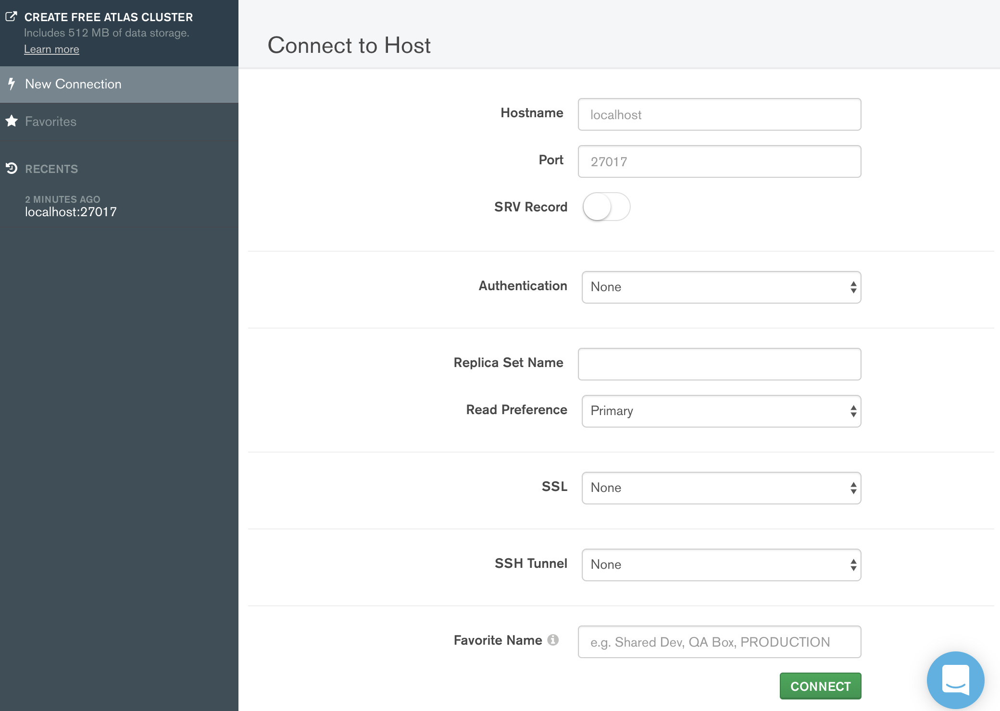

# 一、什么是数据库

数据库即存储数据的仓库，可以将数据进行有序的分门别类的存储。它是独立于语言之外的软件，可以通过API去操作它。
常见的数据库软件有：mysql、mongoDB、oracle。


# 二、MongoDB数据库下载安装

下载地址：https://www.mongodb.com/download-center/community


api采用的js语法，数据是json

安装测试

- mongod -version

```sh
db version v4.2.1
git version: edf6d45851c0b9ee15548f0f847df141764a317e
allocator: system
modules: none
build environment:
    distarch: x86_64
    target_arch: x86_64
```

在根目录下新建 data 文件夹，里面再建一个 db 文件夹，安装MongoDB时并不会自动生成，需要我们手动创建，可以在命令行输入创建，也可以直接在Finder中手动新建


运行

mongod

重新打开命令行，输入

mongo

可以对数据库进行操作，要停止MongoDB的时候一定要正确的退出，不然下次再次连接数据库会出现问题，使用下面的两行代码可以完成这一操作。

use admin;

db.shutdownServer();

### windows安装

https://www.runoob.com/mongodb/mongodb-window-install.html

# 三、MongoDB可视化软件

MongoDB可视化操作软件，是使用图形界面操作数据库的一种方式。


# 四、数据库相关概念

在一个数据库软件中可以包含多个数据仓库，在每个数据仓库中可以包含多个数据集合，每个数据集合中可以包含多条文档（具体的数据）。


- 先命令行启动 mongod
- 打开可视化软件连接



# 五、Mongoose第三方包

使用Node.js操作MongoDB数据库需要依赖Node.js第三方包mongoose

在项目根目录

使用npm install mongoose命令下载

### 启动MongoDB

在命令行工具中运行net start mongoDB或者mongo即可启动MongoDB，否则MongoDB将无法连接。

### 数据库连接

使用mongoose提供的connect方法即可连接数据库。

```js
const mongoose = require('mongoose')
mongoose.connect('mongodb://localhost/cms')
.then(() => console.log('数据库连接成功'))
.catch(err => console.log('数据库连接失败', err));


//liujiangdeMacBook-Pro:42、mongoDB liujiang$ nodemon mon.js 
[nodemon] 1.19.4
[nodemon] to restart at any time, enter `rs`
[nodemon] watching dir(s): *.*
[nodemon] watching extensions: js,mjs,json
[nodemon] starting `node mon.js`
(node:8863) DeprecationWarning: current URL string parser is deprecated, and will be removed in a future version. To use the new parser, pass option { useNewUrlParser: true } to MongoClient.connect.
(node:8863) DeprecationWarning: current Server Discovery and Monitoring engine is deprecated, and will be removed in a future version. To use the new Server Discover and Monitoring engine, pass option { useUnifiedTopology: true } to the MongoClient constructor.
数据库连接成功
```

# 六、创建数据库

在MongoDB中不需要显式创建数据库，如果正在使用的数据库不存在，MongoDB会自动创建。

# 七、创建表

创建表分为两步，一是对对表设定规则，二是创建表，创建mongoose.Schema构造函数的实例即可创建表。

```js
const mongoose = require('mongoose')
mongoose.connect('mongodb://localhost/cms')
    .then(() => console.log('数据库连接成功'))
    .catch(err => console.log('数据库连接失败', err));


// 设定集合规则
const courseSchema = new mongoose.Schema({
    name: String,
    author: String,
    isPublished: Boolean
});
// 创建集合并应用规则
const Course = mongoose.model('Course', courseSchema); //Course规定首字母大写到数据库中自动转成courses
//此时保存，查看数据库也没有我们创建的，因为没有数据他是不会创建的

```

# 八、添加数据

```js
const mongoose = require('mongoose')
mongoose.connect('mongodb://localhost/cms')
    .then(() => console.log('数据库连接成功'))
    .catch(err => console.log('数据库连接失败', err));


// 设定集合规则
const courseSchema = new mongoose.Schema({
    name: String,
    author: String,
    isPublished: Boolean
});
// 创建集合并应用规则
const Course = mongoose.model('Course', courseSchema); //Course规定首字母大写到数据库中自动转成courses
//此时保存，查看数据库也没有我们创建的，因为没有数据他是不会创建的
// 创建实例
const course = new Course({
    name: 'Node.js course',
    author: 'liujiang',
    isPublished: true
});
// 将数据保存到数据库中
course.save();

```


### 另一种方式添加

```js
Course.create({name: 'JavaScript基础', author: 'liujiang', isPublish: true}, (err, doc) => { 
     //  错误对象
    console.log(err)
     //  当前插入的文档
    console.log(doc)
});
Course.create({name: 'JavaScript基础', author: 'liujiang', isPublish: true})
      .then(doc => console.log(doc))
      .catch(err => console.log(err))

```

```sh
mongodb出现E11000 duplicate key error collection  数据重复问题
```


# 九、mongoDB数据库导入数据

```js
mongoimport -d 数据库名称 -c 表名称 --file 要导入的数据文件

找到mongodb数据库的安装目录，将安装目录下的bin目录放置在环境变量中。

mongoimport -d cms -c users --file ./user.json 

表名加s，与const User = mongoose.model("User",userSchema);对应上
```

#  十、查询

```js
//  根据条件查找文档（条件为空则查找所有文档）
const mongoose = require('mongoose')
mongoose.connect('mongodb://localhost/cms')
    .then(() => console.log('数据库连接成功'))
    .catch(err => console.log('数据库连接失败', err));

const userSchema = new mongoose.Schema({
    name: String,
    age: Number,
    email: String,
    password:String,
    hobbies:[String]
});

const User = mongoose.model("User",userSchema);
User.find().then(result => console.log(result))
// 返回文档集合
[ { hobbies: [ '吃饭', '睡觉', '打豆豆' ],
    _id: 5c09f294aeb04b22f8460969,
    name: '赵六',
    age: 50,
    email: 'zhaoliu@itcast.cn',
    password: '123456' },
  { hobbies: [ '足球', '篮球', '橄榄球' ],
    _id: 5c09f1e5aeb04b22f8460965,
    name: '张三',
    age: 20,
    email: 'zhangsan@itcast.cn',
    password: '123456' },
  { hobbies: [ '足球', '篮球' ],
    _id: 5c09f236aeb04b22f8460967,
    name: '李四',
    age: 10,
    email: 'lisi@itcast.cn',
    password: '654321' },
  { hobbies: [ '打豆豆' ],
    _id: 5c09f2d9aeb04b22f846096b,
    name: '狗蛋',
    age: 14,
    email: 'goudan@163.com',
    password: '123456' },
  { hobbies: [ '敲代码' ],
    _id: 5c09f267aeb04b22f8460968,
    name: '王五',
    age: 25,
    email: 'wangwu@itcast.cn',
    password: '123456' },
  { hobbies: [ '吃饭' ],
    _id: 5c09f2b6aeb04b22f846096a,
    name: '王二麻子',
    age: 32,
    email: 'wangermazi@itcast.cn',
    password: '123456' } ]
```

### 根据id指定查找

```js
//find返回的永远是数组
User.find({_id:'5c09f267aeb04b22f8460968'}).then(result => console.log(result))
//返回一条数据
User.findOne({_id:'5c09f267aeb04b22f8460968'}).then(result => console.log(result))
```

```js
//  匹配大于 小于
 User.find({age: {$gt: 20, $lt: 50}}).then(result => console.log(result))
 //  匹配包含
 User.find({hobbies: {$in: ['敲代码']}}).then(result => console.log(result))
 //  选择要查询的字段  
 User.find().select('name email').then(result => console.log(result))
 User.find().select('name email -_id').then(result => console.log(result))
-_id不想查询ID字段
 // 将数据按照年龄进行排序
 User.find().sort('-age').then(result => console.log(result))
 //  skip 跳过多少条数据  limit 限制查询数量
 User.find().skip(2).limit(2).then(result => console.log(result))
 // 删除单个
Course.findOneAndDelete({_id:'5c09f267aeb04b22f8460968'}).then(result => console.log(result))
 // 删除多个
User.deleteMany({}).then(result => console.log(result))
User.deleteMany({ _id: { $in: ['aID', 'bID'] } }).then(result => console.log(result))
// 更新单个
User.updateOne({查询条件}, {要修改的值}).then(result => console.log(result))
User.updateOne({_id:'5c09f1e5aeb04b22f8460965'}, {$set:{"age":"22"}}).then(data=>{
    console.log(data);
})
User.updateOne({_id:'5c09f1e5aeb04b22f8460965'}, {age:44}).then(data=>{
    console.log(data);
})
User.updateOne({_id:"5c09f1e5aeb04b22f8460965"},{name:"qwe"})
.then(res=>{
    console.log(res);
})
// 更新多个
User.updateMany({查询条件}, {要更改的值}).then(result => console.log(result))
//结算集合中的文档数
User.countDocuments().then(data=>{
    console.log(data);
})
```

# 十一、mongoose验证

在创建集合规则时，可以设置当前字段的验证规则，验证失败就则输入插入失败。

- required: true 必传字段
- minlength：3 字符串最小长度
- maxlength: 20 字符串最大长度
- min: 2 数值最小为2
- max: 100 数值最大为100
- enum: ['html', 'css', 'javascript', 'node.js']
- trim: true 去除字符串两边的空格
- validate: 自定义验证器
- default: 默认值

获取错误信息：error.errors['字段名称'].message

```js
const mongoose = require('mongoose')
mongoose.connect('mongodb://localhost/cms')
    .then(() => console.log('数据库连接成功'))
    .catch(err => console.log('数据库连接失败', err));


// 设定集合规则
const postSchema = new mongoose.Schema({
    title:{
        type:String,
        required:true
    }
});

const Post = mongoose.model('Post',postSchema)
Post.create({}).then(result=>console.log(result))


Post validation failed: title: Path `title` is required.


const postSchema = new mongoose.Schema({
    title:{
        type:String,
        required:[true,'请输入标题']
    }
});

```


# 十二、多表关联

通常不同表的数据之间是有关系的，例如文章信息和用户信息存储在不同表中，但文章是某个用户发表的，要查询文章的所有信息包括发表用户，就需要用到表关联。

- 使用id对表进行关联
- 使用populate方法进行关联表查询


```js
// 引入mongoose第三方模块 用来操作数据库
const mongoose = require('mongoose');
// 数据库连接
mongoose.connect('mongodb://localhost/cms', { useNewUrlParser: true})
	// 连接成功
	.then(() => console.log('数据库连接成功'))
	// 连接失败
	.catch(err => console.log(err, '数据库连接失败'));

// 用户集合规则
const userSchema = new mongoose.Schema({
	name: {
		type: String,
		required: true
	}
});
// 文章集合规则
const postSchema = new mongoose.Schema({
	title: {
		type: String
	},
	author: {
		type: mongoose.Schema.Types.ObjectId, // 使用ID将文章集合和作者集合进行关联
		ref: 'User'
	}
});
// 用户集合
const User = mongoose.model('User', userSchema);
// 文章集合
const Post = mongoose.model('Post', postSchema);

// 创建用户
User.create({name: 'tom'}).then(result => console.log(result));
// 创建文章  注意id跟用户tom的id一致
Post.create({titile: '123', author: '5dbfcca3013ccc2e704599cf'}).then(result => console.log(result));


Post.find({_id:'5eeae0f14fb4891c89acfc29'}).populate('author').then(data=>{
    console.log(data);
})

//结果
[ { _id: 5dbfcd054bf5062ea22de683,
    author: { _id: 5dbfcca3013ccc2e704599cf, name: 'tom', __v: 0 },
    __v: 0 } ]
```

# 十三、用户信息增删改查

- 搭建网站服务器，实现客户端与服务器端的通信
- 连接数据库，创建用户表，向表中插入数据
- 当用户访问/list时，将所有用户信息查询出来
- 将用户信息和表格HTML进行拼接并将拼接结果响应回客户端
- 当用户访问/add时，呈现表单页面，并实现添加用户信息功能
- 当用户访问/update时，呈现修改页面，并实现修改用户信息功能
- 当用户访问/delete时，实现用户删除功能

主页

```html
<!DOCTYPE html>
<html lang="en">
<head>
	<meta charset="UTF-8">
	<title>用户列表</title>
	<link rel="stylesheet" href="https://cdn.jsdelivr.net/npm/bootstrap@3.3.7/dist/css/bootstrap.min.css">
</head>
<body>
	<div class="container">
		<h6>
			<a href="add.html" class="btn btn-primary">添加用户</a>
		</h6>
		<table class="table table-striped table-bordered">
			<tr>
				<td>用户名</td>
				<td>年龄</td>
				<td>爱好</td>
				<td>邮箱</td>
				<td>操作</td>
			</tr>
			<tr>
				<td>张三</td>
				<td>20</td>
				<td>
					<span>抽烟</span>
					<span>喝酒</span>
					<span>烫头</span>
				</td>
				<td>zhangsan@163.cn</td>
				<td>
					<a href="" class="btn btn-danger btn-xs">删除</a>
					<a href="" class="btn btn-success btn-xs">修改</a>
				</td>
			</tr>
		</table>
	</div>
</body>
</html>
```

添加用户

```html
<!DOCTYPE html>
<html lang="en">
<head>
	<meta charset="UTF-8">
	<title>用户列表</title>
	<link rel="stylesheet" href="https://cdn.jsdelivr.net/npm/bootstrap@3.3.7/dist/css/bootstrap.min.css">
</head>
<body>
	<div class="container">
		<h3>添加用户</h3>
		<form>
		  <div class="form-group">
		    <label>用户名</label>
		    <input type="text" class="form-control" placeholder="请填写用户名">
		  </div>
		  <div class="form-group">
		    <label>密码</label>
		    <input type="password" class="form-control" placeholder="请输入密码">
		  </div>
		  <div class="form-group">
		    <label>年龄</label>
		    <input type="text" class="form-control" placeholder="请填写年龄">
		  </div>
		  <div class="form-group">
		    <label>邮箱</label>
		    <input type="email" class="form-control" placeholder="请填写邮箱">
		  </div>
		  <div class="form-group">
		    <label>请选择爱好</label>
		    <div>
		    	<label class="checkbox-inline">
		    	  <input type="checkbox" value="足球"> 足球
		    	</label>
		    	<label class="checkbox-inline">
		    	  <input type="checkbox" value="篮球"> 篮球
		    	</label>
		    	<label class="checkbox-inline">
		    	  <input type="checkbox" value="橄榄球"> 橄榄球
		    	</label>
		    	<label class="checkbox-inline">
		    	  <input type="checkbox" value="敲代码"> 敲代码
		    	</label>
		    	<label class="checkbox-inline">
		    	  <input type="checkbox" value="抽烟"> 抽烟
		    	</label>
		    	<label class="checkbox-inline">
		    	  <input type="checkbox" value="喝酒"> 喝酒
		    	</label>
		    	<label class="checkbox-inline">
		    	  <input type="checkbox" value="烫头"> 烫头
		    	</label>
		    </div>
		  </div>
		  <button type="submit" class="btn btn-primary">添加用户</button>
		</form>
	</div>
</body>
</html>
```

```js
const mongoose = require('mongoose')
mongoose.connect('mongodb://localhost/cms',{ useNewUrlParser: true } )
    .then(() => console.log('数据库连接成功'))
    .catch(err => console.log('数据库连接失败', err));

const userSchema = new mongoose.Schema({
    name: String,
    age: Number,
    hobbies:[String],
    email: String,
    password:String
   
});

const User = mongoose.model("User",userSchema);
User.findOne({_id:'5c09f267aeb04b22f8460968'}).then(result => console.log(result))
```

页面跳转

```js
res.writeHead(301, {
    Location: '/list'
});
```


# 作业

- 安装数据库

- 创建用户表

- 把文件(user.json)导入数据库

- 搭建网站服务器，实现客户端与服务器端的通信

- 连接数据库

- 当用户访问/list时，将所有用户信息查询出来

- 将用户信息和表格HTML进行拼接并将拼接结果响应回客户端

- 当用户访问/add时，呈现表单页面，并实现添加用户信息功能

- 当用户访问/update时，呈现修改页面，并实现修改用户信息功能

- 当用户访问/delete时，实现用户删除功能

  


# 答案

user模板

```js
const mongoose = require('mongoose')
mongoose.connect('mongodb://localhost/cms',{ useNewUrlParser: true } )
    .then(() => console.log('数据库连接成功'))
    .catch(err => console.log('数据库连接失败', err));

const userSchema = new mongoose.Schema({
    name: String,
    age: Number,
    hobbies:[String],
    email: String,
    password:String
   
});

const User = mongoose.model("User",userSchema);
User.findOne({_id:'5c09f267aeb04b22f8460968'}).then(result => console.log(result))
```


```js
// 搭建网站服务器，实现客户端与服务器端的通信
// 连接数据库，创建用户集合，向集合中插入文档
// 当用户访问/list时，将所有用户信息查询出来
// 	实现路由功能
// 	呈现用户列表页面
// 	从数据库中查询用户信息 将用户信息展示在列表中
// 将用户信息和表格HTML进行拼接并将拼接结果响应回客户端
// 当用户访问/add时，呈现表单页面，并实现添加用户信息功能
// 当用户访问/modify时，呈现修改页面，并实现修改用户信息功能
// 	修改用户信息分为两大步骤
// 		1.增加页面路由 呈现页面
// 			1.在点击修改按钮的时候 将用户ID传递到当前页面
// 			2.从数据库中查询当前用户信息 将用户信息展示到页面中
// 		2.实现用户修改功能
// 			1.指定表单的提交地址以及请求方式
// 			2.接受客户端传递过来的修改信息 找到用户 将用户信息更改为最新的
// 当用户访问/delete时，实现用户删除功能

const http = require('http');

const url = require('url');
const querystring = require('querystring');

require('./model/index.js');
const User = require('./model/user');


// 创建服务器
const app = http.createServer();

// 为服务器对象添加请求事件
app.on('request', async (req, res) => {
	// 请求方式
	const method = req.method;
	// 请求地址
	const { pathname, query } = url.parse(req.url, true);

	if (method == 'GET') {
		// 呈现用户列表页面
		if (pathname == '/list') {
			// 查询用户信息
			let users = await User.find();
			// html字符串
			let list = `
				<!DOCTYPE html>
				<html lang="en">
				<head>
					<meta charset="UTF-8">
					<title>用户列表</title>
					<link rel="stylesheet" href="https://cdn.jsdelivr.net/npm/bootstrap@3.3.7/dist/css/bootstrap.min.css">
				</head>
				<body>
					<div class="container">
						<h6>
							<a href="/add" class="btn btn-primary">添加用户</a>
						</h6>
						<table class="table table-striped table-bordered">
							<tr>
								<td>用户名</td>
								<td>年龄</td>
								<td>爱好</td>
								<td>邮箱</td>
								<td>操作</td>
							</tr>
			`;

			// 对数据进行循环操作
			users.forEach(item => {
				list += `
					<tr>
						<td>${item.name}</td>
						<td>${item.age}</td>
						<td>
				`;

				item.hobbies.forEach(item => {
					list += `<span>${item}</span>`;
				})

				list += `</td>
						<td>${item.email}</td>
						<td>
							<a href="/remove?id=${item._id}" class="btn btn-danger btn-xs">删除</a>
							<a href="/modify?id=${item._id}" class="btn btn-success btn-xs">修改</a>
						</td>
					</tr>`;
			});

			list += `
						</table>
					</div>
				</body>
				</html>
			`;
			res.end(list);
		}else if (pathname == '/add') {
			// 呈现添加用户表单页面
			let add = `
				<!DOCTYPE html>
				<html lang="en">
				<head>
					<meta charset="UTF-8">
					<title>用户列表</title>
					<link rel="stylesheet" href="https://cdn.jsdelivr.net/npm/bootstrap@3.3.7/dist/css/bootstrap.min.css">
				</head>
				<body>
					<div class="container">
						<h3>添加用户</h3>
						<form method="post" action="/add">
						  <div class="form-group">
						    <label>用户名</label>
						    <input name="name" type="text" class="form-control" placeholder="请填写用户名">
						  </div>
						  <div class="form-group">
						    <label>密码</label>
						    <input name="password" type="password" class="form-control" placeholder="请输入密码">
						  </div>
						  <div class="form-group">
						    <label>年龄</label>
						    <input name="age" type="text" class="form-control" placeholder="请填写邮箱">
						  </div>
						  <div class="form-group">
						    <label>邮箱</label>
						    <input name="email" type="email" class="form-control" placeholder="请填写邮箱">
						  </div>
						  <div class="form-group">
						    <label>请选择爱好</label>
						    <div>
						    	<label class="checkbox-inline">
						    	  <input type="checkbox" value="足球" name="hobbies"> 足球
						    	</label>
						    	<label class="checkbox-inline">
						    	  <input type="checkbox" value="篮球" name="hobbies"> 篮球
						    	</label>
						    	<label class="checkbox-inline">
						    	  <input type="checkbox" value="橄榄球" name="hobbies"> 橄榄球
						    	</label>
						    	<label class="checkbox-inline">
						    	  <input type="checkbox" value="敲代码" name="hobbies"> 敲代码
						    	</label>
						    	<label class="checkbox-inline">
						    	  <input type="checkbox" value="抽烟" name="hobbies"> 抽烟
						    	</label>
						    	<label class="checkbox-inline">
						    	  <input type="checkbox" value="喝酒" name="hobbies"> 喝酒
						    	</label>
						    	<label class="checkbox-inline">
						    	  <input type="checkbox" value="烫头" name="hobbies"> 烫头
						    	</label>
						    </div>
						  </div>
						  <button type="submit" class="btn btn-primary">添加用户</button>
						</form>
					</div>
				</body>
				</html>
			`;
			res.end(add)
		}else if (pathname == '/modify') {
			let user = await User.findOne({_id: query.id});
			let hobbies = ['足球', '篮球', '橄榄球', '敲代码', '抽烟', '喝酒', '烫头', '吃饭', '睡觉', '打豆豆']
			console.log(user)
			// 呈现修改用户表单页面
			let modify = `
				<!DOCTYPE html>
				<html lang="en">
				<head>
					<meta charset="UTF-8">
					<title>用户列表</title>
					<link rel="stylesheet" href="https://cdn.jsdelivr.net/npm/bootstrap@3.3.7/dist/css/bootstrap.min.css">
				</head>
				<body>
					<div class="container">
						<h3>修改用户</h3>
						<form method="post" action="/modify?id=${user._id}">
						  <div class="form-group">
						    <label>用户名</label>
						    <input value="${user.name}" name="name" type="text" class="form-control" placeholder="请填写用户名">
						  </div>
						  <div class="form-group">
						    <label>密码</label>
						    <input value="${user.password}" name="password" type="password" class="form-control" placeholder="请输入密码">
						  </div>
						  <div class="form-group">
						    <label>年龄</label>
						    <input value="${user.age}" name="age" type="text" class="form-control" placeholder="请填写邮箱">
						  </div>
						  <div class="form-group">
						    <label>邮箱</label>
						    <input value="${user.email}" name="email" type="email" class="form-control" placeholder="请填写邮箱">
						  </div>
						  <div class="form-group">
						    <label>请选择爱好</label>
						    <div>
						    	
						    
			`;

			hobbies.forEach(item => {
				// 判断当前循环项在不在用户的爱好数据组
				let isHobby = user.hobbies.includes(item);
				if (isHobby) {
					modify += `
						<label class="checkbox-inline">
						  <input type="checkbox" value="${item}" name="hobbies" checked> ${item}
						</label>
					`
				}else {
					modify += `
						<label class="checkbox-inline">
						  <input type="checkbox" value="${item}" name="hobbies"> ${item}
						</label>
					`
				}
			})

			modify += `
						    </div>
						  </div>
						  <button type="submit" class="btn btn-primary">修改用户</button>
						</form>
					</div>
				</body>
				</html>
			`;
			res.end(modify)
		}else if (pathname == '/remove') {
			// res.end(query.id)
			await User.findOneAndDelete({_id: query.id});
			res.writeHead(301, {
				Location: '/list'
			});
			res.end();
		}
	}else if (method == 'POST') {
		// 用户添加功能
		if (pathname == '/add') {
			// 接受用户提交的信息
			let formData = '';
			// 接受post参数
			req.on('data', param => {
				formData += param;
			})
			// post参数接受完毕
			req.on('end', async () => {
				let user = querystring.parse(formData)
				// 将用户提交的信息添加到数据库中
				await User.create(user);
				// 301代表重定向
				// location 跳转地址
				res.writeHead(301, {
					Location: '/list'
				});
				res.end();
			})
		}else if (pathname == '/modify') {
			// 接受用户提交的信息
			let formData = '';
			// 接受post参数
			req.on('data', param => {
				formData += param;
			})
			// post参数接受完毕
			req.on('end', async () => {
				let user = querystring.parse(formData)
				// 将用户提交的信息添加到数据库中
				await User.updateOne({_id: query.id}, user);
				// 301代表重定向
				// location 跳转地址
				res.writeHead(301, {
					Location: '/list'
				});
				res.end();
			})
		}
	}

});
// 监听端口
app.listen(3000);
```


# mysql

```js
const express = require('express');
const app = express();
//cnpm install mysql
const mysql = require('mysql');
const connection = mysql.createConnection({
    host: 'localhost',
    user: 'root',
    password: 'password',
    database: '1901'
});

let sql = 'SELECT * FROM tb_users';
app.get('/users', (req, res) => {
    // 对客户端做出响应 send方法会根据内容的类型自动设置请求头
    connection.connect();
    connection.query(sql, function (err, result) {
        if (err) {
            console.log('[SELECT ERROR] - ', err.message);
            return;
        }
        res.send(result); // <h2>Hello Express</h2> {say: 'hello'}
    });
    connection.end();
});
// connection.connect();
//查
// connection.query(sql,function (err, result) {
//         if(err){
//           console.log('[SELECT ERROR] - ',err.message);
//           return;
//         }

//        console.log('--------------------------SELECT----------------------------');
//        console.log(result);
//        console.log('------------------------------------------------------------\n\n');  


// });


// connection.end();
//nodemon mysql.js
// 程序监听3000端口
app.listen(3001);


```

Server.js

```js
const express = require('express');
const Mock = require('mockjs');
const mysql = require('./mysql');


// 使用框架创建web服务器
const app = express();
// 引入body-parser模块  处理接收post请求
const bodyParser = require('body-parser');
// 配置body-parser模块
app.use(bodyParser.urlencoded({ extended: false }));
// 解析以 application/json 和 application/x-www-form-urlencoded 提交的数据
app.use(bodyParser.urlencoded({ extended: false }));
//  后台全局请求地址
const url = "/shop/console"

//设置跨域请求
app.all('*', function (req, res, next) {
    res.header("Access-Control-Allow-Origin", "*");
    res.header('Access-Control-Allow-Headers', 'Content-Type, Content-Length, Authorization, Accept, X-Requested-With , yourHeaderFeild');
    res.header("Access-Control-Allow-Methods", "PUT,POST,GET,DELETE,OPTIONS");
    res.header("X-Powered-By", ' 3.2.1')
    res.header("Content-Type", "application/json;charset=utf-8");
    next();
});

// 登陆验证
app.post(url + "/login", (req, res) => {
    console.log(req.body.username);
    let username = req.body.username;
    let password = req.body.password;
    //console.log(req.query);//"获取get提交参数" req.query.name
    if (username == "admin" && password == "123") {
        res.send({ msg: "登陆成功", status: 200 })
    } else {
        res.send({ msg: "登陆失败", status: 400 });
    }

})

// 获取首页菜单
app.get(url + '/home/menu', (req, res) => {
    res.send({
        data: [
            {
                id: 101,
                menuName: "商品管理",
                path: null,
                children: [
                    {
                        id: 104,
                        menuName: "商品列表",
                        path: "/product",
                        children: []
                    }
                ]
            },
            {
                id: 201,
                menuName: "权限管理",
                path: null,
                children: [
                    {
                        id: 204,
                        menuName: "角色列表",
                        path: "/roles",
                        children: []
                    },
                    {
                        id: 205,
                        menuName: "权限列表",
                        path: "/authc",
                        children: []
                    }
                ]
            },
            {
                id: 301,
                menuName: "用户管理",
                path: null,
                children: [
                    {
                        id: 304,
                        menuName: "用户列表",
                        path: "/user",
                        children: []
                    }
                ]
            },
            {
                id: 401,
                menuName: "订单管理",
                path: null,
                children: [
                    {
                        id: 404,
                        menuName: "订单列表",
                        path: "/order",
                        children: []
                    }
                ]
            },
            {
                id: 501,
                menuName: "数据统计",
                path: null,
                children: [
                    {
                        id: 504,
                        menuName: "订单统计",
                        path: "orderTotal",
                        children: []
                    },
                    {
                        id: 505,
                        menuName: "用户统计",
                        path: "userTotal",
                        children: []
                    },
                    {
                        id: 506,
                        menuName: "商品统计",
                        path: "productTotal",
                        children: []
                    }
                ]
            }
        ],
        status: 200
    })
})

// 获取用户列表数据
app.get(url + '/user/userlist', (req, res) => {
    // 对客户端做出响应 send方法会根据内容的类型自动设置请求头
    // var data = Mock.mock({
    //     'users|7': [
    //         {
    //             'id|+1': 1,
    //             name: '@cname',
    //             email: '@email',
    //             tel: '@integer(10000000000,18999999999)',
    //             roles: '@integer(1, 2)',
    //             state: '@boolean',
    //             // image: '@image(42x42,@color,@character)'
    //         }]
    // });

    // const connection = mysql.createConnection({
    //     host: 'localhost',
    //     user: 'root',
    //     password: 'password',
    //     database: '1901'
    // });
  var connection =  mysql.getConnection()
  connection.connect();
  connection.query("select * from tb_users", function (err, result) {
      if (err) {
          return "sql err";
      }
      res.send(result); //
  });
  connection.end();
});
// 程序监听3000端口
app.listen(3000);
```

Mysql.js

```js
const express = require('express');
const app = express();
//cnpm install mysql
const mysql = require('mysql');

const db = {
    getConnection() {
        const connection = mysql.createConnection({
            host: 'localhost',
            user: 'root',
            password: 'password',
            database: '1901'
        });
        return connection;

    }
};


module.exports = db;


```

