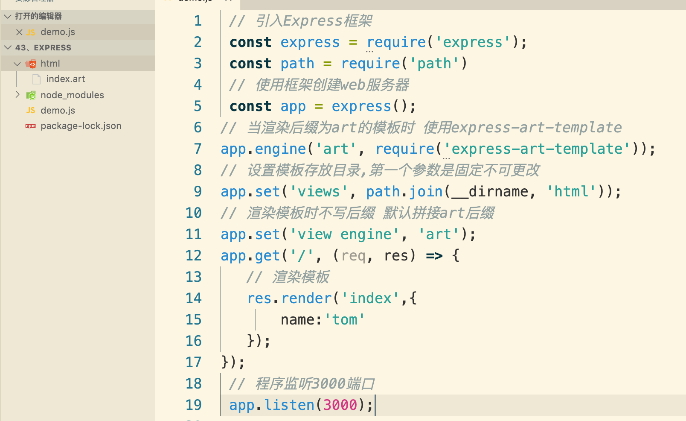

# Express

## 一.Express框架是什么 

Express是一个基于Node平台的web应用开发框架，它提供了一系列的强大特性，帮助你创建各种Web应用。我们可以使用 npm install express 命令进行下载。

```sh
cnpm install express
```

### 1 Express框架特性 

提供了方便简洁的路由定义方式
对获取HTTP请求参数进行了简化处理
对模板引擎支持程度高，方便渲染动态HTML页面
提供了中间件机制有效控制HTTP请求
拥有大量第三方中间件对功能进行扩展

### 2. 原生Node.js与Express框架对比之路由


### 3. 原生Node.js与Express框架对比之获取请求参数


### 4. Express初体验

使用Express框架创建web服务器及其简单，调用express模块返回的函数即可。

```js
 // 引入Express框架
 const express = require('express');
 // 使用框架创建web服务器
 const app = express();
 // 当客户端以get方式访问/路由时
 app.get('/', (req, res) => {
    // 对客户端做出响应 send方法会根据内容的类型自动设置请求头
    res.send('Hello Express'); // <h2>Hello Express</h2> {say: 'hello'}
 });
 // 程序监听3000端口
 app.listen(3000);

//访问
http://localhost:3000/
```

```js
 // 引入Express框架
 const express = require('express');
 // 使用框架创建web服务器
 const app = express();
 // 当客户端以get方式访问/路由时
 app.get('/', (req, res) => {
    // 对客户端做出响应 send方法会根据内容的类型自动设置请求头
    res.send('Hello Express'); // <h2>Hello Express</h2> {say: 'hello'}
 });
 app.get('/list', (req, res) => {
   res.send({name:"tom",age:18}); 
});
 // 程序监听3000端口
 app.listen(3000);


```


## 二、 什么是中间件

中间件就是一堆方法，可以接收客户端发来的请求、可以对请求做出响应，也可以将请求继续交给下一个中间件继续处理。


中间件主要由两部分构成，中间件方法以及请求处理函数。
中间件方法由Express提供，负责拦截请求，请求处理函数由开发人员提供，负责处理请求。


可以针对同一个请求设置多个中间件，对同一个请求进行多次处理。
默认情况下，请求从上到下依次匹配中间件，一旦匹配成功，终止匹配。
可以调用next方法将请求的控制权交给下一个中间件，直到遇到结束请求的中间件。

### 1. app.use中间件用法

app.use 匹配所有的请求方式，可以直接传入请求处理函数，代表接收所有的请求。

- 客户端在访问需要登录的页面时，可以先使用中间件判断用户登录状态，用户如果未登录，则拦截请求，直接响应，禁止用户进入需要登录的页面。

```js
 // 引入Express框架
 const express = require('express');
 // 使用框架创建web服务器
 const app = express();
app.use('/admin',(req,res,next)=>{
   let loginFlag = false;
   if(loginFlag){
      next()
   }else{
      res.send('你还没登录，不能访问admin页面')
   }
})
app.get('/admin',(req,res)=>{
   res.send("登陆成功，admin")
})

 // 当客户端以get方式访问/路由时
 app.get('/', (req, res) => {
    // 对客户端做出响应 send方法会根据内容的类型自动设置请求头
    res.send('Hello Express'); // <h2>Hello Express</h2> {say: 'hello'}
 });
 app.get('/list', (req, res) => {
   res.send({name:"tom",age:18}); 
});
 // 程序监听3000端口
 app.listen(3000);


```

## 三、 构建模块化路由

```js
 const express = require('express') 
 // 创建路由对象
 const home = express.Router();
 // 将路由和请求路径进行匹配
 app.use('/home', home);
  // 在home路由下继续创建路由 /home/index
 home.get('/index', () => {
         res.send('欢迎来到博客展示页面');
 });

```

### 1、模块化

```js
 // home.js
const express = require('express')
const home = express.Router()
home.get('/',(req,resp)=>{
    resp.send('欢迎来到home页面');
})
module.exports = home
```

```js
 // login.js
const express = require('express')
const login = express.Router();
login.get('/', (req,resp) => {
    resp.send('欢迎来到login页面');
});
module.exports = login

```

```js
 // app.js
const express = require('express')
const app = express()
const home = require('./home.js')
const login = require('./login.js')
app.use('/home',home)
app.use('/login',login)
app.listen(3000)

```

### 2、GET参数的获取

Express框架中使用req.query即可获取GET参数，框架内部会将GET参数转换为对象并返回。

```js
 // 接收地址栏中问号后面的参数
 // 例如: http://localhost:3000/?name=zhangsan&age=30
 app.get('/', (req, res) => {
    console.log(req.query); // {"name": "zhangsan", "age": "30"}
 });

```

### 3、 POST参数的获取

Express中接收post请求参数需要借助第三方包 body-parser。

```js
//cnpm install body-parser --save 

// 引入body-parser模块
 const bodyParser = require('body-parser');
 // 配置body-parser模块
 app.use(bodyParser.urlencoded({ extended: false }));
 // 接收请求
 app.post('/add', (req, res) => {
    // 接收请求参数
    console.log(req.body);
 }) 

```

```js
const express = require('express')
const home = express.Router()

home.get('/',(req,res)=>{
    let list =`    <form action="/home/add" method="POST">
    <input type="text" name="username" id="">
    <input type="submit" value="提交">
</form>`
    res.send(list)
})
//  /home/list
home.get('/list',(req,res)=>{
    res.send('list页面')
})
home.post('/add',(req,res)=>{
    console.log(req.body);
    res.send(req.body.username)
})

module.exports = home
```


### 4、 Express路由参数

```js
 app.get('/find/:id', (req, res) => { 
     console.log(req.params); // {id: 123} 
 });

```

```js
localhost:3000/find/123
```

### 5、 静态资源的处理

通过Express内置的express.static可以方便地托管静态文件，例如img、CSS、JavaScript 文件等。

```js
 app.use(express.static('public'));
```

现在，public 目录下面的文件就可以直接访问了。

http://localhost:3000/images/kitten.jpg
http://localhost:3000/css/style.css
http://localhost:3000/js/app.js
http://localhost:3000/images/bg.png
http://localhost:3000/hello.html 

## 四、模板引擎

模板引擎是第三方模块。
让开发者以更加友好的方式拼接字符串，使项目代码更加清晰、更加易于维护。

```js
 // 未使用模板引擎的写法
 var ary = [{ name: '张三', age: 20 }];
 var str = '<ul>';
 for (var i = 0; i < ary.length; i++) { 
    str += '<li>\
        <span>'+ ary[i].name +'</span>\
        <span>'+ ary[i].age +'</span>\
    </li>';
 }
 str += '</ul>'; 

```

```js
 <!-- 使用模板引擎的写法 --> 
 <ul>
    {{each ary}}
        <li>{{$value.name}}</li>
        <li>{{$value.age}}</li>
    {{/each}}
 </ul>

```

### 1、art-template模板引擎

- 在命令行工具中使用 `npm install art-template express-art-template`  命令进行下载
- 使用const template = require('art-template')引入模板引擎
- 告诉模板引擎要拼接的数据和模板在哪 const html = template(‘模板路径’, 数据);
- 使用模板语法告诉模板引擎，模板与数据应该如何进行拼接 

```js
 // 引入Express框架
 const express = require('express');
 const path = require('path')
 // 使用框架创建web服务器
 const app = express();
// 当渲染后缀为art的模板时 使用express-art-template
app.engine('art', require('express-art-template'));
// 设置模板存放目录
app.set('views', path.join(__dirname, 'html'));
// 渲染模板时不写后缀 默认拼接art后缀
app.set('view engine', 'art');
app.get('/', (req, res) => {
   // 渲染模板
   res.render('index',{
       name:'tom'
   });
}); 
 // 程序监听3000端口
 app.listen(3000);
```

```html
{{name}}
```



标准语法

```html
  <!-- 标准语法 -->
{{value}}
{{data.key}}
{{data['key']}}
{{a ? b : c}}表示如果a为真,则表达式值为b,如果a为假,则表达式值为c
{{a || b}}
{{a + b}}
```

```js
 // 引入Express框架
 const express = require('express');
 const path = require('path')
 // 使用框架创建web服务器
 const app = express();
// 当渲染后缀为art的模板时 使用express-art-template
app.engine('art', require('express-art-template'));
// 设置模板存放目录,第一个参数是固定不可更改
app.set('views', path.join(__dirname, 'html'));
// 渲染模板时不写后缀 默认拼接art后缀
app.set('view engine', 'art');
app.get('/', (req, res) => {
   // 渲染模板
   res.render('index',{
       user:{
           name:'tom',
           age:18
       }
   });
}); 
 // 程序监听3000端口
 app.listen(3000);

//index.art
{{user.name}}
{{user.age}}
{{user.age+10}}
{{user.sex?5:1000}}
{{user.name || user.age}}
```

### 2、原文输出

如果数据中携带HTML标签，默认模板引擎不会解析标签，会将其转义后输出。

```js
 // 引入Express框架
 const express = require('express');
 const path = require('path')
 // 使用框架创建web服务器
 const app = express();
// 当渲染后缀为art的模板时 使用express-art-template
app.engine('art', require('express-art-template'));
// 设置模板存放目录,第一个参数是固定不可更改
app.set('views', path.join(__dirname, 'html'));
// 渲染模板时不写后缀 默认拼接art后缀
app.set('view engine', 'art');
app.get('/', (req, res) => {
   // 渲染模板
   res.render('index',{
       user:{
           name:'tom',
           age:18,
           msg:'<h1>hello art</h1>'
       }
   });
}); 
 // 程序监听3000端口
 app.listen(3000);

//index.art
{{user.msg}} 不会解析标签
{{@user.msg}}
```

### 3、条件判断

```js
 <!-- 标准语法 --> 
 {{if 条件}} ... {{/if}}
 {{if v1}} ... {{else if v2}} ... {{/if}}
                                   
                                   
                                   
   {{if user.age>10}} 我成年了{{/if}}  满足显示，不满足就显示                                 
   {{if user.age>100}} 我成年了 {{else}} 我未成年 {{/if}}
   {{if user.age>10}} 红色 {{else if user.age<6}} 蓝色 {{/if}}                                         
```

### 4、循环

```js
 {{each target}}
     {{$index}} {{$value}}
 {{/each}}
```

```js
// 引入Express框架
const express = require('express');
const path = require('path')
// 使用框架创建web服务器
const app = express();
// 当渲染后缀为art的模板时 使用express-art-template
app.engine('art', require('express-art-template'));
// 设置模板存放目录,第一个参数是固定不可更改
app.set('views', path.join(__dirname, 'html'));
// 渲染模板时不写后缀 默认拼接art后缀
app.set('view engine', 'art');
app.get('/', (req, res) => {
    // 渲染模板
    res.render('index', {
        data:
            [{
                name: 'tom',
                age: 18,
                msg: '<h1>hello art</h1>'
            },
            {
                name: 'jerry',
                age: 11,
                msg: '<h1>hello art</h1>'
            },
            {
                name: 'eric',
                age: 1,
                msg: ['hello', 'json', 'java']
            }]

    }
    );
});
// 程序监听3000端口
app.listen(3000);


```

```js
 {{each data}}
     {{$index}} {{$value}}
     {{$value.name}}
     {{$value.msg}}
     {{@$value.msg}}
     {{if $index==2 }}
        {{each $value.msg}}
            {{$value}}
        {{/each}}
     {{/if}}
 {{/each}}
```

# 作业

- 自定义404页面和网站维护页面
- 网站维护公告，在所有路由的最上面定义接收所有请求的中间件，直接为客户端做出响应，显示网站正在维护中。
- 使用模块化和模板引擎，完成用户表的CRUD，如果报错显示404页面