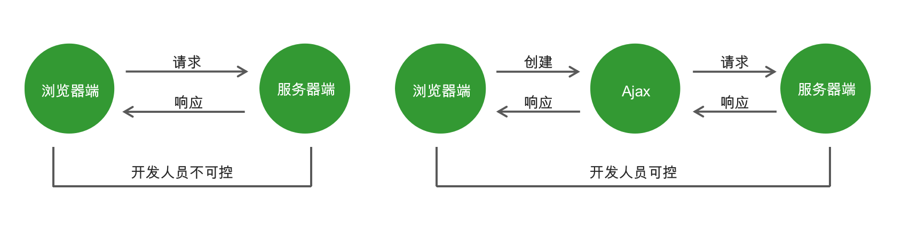
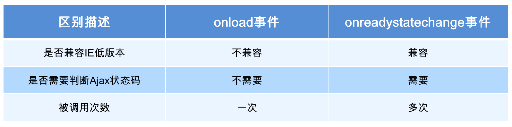
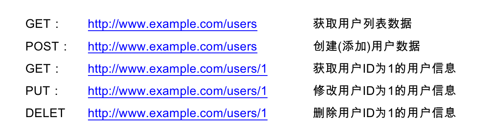

# Ajax

## 传统网站中存在的问题

- 网速慢的情况下，页面加载时间长，用户只能等待
-  表单提交后，如果一项内容不合格，需要重新填写所有表单内容
-  页面跳转，重新加载页面，造成资源浪费，增加用户等待时间

#### ajax 它是浏览器提供的一套方法，可以实现页面异步无刷新更新数据，提高用户浏览网站应用的体验

## Ajax 的应用场景

1. 页面上拉加载更多数据
2. 列表数据无刷新分页
3. 表单项离开焦点数据验证
4. 搜索框提示文字下拉列表

## Ajax 运行原理

Ajax 相当于浏览器发送请求与接收响应的代理人，以实现在不影响用户浏览页面的情况下，局部更新页面数据，从而提高用户体验。



## Ajax 的实现步骤

1. 创建 Ajax 对象

```js
 var xhr = new XMLHttpRequest();
```

2.  告诉 Ajax 请求地址以及请求方式

```js
 xhr.open('get', 'http://www.example.com');
```

3.  发送请求

```js
 xhr.send();
```

4. 获取服务器端给与客户端的响应数据

```js
 xhr.onload = function () {
     console.log(xhr.responseText);
 }
```

## 服务器端响应的数据格式

在真实的项目中，服务器端大多数情况下会以 JSON 对象作为响应数据的格式。当客户端拿到响应数据时，要将 JSON 数据和 HTML 字符串进行拼接，然后将拼接的结果展示在页面中。

在 http 请求与响应的过程中，无论是请求参数还是响应内容，如果是对象类型，最终都会被转换为对象字符串进行传输。

```js
// 引入Express框架
const express = require('express');
// 使用框架创建web服务器
const app = express();
app.get('/ajax', (req, res) => {
    // express处理跨域问题
    res.header("Access-Control-Allow-Origin", "*");
    res.send({name:"tom",age:18});
});
app.listen(3000)
```

返回的是字符串

```js
 JSON.parse() // 将 json 字符串转换为json对象
```

```html
<!DOCTYPE html>
<html lang="en">

<head>
    <meta charset="UTF-8">
    <meta name="viewport" content="width=device-width, initial-scale=1.0">
    <meta http-equiv="X-UA-Compatible" content="ie=edge">
    <title>Document</title>
</head>

<body>
    <script>
        var xhr = new XMLHttpRequest()
        xhr.open('get', 'http://127.0.0.1:3000/ajax')
        // 前端解决跨域问题
        // xhr.setRequestHeader('Content-Type', 'application/x-www-form-urlencoded');
        xhr.send()
        xhr.onload = function () {
            console.log(xhr.responseText);
            var json = JSON.parse(xhr.responseText);
            console.log(json);
            document.body.innerHTML = json.name
        }
    </script>
</body>

</html>
```

## 请求参数传递

- get

```js
xhr.open('get', 'http://www.example.com?name=zhangsan&age=20');

//后台接收数据
console.log(req.query);
res.send(req.query.name);
```

- post

```js
xhr.setRequestHeader('Content-Type', 'application/x-www-form-urlencoded') xhr.send('name=zhangsan&age=20');

//后台接收数据
console.log(req.body);


// 引入Express框架
const express = require('express');
// 使用框架创建web服务器
const app = express();
// 引入body-parser模块
const bodyParser = require('body-parser');
// 配置body-parser模块
app.use(bodyParser.urlencoded({ extended: false }));

app.get('/ajax', (req, res) => {
    // express处理跨域问题
    res.header("Access-Control-Allow-Origin", "*");
    console.log(req.query.name);
    res.send({name:"tom",age:18});
});
app.post('/ajax', (req, res) => {
    // express处理跨域问题
    res.header("Access-Control-Allow-Origin", "*");
    console.log(req.body);
    res.send({name:"tom",age:18});
});
app.listen(3000)
```

## 获取服务器端的响应

在创建ajax对象，配置ajax对象，发送请求，以及接收完服务器端响应数据，这个过程中的每一个步骤都会对应一个数值，这个数值就是ajax状态码。

0：请求未初始化(还没有调用open())
1：请求已经建立，但是还没有发送(还没有调用send())
2：请求已经发送
3：请求正在处理中，通常响应中已经有部分数据可以用了
4：响应已经完成，可以获取并使用服务器的响应了

```js
 xhr.readyState // 获取Ajax状态码
```

### onreadystatechange 

当 Ajax 状态码发生变化时将自动触发该事件。

在事件处理函数中可以获取 Ajax 状态码并对其进行判断，当状态码为 4 时就可以通过 xhr.responseText 获取服务器端的响应数据了。

```js
 // 当Ajax状态码发生变化时
 xhr.onreadystatechange = function () {
     // 判断当Ajax状态码为4时
     if (xhr.readyState == 4) {
         // 获取服务器端的响应数据
         console.log(xhr.responseText);
     }
 }
```

### 两种获取服务器端响应方式的区别



#### 服务器端设置状态码

```js
res.status(400).send("not ok")
```

## 浏览器的缓存问题

问题：在低版本的 IE 浏览器中，Ajax 请求有严重的缓存问题，即在请求地址不发生变化的情况下，只有第一次请求会真正发送到服务器端，后续的请求都会从浏览器的缓存中获取结果。即使服务器端的数据更新了，客户端依然拿到的是缓存中的旧数据。

解决方案：在请求地址的后面加请求参数，保证每一次请求中的请求参数的值不相同。 

```js
 xhr.open('get', 'http://www.example.com?t=' + Math.random());
```

## Jquery的ajax

```js
 $.ajax({
     type: 'get',
     url: 'http://www.example.com',
     data: { name: 'zhangsan', age: '20' },
     success: function (response) {},
     error: function (xhr) {}
});

```

## Art-template

https://aui.github.io/art-template/zh-cn/index.html

1. 下载 art-template 模板引擎库文件并在 HTML 页面中引入库文件（下载template-web.js）

```js
 <script src="./js/template-web.js"></script>
```

2. 准备模板

```js
 <script id="tpl" type="text/html">
     <div class="box"></div>
 </script>
```

3. 告诉模板引擎将哪一个模板和哪个数据进行拼接

```js
 var html = template('tpl', {username: 'zhangsan', age: '20'});
```

4. 将拼接好的html字符串添加到页面中

```js
 document.getElementById('container').innerHTML = html;
```

5. 通过模板语法告诉模板引擎，数据和html字符串要如何拼接

```js
 <script id="tpl" type="text/html">
     <div class="box"> {{ username }} </div>
 </script>
```

```html
<!DOCTYPE html>
<html lang="en">
<head>
    <meta charset="UTF-8">
    <meta name="viewport" content="width=device-width, initial-scale=1.0">
    <meta http-equiv="X-UA-Compatible" content="ie=edge">
    <title>Document</title>
    <script src="./template-web.js"></script>
</head>
<body>
    <div id="container"></div>
    <script id="tpl" type="text/html">
        <h1>{{ username }}</h1> 
    </script>

    <script>
         var html = template('tpl', {username: 'zhangsan', age: '20'});
         document.getElementById('container').innerHTML = html;
    </script>
</body>
</html>
```


## 案例：

### 搜索框提示

```js
<!--
 * @Descripttion: 
 * @version: 
 * @Author: Tony
 * @Date: 2020-04-02 10:14:26
 * @LastEditors: Tony
 * @LastEditTime: 2020-04-02 10:40:26
 -->
<!DOCTYPE html>
<html lang="en">
<head>
	<meta charset="UTF-8">
	<title>搜索框输入文字自动提示</title>
    <link rel="stylesheet" href="https://cdn.bootcss.com/twitter-bootstrap/4.4.1/css/bootstrap.css">
    <script src="../资料/template-web.js"></script>
    <script src="https://cdn.bootcss.com/jquery/3.4.1/jquery.min.js"></script>
	<style type="text/css">
		.container {
			padding-top: 150px;
		}
		.list-group {
			display: none;
		}
	</style>
</head>

<script id="tpl" type="text/html">
    <li>{{data}}</li>
</script>
<body>
	<div class="container">
		<div class="form-group">
			<input type="text" class="form-control" placeholder="请输入搜索关键字" id="search">
			<ul class="list-group" id="list-box">
				
			</ul>
		</div>
	</div>

	<script>
		// 获取搜索框
		var searchInp = document.querySelector('#search');
		// 获取结果容器
        var listBox = document.querySelector('#list-box');
        searchInp.oninput = function(){
            var keywords = searchInp.value
            console.log(keywords);
            if(keywords.trim().length == 0){
                listBox.style.display = 'none'
                return
            }else{
                listBox.style.display = 'block'
            }
            $.ajax({
                type:'get',
                url:'http://localhost:3000/abc',
                data:{
                    keywords:keywords
                },
                dataType:'text',
                success:function(data){
                    var html = template('tpl',{data:data})
                    console.log(html);
                    $('#list-box').append(html)
                }
            })

            
        }
	</script>
</body>
</html>
```


### 省级联动

```html
<!DOCTYPE html>
<html lang="en">
<head>
	<meta charset="UTF-8">
    <title>搜索框输入文字自动提示</title>
    <link rel="stylesheet" href="https://cdn.bootcss.com/twitter-bootstrap/4.4.1/css/bootstrap.css">
    <script src="../资料/template-web.js"></script>
    <script src="../资料/jquery.min.js"></script>
	<style type="text/css">
		.container {
			padding-top: 150px;
		}
	</style>
</head>
<body>
	<div class="container">
		<div class="form-inline">
			<div class="form-group">
				<select class="form-control" id="province">
					
				</select>
			</div>
			<div class="form-group">
				<select class="form-control" id="city">
					<option>请选择城市</option>
				</select>
			</div>
			<div class="form-group">
				<select class="form-control" id="area">
					<option>请选择县城</option>
				</select>
			</div>
		</div>
	</div>
	<script type="text/html" id="provinceTpl">
		<option value="-1">请选择省份</option>
		{{each province}}
			<option value="{{$value.id}}">{{$value.name}}</option>
		{{/each}}		
	</script>
	<script type="text/html" id="cityTpl">
		<option value="-1">请选择城市</option>
		{{each city}}
			<option value="{{$value.id}}">{{$value.name}}</option>
		{{/each}}		
	</script>
	<script type="text/html" id="areaTpl">
		<option value="-1">请选择县城</option>
		{{each area}}
			<option value="{{$value.id}}">{{$value.name}}</option>
		{{/each}}		
	</script>
	<script>
		var province = document.getElementById('province');
		var city = document.getElementById('city');
		var area = document.getElementById('area');

		$.ajax({
			type: 'get',
			url: 'http://localhost:3000/province',
			success: function (data) {
				var html = template('provinceTpl', {province: data});
				province.innerHTML = html;
			}
		});

		province.onchange = function () {
			var pid = this.value;
			if (pid == -1) return;
			var html = template('areaTpl', {area: []});
			area.innerHTML = html;
			$.ajax({
				type: 'get',
				url: 'http://localhost:3000/cities',
				data: {
					id: pid
				},
				success: function (data) {
					var html = template('cityTpl', {city: data});
					city.innerHTML = html;
				}
			});
		}

		city.onchange = function () {
			var cid = this.value;
			if (cid == -1) return;
			$.ajax({
				type: 'get',
				url: 'http://localhost:3000/areas',
				data: {
					id: cid
				},
				success: function (data) {
					var html = template('areaTpl', {area: data});
					area.innerHTML = html;
				}
			});
		}
	</script>
</body>
</html>
```

```js
// 引入Express框架
const express = require('express');
// 使用框架创建web服务器
const app = express();
// 引入body-parser模块
const bodyParser = require('body-parser');
// 配置body-parser模块
app.use(bodyParser.urlencoded({ extended: false }));
app.use((req,res,next)=>{
    res.header("Access-Control-Allow-Origin","*")
    next()
})
app.get('/', (req, res) => {
    res.header("Access-Control-Allow-Origin","*")
    console.log(req.query);
    res.send("ok");
});

app.post('/', (req, res) => {
    res.header("Access-Control-Allow-Origin","*")
    console.log(req.body.age);
    res.send(req.body);
});
app.get('/abc', (req, res) => {
    res.header("Access-Control-Allow-Origin","*")
    console.log(req.query);
    res.send([{e:'12321@123.com'},{e:'abadfa@123.com'}]);
});

// / 获取省份
app.get('/province', (req, res) => {
	res.send([{
		id: '001',
		name: '黑龙江省'
	},{
		id: '002',
		name: '四川省'
	},{
		id: '003',
		name: '河北省'
	},{
		id: '004',
		name: '江苏省'
	}]);
});

// 根据省份id获取城市
app.get('/cities', (req, res) => {
	// 获取省份id
	const id = req.query.id;
	// 城市信息
	const cities = {
		'001': [{
			id: '300',
			name: '哈尔滨市'
		}, {
			id: '301',
			name: '齐齐哈尔市'
		}, {
			id: '302',
			name: '牡丹江市'
		}, {
			id: '303',
			name: '佳木斯市'
		}],
		'002': [{
			id: '400',
			name: '成都市'
		}, {
			id: '401',
			name: '绵阳市'
		}, {
			id: '402',
			name: '德阳市'
		}, {
			id: '403',
			name: '攀枝花市'
		}],
		'003': [{
			id: '500',
			name: '石家庄市'
		}, {
			id: '501',
			name: '唐山市'
		}, {
			id: '502',
			name: '秦皇岛市'
		}, {
			id: '503',
			name: '邯郸市'
		}],
		'004': [{
			id: '600',
			name: '常州市'
		}, {
			id: '601',
			name: '徐州市'
		}, {
			id: '602',
			name: '南京市'
		}, {
			id: '603',
			name: '淮安市'
		}]
	}
	// 响应
	res.send(cities[id]);
});

// 根据城市id获取县城
app.get('/areas', (req, res) => {
	// 获取城市id
	const id = req.query.id;
	// 县城信息
	const areas = {
		'300': [{
			id: '20',
			name: '道里区',
		}, {
			id: '21',
			name: '南岗区'
		}, {
			id: '22',
			name: '平房区',
		}, {
			id: '23',
			name: '松北区'
		}],
		'301': [{
			id: '30',
			name: '龙沙区'
		}, {
			id: '31',
			name: '铁锋区'
		}, {
			id: '32',
			name: '富拉尔基区'
		}]
	};
	// 响应
	res.send(areas[id] || []);
});


// 程序监听3000端口
app.listen(3000);


```

### 验证邮箱

```html
<!DOCTYPE html>
<html lang="en">
<head>
	<meta charset="UTF-8">
	<title>验证邮箱地址是否已经注册</title>
	<link rel="stylesheet" href="https://cdn.bootcss.com/twitter-bootstrap/4.4.1/css/bootstrap.css">
    <script src="../资料/template-web.js"></script>
    <script src="https://cdn.bootcss.com/jquery/3.4.1/jquery.min.js"></script>
	<style type="text/css">
		p:not(:empty) {
			padding: 15px;
		}
		.container {
			padding-top: 100px;
		}
	</style>
</head>
<body>
	<div class="container">
		<div class="form-group">
			<label>邮箱地址</label>
			<input type="email" class="form-control" placeholder="请输入邮箱地址" id="email">
		</div>
		<p id="info"></p>
	</div>
	<script>
		// 获取页面中的email元素
		var emailInp = document.querySelector('#email');
		// 验证失败容器
		var info = document.querySelector('#info');

		// 当邮件输入框离开焦点的时候
		emailInp.onblur = function () {
			// 用户输入的邮箱地址
			var email = this.value;
			// 邮箱验证正则表达式
			var reg = /^[A-Za-z\d]+([-_.][A-Za-z\d]+)*@([A-Za-z\d]+[-.])+[A-Za-z\d]{2,4}$/;
			// 邮箱格式验证
			if (!reg.test(email)) {
				// 用户提示
				info.innerHTML = '邮箱地址格式不符合要求';
				info.className = 'bg-danger';
				// 阻止程序向下执行
				return;
			}
			// 向服务器端发送请求
			// 验证邮箱地址是否已经被注册
			$.ajax({
				type: 'get',
				url: 'http://localhost:3000/checkEmail',
				data: {
					email: this.value
				},
				success: function (result) {
					info.innerHTML = result.message;
					info.className = 'bg-success';
				}
			})
		}
	</script>
</body>
</html>


app.get('/checkEmail',(req,res)=>{
    res.send({message:'ok'})
})
```

# 作业

- 使用模板引擎完成用户列表

- 使用ajax实现用户表修改验证功能

- 使用jquery的ajax实现删除功能

  


# serialize（不讲）

jquery的ajax里面的serialize方法

作用：**将表单中的数据自动拼接成字符串类型的参数**

```js
var params = $('#form').serialize();
// name=zhangsan&age=30
```

```html
<!DOCTYPE html>
<html lang="en">
<head>
	<meta charset="UTF-8">
	<title>serialize方法说明</title>
</head>
<body>
	<form id="form">
		<input type="text" name="username">
		<input type="password" name="password">
		<input type="submit" value="提交">
	</form>
	<script src="/js/jquery.min.js"></script>
	<script type="text/javascript">
		$('#form').on('submit', function () {
			// 将表单内容拼接成字符串类型的参数
			// var params = $('#form').serialize();
			// console.log(params)  字符串
			serializeObject($(this));
			return false;
		});

		// 将表单中用户输入的内容转换为对象类型
		function serializeObject (obj) {
			// 处理结果对象
			var result = {};
			// [{name: 'username', value: '用户输入的内容'}, {name: 'password', value: '123456'}]
			var params = obj.serializeArray();

			// 循环数组 将数组转换为对象类型
			$.each(params, function (index, value) {
				result[value.name] = value.value;
			})
			// 将处理的结果返回到函数外部
			return result;
		}

	</script>
</body>
</html>
```


# Get\Post

```js
作用：$.get方法用于发送get请求，$.post方法用于发送post请求。
$.get('http://www.example.com', {name: 'zhangsan', age: 30}, function (response) {}) $.post('http://www.example.com', {name: 'lisi', age: 22}, function (response) {})
```

## RESTful 风格的 API

### 传统请求地址

```js
GET http://www.example.com/getUsers         // 获取用户列表
GET http://www.example.com/getUser?id=1     // 比如获取某一个用户的信息
POST http://www.example.com/modifyUser      // 修改用户信息
GET http://www.example.com/deleteUser?id=1  // 删除用户信息
```

### RESTful API 概述

一套关于设计请求的规范。

```js
GET：      获取数据
POST：    添加数据
PUT：      更新数据
DELETE： 删除数据


users => /users
articles => /articles 
```



```js
// 获取用户列表信息
app.get('/users', (req, res) => {
	res.send('当前是获取用户列表信息的路由');
});

// 获取某一个用户具体信息的路由
app.get('/users/:id', (req, res) => {
	// 获取客户端传递过来的用户id
	const id = req.params.id;
	res.send(`当前我们是在获取id为${id}用户信息`);
});

// 删除某一个用户
app.delete('/users/:id', (req, res) => {
	// 获取客户端传递过来的用户id
	const id = req.params.id;
	res.send(`当前我们是在删除id为${id}用户信息`);
});

// 修改某一个用户的信息
app.put('/users/:id', (req, res) => {
	// 获取客户端传递过来的用户id
	const id = req.params.id;
	res.send(`当前我们是在修改id为${id}用户信息`);
});
```

# 
