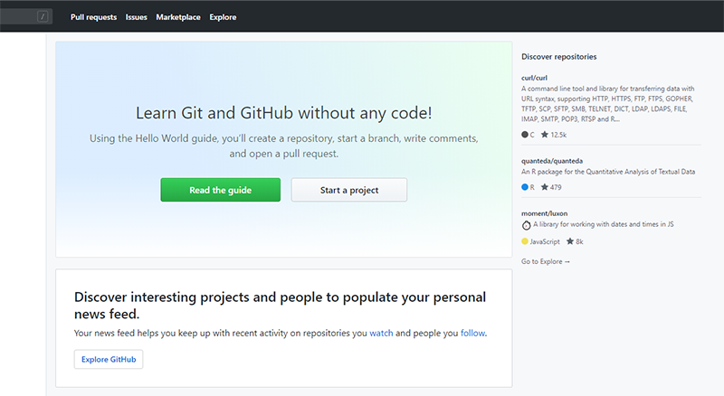
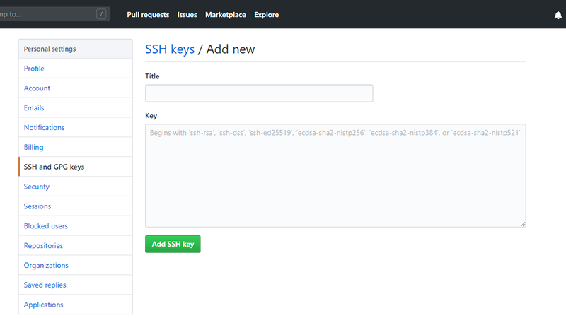

# Git

## 1 版本管理

#### 1.1 什么是版本管理

版本管理是一种记录文件变化的方式，以便将来查阅特定版本的文件内容。（比如记录每个文件的创建、修改等）


#### 1.2 人为维护文档版本就会出现问题

1. 文档数量多且命名不清晰导致文档版本混乱
2. 每次编辑文档需要复制，不方便
3. 多人同时编辑同一个文档，容易产生覆盖


## 2 Git 是什么

Git是一个版本管理控制系统（缩写VCS），它可以在任何时间点，将文档的状态作为更新记录保存起来，也可以在任何时间点，将更新记录恢复回来。


## 3 Git 安装

[下载地址](https://git-scm.com/downloads) 

在安装的过程中，所有选项使用默认值即可。

git --version

## 4 Git 基本工作流程

| git仓库          | 暂存区             | 工作目录            |
| ---------------- | ------------------ | ------------------- |
| 用于存放提交记录 | 临时存放被修改文件 | 被Git管理的项目目录 |


## 5 Git 的使用

### 1 Git 使用前配置

在使用 git 前，需要告诉 git 你是谁，在向 git 仓库中提交时需要用到。

1. 配置提交人姓名：`git config --global user.name 提交人姓名`
2. 配置提交人姓名：`git config --global user.email 提交人邮箱` 
3. 查看git配置信息：`git config --list`   

```sh
git config --global user.name joker
```


**注意**

1. 如果要对配置信息进行修改，重复上述命令即可。
2. 配置只需要执行一次。

### 2 提交步骤

1. `git init` 初始化git仓库
2. `git status` 查看文件状态
3. `git add 文件列表` 将文件添加到暂存中
4. `git commit -m 提交信息`  向仓库中提交代码
5. `git log` 查看提交记录

- 创建文件夹demo并新建一个index.html,终端打开


- git status


- git add index.html   这个文件就被git管理了
- git status


- git commit -m 第一次提交


- git log 


### 3 撤销

- 用暂存区中的文件覆盖工作目录中的文件： `git checkout 文件`
- 将文件从暂存区中删除： `git rm --cached 文件`
- 将 git 仓库中指定的更新记录恢复出来，并且覆盖暂存区和工作目录：`git reset --hard commitID` 


测试

- 新建1.html文件，里面随便来点内容
- Git add 1.html
- git status
- 在1.html中添加新的内容，想恢复成之前的
- git checkout 1.html
- git status文件还在暂存区中
- git rm --cached 1.html
- git status
- 恢复第一次提交的index.html 覆盖暂存区和工作目录
- Git log
- 复制id
- git reset --hard 84ed1083f6bc61e0905a95df23080beaaaeb9ad9

## 6 Git进阶

### 1 分支

为了便于理解，大家暂时可以认为分支就是当前工作目录中代码的一份副本。

使用分支，可以让我们从开发主线上分离出来，以免影响开发主线。


### 2 分支细分

1. 主分支（master）：第一次向 git 仓库中提交更新记录时自动产生的一个分支。

    

   

   

2. 开发分支（develop）：作为开发的分支，基于 master 分支创建。

    

   

3. 功能分支（feature）：作为开发具体功能的分支，基于开发分支创建

    

   

**功能分支 -> 开发分支 -> 主分支**

### 3 分支命令

- `git branch` 查看分支


- `git branch 分支名称` 创建分支


- `git checkout 分支名称` 切换分支


#### 在切换分支之前，当前分支上的工作，一定要提交到仓库中

比如，在dep分支上，新建一个文件2.html，添加到暂存区，之后不提交直接切换到主分支，发现该文件竟然在主分支上了


切换到dep 在提交,是看不到2.html的


在切换到dep分支上,可以看见2.html


- git merge 来源分支` 合并分支
  - 将开发分支合并到主分支-》开发分支被合并到主分支
  - 所以先切换到主分支
  - git merge dep


当前在主分支上，也能看到2.html

- `git branch -d 分支名称` 删除分支（分支被合并后才允许删除）（-D 强制删除）
  - 没有合并不能删除


- 新建test分支 git branch test
- Git checkout test
- 新建test.html
- git add test.html
- git commit -m test第一次提交
- Git checkout master
- git branch -d test报错
- git branch -D test(文件也删除了)

### 4 暂时保存更改

在git中，可以暂时提取分支上所有的改动并存储，让开发人员得到一个干净的工作副本，临时转向其他工作。

使用场景：分支临时切换

- 存储临时改动：`git stash`
- 恢复改动：`git stash pop`
- 流程
  - 创建分支git branch dep
  - Git checkout dep
  - 新建dep.html
  - Git add dep.html
  - git status
  - 如果此时切换分支，会被携带到其他分支上
  - 但有时我不想提交
  - Git stash 剪切到git提供的剪贴板中
  - git status,提示dep分支上没有可以提交的
  - 此时就可以切换分支了
  - git checkout master  没有dep.html文件
  - git checkout dep
  - Git stash pop文件又恢复回来了


# Github

在版本控制系统中，大约90%的操作都是在本地仓库中进行的：暂存，提交，查看状态或者历史记录等等。除此之外，如果仅仅只有你一个人在这个项目里工作，你永远没有机会需要设置一个远程仓库。

只有当你需要和你的开发团队共享数据时，设置一个远程仓库才有意义。你可以把它想象成一个 “文件管理服务器”，利用这个服务器可以与开发团队的其他成员进行数据交换。

### 注册

1. 访问[github](https://github.com/)首页，点击 Sign up 连接。（注册）

   

2. 填写用户名、邮箱地址、GitHub登陆密码

   

3. 选择计划

   

4. 填写 GitHub 问题

   

5. 验证邮箱

   

6. GitHub 个人中心

   


### 多人协作开发流程

- A在自己的计算机中创建本地仓库
- A在github中创建远程仓库
- A将本地仓库推送到远程仓库
- B克隆远程仓库到本地进行开发
- B将本地仓库中开发的内容推送到远程仓库
- A将远程仓库中的最新内容拉取到本地


### 测试

- 新建文件夹


- 进入到a-demo中创建本地仓库
- git init
- 创建index.html
- Git status
- Git add index.html
- git commit -m 程序员A第一次提交
- 创建远程仓库
- 修改git的全局配置文件

```js
git config --global user.name  "你在码云的用户名，就是项目创建的归属名"
git config --global user.email  "你注册码云用的邮箱账号"
```


1. 填写仓库基本信息

   

2. 将本地仓库推送到远程仓库

   

   1. git push 远程仓库地址 分支名称

      ```sh
      git push https://github.com/xxx/git-demo.git master
      ```

   2. 此时刷新页面，可以看见文件

   3. 每次推送地址比较麻烦，可以起个别名

   ```sh
   git remote add 别名(origin) https://github.com/xxx/git-demo.git
   ```

   1. 修改文件内容
   2. git add index.html
   3. git commit -m 程序员A第二次提交
   4. git push 远程仓库地址别名 分支名称

   ```sh
   git push origin master
   ```

   1. git push -u 远程仓库地址别名 分支名称

   -u 记住推送地址及分支，下次推送只需要输入git push即可

   1. git remote add 远程仓库地址别名 远程仓库地址

### 拉取操作

#### 克隆仓库

克隆远端数据仓库到本地：`git clone 仓库地址`

- 新建文件B

```sh
git clone https://github.com/xxxx/gitdemo.git
```

- 修改文件
- Git add index.html
- git commit - m 程序员B添加的
- Git push

#### 拉取远程仓库中最新的版本

拉取远程仓库中最新的版本：`git pull 远程仓库地址 分支名称`

- 如果远程仓库高于本地仓库版本，本地不允许提交，先拉取到本地在push

### 解决冲突

在多人同时开发一个项目时，如果两个人修改了同一个文件的同一个地方，就会发生冲突。冲突需要人为解决。

- 先pull在push

### ssh免登陆


生成秘钥：`ssh-keygen`

秘钥存储目录：C:\Users\用户\\.ssh

公钥名称：id_rsa.pub

私钥名称：id_rsa




pub里的内容复制到github

```sh
生成新的SSH Key
#ssh-keygen -t rsa -C "you_email"
your_email：这里填写你在GitLab或者GitHub注册时的邮箱。
后面的提示直接敲回车，一路完成。
查看SSH Key
# cat /Users/xxx/.ssh/id_rsa.pub

测试
ssh -T git@github.com

Enter passphrase for key '/Users/liujiang/.ssh/id_rsa': 
Hi Formolin! You've successfully 


因为用的是https而不是ssh。
可以更新一下origin
git remote remove origin
git remote add origin git@github.com:Username/Your_Repo_Name.git
```


### GIT忽略清单

将不需要被git管理（例如:node_modules）的文件名字添加到此文件中，在执行git命令的时候，git就会忽略这些文件。

git忽略清单文件名称：**.gitignore**

- 新建文件         .gitignore

```gitignore
node_modules
test     //不管理文件夹
test.html //不管理文件
```

将工作目录中的文件全部添加到暂存区：`git add .`

# 作业

- 安装git
- 由班长创建公有github仓库地址
- 其他同学下载该项目，并分别编写测试代码之后上传项目到github
- 在下载其他同学上传的项目并运行
- 重复上面步骤，提交项目到码云


多人开发共享一个仓库，先邀请到一个群里


push的时候报错 403

解决：

cd 到项目中，编辑 .git/cofig中的url
vim .git/config
将
[remote "origin"]
url = https://github.com/git的用户名/项目名称
的url改为
url = https://git的用户名@github.com/git的用户名/项目名称