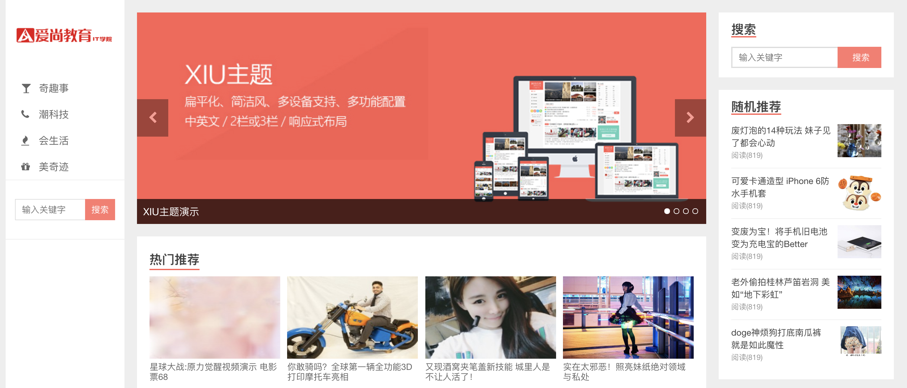
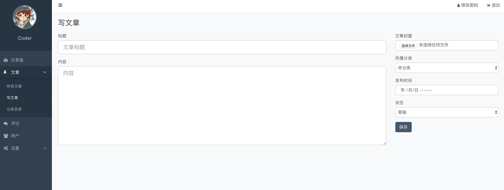
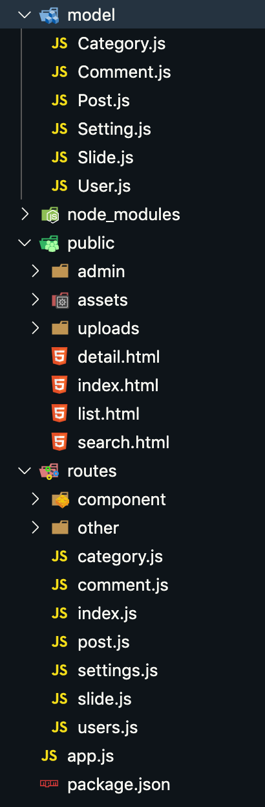
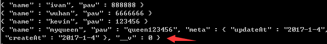
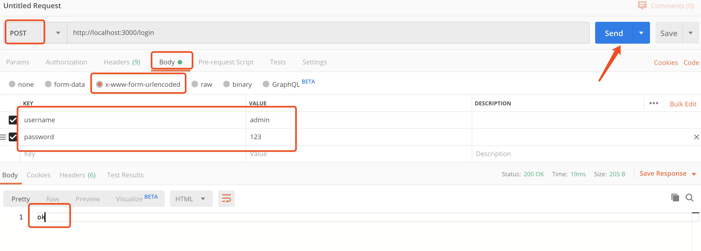

# 爱尚CMS管理系统

资讯管理系统，分为后台内容管理和前台内容展示两大核心功能。





## 1. 功能模块

#### 1.1 内容管理

| 模块     | 功能                           |
| -------- | ------------------------------ |
| 用户     | 登录、退出、用户增删改查       |
| 文章     | 文章管理                       |
| 分类     | 分类管理                       |
| 评论     | 评论管理                       |
| 网站设置 | 关键字、描述、网站logo、轮播图 |

#### 1.2 内容展示

| 模块   | 功能                           |
| ------ | ------------------------------ |
| 首页   | 导航、文章数据展示             |
| 列表页 | 根据分类显示文章列表           |
| 详情页 | 文章详情数据展示、实现评论功能 |

## 2. 开发模式

#### 2.1 前后端混合开发模式

所有HTML代码和数据在服务器端拼接好，一次性将所有内容发送到客户端，浏览器执行代码，将内容呈现给用户


问题：

1. 前后端开发人员对互相的代码都不是别熟悉，混合开发两者在处理互相的代码时非常困难
2. 在开发的过程中难免会出现代码互相覆盖，导致工作量倍增

#### 2.2 前后端分离开发模式


好处：职责、分工明确，独立开发，互不影响。


## 3. 项目架构

| 系统分层 | 使用技术                   |
| -------- | -------------------------- |
| 数据层   | mongoDB或mysql             |
| 服务层   | node.js (express)或java    |
| 客户端   | art-template、jQuery、Ajax |

## 4. 项目运行环境搭建

1. 启动mongodb，控制台输入mongod
2. mongodb-compass连接
3. 将public文件夹和package.json复制到项目中（服务器端程序）
4. 使用`npm install`命令安装项目所需依赖文件
5. 创建app.js，启动服务器
6. 开放静态资源 public文件夹
7. 在命令行工具中输入node app.js开启项目 

访问:localhost:3000,访问的是public下的index.html,访问其他<http://localhost:3000/list.html>

后台管理页面<http://localhost:3000/admin/index.html>

package.json

```json
{
  "name": "aishang",
  "version": "1.0.0",
  "description": "",
  "main": "app.js",
  "scripts": {
    "test": "echo \"Error: no test specified\" && exit 1"
  },
  "keywords": [],
  "author": "",
  "license": "ISC",
  "dependencies": {
    "body-parser": "^1.19.0",
    "express": "^4.16.4",
    "express-session": "^1.15.6",
    "mongoose": "^5.3.9",
    "mongoose-query-random": "^1.0.1",
    "mongoose-sex-page": "^1.2.4",
    "super-pagination": "^0.5.12"
  }
}

```

app.js

```js
// 引入express框架
const express = require('express');
// 引入数据库处理模块
const mongoose = require('mongoose');
// 引入路径处理模块
const path = require('path');
// web服务器
const app = express();
// 开放静态资源
app.use(express.static(path.join(__dirname, 'public')));
//http://localhost:3000/assets/img/logo.png
// 引入body-parser模块  cnpm install body-parser --save express接收post参数需要此插件
const bodyParser = require('body-parser');
// 创建 application/x-www-form-urlencoded 解析器 返回的对象是一个键值对  json格式
app.use(bodyParser.urlencoded({ extended: false }));
// 数据库连接
mongoose.connect('mongodb://localhost/cms')
    .then(() => console.log('数据库连接成功'))
    .catch(() => console.log('数据库连接失败'));

app.listen(3000, () => console.log('服务器启动成功'));
```

# 登录功能

<http://localhost:3000/admin/login.html>

1. 为登录按钮添加点击事件
2. 获取用户在文本框中输入的用户名和密码
3. 验证用户是否输入了用户名和密码，如果没有输入，阻止程序向下执行，提示用户输入用户名和密码
4. 调用实现登录功能的接口，登录成功，跳转到数据管理的首页，登录失败，提示用户名或密码错误
5. 创建路由模块，新建routes文件夹

app.js

```js
// 引入express框架
const express = require('express');
// 引入数据库处理模块
const mongoose = require('mongoose');
// 引入路径处理模块
const path = require('path');
// web服务器
const app = express();
// 开放静态资源
app.use(express.static(path.join(__dirname, 'public')));
//http://localhost:3000/assets/img/logo.png
// 引入body-parser模块  cnpm install body-parser --save express接收post参数需要此插件
const bodyParser = require('body-parser');
// 创建 application/x-www-form-urlencoded 解析器 返回的对象是一个键值对  
app.use(bodyParser.urlencoded({ extended: false }));
// 数据库连接
mongoose.connect('mongodb://localhost/cms',{ useNewUrlParser: true, useCreateIndex: true})
    .then(() => console.log('数据库连接成功'))
    .catch(() => console.log('数据库连接失败'));


// 添加路由模块，根据查找规则，找routes文件夹下的index.js
require('./routes')(app)

app.listen(3000, () => console.log('服务器启动成功'));
```

index.js(路由集合)



```js
// 路由集合
module.exports = app => {
	// 用户
	// 分类
	// 文章
	// 评论
	// 轮播图
	// 网站设置

	// 其他
	// 用户登录
	app.post('/login', require('./actions/other/login'));
	// 用户退出
	// 判断用户是否登录
	// 图片文件上传
};
```

用户登录需要连接数据库，创建用户模型(userSchema)

创建model文件夹，创建User.js

```js
// 数据库操作
const mongoose = require('mongoose');
// 模型规则类
const { Schema } = mongoose;

// 用户集合规则
const UserSchema = new Schema({
	// 昵称
	name: {
		type: String,
		required: true,
		minlength: 2,
		maxlength: 30
	},
	// 邮件
	email: {
		type: String,
		required: true,
		unique: true
	},
	// 密码
	password: {
		type: String,
		required: true
	},
	// 角色
	role: {
		type: String,
		// admin 超级管理员 normal 普通用户
		default: 'normal',
		enum: ['admin', 'normal']
	},
	// 头像
	avatar: {
		type: String,
		default: null
	},
	// 创建时间
	createTime: {
		type: Date,
		default: Date.now
	},
	// 状态
	status: {
		// 0 未激活 1 激活
		type: Number,
		required: true,
		default: 1
	}
}, {versionKey: false});

// 用户集合类
const User = mongoose.model('User', UserSchema);


// 导出对象
module.exports = {
	User
};
```

通过mongoose中的save方法保存记录时document文档默认最后会有一个字段"__v"，这个字段表示该文档是否是刚刚创建的，如果是则字段"__v"的值为0，如：

 

(通过命令行增加的文档不会有__v字段)

如果要禁用这个字段，可以在创建schema的时候设置versionKey为false

login.js

```js
const { User } = require('../../model/User');
module.exports = async (req, res) => {
    // 查找用户
    let user = await User.findOne({ name: req.body.username, password: req.body.password })
    console.log(user);
    // 如果用户不存在 响应
    if (!user) return res.status(400).end("用户名或者密码错误");
    // 响应
    res.end()
};
```

使用postman测试



Login.html

- http://localhost:3000/admin/login.html

```html
<!DOCTYPE html>
<html lang="zh-CN">

<head>
  <meta charset="utf-8">
  <title>Sign in &laquo; Admin</title>
  <link rel="stylesheet" href="../assets/vendors/bootstrap/css/bootstrap.css">
  <link rel="stylesheet" href="../assets/css/admin.css">
</head>

<body>
  <div class="login">
    <div class="login-wrap">
      
      <!-- 有错误信息时展示 -->
      <div class="alert alert-danger" style="display: none;">
        <strong>错误！</strong> 用户名或密码错误！
      </div>
      <div class="form-group">
        <label for="username" class="sr-only">用户名</label>
        <input id="username" type="text" class="form-control" placeholder="用户名" autofocus>
      </div>
      <div class="form-group">
        <label for="password" class="sr-only">密码</label>
        <input id="password" type="password" class="form-control" placeholder="密码">
      </div>
      <button class="btn btn-primary btn-block" id="loginBtn">登 录</button>
    </div>
  </div>
  <script src="../assets/vendors/jquery/jquery.min.js"></script>
  <script type="text/javascript">
    $('#loginBtn').on('click', function () {
      var username = $('#username').val()
      var password = $('#password').val()
      if (username.trim().length == 0 || password.trim().length == 0) {
        return;
      } else {
        $.ajax({
          url: '/login',
          type: 'post',
          data: {
            username: username,
            password: password
          },
          dataType: 'text',
          success: function (data) {
              // 登陆成功跳转
              location.href = "index.html"
          },
          error:function(e){
            console.log(e);
            $('.alert').css('display','block')
          }
        })
      }

    })
  </script>
</body>

</html>
```

# 登录拦截

1. session的配置
   - 类似于cookie，sessionStorage，但是他是保存在服务器内存
   - 默认30分钟
   - 验证是否登录，拦截，由服务器端判断用户登录状态
2. 登陆后将登陆信息保存到session中
3. 使用script标签加载服务器端提供的接口地址
4. 判断isLogin变量的值，如果值为false，跳转到登录页面

App.js

```js
// 引入express框架
const express = require('express');
// 引入数据库处理模块
const mongoose = require('mongoose');
// 引入路径处理模块
const path = require('path');
// web服务器
const app = express();
// 开放静态资源
app.use(express.static(path.join(__dirname, 'public')));
//http://localhost:3000/assets/img/logo.png
// 引入body-parser模块  cnpm install body-parser --save express接收post参数需要此插件
const bodyParser = require('body-parser');
//配置bodyParser
app.use(bodyParser.urlencoded({ extended: false }));


// 引入session模块
var session = require('express-session');
// 配置session
app.use(session({
	secret: 'this is a string key',//加密的字符串，里面内容可以随便写
	resave: false,//强制保存session,即使它没变化
	saveUninitialized: false //强制将未初始化的session存储，默认为true
}))


// 数据库连接
mongoose.connect('mongodb://localhost/cms',{ useNewUrlParser: true, useCreateIndex: true})
    .then(() => console.log('数据库连接成功'))
    .catch(() => console.log('数据库连接失败'));
// 添加路由模块，根据查找规则，找routes文件夹下的index.js
require('./routes')(app)

app.listen(3000, () => console.log('服务器启动成功'));
```

index.js

```js
// 路由集合
module.exports = app => {
	// 用户
	// 分类
	// 文章
	// 评论
	// 轮播图
	// 网站设置

	// 其他
	// 用户登录
	app.post('/login', require('./other/login'));
	// 用户退出
    // 判断用户是否登录
    app.get('/login/status', require('./other/loginStatus'));
	// 图片文件上传
};
```

login.js

```js
const { User } = require('../../model/User');
module.exports = async (req, res) => {
    // 查找用户
    let user = await User.findOne({ name: req.body.username, password: req.body.password })
    console.log(user);
    // 如果用户不存在 响应
    if (!user) return res.status(400).end("用户名或者密码错误");
    // 将用户信息存储在session中
	req.session.userInfo = user;
    // 响应
    res.send(user)
};

```

loginStatus.js

```js
module.exports =  (req, res) => {
	if (req.session.userInfo) {
		res.end(`var isLogin = true`)
	}else {
		res.end('var isLogin = false')
	}
};
```

index.html

```html
<!-- 非法登陆 -->
<script src="/login/status"></script>
<script>
  console.log(isLogin);
  if(!isLogin){
    location.href = "login.html"
  }
</script>


<!DOCTYPE html>
<html lang="zh-CN">
<head>
  <meta charset="utf-8">
  <title>Dashboard &laquo; Admin</title>
  <link rel="stylesheet" href="../assets/vendors/bootstrap/css/bootstrap.css">
  <link rel="stylesheet" href="../assets/vendors/font-awesome/css/font-awesome.css">
  <link rel="stylesheet" href="../assets/vendors/nprogress/nprogress.css">
  <link rel="stylesheet" href="../assets/css/admin.css">
  <script src="../assets/vendors/nprogress/nprogress.js"></script>
</head>
<body>
  <script>NProgress.start()</script>

  <div class="main">
    <nav class="navbar">
      <button class="btn btn-default navbar-btn fa fa-bars"></button>
      <ul class="nav navbar-nav navbar-right">
        <li><a href="password-reset.html"><i class="fa fa-user"></i>修改密码</a></li>
        <li><a href="login.html"><i class="fa fa-sign-out"></i>退出</a></li>
      </ul>
    </nav>
    <div class="container-fluid">
      <div class="jumbotron text-center">
        <h1>One Belt, One Road</h1>
        <p>Thoughts, stories and ideas.</p>
        <p><a class="btn btn-primary btn-lg" href="post-add.html" role="button">写文章</a></p>
      </div>
      <div class="row">
        <div class="col-md-4">
          <div class="panel panel-default">
            <div class="panel-heading">
              <h3 class="panel-title">站点内容统计：</h3>
            </div>
            <ul class="list-group">
              <li class="list-group-item"><strong>10</strong>篇文章（<strong>2</strong>篇草稿）</li>
              <li class="list-group-item"><strong>6</strong>个分类</li>
              <li class="list-group-item"><strong>5</strong>条评论（<strong>1</strong>条待审核）</li>
            </ul>
          </div>
        </div>
        <div class="col-md-4"></div>
        <div class="col-md-4"></div>
      </div>
    </div>
  </div>

  <div class="aside">
    <div class="profile">
      
      <h3 class="name">Coder</h3>
    </div>
    <ul class="nav">
      <li class="active">
        <a href="index.html"><i class="fa fa-dashboard"></i>仪表盘</a>
      </li>
      <li>
        <a href="#menu-posts" class="collapsed" data-toggle="collapse">
          <i class="fa fa-thumb-tack"></i>文章<i class="fa fa-angle-right"></i>
        </a>
        <ul id="menu-posts" class="collapse">
          <li><a href="posts.html">所有文章</a></li>
          <li><a href="post-add.html">写文章</a></li>
          <li><a href="categories.html">分类目录</a></li>
        </ul>
      </li>
      <li>
        <a href="comments.html"><i class="fa fa-comments"></i>评论</a>
      </li>
      <li>
        <a href="users.html"><i class="fa fa-users"></i>用户</a>
      </li>
      <li>
        <a href="#menu-settings" class="collapsed" data-toggle="collapse">
          <i class="fa fa-cogs"></i>设置<i class="fa fa-angle-right"></i>
        </a>
        <ul id="menu-settings" class="collapse">
          <li><a href="slides.html">图片轮播</a></li>
          <li><a href="settings.html">网站设置</a></li>
        </ul>
      </li>
    </ul>
  </div>

  <script src="../assets/vendors/jquery/jquery.js"></script>
  <script src="../assets/vendors/bootstrap/js/bootstrap.js"></script>
  <script>NProgress.done()</script>
</body>
</html>

```

# 退出

- 绑定退出按钮事件
- 退出时清空session，跳转到到login页

```html
<!-- index.html -->
<script>
    $('#logout').on('click', function () {
        $.ajax({
            type: "post",
            url: "/login/logout",
            dataType: "text",
            success: function (response) {
                location.href = "login.html"
            }
        });
    })
</script>
```

index.js

```js
// 路由集合
module.exports = app => {
	// 用户
	// 分类
	// 文章
	// 评论
	// 轮播图
	// 网站设置

	// 其他
	// 用户登录
	app.post('/login', require('./other/login'));
    // 用户退出
    app.post('/logout', require('./other/logout'));
    // 判断用户是否登录
    app.get('/login/status', require('./other/loginStatus'));
	// 图片文件上传
};
```

logout.js

```js
module.exports = (req, res) => {
	req.session.destroy(err => {
		if (err == null) {
			res.end('退出成功');
		}else {
			res.end('退出失败');
		}
	});
};
```

# 添加用户(users.html)

1. 为添加用户功能的每一个表单项添加name属性
2. 为表单绑定提交事件，在事件处理函数中阻止表单默认提交的行为
3. 在事件处理函数中获取到用户在表单中输入的内容
4. 调用添加用户接口，将获取到的内容通过接口发送给服务器端，操作成功刷新页面，操作失败给出用户提示

- 在assets/js文件夹下新建users.js文件,index.html引入users.js

```html
  <!-- 引入users.js -->
  <script src="../assets/js/users.js"></script>
```

users.js

```js
$('#userForm').on('submit',function(){
    // 获取表单里的所有参数,转成字符串
    var data = $(this).serialize()
    console.log(data);
    $.ajax({
        type: "post",
        url: "/users/adduser",
        data: data,
        dataType:'json',
        success: function (resp) {
            console.log(resp);
            // 刷新页面
            location.reload()
        },
        error:function(){
            alert('用户添加失败')
        }
    });
    return false;
}) 
```

后台接口

index.js

```js
// 路由集合
module.exports = app => {
    // 用户
    app.use('/users', require('./users'));
	// 分类
	// 文章
	// 评论
	// 轮播图
	// 网站设置

	// 其他
	// 用户登录
	app.post('/login', require('./other/login'));
    // 用户退出
    app.post('/logout', require('./other/logout'));
    // 判断用户是否登录
    app.get('/login/status', require('./other/loginStatus'));
	// 图片文件上传
};
```

users.js

```js
// 用户路由
const user = require('express').Router();

// 添加用户
user.post('/adduser', require('./component/user/adduser'));
// 查询所有用户信息
// 登录用户密码修改
// 根据id删除用户信息
// 根据id修改用户信息
// 根据用户id查询用户信息

// 导出路由
module.exports = user;
```

adduser.js

```js
const { User } = require('../../../model/User');
module.exports =  (req, res) => {
    console.log('adduser');
	res.end()
};
```

添加用户逻辑

```js
const { User } = require('../../../model/User');
module.exports = async (req, res) => {
    // console.log('adduser');
    let user = await User.findOne({ name: req.body.name });
    // 用户已存在
    if (user) return res.status(400).json({ message: '用户已存在' });
    // 用户不存在 可以正常执行注册流程
    // 创建用户
    //console.log(req.body);//{ email: 'adf@adsfa.com', name: 'adf', password: 'adf' }
    user = new User(req.body);
    // 保存用户
    await user.save((err, result) => {
        if (err) return res.status(400).json('mongoose验证，添加失败');
        res.json(result)
    });

};
```


# 作业

- 添加前后端验证，并在页面显示提示信息


