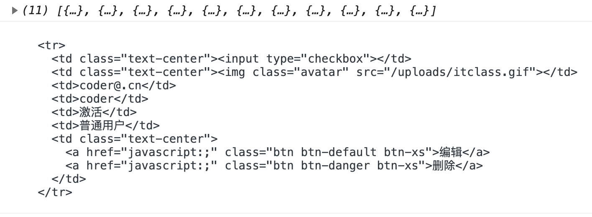
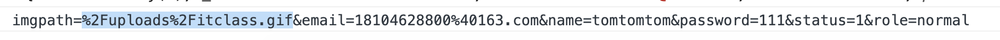

# 用户头像上传

1. 为文件选择控件添加onchange事件，在事件处理函数中获取到用户选择到的文件
2. 创建formData对象用于实现图片文件上传
3. 调用图片文件上传接口，实现图片上传
4. 在添加新用户表单中新增一个隐藏域，将图片地址存储在隐藏域中

### users.html

```html
<h2>添加新用户</h2>
<div class="form-group">
    <label>头像</label>
    <div class="form-group">
        <label class="form-image">
            <input id="avatar" type="file">
            
            <i class="mask fa fa-upload"></i>
        </label>
        <input type="hidden" name="avatar" id="hiddenAvatar">
    </div>
</div>
```

### assets/js/user.js

```js
// 头像上传
$('#avatar').on('change',function(){
    console.log(this.files[0]);//获取的是一个列表
    // 二进制文件上传
    var formData = new FormData()
    formData.append('img',this.files[0])
    $.ajax({
        type: "post",
        url: "/upload",
        data: formData,
        processData:false,
        contentType:false,
        success: function (response) {
            console.log(response);
            //得到是空，需要插件
        }
    });
})
```

##### processData：处理数据

默认情况下，processData 的值是 true，其代表以对象的形式上传的数据都会被转换为字符串的形式上传。而当上传文件的时候，则不需要把其转换为字符串，因此要改成false

##### contentType：发送数据的格式

和 contentType 有个类似的属性是 dataType ， 代表的是期望从后端收到的数据的格式，一般会有 json 、text……等
而 contentType 则是与 dataType 相对应的，其代表的是 前端发送数据的格式

默认值：application/x-www-form-urlencoded
代表的是 ajax 的 data 是以字符串的形式 如 id=2019&password=123456
使用这种传数据的格式，无法传输复杂的数据，比如多维数组、文件等

有时候要注意，自己所传输的数据格式和ajax的contentType格式是否一致，如果不一致就要想办法对数据进行转换
把contentType 改成 false 就会改掉之前默认的数据格式，在上传文件时就不会报错了。

### 后台接口

#### index.js

```js
// 路由集合
module.exports = app => {
    // 用户
    app.use('/users', require('./users'));
	// 分类
	// 文章
	// 评论
	// 轮播图
	// 网站设置

	// 其他
	// 用户登录
	app.post('/login', require('./other/login'));
    // 用户退出
    app.post('/logout', require('./other/logout'));
    // 判断用户是否登录
    app.get('/login/status', require('./other/loginStatus'));
	// 图片文件上传
	app.post('/upload', require('./other/upload'));
};
```

### 安装文件上传插件

```sh
cnpm i multiparty
```

#### other/upload.js

```js
module.exports = (req, res) => {
    var multiparty = require('multiparty')
    const path = require('path');
    const fs = require('fs');
    let form = new multiparty.Form();
    // 设置图片上传的路径 默认为当前用户下的temp文件夹
    // console.log(path.join());// 当前目录  .
    // console.log(path.resolve());//项目根目录
    // console.log(path.resolve(__dirname,'../../public/uploads'));
    form.uploadDir = path.join(__dirname, '../../public/uploads');
    // //设置单文件大小限制
    form.maxFilesSize = 2 * 1024 * 1024;
    // form.maxFields = 1000;  设置所有文件的大小总和


    form.parse(req, function (err, fields, files) {
        //  files即为上传图片的信息
        if (err) {
            console.log(err);
            res.send("上传失败");
            return;
        }
        console.log(files);
        var file  = files.img[0]
        // console.log(files.img[0].originalFilename);//上传的文件名 1.gif
        // path: '/public/uploads/WVNHwOwAP6RG30FkhuygbuOT.gif',
        var newPath = file.path.split('public')[1]//   /uploads/WVNHwOwAP6RG30FkhuygbuOT.gif
        res.send({ avatar: newPath })//请求http://localhost:3000/uploads/WVNHwOwAP6RG30FkhuygbuOT.gif
    });
};
```

### res.send和res.end区别

res.end只能支持两种参数，要么字符串，要么Buffer
res.send可以支持多种参数,比如可以传json对象,Buffer,String,Array

The body parameter can be a Buffer object, a String, an object, or an Array. For example:

res.send()参数可传可不传
res.send()内部自动帮发送更过的相应报文头,比如其中的Content-Type为UTF-8

### users.js

```js
// 头像上传
$('#avatar').on('change', function () {
    //  二进制文件上传
    var formData = new FormData()
    formData.append('img', this.files[0])
    $.ajax({
        type: "post",
        url: "/upload",
        data: formData,
        processData: false,
        contentType: false,
        success: function (response) {
            console.log(response);
            //图片回显，数据赋值到隐藏表单，保存到数据库
            $('#preview').attr('src',response.avatar)
            $('#hiddenAvatar').val(response.avatar)
        }
    });
})
```

- 隐藏表单，因为需要把地址再次传到服务器端

```html
<div class="form-group">
    <label class="form-image">
        <input id="avatar" type="file">
        
        <i class="mask fa fa-upload"></i>
    </label>
    <input type="hidden" name="avatar" id="hiddenAvatar">
</div>
```

- 注意 隐藏表单的name需要和userSchema匹配上

- 提交表单后，查看数据库

# 获取用户列表

### 1、向服务器端发送Ajax请求，索要用户列表数据

users.js

```js
// 向服务器端发送请求 索要用户列表数据
$.ajax({
	type: 'get',
	url: '/users',
	success: function (response) {
		console.log(response)
	}
});
```

routes/users.js

```js
// 用户路由
const user = require('express').Router();
// 添加用户
user.post('/adduser', require('./component/user/adduser'));
// 查询所有用户信息
user.get('/', require('./component/user/userList'));
// 登录用户密码修改
// 根据id删除用户信息
// 根据id修改用户信息
// 根据用户id查询用户信息

// 导出路由
module.exports = user;
```

component/user/userList.js

```js
// 用户模块
const { User } = require('../../../model/User');

module.exports = async (req, res) => {
	// 查询用户信息
	const users = await User.find();
	// 响应
	res.send(users);
}
```

### 2、使用模板引擎将数据和html模板进行拼接

users.html

```html
<script src="../assets/vendors/art-template/template-web.js"></script>
<script type="text/html" id="userListTemp"></script>
```

定义模板

```js
// 向服务器端发送请求 索要用户列表数据
$.ajax({
	type: 'get',
	url: '/users',
	success: function (response) {
		console.log(response)
		// 使用模板引擎将数据和HTML字符串进行拼接
		var html = template('userListTemp', { data: response });
        console.log(html);
		
	}
});
```



### 3、将拼接好的内容展示在页面中

```js
<script type="text/html" id="userListTemp">
    <tr>
        <td class="text-center"><input type="checkbox"></td>
        <td class="text-center"></td>
        <td>coder@.cn</td>
        <td>coder</td>
        <td>激活</td>
        <td>普通用户</td>
        <td class="text-center">
            <a href="javascript:;" class="btn btn-default btn-xs">编辑</a>
        <a href="javascript:;" class="btn btn-danger btn-xs">删除</a>
    	</td>
    </tr>
</script>
```

```js
$.ajax({
    url: "/userList",
    success: function (response) {
        console.log(response);
        var html = template('userListTemp',{data:response})
        // 将拼接好的字符串显示在页面中
		$('#userBox').html(html);
    }
});
```

遍历：

```html
<script src="../assets/vendors/art-template/template-web.js"></script>
<script type="text/html" id="userListTemp">
    {{each data}}
    <tr>
      <td class="text-center"><input type="checkbox"></td>
      {{if $value.avatar}}
      <td class="text-center"></td>
      {{else}}
      <td class="text-center"></td>
      {{/if}}
      <td>{{$value.email}}</td>
      <td>{{$value.name}}</td>
      <td>{{$value.status==0?'未激活':'激活'}}</td>
      <td>{{$value.role=='admin'?'管理员':'普通用户'}}</td>
      <td class="text-center">
        <a href="javascript:;" class="btn btn-default btn-xs">编辑</a>
        <a href="javascript:;" class="btn btn-danger btn-xs">删除</a>
    </td>
    </tr>
    {{/each}}
</script>

<table class="table table-striped table-bordered table-hover">
    <thead>
        <tr>
            <th class="text-center" width="40"><input type="checkbox"></th>
            <th class="text-center" width="80">头像</th>
            <th>邮箱</th>
            <th>昵称</th>
            <th>状态</th>
            <th>角色</th>
            <th class="text-center" width="100">操作</th>
        </tr>
    </thead>
    <tbody id="userbox">

    </tbody>
</table>
```

# 用户信息修改

由于列表数据是通过ajax请求到客户端后显示到页面中，由于是异步的，我们不能确定结果什么时候返回，所以不能获取到编辑按钮并添加点击事件，所以需要事件委托，将事件添加到元素的父级身上，让元素的父级（tbody）触发事件，因为元素的父级，不是通过异步渲染的，一直在页面当中，所以可以直接获取。

### 1、通过事件委托的形式为编辑按钮点击添加事件,添加样式名edit和id

```html
<a href="javascript:;" class="btn btn-default btn-xs edit" data-id="{{$value._id}}">编辑</a>
```

### 2、在事件处理函数中获取到当前点击用户的id值

```js
// 通过事件委托的形式为编辑按钮点击添加事件
$('#userBox').on('click','.edit',function(){
    var id = $(this).attr('data-id')
    $.ajax({
        type: "get",
        url: "/users/"+id,
        success: function (response) {
            console.log(response);
            var html = template('editUser',response)
            $('#modifyBox').html(html)
        }
    });
})
```

```html
<script type="text/html" id="editUser"></script>
```

### 3、根据用户id获取用户的详细信息，并且通过模板引擎将用户的详细信息渲染到左侧的表单中

routes/users.js

```js
// 用户路由
const user = require('express').Router();
// 添加用户
user.post('/adduser', require('./component/user/adduser'));
// 查询所有用户信息
user.get('/', require('./component/user/userList'));
// 登录用户密码修改
// 根据id删除用户信息
// 根据id修改用户信息
// 根据用户id查询用户信息
user.get('/:id', require('./component/user/findUserById'));
// 导出路由
module.exports = user;
```

component/user/findUserById.js

```js
// 用户模块
const { User } = require('../../../model/User');
module.exports = async (req, res) => {
	// 查询用户信息
	const user = await User.findOne({_id:req.params.id})
	// 响应
	res.send(user);
}
```

### 4、复制添加用户的form表单，id改为editForm，放到模板里

```html
  <!-- 修改用户模板 -->
  <script type="text/html" id="editUser">
    <form id="editForm">
      <h2>修改用户</h2>
      <div class="form-group">
        <label>头像</label>
        <div class="form-group">
          <label class="form-image">
            <input id="avatar" type="file">
            
            <i class="mask fa fa-upload"></i>
          </label>
          <input type="hidden" name="avatar" id="hiddenAvatar">
        </div>
      </div>
      <div class="form-group">
        <label>邮箱</label>
        <input class="form-control" type="email" placeholder="请输入邮箱" name="email">
      </div>
      <div class="form-group">
        <label>昵称</label>
        <input class="form-control" type="text" placeholder="请输入昵称" name="name">
      </div>
      <div class="form-group">
        <label>密码</label>
        <input class="form-control" type="text" placeholder="请输入密码" name="password">
      </div>
      <div class="form-group">
        <div class="radio-inline">
          <label><input type="radio" name="status" value="0">未激活</label>
        </div>
        <div class="radio-inline">
          <label><input type="radio" name="status" value="1">激活</label>
        </div>
      </div>
      <div class="form-group">
        <div class="radio-inline">
          <label><input type="radio" name="role" value="admin">超级管理员</label>
        </div>
        <div class="radio-inline">
          <label><input type="radio" name="role" value="normal">普通用户</label>
        </div>
      </div>
      <div class="form-group">
        <button class="btn btn-primary" type="submit">修改</button>
      </div>
    </form>
  </script>
```

回显数据

```html
<script type="text/html" id="editUser">
    <form id="editForm">
      <h2>修改用户</h2>
      <div class="form-group">
        <label>头像</label>
        <div class="form-group">
          <label class="form-image">
            <input id="avatar" type="file">
            {{if avatar}}
            
            {{else}}
            
            {{/if}}
            <i class="mask fa fa-upload"></i>
          </label>
          <input type="hidden" name="avatar" value='{{avatar}}' id="hiddenAvatar">
        </div>
      </div>
      <div class="form-group">
        <label>邮箱</label>
        <input class="form-control" type="email" placeholder="请输入邮箱" name="email" value={{email}}>
      </div>
      <div class="form-group">
        <label>昵称</label>
        <input class="form-control" type="text" placeholder="请输入昵称" name="name" value={{name}}>
      </div>
      <div class="form-group">
        <label>密码</label>
        <input class="form-control" type="text" placeholder="请输入密码" name="password" value={{password}}>
      </div>
      <div class="form-group">
        <div class="radio-inline">
          <label><input type="radio" name="status" value="0" {{status==0?'checked':''}}>未激活</label>
        </div>
        <div class="radio-inline">
          <label><input type="radio" name="status" value="1" {{status==1?'checked':''}}>激活</label>
        </div>
      </div>
      <div class="form-group">
        <div class="radio-inline">
          <label><input type="radio" name="role" value="admin" {{role=='admin'?'checked':''}}>超级管理员</label>
        </div>
        <div class="radio-inline">
          <label><input type="radio" name="role" value="normal" {{role=='normal'?'checked':''}}>普通用户</label>
        </div>
      </div>
      <div class="form-group">
        <button class="btn btn-primary" type="submit">修改</button>
      </div>
    </form>
  </script>
```

### 5、为修改按钮添加点击事件，在事件处理函数中获取到用户在表单中输入的内容，调用修改用户信息接口实现用户信息修改功能。

```js
// 修改提交
$('#modifyBox').on('submit','#editForm',function(){
    var formData = $(this).serialize()
    console.log(formData);
    return false
})
```



routes/users.js

```js
// 用户路由
const user = require('express').Router();
// 添加用户
user.post('/adduser', require('./component/user/adduser'));
// 查询所有用户信息
user.get('/', require('./component/user/userList'));
// 登录用户密码修改
// 根据id删除用户信息
// 根据id修改用户信息
user.put('/:id', require('./component/user/findByIdAndUpdate'));
// 根据用户id查询用户信息
user.get('/:id', require('./component/user/findUserById'));
// 导出路由
module.exports = user;
```

findByIdAndUpdate.js

```js
// 用户模块
const { User } = require('../../../model/User');

module.exports = async (req, res) => {
    // console.log(req.params.id);
    // console.log(req.body);
	// 验证
	// 更新用户信息
    let user = await User.updateOne({_id:req.params.id}, req.body);//{ n: 1, nModified: 1, ok: 1 }
	// 响应
	res.send(user);	
};
```

在表单上添加id属性

```html
 <form id="editForm" data-id='{{_id}}'>
```

```js
// 修改提交
$('#modifyBox').on('submit', '#editForm', function () {
    var formData = $(this).serialize()
    // 获取要修改的那个用户的id值
	var id = $(this).attr('data-id');
    $.ajax({
        type: "put",
        url: "/users/" + id,
        data: formData,
        success: function (response) {
            location.reload()
        }
    });
    return false
})
```

修改：头像上传

```js
// 修改：头像上传
$('#modifyBox').on('change','#avatar', function () {
    //  二进制文件上传
    var formData = new FormData()
    formData.append('img', this.files[0])
    $.ajax({
        type: "post",
        url: "/upload",
        data: formData,
        processData: false,
        contentType: false,
        success: function (response) {
            $('#preview').attr('src', response.avatar)
            $('#hiddenAvatar').val(response.avatar)
        }
    });
})
```

# 删除用户

### 1、为删除按钮添加点击事件(del)

```js
<a href="javascript:;" class="btn btn-danger btn-xs del" data-id="{{$value._id}}">删除</a>
```

```js
user.delete('/:id', require('./component/user/findByIdAndDelete'));
```

### 2、确认用户是否要进行删除操作

### 3、获取到当前被点击用户的id

### 4、调用删除用户接口根据id删除用户，如果删除成功，刷新当前页面，让页面显示最新的内容

```js
// 删除
$('#userBox').on('click','.del', function () {
    if(confirm('是否删除？')){
     var id = $(this).attr('data-id')
     $.ajax({
         type: "delete",
         url: "/users/"+id,
         success: function (response) {
             location.reload()
         }
     });
    }
 })
```

### 5、判断该用户是否上传过图像，如果有删除

```js
// 用户模块
const { User } = require('../../../model/User');
// 文件模块
const fs = require('fs');
// 路径处理
const path = require('path');
// 方法改造
const { promisify } = require('util');
// 删除文件  转换成Promise
const unlink = promisify(fs.unlink);

module.exports = async (req, res) => {
    // 获取用户id
    const id = req.params.id;
    // 删除用户
    let user = await User.findOneAndDelete({ _id: id })
    // 返回删除的对象
    console.log(user);
    // 判断该用户是否上传过图像，如果有删除
    if (user.avatar) {
        // 删除缩略图 fs.unlink（path）  文件的路径
        await unlink(path.join(__dirname, '../', '../', '../', 'public', user.avatar));
    }
    // 响应
    res.send(user);
};
```


# 批量删除用户

### 1、管理批量删除按钮的状态

- 当全选按钮被选中时，显示批量删除按钮，当全选按钮被取消选中时，隐藏批量删除按钮

```html
<thead>
    <tr>
        <th class="text-center" width="40">
            <input type="checkbox" id="selectAll"></th>
        <th class="text-center" width="80">头像</th>
        <th>邮箱</th>
        <th>昵称</th>
        <th>状态</th>
        <th>角色</th>
        <th class="text-center" width="100">操作</th>
    </tr>
</thead>
```

```html
 <a class="btn btn-danger btn-sm" href="javascript:;" style="display: none" id='delbatch'>批量删除</a>
```

```js
// 批量删除
$('#selectAll').on('click',function(){
    var state = $(this).prop('checked')
    if(state){
        // 显示批量删除按钮
        $('#delbatch').show()
    }else{
        // 隐藏批量删除按钮
        $('#delbatch').hide()
    }
    // 在tbody下找input，
    $('#userBox').find('input').prop('checked',state)
})
```

- 当用户前面的复选框按钮状态改变时，检查所有用户的选中状态，如果有用户被选中，显示批量删除按钮，如果所有用户都没有处于选中状态，隐藏批量删除按钮

```html
<td class="text-center"><input type="checkbox" class="userStatus" data-id="{{$value._id}}"></td>
```

```js
// 当用户前面的复选框状态发生改变时
$('#userBox').on('change', '.userStatus', function () {
	// 获取到选中的用户 
	// 判断选中用户的数量和所有用户的数量是否一致
	// 如果一致 就说明所有的用户都是选中的
	// 否则 就是有用户没有被选中
	var inputs = $('#userBox').find('input');

	if (inputs.length == inputs.filter(':checked').length) {
		// alert('所有用户都是选中的')
		$('#selectAll').prop('checked', true)
	}else {
		// alert('不是所有用户都是选中的')
		$('#selectAll').prop('checked', false)
	}

	// 如果选中的复选框的数量大于0 就说明有选中的复选框
	if (inputs.filter(':checked').length > 0) {
		// 显示批量删除按钮
		$('#delbatch').show();
	}else {
		// 隐藏批量删除按钮
		$('#delbatch').hide();
	}
});
```

### 2、实现批量删除用户功能

- 批量删除按钮添加点击事件，在点击事件处理函数中，将所有被选中的用户id执行存储在一个数组中调用删除用户接口，实现删除用户功能

```js
//  批量删除
$('#delbatch').on('click',function(){
    var ids = []
    var lis = $('#userBox').find('input').filter(':checked')
    lis.each(function(index,item){
       ids.push($(item).attr('data-id'))
    })
    if(confirm('是否删除？')){
        $.ajax({
            type: "delete",
            url: "/users/"+ids.join('-'),
            success: function (response) {
                location.reload()
            }
        });
    }
})
```

改造之前删除的接口

```js
// 用户模块
const { User } = require('../../../model/User');
// 文件模块
const fs = require('fs');
// 路径处理
const path = require('path');
// 方法改造
const { promisify } = require('util');
// 删除文件  转换成Promise
const unlink = promisify(fs.unlink);

module.exports = async (req, res) => {
    // 判断是单个删除还是批量删除
    // 如果传过来的id有 -  就是批量删除
    // 获取用户id
    const id = req.params.id;
    if (id.indexOf('-') != -1) {
        // 批量删除
        // 将字符串id分割为数组
        const ids = id.split('-');
        for (const item of ids) {
            // 删除用户
            let user = await User.findOneAndDelete({ _id: item });
            // 如果缩略图存在
            if (user.avatar) {
                // 删除缩略图
                await unlink(path.join(__dirname, '../', '../', '../', 'public', user.avatar));
            }
        }
        //或者User.deleteMany({ _id: { $in: ['aID', 'bID'] } }).then(result => console.log(result))
        res.send();
    } else {
        // 单个删除
        // 删除用户
        let user = await User.findOneAndDelete({ _id: id })
        // 返回删除的对象
        console.log(user);
        // 判断该用户是否上传过图像，如果有删除
        if (user.avatar) {
            // 删除缩略图 fs.unlink（path）  文件的路径
            await unlink(path.join(__dirname, '../', '../', '../', 'public', user.avatar));
        }
        // 响应
        res.send(user);
    }


};
```

# 作业

- 修改功能的前后端验证，错误信息回显
- 删除不能删除当前登录账户
- 项目上传至码云


multer图片上传插件

```js
module.exports = (req, res) => {
   
const fs=require('fs');
const path=require('path');

    //读取文件路径
    fs.readFile(req.file.path,(err,data)=>{
        //如果读取失败
    if(err){return res.send('上传失败')}
    //如果读取成功
    //声明图片名字为时间戳和随机数拼接成的，尽量确保唯一性
    let time=Date.now()+parseInt(Math.random()*999)+parseInt(Math.random()*2222);
    //拓展名

    let extname=req.file.mimetype.split('/')[1]
    //拼接成图片名
    let pa=req.file.path.split('\\')[1];
    console.log(pa)
    
    let keepname=time+'.'+extname
    let keep=pa+'.'+extname
    //三个参数
    //1.图片的绝对路径
    //2.写入的内容
    //3.回调函数
    fs.writeFile(path.join(__dirname,'../public/'+'uploads/'+ keepname),data,(err)=>{
        let str='/uploads/'+ keepname
        if(err){return res.send('写入失败')}
        res.send({err:str})
    });

 });
}
```

```js
var multer=require(‘multer’);
//生成的图片放入uploads文件夹下
var upload=multer({dest:’./tt/‘})

user.post(‘/upload’,upload.single(‘img’), require(‘./upload.js’));
```

<https://blog.csdn.net/qq1036548849/article/details/85246939>formidable实现文件上传