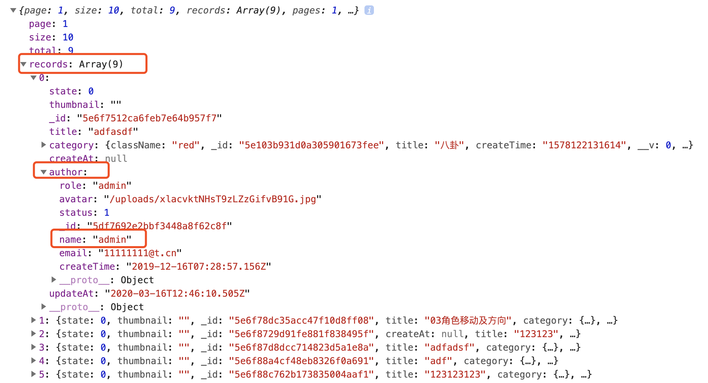

# 文章列表数据展示

1. 在页面一上来的时候向服务器端发送请求索要文章列表数据
2. 通过模板引擎将文章列表数据和HTML进行拼接，拼接完成以后将内容显示在页面中
3. 根据分页数据实现列表数据分页功能

```html
  <script src="../assets/vendors/art-template/template-web.js"></script>
  <script src="../assets/js/newsList.js"></script>
```

```js
// 向服务器端发送请求 获取文章列表数据
$.ajax({
	type: 'get',
	url: '/posts',
	success: function (response) {
		var html = template('postsTpl', response);
		$('#postsBox').html(html);
	}
});

```

```js
// 路由集合
module.exports = app => {
    // 用户
    app.use('/users', require('./users'));
	// 分类
	app.use('/categories', require('./category'));
	// 文章
	app.use('/posts', require('./post'));
	// 评论
	// 轮播图
	// 网站设置

	// 其他
	// 用户登录
	app.post('/login', require('./other/login'));
    // 用户退出
    app.post('/logout', require('./other/logout'));
    // 判断用户是否登录
    app.get('/login/status', require('./other/loginStatus'));
	// 图片文件上传
	app.post('/upload', require('./other/upload'));
};
```

```js
const post = require('express').Router();
// 添加文章信息
// 根据ID删除文章
// 查询所有文章
post.get('/', require('./component/post/find'));
// 查询文章数量
// 获取最新发布文章(按照发布时间排序)
// 获取热门推荐(按钮评论数量排序)
// 获取随机推荐
// 文章点赞
// 根据分类获取文章列表
// 文章搜索
// 根据文章id获取文章信息
// 根据ID修改文章
module.exports = post;
```

```js
// 数据库操作
const mongoose = require('mongoose');
// 模型规则类
const { Schema } = mongoose;

// 文章模型规则
const PostSchema = new Schema({
	// 标题
	title: {
		type: String,
		minlength: 2,
		maxlength: 100,
		required: [true, '请输入文章标题']
	},
	// 作者
	author: {
		type: mongoose.Schema.Types.ObjectId,//对象ID
		ref: 'User',
		required: true
	},
	// 状态
	state: {
		type: Number,
		// 0 草稿 1 发布
		default: 0
	},
	// 创建时间
	createAt: {
		type: Date,
		default: Date.now
	},
	// 修改时间
	updateAt: {
		type: Date,
		default: Date.now
	},
	// 内容
	content: {
		type: String,
		default: null
	},
	// 缩略图
	thumbnail: {
		type: String,
		default: null
	},
	// 所属分类
	category: {
		type: mongoose.Schema.Types.ObjectId,
		ref: 'Category',
		required: [true, '分类信息不存在']
	},
	meta: {
		// 看过数量
		views: { type: Number, default: 0 },
		// 喜欢数量
		likes: { type: Number, default: 0 },
		// 评论数量
		comments: { type: Number, default: 0 }
	}
}, {versionKey: false});

const Post = mongoose.model('Post', PostSchema);

// 时间更新->这方法是在修改(findOneAndUpdate)数据库前调用
PostSchema.pre('findOneAndUpdate', function(next) {
	this.findOneAndUpdate({}, { updateAt: Date.now() })
	next();
});


// 导出模块成员
module.exports = {
	Post
};
```

```js
const { Post } = require('../../../model/Post');
module.exports = async (req, res) => {
	// 查询
	const posts = await Post.find();
	// 响应
	res.send(posts);
}
```

```html
 <script type="text/html" id="postsTpl">
    {{each data}}
    <tr>
      <td>{{$value.title}}</td>
      <td>小小</td>
      <td>{{$value.category}}</td>
      <td class="text-center">{{$imports.formateDate($value.createAt)}}</td>
      <td class="text-center">{{$value.state==0?'草稿':'已发布'}}</td>
      <td class="text-center">
        <a href="javascript:;" class="btn btn-default btn-xs">编辑</a>
        <a href="javascript:;" class="btn btn-danger btn-xs">删除</a>
      </td>
    </tr>
    {{/each}}
  </script>

      <table class="table table-striped table-bordered table-hover">
        <thead>
          <tr>
            <th>标题</th>
            <th>作者</th>
            <th>分类</th>
            <th class="text-center">发表时间</th>
            <th class="text-center">状态</th>
            <th class="text-center" width="100">操作</th>
          </tr>
        </thead>
        <tbody id="newsbox">
          
      
        </tbody>
      </table>
    </div>
  </div>


```

问题：

- 分类名称、作者

```js
const { Post } = require('../../../model/Post');
const {Category} = require('../../../model/category')
module.exports = async (req, res) => {
	// 查询
	const posts = await Post.find().populate('category').populate('author');
	// 响应
	res.send(posts);
}
```

```html
<td>{{$value.author==null?'未知':$value.author.name}}</td>
<td>{{$value.category.title}}</td>
```

- 创建分类规则

```js
// 数据库操作
const mongoose = require('mongoose');
// 模型规则类
const { Schema } = mongoose;
// 文章模型规则
const CategorySchema = new Schema({
	// 分类名称
	title: {
		type: String,
		minlength: 2,
		maxlength: 30,
		required: true,
		unique: true
	},
	// 分类类名
	className: {
		type: String,
		default: null
	},
	// 创建时间
	createAt: {
		type: Date,
		default: Date.now
	}
}, { versionKey: false });

// 创建分类集合
const Category = mongoose.model('Category', CategorySchema);
// 导出模块成员
module.exports = {
	Category
}
```


- 时间未显示

```js
// 处理时间
function formateDate(date){
    var time = new Date(date);
    var str = time.getFullYear()+'-'+(time.getMonth()+1)+'-'+time.getDate()
    return str;
}
```

```html
<td class="text-center">{{$imports.formateDate($value.createAt)}}</td>
```

# 分页列表

使用分页插件

```js
cnpm i mongoose-sex-page
```

```js
const pagination =require('mongoose-sex-page')
//page 指定当前页
//size指定每一页显示的数据条数
//display 指定浏览器可以显示的页码个数
//exec向服务器发送请求
let obj = await pagination(要查询的集合).find().page().size().display().exec()
//搜索结果返回一个对象
//obj.page：当前页数
//obj.size： 当前页面显示数据个数
//obj.total：总数据数量
//obj.records： 当前页显示的数据数组
//obj.pages：  总页数
//obj.display： 指定浏览器可以显示的页码的数组
```

改造接口

```js
const { Post } = require('../../../model/Post');
// 分页插件
const pagination = require('mongoose-sex-page');
const util = require('util');
module.exports = async (req, res) => {
	// 当前页  解析成数字
	let page = +req.query.page;
	// 如果页码没有传递  isNumber判断一个值是否被归类为原生Number或者Number对象 如果是Number返回true，否则false
	if (!page || !util.isNumber(page)) page = 1;
	// 查询
	// 查询的用户里 排除密码， 结果里 在 排除 content,meta
	const posts = await pagination(Post).page(page).size(5).display(5)
	.populate('category')
	.populate('author', '-password')
	.select('-content -meta')
	.exec();
	// 响应
	res.send(posts);
}
```

### js变量前面的加号+

```js
// 16进制转换:
+”0xFF”;              // -> 255
// 获取当前的时间戳,相当于`new Date().getTime()`:
+new Date();

// 比 parseFloat()/parseInt()更加安全的解析字符串
parseInt(“1,000″);    // -> 1, not 1000
+”1,000″;             // -> NaN, much better for testing user input
parseInt(“010″);      // -> 8, because of the octal literal prefix
+”010″;               // -> 10, `Number()` doesn't parse octal literals
//一些简单的缩写比如： if (someVar === null) {someVar = 0};
+null;                // -> 0;

// 布尔型转换为整型
+true;                // -> 1;
+false;               // -> 0;

//其他:
+”1e10″;              // -> 10000000000
+”1e-4″;              // -> 0.0001
+”-12″;               // -> -12：
```

返回的结果如下，ajax收到会报错，因为模板里作者分类对象改变了



改造ajax

```js
// 向服务器端发送请求 获取文章列表数据
$.ajax({
    type: 'get',
    url: '/posts',
    success: function (response) {
        console.log(response);
        var html = template('postsTpl', { data: response.records });
        $('#postsBox').html(html);
    }
});
```

# 上一页下一页

改造页面

```html
<script type="text/html" id="pageTpl">
          <li><a href="#">上一页</a></li>
          <li><a href="#">1</a></li>
          <li><a href="#">2</a></li>
          <li><a href="#">3</a></li>
          <li><a href="#">下一页</a></li>
</script>


<ul class="pagination pagination-sm pull-right"  id="page">

</ul>
```

通过点击上一页下一页，发送ajax，传参，修改当前页的页码的值，中间的分页，就是后台传出过来的display数组的长度

```js
  <!-- 分页模板 -->
  <script type="text/html" id="pageTpl">
    {{if page > 1}}
    <li><a href="javascript:;" onclick="changePage({{page-1}})">上一页</a></li>
    {{/if}}
    {{each display}}
    <li><a href="javascript:;" onclick="changePage({{$value}})">{{$value}}</a></li>
    {{/each}}
    {{if page < pages}}
    <li><a href="javascript:;" onclick="changePage({{page+1}})">下一页</a></li>
    {{/if}}
  </script>
```

改造当页面进入列表页的ajax

```js
// 向服务器端发送请求 获取文章列表数据
$.ajax({
    type: 'get',
    url: '/posts',
    success: function (response) {
        console.log(response);
        var html = template('postsTpl', { data: response.records });
        $('#postsBox').html(html);
        var page = template('pageTpl',response);
        $('#page').html(page);
    }
});
```

点击分页发送ajax

```js
    // 分页
    function changePage(page) {
      // 向服务器端发送请求 获取文章列表数据
      $.ajax({
        type: 'get',
        url: '/posts',
        data: {
          page: page
        },
        success: function (response) {
          var html = template('postsTpl', { data: response.records });
          $('#postsBox').html(html);
          var page = template('pageTpl', response);
          $('#page').html(page);
        }
      });
    }
```

# 复合查询

1. 向服务器端发送请求，索要文章分类数据，并将数据显示在所属分类的下来列表中
2. 为筛选按钮添加点击事件，在事件处理函数中获取到用户选择到的内容
3. 向服务器端发送请求，索要管理员要求的文章列表数据，并将数据显示在页面中

```js
// 向服务器端发送请求 索要分类数据
$.ajax({
    type: 'get',
    url: '/categories',
    success: function (response) {
        var html = template('categoryTpl', { data: response });
        $('#categoryBox').append(html);
    }
})
```

```html
<select name="" class="form-control input-sm" id="categoryBox">
    <option value="">所有分类</option>
</select>
```

```html
<!-- 分类列表下拉框模板 -->
<script type="text/html" id="categoryTpl">
    {{each data}}
    <option value="{{$value._id}}">{{$value.title}}</option>
    {{/each}}
</script>
```

```js
app.use('/categories', require('./category.js'))
```

```js
const category = require('express').Router()
// 查询所有新闻列表
category.get('/',require('./component/category/find'))
module.exports = category
```

```js
const { Category } = require('../../../model/category')
module.exports = async (req, res) => {
    const category = await Category.find()
    res.send(category)
}


```


```html
<form class="form-inline" id="filterForm">
    <select name="category" class="form-control input-sm" id="categoryBox">
        <option value="-1">所有分类</option>
    </select>
    <select name="state" class="form-control input-sm">
        <option value="-1">所有状态</option>
        <option value="0">草稿</option>
        <option value="1">已发布</option>
    </select>
    <button class="btn btn-default btn-sm">筛选</button>
</form>
```

```js
// 当用户进行文章列表筛选的时候
$('#filterForm').on('submit', function () {
	// 获取到管理员选择的过滤条件
	var formData = $(this).serialize();
	// 向服务器端发送请求 根据条件索要文章列表数据
	$.ajax({
		type: 'get',
		url: '/posts',
		data: formData,
		success: function (response) {
			var html = template('postsTpl', response);
			$('#postsBox').html(html);
			var page = template('pageTpl', response);
			$('#page').html(page);
		}
	});
	// 阻止表单默认提交行为
	return false;
});
```

```js
const { Post } = require('../../../model/Post');
// 分页插件
const pagination = require('mongoose-sex-page');
const util = require('util');
module.exports = async (req, res) => {
	// 当前页  解析成数字
	let page = +req.query.page;
	// 如果页码没有传递  isNumber判断一个值是否被归类为原生Number或者Number对象 如果是Number返回true，否则false
	if (!page || !util.isNumber(page)) page = 1;
	// 查询
	// 查询条件
	let condition = {};

	// 分类条件
	if (req.query.category != undefined && req.query.category!='') {
		condition.category = req.query.category;
	}
	// 状态条件
	if (req.query.state != undefined &&  req.query.state!='') {
		condition.state = req.query.state;
	}
	console.log(condition);


	// 查询的用户里 排除密码， 结果里 在 排除 content,meta
	const posts = await pagination(Post).page(page).size(5).display(5)
		.find(condition)
		.populate('category')
		.populate('author', '-password')
		.select('-content -meta')
		.exec();

	condition = null
	// 响应
	res.send(posts);
}

```

# 作业：

分类模块CRUD

文章模块CRUD


