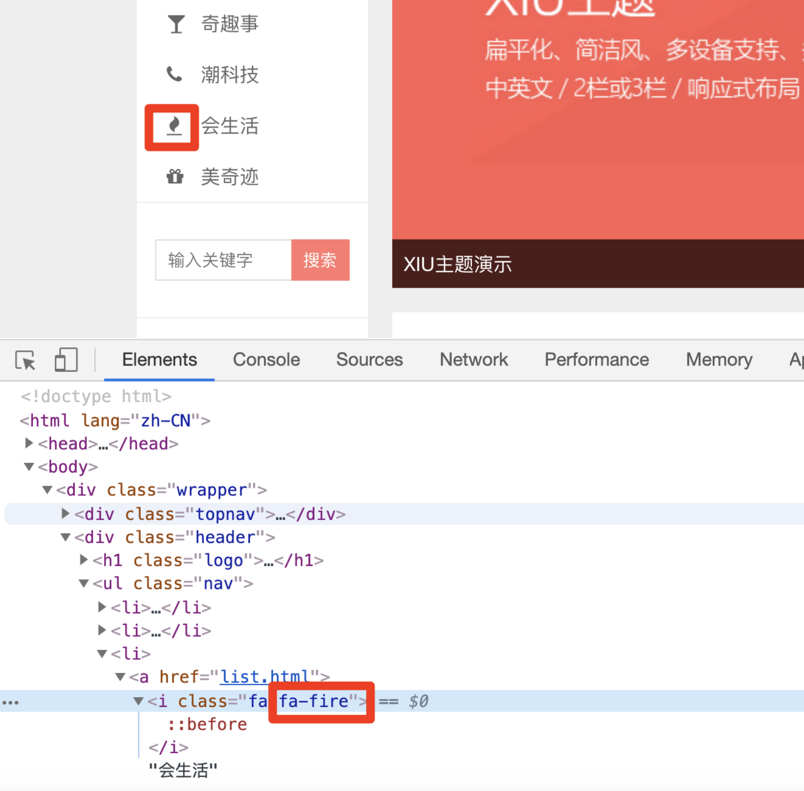
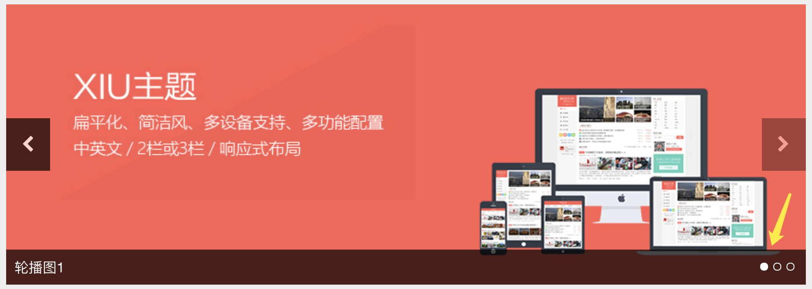
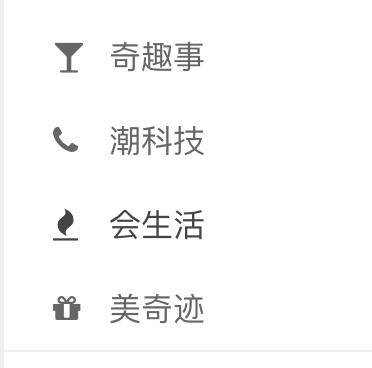

# 项目5天

## 一、考核点

### 1、添加用户前后端验证，并在页面显示提示信息

### 2、修改用户前后端验证并在页面显示提示信息

### 3、不能删除当前登录账户

### 4、修改密码

1. 为修改密码表单中的每一个表单项添加name属性，name属性的值要和接口中的参数名称保持一致

2. 为修改密码表单添加表单提交事件，在事件处理函数中，阻止表单的默认提交行为

3. 获取到用户在表单中输入的内容

4. 调用修改密码接口，实现密码修改功能，如果密码修改成功，跳转到登录页面，让用户重新登录

5. 前后端验证

### 5、项目中密码不能明文显示

### 6、添加分类

1. 为表单中的每一个表单项添加name属性，name属性的值要和接口文档中要求的参数名称保持一致
2. 为表单添加表单提交事件，在事件处理函数中，阻止表单提交的默认行为
3. 获取到用户在表单中输入的内容
4. 调用分类添加接口，实现添加分类功能
5. 添加分类的前后端验证（输入符不符合，类别是否重复等）
6. 添加分类图标，由于引入的是font-awesome字体库，想改变图标，需要查看网站样式，这里直接赋值前台页面的图标

```html
<link rel="stylesheet" href="../assets/vendors/font-awesome/css/font-awesome.css">
```



### 7、分类列表展示

1. 向服务器端发送Ajax请求，索要分类页面数据
2. 使用模板引擎将服务器端返回的数据和HTML模板进行拼接
3. 将拼接好的内容展示在页面中

### 8、分类数据修改

1. 通过事件委托为编辑按钮添加点击事件，在事件处理函数中获取到要修改的分类数据id
2. 根据id调用接口，获取分类数据的详细信息
3. 利用模板引擎将分类数据和HTML字符进行拼接，拼接完成以后将内容渲染到页面中
4. 为修改按钮添加点击事件，在事件处理函数中获取到管理员在表单中输入的内容
5. 调用修改分类数据接口，实现分类数据修改功能。
6. 前后端验证

### 9、分类数据删除

1. 通过事件委托的方式为删除按钮添加点击事件，在点击事件处理函数弹出删除确认框
2. 在用户点击了确认删除后，获取要删除的分类数据的id
3. 调用删除分类数据接口，实现删除分类数据功能，如果分类删除成功，刷新页面

### 10、分类批量删除

### 11、添加文章

1. 获取文章分类数据，并将数据显示在所属分类的下拉列表中供管理员选择
2. 实现文章封面图片的上传，并将上传后的图片地址保存在一个隐藏域中
3. 为添加文章表单中的每一个表单项添加name属性，并且name属性值要和接口中要求的参数名称保持一致
4. 为添加文章表单绑定表单提交事件，在事件处理函数中阻止表单默认提交的行为
5. 获取到管理员在表单中输入的内容
6. 向服务器端发送添加文章的请求，实现文章添加功能，文章添加成功以后要跳转到文章列表页面
7. 前后端验证
8. 分类的Scheme参照api文档

### 12、分页当前页显示为红色

### 13、分页添加首页、尾页功能

### 14、文章编辑

1. 为编辑按钮添加链接，并将文章id作为链接的查询参数传递到文章编辑页面
2. 在文章编辑页面获取地址栏中的id参数
3. 根据id获取文章详细信息，并将文章信息显示在文章编辑表单中
4. 为修改文章表单绑定表单提交事件，在事件处理函数中阻止表单默认提交的行为
5. 获取到用户在表单中输入的内容
6. 向服务器端发送请求，实现修改文章信息功能，如果文章信息修改成功，跳转到文章列表页面

### 15、文章删除

1. 通过事件委托为删除按钮添加点击事件，在事件处理函数中弹出一个删除确认框，跟管理员确认删除操作
2. 在事件处理函数中获取要删除的文章的id
3. 发送Ajax请求，执行删除操作，删除操作成功，刷新页面
4. 删除文章同时是删除上传过的文件

### 16、图片轮播数据添加

1. 实现图片上传功能，并且将上传后的图片地址保存在一个隐藏域中
2. 为图片轮播表单中的每一个表单项添加name属性，name属性的值要和接口中要求的参数名称保持一致
3. 为图片轮播表单绑定表单提交事件，在事件处理函数中阻止表单默认提交的行为
4. 获取到管理员在表单中输入的内容
5. 向服务器端发送请求，实现图片轮播数据添加功能，如果数据添加成功，刷新页面
6. 前端后端验证

### 17、轮播图数据展示

1. 向服务器端发送请求索要图片轮播列表数据
2. 使用模板引擎将图片轮播列表数据和HTML模板进行拼接，拼接完成以后将内容展示在页面中

### 18、图片轮播数据删除

1. 通过事件委托的方式为删除按钮添加点击事件
2. 在事件处理函数中弹出删除确认框
3. 获取到要删除的轮播图数据的id
4. 向服务器端发送请求，执行删除操作，删除操作成功，刷新页面

### 19、网站设置

1. 实现网站logo图片的上传，并且将上传后的图片地址保存在一个隐藏域中
2. 为表单中的每一个表单项添加name属性，name属性的值要和接口文档中要求的参数名称保持一致
3. 为表单绑定提交事件，在事件处理函数中阻止表单默认提交的行为
4. 获取到管理员在表单中输入的内容
5. 向服务器端发送请求，实现网站设置数据的添加功能
6. 前后端验证

### 20、获取网站设置数据

1. 向服务器端发送请求，获取网站设置数据
2. 判断服务器端返回的数据是否为真，如果为真，将数据展示在表单中

### 21、展示登录用户信息

1. 将当前登录的用户信息显示在页面的左侧，头像和名称

### 21、前端获取轮播图数据，动态追加小圆点



### 22、前端页面获取文章分类列表数据



### 23、前端文章列表页面（list.html）

### 24、前端文章详情页面(detail.html)

### 25、前台获取最新评论

### 26、后台评论列表展示

1. 向服务器端发送请求，获取评论列表数据
2. 使用模板引擎将评论列表数据和HTML模板进行拼接，拼接完成以后再将内容展示在页面中
3. 根据分页数据实现分页功能

### 27、评论审核

1. 根据当前评论的状态更改审核按钮中的文字。如果当前评论是未审核状态，按钮中显示批准，如果当前评论是已审核状态，按钮中显示驳回
2. 通过事件委托的方式为审核按钮添加点击事件，在事件处理函数中获取到当前评论的状态
3. 向服务器端发送请求，告诉服务器端评论要更改为什么状态，如果修改成功，刷新页面，让页面中显示最新的数据

### 28、评论删除

1. 通过事件委托的方式为删除按钮添加点击事件，在事件处理函数中弹出删除确认框
2. 获取到管理员要删除的评论id值
3. 向服务器端发送请求，执行删除评论操作，评论如果删除成功，刷新页面

### 29、删除分类时，先删除该类别下的文章

### 30、删除用户时，先删除该用户发布的文章

### 31、添加文章的文本域改用富文本编辑器

### 32、用户列表分页、复合查询

### 33、添加文章或者用户显示在第一条

### 34、站点内容统计：文章、分类、评论

### 35、用户登录页面添加记住我功能

## 二、亮点

自己分析系统的缺陷，业务逻辑，或者缺少哪些功能，目的提高用户体验，添加相应的功能模块，作为答辩的亮点！

## 三、答辩

思路：

1. 从github或码云上下载
2. 项目初始化
3. 说明系统功能
4. 演示功能模块
5. 上传到github或码云


### 

### 

### 

### 

### 

### 

### 


### 